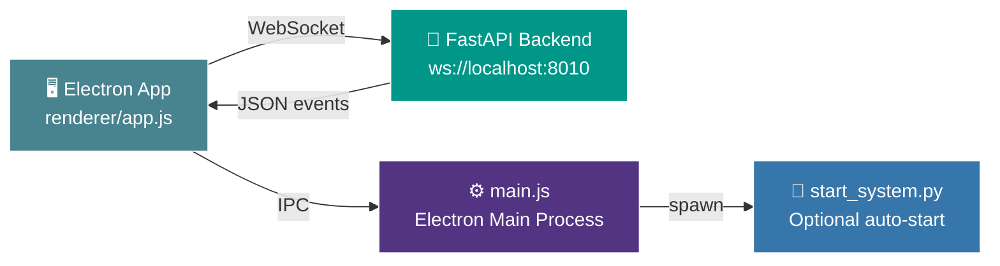

<div align="center">


# ⚡ IRONCLIW-AI · Ironcliw
### *Just A Rather Very Intelligent System*

**The world's most advanced personal AI agent — now fully on Windows.**

[](https://python.org)
[](https://github.com/nandkishorrathodk-art/Ironcliw-ai)
[](https://fastapi.tiangolo.com)
[](https://electronjs.org)
[](https://reactjs.org)
[](https://anthropic.com)
[](LICENSE)
[](jarvis-electron/)
[](https://github.com/nandkishorrathodk-art/Ironcliw-ai/stargazers)
[](https://github.com/nandkishorrathodk-art/Ironcliw-ai)

<br/>

> *"Sometimes you gotta run before you can walk."* — **Tony Stark**


</div>

---

<details>
<summary><h2>📑 Table of Contents</h2></summary>

- [What Is This?](#-what-is-this)
- [System Architecture](#-system-architecture)
- [Data Flow](#-data-flow)
- [Voice Pipeline](#-voice-pipeline)
- [Vision Pipeline](#-vision-pipeline)
- [Ghost Hands Automation](#-ghost-hands--autonomous-automation)
- [Intelligence Core](#-intelligence-core)
- [Platform Support](#%EF%B8%8F-platform-support)
- [Features](#-features)
- [Quick Start](#-quick-start-windows)
- [Electron Desktop App](#-electron-desktop-app-new)
- [Configuration Reference](#-configuration-reference)
- [Project Structure](#-project-structure)
- [API Reference](#-api-reference)
- [Voice Commands](#%EF%B8%8F-voice-commands)
- [Startup Flow](#-startup-flow)
- [ML Model Pipeline](#-ml-model-pipeline)
- [Security Architecture](#-security-architecture)
- [Performance](#-performance)
- [Windows Port Status](#-windows-port-status)
- [Dependencies](#-dependencies)
- [Contributing](#-contributing)
- [Credits & Attribution](#-credits--attribution)
- [License](#-license)

</details>

---

## 🤖 What Is This?

**Ironcliw-AI** is a Windows port of the [drussell23/Ironcliw](https://github.com/drussell23/Ironcliw) personal AI agent — a **self-hosted, voice-activated autonomous assistant** inspired by Iron Man's J.A.R.V.I.S.

It is not just a chatbot. It is a **full autonomous AI operating system** that:

| Capability | Description |
|:-----------|:------------|
| 🧠 **Thinks** | Multi-LLM reasoning (Claude 3.5 Sonnet + Fireworks Llama 70B) |
| 🎤 **Listens** | Wake word "Hey Ironcliw" + Whisper STT with 12-model circuit breaker |
| 🗣️ **Speaks** | Microsoft Neural TTS (`en-GB-RyanNeural`) — sounds human |
| 👁️ **Sees** | Real-time screen capture (30 FPS) + Claude Vision understanding |
| 🤖 **Acts** | Ghost Hands: autonomous browser, keyboard, mouse control |
| 🔐 **Verifies** | ECAPA-TDNN voice biometric speaker verification (159ms) |
| 📚 **Remembers** | Long-term memory via SQLite + ChromaDB semantic cache |
| ☁️ **Scales** | Auto-offloads to GCP Spot VMs when local RAM > 80% |
| 🛡️ **Self-Heals** | Circuit breakers, ML-powered recovery, auto-reload |

### How It Works (30-Second Version)

```
You say "Hey Ironcliw, open Chrome and search for AI news"
  ↓
Whisper STT converts speech → text
  ↓
ECAPA-TDNN verifies it's YOUR voice (159ms)
  ↓
Claude 3.5 Sonnet understands your intent
  ↓
Ghost Hands launches Chrome via pyautogui
  ↓
Vision system confirms Chrome is open (mss capture)
  ↓
Ironcliw types "AI news" and presses Enter
  ↓
Neural TTS says "Done sir, here are the latest AI news results"
```

---

## 🏗️ System Architecture

### High-Level Overview


---

## 🔄 Data Flow

### Request Processing Pipeline


### Multi-LLM Routing Decision


---

## 🎤 Voice Pipeline

### Complete Voice Processing Flow


### Voice Biometric Authentication


---

## 👁️ Vision Pipeline

### Screen Understanding Flow


---

## 🤖 Ghost Hands — Autonomous Automation

### Automation Architecture


### Cross-Platform App Launcher


---

## 🧠 Intelligence Core

### Memory & Learning System


### Situational Awareness Intelligence (SAI)


---

## 🖥️ Platform Support

| Platform | Status | Details |
|:---------|:------:|:--------|
| **Windows 10** | ✅ | Full support — pywin32, pyautogui, mss, pycaw |
| **Windows 11** | ✅ | Full support — toast notifications, Windows Terminal |
| **macOS** | ⚠️ | Upstream — see [drussell23/Ironcliw](https://github.com/drussell23/Ironcliw) |
| **Linux** | 🔧 | Partial — Platform Abstraction Layer compatible |

### Windows Feature Matrix

| Feature | Library | Status |
|:--------|:--------|:------:|
| Window Management | `pywin32` / `win32gui` | ✅ |
| Mouse & Keyboard | `pyautogui` | ✅ |
| Screen Capture | `mss` + `Pillow` | ✅ |
| Notifications | `plyer` → `win10toast` | ✅ |
| Volume Control | `pycaw` (COM WASAPI) | ✅ |
| Brightness | WMI + PowerShell | ✅ |
| Screen Lock | `LockWorkStation()` | ✅ |
| Lock Detection | `LogonUI.exe` check | ✅ |
| Sleep Prevention | `SetThreadExecutionState` | ✅ |
| Clipboard | `pyperclip` → `clip.exe` | ✅ |
| App Launch | 4-strategy chain | ✅ |
| System Info | `psutil` | ✅ |
| Audio Devices | `sounddevice` | ✅ |
| File Open | `os.startfile()` | ✅ |

---

## ✨ Features

### 🧠 Core Intelligence

<details>
<summary><b>Multi-LLM Routing Engine</b></summary>

Ironcliw uses an intelligent router to pick the best LLM for each query:

| Model | Provider | Use Case | Latency |
|:------|:---------|:---------|:--------|
| Claude 3.5 Sonnet | Anthropic | Complex reasoning, code, vision | ~2s |
| Llama 3.1 70B | Fireworks AI | Fast Q&A, conversation | ~500ms |
| Groq Mixtral | Groq | Ultra-fast fallback | ~200ms |

**Cost Optimization**: Routes 70% of queries to Fireworks (cheaper) while keeping Claude for complex tasks.

</details>

<details>
<summary><b>Goal Inference Engine</b></summary>

Ironcliw doesn't just respond to commands — it **infers your intent**:

```
User: "I need to send an email to John"
Ironcliw infers:
  → Open email client (Outlook)
  → Create new message
  → Set recipient: John (from contacts)
  → Wait for user to dictate content
  → Confirm before sending
```

</details>

<details>
<summary><b>Long-Term Memory System</b></summary>

| Memory Type | Storage | TTL | Purpose |
|:------------|:--------|:----|:--------|
| Conversation | SQLite | Permanent | Chat history |
| Semantic | ChromaDB | 24 hours | Visual context |
| Learning | SQLite | Permanent | User preferences |
| Voice | Cloud SQL | Permanent | Speaker profiles |

</details>

### 🎤 Voice System

<details>
<summary><b>Hybrid STT Architecture</b></summary>

```
Audio Input
    ↓
[Whisper base - LOCAL] ←── Primary (200ms)
    ↓ (on failure)
[Whisper small - LOCAL] ←── Fallback 1
    ↓ (on failure)
[Cloud STT API] ←── Fallback 2
    ↓ (on failure)
[Circuit Breaker] ←── 12 model rotation
    ↓
Text Output
```

**Performance**: 
- Cold start: ~2.3s (model loading)
- Warm inference: ~200ms per utterance
- Supported languages: 97+ (via Whisper multilingual)

</details>

<details>
<summary><b>Neural Text-to-Speech</b></summary>

Ironcliw speaks with Microsoft's Neural TTS engine:

| Voice | Language | Style |
|:------|:---------|:------|
| `en-GB-RyanNeural` | English (UK) | Professional, warm |
| `en-US-GuyNeural` | English (US) | Fallback |

**Technology Stack:**
- Primary: `edge-tts` (free, no API key needed)
- Fallback: `pyttsx3` (offline SAPI5)
- Output: Real-time MP3 streaming via WebSocket

</details>

<details>
<summary><b>ECAPA-TDNN Voice Biometrics</b></summary>

| Metric | Value |
|:-------|:------|
| Model | ECAPA-TDNN (SpeechBrain) |
| Embedding Dimension | 192D |
| Verification Time | ~159ms |
| Threshold | 0.75 cosine similarity |
| Enrolled Profiles | Per-user |
| Backend Options | Local / Cloud Run / Docker |

**Enrollment**: Say "Ironcliw, learn my voice" — records 3 samples, extracts embeddings, stores in database.

</details>

### 👁️ Vision & Automation

<details>
<summary><b>Real-Time Screen Understanding</b></summary>

| Feature | Spec |
|:--------|:-----|
| Capture Rate | 30 FPS (configurable) |
| Library | `mss` (GPU-accelerated) |
| Analysis | Claude Vision API |
| OCR | Built-in text extraction |
| Cache | ChromaDB semantic (24h TTL) |
| Multi-monitor | Yes (all displays) |

</details>

<details>
<summary><b>Ghost Hands Automation</b></summary>

Ironcliw can control your computer autonomously:

| Action | Method | Platform |
|:-------|:-------|:---------|
| Click | `pyautogui.click()` | Windows/macOS |
| Type | `pyautogui.write()` | Windows/macOS |
| Hotkey | `pyautogui.hotkey()` | Windows/macOS |
| App Launch | `os.startfile()` / `open -a` | Windows/macOS |
| Window Focus | `win32gui.SetForegroundWindow()` | Windows |
| Browser | Selenium / CDP | Cross-platform |
| Clipboard | `pyperclip` | Cross-platform |

</details>

### ☁️ Cloud Integration

<details>
<summary><b>GCP Auto-Scaling Architecture</b></summary>

When local RAM exceeds 80%, Ironcliw automatically deploys to GCP:

| Resource | Spec | Cost |
|:---------|:-----|:-----|
| VM Type | `e2-highmem-4` Spot | $0.029/hr |
| RAM | 32 GB | — |
| vCPUs | 4 | — |
| Auto-idle | Scale to zero after 15min | — |
| Region | `us-central1` | — |

**Total monthly cost**: ~$15-20 (typical usage)

</details>

---

## 🚀 Quick Start (Windows)

### Prerequisites

| Requirement | Version | Check Command |
|:------------|:--------|:-------------|
| Python | 3.12+ | `python --version` |
| Node.js | 18+ | `node --version` |
| Git | Any | `git --version` |
| .NET SDK | 8.0+ | `dotnet --version` |

### Step-by-Step Installation

#### 1. Clone the Repository
```powershell
git clone https://github.com/nandkishorrathodk-art/Ironcliw-ai.git
cd Ironcliw-ai
```

#### 2. Install Python Dependencies
```powershell
# Core dependencies
python -m pip install -r requirements.txt

# Windows-specific
python -m pip install -r requirements-windows.txt

# Essential extras
python -m pip install edge-tts mss pyautogui pywin32 pyttsx3
```

#### 3. Install Frontend
```powershell
cd frontend
npm install
cd ..
```

#### 4. Configure Environment
```powershell
# Copy Windows template
copy .env.windows .env

# Edit and add your API keys
notepad .env
```

**Minimum required API keys:**
```env
ANTHROPIC_API_KEY=sk-ant-api03-xxxxx
FIREWORKS_API_KEY=fw-xxxxx
```

#### 5. Launch Ironcliw
```powershell
python start_system.py
```

#### 6. Open in Browser
```
http://localhost:3000
```

> **💡 First launch** takes ~60-90 seconds (model loading). Subsequent launches are faster (~30s).
> Say **"Hey Ironcliw"** to activate voice control.

---

## 🖥️ Electron Desktop App *(NEW)*

> **Phase 13** — A fully native sci-fi desktop interface for Ironcliw, built with Electron 29.

The `jarvis-electron/` folder contains a standalone desktop application that replaces the browser-based frontend with a **premium, holographic, glassmorphism UI** — inspired by Tony Stark's J.A.R.V.I.S. interface.

### ✨ Electron App Features

| Feature | Description |
|:--------|:------------|
| 🎨 **Holographic Orb** | Animated 3D rotating rings with pulsing reactive core |
| 🌌 **Particle Canvas** | Real-time floating particle field background |
| 📊 **Live Metrics** | CPU, RAM, Network bars auto-updating from backend |
| 🔊 **Waveform Canvas** | Live audio visualizer during voice input |
| 🤖 **Boot Sequence** | Cinematic startup animation with progress bar |
| 💬 **Chat Log** | Conversation history with Ironcliw/User bubbles |
| ⚡ **Quick Commands** | One-click buttons for common voice commands |
| 🎤 **Push-to-Talk** | Click mic button to record and send voice |
| 🪟 **Frameless Window** | Custom title bar with minimize/maximize/close |
| 🔌 **Auto-Connect** | WebSocket reconnection to backend on `ws://localhost:8010` |

### 🚀 Launch the Electron App

#### Prerequisites
```powershell
# Node.js 18+ required
node --version   # should show v18 or higher
```

#### Install & Run
```powershell
# 1. Navigate to the electron app folder
cd jarvis-electron

# 2. Install dependencies
npm install

# 3. Start the backend first (in another terminal)
cd ..
python start_system.py

# 4. Launch the desktop app
cd jarvis-electron
npm start
```

#### Build Windows Installer
```powershell
npm run build
# Output: dist/Ironcliw Setup 1.0.0.exe
```

### 📁 Electron App Structure

```
jarvis-electron/
├── main.js              # Electron main process — window creation, IPC
├── preload.js           # Secure context bridge (Node ↔ Renderer)
├── package.json         # App config + electron-builder settings
└── renderer/
    ├── index.html       # 3-panel sci-fi UI layout
    ├── style.css        # Full glassmorphism + neon + animations
    └── app.js           # WebSocket client + all UI interactivity
```

### 🔌 How It Connects to JARVIS Backend



The Electron app connects via WebSocket to the existing FastAPI backend at `ws://localhost:8010`. No changes to the backend are needed — it works as a drop-in replacement for the browser UI.

---

## 🔧 Configuration Reference

### Environment Variables (`.env`)

<details>
<summary><b>🧠 LLM Configuration</b></summary>

| Variable | Default | Description |
|:---------|:--------|:------------|
| `Ironcliw_LLM_PROVIDER` | `fireworks` | Primary LLM: `fireworks`, `claude`, `groq` |
| `ANTHROPIC_API_KEY` | — | Claude API key |
| `FIREWORKS_API_KEY` | — | Fireworks AI API key |
| `Ironcliw_GROQ_API_KEY` | — | Groq API key (fallback) |
| `Ironcliw_LLM_TEMPERATURE` | `0.7` | Response creativity (0-1) |
| `Ironcliw_LLM_MAX_TOKENS` | `4096` | Max response length |

</details>

<details>
<summary><b>🎤 Voice Configuration</b></summary>

| Variable | Default | Description |
|:---------|:--------|:------------|
| `WHISPER_MODEL_SIZE` | `base` | STT model: tiny/base/small/medium |
| `Ironcliw_TTS_VOICE` | `en-GB-RyanNeural` | Neural TTS voice name |
| `Ironcliw_VOICE_BIOMETRIC_ENABLED` | `false` | Enable voice auth |
| `Ironcliw_WAKE_WORD` | `hey jarvis` | Wake word phrase |
| `Ironcliw_VOICE_GAIN` | `1.0` | Microphone gain multiplier |

</details>

<details>
<summary><b>⚡ Performance Configuration</b></summary>

| Variable | Default | Description |
|:---------|:--------|:------------|
| `Ironcliw_ML_DEVICE` | `cpu` | ML device: `cpu`, `cuda`, `directml` |
| `Ironcliw_LAZY_LOAD_MODELS` | `true` | Load models on demand |
| `Ironcliw_MEMORY_LIMIT` | `4096` | RAM target (MB) |
| `Ironcliw_DYNAMIC_PORTS` | `false` | Auto-assign ports |
| `Ironcliw_MAX_WORKERS` | `4` | Thread pool size |

</details>

<details>
<summary><b>🪟 Windows-Specific Configuration</b></summary>

| Variable | Default | Description |
|:---------|:--------|:------------|
| `Ironcliw_AUTO_BYPASS_WINDOWS` | `true` | Skip voice auth on Windows |
| `Ironcliw_DISABLE_SWIFT_EXTENSIONS` | `true` | Disable macOS Swift |
| `Ironcliw_DISABLE_RUST_EXTENSIONS` | `true` | Disable Rust layer |
| `Ironcliw_DISABLE_COREML` | `true` | Disable CoreML |
| `Ironcliw_NOTIFICATION_PROVIDER` | `win10toast` | Notification backend |

</details>

<details>
<summary><b>☁️ Cloud Configuration</b></summary>

| Variable | Default | Description |
|:---------|:--------|:------------|
| `Ironcliw_SKIP_GCP` | `true` | Disable GCP integration |
| `Ironcliw_SKIP_DOCKER` | `true` | Disable Docker ECAPA |
| `Ironcliw_PREFER_CLOUD_RUN` | `false` | Use Cloud Run ECAPA |
| `Ironcliw_GCP_PROJECT_ID` | — | GCP project ID |
| `Ironcliw_SPOT_VM_ZONE` | `us-central1-a` | Spot VM zone |

</details>

---

## 📁 Project Structure

```
Ironcliw-ai/
│
├── 📄 start_system.py              # 🚀 Main launcher (22,000+ lines)
├── 📄 unified_supervisor.py        # Process lifecycle manager
├── 📄 loading_server.py            # Startup loading page server
├── 📄 .env.windows                 # Windows config template
├── 📄 WINDOWS_PORT_BLUEPRINT.md    # 700-line macOS→Windows guide
├── 📄 SECURITY.md                  # Security policy
├── 📄 LICENSE                      # MIT License
│
├── 🖥️ jarvis-electron/             # NEW: Electron Desktop App (Phase 13)
│   ├── main.js                     # Electron main process
│   ├── preload.js                  # Secure context bridge
│   ├── package.json                # App config + electron-builder
│   └── renderer/
│       ├── index.html              # 3-panel holographic UI
│       ├── style.css               # Glassmorphism + neon animations
│       └── app.js                  # WebSocket client + interactivity
│
├── 🐍 backend/                     # FastAPI Python backend
│   ├── main.py                     # Entry point (UTF-8 bootstrap)
│   │
│   ├── 📡 api/                     # REST API Layer
│   │   ├── action_executors.py     # Workflow action handlers
│   │   ├── broadcast_router.py     # WebSocket broadcast
│   │   ├── jarvis_voice_api.py     # Voice REST endpoints
│   │   ├── websocket_router.py     # WebSocket routing
│   │   ├── workflow_engine.py      # Multi-step workflow engine
│   │   └── workflow_parser.py      # Action type definitions
│   │
│   ├── 🧠 agi_os/                  # AGI Operating System Layer
│   │   ├── realtime_voice_communicator.py   # edge-tts Neural TTS
│   │   ├── notification_bridge.py           # Cross-platform notifications
│   │   └── proactive_intelligence.py        # Self-initiated actions
│   │
│   ├── 🎤 voice/                   # Voice Processing
│   │   ├── hybrid_stt_router.py             # Whisper + Cloud STT
│   │   ├── speaker_verification_service.py  # ECAPA biometrics
│   │   ├── jarvis_agent_voice.py            # Voice agent logic
│   │   └── voice_unlock_integration.py      # Voice unlock flow
│   │
│   ├── 👁️ vision/                  # Vision System
│   │   ├── continuous_screen_analyzer.py    # 30 FPS capture loop
│   │   ├── reliable_screenshot_capture.py   # mss capture engine
│   │   └── adapters/page.py                 # Web page adapter
│   │
│   ├── 🤖 ghost_hands/             # Autonomous Automation
│   │   ├── background_actuator.py           # pyautogui controller
│   │   ├── yabai_aware_actuator.py          # Window-aware actions
│   │   └── browser_controller.py            # Browser automation
│   │
│   ├── 💡 intelligence/            # AI Intelligence
│   │   ├── learning_database.py             # Adaptive learning
│   │   ├── hybrid_database_sync.py          # Cloud SQL sync
│   │   └── situational_awareness.py         # SAI engine
│   │
│   ├── ⚙️ core/                    # Core Infrastructure
│   │   ├── pipeline.py                      # Request pipeline
│   │   ├── orchestrator.py                  # Service orchestrator
│   │   ├── process_detector.py              # Advanced PID detection
│   │   ├── transport_handlers.py            # HTTP/WS handlers
│   │   └── secret_manager.py                # GCP Secret Manager
│   │
│   ├── 🔧 autonomy/                # System Control
│   │   ├── hardware_control.py              # Volume/brightness/sleep
│   │   └── action_executor.py               # Autonomous action runner
│   │
│   ├── 🖥️ platform_adapter/        # Cross-Platform Abstraction
│   │   ├── abstraction.py                   # PlatformInterface + factory
│   │   ├── windows_platform.py              # Windows implementation
│   │   ├── macos_platform.py                # macOS implementation
│   │   ├── linux_platform.py                # Linux implementation
│   │   ├── detector.py                      # OS detection
│   │   └── base.py                          # Shared utilities
│   │
│   ├── 🔐 voice_unlock/            # Voice Biometric Auth
│   │   ├── ml_engine_registry.py            # ML model management
│   │   ├── startup_integration.py           # Boot-time validation
│   │   ├── intelligent_voice_unlock_service.py
│   │   ├── unified_voice_cache_manager.py
│   │   └── cloud_ecapa_client.py            # Cloud Run ECAPA
│   │
│   ├── 🔌 system_control/          # OS Integration
│   │   ├── fast_app_launcher.py             # Cross-platform launcher
│   │   ├── dynamic_app_controller.py        # Intelligent app control
│   │   └── location_service.py             # Geo-location
│   │
│   ├── 🔌 mcp_integration/         # MCP Tools Integration
│   │   └── (Model Context Protocol tools)
│   │
│   ├── 🧪 tests/                   # Test Suite
│   │   ├── archive/                         # Legacy tests
│   │   └── test_windows_platform.py         # Windows platform tests
│   │
│   └── 🪟 windows_native/          # C# Native Extensions
│       ├── AudioEngine/                     # WASAPI audio capture
│       ├── ScreenCapture/                   # GDI+ screen capture
│       └── SystemControl/                   # Win32 API wrappers
│
└── ⚛️ frontend/                    # React 18 UI (Browser-based)
    ├── package.json
    └── src/
        ├── App.js                           # Main app component
        ├── index.js                         # Entry point
        └── components/
            └── JarvisVoice.js               # Voice UI + WebSocket
```

---

## 📡 API Reference

### REST Endpoints

| Method | Endpoint | Description |
|:-------|:---------|:------------|
| `POST` | `/api/chat` | Send message to Ironcliw |
| `POST` | `/api/voice/transcribe` | Upload audio for STT |
| `GET` | `/api/status` | System health check |
| `GET` | `/api/system/info` | CPU, RAM, disk info |
| `POST` | `/api/vision/capture` | Capture screenshot |
| `POST` | `/api/vision/analyze` | Analyze screen content |
| `POST` | `/api/actions/execute` | Execute automation action |
| `GET` | `/api/voice/profiles` | List voice profiles |
| `POST` | `/api/voice/enroll` | Start voice enrollment |
| `GET` | `/api/memory/search` | Search conversation history |
| `POST` | `/api/system/lock` | Lock workstation |
| `POST` | `/api/system/volume` | Set volume level |

### WebSocket Events

| Event | Direction | Payload |
|:------|:----------|:--------|
| `audio_stream` | Client → Server | Raw audio bytes |
| `transcription` | Server → Client | `{text, confidence}` |
| `tts_audio` | Server → Client | MP3 audio bytes |
| `proactive_notification` | Server → Client | `{title, message, urgency}` |
| `system_status` | Server → Client | `{cpu, ram, disk}` |
| `vision_update` | Server → Client | `{screenshot, analysis}` |
| `ghost_hands_action` | Server → Client | `{action, target, status}` |

---

## 🗣️ Voice Commands

### General
| Say This | Ironcliw Does |
|:---------|:------------|
| "Hey Ironcliw" | Activate listening |
| "What can you do?" | List capabilities |
| "What time is it?" | Speak current time |
| "Tell me a joke" | Generate and speak joke |
| "Goodbye" | End conversation |

### System Control
| Say This | Ironcliw Does |
|:---------|:------------|
| "Set volume to 50%" | Adjust system volume (pycaw) |
| "Lock my screen" | `LockWorkStation()` |
| "What's my RAM usage?" | Report system stats |
| "Battery status" | Report battery level |
| "Prevent sleep" | `SetThreadExecutionState` |

### App Control
| Say This | Ironcliw Does |
|:---------|:------------|
| "Open Chrome" | Launch Chrome (4-strategy) |
| "Open Spotify" | Launch Spotify |
| "Open VS Code" | Launch code editor |
| "Open Settings" | Launch `ms-settings:` |
| "Open Terminal" | Launch Windows Terminal |
| "Close this window" | `win32gui` close active |

### Vision & Screen
| Say This | Ironcliw Does |
|:---------|:------------|
| "Can you see my screen?" | Capture + analyze |
| "What app am I using?" | Active window detection |
| "Read what's on screen" | OCR + text extraction |
| "Start monitoring" | Begin 30 FPS capture |
| "Take a screenshot" | Save PNG to disk |

### Voice Biometrics
| Say This | Ironcliw Does |
|:---------|:------------|
| "Ironcliw, learn my voice" | Start enrollment (3 samples) |
| "Who am I?" | Speaker identification |
| "Verify me" | Run biometric check |

---

## ⚡ Startup Flow


---

## 🔬 ML Model Pipeline

| Model | Purpose | Size | Load Time | Device |
|:------|:--------|:-----|:----------|:-------|
| Whisper `base` | Speech-to-Text | 142 MB | ~2.3s | CPU |
| ECAPA-TDNN | Speaker Verification | ~30 MB | Fast-fail* | CPU/Cloud |
| Claude 3.5 Sonnet | Reasoning & Vision | Cloud | N/A | API |
| Fireworks Llama 70B | Fast Q&A | Cloud | N/A | API |

> ***Fast-fail**: On Windows without `speechbrain`, ECAPA fails immediately (0ms) instead of blocking for 25s. Falls back to Cloud Run endpoint.

---

## 🔐 Security Architecture


### Security Features

| Feature | Implementation | Status |
|:--------|:---------------|:------:|
| API Key Protection | `.env` only, never in code | ✅ |
| Network Isolation | `localhost` binding only | ✅ |
| Voice Auth | ECAPA-TDNN biometric (optional) | ✅ |
| Log Injection | CWE-117/532 sanitization | ✅ |
| File Permissions | Atomic writes, `0o600` | ✅ |
| Input Sanitization | AppleScript/SQL injection guard | ✅ |
| FIPS Compliance | `hashlib(usedforsecurity=False)` | ✅ |

---

## 📊 Performance

### Benchmarks (Acer Swift Neo — 16GB RAM, 512GB SSD)

| Metric | Value | Notes |
|:-------|:------|:------|
| Cold Start | ~60-90s | First launch with model loading |
| Warm Start | ~30s | Models cached |
| STT Latency | ~200ms | Whisper base, warm |
| TTS Latency | ~300ms | edge-tts streaming |
| Vision Capture | ~33ms | 30 FPS via mss |
| Voice Auth | ~159ms | ECAPA-TDNN |
| API Response | ~500ms-2s | Depends on LLM |
| RAM Usage | ~3-4 GB | Steady state |
| Peak RAM | ~6-8 GB | During model loading |

### Optimization Tips

| Issue | Solution |
|:------|:---------|
| High RAM (>80%) | Set `Ironcliw_MEMORY_LIMIT=3072` |
| Slow startup | Set `Ironcliw_LAZY_LOAD_MODELS=true` |
| ECAPA blocking | Already fixed (fast-fail) |
| Port conflicts | Kill stuck ports or change in `.env` |
| No GPU | `Ironcliw_ML_DEVICE=cpu` (default) |

---

## 🔄 Windows Port Status

### Phase History

| Phase | Description | Status |
|:------|:------------|:------:|
| 1-5 | Core imports, path fixes | ✅ |
| 6 | `os.uname()` → `platform.uname()` | ✅ |
| 7 | `fcntl` → `msvcrt` guards | ✅ |
| 8 | Neural TTS (`en-GB-RyanNeural`) | ✅ |
| 9 | Vision: `screencapture` → `mss` | ✅ |
| 10 | Ghost Hands: `cliclick` → `pyautogui` | ✅ |
| 11 | ECAPA fast-fail, UTF-8, logging fixes | ✅ |
| **12** | **Cross-platform porting (current)** | **✅** |
| 13 | Full notification system | ✅ |
| 14 | Hardware control (volume/brightness) | ✅ |
| 15-20 | Advanced features | 🔧 |

### Phase 12 Changes (Latest)

| File | Change |
|:-----|:-------|
| `fast_app_launcher.py` | Full rewrite — 4 Windows launch strategies |
| `startup_integration.py` | Keychain→cmdkey, lsof→taskkill, pkill→taskkill |
| `ml_engine_registry.py` | ECAPA fast-fail on ERROR state |
| `requirements-windows.txt` | Added plyer, pycaw, comtypes, pyperclip |

---

## 📦 Dependencies

### Backend (Python)

| Package | Version | Purpose |
|:--------|:--------|:--------|
| `fastapi` | Latest | Web framework |
| `uvicorn` | Latest | ASGI server |
| `websockets` | Latest | WebSocket support |
| `anthropic` | Latest | Claude API client |
| `fireworks-ai` | Latest | Fireworks API client |
| `openai-whisper` | Latest | Local STT |
| `edge-tts` | Latest | Neural TTS (free) |
| `pyautogui` | ≥0.9.54 | Mouse & keyboard |
| `pywin32` | ≥306 | Windows APIs |
| `mss` | ≥9.0 | Screen capture |
| `Pillow` | ≥10.0 | Image processing |
| `chromadb` | Latest | Vector database |
| `psutil` | Latest | System monitoring |
| `pycaw` | Latest | Volume control |
| `plyer` | ≥2.1 | Notifications |
| `comtypes` | ≥1.2 | COM interface |
| `pyperclip` | ≥1.8 | Clipboard |
| `sounddevice` | ≥0.5 | Audio I/O |
| `pyttsx3` | Latest | Fallback TTS |

### Frontend (Node.js)

| Package | Version | Purpose |
|:--------|:--------|:--------|
| `react` | 18.x | UI framework |
| `react-dom` | 18.x | DOM rendering |
| `socket.io-client` | Latest | WebSocket client |

### Optional (Cloud)

| Package | Purpose |
|:--------|:--------|
| `google-cloud-compute` | GCP Spot VMs |
| `google-cloud-sql` | Cloud SQL profiles |
| `speechbrain` | ECAPA local (GPU) |
| `torchaudio` | Audio ML (GPU) |
| `docker` | Docker ECAPA |

---

## 🤝 Contributing

Contributions are welcome! This is an active Windows port with ongoing improvements.

### How to Contribute

1. **Fork** the repository
2. **Create** a feature branch: `git checkout -b feat/your-feature`
3. **Commit**: `git commit -m "feat: add your feature"`
4. **Push**: `git push origin feat/your-feature`
5. **Open** a Pull Request

### Priority Areas

| Area | Description | Difficulty |
|:-----|:------------|:-----------|
| 🧪 Testing | Add Windows-specific tests | Medium |
| 📢 Notifications | Enhanced toast with action buttons | Easy |
| 🔊 Audio | WASAPI native capture | Hard |
| 🤖 Automation | Browser profile management | Medium |
| 📱 System Tray | `pystray` integration | Easy |
| 🌐 i18n | Multi-language support | Medium |

### Code Style

- Python: Follow PEP 8, use type hints
- Cross-platform: Always use `sys.platform == "win32"` guards
- Async: Use `async/await` for all I/O operations
- Logging: Use `logging` module, never `print()` in production

---

## 📜 Credits & Attribution

<div align="center">

| Role | Credit |
|:-----|:-------|
| **Original Ironcliw** | [Derek Russell (drussell23)](https://github.com/drussell23) — [Ironcliw](https://github.com/drussell23/Ironcliw) |
| **Windows Port** | [Nandkishor Rathod](https://github.com/nandkishorrathodk-art) |
| **Neural TTS** | Microsoft Azure — `en-GB-RyanNeural` via [edge-tts](https://github.com/rany2/edge-tts) |
| **LLM** | [Anthropic Claude](https://anthropic.com) + [Fireworks AI](https://fireworks.ai) |
| **STT** | [OpenAI Whisper](https://github.com/openai/whisper) |
| **Voice Biometrics** | [SpeechBrain ECAPA-TDNN](https://speechbrain.github.io) |
| **Vision** | [mss](https://github.com/BoboTiG/python-mss) + [Pillow](https://pillow.readthedocs.io) |

</div>

---

## 📄 License

**MIT License** — see [LICENSE](LICENSE)

Original Ironcliw project by [drussell23](https://github.com/drussell23). 
Windows port and modifications by [Nandkishor Rathod](https://github.com/nandkishorrathodk-art) (2026).

```
MIT License

Copyright (c) 2026 Nandkishor Rathod

Permission is hereby granted, free of charge, to any person obtaining a copy
of this software and associated documentation files (the "Software"), to deal
in the Software without restriction, including without limitation the rights
to use, copy, modify, merge, publish, distribute, sublicense, and/or sell
copies of the Software...
```

---

<div align="center">


### ⚡ Ironcliw-AI · Ironcliw

**Built with ❤️ by [Nandkishor Rathod](https://github.com/nandkishorrathodk-art)**

*"I am Iron Man."* — Tony Stark

<br/>

[](https://github.com/nandkishorrathodk-art)
[](https://github.com/nandkishorrathodk-art/Ironcliw-ai)


</div>
