<div align="center">


# ⚡ IRONCLIW-AI · JARVIS
### *Just A Rather Very Intelligent System*

**The world's most advanced personal AI agent — now fully on Windows.**

[](https://python.org)
[](https://github.com/nandkishorrathodk-art/Ironcliw-ai)
[](https://fastapi.tiangolo.com)
[](https://reactjs.org)
[](https://anthropic.com)
[](LICENSE)
[](WINDOWS_PORT_BLUEPRINT.md)
[](https://github.com/nandkishorrathodk-art/Ironcliw-ai/stargazers)
[](https://github.com/nandkishorrathodk-art/Ironcliw-ai)

<br/>

> *"Sometimes you gotta run before you can walk."* — **Tony Stark**


</div>

---

<details>
<summary><h2>📑 Table of Contents</h2></summary>

- [What Is This?](#-what-is-this)
- [System Architecture](#-system-architecture)
- [Data Flow](#-data-flow)
- [Voice Pipeline](#-voice-pipeline)
- [Vision Pipeline](#-vision-pipeline)
- [Ghost Hands Automation](#-ghost-hands--autonomous-automation)
- [Intelligence Core](#-intelligence-core)
- [Platform Support](#%EF%B8%8F-platform-support)
- [Features](#-features)
- [Quick Start](#-quick-start-windows)
- [Configuration Reference](#-configuration-reference)
- [Project Structure](#-project-structure)
- [API Reference](#-api-reference)
- [Voice Commands](#%EF%B8%8F-voice-commands)
- [Startup Flow](#-startup-flow)
- [ML Model Pipeline](#-ml-model-pipeline)
- [Security Architecture](#-security-architecture)
- [Performance](#-performance)
- [Windows Port Status](#-windows-port-status)
- [Dependencies](#-dependencies)
- [Contributing](#-contributing)
- [Credits & Attribution](#-credits--attribution)
- [License](#-license)

</details>

---

## 🤖 What Is This?

**Ironcliw-AI** is a Windows port of the [drussell23/JARVIS](https://github.com/drussell23/JARVIS) personal AI agent — a **self-hosted, voice-activated autonomous assistant** inspired by Iron Man's J.A.R.V.I.S.

It is not just a chatbot. It is a **full autonomous AI operating system** that:

| Capability | Description |
|:-----------|:------------|
| 🧠 **Thinks** | Multi-LLM reasoning (Claude 3.5 Sonnet + Fireworks Llama 70B) |
| 🎤 **Listens** | Wake word "Hey JARVIS" + Whisper STT with 12-model circuit breaker |
| 🗣️ **Speaks** | Microsoft Neural TTS (`en-GB-RyanNeural`) — sounds human |
| 👁️ **Sees** | Real-time screen capture (30 FPS) + Claude Vision understanding |
| 🤖 **Acts** | Ghost Hands: autonomous browser, keyboard, mouse control |
| 🔐 **Verifies** | ECAPA-TDNN voice biometric speaker verification (159ms) |
| 📚 **Remembers** | Long-term memory via SQLite + ChromaDB semantic cache |
| ☁️ **Scales** | Auto-offloads to GCP Spot VMs when local RAM > 80% |
| 🛡️ **Self-Heals** | Circuit breakers, ML-powered recovery, auto-reload |

### How It Works (30-Second Version)

```
You say "Hey JARVIS, open Chrome and search for AI news"
  ↓
Whisper STT converts speech → text
  ↓
ECAPA-TDNN verifies it's YOUR voice (159ms)
  ↓
Claude 3.5 Sonnet understands your intent
  ↓
Ghost Hands launches Chrome via pyautogui
  ↓
Vision system confirms Chrome is open (mss capture)
  ↓
JARVIS types "AI news" and presses Enter
  ↓
Neural TTS says "Done sir, here are the latest AI news results"
```

---

## 🏗️ System Architecture

### High-Level Overview


---

## 🔄 Data Flow

### Request Processing Pipeline

```mermaid
sequenceDiagram
    participant U as 👤 User
    participant F as ⚛️ Frontend
    participant API as 🐍 FastAPI
    participant STT as 🎤 Whisper STT
    participant BIO as 🔐 ECAPA Biometric
    participant LLM as 🧠 Claude/Fireworks
    participant GH as 🤖 Ghost Hands
    participant VIS as 👁️ Vision
    participant TTS as 🗣️ Neural TTS
    participant MEM as 💾 Memory

    U->>F: Voice: "Hey JARVIS, open Spotify"
    F->>API: WebSocket: audio stream
    API->>STT: Raw audio bytes
    
    Note over STT: Whisper base model<br/>Local inference ~200ms
    STT-->>API: Text: "hey jarvis open spotify"

    API->>BIO: Speaker verification
    Note over BIO: ECAPA-TDNN 192D embedding<br/>Cosine similarity check
    BIO-->>API: ✅ Speaker: Nandkishor (0.87 confidence)

    API->>MEM: Fetch conversation context
    MEM-->>API: Last 10 messages + user preferences

    API->>LLM: Prompt + context + intent
    Note over LLM: Claude 3.5 Sonnet<br/>Goal inference + action planning
    LLM-->>API: Action: launch_app("Spotify")

    API->>GH: Execute: launch Spotify
    Note over GH: pyautogui / os.startfile<br/>Cross-platform launcher
    GH-->>API: ✅ Spotify launched

    API->>VIS: Verify: is Spotify visible?
    Note over VIS: mss screen capture<br/>Claude Vision check
    VIS-->>API: ✅ Spotify window detected

    API->>TTS: "Spotify is now open, sir"
    Note over TTS: edge-tts Neural voice<br/>en-GB-RyanNeural
    TTS-->>F: Audio stream (MP3)
    F->>U: 🔊 "Spotify is now open, sir"

    API->>MEM: Save interaction
    Note over MEM: SQLite + ChromaDB<br/>Semantic embedding stored
```



### Multi-LLM Routing Decision

```mermaid
graph LR
    INPUT["📥 User Query"] --> ROUTER{"🔀 LLM Router"}
    
    ROUTER -->|Complex reasoning<br/>Code generation<br/>Vision tasks| CLAUDE["🟠 Claude 3.5 Sonnet<br/>anthropic API<br/>~2s latency"]
    
    ROUTER -->|Simple Q&A<br/>Fast response<br/>Cost optimization| FIREWORKS["🔵 Fireworks AI<br/>Llama 70B Instruct<br/>~500ms latency"]
    
    ROUTER -->|Fallback<br/>Rate limited| FALLBACK["🟢 Fallback Chain<br/>Groq → Local"]
    
    CLAUDE --> OUTPUT["📤 Response"]
    FIREWORKS --> OUTPUT
    FALLBACK --> OUTPUT

    style CLAUDE fill:#ff6b00,stroke:#fff,color:#fff
    style FIREWORKS fill:#0066ff,stroke:#fff,color:#fff
    style FALLBACK fill:#00cc66,stroke:#fff,color:#fff
```



---

## 🎤 Voice Pipeline

### Complete Voice Processing Flow


### Voice Biometric Authentication

```mermaid
graph LR
    AUDIO["🎤 Audio Input"] --> ECAPA["ECAPA-TDNN<br/>Encoder"]
    ECAPA --> EMB["192D Embedding<br/>Vector"]
    EMB --> COS{"Cosine<br/>Similarity"}
    
    DB["💾 Enrolled<br/>Voiceprints"] --> COS
    
    COS -->|"> 0.75"| PASS["✅ Authenticated<br/>Welcome sir"]
    COS -->|"< 0.75"| FAIL["❌ Rejected<br/>Unknown speaker"]
    
    PASS --> UNLOCK["🔓 Full Access"]
    FAIL --> LIMITED["🔒 Limited Mode"]

    style ECAPA fill:#7b2ff7,stroke:#fff,color:#fff
    style PASS fill:#00cc66,stroke:#fff,color:#fff
    style FAIL fill:#ff4444,stroke:#fff,color:#fff
```



---

## 👁️ Vision Pipeline

### Screen Understanding Flow

```mermaid
graph TB
    subgraph Capture["📸 Screen Capture"]
        MSS["mss Library<br/>30 FPS capture"]
        MONITORS["Multi-Monitor<br/>Detection"]
        REGION["Region Select<br/>Focus Area"]
    end

    subgraph Analysis["🧠 Analysis"]
        CLAUDE_V["Claude Vision API<br/>Image → Understanding"]
        OCR["Text Extraction<br/>From Screenshots"]
        APP_DET["App Detection<br/>Active Window"]
    end

    subgraph Intelligence["💡 Intelligence"]
        SEM_CACHE["Semantic Cache<br/>ChromaDB · 24h TTL"]
        CONTEXT_INT["Context Intelligence<br/>What user is doing"]
        CHANGE_DET["Change Detection<br/>Delta Analysis"]
    end

    subgraph Actions["⚡ Actions"]
        NOTIFY["📢 Notification<br/>Proactive Alert"]
        ASSIST["🤖 Auto-Assist<br/>Help Suggestion"]
        RECORD["📝 Record<br/>Activity Log"]
    end

    MSS --> CLAUDE_V
    MONITORS --> MSS
    REGION --> MSS

    CLAUDE_V --> SEM_CACHE
    CLAUDE_V --> APP_DET
    OCR --> CONTEXT_INT
    APP_DET --> CONTEXT_INT

    SEM_CACHE --> CHANGE_DET
    CONTEXT_INT --> NOTIFY
    CONTEXT_INT --> ASSIST
    CHANGE_DET --> RECORD

    style Capture fill:#00d2ff,stroke:#fff,color:#000
    style Analysis fill:#7b2ff7,stroke:#fff,color:#fff
    style Intelligence fill:#ffc107,stroke:#fff,color:#000
    style Actions fill:#00cc66,stroke:#fff,color:#fff
```



---

## 🤖 Ghost Hands — Autonomous Automation

### Automation Architecture

```mermaid
graph TB
    subgraph Command["📥 Command Input"]
        VOICE_CMD["Voice Command<br/>Open Chrome"]
        TEXT_CMD["Text Command<br/>API Request"]
        AUTO_CMD["Autonomous<br/>Self-initiated"]
    end

    subgraph Planning["🧠 Action Planner"]
        INTENT_P["Intent Parser<br/>Claude API"]
        WORKFLOW["Workflow Engine<br/>Multi-step Plans"]
        SAFETY["Safety Check<br/>Confirmation Required?"]
    end

    subgraph Execution["⚡ Execution Layer"]
        direction TB
        MOUSE["🖱️ Mouse Control<br/>pyautogui.click()"]
        KEYBOARD["⌨️ Keyboard<br/>pyautogui.write()"]
        APP_CTL["📱 App Control<br/>os.startfile / subprocess"]
        BROWSER_A["🌐 Browser<br/>Selenium / CDP"]
        CLIPBOARD["📋 Clipboard<br/>pyperclip"]
        WINDOW["🪟 Window Mgmt<br/>win32gui"]
    end

    subgraph Verify["✅ Verification"]
        SCREEN_V["Screenshot Check<br/>Did it work?"]
        RETRY["Retry Logic<br/>Max 3 attempts"]
        REPORT["Report Back<br/>TTS Confirmation"]
    end

    VOICE_CMD --> INTENT_P
    TEXT_CMD --> INTENT_P
    AUTO_CMD --> INTENT_P

    INTENT_P --> WORKFLOW
    WORKFLOW --> SAFETY
    SAFETY -->|Safe| Execution
    SAFETY -->|Dangerous| CONFIRM["⚠️ Ask User"]
    CONFIRM --> Execution

    MOUSE --> SCREEN_V
    KEYBOARD --> SCREEN_V
    APP_CTL --> SCREEN_V
    BROWSER_A --> SCREEN_V
    CLIPBOARD --> SCREEN_V
    WINDOW --> SCREEN_V

    SCREEN_V -->|Failed| RETRY
    RETRY --> Execution
    SCREEN_V -->|Success| REPORT

    style Command fill:#e94560,stroke:#fff,color:#fff
    style Planning fill:#533483,stroke:#fff,color:#fff
    style Execution fill:#0f3460,stroke:#fff,color:#fff
    style Verify fill:#00cc66,stroke:#fff,color:#fff
```



### Cross-Platform App Launcher

```mermaid
graph LR
    CMD["Launch App"] --> PLATFORM{"sys.platform?"}
    
    PLATFORM -->|win32| WIN_STRAT["Windows Strategy"]
    PLATFORM -->|darwin| MAC_STRAT["macOS Strategy"]
    
    subgraph WIN_STRAT["🪟 Windows Launch Chain"]
        URI["1. URI Scheme<br/>ms-settings:"]
        EXE["2. Direct EXE<br/>chrome.exe"]
        START["3. cmd /c start<br/>Start Menu"]
        STARTFILE["4. os.startfile<br/>Fallback"]
    end

    subgraph MAC_STRAT["🍎 macOS Launch Chain"]
        OPEN_A["1. open -a<br/>Bundle"]
        OSASCRIPT["2. osascript<br/>AppleScript"]
    end

    URI -->|fail| EXE
    EXE -->|fail| START
    START -->|fail| STARTFILE

    OPEN_A -->|fail| OSASCRIPT

    style WIN_STRAT fill:#0078D4,stroke:#fff,color:#fff
    style MAC_STRAT fill:#333,stroke:#fff,color:#fff
```



---

## 🧠 Intelligence Core

### Memory & Learning System


### Situational Awareness Intelligence (SAI)

```mermaid
graph LR
    INPUTS["📥 Input Signals"] --> SAI_ENGINE{"🔮 SAI Engine"}
    
    TIME["⏰ Time of Day"] --> SAI_ENGINE
    APP["📱 Active App"] --> SAI_ENGINE
    VOLUME["🔊 Ambient Audio"] --> SAI_ENGINE
    TYPING["⌨️ Typing Speed"] --> SAI_ENGINE
    SCREEN_S["🖥️ Screen Content"] --> SAI_ENGINE
    
    SAI_ENGINE --> ROUTINE["🟢 Routine<br/>Normal behavior"]
    SAI_ENGINE --> FOCUS["🟡 Focus<br/>Deep work mode"]
    SAI_ENGINE --> EMERGENCY["🔴 Emergency<br/>Urgent situation"]
    SAI_ENGINE --> SUSPICIOUS["⚠️ Suspicious<br/>Unusual activity"]
    
    ROUTINE --> LOW_N["Low notifications"]
    FOCUS --> DND["Do Not Disturb"]
    EMERGENCY --> HIGH_P["High priority alert"]
    SUSPICIOUS --> LOG["Security log"]

    style SAI_ENGINE fill:#7b2ff7,stroke:#fff,color:#fff
    style EMERGENCY fill:#ff4444,stroke:#fff,color:#fff
    style SUSPICIOUS fill:#ffc107,stroke:#fff,color:#000
```



---

## 🖥️ Platform Support

| Platform | Status | Details |
|:---------|:------:|:--------|
| **Windows 10** | ✅ | Full support — pywin32, pyautogui, mss, pycaw |
| **Windows 11** | ✅ | Full support — toast notifications, Windows Terminal |
| **macOS** | ⚠️ | Upstream — see [drussell23/JARVIS](https://github.com/drussell23/JARVIS) |
| **Linux** | 🔧 | Partial — Platform Abstraction Layer compatible |

### Windows Feature Matrix

| Feature | Library | Status |
|:--------|:--------|:------:|
| Window Management | `pywin32` / `win32gui` | ✅ |
| Mouse & Keyboard | `pyautogui` | ✅ |
| Screen Capture | `mss` + `Pillow` | ✅ |
| Notifications | `plyer` → `win10toast` | ✅ |
| Volume Control | `pycaw` (COM WASAPI) | ✅ |
| Brightness | WMI + PowerShell | ✅ |
| Screen Lock | `LockWorkStation()` | ✅ |
| Lock Detection | `LogonUI.exe` check | ✅ |
| Sleep Prevention | `SetThreadExecutionState` | ✅ |
| Clipboard | `pyperclip` → `clip.exe` | ✅ |
| App Launch | 4-strategy chain | ✅ |
| System Info | `psutil` | ✅ |
| Audio Devices | `sounddevice` | ✅ |
| File Open | `os.startfile()` | ✅ |

---

## ✨ Features

### 🧠 Core Intelligence

<details>
<summary><b>Multi-LLM Routing Engine</b></summary>

JARVIS uses an intelligent router to pick the best LLM for each query:

| Model | Provider | Use Case | Latency |
|:------|:---------|:---------|:--------|
| Claude 3.5 Sonnet | Anthropic | Complex reasoning, code, vision | ~2s |
| Llama 3.1 70B | Fireworks AI | Fast Q&A, conversation | ~500ms |
| Groq Mixtral | Groq | Ultra-fast fallback | ~200ms |

**Cost Optimization**: Routes 70% of queries to Fireworks (cheaper) while keeping Claude for complex tasks.

</details>

<details>
<summary><b>Goal Inference Engine</b></summary>

JARVIS doesn't just respond to commands — it **infers your intent**:

```
User: "I need to send an email to John"
JARVIS infers:
  → Open email client (Outlook)
  → Create new message
  → Set recipient: John (from contacts)
  → Wait for user to dictate content
  → Confirm before sending
```

</details>

<details>
<summary><b>Long-Term Memory System</b></summary>

| Memory Type | Storage | TTL | Purpose |
|:------------|:--------|:----|:--------|
| Conversation | SQLite | Permanent | Chat history |
| Semantic | ChromaDB | 24 hours | Visual context |
| Learning | SQLite | Permanent | User preferences |
| Voice | Cloud SQL | Permanent | Speaker profiles |

</details>

### 🎤 Voice System

<details>
<summary><b>Hybrid STT Architecture</b></summary>

```
Audio Input
    ↓
[Whisper base - LOCAL] ←── Primary (200ms)
    ↓ (on failure)
[Whisper small - LOCAL] ←── Fallback 1
    ↓ (on failure)
[Cloud STT API] ←── Fallback 2
    ↓ (on failure)
[Circuit Breaker] ←── 12 model rotation
    ↓
Text Output
```

**Performance**: 
- Cold start: ~2.3s (model loading)
- Warm inference: ~200ms per utterance
- Supported languages: 97+ (via Whisper multilingual)

</details>

<details>
<summary><b>Neural Text-to-Speech</b></summary>

JARVIS speaks with Microsoft's Neural TTS engine:

| Voice | Language | Style |
|:------|:---------|:------|
| `en-GB-RyanNeural` | English (UK) | Professional, warm |
| `en-US-GuyNeural` | English (US) | Fallback |

**Technology Stack:**
- Primary: `edge-tts` (free, no API key needed)
- Fallback: `pyttsx3` (offline SAPI5)
- Output: Real-time MP3 streaming via WebSocket

</details>

<details>
<summary><b>ECAPA-TDNN Voice Biometrics</b></summary>

| Metric | Value |
|:-------|:------|
| Model | ECAPA-TDNN (SpeechBrain) |
| Embedding Dimension | 192D |
| Verification Time | ~159ms |
| Threshold | 0.75 cosine similarity |
| Enrolled Profiles | Per-user |
| Backend Options | Local / Cloud Run / Docker |

**Enrollment**: Say "JARVIS, learn my voice" — records 3 samples, extracts embeddings, stores in database.

</details>

### 👁️ Vision & Automation

<details>
<summary><b>Real-Time Screen Understanding</b></summary>

| Feature | Spec |
|:--------|:-----|
| Capture Rate | 30 FPS (configurable) |
| Library | `mss` (GPU-accelerated) |
| Analysis | Claude Vision API |
| OCR | Built-in text extraction |
| Cache | ChromaDB semantic (24h TTL) |
| Multi-monitor | Yes (all displays) |

</details>

<details>
<summary><b>Ghost Hands Automation</b></summary>

JARVIS can control your computer autonomously:

| Action | Method | Platform |
|:-------|:-------|:---------|
| Click | `pyautogui.click()` | Windows/macOS |
| Type | `pyautogui.write()` | Windows/macOS |
| Hotkey | `pyautogui.hotkey()` | Windows/macOS |
| App Launch | `os.startfile()` / `open -a` | Windows/macOS |
| Window Focus | `win32gui.SetForegroundWindow()` | Windows |
| Browser | Selenium / CDP | Cross-platform |
| Clipboard | `pyperclip` | Cross-platform |

</details>

### ☁️ Cloud Integration

<details>
<summary><b>GCP Auto-Scaling Architecture</b></summary>

When local RAM exceeds 80%, JARVIS automatically deploys to GCP:

| Resource | Spec | Cost |
|:---------|:-----|:-----|
| VM Type | `e2-highmem-4` Spot | $0.029/hr |
| RAM | 32 GB | — |
| vCPUs | 4 | — |
| Auto-idle | Scale to zero after 15min | — |
| Region | `us-central1` | — |

**Total monthly cost**: ~$15-20 (typical usage)

</details>

---

## 🚀 Quick Start (Windows)

### Prerequisites

| Requirement | Version | Check Command |
|:------------|:--------|:-------------|
| Python | 3.12+ | `python --version` |
| Node.js | 18+ | `node --version` |
| Git | Any | `git --version` |
| .NET SDK | 8.0+ | `dotnet --version` |

### Step-by-Step Installation

#### 1. Clone the Repository
```powershell
git clone https://github.com/nandkishorrathodk-art/Ironcliw-ai.git
cd Ironcliw-ai
```

#### 2. Install Python Dependencies
```powershell
# Core dependencies
python -m pip install -r requirements.txt

# Windows-specific
python -m pip install -r requirements-windows.txt

# Essential extras
python -m pip install edge-tts mss pyautogui pywin32 pyttsx3
```

#### 3. Install Frontend
```powershell
cd frontend
npm install
cd ..
```

#### 4. Configure Environment
```powershell
# Copy Windows template
copy .env.windows .env

# Edit and add your API keys
notepad .env
```

**Minimum required API keys:**
```env
ANTHROPIC_API_KEY=sk-ant-api03-xxxxx
FIREWORKS_API_KEY=fw-xxxxx
```

#### 5. Launch JARVIS
```powershell
python start_system.py
```

#### 6. Open in Browser
```
http://localhost:3000
```

> **💡 First launch** takes ~60-90 seconds (model loading). Subsequent launches are faster (~30s).
> Say **"Hey JARVIS"** to activate voice control.

---

## 🔧 Configuration Reference

### Environment Variables (`.env`)

<details>
<summary><b>🧠 LLM Configuration</b></summary>

| Variable | Default | Description |
|:---------|:--------|:------------|
| `JARVIS_LLM_PROVIDER` | `fireworks` | Primary LLM: `fireworks`, `claude`, `groq` |
| `ANTHROPIC_API_KEY` | — | Claude API key |
| `FIREWORKS_API_KEY` | — | Fireworks AI API key |
| `JARVIS_GROQ_API_KEY` | — | Groq API key (fallback) |
| `JARVIS_LLM_TEMPERATURE` | `0.7` | Response creativity (0-1) |
| `JARVIS_LLM_MAX_TOKENS` | `4096` | Max response length |

</details>

<details>
<summary><b>🎤 Voice Configuration</b></summary>

| Variable | Default | Description |
|:---------|:--------|:------------|
| `WHISPER_MODEL_SIZE` | `base` | STT model: tiny/base/small/medium |
| `JARVIS_TTS_VOICE` | `en-GB-RyanNeural` | Neural TTS voice name |
| `JARVIS_VOICE_BIOMETRIC_ENABLED` | `false` | Enable voice auth |
| `JARVIS_WAKE_WORD` | `hey jarvis` | Wake word phrase |
| `JARVIS_VOICE_GAIN` | `1.0` | Microphone gain multiplier |

</details>

<details>
<summary><b>⚡ Performance Configuration</b></summary>

| Variable | Default | Description |
|:---------|:--------|:------------|
| `JARVIS_ML_DEVICE` | `cpu` | ML device: `cpu`, `cuda`, `directml` |
| `JARVIS_LAZY_LOAD_MODELS` | `true` | Load models on demand |
| `JARVIS_MEMORY_LIMIT` | `4096` | RAM target (MB) |
| `JARVIS_DYNAMIC_PORTS` | `false` | Auto-assign ports |
| `JARVIS_MAX_WORKERS` | `4` | Thread pool size |

</details>

<details>
<summary><b>🪟 Windows-Specific Configuration</b></summary>

| Variable | Default | Description |
|:---------|:--------|:------------|
| `JARVIS_AUTO_BYPASS_WINDOWS` | `true` | Skip voice auth on Windows |
| `JARVIS_DISABLE_SWIFT_EXTENSIONS` | `true` | Disable macOS Swift |
| `JARVIS_DISABLE_RUST_EXTENSIONS` | `true` | Disable Rust layer |
| `JARVIS_DISABLE_COREML` | `true` | Disable CoreML |
| `JARVIS_NOTIFICATION_PROVIDER` | `win10toast` | Notification backend |

</details>

<details>
<summary><b>☁️ Cloud Configuration</b></summary>

| Variable | Default | Description |
|:---------|:--------|:------------|
| `JARVIS_SKIP_GCP` | `true` | Disable GCP integration |
| `JARVIS_SKIP_DOCKER` | `true` | Disable Docker ECAPA |
| `JARVIS_PREFER_CLOUD_RUN` | `false` | Use Cloud Run ECAPA |
| `JARVIS_GCP_PROJECT_ID` | — | GCP project ID |
| `JARVIS_SPOT_VM_ZONE` | `us-central1-a` | Spot VM zone |

</details>

---

## 📁 Project Structure

```
Ironcliw-ai/
│
├── 📄 start_system.py              # 🚀 Main launcher (22,000+ lines)
├── 📄 unified_supervisor.py        # Process lifecycle manager
├── 📄 loading_server.py            # Startup loading page server
├── 📄 .env.windows                 # Windows config template
├── 📄 WINDOWS_PORT_BLUEPRINT.md    # 700-line macOS→Windows guide
├── 📄 SECURITY.md                  # Security policy
├── 📄 LICENSE                      # MIT License
│
├── 🐍 backend/                     # FastAPI Python backend
│   ├── main.py                     # Entry point (UTF-8 bootstrap)
│   │
│   ├── 📡 api/                     # REST API Layer
│   │   ├── action_executors.py     # Workflow action handlers
│   │   ├── broadcast_router.py     # WebSocket broadcast
│   │   ├── jarvis_voice_api.py     # Voice REST endpoints
│   │   ├── websocket_router.py     # WebSocket routing
│   │   ├── workflow_engine.py      # Multi-step workflow engine
│   │   └── workflow_parser.py      # Action type definitions
│   │
│   ├── 🧠 agi_os/                  # AGI Operating System Layer
│   │   ├── realtime_voice_communicator.py   # edge-tts Neural TTS
│   │   ├── notification_bridge.py           # Cross-platform notifications
│   │   └── proactive_intelligence.py        # Self-initiated actions
│   │
│   ├── 🎤 voice/                   # Voice Processing
│   │   ├── hybrid_stt_router.py             # Whisper + Cloud STT
│   │   ├── speaker_verification_service.py  # ECAPA biometrics
│   │   ├── jarvis_agent_voice.py            # Voice agent logic
│   │   └── voice_unlock_integration.py      # Voice unlock flow
│   │
│   ├── 👁️ vision/                  # Vision System
│   │   ├── continuous_screen_analyzer.py    # 30 FPS capture loop
│   │   ├── reliable_screenshot_capture.py   # mss capture engine
│   │   └── adapters/page.py                 # Web page adapter
│   │
│   ├── 🤖 ghost_hands/             # Autonomous Automation
│   │   ├── background_actuator.py           # pyautogui controller
│   │   ├── yabai_aware_actuator.py          # Window-aware actions
│   │   └── browser_controller.py            # Browser automation
│   │
│   ├── 💡 intelligence/            # AI Intelligence
│   │   ├── learning_database.py             # Adaptive learning
│   │   ├── hybrid_database_sync.py          # Cloud SQL sync
│   │   └── situational_awareness.py         # SAI engine
│   │
│   ├── ⚙️ core/                    # Core Infrastructure
│   │   ├── pipeline.py                      # Request pipeline
│   │   ├── orchestrator.py                  # Service orchestrator
│   │   ├── process_detector.py              # Advanced PID detection
│   │   ├── transport_handlers.py            # HTTP/WS handlers
│   │   └── secret_manager.py                # GCP Secret Manager
│   │
│   ├── 🔧 autonomy/                # System Control
│   │   ├── hardware_control.py              # Volume/brightness/sleep
│   │   └── action_executor.py               # Autonomous action runner
│   │
│   ├── 🖥️ platform_adapter/        # Cross-Platform Abstraction
│   │   ├── abstraction.py                   # PlatformInterface + factory
│   │   ├── windows_platform.py              # Windows implementation
│   │   ├── macos_platform.py                # macOS implementation
│   │   ├── linux_platform.py                # Linux implementation
│   │   ├── detector.py                      # OS detection
│   │   └── base.py                          # Shared utilities
│   │
│   ├── 🔐 voice_unlock/            # Voice Biometric Auth
│   │   ├── ml_engine_registry.py            # ML model management
│   │   ├── startup_integration.py           # Boot-time validation
│   │   ├── intelligent_voice_unlock_service.py
│   │   ├── unified_voice_cache_manager.py
│   │   └── cloud_ecapa_client.py            # Cloud Run ECAPA
│   │
│   ├── 🔌 system_control/          # OS Integration
│   │   ├── fast_app_launcher.py             # Cross-platform launcher
│   │   ├── dynamic_app_controller.py        # Intelligent app control
│   │   └── location_service.py              # Geo-location
│   │
│   ├── 🧪 tests/                   # Test Suite
│   │   ├── archive/                         # Legacy tests
│   │   └── test_windows_platform.py         # Windows platform tests
│   │
│   └── 🪟 windows_native/          # C# Native Extensions
│       ├── AudioEngine/                     # WASAPI audio capture
│       ├── ScreenCapture/                   # GDI+ screen capture
│       └── SystemControl/                   # Win32 API wrappers
│
└── ⚛️ frontend/                    # React 18 UI
    ├── package.json
    └── src/
        ├── App.js                           # Main app component
        ├── index.js                         # Entry point
        └── components/
            └── JarvisVoice.js               # Voice UI + WebSocket
```

---

## 📡 API Reference

### REST Endpoints

| Method | Endpoint | Description |
|:-------|:---------|:------------|
| `POST` | `/api/chat` | Send message to JARVIS |
| `POST` | `/api/voice/transcribe` | Upload audio for STT |
| `GET` | `/api/status` | System health check |
| `GET` | `/api/system/info` | CPU, RAM, disk info |
| `POST` | `/api/vision/capture` | Capture screenshot |
| `POST` | `/api/vision/analyze` | Analyze screen content |
| `POST` | `/api/actions/execute` | Execute automation action |
| `GET` | `/api/voice/profiles` | List voice profiles |
| `POST` | `/api/voice/enroll` | Start voice enrollment |
| `GET` | `/api/memory/search` | Search conversation history |
| `POST` | `/api/system/lock` | Lock workstation |
| `POST` | `/api/system/volume` | Set volume level |

### WebSocket Events

| Event | Direction | Payload |
|:------|:----------|:--------|
| `audio_stream` | Client → Server | Raw audio bytes |
| `transcription` | Server → Client | `{text, confidence}` |
| `tts_audio` | Server → Client | MP3 audio bytes |
| `proactive_notification` | Server → Client | `{title, message, urgency}` |
| `system_status` | Server → Client | `{cpu, ram, disk}` |
| `vision_update` | Server → Client | `{screenshot, analysis}` |
| `ghost_hands_action` | Server → Client | `{action, target, status}` |

---

## 🗣️ Voice Commands

### General
| Say This | JARVIS Does |
|:---------|:------------|
| "Hey JARVIS" | Activate listening |
| "What can you do?" | List capabilities |
| "What time is it?" | Speak current time |
| "Tell me a joke" | Generate and speak joke |
| "Goodbye" | End conversation |

### System Control
| Say This | JARVIS Does |
|:---------|:------------|
| "Set volume to 50%" | Adjust system volume (pycaw) |
| "Lock my screen" | `LockWorkStation()` |
| "What's my RAM usage?" | Report system stats |
| "Battery status" | Report battery level |
| "Prevent sleep" | `SetThreadExecutionState` |

### App Control
| Say This | JARVIS Does |
|:---------|:------------|
| "Open Chrome" | Launch Chrome (4-strategy) |
| "Open Spotify" | Launch Spotify |
| "Open VS Code" | Launch code editor |
| "Open Settings" | Launch `ms-settings:` |
| "Open Terminal" | Launch Windows Terminal |
| "Close this window" | `win32gui` close active |

### Vision & Screen
| Say This | JARVIS Does |
|:---------|:------------|
| "Can you see my screen?" | Capture + analyze |
| "What app am I using?" | Active window detection |
| "Read what's on screen" | OCR + text extraction |
| "Start monitoring" | Begin 30 FPS capture |
| "Take a screenshot" | Save PNG to disk |

### Voice Biometrics
| Say This | JARVIS Does |
|:---------|:------------|
| "JARVIS, learn my voice" | Start enrollment (3 samples) |
| "Who am I?" | Speaker identification |
| "Verify me" | Run biometric check |

---

## ⚡ Startup Flow

```mermaid
graph TB
    START["🚀 python start_system.py"] --> ENV["Load .env + .env.windows"]
    ENV --> PORTS["Check Ports<br/>8010, 3000, 8001"]
    PORTS --> BACKEND["Start FastAPI Backend<br/>Port 8010"]
    BACKEND --> MODELS["Load ML Models"]
    
    subgraph ModelLoading["🧠 Model Loading (Parallel)"]
        WHI["Whisper STT<br/>~2.3s"]
        ECAPA_L["ECAPA-TDNN<br/>Fast-fail on Windows"]
        LLM_INIT["LLM Client Init<br/>Claude + Fireworks"]
    end
    
    MODELS --> ModelLoading
    
    ModelLoading --> VOICE_INIT["🎤 Voice System Init"]
    VOICE_INIT --> VISION_INIT["👁️ Vision System Init"]
    VISION_INIT --> GH_INIT["🤖 Ghost Hands Init"]
    GH_INIT --> FRONTEND["⚛️ Start Frontend<br/>npm run dev · Port 3000"]
    FRONTEND --> BROWSER["🌐 Open Browser<br/>http://localhost:3000"]
    BROWSER --> READY["✅ JARVIS READY<br/>~60-90s total"]

    style START fill:#e94560,stroke:#fff,color:#fff
    style READY fill:#00cc66,stroke:#fff,color:#fff
    style ModelLoading fill:#0f3460,stroke:#fff,color:#fff
```



---

## 🔬 ML Model Pipeline

| Model | Purpose | Size | Load Time | Device |
|:------|:--------|:-----|:----------|:-------|
| Whisper `base` | Speech-to-Text | 142 MB | ~2.3s | CPU |
| ECAPA-TDNN | Speaker Verification | ~30 MB | Fast-fail* | CPU/Cloud |
| Claude 3.5 Sonnet | Reasoning & Vision | Cloud | N/A | API |
| Fireworks Llama 70B | Fast Q&A | Cloud | N/A | API |

> ***Fast-fail**: On Windows without `speechbrain`, ECAPA fails immediately (0ms) instead of blocking for 25s. Falls back to Cloud Run endpoint.

---

## 🔐 Security Architecture

```mermaid
graph TB
    subgraph Security["🔐 Security Layers"]
        AUTH["Authentication<br/>Voice Biometric / Bypass"]
        LOGGING["Secure Logging<br/>CWE-117/532 Prevention"]
        SECRETS["Secret Management<br/>.env + GCP Secret Manager"]
        NETWORK["Network Isolation<br/>localhost only"]
        FILE["File Security<br/>Atomic writes · 0o600"]
    end

    AUTH --> VERIFY{"Verified?"}
    VERIFY -->|Yes| FULL["🔓 Full Access"]
    VERIFY -->|No| LIMITED["🔒 Limited Mode"]

    style Security fill:#e94560,stroke:#fff,color:#fff
```



### Security Features

| Feature | Implementation | Status |
|:--------|:---------------|:------:|
| API Key Protection | `.env` only, never in code | ✅ |
| Network Isolation | `localhost` binding only | ✅ |
| Voice Auth | ECAPA-TDNN biometric (optional) | ✅ |
| Log Injection | CWE-117/532 sanitization | ✅ |
| File Permissions | Atomic writes, `0o600` | ✅ |
| Input Sanitization | AppleScript/SQL injection guard | ✅ |
| FIPS Compliance | `hashlib(usedforsecurity=False)` | ✅ |

---

## 📊 Performance

### Benchmarks (Acer Swift Neo — 16GB RAM, 512GB SSD)

| Metric | Value | Notes |
|:-------|:------|:------|
| Cold Start | ~60-90s | First launch with model loading |
| Warm Start | ~30s | Models cached |
| STT Latency | ~200ms | Whisper base, warm |
| TTS Latency | ~300ms | edge-tts streaming |
| Vision Capture | ~33ms | 30 FPS via mss |
| Voice Auth | ~159ms | ECAPA-TDNN |
| API Response | ~500ms-2s | Depends on LLM |
| RAM Usage | ~3-4 GB | Steady state |
| Peak RAM | ~6-8 GB | During model loading |

### Optimization Tips

| Issue | Solution |
|:------|:---------|
| High RAM (>80%) | Set `JARVIS_MEMORY_LIMIT=3072` |
| Slow startup | Set `JARVIS_LAZY_LOAD_MODELS=true` |
| ECAPA blocking | Already fixed (fast-fail) |
| Port conflicts | Kill stuck ports or change in `.env` |
| No GPU | `JARVIS_ML_DEVICE=cpu` (default) |

---

## 🔄 Windows Port Status

### Phase History

| Phase | Description | Status |
|:------|:------------|:------:|
| 1-5 | Core imports, path fixes | ✅ |
| 6 | `os.uname()` → `platform.uname()` | ✅ |
| 7 | `fcntl` → `msvcrt` guards | ✅ |
| 8 | Neural TTS (`en-GB-RyanNeural`) | ✅ |
| 9 | Vision: `screencapture` → `mss` | ✅ |
| 10 | Ghost Hands: `cliclick` → `pyautogui` | ✅ |
| 11 | ECAPA fast-fail, UTF-8, logging fixes | ✅ |
| **12** | **Cross-platform porting (current)** | **✅** |
| 13 | Full notification system | ✅ |
| 14 | Hardware control (volume/brightness) | ✅ |
| 15-20 | Advanced features | 🔧 |

### Phase 12 Changes (Latest)

| File | Change |
|:-----|:-------|
| `fast_app_launcher.py` | Full rewrite — 4 Windows launch strategies |
| `startup_integration.py` | Keychain→cmdkey, lsof→taskkill, pkill→taskkill |
| `ml_engine_registry.py` | ECAPA fast-fail on ERROR state |
| `requirements-windows.txt` | Added plyer, pycaw, comtypes, pyperclip |

---

## 📦 Dependencies

### Backend (Python)

| Package | Version | Purpose |
|:--------|:--------|:--------|
| `fastapi` | Latest | Web framework |
| `uvicorn` | Latest | ASGI server |
| `websockets` | Latest | WebSocket support |
| `anthropic` | Latest | Claude API client |
| `fireworks-ai` | Latest | Fireworks API client |
| `openai-whisper` | Latest | Local STT |
| `edge-tts` | Latest | Neural TTS (free) |
| `pyautogui` | ≥0.9.54 | Mouse & keyboard |
| `pywin32` | ≥306 | Windows APIs |
| `mss` | ≥9.0 | Screen capture |
| `Pillow` | ≥10.0 | Image processing |
| `chromadb` | Latest | Vector database |
| `psutil` | Latest | System monitoring |
| `pycaw` | Latest | Volume control |
| `plyer` | ≥2.1 | Notifications |
| `comtypes` | ≥1.2 | COM interface |
| `pyperclip` | ≥1.8 | Clipboard |
| `sounddevice` | ≥0.5 | Audio I/O |
| `pyttsx3` | Latest | Fallback TTS |

### Frontend (Node.js)

| Package | Version | Purpose |
|:--------|:--------|:--------|
| `react` | 18.x | UI framework |
| `react-dom` | 18.x | DOM rendering |
| `socket.io-client` | Latest | WebSocket client |

### Optional (Cloud)

| Package | Purpose |
|:--------|:--------|
| `google-cloud-compute` | GCP Spot VMs |
| `google-cloud-sql` | Cloud SQL profiles |
| `speechbrain` | ECAPA local (GPU) |
| `torchaudio` | Audio ML (GPU) |
| `docker` | Docker ECAPA |

---

## 🤝 Contributing

Contributions are welcome! This is an active Windows port with ongoing improvements.

### How to Contribute

1. **Fork** the repository
2. **Create** a feature branch: `git checkout -b feat/your-feature`
3. **Commit**: `git commit -m "feat: add your feature"`
4. **Push**: `git push origin feat/your-feature`
5. **Open** a Pull Request

### Priority Areas

| Area | Description | Difficulty |
|:-----|:------------|:-----------|
| 🧪 Testing | Add Windows-specific tests | Medium |
| 📢 Notifications | Enhanced toast with action buttons | Easy |
| 🔊 Audio | WASAPI native capture | Hard |
| 🤖 Automation | Browser profile management | Medium |
| 📱 System Tray | `pystray` integration | Easy |
| 🌐 i18n | Multi-language support | Medium |

### Code Style

- Python: Follow PEP 8, use type hints
- Cross-platform: Always use `sys.platform == "win32"` guards
- Async: Use `async/await` for all I/O operations
- Logging: Use `logging` module, never `print()` in production

---

## 📜 Credits & Attribution

<div align="center">

| Role | Credit |
|:-----|:-------|
| **Original JARVIS** | [Derek Russell (drussell23)](https://github.com/drussell23) — [JARVIS](https://github.com/drussell23/JARVIS) |
| **Windows Port** | [Nandkishor Rathod](https://github.com/nandkishorrathodk-art) |
| **Neural TTS** | Microsoft Azure — `en-GB-RyanNeural` via [edge-tts](https://github.com/rany2/edge-tts) |
| **LLM** | [Anthropic Claude](https://anthropic.com) + [Fireworks AI](https://fireworks.ai) |
| **STT** | [OpenAI Whisper](https://github.com/openai/whisper) |
| **Voice Biometrics** | [SpeechBrain ECAPA-TDNN](https://speechbrain.github.io) |
| **Vision** | [mss](https://github.com/BoboTiG/python-mss) + [Pillow](https://pillow.readthedocs.io) |

</div>

---

## 📄 License

**MIT License** — see [LICENSE](LICENSE)

Original JARVIS project by [drussell23](https://github.com/drussell23). 
Windows port and modifications by [Nandkishor Rathod](https://github.com/nandkishorrathodk-art) (2026).

```
MIT License

Copyright (c) 2026 Nandkishor Rathod

Permission is hereby granted, free of charge, to any person obtaining a copy
of this software and associated documentation files (the "Software"), to deal
in the Software without restriction, including without limitation the rights
to use, copy, modify, merge, publish, distribute, sublicense, and/or sell
copies of the Software...
```

---

<div align="center">


### ⚡ Ironcliw-AI · JARVIS

**Built with ❤️ by [Nandkishor Rathod](https://github.com/nandkishorrathodk-art)**

*"I am Iron Man."* — Tony Stark

<br/>

[](https://github.com/nandkishorrathodk-art)
[](https://github.com/nandkishorrathodk-art/Ironcliw-ai)


</div>
