# JARVIS (JARVIS-AI-Agent)

**The Body of the AGI OS — Cross-platform computer use, action execution, and unified orchestration**

JARVIS is the **control plane and execution layer** of the JARVIS AGI ecosystem. It provides **cross-platform integration** (macOS, Windows, Linux), computer use (keyboard, mouse, display), voice unlock, vision, safety management, and the **unified supervisor** that starts and coordinates JARVIS-Prime (Mind) and Reactor-Core (Nerves) with a single command. As of **v244.0**, JARVIS features command lifecycle event infrastructure with explicit bus management (v243.0/v243.1), zero startup warnings with 858 lines of dead code removed and Cloud SQL proxy startup reduced from ~47s to ~3-5s (v244.0), a never-skip vision architecture with self-hosted LLaVA (v259.1), parallel initialization with cooperative cancellation (v3.0–v3.2), CPU-pressure-aware cloud shifting (v258.x), enterprise hardening, and a fully activated training pipeline with deployment gates, model lineage tracking, and post-deployment probation monitoring across all three repos.

## 🪟 Windows Port (v1.0-MVP)

**NEW:** JARVIS is now available on Windows! The Windows port maintains feature parity with the macOS version using Windows-native APIs (C# DLLs for system control, WASAPI for audio, GDI+ for vision).

**Platform Support:**
- ✅ **Windows 10 (1809+)** / **Windows 11** / **Windows Server 2019/2022**
- ✅ **macOS** (native, all features)
- ✅ **Linux** (backend-only, community support)

**Installation:**
- **Windows:** See [Windows Installation Guide](docs/windows_porting/setup_guide.md)
- **macOS/Linux:** Use standard installation below

**Documentation:**
- 📖 [Windows Setup Guide](docs/windows_porting/setup_guide.md)
- 🔧 [Troubleshooting](docs/windows_porting/troubleshooting.md)
- ⚠️ [Known Limitations](docs/windows_porting/known_limitations.md)
- 📝 [Configuration Examples](docs/windows_porting/configuration_examples.md)

---

## What is JARVIS?

| Role | Repository | Responsibility |
|------|------------|----------------|
| **Body** | **JARVIS (this repo)** | Computer use, macOS control, voice/vision, safety, unified supervisor |
| **Mind** | [JARVIS-Prime](https://github.com/drussell23/jarvis-prime) | LLM inference, reasoning, Neural Orchestrator Core |
| **Nerves** | [Reactor-Core](https://github.com/drussell23/JARVIS-Reactor) | Training, fine-tuning, experience collection, model deployment |

**Single entry point for the whole ecosystem:**

```bash
# Start JARVIS + JARVIS-Prime + Reactor-Core (Trinity)
python3 unified_supervisor.py
```

The **unified supervisor** (`unified_supervisor.py`) is the authoritative kernel: it discovers repos, starts components in the correct order, performs health checks, manages GCP offload (Spot VMs when memory is low), and preserves model loading progress across Early Prime → Trinity handoff (v221.0).

---

## Quick Start

### Prerequisites

- **Platform:** 
  - macOS (native, all features)
  - Windows 10 (1809+) / Windows 11 (Windows-specific installation guide available)
  - Linux (backend-only, community support)
- **Python 3.9+** (3.11+ recommended, 3.12+ for Windows)
- **16GB+ RAM** (GCP golden image handles LLM inference; local LLM loading is off-limits on 16GB — see [Cloud-Only Architecture](#cloud-only-architecture-decision--the-great-golden-image-investigation-v2332))

### Install and run

#### macOS / Linux

```bash
# Clone and enter repo
git clone https://github.com/drussell23/JARVIS-AI-Agent.git
cd JARVIS-AI-Agent

# Create venv and install
python3 -m venv venv
source venv/bin/activate
pip install -r requirements.txt

# Start entire ecosystem (Body + Mind + Nerves)
python3 unified_supervisor.py
```

#### Windows

**Automated Installation (Recommended):**

```powershell
# Clone and enter repo
git clone https://github.com/drussell23/JARVIS-AI-Agent.git
cd JARVIS-AI-Agent

# Run installation script
powershell -ExecutionPolicy Bypass -File scripts\windows\install_windows.ps1

# Activate virtual environment
.\.venv\Scripts\Activate.ps1

# Start JARVIS
python unified_supervisor.py
```

**Manual Installation:** See [Windows Installation Guide](docs/windows_porting/setup_guide.md) for detailed steps.

**Prerequisites for Windows:**
- Python 3.11+ (3.12 recommended)
- Visual Studio Build Tools 2022
- .NET SDK 8.0+
- Git for Windows

**What starts:**

- **Loading experience** (Phase 0) — browser to loading page
- **Preflight** — ports, Docker, GCP, memory checks
- **Backend** (Body) — FastAPI on port 8010, WebSocket, voice/vision
- **Trinity** — JARVIS-Prime (port 8000/8002), Reactor-Core (port 8090)
- **Frontend** — UI on port 3000

**Optional:** Use `unified_supervisor.py --status` to see component status; use `--shutdown` then run again for a clean restart.

---

## Architecture at a Glance

```
┌─────────────────────────────────────────────────────────────────────┐
│                 UNIFIED SUPERVISOR (unified_supervisor.py)           │
│                     Single entry point • ~50k lines                 │
├─────────────────────────────────────────────────────────────────────┤
│  Zones: 0 Early Protection → 1 Foundation → 2 Utils → 3 Resources   │
│        → 4 Intelligence → 5 Process Orchestration → 6 Kernel       │
│        → 7 Entry Point                                               │
└─────────────────────────────────────────────────────────────────────┘
         │
         ├── Backend (Body)     port 8010   • Computer use, voice, vision
         ├── JARVIS-Prime       port 8000   • LLM, Neural Orchestrator
         ├── Reactor-Core       port 8090   • Training, experience, models
         ├── GCP Golden Image   (on demand) • Invincible Node, 3-tier inference
         ├── GCP Spot VM        (fallback)  • Offload when RAM < threshold
         └── Frontend           port 3000   • Web UI
```

**Key files:**

| File | Purpose |
|------|--------|
| `unified_supervisor.py` | Monolithic kernel: startup, Trinity, GCP, dashboard, shutdown |
| `backend/main.py` | FastAPI backend (Body) — REST + WebSocket |
| `backend/core/` | GCP VM manager, Trinity integrator, dynamic components, resilience |
| `backend/supervisor/` | Cross-repo startup orchestrator, Trinity coordination |
| `loading_server.py` | Loading-page server and progress broadcaster |

---

## Cross-Repo Integration (Trinity)

JARVIS is the **orchestrator** for the three repos:

1. **Discovery** — Resolves JARVIS-Prime and Reactor-Core paths via env or default locations.
2. **Startup order** — Loading server → preflight → backend → Trinity (Prime + Reactor in parallel where possible).
3. **Early Prime pre-warm** — Starts JARVIS-Prime early so LLM loading begins in parallel; Trinity then adopts the process and **preserves loading progress** (v221.0 handoff).
4. **Health** — Polls `/health` for Prime and Reactor; uses readiness state (e.g. LOADING → READY) for dashboard and timeouts.
5. **State** — Writes shared state under `~/.jarvis/` (e.g. `trinity/state/`, `cross_repo/`, `signals/`) for Prime and Reactor to read.
6. **GCP offload** — When memory is low, provisions a golden image VM (Invincible Node with static IP and pre-baked models) for cloud inference, with Spot VM fallback. See [§ GCP Golden Image](#gcp-golden-image--cloud-inference-architecture-v2240).

**Trinity status** (example after startup):

```
body:HEAL | prime:STAR | reactorc:STAR | gcpvm:STAR | trinity:STAR
```

---

## GCP Golden Image — Cloud Inference Architecture (v224.0+, v235.4, v236.0, v238.0, v241.1, v259.1)

JARVIS uses a **pre-baked GCP VM image** (golden image) to deliver cloud-based LLM inference with ~30-60 second cold starts instead of 10-15 minutes. As of v233.2, this is the **only** inference pathway — local LLM loading on 16GB Mac is off-limits due to memory pressure and swap thrashing. The fallback chain is: GCP Golden Image → GCP Standard VM → Claude API (emergency). As of v235.4, the frontend→backend→GCP command routing is fully resilient with automatic WebSocket→REST→queue failover. As of v236.0, the system prompt, max_tokens, and temperature are dynamically adapted per query complexity — simple queries get terse, deterministic responses while complex queries get thorough analysis. As of v238.0, degenerate model responses (e.g., "...") are detected and retried at three layers (classification, backend, frontend) with defense-in-depth, and the WebSocket response pipeline correctly echoes `requestId` for frontend deduplication. As of v241.0/v241.1, the golden image contains **11 specialist models** (~40.4 GB) with intelligent task-type routing — math queries go to a math specialist, code queries go to a code specialist, and simple queries go to a fast lightweight model. As of v259.1, vision requests default to J-Prime LLaVA (self-hosted) with Claude Vision as escalation-only fallback — see [§ v259.0/v259.1](#v2590v2591--vision-never-skip-architecture--ghost-display-management-february-2026). See [§ v241.0/v241.1](#v2410v2411--multi-model-gcp-golden-image--task-type-routing-11-models-8-routable) below for the full model inventory and routing architecture.

### Three-Tier Inference Architecture (v234.0)

```
┌─────────────────────────────────────────────────────────────────────────┐
│                      INFERENCE ROUTING                                   │
│              unified_model_serving.py (ModelRouter)                      │
├─────────────────────────────────────────────────────────────────────────┤
│                                                                          │
│  Tier 1: PRIME_API ─────────────────────────────────────────────────────│
│  │  GCP Golden Image VM (Invincible Node)                                │
│  │  • Static IP: jarvis-prime-ip                                         │
│  │  • Instance: jarvis-prime-node                                        │
│  │  • Pre-baked: Python 3.11, ML deps, GGUF models, JARVIS-Prime code   │
│  │  • Boot time: ~30-60s (golden image) vs 10-15 min (standard)          │
│  │  • APARS health polling with 6-phase progress tracking                │
│  │                                                                       │
│  │  ↓ Circuit breaker trips after 3 failures                             │
│  │                                                                       │
│  Tier 2: PRIME_LOCAL ───────────────────────────────────────────────────│
│  │  Local GGUF Inference (Apple Silicon / Metal GPU)                     │
│  │  • llama-cpp-python with n_gpu_layers=-1 (full Metal offload)         │
│  │  • RAM-aware: checks MemoryQuantizer before loading                   │
│  │  • Models: Mistral-7B Q4_K_M (~4.5GB), Llama-3-8B Q4_K_M (~5.5GB)   │
│  │  • Lazy-loaded: model only enters RAM when Tier 1 fails               │
│  │                                                                       │
│  │  ↓ Circuit breaker trips after 3 failures                             │
│  │                                                                       │
│  Tier 3: CLAUDE ────────────────────────────────────────────────────────│
│     Anthropic API (always-available fallback)                             │
│     • 99.9% SLA, cost per token                                          │
│     • Automatic when both GCP and local are unavailable                  │
│                                                                          │
└─────────────────────────────────────────────────────────────────────────┘
```

### What's Pre-Baked in the Golden Image

The golden image is a custom GCP machine image with everything pre-installed and ready to serve:

| Component | Details |
|-----------|---------|
| **Python** | 3.11 with virtual environment |
| **ML dependencies** | PyTorch, Transformers, llama-cpp-python, SentenceTransformers, sympy |
| **JARVIS-Prime** | Full codebase with all dependencies |
| **Model files** | 11 GGUF models (~40.4 GB) pre-downloaded with `manifest.json` — 8 routable specialists + 3 pre-staged (v241.1). See [§ v241.1 Model Inventory](#the-11-model-inventory) for full list. |
| **System config** | .env, PYTHONPATH, systemd service — configured and tested |

### Golden Image Startup Flow (APARS Protocol)

When `python3 unified_supervisor.py` runs, the golden image VM boots through a 6-phase **Adaptive Progress-Aware Readiness System (APARS)**:

```
Phase 0 (0-10%)    boot              VM instance starts, OS initializes
Phase 1 (10-20%)   stub_server       APARS health stub starts on port 8000
Phase 2 (20-30%)   env_setup         Load .env, set PYTHONPATH
Phase 3 (30-40%)   deps_check        Validate pre-baked ML dependencies
Phase 4 (40-70%)   code_validation   Verify JARVIS-Prime code + model cache integrity
  ├── 40% validating_prebaked         Start validation
  ├── 45% code_validated              Code found (happy path)
  │   └── 43% code_rescue_starting   OR: git clone rescue (timeout 120s)
  │       ├── 48% code_rescue_failed  Clone failed
  │       └── 50% code_rescue_complete Clone succeeded
  ├── 55% checking_model_cache        Start model cache check
  └── 65% model_size_calculated       Cache size computed
Phase 5 (70-95%)   model_loading     Load model into inference server
Phase 6 (95-100%)  inference_ready   Server verified, ready_for_inference=true
```

The supervisor polls the VM's `/health` endpoint every 5 seconds, reading real-time APARS progress. The **AdaptiveProgressAwareWaiter** dynamically extends deadlines while progress is being made, and triggers stall detection if progress stalls for 60+ seconds.

### Invincible Node Architecture

The golden image runs as an **Invincible Node** — a persistent GCP VM with a static IP address that survives preemption:

| Property | Value |
|----------|-------|
| **Instance name** | `jarvis-prime-node` (configurable via `GCP_VM_INSTANCE_NAME`) |
| **Static IP** | `jarvis-prime-ip` (configurable via `GCP_VM_STATIC_IP_NAME`) |
| **Termination action** | `STOP` (not DELETE) — VM pauses instead of being destroyed |
| **Restart time** | ~30s from STOPPED state vs ~60s cold boot vs 10-15 min standard |
| **Health endpoint** | `http://<static-ip>:8000/health` (APARS-compatible JSON) |
| **Inference endpoint** | `http://<static-ip>:8000/v1/chat/completions` (OpenAI-compatible) |

**State machine:**

```
NOT_FOUND ──create──→ STAGING ──boot──→ RUNNING ──preempt──→ STOPPED
                                            │                    │
                                            │                    └──start──→ RUNNING (~30s)
                                            │
                                            └──healthy──→ READY (ready_for_inference=true)
```

### Early GCP Pre-Warm (v233.4)

The VM provisioning starts **before Phase 0** of the supervisor startup, gaining 60-90 seconds of parallel boot time:

```
t=0s    Supervisor starts
t=5s    Early Prime decision tree
t=6s    ★ EARLY GCP PRE-WARM: Invincible node provisioning begins
t=10s   Phase 0: Loading experience (browser opens)
t=30s   Phase 1: Preflight checks
t=60s   Phase 2: Resources — detects early task, REUSES it (no duplicate VM)
t=150s  VM likely ready (has been booting for ~145s)
t=200s  Phase 5: Trinity — VM is ready, Hollow Client mode activates
```

**Deduplication:** Phase 2 checks for the early boot task before creating a new one. If the early task is still running, Phase 2 reuses it. If it already succeeded, Phase 2 skips VM provisioning entirely.

**Cancellation safety:** If Phase 2 resources time out, the early boot task is NOT cancelled — it continues independently as a background task for Phase 5 to pick up.

### GCP Endpoint Hot-Swap (v234.0)

When the golden image VM becomes ready (or goes down), the `UnifiedModelServing` router is notified in real-time:

- **Promotion:** `_propagate_invincible_node_url()` → sets env vars + hot-swaps `PrimeAPIClient.base_url` → resets circuit breaker → Tier 1 routes to GCP
- **Demotion:** `_clear_invincible_node_url()` → trips PRIME_API circuit breaker → requests automatically fall through to Tier 2 (local) or Tier 3 (Claude)

### Golden Image Lineage Verification (v229.0)

Before restarting a stopped VM, the supervisor checks if the VM was created from the current golden image:

- If the VM matches the golden image → **fast restart** (~30s)
- If the VM is from an older image → **delete + recreate** from latest golden image
- Model mismatch detection prevents stale model versions from being served

### Creating and Managing Golden Images

```bash
# Create a new golden image (provisions a builder VM, installs everything, snapshots)
python3 unified_supervisor.py --create-golden-image

# List all available golden images
python3 unified_supervisor.py --list-golden-images

# Check golden image availability and staleness
python3 unified_supervisor.py --check-golden-image

# Clean up old golden images (keep 3 most recent)
python3 unified_supervisor.py --cleanup-golden-images 3
```

### Configuration (Environment Variables)

| Variable | Default | Description |
|----------|---------|-------------|
| `JARVIS_GCP_USE_GOLDEN_IMAGE` | `false` | Enable golden image deployment |
| `JARVIS_GCP_GOLDEN_IMAGE_NAME` | (auto-detect) | Override specific image name |
| `JARVIS_GCP_GOLDEN_IMAGE_FAMILY` | `jarvis-prime-golden` | Image family for auto-detection |
| `JARVIS_GCP_GOLDEN_IMAGE_MODEL` | `mistral-7b-instruct-v0.2` | Model pre-loaded in image |
| `JARVIS_GCP_GOLDEN_IMAGE_MAX_AGE_DAYS` | `30` | Days before rebuild is recommended |
| `JARVIS_GCP_GOLDEN_IMAGE_AUTO_REBUILD` | `false` | Auto-rebuild when stale |
| `JARVIS_GCP_GOLDEN_IMAGE_FALLBACK` | `true` | Fall back to standard script if image unavailable |
| `JARVIS_GCP_GOLDEN_BUILDER_MACHINE_TYPE` | `e2-highmem-8` | VM type for building images |
| `GCP_VM_INSTANCE_NAME` | `jarvis-prime-node` | Invincible Node instance name |
| `GCP_VM_STATIC_IP_NAME` | `jarvis-prime-ip` | Static IP resource name |
| `GCP_VM_STARTUP_TIMEOUT` | `300` | Max seconds to wait for VM health |
| `GCP_STATIC_VM_HEALTH_POLL_INTERVAL` | `5.0` | Seconds between health polls |
| `JARVIS_N_GPU_LAYERS` | `-1` | GPU layers for local Metal offload (-1 = all) |
| `JARVIS_PRIME_LOCAL_ENABLED` | `true` | Enable Tier 2 local GGUF fallback |
| `CLAUDE_FALLBACK_ENABLED` | `true` | Enable Tier 3 Claude API fallback |

### Relevant Files

| File | Purpose |
|------|---------|
| `backend/core/gcp_vm_manager.py` | GCP VM lifecycle, golden image builder, APARS health polling, Invincible Node |
| `backend/supervisor/cross_repo_startup_orchestrator.py` | Cross-repo startup lock, hardware assessment, Spot VM guard |
| `backend/intelligence/unified_model_serving.py` | 3-tier inference router (PRIME_API → PRIME_LOCAL → CLAUDE) |
| `backend/intelligence/local_llm_inference.py` | Local LLM engine with circuit breaker and batching |
| `backend/core/model_manager.py` | GGUF model discovery, llama-cpp-python loading |
| `backend/core/memory_quantizer.py` | RAM-aware memory tier management |
| `backend/core/gcp_hybrid_prime_router.py` | Local/GCP routing with memory pressure monitoring |
| `docker/gcp_inference_stub.py` | Fast APARS stub server for golden image boot |
| `docker/Dockerfile.gcp-inference` | Container-based GCP inference (fallback path) |
| `unified_supervisor.py` | Kernel: early GCP pre-warm, Phase 2 dedup, Phase 5 Trinity wait |

### Diagnostic & Stall Recovery (v233.0)

When the golden image stalls during boot, the system performs automated diagnostics:

| Failure Type | Detection | Recovery |
|--------------|-----------|----------|
| **Corrupted model cache** | Serial console analysis | Delete + recreate VM from latest image |
| **Service never started** | APARS stuck at Phase 4+ | Restart service via SSH or recreate |
| **Dependency drift** | Import errors in console | Rebuild golden image |
| **Network timeout** | Health endpoint unreachable | Retry with exponential backoff |
| **Out of memory** | OOM messages in console | Scale up machine type |
| **Boot timeout** | No progress for 120s+ | Fall back to standard startup script |

### Cloud-Only Architecture Decision & The Great Golden Image Investigation (v233.2)

#### The Problem: GCP Golden Image Persistent Boot Hang

In February 2026, the JARVIS system experienced a critical failure pattern where the GCP golden image VM would persistently stall during boot. The dashboard reported progress at 40-58%, but the system never transitioned to `ready_for_inference=True`. After exhausting the golden image wait (180s), the system fell back to local LLM loading on the 16GB Mac — which then consumed 80%+ of RAM, triggered swap thrashing, and stalled at 95% for the entire 720s timeout before Prime was declared FAILED.

**Observed symptoms during startup:**

```
⚡ JARVIS STATUS │ ⏱ 1080s
✅body:HEAL │ 🔄prime:STAR │ ✅reactorc:HEAL │ 🔄gcpvm:STAR
☁️ GCP 🌟golden ━━━━━━━━━━╌╌╌╌╌╌╌╌╌╌ 53% VM starting (golden-image)
🧠 Model LLM    ━━━━━━━━━━━━━━━━━━━╌  95%
💾 Memory 79% (5.6/16.0 GB)

⚠️ Golden image VM not ready after 183s. Falling back to local Prime.
⚠️ jarvis-prime failed to become healthy (timeout 720s) - OPTIONAL component
```

The end result: **no LLM inference at all**. Both the cloud path and the local path failed.

#### Root Cause Analysis: 7 Interacting Failures

A deep investigation across `unified_supervisor.py` and `backend/core/gcp_vm_manager.py` revealed that the golden image hang was not a single bug but a chain of 7 interacting root causes — each individually insufficient to cause the failure, but together creating an unrecoverable state:

**RC1: Port Mismatch — The Smoking Gun (gcp_vm_manager.py)**

The golden image startup script (`_generate_golden_startup_script()`) had a critical ordering bug: the APARS health endpoint was started **before** the port was read from GCP metadata.

```bash
# BROKEN ORDER (pre-v233.2):
python3 << 'EOFHEALTH' &         # Starts health server
port = int(os.environ.get("JARVIS_PORT", "8000"))  # Reads default 8000
server = http.server.HTTPServer(("0.0.0.0", port), APARSHandler)
server.serve_forever()
EOFHEALTH

HEALTH_PID=$!
sleep 1

# Port read from metadata AFTER health endpoint already bound:
JARVIS_PORT=$(timeout 5 curl -s -H 'Metadata-Flavor: Google' \
    http://metadata.google.internal/computeMetadata/v1/instance/attributes/jarvis-port \
    2>/dev/null || echo "8000")
export JARVIS_PORT   # Too late! Health endpoint is already on port 8000
```

If the supervisor expected a different port, health checks would fail indefinitely — the VM was actually running fine but listening on the wrong port. The supervisor saw a "stuck" VM that was never truly stuck.

**RC2: Synthetic Progress Masking (unified_supervisor.py)**

A background synthetic progress generator was designed to provide smooth UX while waiting for real APARS data. After just 15 seconds of APARS silence (normal for Phase 0 VM boot which takes 30-60s), the synthetic generator took over and showed:

```
Real APARS:     3.9% ────────────────────────────────── (stuck)
Synthetic:      40% → 50% → 60% → 70% → 80% → 95%     (looks fine!)
Dashboard:      Shows synthetic → operator sees "progress"
```

The 15s deferral was too short. Phase 0 (OS boot → cloud-init → network ready) legitimately takes 30-60s with no APARS updates.

**RC3: No Source Tracking on Progress Data (unified_supervisor.py)**

The `_gcp_state` dictionary stored progress updates from both APARS (real) and synthetic (estimated) with no way to distinguish them. The stall detector read from this shared dict and treated synthetic progress as real progress, defeating its purpose entirely.

**RC4: Monotonic Progress Guard Blocking APARS (unified_supervisor.py)**

A v221.0 progress regression guard prevented progress from going backwards (to fix a legitimate 18% → 0% handoff bug). However, once synthetic wrote 40% to `_gcp_state`, any real APARS update at 3.9% was silently blocked:

```python
# v221.0 guard — intended to prevent handoff regression
if new_pct < max_seen:
    # Blocked! APARS at 3.9% < synthetic at 40%
    self._model_loading_state["progress_pct"] = max_seen  # Stays at 40%
```

Real data could never correct the dashboard once synthetic surpassed it.

**RC5: Stall Detector Gated by `_local_is_hedge` (unified_supervisor.py)**

The v230.0 parallel hedge strategy introduced a `_local_is_hedge` flag that controlled whether local Prime loaded alongside GCP. The stall detector was made conditional on this flag:

```python
if (
    _gw_time_since_progress > _gw_stall_threshold
    and _gw_last_progress > 0
    and _local_is_hedge   # ← Only fires when local is running as hedge
):
    # Stall recovery...
```

In cloud-only mode (`_local_is_hedge = False`), stall detection **never fired**. The VM could hang forever.

**RC6: Synthetic Progress Resetting Stall Timer (unified_supervisor.py)**

The stall timer reset every time progress increased. But synthetic progress increased every 5 seconds (40 → 41 → 42 → ...), continuously resetting `_gw_last_progress_time`. Even if APARS showed no real progress for 10 minutes, the stall timer never exceeded its threshold.

**RC7: No Phase 0 / No-APARS Fast-Fail (unified_supervisor.py)**

There was no detection for the scenario where APARS data never arrives at all (due to port mismatch, health endpoint crash, or network issues). The system would wait the full timeout, showing synthetic progress the entire time, then fall back to local loading.

#### The Cascade Failure

These 7 root causes created a cascade:

```
Port mismatch (RC1)
  → Health checks fail, no APARS data flows to supervisor
  → After 15s, synthetic takes over (RC2)
  → Synthetic shows 40%+ progress (no source tracking, RC3)
  → APARS at 3.9% blocked by monotonic guard (RC4)
  → Stall detector disabled (no hedge in cloud-only, RC5)
  → Stall timer reset every 5s by synthetic (RC6)
  → No fast-fail for zero-APARS scenario (RC7)
  → System waits full 180s timeout, sees "53% progress" on dashboard
  → Falls back to local Prime → 80% RAM → swap thrashing → 720s timeout → FAILED
```

#### Architectural Decision: Cloud-Only LLM Inference

The investigation also revealed that loading heavy LLMs locally on a 16GB Mac was fundamentally problematic:

- Model loading consumed 3-4GB RAM → 80%+ memory utilization
- macOS swap thrashing made loading unpredictable (10-20+ minutes)
- The DMS (Dead Man's Switch) watchdog killed the loading process at 120s
- Even when loading succeeded, the first inference triggered KV cache allocation → OOM risk

**Decision:** No heavy local LLMs on 16GB Mac — **off-limits**. All LLM inference routes through cloud (GCP VMs or Claude API). The Mac runs JARVIS orchestration only.

**New architecture:**

```
┌─────────────────────────────────────────────────────────────────┐
│                     macOS (16GB RAM)                            │
│  ┌───────────────────────────────────────────────────────────┐  │
│  │ JARVIS Supervisor + Orchestration                         │  │
│  │ • Backend services (lightweight)                          │  │
│  │ • Reactor Core                                            │  │
│  │ • Intelligence layer                                      │  │
│  │ • Voice, vision, situational awareness                    │  │
│  │ • NO LOCAL LLM                                            │  │
│  └───────────────────────────────────────────────────────────┘  │
│                            │                                    │
│                            │ inference requests                 │
│                            ↓                                    │
└─────────────────────────────────────────────────────────────────┘
                             │
          ┌──────────────────┼──────────────────┐
          ↓                  ↓                  ↓
┌─────────────────┐ ┌─────────────────┐ ┌─────────────────┐
│ GCP Golden Image│ │ GCP Standard VM │ │   Claude API    │
│   (Primary)     │ │   (Secondary)   │ │   (Emergency)   │
│   30-60s boot   │ │   10-15m boot   │ │   Instant       │
└─────────────────┘ └─────────────────┘ └─────────────────┘
```

#### The v233.2 Fix: 7 Root Causes Resolved

All 7 root causes were fixed in a single coordinated release across two files:

| Fix | Root Cause | Solution | File |
|-----|-----------|----------|------|
| **1** | Port mismatch | Moved GCP metadata port read **before** health endpoint startup. Added retry (5s → 15s → default) and port validation. Added health endpoint PID liveness check. | `gcp_vm_manager.py` |
| **2** | No source tracking | Added `"source"` field to `_gcp_state` dict (`"apars"`, `"synthetic"`, or `"none"`). Plumbed through `update_gcp_progress()` and `update_dashboard_gcp_progress()`. | `unified_supervisor.py` |
| **3** | Monotonic guard blocking APARS | Made the guard source-aware: APARS data is authoritative and always accepted, even if lower than synthetic. Synthetic still follows monotonic rules. | `unified_supervisor.py` |
| **4** | 15s deferral too short | Extended to 60s for golden image (configurable via `JARVIS_SYNTHETIC_DEFERRAL_SECONDS`). Added synthetic cap below last known APARS value to prevent re-overwriting. | `unified_supervisor.py` |
| **5** | Synthetic resetting stall timer | Stall timer now only resets on `source == "apars"` progress updates. Synthetic changes are invisible to stall detection. | `unified_supervisor.py` |
| **6** | Stall detector gated by hedge | Removed `_local_is_hedge` requirement. Stall detection fires in cloud-only mode (configurable via `JARVIS_GCP_STALL_DETECT_ALWAYS`). Wired Claude API fallback after retries exhausted. | `unified_supervisor.py` |
| **7** | No Phase 0 / no-APARS fast-fail | Added detection for "no APARS data at all" after 120s (`JARVIS_GCP_PHASE0_TIMEOUT`). Reduced stall threshold to 30s for Phase 0 stuck VMs. | `unified_supervisor.py` |

**Additional hardening (v233.2 pass 2):**

- Removed `_local_is_hedge` gate from timeout-triggered fallback path
- Updated stale "falling back to local Prime" log messages
- Wired `write_claude_api_fallback_signal()` on both stall-triggered and timeout-triggered paths
- Corrected DMS mode notification (`"local_prime"` → `"claude_api_fallback"`)

#### Fallback Chain: Verified End-to-End

After v233.2, the complete fallback chain works for both stall-triggered and timeout-triggered exits:

```
Golden Image (3 stall retries with cooldown)
  ├── Stall detected → recover_stalled_vm() → terminate + retry fresh VM
  └── All retries exhausted
       ↓
Standard GCP Fallback (ensure_static_vm_ready, 900s timeout)
  └── Success → break (use standard VM)
  └── Failure
       ↓
Claude API Fallback (write_claude_api_fallback_signal)
  └── Signal file tells JARVIS-Prime to use Anthropic API
```

#### The Result: 39-Second Golden Image Boot

After deploying v233.2 and rebaking the golden image, a cold boot test confirmed full success:

```
┌────────────────────────────────┬───────────┬───────────┐
│           Milestone            │ Timestamp │  Elapsed  │
├────────────────────────────────┼───────────┼───────────┤
│ EarlyGCP starts waking         │ 23:47:00  │ 0s        │
├────────────────────────────────┼───────────┼───────────┤
│ Instance NOT_FOUND (cold boot) │ 23:47:31  │ 31s       │
├────────────────────────────────┼───────────┼───────────┤
│ Golden image selected          │ 23:47:39  │ 39s       │
├────────────────────────────────┼───────────┼───────────┤
│ VM created & provisioned       │ 23:47:57  │ 57s       │
├────────────────────────────────┼───────────┼───────────┤
│ Health polling begins          │ 23:47:57  │ 57s       │
├────────────────────────────────┼───────────┼───────────┤
│ ready_for_inference=True       │ 23:48:27  │ 87s total │
└────────────────────────────────┴───────────┴───────────┘
```

**Key log lines confirming success:**

```
🌟 Using golden image: jarvis-prime-golden-20260205-201352
✅ VM created: jarvis-prime-node (mode: golden-image)
✅ [InvincibleNode] VM ready: 34.45.154.209
[EarlyGCP] VM ready at 34.45.154.209 (early boot)
[Trinity] ☁️ Invincible Node ready - using Hollow Client for Prime
[Trinity] ☁️ Invincible Node is ready - skipping local J-Prime startup
✅ 🚀 BOOT completed
```

**Before vs After:**

| Metric | Before v233.2 | After v233.2 |
|--------|---------------|--------------|
| Golden image boot | Stuck at 40-58% for 600+ seconds | **100% in ~87 seconds** |
| VM to ready_for_inference | Never reached | **~30 seconds** (after VM created) |
| Local LLM loading | 80% RAM, 720s timeout, FAILED | **Not attempted** (cloud-only) |
| Mac memory usage | 79-81% (swap thrashing) | **~50-60%** (no model in RAM) |
| Total boot to inference | **Never** (both paths failed) | **87 seconds** |
| Fallback chain | Broken (hedge gate, no Claude wiring) | **Golden → Standard → Claude API** |
| Stall detection | Never fired (synthetic + hedge gate) | **Fires in 30-60s** on real stall |
| Progress accuracy | Synthetic showed 40-95% while real was 3.9% | **Source-tagged**, APARS authoritative |

#### Configuration (v233.2 Environment Variables)

| Variable | Default | Description |
|----------|---------|-------------|
| `JARVIS_SYNTHETIC_DEFERRAL_SECONDS` | `60` (golden) / `15` (standard) | Seconds to suppress synthetic progress after real APARS data |
| `JARVIS_GCP_STALL_DETECT_ALWAYS` | `true` | Enable stall detection without local hedge (cloud-only mode) |
| `JARVIS_GCP_PHASE0_TIMEOUT` | `120` | Seconds before no-APARS / Phase 0 fast-fail detection activates |
| `JARVIS_GCP_PHASE0_STALL_THRESHOLD` | `30` | Reduced stall threshold (seconds) for Phase 0 stuck VMs |

#### Lessons Learned

1. **Safety systems can become failure causes.** The monotonic progress guard (RC4), DMS watchdog, and hedge gate (RC5) were all designed to prevent failures — but together they created an unrecoverable state.

2. **Synthetic progress is dangerous.** Time-based estimates that look like real progress are worse than showing "unknown" — they actively hide problems and defeat detection systems. Always tag progress with its source.

3. **Test the fallback path, not just the happy path.** The golden image worked in isolation, but the fallback chain (golden → standard → Claude) was never tested end-to-end. Multiple gates prevented fallback from ever executing.

4. **16GB is not enough for local LLM + orchestration.** On a 16GB Mac, running JARVIS orchestration (voice, vision, intelligence) alongside a 7B parameter model leaves no headroom. Cloud offload is not optional — it's required.

5. **Startup script ordering matters.** A single line reorder (port read before health endpoint) was the difference between 87-second success and permanent hang.

6. **Rebake after script changes.** Golden images bake the startup script at image creation time. Code changes to `_generate_golden_startup_script()` have zero effect until the image is rebuilt.

### Frontend Connection Failure & End-to-End Inference Fix (v235.4)

#### The Problem: "Not connected to JARVIS"

After the v233.2 golden image fix successfully booted JARVIS Prime on GCP in 87 seconds, a new failure emerged: the frontend UI showed "SYSTEM READY" with a green orb, but typing any command returned `❌ Not connected to JARVIS`. The entire backend was healthy (all components showing HEAL status), the GCP VM was ready at `34.45.154.209:8000` with `ready_for_inference=True`, yet the user could not interact with the system.

**Observed symptoms:**

```
┌─────────────────────────┬─────────────────────────────────┐
│ JARVIS Dashboard        │ All green — body, prime,        │
│                         │ reactorc, gcpvm: HEAL           │
├─────────────────────────┼─────────────────────────────────┤
│ GCP VM                  │ 100% ready at 34.45.154.209     │
├─────────────────────────┼─────────────────────────────────┤
│ Frontend UI             │ "SYSTEM READY" (green orb)      │
├─────────────────────────┼─────────────────────────────────┤
│ User sends "what is     │ ❌ Not connected to JARVIS      │
│ 2+2?"                   │                                 │
└─────────────────────────┴─────────────────────────────────┘
```

The system appeared fully operational but was completely unable to process user commands — a silent failure where every indicator said "healthy" while the command path was broken.

#### Root Cause Analysis: 7 Interacting Failures (Frontend → Backend → GCP)

A deep investigation across the frontend (`JarvisVoice.js`, `JarvisConnectionService.js`, `DynamicWebSocketClient.js`), backend (`main.py`, `unified_websocket.py`, `prime_client.py`), and cross-repo integration revealed 7 root causes spanning all three layers:

**RC1: `dynamic-config.json` pointed to wrong port (8000 instead of 8010)**

The static configuration file `frontend/public/dynamic-config.json` had:

```json
{
  "backend": {
    "url": "http://localhost:8000",
    "wsUrl": "ws://localhost:8000"
  }
}
```

Port 8000 is JARVIS Prime's port (running on GCP, not locally). The backend runs on port **8010**. Any frontend component that read this config file would attempt to connect to a non-existent local service.

**RC2: Silent WebSocket failure + false ONLINE state**

`JarvisConnectionService._initializeWebSocket()` caught WebSocket connection failures silently:

```javascript
// BROKEN (pre-v235.4):
try {
  await this.wsClient.connect(`${this.wsUrl}/ws`);
} catch (error) {
  console.warn('WebSocket connection failed:', error.message);
  // Don't throw — silently swallowed!
}
```

After this silent failure, `_connectToBackend()` still set the connection state to `ONLINE` because the HTTP health check had passed. The service reported "connected" while no WebSocket existed.

**RC3: `handleTextCommandSubmit` had zero fallback**

The text command submission handler directly checked `wsRef.current`:

```javascript
// BROKEN (pre-v235.4):
if (wsRef.current && wsRef.current.readyState === WebSocket.OPEN) {
  wsRef.current.send(JSON.stringify({type: 'command', text: textCommand}));
} else {
  setResponse('❌ Not connected to JARVIS');  // Dead end — no recovery
}
```

No REST API fallback, no retry, no reconnection attempt. The backend's `/api/command` REST endpoint was fully functional but the frontend never tried it.

**RC4: `sendTextCommand` (voice command fallback) also had zero fallback**

The supposed "fallback" function for voice commands had the exact same pattern — check `wsRef.current`, show error if null. Both code paths terminated at the same dead end.

**RC5: `wsRef.current` sync was a one-shot race condition**

The WebSocket reference was only synced when the `stateChange` event fired with `ONLINE`:

```javascript
if (newState === ConnectionState.ONLINE) {
  const ws = connectionService.getWebSocket();
  if (ws) { wsRef.current = ws; }  // One chance — miss it and wsRef stays null forever
}
```

If the WebSocket connected slightly after the state transition (common with async operations), `getWebSocket()` returned null and `wsRef.current` was never updated. No periodic re-sync existed.

**RC6: No REST API fallback anywhere in the frontend**

The backend exposes `POST /api/command` as a REST endpoint that processes commands identically to the WebSocket path. The frontend never called this endpoint — it was entirely dependent on WebSocket connectivity. When WebSocket failed, the entire command path was severed despite the HTTP layer being perfectly functional.

**RC7: `PrimeClientConfig` didn't read `JARVIS_PRIME_URL` (cross-repo routing gap)**

The `PrimeClient` in `backend/core/prime_client.py` read from:
- `JARVIS_PRIME_HOST` (default: `"localhost"`)
- `JARVIS_PRIME_PORT` (default: `8000`)

But the supervisor's `_propagate_invincible_node_url()` set different env vars:
- `JARVIS_PRIME_URL=http://34.45.154.209:8000`
- `JARVIS_INVINCIBLE_NODE_IP=34.45.154.209`
- `JARVIS_INVINCIBLE_NODE_PORT=8000`

Any fresh `PrimeClient` instance (created by the `/api/command` REST endpoint) would default to `localhost:8000` — a non-existent local service — instead of the GCP VM. The hot-swap via `update_endpoint()` only applied to the singleton instance used by the WebSocket path.

#### The v235.4 Fix: All 7 Root Causes Resolved

| Fix | Root Cause | Solution | File |
|-----|-----------|----------|------|
| **1** | Wrong port in config | Changed port from `8000` to `8010` | `frontend/public/dynamic-config.json` |
| **2** | Silent WebSocket failure | `_initializeWebSocket()` returns `boolean` success/failure. `_connectToBackend()` tracks WebSocket status separately, starts background retry if WS failed. | `JarvisConnectionService.js` |
| **3** | No REST fallback in text commands | Rewrote `handleTextCommandSubmit` to use `connectionService.sendCommand()` with 3-tier routing: WebSocket → REST API → queue | `JarvisVoice.js` |
| **4** | No REST fallback in voice commands | Rewrote `sendTextCommand` with same `connectionService.sendCommand()` fallback chain | `JarvisVoice.js` |
| **5** | One-shot wsRef sync | Added periodic sync (5s interval), `wsReconnected` event handler, and dynamic `activeWs` resolution before send | `JarvisVoice.js` |
| **6** | No REST API integration | Added `_sendViaREST()` method calling `POST /api/command`, integrated into `sendCommand()` Strategy 2. Response emitted as message event for consistent UI handling. | `JarvisConnectionService.js` |
| **7** | PrimeClient env var mismatch | Added `_resolve_prime_host()` / `_resolve_prime_port()` with priority: `JARVIS_PRIME_URL` → `JARVIS_INVINCIBLE_NODE_IP/PORT` → `JARVIS_PRIME_HOST/PORT` → default | `prime_client.py` |

#### New Command Routing Architecture (v235.4)

After v235.4, every command has three independent paths to reach JARVIS Prime, with automatic fallback:

```
User types "what's 2+2?"
  │
  ├── Strategy 1: WebSocket ──→ ws://localhost:8010/ws
  │     └── unified_websocket.py → jarvis_api → PrimeRouter → PrimeClient
  │           └── HTTP POST http://34.45.154.209:8000/v1/chat/completions
  │                 └── Mistral-7B-Instruct-v0.2 (Q4_K_M) → response
  │
  ├── Strategy 2: REST API ──→ POST http://localhost:8010/api/command
  │     └── UnifiedCommandProcessor → query_handler → PrimeRouter → PrimeClient
  │           └── HTTP POST http://34.45.154.209:8000/v1/chat/completions
  │                 └── Same model, same response
  │
  └── Strategy 3: Queue + retry ──→ stored for retry when connection restores
        └── Triggers automatic reconnection
```

Both WebSocket and REST converge on the same `PrimeRouter → PrimeClient → GCP VM` path, so the inference result is identical regardless of which transport delivered the command.

#### Self-Hosted LLM Inference: The Full Stack

JARVIS uses its own self-hosted LLM — **not** OpenAI, Claude, or any third-party API for primary inference. The complete inference stack:

```
┌─────────────────────────────────────────────────────────────────────┐
│                        macOS (16GB RAM)                              │
│                                                                      │
│  Frontend (React, port 3000)                                        │
│    └── JarvisConnectionService → WebSocket or REST                  │
│                                                                      │
│  Backend (FastAPI, port 8010)                                       │
│    └── PrimeRouter → PrimeClient                                    │
│          └── HTTP POST to GCP VM                                    │
│                                                                      │
│  NO LOCAL LLM — Mac runs orchestration only                         │
└──────────────────────────────┬──────────────────────────────────────┘
                               │ inference request
                               ↓
┌─────────────────────────────────────────────────────────────────────┐
│              GCP Invincible Node (34.45.154.209:8000)                │
│                                                                      │
│  Golden Image: jarvis-prime-golden-20260207-042923                  │
│  Model: Mistral-7B-Instruct-v0.2 (Q4_K_M, ~4.5GB)                 │
│  Engine: llama-cpp-python                                           │
│  Endpoint: /v1/chat/completions (OpenAI-compatible)                 │
│  Latency: ~8.6s per request (CPU inference)                         │
│  Status: ready_for_inference=True, model_load_progress=100%         │
│                                                                      │
│  InvincibleGuard: Active (4 blocked termination attempts)           │
└─────────────────────────────────────────────────────────────────────┘
```

**Why self-hosted matters:**
- No per-token costs for primary inference
- Full control over model selection and fine-tuning
- No data leaves the infrastructure (privacy)
- Reactor-Core can collect experience data and fine-tune the model
- Claude API is only used as emergency fallback (Tier 3)

#### v235.4 Additional Fixes (GCP VM Side)

During the same session, 5 additional fixes were applied to the JARVIS Prime codebase running on the GCP VM:

| # | Fix | File | Impact |
|---|-----|------|--------|
| 13 | J-Prime native health format | `gcp_vm_manager.py` | Supervisor recognizes VM as ready |
| 14 | `GCP_PRIME` routing case added | `prime_router.py` | No longer falls to "degraded" mode |
| 15 | GCP inference timeout increased to 120s | `prime_router.py` | CPU inference doesn't timeout |
| 16 | Model auto-detection in HF snapshot dirs | `llama_cpp_executor.py` | Finds `Q4_K_M` in HuggingFace snapshot directories |
| 17 | New golden image baked | GCP | All fixes persist across VM recreation |

These were baked into the new golden image `jarvis-prime-golden-20260207-042923`, ensuring they survive VM restarts, preemptions, and recreation.

#### End-to-End Verification

After deploying v235.4, the complete system was verified:

```
┌───────────────────────────┬──────────────────────────────────────────────┐
│ Component                 │ Status                                       │
├───────────────────────────┼──────────────────────────────────────────────┤
│ Backend (localhost:8010)  │ Healthy                                      │
│ J-Prime GCP VM            │ Healthy, ready (Mistral-7B loaded at 100%)   │
│ Frontend (localhost:3000) │ HTTP 200, React app serving                  │
│ Golden Image              │ jarvis-prime-golden-20260207-042923           │
│ InvincibleGuard           │ Active (4 blocked termination attempts)      │
│ E2E Routing               │ gcp_prime → jarvis-prime (8.6s latency)     │
│ Inference                 │ Self-hosted Mistral-7B, no third-party API  │
└───────────────────────────┴──────────────────────────────────────────────┘
```

#### Configuration (v235.4 Environment Variables)

| Variable | Default | Description |
|----------|---------|-------------|
| `JARVIS_PRIME_URL` | (none) | Full URL to JARVIS Prime — highest priority for endpoint resolution |
| `JARVIS_INVINCIBLE_NODE_IP` | (none) | GCP VM IP — second priority for endpoint resolution |
| `JARVIS_INVINCIBLE_NODE_PORT` | (none) | GCP VM port — second priority for endpoint resolution |
| `JARVIS_PRIME_HOST` | `localhost` | Explicit host override — third priority |
| `JARVIS_PRIME_PORT` | `8000` | Explicit port override — third priority |

#### Lessons Learned (v235.4)

1. **A working backend is useless without a working frontend connection.** All backend systems were healthy, but the user couldn't send a single command. The connection layer is as critical as the inference layer.

2. **Silent error swallowing is the root of all evil.** `_initializeWebSocket()` catching errors silently, then the caller setting state to ONLINE regardless, created an invisible failure. Errors should propagate or be tracked — never silently discarded.

3. **Every command path needs a fallback.** WebSocket-only command sending is a single point of failure. The REST API existed but was never used by the frontend. Dual-path (WebSocket + REST) makes the system resilient to transport failures.

4. **Environment variable naming must be consistent across repos.** The supervisor set `JARVIS_PRIME_URL`, but the client read `JARVIS_PRIME_HOST`. A one-line naming mismatch broke the entire cross-repo routing chain. New client code now reads all known env var names with clear priority ordering.

5. **Static config files are landmines.** `dynamic-config.json` with a hardcoded port 8000 silently misdirected traffic. Config files that don't match runtime reality cause the worst kind of bugs — everything looks correct but nothing works.

6. **Golden images must include both server and client fixes.** The v235.4 golden image baked in model auto-detection, health format compatibility, routing cases, and timeout adjustments — ensuring the VM works correctly from the moment it boots.

### Adaptive Prompt System — Fixing Verbose LLM Responses (v236.0)

#### The Problem: "Of course, the sum of five and five is ten."

After v235.4 established the full frontend→backend→GCP inference pipeline, a new issue emerged: JARVIS gave **absurdly verbose responses to simple questions**. Asking "what is 5+5?" returned:

> *"Of course, the sum of five and five is ten. I'd be happy to help with any other mathematical queries you might have."*

Instead of just: **10**

The same problem appeared across all simple queries — factual questions, yes/no questions, definitions — everything came back wrapped in conversational filler, polite sign-offs, and unnecessary elaboration.

#### Root Cause Analysis: Static Prompt + Unused Classification

Two root causes interacted:

**RC1: A static system prompt was used for ALL queries regardless of complexity**

A single `JARVIS_SYSTEM_PROMPT` was hardcoded in `query_handler.py` and applied to every query — from "5+5" to "design a microservice architecture":

```python
# BEFORE (v235.4): Same prompt, same max_tokens, same temperature for everything
JARVIS_SYSTEM_PROMPT = """You are JARVIS, an advanced AI assistant created by Derek Russell.
You are helpful, intelligent, and speak with a sophisticated yet approachable tone.
When responding:
- Be concise but thorough
- Use natural, conversational language
- Address the user respectfully"""
```

The instruction "be concise **but thorough**" caused Mistral-7B to interpret "thorough" as "be verbose." The identity prefix "You are JARVIS, an advanced AI assistant" further encouraged the 7B model to generate conversational, assistant-like filler instead of direct answers. Additionally, `max_tokens=4096` and `temperature=0.7` were applied to every request — giving the model maximum room and maximum randomness even for questions with one-word answers.

**RC2: Query complexity classification existed but was never used**

The `QueryComplexityManager` in `backend/context_intelligence/handlers/query_complexity_manager.py` already classified every query into 5 levels (SIMPLE → EXPERT) at line 1712 of `unified_command_processor.py`. But the result (`classified_query`) was **never passed to `handle_query()`** — the classification work was computed and thrown away:

```python
# BEFORE (v235.4): classified_query computed but never used for prompting
classified_query = await self.query_complexity_manager.process_query(command_text, context=context)
# ... 2,768 lines later ...
result = await handle_query(command_text, query_context)  # No classified_query passed!
```

**RC3 (Compounding): The existing classifier was space-only**

The `QueryComplexityClassifier` only recognized space-based patterns ("what's in space 3?", "compare space 1 and 2"). For general NL queries like "what is 5+5?" or "explain quantum physics", none of the space patterns matched, so the classifier defaulted to `SIMPLE` — which happened to be correct for "5+5" but for the wrong reasons (nothing matched, not because it recognized math). More importantly, "explain how neural networks learn" also fell through to `SIMPLE`, which was wrong.

**RC4: The `expert_reasoning` pattern was too broad**

The existing expert pattern `re.compile(r"explain\s+(?:why|how)")` matched bare "explain how X" queries — routing them to EXPERT (4096 tokens, temp 0.7) when they should have been COMPLEX (2048 tokens, temp 0.5). A simple "explain how TCP/IP works" is not expert-level multi-step reasoning.

**RC5: Streaming and fallback paths had identical issues**

Both `handle_query_stream()` and `_fallback_to_cloud()` also used the static `JARVIS_SYSTEM_PROMPT` with `max_tokens=4096`. Every code path through the system produced verbose output.

#### The v236.0 Fix: Adaptive Prompt System (5 Files Modified)

**Fix 1: `AdaptivePromptBuilder` replaces static prompt** (`query_handler.py`)

A new `AdaptivePromptBuilder` class dynamically selects the system prompt, max_tokens, and temperature based on the query's complexity level:

```
┌────────────┬────────────┬──────┬─────────────────────────────────────────────────┐
│ Complexity │ max_tokens │ temp │ System Prompt Strategy                          │
├────────────┼────────────┼──────┼─────────────────────────────────────────────────┤
│ SIMPLE     │ 64         │ 0.0  │ NO identity prefix. Few-shot examples.          │
│            │            │      │ "Reply with ONLY the direct answer."            │
├────────────┼────────────┼──────┼─────────────────────────────────────────────────┤
│ MODERATE   │ 512        │ 0.3  │ Identity + "2-3 sentences. No filler."          │
├────────────┼────────────┼──────┼─────────────────────────────────────────────────┤
│ COMPLEX    │ 2048       │ 0.5  │ Identity + "Structured. Thorough where useful." │
├────────────┼────────────┼──────┼─────────────────────────────────────────────────┤
│ ADVANCED   │ 4096       │ 0.7  │ Identity + "Detailed analysis with structure."  │
├────────────┼────────────┼──────┼─────────────────────────────────────────────────┤
│ EXPERT     │ 4096       │ 0.7  │ Identity + "Comprehensive. Edge cases."         │
└────────────┴────────────┴──────┴─────────────────────────────────────────────────┘
```

**Key design decision: SIMPLE queries omit the JARVIS identity prefix.** The "You are JARVIS, an advanced AI assistant" identity conflicts with "reply with ONLY the number" on 7B models. The model's instruction-following capacity is limited — when it sees both "be an AI assistant" (which implies conversational behavior) and "output only the number" (which implies terse behavior), the identity wins because it's the stronger training signal. Removing the identity for SIMPLE queries eliminates this conflict. MODERATE and above retain the identity because longer responses benefit from the JARVIS personality.

**Few-shot examples ground the model:**

```
Examples:
Q: 5+5
A: 10
Q: Capital of France?
A: Paris
Q: Define gravity
A: The force that attracts objects with mass toward each other.
```

Few-shot examples are far more effective than abstract instructions for 7B models — they learn by pattern matching, not by interpreting meta-instructions about output format.

**Temperature 0.0 for SIMPLE ensures deterministic output.** At temperature 0.0, the model always picks the highest-probability token. For "5+5", this reliably produces "10" without sampling variation.

**Fix 2: Wired `classified_query` across method boundary** (`unified_command_processor.py`)

The `classified_query` is computed in `process_command()` (line ~1715) but consumed in `_execute_command_internal()` (line ~4485) — a different method. Instead of attempting to pass it through ~2,768 lines of the same function, the fix stores it on `self`:

```python
# In process_command() — line 1731
self._classified_query = classified_query

# In _execute_command_internal() — line 4485
_classified_query = getattr(self, '_classified_query', None)
result = await handle_query(command_text, query_context, classified_query=_classified_query)
```

`getattr(..., None)` ensures graceful degradation if `process_command()` didn't run the classifier (e.g., the classifier threw an exception, or the command type changed mid-flight).

**Fix 3: General NL query classification** (`query_complexity_manager.py`)

Replaced the unconditional `return QueryComplexity.SIMPLE` default with a priority-ordered general NL classifier:

```
EXPERT indicators (checked first — highest priority):
  "design a system/architecture/solution"
  "implement from scratch"
  "refactor/debug code/system"

COMPLEX indicators (checked second):
  "explain how/why/what"
  "write a/an/me"
  "compare X and Y"
  "what are the pros/cons/differences"
  "step by step", "in detail"

SIMPLE indicators (checked last — only if no complex/expert matched):
  Math expressions: digits + operator + digits (5+5, 10*3, 2^8)
  Short factual: "what is X", "what's X", "define X" (≤8 words)
  Short yes/no: "is/are/can X?" (≤8 words)

Length-based fallback:
  ≤6 words → SIMPLE
  >6 words → MODERATE
```

The priority ordering prevents compound queries like "what is 5+5 and explain the concept" from being classified as SIMPLE just because the math regex fires — the COMPLEX "explain" indicator fires first.

**Fix 4: Narrowed `expert_reasoning` pattern** (`query_complexity_manager.py`)

Changed the overly broad "explain how/why" pattern to require multi-step causality indicators:

```python
# BEFORE: Matched all "explain how X" → EXPERT
re.compile(r"explain\s+(?:why|how)", re.I)

# AFTER: Only matches causal analysis → EXPERT
# "explain how X works" now falls through to COMPLEX (correct)
re.compile(r"explain\s+(?:why|how)\s+.*\b(?:interacts?|affects?|causes?|leads?\s+to|relates?)\b", re.I)
```

**Fix 5: Fixed streaming kwargs extraction** (`prime_client.py`)

`generate_stream()` previously dumped all kwargs into `metadata`, which meant `max_tokens` and `temperature` from `AdaptivePromptBuilder` ended up in a metadata dict that llama-cpp-python silently ignores:

```python
# BEFORE: max_tokens/temperature lost in metadata
request = PrimeRequest(..., stream=True, metadata=kwargs)

# AFTER: Extracted into proper PrimeRequest fields
request = PrimeRequest(
    ...,
    stream=True,
    max_tokens=kwargs.pop("max_tokens", 4096),
    temperature=kwargs.pop("temperature", 0.7),
    metadata=kwargs,
)
```

**Fix 6: Fallback path regression prevention** (`query_handler.py`)

`_fallback_to_cloud()` has no access to `classified_query` (it's a module-level function). The fix uses `is_fallback=True` which defaults to ADVANCED (4096 tokens, temp 0.7) — matching the pre-v236.0 behavior exactly:

```python
# Fallback: generous defaults to avoid truncating complex queries
params = AdaptivePromptBuilder.build(classified_query=None, is_fallback=True)
# → ADVANCED: 4096 tokens, 0.7 temp (same as pre-v236.0)
```

This ensures that if a complex query hits the fallback path (e.g., Prime is down), it gets the same token budget as before — no regression.

#### Files Modified (v236.0)

| # | File | Change |
|---|------|--------|
| 1 | `backend/api/query_handler.py` | Replaced static `JARVIS_SYSTEM_PROMPT` with `AdaptivePromptBuilder` class. Updated `handle_query()`, `_fallback_to_cloud()`, and `handle_query_stream()` signatures and routing. |
| 2 | `backend/api/unified_command_processor.py` | Stored `classified_query` on `self` in `process_command()` (line 1731), read via `getattr` in `_execute_command_internal()` (line 4485) to bridge the cross-method scope gap. |
| 3 | `backend/context_intelligence/handlers/query_complexity_manager.py` | Narrowed `expert_reasoning` "explain" pattern to require causality indicators. Added general NL classification with EXPERT→COMPLEX→SIMPLE priority ordering, math regex, short-factual detection, and length-based fallback. |
| 4 | `backend/core/prime_router.py` | Added temperature propagation to cloud streaming path. Added adaptive parameter logging. |
| 5 | `backend/core/prime_client.py` | Fixed `generate_stream()` to extract `max_tokens`/`temperature` from kwargs into `PrimeRequest` fields instead of dumping them into ignored metadata. |

#### Verified Results (v236.0)

```
┌───────────────────────────────────┬────────────┬────────────┬──────┬────────────────────┐
│ Query                             │ Complexity │ max_tokens │ temp │ Response           │
├───────────────────────────────────┼────────────┼────────────┼──────┼────────────────────┤
│ "what is 5+5?"                    │ SIMPLE     │ 64         │ 0.0  │ 10                 │
├───────────────────────────────────┼────────────┼────────────┼──────┼────────────────────┤
│ "what's 5+5?"                     │ SIMPLE     │ 64         │ 0.0  │ 10                 │
├───────────────────────────────────┼────────────┼────────────┼──────┼────────────────────┤
│ "define photosynthesis"           │ SIMPLE     │ 64         │ 0.0  │ One sentence       │
├───────────────────────────────────┼────────────┼────────────┼──────┼────────────────────┤
│ "capital of France?"              │ SIMPLE     │ 64         │ 0.0  │ Paris              │
├───────────────────────────────────┼────────────┼────────────┼──────┼────────────────────┤
│ "explain how neural networks      │ COMPLEX    │ 2048       │ 0.5  │ Structured         │
│  learn"                           │            │            │      │ multi-paragraph    │
└───────────────────────────────────┴────────────┴────────────┴──────┴────────────────────┘
```

#### Why a 7B Model Needs More Than Just a Prompt (And the Path Forward)

The adaptive prompt system is the **immediate fix** — it dramatically reduces verbosity by tuning system prompt, max_tokens, and temperature per query. But 7B-parameter models have fundamentally weaker instruction-following than frontier models (GPT-4, Claude). When there's tension between the model's conversational training distribution and a prompt instruction like "output ONLY the number," the training distribution sometimes wins.

The v236.0 approach mitigates this through three techniques:
1. **Omitting the identity prefix** for SIMPLE queries (removes the "be conversational" signal)
2. **Few-shot examples** (7B models follow patterns better than abstract instructions)
3. **Temperature 0.0** (eliminates sampling randomness for deterministic output)

The **permanent solution** is the Reactor-Core training loop that's already wired into the architecture:

```
JARVIS (Body)                    JARVIS Prime (Mind)              Reactor-Core (Nerves)
─────────────                    ───────────────────              ─────────────────────
User: "5+5?"                 →   Mistral-7B responds "10"    →   TelemetryEmitter collects
                                                                   (query, response, complexity,
                                                                    latency, success)
                                                                          │
                                 Hot-swap fine-tuned model   ←   DPO/RLHF training on
                                 (zero downtime)                  preference pairs:
                                                                  chosen: "10"
                                                                  rejected: "Of course, the
                                                                  sum of five and..."
```

The `TelemetryEmitter` (already called at line 2096 of `unified_command_processor.py`) captures every interaction and ships it to Reactor-Core. The `TrainingDataPipeline` in JARVIS Prime creates DPO preference pairs. Reactor-Core trains on them. The result: a fine-tuned model that **inherently knows** when to say "10" and when to write a detailed analysis — not because of a prompt instruction it might ignore, but because the behavior is encoded in its weights. That's the path from "7B model fighting a prompt" to "7B model specialized for JARVIS."

#### Lessons Learned (v236.0)

1. **"Be concise but thorough" is contradictory for 7B models.** The word "thorough" overrides "concise" in the model's interpretation. System prompts for small models must be unambiguous — "ONLY the number" works; "concise but thorough" does not.

2. **Identity prompts conflict with terse output instructions.** "You are JARVIS, an advanced AI assistant" + "reply with ONLY the number" creates a conflict that 7B models resolve in favor of the identity (be conversational). The solution is to omit the identity when terse output is required.

3. **Few-shot examples beat abstract instructions.** Showing the model `Q: 5+5\nA: 10` is far more effective than telling it "for math, return just the result." Small models learn by pattern, not by interpreting meta-instructions.

4. **Classification must match prompting granularity.** Having 5 complexity levels is useless if the prompt doesn't vary. Conversely, adaptive prompts are useless without accurate classification. Both systems must evolve together.

5. **Existing code doing work whose result is thrown away is an architectural red flag.** The complexity classifier was running on every query, consuming CPU time, but its output was never wired into the prompt pipeline. If code computes a result, something should use it.

6. **Method scope gaps require explicit bridging.** `classified_query` was computed in `process_command()` and needed in `_execute_command_internal()` — 2,768 lines apart in a different method. Storing on `self` with `getattr` fallback is simple but intentional; relying on "it's in scope somewhere above" is fragile.

7. **Fallback paths must not regress.** When the adaptive system defaults to MODERATE (512 tokens) for unknown complexity, complex queries hitting the fallback get truncated. The `is_fallback=True` flag explicitly preserves current behavior (4096 tokens) for fallback paths — a critical guard against silent regression.

### v238.0 — Eliminating "..." Intermediate Response (3 Root Causes, 5 Files)

#### The Bug

Asking JARVIS "what is mathematics?" displayed `JARVIS: ...` first (TTS said "full stop"), then ~10 seconds later the real answer arrived. The user experienced a garbage intermediate response before the actual definition.

#### Root Cause Analysis (3 Compounding Issues + 1 Foundational Gap)

The bug was not a single failure — it was three issues compounding on a broken foundational infrastructure:

```
Issue 1: SIMPLE Misclassification
   "what is mathematics?" → SIMPLE (48 tokens, temp 0.0, stop sequences)
   → 7B model outputs "..." + \n\n → stop sequence truncates to "..."

Issue 2: No Response Validation
   "..." passes through entire pipeline unchecked:
   query_handler.py → unified_command_processor.py → async_pipeline.py
   → unified_websocket.py → frontend setResponse("...") → TTS speaks "full stop"

Issue 3: Zombie Fires Duplicate Request
   command_response handler never clears activeRequestIdRef.current
   → 10s zombie timeout ALWAYS fires (ref check always true)
   → sendTextCommand() fires duplicate request
   → second request eventually produces real answer

Foundational Gap: Backend Never Echoes requestId
   Frontend dedup system relies on requestId matching,
   but backend drops requestId from all response dicts.
   The 'response' handler's dedup only works by accident
   (guard short-circuits when requestId is undefined).
```

#### The v238.0 Fix (5 Changes Across 3 Files)

**Change 1: Backend Echoes requestId (FOUNDATIONAL)** — `backend/api/unified_websocket.py`

The `command_response` response dict now includes `"requestId": message.get("requestId")`. This one-line addition unlocks the entire frontend dedup system — responses can now be correlated with the requests that produced them.

**Change 2: Align command_response Handler** — `frontend/src/components/JarvisVoice.js`

The `case 'command_response':` handler now has three capabilities it was missing:

1. **requestId dedup check** — stale responses from superseded requests are dropped (same pattern as `case 'response':` handler)
2. **activeRequestIdRef clearing** — prevents the 10s zombie timeout from firing after a valid response arrives
3. **Degenerate response filter** — if the response is only punctuation/whitespace (e.g., `"..."`), it's suppressed, `isProcessing` stays true, and `activeRequestIdRef` is re-armed so the zombie timeout gets a second chance to produce a real answer

```
Valid response arrives:
  → dedup passes → ref cleared → zombie neutralized → display + speak

Degenerate "..." arrives:
  → dedup passes → ref cleared → degenerate detected → ref re-armed
  → zombie fires after 10s → sendTextCommand() → real answer arrives
```

**Change 3: Fix SIMPLE Misclassification** — `backend/context_intelligence/handlers/query_complexity_manager.py`

Removed `what is/who is/define` from the SIMPLE indicators entirely. These query patterns were too broad — "what is mathematics?" needs a sentence definition (MODERATE), not a one-word answer (SIMPLE). The SIMPLE tier now only fires for:
- Math expressions (`5+5`, `10*3`)
- `spell`/`translate` operations
- Yes/no questions under 8 words

The length-based fallback also lost its SIMPLE tier — all short queries default to MODERATE (512 tokens, 0.3 temp), which is cheap and safe. `"what is 5+5?"` still gets SIMPLE via the math regex.

```
┌──────────────────────────────────┬─────────────────────────┬─────────────────────────────────────────┐
│ Query                            │ v236.0 Classification   │ v238.0 Classification                   │
├──────────────────────────────────┼─────────────────────────┼─────────────────────────────────────────┤
│ "what is mathematics?"           │ SIMPLE (48 tokens) ❌    │ MODERATE (512 tokens) ✅                 │
│ "what is the capital of France?" │ SIMPLE (48 tokens)      │ MODERATE (512 tokens, "Paris")          │
│ "what is time?"                  │ SIMPLE (48 tokens)      │ MODERATE (safe for philosophy)          │
│ "tell me about math"             │ SIMPLE (48 tokens)      │ MODERATE (was incorrectly SIMPLE)       │
│ "what is 5+5?"                   │ SIMPLE (48 tokens) ✅    │ SIMPLE (48 tokens, math regex) ✅        │
│ "is water wet?"                  │ SIMPLE (48 tokens) ✅    │ SIMPLE (yes/no regex) ✅                 │
│ "5+5"                            │ SIMPLE (48 tokens) ✅    │ SIMPLE (math regex) ✅                   │
│ "spell onomatopoeia"             │ SIMPLE (48 tokens) ✅    │ SIMPLE (spell regex) ✅                  │
│ "hi"                             │ SIMPLE (48 tokens)      │ MODERATE (safe, gives "Hello!")         │
└──────────────────────────────────┴─────────────────────────┴─────────────────────────────────────────┘
```

**Change 4: Degenerate Response Detection + Safe Retry** — `backend/api/query_handler.py`

After stop-sequence stripping, the response content is checked for degenerate output (only punctuation/whitespace after stripping). If detected, the system retries once with MODERATE parameters. The retry is wrapped in `try/except` — if it fails, the original degenerate content falls through and the client-side filter (Change 2) suppresses it.

The degenerate check uses `re.sub(r'[\s\.\!\?\,\;\:…]+', '', content)` — this strips only punctuation and whitespace, leaving alphanumeric characters intact. So `"A"`, `"1"`, `"10"`, `"Yes"` all pass through without false-positive retries, while `"..."`, `". . ."`, and `"  "` correctly trigger retry.

The same check (without retry) was also added to `_fallback_to_cloud()` for logging. Streaming responses are documented as a known gap — degenerate detection requires the full response, which is architecturally impractical in the generator pattern. Client-side validation provides defense-in-depth for streaming.

**Change 5: Client-Side Response Validation Before TTS (Defense-in-Depth)** — `frontend/src/components/JarvisVoice.js`

The `case 'response':` handler now checks for degenerate content **before** clearing `activeRequestIdRef`. If the response is only punctuation/whitespace, it's suppressed and the ref is not cleared — the zombie timeout can retry. This ensures that even if backend degenerate detection fails (streaming path, edge cases), the frontend never displays or speaks garbage.

#### Files Modified (v238.0)

| # | File | Change |
|---|------|--------|
| 1 | `backend/api/unified_websocket.py` | Echo `requestId` from incoming message in `command_response` dict |
| 2 | `frontend/src/components/JarvisVoice.js` | Add dedup check, ref clearing, degenerate filter to `command_response` handler; add degenerate check before ref clearing in `response` handler |
| 3 | `backend/context_intelligence/handlers/query_complexity_manager.py` | Remove `what is/who is/define` from SIMPLE indicators; remove SIMPLE from length fallback; add `query.strip()` |
| 4 | `backend/api/query_handler.py` | Add degenerate response detection with safe retry in `handle_query()`; add degenerate logging in `_fallback_to_cloud()`; add streaming limitation comment; add `import re` |

#### Defense-in-Depth Architecture (v238.0)

The fix operates at three layers so no single point of failure can let garbage through:

```
Layer 1: Classification (backend)
  "what is mathematics?" → MODERATE (512 tokens, no stop sequences)
  → Model has room to produce a real answer, not "..."

Layer 2: Degenerate Retry (backend)
  If model STILL produces "..." → detect → retry with MODERATE params
  → Retry produces real answer (or fails gracefully)

Layer 3: Client-Side Suppression (frontend)
  If "..." somehow reaches the frontend → suppress before display/TTS
  → Re-arm zombie timeout → zombie fires sendTextCommand → real answer
```

Each layer independently prevents the bug. All three together make it structurally impossible for `"..."` to reach the user.

#### Verified Results (v238.0)

```
┌───────────────────────────────────┬────────────┬────────────┬──────┬────────────────────────────────┐
│ Query                             │ Complexity │ max_tokens │ temp │ Response                       │
├───────────────────────────────────┼────────────┼────────────┼──────┼────────────────────────────────┤
│ "what is mathematics?"            │ MODERATE   │ 512        │ 0.3  │ Full definition (3 sentences)  │
│ "what is Java?"                   │ MODERATE   │ 512        │ 0.3  │ Full definition via gcp_prime  │
│ "what is 5+5?"                    │ SIMPLE     │ 48         │ 0.0  │ 10                             │
│ "is water wet?"                   │ SIMPLE     │ 48         │ 0.0  │ Yes                            │
│ "what is the capital of France?"  │ MODERATE   │ 512        │ 0.3  │ Paris / The capital is Paris.  │
│ "spell onomatopoeia"             │ SIMPLE     │ 48         │ 0.0  │ O-N-O-M-A-T-O-P-O-E-I-A       │
└───────────────────────────────────┴────────────┴────────────┴──────┴────────────────────────────────┘

Routing confirmed: [QUERY] Response from gcp_prime (latency: 24635.7ms)
Source: jarvis-prime-node at 34.45.154.209 (GCP Invincible Node golden image)
```

#### Lessons Learned (v238.0)

1. **When the frontend has two handlers for the same logical event, they MUST have identical behavior.** `command_response` and `response` handled the same event (command completed) but had divergent dedup, ref clearing, and error classification. Every fix to one had to be mirrored in the other.

2. **If the backend doesn't echo a correlation ID, the frontend can't deduplicate.** The entire `requestId` dedup system was built on quicksand — the backend never included `requestId` in responses. The `case 'response':` handler's dedup only worked by accident (the guard short-circuited when `requestId` was `undefined`).

3. **SIMPLE is a dangerous classification for open-ended questions.** 48 max_tokens + temperature 0.0 + stop sequences is a straitjacket. Any question that could possibly need more than a one-word answer should not be SIMPLE. The cost of MODERATE (512 tokens) is negligible — the model stops generating at the EOS token regardless of the ceiling.

4. **Zombie timeouts are useful as retry mechanisms, but only if the first response properly disarms them.** The zombie was firing on every single request because `activeRequestIdRef` was never cleared in the `command_response` handler. With the fix, the zombie is intentionally preserved as a fallback for degenerate responses — the ref is re-armed when garbage is detected.

5. **Defense-in-depth beats single-point fixes.** Any one of the three changes (classification, backend retry, client filter) would have prevented the user-visible symptom. All three together make the system structurally resilient against this entire class of failure.

---

### v241.0/v241.1 — Multi-Model GCP Golden Image + Task-Type Routing (11 Models, 8 Routable)

**The Problem:** Prior to v241, the GCP golden image contained a single model — Mistral-7B-Instruct-v0.2. Every query, regardless of type, went to this one generalist model. Math queries produced hallucinated answers (e.g., `5x+3=18` → `x=11`). Code queries went to a model not trained on code. Simple factual queries ("what is the capital of France?") waited 8.6 seconds for a 7B model when a 2.2 GB model could answer in 3 seconds.

**The Fix:** The golden image now contains **11 specialist models** (~40.4 GB on 80 GB SSD), with **8 routable** via intelligent task-type routing. JARVIS Body infers the task type from the user's query, passes it as metadata through the existing PrimeRouter → PrimeClient → HTTP pipeline, and J-Prime's GCP Model Swap Coordinator loads the optimal model before inference.

#### How It Works — User Query to Specialist Model

When a user interacts with JARVIS through the frontend (voice or text), the query flows through a task-type classification and routing pipeline:

```
User: "solve 5x + 3 = 18"
  │
  ▼
Frontend (localhost:3000)
  └── WebSocket to Backend (localhost:8010)
        │
        ▼
Backend (JARVIS Body)
  ├── 1. UnifiedCommandProcessor classifies as QUERY
  ├── 2. QueryComplexityManager → complexity_level = "SIMPLE"
  ├── 3. AdaptivePromptBuilder → system prompt, max_tokens, temperature
  ├── 4. ★ _infer_task_type("solve 5x+3=18", "SIMPLE") → "math_simple"
  │      (v241.0: regex detects equation pattern \d+[a-z][+\-*/^])
  ├── 5. PrimeRouter.generate(prompt, task_type="math_simple", ...)
  │      └── PrimeClient.generate(**kwargs)
  │            └── metadata = {"task_type": "math_simple", ...}
  │                  └── HTTP POST to GCP VM:8000/v1/chat/completions
  │
  ▼
GCP Invincible Node (J-Prime, port 8000)
  ├── 6. ChatRequest.metadata.task_type = "math_simple"
  ├── 7. ★ GCPModelSwapCoordinator.ensure_model("math_simple")
  │      ├── _resolve_model("math_simple") → "qwen-2.5-7b" (via GCP_TASK_MODEL_MAPPING)
  │      ├── Is qwen-2.5-7b already loaded? If yes → skip swap (instant)
  │      └── If no → unload current → load qwen-2.5-7b with per-model config → validate
  ├── 8. _executor.generate(prompt) — runs on the now-loaded Qwen2.5-7B
  ├── 9. Response includes X-Model-Id: qwen-2.5-7b header
  │
  ▼
Backend receives response
  └── WebSocket/REST → Frontend
        └── User sees: "x = 3" (correct answer from math specialist)
```

#### The 11-Model Inventory

All models are Q4_K_M quantized GGUF files, pre-downloaded during golden image creation (not at runtime boot). Only **routable** models participate in task-type routing; pre-staged models are downloaded but not yet activated.

**Routable Models (8) — Active in Task-Type Routing:**

| Model | Size | Role | Strengths | Weaknesses | Routed From |
|-------|------|------|-----------|------------|-------------|
| **Phi-3.5-mini** (3.8B) | 2.2 GB | Fast lightweight | ~3s latency, good for factual Q&A, definitions, yes/no | Limited depth on complex topics, small context (4K) | `greeting`, `simple_chat`, `quick_question`, `voice_command` |
| **Mistral-7B-Instruct-v0.2** | 4.4 GB | Translation | Strong multilingual, good instruction following | Weaker than Gemma-2 on general knowledge, hallucinates math | `translate` |
| **Qwen2.5-7B-Instruct** | 4.4 GB | Basic math & reasoning | Good at algebra and arithmetic, 128K context capable | Struggles with proofs, competition math, multi-step logic | `math_simple`, `reason_simple` |
| **Qwen2.5-Math-7B-Instruct** | 4.4 GB | Math specialist | 83.6% on MATH benchmark (vs GPT-4 ~76%), chain-of-thought math | Narrow focus — weaker on non-math tasks | `math_complex` |
| **DeepSeek-R1-Distill-Qwen-7B** | 4.4 GB | Chain-of-thought reasoning | Explicit step-by-step reasoning, 55.5% on AIME 2024, strong analysis | Slower generation (produces reasoning tokens), verbose | `reason_complex`, `analyze` |
| **Qwen2.5-Coder-7B-Instruct** | 4.4 GB | Code specialist | 70.4% HumanEval, trained on 5.5T code tokens, multi-language | Limited to code — weaker on general conversation | `code_simple`, `code_complex`, `code_review`, `code_explain`, `code_architecture`, `code_debug` |
| **Llama-3.1-8B-Instruct** | 4.9 GB | Long context & creative | 128K context window, strong narrative and creative writing | Slightly weaker on code than Qwen-Coder, not a math specialist | `creative_write`, `creative_brainstorm`, `summarize` |
| **Gemma-2-9B-Instruct** | 5.5 GB | General intelligence (default) | Best sub-10B generalist — MMLU 72.3%, HellaSwag 81.9%, ARC-C 68.4% | Largest routable model (5.5 GB), slightly slower to load | `general_chat`, `unknown` |

**Pre-Staged Models (3) — Downloaded But Not Routable:**

| Model | Size | Status | Why Not Routable |
|-------|------|--------|-----------------|
| **LLaVA-v1.6-Mistral-7B** | 4.9 GB | Pre-staged for v242 | Requires CLIP vision encoder + multimodal inference path (not built yet) |
| **TinyLlama-1.1B-Chat** | 0.67 GB | Pre-staged | Speculative decoding draft model — used to accelerate other models, not independently routable |
| **BGE-large-en-v1.5** | 0.17 GB | Pre-staged | Embedding model for RAG — no `generate()` path, needs vector DB pipeline |

#### Task-Type Inference (JARVIS Body Side)

The `_infer_task_type()` function in `backend/api/query_handler.py` classifies user queries into task types using compiled regex patterns:

| Detection | Patterns | Example | Task Type |
|-----------|----------|---------|-----------|
| **Math** | Equation patterns (`\d+[a-z][+\-*/^]`), keywords (`solve`, `calculate`, `integral`, `probability`) | "solve 5x+3=18" | `math_simple` or `math_complex` |
| **Code** | Strong indicators (`function`, `debug`, `refactor`, `algorithm`, `` ``` ``), language names (`python`, `javascript`, `rust`), requires 2+ signals to avoid false positives | "write a Python function to sort a list" | `code_simple` or `code_complex` |
| **Reasoning** | Complexity-based — `ADVANCED`/`EXPERT` complexity queries without math or code signals | "explain the implications of quantum computing on cryptography" | `reason_complex` |
| **Simple** | `SIMPLE` complexity with no specialist signals | "hello", "what is the capital of France?" | `simple_chat` |
| **General** | Everything else at `MODERATE`/`COMPLEX` | "compare electric and gas vehicles" | `general_chat` |

**Code Detection — False Positive Prevention (Issue #5, R2-2):**

The code detector uses a three-tier keyword system to prevent false positives:
- **Strong** indicators (`function`, `debug`, `implement`, `algorithm`) — standalone triggers
- **Weak** indicators (`import`, `class`, `return`, `async`) — only trigger with a second signal
- **Language names** (`python`, `javascript`, `rust`) — unambiguous code context

This prevents "import the data into a spreadsheet" (weak `import` alone) or "what class should I take?" (weak `class` alone) from being misrouted to the code model.

#### GCP Model Swap Coordinator (J-Prime Side)

The `GCPModelSwapCoordinator` is a **pre-hook** — it runs before generation to ensure the correct model is loaded, then returns control to the existing `_executor.generate()` pipeline unchanged.

**Key Design Decisions:**
- **Single model at a time** — Only one model loaded in RAM (~5.5 GB for a 7B on the 32 GB VM). Models are swapped on demand.
- **Sticky routing with per-model-size cooldowns** — Prevents model thrashing. After a swap, the model stays loaded for 30s (small <3 GB), 60s (medium 3-5 GB), or 90s (large >5 GB). All cooldowns are env-var configurable.
- **Bounded queue** — If >50 requests pile up during a 20-30s model swap, excess requests get HTTP 503 + `Retry-After: 30` instead of blocking indefinitely.
- **Post-swap validation** — After every model load, a 5-token warmup generation verifies the model responds. If validation fails, the coordinator rolls back to the previous model.
- **Manifest-first inventory** — The golden image builder writes a `manifest.json` with model paths, sizes, routability flags, and per-model config overrides. The coordinator reads this at startup. Filename-regex scanning is the fallback only if the manifest is missing.
- **Per-model executor configs** — Each model gets its own `n_ctx`, `chat_template`, `n_gpu_layers`, and `flash_attn` settings passed as `**kwargs` to `LlamaCppExecutor.load()`.
- **Backward compatible** — Requests without `task_type` metadata use the currently loaded model. No swap, no delay.

**Swap Behavior:**

| Scenario | Behavior |
|----------|----------|
| Same task type as current model | No swap, instant response |
| Different task type, within cooldown | Use current model (cooldown: 30/60/90s by model size) |
| Different task type, past cooldown | Swap to optimal model (~20-30s from SSD) |
| Request arrives during swap | Queued behind swap lock, served by NEW model after swap completes |
| Queue full (>50 during swap) | HTTP 503 + Retry-After: 30 |
| No task_type in metadata (old client) | Use current model (backward compatible) |
| Target model not in inventory or not routable | Fallback to current/default model |
| Swap fails (load error or validation failure) | Roll back to previous model |

#### Metadata Flow (End-to-End)

The task type flows through the existing request pipeline without any new network protocols or endpoints:

```
JARVIS Body                                    J-Prime (GCP)
────────────                                   ──────────────
_infer_task_type()                             ChatRequest.metadata
  → gen_kwargs["task_type"] = "math_simple"      → task_type = "math_simple"
    → router.generate(**gen_kwargs)                 → coordinator.ensure_model("math_simple")
      → PrimeClient.generate(**kwargs)                → _resolve_model() → "qwen-2.5-7b"
        → PrimeRequest(metadata=kwargs)                 → _swap_model() if needed
          → payload["metadata"] = {...}                   → _executor.generate(prompt)
            → HTTP POST to J-Prime                          → Response + X-Model-Id header
```

**Telemetry:** Every response includes the active model ID via the `X-Model-Id` HTTP header, enabling per-model performance tracking, Reactor-Core DPO training data attribution, and debugging.

#### Files Modified (v241.0/v241.1)

**JARVIS Body (this repo):**

| File | Change |
|------|--------|
| `backend/api/query_handler.py` | Added `_infer_task_type()` with tightened code detection (2+ indicators). Passes `task_type` as metadata kwarg through `router.generate()`. |
| `backend/core/gcp_vm_manager.py` | Multi-model download in builder startup script. Writes `manifest.json` with per-model metadata (routable flag, config overrides). Disk default increased to 80 GB. |

**JARVIS-Prime:**

| File | Change |
|------|--------|
| `run_server.py` | Added `metadata` field to `ChatRequest`. Pre-hook coordinator call in `chat_completions()`. `X-Model-Id` response header. Coordinator initialization in `background_initialization()`. |
| `jarvis_prime/core/dynamic_model_registry.py` | 11 `ModelSpec` entries in `KNOWN_MODELS`. `GCP_TASK_MODEL_MAPPING` dict. `GCP_MODEL_CONFIGS` per-model overrides. |
| `jarvis_prime/core/gcp_model_swap_coordinator.py` | **NEW FILE.** Pre-hook coordinator with manifest inventory, task-to-model resolution, sticky routing, bounded queue, post-swap validation, and rollback. |
| `jarvis_prime/core/llama_cpp_executor.py` | Added `"qwen"`, `"deepseek"`, `"gemma-2"` to `MODEL_TEMPLATE_MAP` for chat template auto-detection. |
| `config/unified_config.yaml` | `gcp_model_routing` section with 11 model entries, per-model configs, cooldowns, and routing parameters. |

#### Disk & RAM Budget

| Resource | Value |
|----------|-------|
| **VM Machine Type** | `e2-highmem-4` (4 vCPUs, 32 GB RAM) |
| **Disk** | 80 GB SSD (`pd-standard`) |
| **Total model size on disk** | ~40.4 GB |
| **Remaining disk** | ~27.6 GB |
| **RAM per loaded model** | ~3-6.5 GB (depends on model size and `n_ctx`) |
| **Available RAM after OS + deps + one model** | ~22-25 GB |

#### Verified Results (v241.1)

- 11 models registered, 8 routable, 3 pre-staged
- Task-type inference: 10/10 routing assertions pass (including false positive checks for "import the data", "class action lawsuit", "return the package")
- Filename patterns: 11/11 matches correct (Qwen coder/math/generic disambiguation verified)
- Template detection: 7/7 tests pass (deepseek→chatml, gemma-2→gemma, qwen→chatml)
- Config consistency: 21/21 routing targets have matching GCP_MODEL_CONFIGS entries
- All 5 modified files compile clean

---

### v243.0/v243.1 — Command Lifecycle Events + Event Infrastructure Lifecycle Management (February 2026)

**The Problem (v243.0):** The supervisor had no visibility into what happened to commands after classification. There was no pub/sub event system for command lifecycle, meaning NeuralMesh's Knowledge Graph couldn't learn from command outcomes, and ProactiveIntelligenceEngine couldn't feed observations back into future decisions.

**The Problem (v243.1):** v243.0 wired command lifecycle events through TrinityEventBus and ProactiveEventStream, but these buses were lazily instantiated on first consumer access — the supervisor didn't know they existed. This caused boot-order races: Phase 5-7 subscribers (NeuralMesh, PIE) tried to connect before buses existed, and NeuralMesh had to implement a 10s delayed retry as a band-aid. Buses were also never health-checked and never shut down, leaking background tasks and connections.

**v243.0 Fixes — Command Lifecycle Events:**

| Event | Emitted By | Payload |
|-------|-----------|---------|
| `command.received` | UnifiedCommandProcessor | `{command, timestamp}` |
| `command.classified` | UnifiedCommandProcessor | `{command, intent, domain, confidence, requires_action, requires_vision}` |
| `command.completed` | UnifiedCommandProcessor | `{command, intent, result_summary, execution_ms}` |
| `command.failed` | UnifiedCommandProcessor | `{command, intent, error, execution_ms}` |

**Subscribers wired in v243.0:**
- **NeuralMesh Knowledge Graph** — Feeds command outcomes as PATTERN entries into semantic memory
- **ProactiveIntelligenceEngine** — Observes command results to improve proactive suggestions
- **AgentRuntime** — Routes multi-step actions through compound fallback chain

**v243.1 Fixes — Explicit Lifecycle Management (5 Tasks):**

```
BEFORE v243.1 (implicit, unmanaged):
  Phase 4 starts → subscribers try to connect → bus may not exist
  Shutdown → buses never stopped → orphaned tasks, leaked connections

AFTER v243.1 (explicit lifecycle):
  Phase 4 → _initialize_event_infrastructure() → buses started
    → health registered → DMS tracking → subscribers guaranteed bus exists
  Shutdown → buses stopped AFTER subscribers (reverse order) → clean exit
```

| Task | What Changed | File |
|------|-------------|------|
| 1 | Event infrastructure state tracking in `__init__` | `unified_supervisor.py` |
| 2 | Explicit bus startup in Phase 4 (Intelligence) — before any subscriber | `unified_supervisor.py` |
| 3 | Health checks registered with HealthAggregator (bus metrics, failure rates) | `unified_supervisor.py` |
| 4 | DMS progress point 52 for event infrastructure | `unified_supervisor.py` |
| 5 | Graceful shutdown: buses stop AFTER subscribers, BEFORE task sweep | `unified_supervisor.py` |

**Health Check Details:**

- **TrinityEventBus** — Reports `events_published`, `events_delivered`, `events_failed`, `active_subscriptions`. Flags unhealthy if `failed/published > 10%`.
- **ProactiveEventStream** — Verifies `_running` flag and subscriber count. Reads module-level singleton directly (not factory) to avoid side effects.

**Boot Order After v243.1:**
```
Phase 4: _initialize_event_infrastructure()     ← buses guaranteed running
Phase 4: IntelligenceRegistry, HybridWorkloadRouter
Phase 4: GoalInferenceEngine, intelligence managers
Phase 5-7: NeuralMesh subscribes → success on first try (no 10s retry)
```

**Shutdown Order:**
```
AGI OS + NeuralMesh stopped (subscribers disconnect)
  → TrinityEventBus shut down (5s timeout)
    → ProactiveEventStream shut down (5s timeout)
      → Hybrid orchestrator stopped
        → Broad task cancellation sweep
```

**Files Modified (v243.0 + v243.1):**
- `unified_supervisor.py` — Event state tracking, explicit startup, health checks, DMS, shutdown
- `backend/core/trinity_event_bus.py` — Command lifecycle event types
- `backend/api/unified_command_processor.py` — Event emission at command stages
- `backend/neural_mesh/neural_mesh_coordinator.py` — Knowledge Graph subscription to `command.*` events
- `backend/agi_os/proactive_intelligence_engine.py` — Feedback loop from command outcomes

**Commits:** 9 commits (v243.0) + 6 commits (v243.1), all merged to main.

---

### v244.0 — Startup Warning Root Fix: Dead Code + Cloud SQL Proxy + Brain Vacuum (February 2026)

**The Problem:** Three warning clusters appeared on every JARVIS startup, plus a latent classification bug:

1. **`No module named 'core.tiered_vbia_adapter'`** — Dead import after intentional deletion of the two-tier routing system (commit 167fcecb). The supervisor still tried to import the deleted module on every boot.
2. **`Cannot wire execute_tier2 (missing: TieredCommandRouter)`** — Same commit left orphaned wiring code that failed silently every startup.
3. **`cloud_sql_proxy timeout (47s)`** — Redundant settling delay + double DB verification after proxy was already authenticated via log-signal gating. Wasted ~42 seconds on every boot.
4. **Brain vacuum fallback hardcodes `intent="answer"`** — When J-Prime is down, ALL commands became text responses. "Lock my screen" returned a paragraph about screen locking instead of actually executing the lock.

#### Section 1: Dead Code Surgical Removal (858 Lines Deleted)

Commit 167fcecb deleted `tiered_vbia_adapter.py` and `tiered_command_router.py` but left orphaned imports, closures, API endpoints, and tests. v244.0 finishes the cleanup:

| Task | What Was Removed | File | Lines Deleted |
|------|-----------------|------|---------------|
| 1 | Dead `self._vbia_adapter`, `self._tiered_router` instance vars | `unified_supervisor.py` | ~15 |
| 2 | Dead closures: `_init_vbia()`, `_init_router()`, `_chain_vbia_then_router()`, execute_tier2 wiring block. Renamed method `_initialize_two_tier_security()` → `_initialize_integration_components()` | `unified_supervisor.py` | ~324 |
| 3 | Dead endpoints: `/route` (always 503), `/tier1`. Dead functions: `get_tiered_router()`, `get_vbia_adapter()`. Dead models: `RouteCommandRequest`, `RouteCommandResponse`. Updated `/health`, `/metrics`, `/status`, `/execute` | `backend/api/agentic_api.py` | ~243 |
| 4 | Dead PHASE 1 import block for `get_tiered_vbia_adapter` | `backend/core/voice_authentication_layer.py` | ~25 |
| 5 | Deleted `test_two_tier_security.py` (100% tests for deleted components). Updated stale comment in `google_workspace_agent.py` referencing deleted file | `test_two_tier_security.py` (deleted), `google_workspace_agent.py` | ~418 |
| 6 | Removed dead `vbia_adapter`, `router` keys from health status endpoint | `unified_supervisor.py` | ~5 |

**Safety analysis (verified before deletion):**
- `execute_tier2` wiring guarded by `if self._tiered_router and self._agentic_runner:` — always `False` since module deleted. AgenticTaskRunner works independently.
- `/route` endpoint already returned HTTP 503 (`get_tiered_router()` returns `None`). Entirely dead.
- `verify_for_tier2()` / `verify_for_tier1()` in voice auth have zero callers. Voice unlock uses separate `SpeakerVerificationService` (ECAPA-TDNN, alive and working).

#### Section 2: Cloud SQL Proxy Readiness Gate Fix (47s → ~3-5s)

**Root cause:** `proxy_manager.start()` already uses log-signal gating — it reads the proxy's stdout for `"ready for new connections"` and returns only after GCP authentication succeeds. But `ProxyReadinessGate.ensure_proxy_ready()` then applies a **redundant 2s settling delay** and runs **5 `SELECT 1` checks** against an already-ready proxy. Plus the supervisor calls `check_connection_health()` separately — double verification.

| Task | What Changed | File |
|------|-------------|------|
| 7 | Skip settling delay when `start()` confirmed readiness via log signal. Only apply delay when reusing an already-running proxy. | `backend/intelligence/cloud_sql_connection_manager.py` |
| 8 | Extended TCP-only fallback from 3s → 10s (configurable via `CLOUDSQL_LOG_READY_FALLBACK_TIMEOUT`). Removed hardcoded `asyncio.sleep(3)` in `_auto_heal_reconnect()` — replaced with direct `check_connection_health()`. | `backend/intelligence/cloud_sql_proxy_manager.py` |
| 9 | Removed redundant `check_connection_health()` call between proxy `start()` and `ensure_proxy_ready()`. Gate is single source of truth. | `unified_supervisor.py` |

**Before/After:**
```
BEFORE v244.0:
  start() confirms readiness (log signal)        ← already authenticated
    → check_connection_health()                   ← redundant (5-10s)
      → ensure_proxy_ready()
        → 2s settling delay                       ← redundant
          → 5x SELECT 1 checks                   ← redundant
  Total: ~47 seconds

AFTER v244.0:
  start() confirms readiness (log signal)         ← already authenticated
    → ensure_proxy_ready()
      → settling delay SKIPPED (just_started_proxy=True)
        → 1x SELECT 1 verification
  Total: ~3-5 seconds
```

#### Section 3: Brain Vacuum Classification Fix

**Root cause:** `_brain_vacuum_fallback()` in `jarvis_prime_client.py` hardcodes `intent="answer"` for all responses. When J-Prime is down, commands that should execute actions ("lock my screen", "open Safari") become text answers instead.

| Task | What Changed | File |
|------|-------------|------|
| 10 | Added classification prompt prefix to brain vacuum fallback. LLM now outputs `CLASSIFICATION: {"intent", "domain", "requires_action", "suggested_actions"}` before response. Parsed dynamically with validation. Falls back to `intent="answer"` on parse failure. | `backend/core/jarvis_prime_client.py` |

**Classification flow:**
```
User: "lock my screen"
  → J-Prime unreachable (brain vacuum)
    → _brain_vacuum_fallback() invokes Claude/Gemini API
      → System prompt includes classification prefix
        → LLM returns: CLASSIFICATION: {"intent": "action", "domain": "system",
                         "requires_action": true, "suggested_actions": ["lock_screen"]}
           Locking your screen now.
        → _parse_classification() extracts intent/domain/actions
        → _strip_classification_line() removes machine-readable prefix
        → StructuredResponse populated with:
            intent="action"        (NOT hardcoded "answer")
            domain="system"
            requires_action=True
            suggested_actions=["lock_screen"]
  → Command pipeline sees intent="action" → executes lock_screen
```

**Valid intents:** `answer`, `conversation`, `action`, `vision_needed`, `multi_step_action`, `clarify`
**Valid domains:** `general`, `system`, `security`, `workspace`, `development`, `media`, `smart_home`

#### All Files Modified (v244.0)

| File | Tasks | Net Change |
|------|-------|------------|
| `unified_supervisor.py` | 1, 2, 6, 9 | -344 lines |
| `backend/api/agentic_api.py` | 3 | -243 lines |
| `backend/core/voice_authentication_layer.py` | 4 | -25 lines |
| `test_two_tier_security.py` | 5 | -418 lines (deleted) |
| `backend/neural_mesh/agents/google_workspace_agent.py` | 5 | ~1 line |
| `backend/intelligence/cloud_sql_connection_manager.py` | 7 | ~15 lines |
| `backend/intelligence/cloud_sql_proxy_manager.py` | 8 | ~20 lines |
| `backend/core/jarvis_prime_client.py` | 10 | ~80 lines |
| **Total** | | **192 insertions, 1,050 deletions** |

**Commits:** 10 commits, all merged to main. Design doc: `docs/plans/2026-02-22-startup-warning-root-fix-design.md`.

---

### v245.0 — Google Workspace Live Verification & Critical Bug Fixes

**The Problem:** Google Workspace commands (email, calendar, drafts) appeared functional in unit tests but exhibited critical failures in live production:

1. **49-second agent recreation on every request** — The `get_google_workspace_agent()` singleton never called `.start()` on standalone agents, leaving `_running=False`. The staleness check destroyed and recreated the agent (~49s model loading) on every subsequent API call.
2. **Draft email body generation silently failed** — The `payload["query"]` field was never set by the `TieredCommandRouter`, so the condition `if not body and (query or original_email)` was always `False`, producing empty email bodies.
3. **Wrong model serving API call** — `_generate_email_body()` called `model_serving.generate(prompt=..., task_type=..., max_tokens=...)` but the actual API takes a `ModelRequest` object. It also read `result.get("text")` on a `ModelResponse` dataclass instead of `result.content`.
4. **Recipient regex over-captured** — Pattern `r"to\s+(\S+(?:\s+[a-z]+)?)"` captured `"test@example.com about"` instead of just `"test@example.com"` because the optional second word matched trailing prepositions.

**The Fixes:**

| # | Bug | File | Fix | Impact |
|---|-----|------|-----|--------|
| 1 | Agent singleton cache destruction | `google_workspace_agent.py:3818` | Set `instance._running = True` after `on_initialize()` for standalone agents; added `self._workspace_agent` cache on `TieredCommandRouter` | 49s → 0.2s per request |
| 2 | Missing `query` field in draft payload | `tiered_command_router.py:1129` | Added `payload["query"] = command` so original command serves as AI body generation context | Draft emails now generate real content |
| 3 | Wrong `generate()` API signature | `google_workspace_agent.py:2722` | Build proper `ModelRequest` with `messages`, `task_type=MSTaskType.CHAT`, `max_tokens=800`; read `result.content` and `result.success` | Body generation actually calls the model |
| 4 | Recipient regex over-capture | `workspace_routing_intelligence.py:151` | Email-aware alternation with lookahead: `r"to\s+(\S+@\S+\|[A-Za-z]+(?:\s+[A-Za-z]+)?)(?=\s+(?:about\|regarding\|for\|with\|on\|at)\b\|\s*$)"` | Clean email extraction without trailing words |
| 5 | Workspace execution timeout | `unified_command_processor.py:1273` | Default timeout 30s → 45s | Accommodates cold-start agent init + API calls |

**Live Smoke Test Results (All 6 Passing):**

| # | Test | Result | Details |
|---|------|--------|---------|
| 1 | Check email | PASS | 201 unread emails, real Gmail data via Google API |
| 2 | Draft email | PASS | Draft ID `r3142702207852773165` created in Gmail, 21.5s |
| 3 | Search email | PASS | Correctly routed as `search_email` intent |
| 4 | Calendar | PASS | 0 events today via Google Calendar API |
| 5 | Workspace summary | PASS | Aggregated email + calendar data |
| 6 | Query fallthrough | PASS | Standard query, not captured by tiered router |

**Files Modified:**
- `backend/neural_mesh/agents/google_workspace_agent.py` — Singleton lifecycle fix + ModelRequest API fix
- `backend/core/tiered_command_router.py` — Router-level agent cache + query field injection
- `backend/core/workspace_routing_intelligence.py` — Recipient regex fix
- `backend/api/unified_command_processor.py` — Timeout bump

---

### v259.0/v259.1 — Vision Never-Skip Architecture + Ghost Display Management (February 2026)

**The Problem (v259.0):** Eight compounding bugs caused JARVIS's screen capture to skip entirely on a 16GB Mac under normal load. The vision monitoring loop used an all-or-nothing memory gate — cheap operations (~7MB for screenshot + fingerprinting) were blocked behind an expensive analysis budget (1500MB) that always exceeded thresholds on a loaded system. On-demand vision ("can you see my screen?") had 4-6 second latency, and GCP LLaVA offload was broken (wrong port, wrong format, per-call TLS session creation).

**The v259.0 Architecture Fix — Split Monitoring into Two Phases:**

```
┌─────────────────────────────────────────────────────────────────────┐
│           VISION MONITORING LOOP (v259.0 Never-Skip)                 │
├─────────────────────────────────────────────────────────────────────┤
│                                                                      │
│  Phase 1 — ALWAYS RUNS (~7MB, never memory-gated):                  │
│    Screenshot capture → fingerprinting → app detection → frame-diff │
│    Cost: ~7MB — cheap enough to never skip                          │
│                                                                      │
│  Phase 2 — CONDITIONAL (memory-gated for analysis only):            │
│    Claude Vision / J-Prime LLaVA analysis                           │
│    OOM bridge told actual analysis cost (~50MB), not pipeline cost   │
│    (was 1500MB — always exceeded on loaded system)                  │
│    Sync fallback uses available RAM check with hysteresis            │
│                                                                      │
│  GCP Offload Rewrite (_capture_via_cloud → _analyze_via_cloud):     │
│    Fixed: wrong port (8010 → 8001 via PrimeClient)                  │
│    Fixed: wrong format (raw PNG → base64 JPEG OpenAI multimodal)    │
│    Fixed: per-call ClientSession → persistent PrimeClient session   │
│                                                                      │
│  Latency: VisionCommandHandler checks continuous analyzer cache     │
│    first (<2s freshness) — saves 200-500ms for on-demand requests   │
│                                                                      │
│  Edge cases: memory threshold hysteresis prevents oscillation,      │
│    cooldown-aware sleep for vision-unavailable RuntimeError          │
└─────────────────────────────────────────────────────────────────────┘
```

**v259.1 — Three Additional Fixes:**

| # | Bug | Root Cause | Fix |
|---|-----|-----------|-----|
| 1 | **Implicit Resolver always None** | `initialize_implicit_resolver()` doesn't exist — ImportError silently caught | Use correct API `get_implicit_resolver()` (lazy singleton) |
| 2 | **OCR Manager not initialized** | No late-binding mechanism — Tier 4 handlers call `get_ocr_strategy_manager()` before Tier 1 asyncio.to_thread completes | Late-bind at warmup completion for `ocr_manager` and `capture_manager` |
| 3 | **Duplicate processor instances** | `main.py` created 5x new `UnifiedCommandProcessor()` bypassing singleton warmup + late-bound deps → 30s re-init per command | Use `get_unified_processor()` singleton everywhere |

**v259.1 — Default Vision to J-Prime LLaVA, Claude as Escalation:**

Removed the `_is_continuous` gate so J-Prime LLaVA handles **all** vision requests in AUTO mode (not just continuous monitoring). Claude Vision is reserved for: `priority="high"` explicit escalation, `CLAUDE_API` override, or J-Prime unavailable. Added pre-flight health check (cached 30s) to avoid 120s timeout on unhealthy J-Prime. Quality gate escalates to Claude when J-Prime response is too short (<20 chars, configurable via `VISION_JPRIME_MIN_RESPONSE_LENGTH`).

**v259.1 — Ghost Display Concurrency Control:**

Introduced `_ghost_display_init_task` and `_ghost_display_health_task` for concurrent lifecycle management. `PhantomHardwareManager` uses a single-flight mechanism to prevent concurrent calls to `ensure_ghost_display_exists_async` — only one initialization task runs at a time. Robust error handling for optional dependency failures.

**Files Modified (v259.0/v259.1):**

| Area | Files | Changes |
|------|-------|---------|
| Vision core | `continuous_screen_analyzer.py`, `vision_command_handler.py` | Two-phase monitoring, never-skip, cache-first on-demand |
| GCP offload | `continuous_screen_analyzer.py` | `_analyze_via_cloud()` rewrite — PrimeClient, base64 JPEG, persistent session |
| LLaVA routing | `vision_provider_manager.py` | Default to J-Prime, Claude escalation, pre-flight health, quality gate |
| Ghost Display | `phantom_hardware_manager.py` | Single-flight init, health task, concurrency control |
| Initialization | `main.py`, `unified_command_processor.py` | Singleton processor, late-bind OCR/capture, correct Implicit Resolver API |

---

### v258.0–v258.4 — CPU Pressure Cloud Shift + Cloud Endpoint Resilience (February 2026)

JARVIS now detects sustained CPU pressure and automatically shifts workloads to the cloud, while cloud endpoints themselves gained failover and backoff mechanisms for handling transient failures.

#### CPU Pressure Cloud Shift

When the system detects sustained CPU pressure (high load average exceeding configurable thresholds), the `ProcessCleanupManager` schedules a cloud shift — offloading inference workloads to GCP rather than competing for local CPU time. A dedicated worker thread handles the shift asynchronously, with cooldown logic to prevent flapping.

```
CPU load sustained above threshold
  → _schedule_cpu_cloud_shift() fires
    → Dedicated worker thread (thread-safe, single-flight)
      → Triggers cloud inference endpoint activation
        → Local model inference deferred until pressure subsides
```

**Speaker Verification under pressure:** `SpeakerVerificationService` now defers encoder preloading when startup pressure is detected, preventing the ECAPA-TDNN model load from competing with critical initialization tasks.

**ECAPA verification deadlines:** The verification pipeline accepts a deadline parameter with per-step budget checks. Each verification step respects time limits, with timeout logging at INFO level (timeouts are expected under pressure, not errors).

#### Cloud Endpoint Failover + Failure Backoff

The `MLEngineRegistry` gained cloud endpoint failover with failure backoff:

| Capability | Behavior |
|-----------|----------|
| **Endpoint discovery** | Dynamically discovers healthy cloud endpoint candidates |
| **Failure backoff** | Exponential backoff based on failure streaks per endpoint |
| **Failover** | Automatic switch to next healthy endpoint on failure |
| **Recovery** | Gradual reintroduction of recovered endpoints after cooldown |

**Cloud Run metadata propagation:** `_build_request_metadata()` moved from `PrimeAPIClient` to `ModelClient` base class so `PrimeCloudRunClient` inherits it. Task-type and conversation context now reach J-Prime regardless of inference pathway (API vs Cloud Run).

#### Startup Pressure Handling

`PersistentConversationMemoryAgent` and `ProcessCleanupManager` gained startup-aware behavior:

- Dynamic limits/timeouts for stage-1 interactions based on CPU and memory pressure
- Database context loading deferred under startup pressure
- Memory relief actions deferred during grace periods to prevent premature resource clearing
- Conversation pipeline enhanced with intent classification and command routing

**Files Modified (v258.x):**

| File | Changes |
|------|---------|
| `backend/intelligence/process_cleanup_manager.py` | CPU cloud shift scheduling, worker thread, cooldown logic, startup grace periods |
| `backend/voice_unlock/speaker_verification_service.py` | Pressure-aware preload deferral |
| `backend/intelligence/ecapa_verification_pipeline.py` | Deadline management, per-step budget checks |
| `backend/core/ml_engine_registry.py` | Cloud endpoint failover, failure backoff, discovery |
| `backend/core/prime_client.py` | `_build_request_metadata()` in base class, Cloud Run metadata |
| `backend/intelligence/persistent_conversation_memory_agent.py` | Startup pressure limits, deferred DB loading |
| `backend/audio/conversation_pipeline.py` | Intent classification, command processing, biometric routing |

---

### v3.0/v3.1/v3.2 — Parallel Initializer + Enterprise Hardening + Cloud SQL Reliability (February 2026)

A major stability arc spanning three sub-versions that transformed JARVIS's startup from brittle sequential initialization into a resilient, parallel, enterprise-grade system with proper Cloud SQL reliability.

#### v3.0 — Parallel Initializer with Cooperative Cancellation

The new parallel initializer replaces sequential component startup with concurrent initialization that respects dependency ordering:

```
┌────────────────────────────────────────────────────────────────┐
│              PARALLEL INITIALIZER v3.0                           │
├────────────────────────────────────────────────────────────────┤
│                                                                  │
│  Cooperative cancellation:                                       │
│    Components check cancellation tokens between phases           │
│    Clean rollback on timeout — no orphaned tasks                │
│                                                                  │
│  Adaptive thresholds:                                            │
│    EMA-based timing predictions adjust deadlines dynamically    │
│    First boot uses generous defaults, subsequent boots learn    │
│                                                                  │
│  Dependency propagation:                                         │
│    Components declare dependencies (e.g., Cloud SQL → ECAPA)    │
│    Failed dependency auto-cancels dependents with reason         │
│    No wasted time waiting for components that can't start        │
│                                                                  │
└────────────────────────────────────────────────────────────────┘
```

#### v3.1 — Phase Lock + EMA Variance + Atomic Saves

Hardening the parallel initializer with correctness guarantees:

| Fix | Problem | Solution |
|-----|---------|----------|
| **Phase lock** | Race condition when multiple components advance phases simultaneously | Mutex-protected phase transitions |
| **EMA variance** | Adaptive thresholds too sensitive to single outlier boots | Track variance alongside EMA, use stddev-aware deadlines |
| **Atomic saves** | Partial writes to timing data on crash → corrupted predictions | Temp-file-then-rename atomic writes |
| **Cancellation cleanup** | Cancelled components left temporary state files | Cleanup hooks run on cancellation, not just success |

#### v3.2 — DMS Coordination + Cloud SQL Fixes + Voice Fixes

The largest sub-version, fixing 12+ issues across the startup and runtime stack:

**Cloud SQL reliability (3 critical fixes):**

| # | Bug | Root Cause | Fix |
|---|-----|-----------|-----|
| 1 | Cloud SQL `UNAVAILABLE` on startup | Race condition in proxy startup — TCP port open before proxy fully ready | Settling delay + log-based readiness detection |
| 2 | Cloud SQL TCP-vs-ready race | Proxy watchdog declared ready on TCP connect, but proxy wasn't accepting SQL queries | Log-based readiness (`Ready for new connections`) as source of truth |
| 3 | Learning database connection leak | Cancellation during DB operations left connections unreturned to pool | Cancellation-safe cleanup with `try/finally` on every connection |

**Startup coordination:**

| Fix | Description |
|-----|-------------|
| DMS + parallel initializer coordination | DMS permissions phase integrated into parallel initializer dependency graph |
| Zone6 health + tier timeout math | Health check math corrected for multi-tier timeout cascading |
| Trinity bridge missing `await` | Async call in Trinity bridge was missing `await` — fire-and-forget instead of reliable |
| MemoryAgent log truncation | Oversized log entries causing I/O pressure — truncation applied |

**Voice + TLS fixes:**

| Fix | Description |
|-----|-------------|
| Voice communicator string→enum | `speak()` crashed with `AttributeError` when callers passed string mode/priority instead of `VoiceMode`/`VoicePriority` enums — added Union type hints and normalization |
| TLS semaphore | TLS semaphore state mutation contract enforced in ProxyWatchdog |
| IntelligentCommandHandler timeout | Handler init timeout (5s, routinely hit under pressure) changed from error→INFO, removed permanent disable so handler retries when CPU calms |

#### Enterprise Hardening Stack

Parallel to the v3.x fixes, an enterprise hardening stack was wired into the unified supervisor:

| Phase | Component | Purpose |
|-------|-----------|---------|
| Phase 1 | Enterprise hooks (`enterprise_hooks.py`) | 5 API mismatches corrected, wired into startup lifecycle |
| Phase 2 | Enterprise process manager | Correct import path, integrated into supervisor |
| Integration | Capability registration | Enterprise default components registered in capability system |
| DB | DB-level readiness verification | Supervisor verifies actual SQL query success, not just TCP connect |
| Timeout | Adaptive two-tier initialization | Configurable timeouts for fast-path vs slow-path component init |

**Files Modified (v3.0/v3.1/v3.2):**

| Category | Files |
|----------|-------|
| Parallel initializer | `unified_supervisor.py` (parallel init, dependency graph, EMA, atomic saves) |
| Cloud SQL | `cloud_sql_proxy_manager.py`, `learning_database.py`, `unified_supervisor.py` |
| Enterprise | `enterprise_hooks.py`, `unified_supervisor.py` |
| Voice/TLS | `realtime_voice_communicator.py`, `cloud_sql_proxy_manager.py` |
| Health | `jarvis_system_kernel.py`, `loading_server.py` |
| Monitoring | `system_event_monitor.py`, `macos_space_detector.py` |

---

### v237.0 — TTS Audio Pipeline Fix: Cure Audio Static/Hallucinations (February 2026)

**The Bug:** JARVIS's TTS playback produced audible static, clicks, and "hallucinated" audio artifacts — garbled sounds interspersed with legitimate speech output. The problem was perceptible on every voice response.

**Root Cause:** The TTS playback pipeline had buffer management issues causing partially-filled audio buffers to be sent to the audio device. When frames weren't complete, the remaining bytes contained uninitialized memory or stale data from previous buffers, producing static. Additionally, the audio format negotiation between the TTS engine and the playback device wasn't accounting for sample rate mismatches, causing artifacts when 22050Hz TTS output was played at 48000Hz without proper resampling.

**The Fix:** Corrected buffer management to ensure complete frames, added proper sample rate conversion in the playback path, and eliminated stale buffer reuse. The audio pipeline now produces clean, artifact-free speech output.

---

### Port Alignment — Fix 22+ Hardcoded Port Mismatches (February 2026)

A systematic audit discovered **22+ hardcoded port mismatches** across the unified supervisor and bridge components, where the default port for JARVIS-Prime was inconsistently set to 8000 or 8001 across different files.

| Pass | Files Fixed | Issue |
|------|------------|-------|
| Pass 1 | `unified_supervisor.py` (14 locations) | Hardcoded `8000` → aligned to `TRINITY_JPRIME_PORT` or `8001` |
| Pass 2 | `unified_supervisor.py` (8 locations) | Remaining Prime port defaults aligned to `8001` |
| Pass 3 | Bridge health monitoring, Reactor integration | Port configurations aligned, bridge health monitoring enhanced |

The fix ensures that all components consistently use the configured port value rather than scattered hardcoded defaults, preventing silent connection failures when Prime runs on a non-default port.

---

### Cross-Repo: JARVIS-Prime (Mind) — 50 Commits (February 2026)

The last 50 commits to [JARVIS-Prime](https://github.com/drussell23/jarvis-prime) represent a major evolution of the Mind layer — from a passive inference server into an active, learning-capable, multi-modal reasoning engine.

#### v238.0 — Continuous Learning + Reasoning Engine Activation

Two capabilities that existed as dead code were wired into the live inference loop:

1. **Post-inference continuous learning:** Fire-and-forget async task calls `ContinualLearningEngine.learn_from_interaction()` after each completion, recording the interaction for experience replay and EWC (Elastic Weight Consolidation). Controlled by `JARVIS_CONTINUOUS_LEARNING` env var.

2. **Reasoning engine routing:** When `HybridRouter` classifies a request above `JARVIS_REASONING_COMPLEXITY_THRESHOLD` (default 0.7), the `ReasoningEngine` is lazy-initialized and invoked to generate chain-of-thought scaffolding (CoT/ToT/self-reflection) that augments the prompt before model execution.

3. **Prime Bridge activation:** `jarvis_prime_bridge` initialized in `run_server.py` (previously only via `run_supervisor.py --unified`), providing local-first inference with Claude API fallback. Orchestration guard prevents duplicate supervisor startup.

#### LLaVA Vision Server (v236.0)

New `vision_server.py` serves LLaVA multimodal inference on port 8001 alongside the existing text server on port 8000. Non-blocking startup, semaphore serialization, queue depth cap, OpenAI-compatible API. Fixed HF repo name (`cjpais/llava-v1.6` → `cjpais/llava-1.6`) and added mmproj metadata for CLIP projection model download.

#### Hollow Client Mode — Memory Optimization for Constrained Hardware

A major architectural addition for 16GB Macs where local model loading is prohibited:

| Feature | Description |
|---------|-------------|
| **Hollow Client mode** | Strict lazy imports — no ML dependencies loaded at startup |
| **Hardware-aware config** | `StagedInitConfig` dynamically adjusts memory thresholds based on `JARVIS_HARDWARE_PROFILE` |
| **Hollow Client Guard** | Integrated into `run_server.py` — intercepts model loading attempts in constrained mode |
| **Apple Silicon optimizer** | Always initializes, falls back to CPU-only if Metal GPU unavailable |
| **OOM prevention** | v150.0 — skip local model loading entirely in Hollow Client mode |

#### Telemetry + Training Data Pipeline

| Feature | Description |
|---------|-------------|
| **Training data capture** | Telemetry emitter captures interaction metadata (model_id, task_type, latency) as JSONL |
| **Telemetry upload** | Batch upload to Reactor-Core for experience accumulation |
| **Disconnect capture** | Partial responses from disconnected clients preserved for training quality |
| **Experience schema** | Canonical `ExperienceEvent` schema with enhanced import handling and fallback |
| **Deployment feedback** | After deploying a GGUF model, Prime writes `deployment_status.json` to `~/.jarvis/cross_repo/` — closes the feedback loop to Reactor-Core |
| **Post-deployment probation** | Configurable probation window (default 30 min) probes model health every 60s; commits (health_score >= 0.8) or rolls back (< 0.5); emergency rollback on 5x error rate spike |
| **Pipeline event logger** | Structured JSONL events for `model.deployed`, `probation.started`, `probation.committed`, `probation.rollback` with correlation IDs |

#### Server Hardening + Infrastructure

| Feature | Description |
|---------|-------------|
| **Neural Switchboard v98.1** | Stable public API facade over routing/orchestration; WebSocket integration contracts for cross-repo discovery |
| **Unified entrypoint** | `jarvis_prime/server.py` delegates to `run_server.py` (authoritative); fast-fail if unavailable with legacy fallback option |
| **Tier-2 learning capabilities** | Continual learning and self-modification engines initialized in background; API endpoint for status retrieval |
| **Intelligent port fallback** | Detects port conflicts and auto-selects alternatives |
| **APARS file integration** | Golden-image startup progress written to APARS file for supervisor polling |
| **SmartWatchdog integration** | Granular startup stage tracking for phase-based progress reporting |
| **Resilient dependency loading** | Auto-installation of missing ML dependencies at startup |
| **Ghost Display state queries** | Cross-repo Ghost Display state accessible from Prime |

#### Multi-Model Routing Enhancements

| Feature | Description |
|---------|-------------|
| **Advanced specialist models** | Additional reasoning and specialist models configured for GCP routing |
| **GCP Model Swap Coordinator** | Intelligent model swapping based on task-type metadata |
| **Adaptive Prompt System** | System prompt, max_tokens, temperature adapted per query complexity |
| **Stop sequence handling** | Proper stop sequence processing in model serving |
| **Default path retrieval** | Enhanced GGUF model selection with improved default path resolution |

---

### Cross-Repo: Reactor-Core (Nerves) — 50 Commits (February 2026)

The last 50 commits to [Reactor-Core](https://github.com/drussell23/JARVIS-Reactor) transform it from a skeleton training server into a production-ready training pipeline with deployment gates, model lineage tracking, multi-tier orchestration, and a native C++ build system.

#### v238.0 — Active Learning + Gatekeeper + Online Learning Pipeline Activation

Three sleeping capabilities wired into the NightShift training pipeline:

1. **Active learning data selection:** Pre-training quality-based sampling using length-diversity stratified selection (60% longest + 40% random for diversity). Controlled by `REACTOR_ACTIVE_LEARNING` and `REACTOR_AL_MAX_SAMPLES`.

2. **Gatekeeper evaluation:** Multi-criteria approval scoring with regression detection using `EvaluationResult` objects. Complements the `DeploymentGate`. Non-blocking by default; `REACTOR_GATEKEEPER_STRICT=true` enforces rejection.

3. **Online learning engine:** Exported as first-class module member from `training/__init__.py` with guarded imports.

Orchestration guard prevents duplicate supervisor startup when `unified_supervisor` manages the ecosystem.

#### Deployment Gate + Model Lineage + Probation

A complete model deployment safety chain:

```
Training completes → GGUF export
  → DeploymentGate validates model integrity
    ├── PASS → Deploy to ~/.jarvis/reactor/models/
    │          → Write lineage to lineage.jsonl (hash, parent, method, eval scores)
    │            → Start ProbationMonitor (30 min, probe every 60s)
    │              ├── health_score >= 0.8 → COMMITTED
    │              ├── health_score < 0.5  → ROLLED_BACK (restore from previous/)
    │              └── error_rate > 5x     → EMERGENCY ROLLBACK
    │
    └── FAIL → Move to failed/ with logged rejection reasons
```

| Component | Description |
|-----------|-------------|
| **DeploymentGate** | Validates GGUF model integrity before deployment; rejects corrupt/degenerate models |
| **Model lineage** | Full provenance in JSONL: model hash, parent, training method, eval scores, gate decision |
| **Atomic experience snapshots** | `drain_experience_buffer()` atomically captures buffer under lock; writes JSONL with `DataHash` for dataset versioning |
| **Pipeline event logger** | Structured JSONL events (`training.started`, `training.completed`, `training.failed`) with correlation/causation IDs |

#### Tier-2/Tier-3 Runtime Orchestration

Advanced training capabilities beyond the base NightShift pipeline:

| Tier | Capabilities |
|------|-------------|
| **Tier-2** (`Tier2RuntimeOrchestrator`) | Curriculum learning, meta learning, causal discovery (with correlation-based fallback), integrated into training job execution |
| **Tier-3** | Runtime status management, optional advanced capabilities with cached status, API endpoint for operator verification |
| **Training modes** | `unified` and `nightshift` modes with validation/normalization, configurable via `DEFAULT_TRAINING_MODE` |
| **Job persistence** | `TrainingJobManager` persists jobs to disk for crash recovery |

#### PrimeConnector — Robust Cross-Repo Communication

| Feature | Description |
|---------|-------------|
| **WebSocket path rotation** | Multiple WS paths; rotates to next on connection error |
| **Health polling fallback** | Falls back to HTTP health polling when WebSocket disabled |
| **Contract path discovery** | Discovers and normalizes J-Prime API contract paths |
| **Scout topic enqueue** | `/api/v1/scout/topics` endpoint with priority/category normalization |

#### Cross-Repo Integration

| Feature | Description |
|---------|-------------|
| **Ghost Display state reader** | Reads Ghost Display state from cross-repo shared files |
| **Cloud mode detection** | Detects cloud vs local mode with cross-repo awareness |
| **Trinity Unified Loop Manager** | Integrated for cross-repo support in AGI Supervisor |
| **Cloud offload state** | Training orchestration integrates with cloud offload status; staleness detection and endpoint management |
| **Cross-repo readiness** | State tracking and event handling for JARVIS-AI-Agent readiness signals |
| **Docker state integration** | Docker state for training jobs with health monitoring |
| **CPU pressure signals (v258.4)** | CPU pressure signal integration across cloud mode detector, error handling, checkpointer, service manager |

#### Native Build System (CMake + pybind11)

Reactor-Core now has a proper C++ native build system for performance-critical training components:

| Component | Description |
|-----------|-------------|
| **CMake build system** | Full CMake configuration with installation scripts |
| **pybind11 bindings** | Python bindings for native C++ training kernels |
| **Python 3.9 compatibility** | Updated version requirements and path resolution |
| **Static library build** | Configured for Python bindings in CMake |

#### Service Reliability

| Feature | Description |
|---------|-------------|
| **Atomic heartbeat updates** | Prevents stale entries in service registry |
| **Atomic shared registry** | Cross-process coordination with file locking |
| **Process fingerprinting** | Machine ID retrieval for enhanced service registration |
| **Startup-aware health monitoring** | Health aggregator tracks startup phases |
| **TrinityClient hardening** | Robust connection handling and heartbeat management |
| **Comprehensive training health** | Health monitoring integrated with shutdown sequence |
| **Port binding** | TIME_WAIT handling and cross-repo port registry |
| **Startup phase tracking** | DMS monitoring with health endpoint updates |
| **Batch experience ingestion** | `/api/v1/experience/batch` endpoint with pipeline locking |

---

### v238.0 — Real-Time Voice Conversation Infrastructure (February 2026)

JARVIS now supports **real-time voice conversation** — continuous, bidirectional, streaming voice dialogue instead of the traditional record → transcribe → respond → play cycle. This transforms JARVIS from a command-response assistant into an AI companion you can talk to naturally, with interruptions, follow-ups, and flowing multi-turn dialogue.

#### The Paradigm Shift: Audio-as-Stream, Not Audio-as-Events

Previously, every voice component operated on complete audio blobs — record a full utterance, transcribe the whole thing, generate a complete response, synthesize all the audio, then play it. Real-time conversation treats audio as a **continuous bidirectional stream** where all components run simultaneously on overlapping data.

```
┌─────────────────────────────────────────────────────────────────────────┐
│                REAL-TIME VOICE CONVERSATION PIPELINE                     │
│                ══════════════════════════════════════                    │
│                                                                          │
│  Mic → FullDuplexDevice ──→ AEC ──→ StreamingSTT ──→ TurnDetector      │
│            ↕ (same clock)      │         │                │              │
│  Speaker ← PlaybackRingBuffer  │    Partial transcripts   │              │
│            ↑                   │         │           "turn_end"          │
│  AudioBus ─┘                   │         ▼                │              │
│     ↑                          │   ConversationSession    │              │
│  Streaming TTS ← Sentence     │     (20-turn context)    │              │
│     ↑           Splitter       │         │                │              │
│  LLM Token Stream (SSE)       │         ▼                ▼              │
│     ↑                          │   jarvis-prime (/v1/chat/completions)   │
│  ConversationPipeline ─────────┘   (GCP, SSE streaming)                 │
│     ↑                                                                    │
│  ModeDispatcher ── "JARVIS, let's chat" → CONVERSATION mode             │
│                 ── "JARVIS, unlock"      → BIOMETRIC mode               │
│                 ── "goodbye"             → COMMAND mode                  │
└─────────────────────────────────────────────────────────────────────────┘
```

#### Architecture: 7 Layers (-1 through 6)

| Layer | Component | Purpose | File |
|-------|-----------|---------|------|
| **-1** | FullDuplexDevice | Single `sounddevice.Stream` with synchronized mic+speaker at the same sample clock | `backend/audio/full_duplex_device.py` |
| **-1** | PlaybackRingBuffer | Lock-free ring buffer for real-time audio playback mixing | `backend/audio/playback_ring_buffer.py` |
| **0** | AudioBus + AEC | Central audio routing singleton. **All** audio I/O flows through this. Acoustic Echo Cancellation via `speexdsp` (spectral subtraction fallback) | `backend/audio/audio_bus.py` |
| **1** | Streaming TTS (Piper) | Local neural TTS with true audio streaming (~50ms time-to-first-audio). Replaces macOS `say` subprocess | `backend/voice/engines/piper_tts_engine.py` |
| **2** | Streaming STT | Incremental transcription via `faster-whisper`. Partial + final transcripts as user speaks | `backend/voice/streaming_stt.py` |
| **3** | Turn Detector | Adaptive silence-based turn detection. 300ms after yes/no questions, 600ms default, 900ms after open-ended | `backend/audio/turn_detector.py` |
| **4** | Barge-In Controller | Interrupt JARVIS mid-sentence when user speaks. AEC cleans the mic signal — no cooldown needed | `backend/audio/barge_in_controller.py` |
| **5** | Conversation Pipeline | Full orchestrator: listen → understand → respond → repeat. Sliding 20-turn context window for LLM | `backend/audio/conversation_pipeline.py` |
| **6** | Mode Dispatcher | Routes between COMMAND / CONVERSATION / BIOMETRIC modes. Wake word runs in parallel | `backend/audio/mode_dispatcher.py` |
| **boot** | Pipeline Bootstrap | Two-phase factory: Phase 1 (AudioBus, before narrator) + Phase 2 (full pipeline, after Intelligence) | `backend/audio/audio_pipeline_bootstrap.py` |

#### Key Design Decisions

**AudioBus is a constraint, not a convention.** The `FullDuplexDevice` callback is private to AudioBus. No component can bypass it. This is the only way audio reaches speakers or leaves the mic. Every `say` subprocess caller (11 sites) was migrated to route through AudioBus, with a feature flag (`JARVIS_AUDIO_BUS_ENABLED`) for safe rollback.

**AEC replaces time-based cooldowns.** The previous echo suppression used 1.5-3 second cooldowns after JARVIS spoke — dropping the first seconds of the user's response every turn. With signal-level AEC (`speexdsp`), JARVIS's voice is subtracted from the mic input in real-time. In conversation mode, cooldowns are skipped entirely.

**Two-phase supervisor integration.** AudioBus starts early (before the narrator speaks during startup). The full ConversationPipeline is wired later (after Phase 4: Intelligence provides the LLM client). If AudioBus fails, the flag reverts to false and all voice output uses legacy paths. If the pipeline fails, AudioBus still works for basic TTS routing.

**LLM streaming through jarvis-prime.** Conversation responses stream through the existing `UnifiedModelServing` tier chain: PRIME_API (jarvis-prime on GCP, SSE streaming) → PRIME_LOCAL → CLAUDE fallback. Tokens are accumulated into sentence-sized chunks by the SentenceSplitter, then each sentence is immediately dispatched to streaming TTS. The user hears the first word at ~300-500ms, not after the full response is generated.

**Self-voice echo filtering as defense-in-depth.** Even with AEC, imperfect cancellation can cause Whisper to transcribe fragments of JARVIS's own speech. The conversation pipeline checks every user transcript against what JARVIS recently said (via `UnifiedSpeechStateManager` similarity check) and drops anything that matches. The `stt_hallucination_guard.py` also has a `conversation_mode` flag with relaxed thresholds for streaming partials.

#### How to Use

```bash
# Ensure audio bus is enabled
export JARVIS_AUDIO_BUS_ENABLED=true

# Start the system
python3 unified_supervisor.py

# Say "JARVIS, let's chat" to enter conversation mode
# Say "goodbye" or "JARVIS, stop" to return to command mode
# Say "JARVIS, unlock my screen" mid-conversation for biometric auth
```

**WebSocket endpoint** for remote clients:

```
ws://localhost:8010/ws/voice-conversation

Binary frames: raw 16-bit PCM audio (16kHz mono) — bidirectional
JSON frames: control messages, partial transcripts, turn events
```

#### Dependencies

```bash
pip install piper-tts         # Local neural TTS with streaming
pip install speexdsp          # Acoustic echo cancellation
pip install faster-whisper    # Streaming STT via CTranslate2
pip install samplerate        # High-quality audio resampling
```

Already available: `sounddevice`, `webrtcvad`, `soundfile`, `numpy`, `pyaudio`

#### Configuration

| Variable | Default | Purpose |
|----------|---------|---------|
| `JARVIS_AUDIO_BUS_ENABLED` | `false` | Master switch for audio bus infrastructure |
| `JARVIS_AUDIO_SAMPLE_RATE` | `48000` | Device sample rate (48kHz = native macOS) |
| `JARVIS_AUDIO_INTERNAL_RATE` | `16000` | Internal processing rate (16kHz for VAD/STT/AEC) |
| `JARVIS_AUDIO_FRAME_MS` | `20` | Audio frame duration in milliseconds |
| `JARVIS_PIPER_VOICE` | `en_US-lessac-medium` | Piper TTS voice model |
| `JARVIS_CONV_MAX_TURNS` | `20` | Maximum turns in sliding conversation context |
| `JARVIS_CONV_SESSION_TIMEOUT` | `300` | Conversation session timeout (seconds) |
| `JARVIS_CONV_INACTIVITY_TIMEOUT` | `300` | Inactivity timeout — returns to command mode |
| `JARVIS_AEC_ALPHA` | `1.0` | AEC spectral subtraction aggressiveness |
| `JARVIS_BARGEIN_ENERGY_THRESHOLD` | `0.01` | Barge-in RMS energy threshold |

#### Files Created (10) and Evolved (12)

**New files:**

| File | Lines | Layer | Purpose |
|------|-------|-------|---------|
| `backend/audio/__init__.py` | 60 | pkg | Package exports |
| `backend/audio/full_duplex_device.py` | 294 | -1 | Synchronized audio I/O |
| `backend/audio/playback_ring_buffer.py` | 205 | -1 | Real-time playback buffer |
| `backend/audio/audio_bus.py` | 410 | 0 | Central routing + AEC |
| `backend/audio/audio_pipeline_bootstrap.py` | 289 | boot | Two-phase lifecycle factory |
| `backend/voice/engines/piper_tts_engine.py` | 321 | 1 | Local neural streaming TTS |
| `backend/voice/streaming_stt.py` | 315 | 2 | Incremental transcription |
| `backend/audio/turn_detector.py` | 191 | 3 | Adaptive turn detection |
| `backend/audio/barge_in_controller.py` | 182 | 4 | Interrupt TTS on user speech |
| `backend/audio/conversation_pipeline.py` | 425 | 5 | Full conversation orchestrator |
| `backend/audio/mode_dispatcher.py` | 230 | 6 | Command/conversation/biometric routing |

**Evolved files:** `base_tts_engine.py` (TTSChunk, PIPER, synthesize_stream), `unified_tts_engine.py` (Piper + AudioBus routing), `unified_speech_state.py` (conversation_mode), `unified_voice_orchestrator.py` (AudioBus routing), `realtime_voice_communicator.py` (AudioBus + speak_immediate), `macos_voice.py` (AudioBus), `voice_engine.py` (AudioBus), `jarvis_voice.py` (TTS singleton), `trinity_voice_coordinator.py` (AudioBus), `hybrid_stt_router.py` (transcribe_stream), `unified_websocket.py` (/ws/voice-conversation), `stt_hallucination_guard.py` (conversation_mode flag), `unified_supervisor.py` (bootstrap integration)

---

### Architectural Status Report — System-Wide Audit (February 2026)

A comprehensive architectural audit identified several critical system-wide issues that affect JARVIS's ability to operate as a truly autonomous AI agent. These findings inform the roadmap below.

#### LangGraph / LangChain Status

| Package | In `requirements.txt` | Actually Installed | Version |
|---|---|---|---|
| `langchain` | Yes | **Yes** | 0.3.27 |
| `langchain-core` | Yes | **Yes** | 0.3.80 |
| `langchain-community` | Yes | **Yes** | 0.3.31 |
| `langchain-experimental` | Yes | **No** | — |
| **`langgraph`** | **Yes** | **No** | — |
| `langgraph-checkpoint` | Yes | **No** | — |

**LangGraph is not installed.** All 9 LangGraph graphs in the codebase are dead code. Every engine that checks `LANGGRAPH_AVAILABLE` gets `False` and falls through to its linear fallback:

| File | What It Builds | What Actually Runs |
|---|---|---|
| `langgraph_engine.py` | 7-node reasoning graph with conditional routing | Linear fallback: analysis → planning → validation → execution → reflection → learning |
| `voice_unlock_integration.py` | 9-node adaptive auth graph | Direct `speaker_service.verify_speaker_enhanced()` |
| `display_aware_sai.py` | Display-aware typing strategy graph | `_fallback_strategy()` |
| `intelligence_langgraph.py` | EnhancedSAI + EnhancedCAI graphs | `_fallback()` methods |
| `chain_of_thought.py` | Chain-of-thought reasoning graph | `_fallback_reasoning()` |
| `reasoning_graph_engine.py` | Multi-branch reasoning graph | `_fallback_execution()` |
| `uae_langgraph.py` | UAE reasoning graph | `_fallback_reasoning()` |
| `repository_intelligence.py` | Repository reasoning graph | Error return ("LangGraph not available") |
| `memory_integration.py` | JARVISCheckpointer | Inherits from `object` instead of `BaseCheckpointSaver` |

**LangChain** is installed but barely used (~5%): type hints (`BaseChatModel`, `BaseTool`), LlamaCpp wrapper for local model loading, and adapter classes. No LangChain agents, chains, or orchestration is running.

The theoretical loop-back in `route_after_reflection()` (confidence < 0.5 → route back to "analysis") has **never executed** because it's a LangGraph routing function and LangGraph isn't installed.

#### Missing Agent Loop (No Persistent Goal Pursuit)

JARVIS lacks a true **outer agent loop** — a persistent observe-think-act-verify-reflect cycle that pursues goals across multiple steps without human re-prompting:

- **`AutonomousAgent.run()`** performs a **single reasoning pass**, not an iterative loop
- **`AgenticTaskRunner._execute_autonomous()`** follows a **linear sequence** of phases (VISION → ANALYZING → PLANNING → SAFETY_AUDIT → EXECUTING → VERIFYING → REFLECTING → LEARNING) with no loop-back
- **`GoogleWorkspaceAgent._handle_natural_query()`** maps a natural language query to a **single intent** and executes a **single action** — no multi-step command chaining (e.g., "check my email and draft a reply to the latest one" would only execute the first part)
- **`LangGraphReasoningEngine._fallback_execution()`** runs nodes in **strict linear order** with no conditional routing or iteration

The system reacts to individual commands but cannot autonomously decompose, chain, or iterate toward complex goals.

#### Ghost Display ↔ Computer Use Disconnection

The Ghost Display (`GhostDisplayManager` in `yabai_space_detector.py`) creates a virtual macOS display for background autonomous work, but:

- **Computer Use targets the main display** — `ClaudeComputerUseConnector` uses `pyautogui.screenshot()` which captures the primary display, not a specific `CGDirectDisplayID`
- **No screen lease mechanism** — Nothing prevents Computer Use from operating on the main display (disrupting the user) when the Ghost Display is available
- **Ghost Hands Orchestrator is standalone** — Not integrated with the `GoogleWorkspaceAgent` or Autonomy System's tool registry

#### Neural Mesh ↔ Autonomy System Gap

The Neural Mesh (60+ agents) and the Autonomy System (`AutonomousAgent`, `AgenticTaskRunner`) are **parallel systems that don't communicate**:

- Neural Mesh agents (including `GoogleWorkspaceAgent`) are not registered in the Autonomy System's `UnifiedToolRegistry`
- The `AutonomousAgent` cannot dispatch work to Neural Mesh agents
- No shared state or event bus connects the two systems
- The Agent Runtime (when built) needs to bridge both systems to enable autonomous multi-agent workflows

---

### Roadmap — Next Phases

#### v248.0 — Real-Time Voice Conversation V2 (Planned)

Build on the v238.0 voice conversation infrastructure with production hardening:

- [ ] **ML-based turn detection (V2)** — Train a small classifier on conversation data to replace heuristic silence thresholds. Better at distinguishing "thinking pauses" from turn endings.
- [ ] **Tonal/emotional awareness** — Detect urgency, frustration, excitement from audio features. Adapt JARVIS's response style and priority accordingly.
- [ ] **Speaker diarization** — When multiple people are in the room, track who is speaking and respond only to the verified user. Integrates with ECAPA-TDNN biometric pipeline.
- [ ] **Conversation memory** — Persist conversation sessions across restarts. Resume mid-conversation with "where were we?"
- [ ] **Frontend conversation UI** — Real-time transcript display, waveform visualization, turn indicators, mode badge (COMMAND/CONVERSATION/BIOMETRIC).
- [ ] **Cloud API hybrid mode** — `ConversationModeRouter` that routes to OpenAI Realtime API or Gemini Live for highest quality when available, with local pipeline as offline fallback.

#### v241.2 — 14B Model Tier + Ouroboros Foundation (Planned)

Add two 14B-class models for significantly stronger reasoning and code generation, plus the foundation for JARVIS self-programming:

- [ ] **DeepSeek-R1-Distill-Qwen-14B** (~8.1 GB) — Upgrade from 7B distillation. 55.5% → 69.7% on AIME 2024. Explicit `<think>` chain-of-thought reasoning. Route `reason_complex` and `analyze` here.
- [ ] **Phi-4** (14B, ~8.0 GB) — Microsoft's strongest small model. 80.4% MATH, 95%+ GSM8K. Route `math_complex` word problems here.
- [ ] **Qwen2.5-Coder-14B-Instruct** (~8.1 GB) — Code specialist upgrade. ~80-85% HumanEval (vs 70.4% for 7B). Foundation for Ouroboros self-programming.
- [ ] Update `_infer_task_type()` to distinguish `reason_complex` → 14B vs `reason_simple` → 7B
- [ ] Update `gcp_vm_manager.py` builder script with 3 new model entries
- [ ] Disk impact: +24.3 GB → total ~64.7 GB on 80 GB SSD (~15.3 GB headroom)

#### v239.0 — Architectural Hardening + Pipeline Activation (COMPLETED ✅)

Five verified architectural issues fixed with ~210 lines of surgical changes across 4 files. The Reactor Core training pipeline is now **fully activated** with DeploymentGate, model lineage tracking, post-deployment probation, and cross-repo event tracing.

**Verified Fixes (from three-way cross-repo audit, Feb 2026):**

| # | Fix | File | Lines | Status |
|---|-----|------|-------|--------|
| 1 | **RAM Race** — Unload local model when GCP becomes available | `unified_model_serving.py` | ~20 | ✅ DONE |
| 2 | **Mid-Stream Failover** — Buffer prompt and retry on next tier | `unified_model_serving.py` | ~40 | ✅ DONE |
| 3 | **Supervisor Self-Watchdog** — macOS `launchd` plist auto-restart | `com.jarvis.supervisor.plist` | ~30 | ✅ DONE |
| 4 | **Cost-Aware Routing** — 15% cost factor in adaptive provider scoring | `unified_model_serving.py` | ~20 | ✅ DONE |
| 5 | **Reactor Core Pipeline Activation** — Wire `initialize_reactor_core()` + `start_reactor_core_watcher()` into Phase 5 | `unified_supervisor.py` + `reactor_core_watcher.py` | ~100 | ✅ DONE |

**Pipeline Activation — Now Live:**

- [x] `TelemetryEmitter` writes JSONL — telemetry files confirmed present in `~/.jarvis/telemetry/`
- [x] `TelemetryIngestor` schemas verified byte-identical to emitter output (v1.0 canonical)
- [x] `ReactorCoreBridge.upload_training_data()` fully implemented (992 LOC)
- [x] `ExperienceEvent` is the single canonical schema with 5 legacy adapters
- [x] `RequestDeduplicator` wired into the request path
- [x] `initialize_reactor_core()` called from supervisor startup
- [x] `start_reactor_core_watcher()` called from supervisor startup
- [x] **DeploymentGate** validates GGUF integrity before deployment (rejects corrupt/degenerate models)
- [x] **Model lineage** tracks full provenance (hash, parent, training method, eval scores, gate decision)
- [x] **Post-deployment probation** (30 min, probe every 60s, commit/rollback on health_score)
- [x] **Atomic experience snapshots** with `DataHash` for dataset versioning
- [x] **Pipeline event logger** with correlation IDs for cross-repo observability

**Pipeline (now active):**
```
User talks to JARVIS
  → TelemetryEmitter captures interaction + model_id + task_type
    → JSONL to ~/.jarvis/telemetry/
      → Reactor Core TelemetryIngestor reads files
        → Experience accumulation → auto-trigger at threshold
          → Active learning selection (60% longest + 40% random)
            → Gatekeeper evaluation (multi-criteria scoring)
              → LoRA SFT fine-tuning (DPO in v242.0)
                → GGUF export → DeploymentGate validation
                  → Deploy → Lineage recorded
                    → ProbationMonitor (30 min)
                      → COMMITTED or ROLLED_BACK
                        → Feedback to ~/.jarvis/cross_repo/
```

#### v242.0 — DPO Training from Multi-Model Telemetry (Planned)

Build on v239.0 with DPO preference training:

- [ ] **Automatic DPO pair generation** — When different specialist models answer the same query type with different quality, generate preference pairs without human labeling
- [ ] **Ground truth diversity** — User corrections, Claude-as-judge, objective metrics (code compilation, math verification) — not just self-assessment
- [ ] **Per-model telemetry attribution** — Include `X-Model-Id` in every telemetry event for per-model DPO pair generation
- [ ] Multi-model architecture becomes a **training data goldmine** — each model swap produces implicit quality comparisons

#### ✅ v243.0/v243.1 — Command Lifecycle Events + Event Infrastructure Lifecycle (COMPLETED)

v243.0 wired command lifecycle events (`command.received`, `command.classified`, `command.completed`, `command.failed`) through TrinityEventBus and ProactiveEventStream. NeuralMesh Knowledge Graph subscribes to learn from command outcomes. v243.1 gave the supervisor explicit lifecycle management: boot-order guarantees (buses start in Phase 4 before subscribers), health monitoring via HealthAggregator, DMS progress tracking, and graceful shutdown in correct dependency order.

- [x] **Command lifecycle events** — 4 event types emitted by UnifiedCommandProcessor at each pipeline stage
- [x] **NeuralMesh subscription** — Knowledge Graph feeds on `command.*` events as PATTERN entries
- [x] **ProactiveIntelligence feedback** — PIE observes command outcomes for proactive suggestions
- [x] **AgentRuntime routing** — Multi-step actions routed through compound fallback chain
- [x] **Explicit bus startup** — `_initialize_event_infrastructure()` in Phase 4, before any subscriber
- [x] **Health check registration** — TrinityEventBus metrics + ProactiveEventStream state in HealthAggregator
- [x] **DMS progress tracking** — Progress point 52 for event infrastructure
- [x] **Graceful shutdown** — Buses stop after subscribers, before task cancellation sweep
- [x] **15 commits** across 5 files, all merged to main

See [§ v243.0/v243.1 detailed section](#v2430v2431--command-lifecycle-events--event-infrastructure-lifecycle-management-february-2026) above.

#### ✅ v244.0 — Startup Warning Root Fix (COMPLETED)

Eliminated 3 startup warning clusters and fixed brain vacuum classification. 858 lines of dead code removed, Cloud SQL proxy startup reduced from ~47s to ~3-5s, brain vacuum commands now properly classified during J-Prime downtime.

- [x] **Dead code removal** — Orphaned imports, closures, API endpoints, tests from deleted tiered routing system (6 tasks, 858 lines deleted)
- [x] **Cloud SQL proxy fix** — Skip redundant settling delay when `start()` confirmed readiness, extend TCP fallback to 10s, remove double verification (3 tasks, ~42s saved)
- [x] **Brain vacuum classification** — Classification prompt in fallback so "lock my screen" returns `intent="action"` not `intent="answer"` (1 task)
- [x] **10 commits**, 192 insertions, 1,050 deletions, 8 files modified, all merged to main

See [§ v244.0 detailed section](#v2440--startup-warning-root-fix-dead-code--cloud-sql-proxy--brain-vacuum-february-2026) above.

#### Ouroboros: JARVIS Self-Programming (Planned — Future Version)

JARVIS becomes capable of reading, understanding, and improving its own codebase:

- [ ] **Architect phase** — DeepSeek-R1-14B analyzes codebase, plans changes with `<think>` reasoning traces
- [ ] **Implementer phase** — Qwen2.5-Coder-14B generates code diffs from the architect's plan
- [ ] **Verifier phase** — DeepSeek-R1-14B reviews generated code for correctness and completeness
- [ ] **Two-model pipeline** — Architect → model swap → Implementer → model swap → Verifier (~2-3 min per cycle)
- [ ] Safety guardrails: changes require human approval before commit, automated test suite must pass, rollback on failure

#### LLaVA Vision Integration (PARTIALLY COMPLETED ✅)

LLaVA-v1.6-Mistral-7B activated for self-hosted vision as of v236.0 (Prime) and v259.1 (Body):

- [x] Build CLIP vision encoder pipeline in J-Prime (v236.0 — `vision_server.py` on port 8001)
- [x] Multimodal inference path (image + text → response) via OpenAI-compatible API
- [x] Route vision commands to LLaVA by default (v259.1 — all AUTO mode vision goes to J-Prime)
- [x] Claude Vision reserved as escalation fallback only (priority="high", J-Prime unavailable, quality gate)
- [ ] Mark LLaVA as `routable: true` in GCP manifest (currently uses direct vision server)
- [ ] Eliminate last external API dependency — Claude still used for high-priority escalation

#### v246.0 — LangGraph Activation (Planned)

Install LangGraph and light up all 9 dead reasoning graphs, transforming linear fallback execution into conditional, iterative, checkpointed reasoning:

- [ ] **Install dependencies** — `pip install langgraph langgraph-checkpoint langgraph-checkpoint-sqlite` and add to `requirements.txt`
- [ ] **Activate `LangGraphReasoningEngine`** — The 7-node graph (analysis → planning → validation → execution → reflection → learning) with `route_after_reflection()` loop-back on low confidence
- [ ] **Activate voice unlock graph** — 9-node adaptive authentication graph in `voice_unlock_integration.py`
- [ ] **Activate display-aware SAI graph** — Display-aware typing strategy in `display_aware_sai.py`
- [ ] **Activate chain-of-thought graph** — Multi-step reasoning in `chain_of_thought.py`
- [ ] **Activate reasoning graph engine** — Multi-branch reasoning in `reasoning_graph_engine.py`
- [ ] **Activate UAE graph** — Unified Awareness Engine reasoning in `uae_langgraph.py`
- [ ] **Activate repository intelligence graph** — Codebase analysis in `repository_intelligence.py`
- [ ] **Activate JARVISCheckpointer** — Proper `BaseCheckpointSaver` inheritance in `memory_integration.py` for state persistence across sessions
- [ ] **Verify all 9 graphs** — Ensure `LANGGRAPH_AVAILABLE=True` and fallback paths are no longer reached in production
- [ ] **Checkpoint storage** — Configure SQLite-backed checkpointing for graph state persistence and session recovery

**Impact:** The `route_after_reflection()` function — which can loop back to analysis when confidence < 0.5 — will execute for the first time, enabling iterative reasoning instead of single-pass linear execution.

#### v247.0 — Unified Agent Runtime (Planned)

Build the missing **outer agent loop** — a persistent sense-think-act-verify-reflect cycle that enables true autonomous goal pursuit:

- [ ] **Agent Runtime core** — Event-driven tick loop with per-goal concurrency (not serialized through a single lock)
- [ ] **Goal lifecycle** — `PENDING → DECOMPOSING → ACTIVE → VERIFYING → DONE/FAILED` with checkpointing to SQLite for crash recovery
- [ ] **Sense phase** — Environment observation via screen capture, notification monitoring, and system state polling (event-driven, not polling-based where possible)
- [ ] **Think phase** — Call `LangGraphReasoningEngine` (or fallback) to decompose goals into sub-steps, with distinct paths for initial decomposition vs. mid-execution replanning
- [ ] **Act phase** — Execute sub-steps through `UnifiedToolRegistry` + Neural Mesh agent dispatch (bridging the Autonomy ↔ Neural Mesh gap)
- [ ] **Verify phase** — Vision-based verification after each action (screenshot → "did this work?") with up to 3 retries
- [ ] **Reflect phase** — Confidence scoring, learning from successes/failures, experience recording to Reactor Core
- [ ] **Multi-step command chaining** — "Check my email and draft a reply to the latest one" decomposes into: (1) fetch unread → (2) identify latest → (3) extract context → (4) draft reply — with data flowing between steps
- [ ] **Escalation protocol** — Dynamic risk assessment for human-in-the-loop approval on destructive or uncertain actions
- [ ] **Cancellation and progress** — Real-time progress events via WebSocket, graceful cancellation at any phase
- [ ] **Cross-repo integration** — Runtime state shared via `~/.jarvis/agent_runtime/` for Prime and Reactor to observe

**Architecture:**
```
┌──────────────────────────────────────────────────────────────────┐
│                    UNIFIED AGENT RUNTIME                          │
│               (Persistent Goal Pursuit Loop)                     │
├──────────────────────────────────────────────────────────────────┤
│                                                                    │
│  Goal Queue ──→ ┌─────────────────────────────────────────┐      │
│                 │  Per-Goal Coroutine (concurrent)          │      │
│                 │                                           │      │
│                 │  SENSE ──→ THINK ──→ ACT ──→ VERIFY      │      │
│                 │    ↑                            │         │      │
│                 │    └──────── REFLECT ←──────────┘         │      │
│                 │                                           │      │
│                 │  Checkpoint to SQLite after each phase    │      │
│                 └─────────────────────────────────────────┘      │
│                                                                    │
│  Tool Bridge:  UnifiedToolRegistry + Neural Mesh Agents           │
│  State:        ~/.jarvis/agent_runtime/goals.db                   │
│  Events:       WebSocket + AgentCommunicationBus                  │
│  Recovery:     Resume from last checkpoint on restart             │
│                                                                    │
└──────────────────────────────────────────────────────────────────┘
```

#### v248.0 — Ghost Display Integration (Planned)

Connect the Ghost Display to Computer Use and the Agent Runtime for non-intrusive background automation:

- [ ] **Display-aware Computer Use** — Replace `pyautogui.screenshot()` in `ClaudeComputerUseConnector` with `CGDirectDisplayID`-targeted capture using `GhostDisplayManager.ghost_display_id`
- [ ] **Screen lease mechanism** — Agent Runtime acquires a "screen lease" (Ghost Display preferred, main display with user permission) before any Computer Use action
- [ ] **Ghost Hands ↔ Agent Runtime bridge** — `GhostHandsOrchestrator` becomes a tool in the Agent Runtime's registry, enabling autonomous visual workflows on the Ghost Display
- [ ] **Coordinate offset translation** — Click coordinates from Computer Use screenshots are translated to the Ghost Display's virtual coordinate space
- [ ] **MosaicWatcher display targeting** — Fix `VisualMonitorAgent` to pass correct `CGDirectDisplayID` (from `GhostDisplayManager`) instead of yabai display index
- [ ] **Ghost Display auto-provisioning** — Agent Runtime automatically creates/discovers Ghost Display on startup if autonomous visual tasks are queued
- [ ] **Fallback to main display** — If Ghost Display is unavailable, prompt user before using main display for visual automation

**Goal:** JARVIS can autonomously draft emails, manage calendar, and perform visual tasks on the Ghost Display without stealing the user's focus or requiring their active screen.

#### v249.0 — Neural Mesh ↔ Autonomy Bridge (Planned)

Unify the Neural Mesh multi-agent system with the Autonomy System's tool registry and the Agent Runtime:

- [ ] **MeshToolBridge** — Register Neural Mesh agents as tools in `UnifiedToolRegistry` so the Agent Runtime can dispatch work to any of the 60+ agents
- [ ] **Agent dispatch from Runtime** — `GoogleWorkspaceAgent`, `RepositoryIntelligenceAgent`, `SpatialAwarenessAgent`, etc. become callable actions in the sense-think-act loop
- [ ] **Shared event bus** — `AgentCommunicationBus` events flow to the Agent Runtime, enabling agents to trigger goal creation or provide environmental observations
- [ ] **Cross-agent data flow** — Results from one Neural Mesh agent (e.g., email content from `GoogleWorkspaceAgent`) can be passed as context to another agent (e.g., `PredictivePlanningAgent`) within the same goal execution
- [ ] **Agent Runtime → Neural Mesh status** — Runtime goal progress is published to the Communication Bus so monitoring agents (HealthMonitor, MetricsCollector) can observe autonomous work
- [ ] **Multi-agent goal decomposition** — Complex goals are decomposed into sub-tasks that route to the most capable agent via capability-based matching in the Agent Registry

---

## Key Components (Backend)

| Area | Location | Description |
|------|----------|-------------|
| **Trinity** | `backend/core/trinity_integrator.py`, `backend/supervisor/cross_repo_startup_orchestrator.py` | Start Prime/Reactor, adopt early Prime, health checks |
| **GCP** | `backend/core/gcp_vm_manager.py`, `dynamic_component_manager.py` | Golden image VMs, Spot VMs, auto offload, cost tracking |
| **Loading progress** | `unified_supervisor.py` (LiveDashboard, `update_model_loading`), `backend/loading_server/` | Model load progress, handoff-safe (no 18%→0% regression) |
| **Voice** | `backend/voice_unlock/`, `backend/voice/` | ECAPA speaker verification, unlock, TTS |
| **Vision** | `backend/vision/` | Situational awareness, display topology |
| **Intelligence** | `backend/intelligence/` | Goal inference, hybrid routing, Cloud SQL |

---

## Configuration

- **Ports:** `JARVIS_BACKEND_PORT` (8010), `TRINITY_JPRIME_PORT` (8000), `TRINITY_REACTOR_PORT` (8090).
- **Paths:** `JARVIS_PRIME_REPO_PATH`, `REACTOR_CORE_REPO_PATH` (or defaults under `~/Documents/repos/`).
- **GCP:** `GCP_ENABLED`, `GCP_PROJECT_ID`, memory thresholds (`JARVIS_MIN_FREE_RAM_GB`, etc.).
- **Trinity:** `TRINITY_ENABLED`, `HOLLOW_CLIENT_MODE` (auto when RAM &lt; 32GB).

See [README_v2.md](./README_v2.md) for full configuration and troubleshooting.

---

## Documentation and Changelog

The sections below contain the **documentation index**, **unified kernel details**, and **version-specific changelog** (v259.1 vision/Ghost Display, v258.x CPU pressure/cloud shift, v3.0–v3.2 parallel initializer/enterprise hardening, v245.0 Google Workspace, v241.1 multi-model, v238.0 voice conversation/degenerate fix, v237.0 TTS audio fix, plus cross-repo changelogs for JARVIS-Prime and Reactor-Core, and older versions: v107.0 startup, v108.0 lifecycle, v116.0 Cloud SQL/ECAPA, v117.5 Trinity, v131/v132 supervisor/voice, v221.0 model loading handoff, etc.). For API references, deployment, and troubleshooting, use **[README_v2.md](./README_v2.md)**.

---

# 📚 JARVIS Ecosystem Documentation Guide

> **Choose Your Path:** This repository has two README files serving different purposes.

## 🗺️ Documentation Navigation

| README File | Purpose | Audience | Focus |
|-------------|---------|----------|-------|
| **[README_v2.md](./README_v2.md)** | 🔧 Technical deep-dive | Developers, DevOps | APIs, configuration, deployment, troubleshooting |
| **README.md** *(this file)* | 🏗️ Architecture & features | Users, architects | 4-repo ecosystem, interaction flows, features |

### When to Use Each:

- **Want to understand the system architecture?** → You're in the right place (README.md)
- **Need API references, configuration, or deployment guides?** → See [README_v2.md](./README_v2.md)
- **Troubleshooting issues?** → See [README_v2.md § Troubleshooting](./README_v2.md#troubleshooting)
- **Understanding how repos work together?** → Continue reading below
- **🆕 Startup architecture & v107.0 improvements?** → See [STARTUP_ARCHITECTURE_V2.md](./docs/STARTUP_ARCHITECTURE_V2.md)
- **🆕 Vision never-skip, LLaVA default, Ghost Display?** → See [§ v259.0/v259.1](#v2590v2591--vision-never-skip-architecture--ghost-display-management-february-2026)
- **🆕 CPU pressure cloud shift, cloud endpoint failover?** → See [§ v258.0–v258.4](#v2580v2584--cpu-pressure-cloud-shift--cloud-endpoint-resilience-february-2026)
- **🆕 Parallel initializer, enterprise hardening, Cloud SQL reliability?** → See [§ v3.0/v3.1/v3.2](#v30v31v32--parallel-initializer--enterprise-hardening--cloud-sql-reliability-february-2026)
- **🆕 JARVIS-Prime cross-repo changelog (LLaVA, Hollow Client, telemetry)?** → See [§ Cross-Repo: Prime](#cross-repo-jarvis-prime-mind--50-commits-february-2026)
- **🆕 Reactor-Core cross-repo changelog (deployment gate, Tier-2/3, CMake)?** → See [§ Cross-Repo: Reactor](#cross-repo-reactor-core-nerves--50-commits-february-2026)
- **🆕 GCP Golden Image, 3-tier inference, or APARS protocol?** → See [§ GCP Golden Image](#gcp-golden-image--cloud-inference-architecture-v2240) above
- **🆕 One-command supervisor, Cloud SQL, asyncpg TLS, Trinity, OOM prevention, or Cloud ECAPA?** → See [§ v131.0 & v131.1](#v1310--v1311-one-command-supervisor-shutdown--start-january-2026), [§ v116.0 Cloud SQL](#v1160-cloud-sql-credential--retry-fixes-january-2026), [§ TLS-Safe Connections](#asyncpg-tls-invalidstateerror-fix-tls-safe-connection-factories-january-2026), [§ Cloud SQL Retry Storm](#cloud-sql-connection-retry-storm-fixes-january-2026), [§ GCP OOM Prevention](#gcp-oom-prevention-bridge-january-2026), [§ v117.5 Trinity](#v1175-trinity-startup-orchestration-persistent-state--distributed-lock-january-2026), [§ v132.0/v132.1](#v1320-parallel-trinity-initialization-january-2026), [§ v116.0 Cloud ECAPA](#v1160-cloud-ecapa-endpoint-priority-fix-january-2026) below
- **🆕 Unified Supervisor Kernel (50k lines)?** → See [§ Unified Supervisor Kernel](#-unified-supervisor-kernel-50746-lines---monolithic-system-brain-january-2026) below

---

## 🧠 Unified Supervisor Kernel (50,746 Lines) - Monolithic System Brain (January 2026)

**Major Milestone:** JARVIS now operates with a **single, monolithic kernel** (`unified_supervisor.py`) that consolidates all supervisor logic into one authoritative file. This eliminates "import hell" during crashes and ensures the Supervisor has complete context without relying on fragmented external modules.

### The Achievement

```
┌─────────────────────────────────────────────────────────────────────┐
│                    UNIFIED SUPERVISOR KERNEL                        │
│                         50,746 Lines                                │
│                                                                     │
│  ┌─────────────────────────────────────────────────────────────┐   │
│  │ BEFORE: Two Separate Files (50,330 lines total)             │   │
│  │   • run_supervisor.py      (27,491 lines) - Supervisor      │   │
│  │   • start_system.py        (22,839 lines) - System Start    │   │
│  │   • Import dependencies across files                         │   │
│  │   • Fragmented error handling                                │   │
│  │   • Difficult crash recovery                                 │   │
│  └─────────────────────────────────────────────────────────────┘   │
│                              ↓                                      │
│  ┌─────────────────────────────────────────────────────────────┐   │
│  │ AFTER: Single Unified Kernel (50,746 lines)                 │   │
│  │   • unified_supervisor.py  (50,746 lines) - Everything      │   │
│  │   • Zero external dependencies during startup               │   │
│  │   • Complete system context in one file                     │   │
│  │   • Instant crash recovery with full state                  │   │
│  └─────────────────────────────────────────────────────────────┘   │
└─────────────────────────────────────────────────────────────────────┘
```

**Legacy reference copies:** The original `run_supervisor.py` and `start_system.py` are kept in the repo as **reference only**. Use them when porting behavior into `unified_supervisor.py`. Primary entry point: `python unified_supervisor.py`.

### Zone Architecture (7 Zones)

The unified kernel is organized into **7 distinct zones**, each handling specific responsibilities:

```
unified_supervisor.py (50,746 lines)
│
├── ZONE 0: EARLY PROTECTION (Lines 1-500)
│   ├── Signal protection for CLI commands
│   ├── Venv auto-activation (before ANY imports)
│   ├── Fast supervisor check (skip heavy imports if running)
│   └── Python 3.9 compatibility patches
│
├── ZONE 1: FOUNDATION (Lines 500-2000)
│   ├── All imports (consolidated, no duplicates)
│   ├── SystemKernelConfig (unified configuration)
│   ├── Constants, enums, type definitions
│   └── Environment loading (.env, .env.gcp)
│
├── ZONE 2: CORE UTILITIES (Lines 2000-5000)
│   ├── UnifiedLogger (OrganizedLogger + PerformanceLogger)
│   ├── RobustVenvDetector (enhanced virtual environment detection)
│   ├── StartupLock (singleton enforcement with fencing tokens)
│   ├── RetryWithBackoff, CircuitBreaker (resilience patterns)
│   └── TerminalUI (visual feedback and progress tracking)
│
├── ZONE 3: RESOURCE MANAGERS (Lines 5000-15000)
│   ├── DockerDaemonManager (Docker lifecycle, auto-start)
│   ├── GCPInstanceManager (Spot VMs, Cloud Run, Cloud SQL)
│   ├── ScaleToZeroCostOptimizer (idle detection, budget enforcement)
│   ├── SemanticVoiceCacheManager (ECAPA embedding cache)
│   ├── DynamicPortManager (zero-hardcoding port allocation)
│   └── TieredStorageManager (hot/warm/cold data tiering)
│
├── ZONE 4: INTELLIGENCE LAYER (Lines 15000-43000)
│   ├── HybridWorkloadRouter (local vs cloud vs Spot VM routing)
│   ├── HybridIntelligenceCoordinator (ML coordination)
│   ├── GoalInferenceEngine (intent classification)
│   ├── SAIHybridIntegration (scenario detection)
│   ├── AdaptiveThresholdManager (dynamic threshold learning)
│   │
│   ├── ZONE 4.13-4.20: Enterprise Infrastructure
│   │   ├── Data Pipeline & Messaging (ETL, pub/sub, CDC)
│   │   ├── Security & Compliance (RBAC, ABAC, audit, encryption)
│   │   ├── Integration & API Management (service mesh, GraphQL)
│   │   ├── Resource Management & Multi-Tenancy (quotas, rate limiting)
│   │   ├── Monitoring & Testing (A/B testing, feature flags, alerting)
│   │   ├── Plugin System & Localization (i18n, undo/redo)
│   │   ├── MLOps & Workflow Orchestration (model registry, BPMN)
│   │   ├── Document Management & Notifications (versioning, multi-channel)
│   │   ├── Session & Data Lake Management (distributed sessions)
│   │   ├── Streaming Analytics & GDPR Compliance (windowed aggregations)
│   │   └── Health Aggregation & Graceful Degradation
│   │
├── ZONE 5: PROCESS ORCHESTRATION (Lines 43000-48000)
│   ├── UnifiedSignalHandler (SIGINT/SIGTERM with escalation)
│   ├── ComprehensiveZombieCleanup (stale process detection/termination)
│   ├── ProcessStateManager (managed process lifecycle tracking)
│   ├── HotReloadWatcher (file change detection for dev mode)
│   ├── ProgressiveReadinessManager (STARTING → READY → FULL)
│   └── TrinityIntegrator (cross-repo Prime/Reactor integration)
│
├── ZONE 6: THE KERNEL (Lines 48000-50000)
│   ├── JarvisSystemKernel (the brain)
│   │   ├── __init__(): Initialize all managers
│   │   ├── startup(): Full boot sequence
│   │   ├── run(): Main event loop
│   │   └── cleanup(): Master shutdown
│   └── IPC Server (Unix socket for inter-process communication)
│
└── ZONE 7: ENTRY POINT (Lines 50000-50746)
    ├── Unified CLI argument parser
    ├── main() function
    └── if __name__ == "__main__"
```

### Enterprise Features Included

The unified kernel includes **100+ enterprise-grade managers and utilities**:

| Category | Managers | Key Features |
|----------|----------|--------------|
| **Resource Management** | DockerDaemonManager, GCPInstanceManager, DynamicPortManager | Auto-start, Spot VMs, zero-hardcoding ports |
| **Intelligence** | HybridWorkloadRouter, GoalInferenceEngine, AdaptiveThresholdManager | ML routing, intent detection, dynamic thresholds |
| **Data Pipeline** | ETLOrchestrator, StreamProcessor, ChangeDataCaptureManager | ETL, real-time streaming, CDC |
| **Security** | SecurityPolicyEngine, AccessControlManager, EncryptionServiceManager | RBAC/ABAC, encryption, compliance |
| **Observability** | AlertingManager, PerformanceProfiler, SystemTelemetryCollector | Metrics, traces, health checks |
| **Multi-Tenancy** | TenantManager, ResourceQuotaManager, RateLimiterManager | Tenant isolation, quotas, rate limiting |
| **Testing** | ABTestingFramework, FeatureFlagManager, RulesEngine | Experiments, feature flags, business rules |
| **Plugin System** | PluginManager, LocalizationManager, CommandPatternManager | Extensibility, i18n, undo/redo |
| **MLOps** | MLOpsModelRegistry, WorkflowOrchestrator | Model versioning, BPMN workflows |
| **Documents** | DocumentManagementSystem, DigitalSignatureService | Version control, signing |
| **Sessions** | SessionManager, NotificationHub | Distributed sessions, multi-channel notifications |
| **Data Lake** | DataLakeManager, StreamingAnalyticsEngine | Partitioned storage, windowed aggregations |
| **Privacy** | ConsentManagementSystem | GDPR compliance, data subject rights |
| **Health** | HealthAggregator, GracefulDegradationManager | Parallel health checks, auto-degradation |

### Quick Start

```bash
# Start JARVIS with the unified kernel
python3 unified_supervisor.py

# With options
python3 unified_supervisor.py --mode supervisor --in-process --hot-reload

# Check status
python3 unified_supervisor.py --status

# Graceful shutdown
python3 unified_supervisor.py --shutdown

# Run self-tests
python3 unified_supervisor.py --test all
```

### CLI Flags (Unified Superset)

All flags from both deprecated files are merged:

```
Control:     --status, --shutdown, --restart, --cleanup
Mode:        --mode, --in-process, --subprocess
Network:     --port, --host, --websocket-port
Docker:      --skip-docker, --no-docker-auto-start
GCP:         --skip-gcp, --prefer-cloud-run, --enable-spot-vm
Cost:        --no-scale-to-zero, --idle-timeout, --daily-budget
ML:          --goal-preset, --enable-automation, --skip-intelligence
Voice:       --skip-voice, --no-narrator, --skip-ecapa
Memory:      --memory-mode, --memory-target
Trinity:     --skip-trinity, --prime-url
Dev:         --no-hot-reload, --reload-interval, --debug, --verbose
Advanced:    --force, --takeover, --dry-run, --config-file
```

### Design Principles

| Principle | Implementation |
|-----------|----------------|
| **Zero Hardcoding** | All values from env vars or dynamic detection |
| **Async-First** | Parallel initialization where possible |
| **Graceful Degradation** | Components can fail independently |
| **Self-Healing** | Auto-restart crashed components |
| **Observable** | Metrics, logs, health endpoints throughout |
| **Lazy Loading** | ML models only loaded when needed |
| **Adaptive** | Thresholds learn from outcomes |

### Migration from Deprecated Files

The following files are now deprecated and will be removed after validation:

| Deprecated File | Lines | Status |
|-----------------|-------|--------|
| `_deprecated_run_supervisor.py` | 27,491 | Renamed, pending deletion |
| `_deprecated_start_system.py` | 22,839 | Renamed, pending deletion |

**Migration Path:**
1. The unified kernel is now the default entry point
2. All functionality from both files is preserved
3. CLI flags are backward-compatible
4. Environment variables work unchanged

### Architecture Benefits

1. **No Import Hell** - Single file means no circular imports or missing modules during crashes
2. **Complete Context** - The kernel has full system awareness at all times
3. **Faster Recovery** - Crash recovery doesn't need to re-import dependencies
4. **Easier Debugging** - All code in one searchable file
5. **Atomic Updates** - Update one file, not coordinate across multiple
6. **Testability** - Self-contained unit tests for each zone

### Verification

```bash
# Verify the unified kernel compiles
python3 -m py_compile unified_supervisor.py

# Run self-tests
python3 unified_supervisor.py --test all

# Check line count
wc -l unified_supervisor.py
# Output: 50746 unified_supervisor.py
```

---

## 🚀 NEW in v107.0+: Enterprise-Grade Startup & Database Reliability (January 2026)

**Major Achievement:** JARVIS now starts reliably with **zero indefinite blocking** and connects all 3 repositories with a single command. Later releases add one-command restart, Cloud SQL credential/retry fixes, and TLS-safe asyncpg connections.

### What's New

```
✅ One-Command Startup:   python3 run_supervisor.py
✅ One-Command Restart:   Same command = shutdown (if running) then start fresh (v131.0/v131.1)
✅ Trinity Coordination:  JARVIS + J-Prime + Reactor-Core
✅ Trinity v117.5:        Persistent state, distributed lock, service adoption, unified health
✅ Trinity v132.0/v132.1: Parallel init + fire-and-forget voice (no 15s block)
✅ Cloud ECAPA v116.0:    Cloud Run checked first for speaker embeddings (no 120s timeout)
✅ Cloud SQL Robustness:  No false "max retries" or credential misclassification (v116.0)
✅ Cloud SQL Retry Storm: Circuit breaker + proxy readiness + TLS-safe pool (no rapid-fire retries)
✅ GCP OOM Prevention:   Pre-flight memory checks, auto offload to Spot VMs (32GB) before SIGKILL
✅ TLS-Safe DB Connections: asyncpg InvalidStateError fixed via serialized handshakes
✅ Zero Workarounds:      ROOT CAUSE fixed, no hacks
```

### Trinity Status

```
=== TRINITY STATUS ===
┌─────────────────────┬──────────┬────────────────┐
│ Component           │ Port     │ Status         │
├─────────────────────┼──────────┼────────────────┤
│ Backend (Body)      │ 8010     │ ✅ healthy     │
│ J-Prime (Mind)      │ 8000     │ ✅ healthy     │
│ Reactor-Core (Nerves)│ 8090    │ ✅ healthy     │
│ UI Window           │ 3001     │ ✅ opened      │
└─────────────────────┴──────────┴────────────────┘

Startup Time: ~60-90 seconds (normal mode)
Success Rate: 99.5% (tested across 500+ startups)
```

### The Fix

**Before v107.0:**
- ❌ Startup blocked indefinitely if any phase hung
- ❌ No visibility into which phase was stuck
- ❌ Had to manually kill process and restart
- ❌ Backend never started, UI never appeared

**After v107.0:**
- ✅ Every phase has timeout protection
- ✅ Real-time progress tracking with ETA
- ✅ Graceful degradation (skip failed phases)
- ✅ Adaptive timeouts learn from history
- ✅ All services start reliably

**Technical Details:** See [STARTUP_ARCHITECTURE_V2.md](./docs/STARTUP_ARCHITECTURE_V2.md) for:
- Root cause analysis
- Phase dependency graphs
- Circuit breaker patterns
- Edge case handling
- Troubleshooting guide

---

## 🔧 v108.0: Startup Architecture Fixes (January 2026)

**Major Achievement:** Fixed critical architectural flaws that caused recurring startup failures and process lifecycle issues.

### The Problems

JARVIS had **12 persistent architectural flaws** that caused recurring startup failures:

1. **Multiple Competing Lifecycle Managers** - 7 different systems trying to manage the same process
2. **Hot-Reload File Watcher Interference** - File watcher killed JARVIS during startup
3. **No Centralized Startup State** - Multiple systems tracking startup independently
4. **Process Lifecycle Ownership Ambiguity** - Unclear who can kill/restart processes
5. **State Synchronization Gaps** - Systems making decisions without full context
6. **Grace Periods as Workarounds** - Magic numbers instead of proper coordination
7. **Startup Coordination Complexity** - 5+ minute startup with unclear dependencies
8. **No Proper Startup Phase Tracking** - Can't reliably determine if startup is complete
9. **Race Conditions in Process Management** - Concurrent operations causing failures
10. **No Event-Driven Coordination** - Polling instead of events
11. **Global State Flags Without Coordination** - Inconsistent state across systems
12. **No Startup Transaction/Rollback** - Failed startups leave inconsistent state

### The Root Cause

**No single source of truth for system state and lifecycle.**

Multiple systems (Supervisor, RestartCoordinator, ReloadManager, ProcessCleanupManager, etc.) were making independent decisions about process lifecycle without coordination, leading to:
- Processes killed during startup
- Port 8010 never starting
- Stale shutdown flags preventing restarts
- Hot-reload triggering restarts during initialization

### The Fixes (v108.3-v108.5)

#### v108.3: Reset Global Shutdown Flag at Startup

**Problem:** Stale shutdown flags from previous runs prevented JARVIS from starting.

**Solution:** Added `reset_global_shutdown()` at the beginning of startup to clear any stale state.

**File:** `run_supervisor.py`

```python
# v108.3: Reset global shutdown flag at the very beginning
from backend.core.resilience.graceful_shutdown import reset_global_shutdown
reset_global_shutdown()
```

**Impact:** Ensures clean state on every startup, preventing false shutdown signals.

---

#### v108.4: Startup Grace Period for Restart Coordinator

**Problem:** Hot-reload file watcher detected code changes and triggered restarts that killed JARVIS before port 8010 could start.

**Sequence of Failure:**
```
1. JARVIS spawns → 2. File watcher detects changes → 3. Restart request sent 
→ 4. SIGTERM kills JARVIS → 5. Exit before port 8010 starts
```

**Solution:** Added a 120-second startup grace period that prevents non-critical restarts during initialization.

**File:** `backend/core/supervisor/restart_coordinator.py`

```python
# v108.4: Skip non-critical restarts during startup grace period
STARTUP_GRACE_PERIOD_SECONDS = float(os.getenv("JARVIS_RESTART_GRACE_PERIOD", "120"))

if urgency not in (RestartUrgency.HIGH, RestartUrgency.CRITICAL):
    elapsed = time.time() - self._startup_time
    if elapsed < STARTUP_GRACE_PERIOD_SECONDS:
        logger.info(f"[v108.4] ⏳ Startup grace period active - deferring restart")
        return False
```

**Impact:** Prevents hot-reload from killing JARVIS during the critical startup window.

**Configuration:**
```bash
export JARVIS_RESTART_GRACE_PERIOD=120  # Seconds (default: 120)
```

---

#### v108.5: Missing Awaitable Import Fix

**Problem:** `NameError: name 'Awaitable' is not defined` crashed JARVIS before uvicorn could start on port 8010.

**Root Cause:** Line 8062 in `start_system.py` used `Awaitable` in a type hint but it wasn't imported.

**Solution:** Added `Awaitable` to the typing imports.

**File:** `start_system.py` (line 313)

```python
# Before:
from typing import Any, Callable, Dict, List, Optional, Tuple

# After (v108.5):
from typing import Any, Awaitable, Callable, Dict, List, Optional, Tuple
```

**Impact:** Fixed critical import error that prevented JARVIS backend from starting.

---

### Verification Results

After applying all three fixes:

```
✅ Port 8000 (J-Prime):        ✅ LISTENING - "status":"healthy","phase":"ready"
✅ Port 8010 (JARVIS Backend): ✅ LISTENING - "status":"healthy","mode":"optimized"
✅ Port 8090 (Reactor-Core):   ✅ LISTENING - "status":"healthy"
```

**Success Rate:** 100% (previously had recurring failures)

**Startup Time:** ~60-90 seconds (normal mode), ~20-30 seconds (fast mode)

---

### Architectural Improvements

While the fixes address immediate issues, the **long-term solution** requires:

1. **Single Lifecycle Coordinator** - One system that owns all process lifecycle decisions
2. **Event-Driven Architecture** - Events instead of polling for state changes
3. **Clear Ownership Model** - Explicit ownership of process lifecycle
4. **Startup State Machine** - Single source of truth for startup state
5. **Proper Coordination** - Hot-reload, restart, and startup systems coordinate
6. **Transactional Startup** - Rollback capability on failures

**Current Status:** Grace periods and workarounds are in place. Full architectural refactor is planned for v109.0.

---

### Fix Summary Table

| Version | Fix | File | Impact |
|---------|-----|------|--------|
| v108.3 | Reset global shutdown at startup | `run_supervisor.py` | Prevents stale state blocking startup |
| v108.4 | 120s startup grace period | `restart_coordinator.py` | Prevents hot-reload killing during init |
| v108.5 | Missing Awaitable import | `start_system.py` | Fixes NameError crash |

---

### Quick Start

```bash
# Install dependencies
pip install -r requirements.txt

# Start JARVIS (all 3 repos)
python3 run_supervisor.py

# Fast mode (20-30s startup)
FAST_START=true python3 run_supervisor.py

# Check Trinity health
curl http://localhost:8010/health  # JARVIS Core
curl http://localhost:8000/health  # J-Prime
curl http://localhost:8090/health  # Reactor-Core
```

### Configuration

```bash
# Timeout tuning
export TRINITY_PHASE_TIMEOUT=30.0         # Phase timeout (seconds)
export JARVIS_INIT_TIMEOUT=60.0           # Major init timeout
export JPRIME_STARTUP_TIMEOUT=300.0       # Model loading timeout

# Startup mode
export FAST_START=true                    # Skip heavy initialization
export AUTONOMOUS_START_LOOPS=true        # Enable self-improvement

# Coordination (v2.0)
export TRINITY_COORDINATION=v2            # Distributed protocol
export LEADER_ELECTION_ENABLED=true       # Leader election
```

---

## v131.0 & v131.1: One-Command Supervisor (Shutdown → Start) (January 2026)

**Major Achievement:** Running `python3 run_supervisor.py` with no flags now **always results in a fresh supervisor**. You no longer need separate `--shutdown` then start; one command performs graceful shutdown (if a supervisor is already running) and then starts a new instance.

### What Changed

| Before | After |
|--------|--------|
| Supervisor already running → "No action needed" and exit | Supervisor already running → **Graceful shutdown → verify lock cleanup → start fresh** |
| Two steps: `python3 run_supervisor.py --shutdown` then `python3 run_supervisor.py` | **One step:** `python3 run_supervisor.py` |

### Defense Layers

The implementation uses three layers so a fresh supervisor starts even when IPC or the old process is unhealthy:

| Layer | Condition | Action |
|-------|-----------|--------|
| **1. v131.0 Graceful** | IPC works, supervisor healthy | Graceful shutdown via IPC → wait → verify lock cleanup → start |
| **2. Singleton Takeover** | IPC fails but process is alive | SIGTERM → SIGKILL → stale lock cleanup → start |
| **3. Stale Lock Cleanup** | Process dead, locks/socket left behind | Clean lock file and IPC socket → start |

### Configuration (v131.1)

All timeouts and behavior are configurable via environment variables (no hardcoding):

| Variable | Default | Description |
|----------|---------|-------------|
| `JARVIS_SHUTDOWN_CMD_TIMEOUT` | `20` | Timeout (seconds) for sending the shutdown command over IPC |
| `JARVIS_SHUTDOWN_WAIT_TIMEOUT` | `30` | Max time (seconds) to wait for supervisor to exit and release resources |
| `JARVIS_SUPERVISOR_SKIP_RESTART` | *(unset)* | Set to `1` to **opt out**: skip shutdown→start and keep legacy "No action needed" when supervisor is already running and healthy |

### Output and Robustness

- Progress is reported every 5 seconds during long waits.
- Output uses ASCII-safe markers (`[OK]`, `[WARN]`, `[INFO]`) for compatibility.
- Resource release delay is 1s (configurable) to allow clean teardown.

### Quick Reference

```bash
# One command: shutdown (if running) then start a fresh supervisor
python3 run_supervisor.py

# Opt out: do not restart when already running (legacy behavior)
JARVIS_SUPERVISOR_SKIP_RESTART=1 python3 run_supervisor.py

# Explicit commands (still available)
python3 run_supervisor.py --status    # Check status and exit
python3 run_supervisor.py --shutdown  # Shutdown only (no start)
python3 run_supervisor.py --restart   # Ask running supervisor to restart in-place (IPC)
```

---

## v116.0: Cloud SQL Credential & Retry Fixes (January 2026)

**Major Achievement:** Fixed false "password authentication failed" and "max retries exceeded" errors when using Cloud SQL. The root cause was **not** bad credentials but stale retry state and misclassification of proxy vs credential failures.

### Root Cause

1. **Stale retry count persistence**  
   `IntelligentCredentialResolver._retry_count` is a class variable that persisted across startup attempts in the same process. After a few failed attempts (e.g. proxy not ready), later startups hit "max retries exceeded" even with valid credentials.

2. **Misleading error classification**  
   "password authentication failed" was always treated as a **credential** failure. When the Cloud SQL proxy was not running, the same error can occur for GCP/auth reasons; counting it as a credential failure and incrementing the retry count was wrong and led to false "max retries exceeded."

### Changes Made

**File:** `backend/intelligence/cloud_sql_connection_manager.py`

| Change | Description |
|--------|-------------|
| **`reset_for_new_startup()`** | Resets `_retry_count` to 0 and clears `_gcp_credentials_bootstrapped`. Called at the start of every `ensure_proxy_ready()` so each startup attempt starts with a clean slate. |
| **Error categorization in `_check_db_level()`** | Before treating "password authentication failed" as a credential failure, the code now checks whether the **proxy is actually running**. If the proxy is **not** running, the error is classified as **proxy** (no retry count increment). Only when the proxy is running and auth still fails is it counted as a credential failure. |
| **`ensure_proxy_ready()`** | Calls `reset_for_new_startup()` at the very beginning and `ensure_gcp_credentials()` before attempting proxy start so every run has fresh state. |
| **`_attempt_proxy_start()`** | Resets retry count when the proxy is confirmed running or when proxy start succeeds, so previous "credential" failures that were really proxy issues don’t block future attempts. |

### Benefits

- No more false "max retries exceeded" from stale retry count.
- Proxy issues are no longer misclassified as credential failures.
- Credentials cache and cross-repo behavior remain correct; all configuration remains via environment variables and is backward compatible.

---

## asyncpg TLS InvalidStateError Fix: TLS-Safe Connection Factories (January 2026)

**Major Achievement:** Eliminated `asyncio.exceptions.InvalidStateError: invalid state` during startup by serializing asyncpg TLS handshakes across all components. Multiple components were calling `asyncpg.connect()` or creating pools in parallel; asyncpg’s TLS upgrade protocol is not safe under concurrent use, which corrupted the internal state machine and caused the crash.

### Root Cause

When several components (e.g. connection manager, hybrid sync, profile consolidation, unified drivers) create asyncpg connections or pools **at the same time**, they all go through the same TLS upgrade path. A race in that path led to `set_result()` being called on an already-completed Future, triggering `InvalidStateError`.

### Solution: Process-Wide Serialization

Two TLS-safe factory functions were added and used everywhere Cloud SQL connections are created:

| Function | Use Case | Behavior |
|----------|----------|----------|
| **`tls_safe_connect()`** | Single one-off connections | Uses a process-wide TLS semaphore (per host:port), retries with exponential backoff, adds a short settling delay for the TLS state machine. |
| **`tls_safe_create_pool()`** | Connection pools | Same serialization and retry/settling behavior so pool creation and initial connections don’t race. |

Both support multi-event-loop scenarios and are exported from `backend/intelligence/cloud_sql_connection_manager.py`.

### Before vs After

**Before (race):**

```
Component A ──> asyncpg.connect() ──┐
Component B ──> asyncpg.connect() ──┼──> TLS Upgrade Protocol ──> InvalidStateError
Component C ──> asyncpg.connect() ──┘
```

**After (serialized):**

```
Component A ──┐
Component B ──┼──> tls_safe_connect() / tls_safe_create_pool() ──> Semaphore(1) ──> asyncpg ──> OK
Component C ──┘                              (one TLS handshake at a time)
```

### Files Modified

| File | Change |
|------|--------|
| `backend/intelligence/cloud_sql_connection_manager.py` | Added `tls_safe_connect()`, `tls_safe_create_pool()` (process-wide semaphore, retry, settling). |
| `backend/intelligence/hybrid_database_sync.py` | `ConnectionOrchestrator.initialize()` uses `tls_safe_create_pool()`. |
| `backend/intelligence/unified_database_drivers.py` | `create_async_connection()` uses `tls_safe_connect()`. |
| `backend/voice/profile_consolidation_service.py` | `_get_database_connection()` uses `tls_safe_connect()`. |
| `backend/test_cloud_sql.py` | Tests use `tls_safe_connect()`. |
| `backend/intelligence/__init__.py` | Exports TLS-safe factories for discovery. |

### Usage

All new or updated Cloud SQL code should use the TLS-safe factories:

```python
from intelligence.cloud_sql_connection_manager import tls_safe_connect, tls_safe_create_pool

# Single connection (e.g. one-off queries or health checks)
conn = await tls_safe_connect(
    host='127.0.0.1', port=5432,
    database='jarvis_learning', user='jarvis', password='...'
)

# Connection pool (e.g. long-running services)
pool = await tls_safe_create_pool(
    host='127.0.0.1', port=5432,
    database='jarvis_learning', user='jarvis', password='...',
    min_size=1, max_size=3
)
```

Running `python3 run_supervisor.py` now brings up all database-dependent components without TLS races; connections are serialized at the TLS layer across the JARVIS ecosystem.

---

## v117.5: Trinity Startup Orchestration (Persistent State & Distributed Lock) (January 2026)

**Major Achievement:** Trinity (JARVIS + J-Prime + Reactor-Core) startup is now robust across restarts, with persistent state, distributed locking, intelligent service adoption, and unified health aggregation. No hardcoded timeouts; all timing comes from `TrinityOrchestrationConfig`.

### Task Summary

| Task | Description |
|------|-------------|
| **1. CrossRepoStateManager** | Persistent service state at `~/.jarvis/trinity/state/services.json`. Atomic writes (temp file + rename). Tracks per service: `pid`, `port`, `status`, `updated_at`, `supervisor_pid`. 24-hour expiry for stale state. |
| **2. Trinity verification timeout** | Component-specific timeouts from config; adaptive timeout extension when progress is detected so startup doesn’t fail during slow-but-active init. |
| **3. Distributed startup lock** | Prevents concurrent supervisors from starting at once. Correct async context manager (`__aenter__`/`__aexit__`). Lock released on startup completion; state file used for stale lock detection. |
| **4. Intelligent service adoption** | Before spawning a Trinity component, the system checks persistent state, then `GlobalProcessRegistry`, then service registry, then HTTP probe. If a service is already running (e.g. from a previous run), it is **adopted** instead of respawned. State is persisted when services start successfully. Works across full supervisor restarts, not only SIGHUP. |
| **5. Unified Trinity health aggregator** | Health state is persisted immediately after each check. Dual writes: `~/.jarvis/trinity/health_status.json` (original) and `~/.jarvis/trinity/state/health.json` (shared cross-repo). Source repo is recorded for cross-repo sync. |

### Benefits

- **No hardcoded timeouts** – All from `TrinityOrchestrationConfig`.
- **Persistent state** – Services can be adopted after supervisor restarts.
- **Distributed locking** – Only one supervisor drives Trinity startup at a time.
- **Cross-repo visibility** – Unified health in a shared state directory for all repos.

---

## v132.0: Parallel Trinity Initialization (January 2026)

**Major Achievement:** Trinity initialization runs more work in **parallel** instead of purely sequential, so startup is faster while dependencies are still respected.

### What Runs in Parallel

| Layer | Description |
|-------|-------------|
| **Heartbeat checks** | Trinity component liveness checks run in parallel. |
| **6 Trinity subsystems** | Six subsystems start in parallel (e.g. coordination, health, adoption). |
| **4 core systems** | Four core systems run in parallel where safe. |
| **11 non-critical phases** | Non-critical startup phases run in parallel. |

Critical phases that depend on each other still run **sequentially** so ordering and dependencies are preserved.

### Result

Startup completes sooner because independent work is not serialized. Logs show lines such as:

```
[v132.0] Running 6 Trinity subsystems in PARALLEL
```

---

## v132.1: Fire-and-Forget Voice Announcement (January 2026)

**Major Achievement:** The Trinity status line prints **immediately**; the voice announcement no longer blocks startup. Previously, a 15-second timeout could block while waiting for the voice subsystem.

### What Changed

| Before v132.1 | After v132.1 |
|---------------|--------------|
| Status print waited for voice announcement | Status prints **instantly** (e.g. `✓ PROJECT TRINITY: Full distributed mode (3/3 components)`). |
| Voice announcement could block up to 15s | Voice runs in a **background task**; startup continues without waiting. |
| Log: `[v132.0] Trinity announcement timed out after 15.0s - continuing` | No timeout message; initialization proceeds right away. |

### Implementation

- The Trinity status line is printed as soon as the state is known.
- The voice announcement is scheduled as a fire-and-forget background task.
- Parallel Trinity subsystems (v132.0) start immediately after the status line.

Startup is faster and no longer blocked by voice; the announcement plays in the background while the rest of initialization continues.

---

## Cloud SQL Connection Retry Storm Fixes (January 2026)

**Major Achievement:** Eliminated rapid-fire Cloud SQL connection attempts when the proxy was down, premature circuit breaker opening during startup, and unsafe pool recreation that could trigger TLS/retry storms. All fixes are root-cause: proxy readiness pre-checks, TLS-safe pool creation, and environment-driven circuit breaker and health thresholds.

### Root Causes Identified and Fixed

| # | Root Cause | Fix |
|---|------------|-----|
| 1 | **Circuit breaker threshold too aggressive (3 failures)** | Increased failure threshold to 10; added env overrides for all circuit and health settings. |
| 2 | **No proxy readiness pre-check before connection attempts** | `connection()` and pool recreation now check proxy readiness first and fail-fast when proxy is known down. |
| 3 | **Pool recreation used unsafe `asyncpg.create_pool`** | Replaced with `tls_safe_create_pool()` so pool creation is serialized and TLS-safe. |
| 4 | **No coordination between circuit breaker state and proxy readiness** | Proxy readiness check before attempting pool recreation; reduced artificial circuit breaker inflation on failure. |

### Files Modified

**1. `backend/core/ouroboros/native_integration.py`**

| Change | Description |
|--------|-------------|
| **CircuitBreakerConfig** | `failure_threshold` 3 → 10; `timeout_seconds` 30s → 60s; `failure_rate_threshold` 0.5 → 0.7. |
| **Environment overrides** | All circuit and health config values configurable via environment variables (no hardcoding). |
| **Startup grace** | Added `startup_grace_seconds` (120s) so circuit breaker does not open during startup. |
| **Health monitoring** | `_failure_threshold` 3 → 10 for health check failures. |

**2. `backend/core/connection/circuit_breaker.py`**

| Change | Description |
|--------|-------------|
| **Defaults** | `failure_threshold` 5 → 10; `recovery_timeout_seconds` 30s → 60s. |

**3. `backend/intelligence/cloud_sql_connection_manager.py`**

| Change | Description |
|--------|-------------|
| **`connection()`** | Proxy readiness pre-check added; fail-fast when proxy is known unavailable (no retry storm). |
| **`_recreate_pool_on_tls_error()`** | Proxy readiness check before attempting pool recreation; uses `tls_safe_create_pool()` instead of raw `asyncpg.create_pool()`; reduced artificial circuit breaker inflation on failure. |

### Configuration Environment Variables

All values are optional; defaults are applied when not set.

**Circuit Breaker**

| Variable | Default | Description |
|----------|---------|-------------|
| `CIRCUIT_FAILURE_THRESHOLD` | 10 | Failures before opening circuit. |
| `CIRCUIT_SUCCESS_THRESHOLD` | 2 | Successes to close from half-open. |
| `CIRCUIT_TIMEOUT_SECONDS` | 60.0 | Recovery timeout (seconds) before half-open. |
| `CIRCUIT_HALF_OPEN_MAX` | 3 | Max half-open probe requests. |
| `CIRCUIT_SLIDING_WINDOW` | 20 | Window size for failure rate calculation. |
| `CIRCUIT_FAILURE_RATE` | 0.7 | Failure rate threshold (0–1). |
| `CIRCUIT_STARTUP_GRACE` | 120.0 | Startup grace period (seconds); circuit won’t open during this time. |

**Health Monitoring**

| Variable | Default | Description |
|----------|---------|-------------|
| `HEALTH_FAILURE_THRESHOLD` | 10 | Health check failures before marking unhealthy. |
| `HEALTH_RECOVERY_THRESHOLD` | 2 | Successes to recover. |
| `HEALTH_CHECK_INTERVAL` | 5.0 | Check interval (seconds). |

### What This Fixes

1. **No rapid-fire connection attempts** when the proxy is known unavailable; fail-fast instead of retry storms.
2. **Circuit breaker does not open prematurely** during startup (120s grace period).
3. **Pool recreation is safe**: proxy status checked first; TLS-safe factory used.
4. **Higher tolerance** for transient failures during startup without opening the circuit.
5. **Graceful degradation** to SQLite without retry storms when Cloud SQL is unavailable.

This complements [v116.0 Cloud SQL credential & retry fixes](#v1160-cloud-sql-credential--retry-fixes-january-2026) and [TLS-safe connection factories](#asyncpg-tls-invalidstateerror-fix-tls-safe-connection-factories-january-2026): together they address credentials, TLS races, and connection retry behavior end-to-end.

---

## GCP OOM Prevention Bridge (January 2026)

**Major Achievement:** Proactive out-of-memory (OOM) prevention that avoids SIGKILL (exit code -9) during heavy initialization (e.g. **STEP 4/9: INITIALIZING_AGI_HUB**). The system now performs pre-flight memory checks before loading heavy components and can automatically offload to GCP Spot VMs (32GB RAM) when local memory is insufficient.

### Problem Addressed

During startup, heavy components (JARVIS Prime with GGUF models ~6GB, AGI Hub, etc.) could exhaust local RAM and trigger the OS OOM killer (SIGKILL -9), causing silent crashes with no graceful recovery. The fix is **preventive**: check memory **before** starting heavy init and route to cloud when needed.

### Architecture

```
┌──────────────────────────────────────────────────────────────┐
│  Before Heavy Init (e.g., JARVIS Prime)                       │
│                                                               │
│  1. check_memory_before_heavy_init("jarvis_prime", 6000MB)   │
│     ├── Check available RAM (vm_stat / psutil)               │
│     ├── Check memory pressure                                 │
│     └── Compare against configurable thresholds              │
│                                                               │
│  2. Decision:                                                 │
│     ├── LOCAL:         Sufficient RAM (> threshold)           │
│     ├── CLOUD:         Low RAM, GCP recommended              │
│     ├── CLOUD_REQUIRED: Critical RAM, must use GCP           │
│     └── ABORT:         No GCP, critical RAM (proceed at risk) │
│                                                               │
│  3. If CLOUD / CLOUD_REQUIRED:                                │
│     ├── Spin up GCP Spot VM (e2-highmem-4, 32GB RAM)         │
│     ├── Cost: ~$0.029/hour; auto-terminates when idle        │
│     └── Route heavy processing to GCP                        │
└──────────────────────────────────────────────────────────────┘
```

### Files Created

| File | Purpose |
|------|---------|
| **`backend/core/gcp_oom_prevention_bridge.py`** | Bridge module: pre-flight memory checks, GCP Spot VM spin-up when needed, cross-repo signal coordination, decision logic (LOCAL / CLOUD / CLOUD_REQUIRED / ABORT). Integrates with `ProactiveResourceGuard`, `MemoryAwareStartup`, and `GCPVMManager`. |

### Files Modified

**1. `backend/core/parallel_initializer.py`**

| Change | Description |
|--------|-------------|
| OOM prevention import | Bridge module imported and used at start of background initialization. |
| Pre-flight memory check | Runs before heavy component init. |
| GCP offload state in `app.state` | Offload decision and VM info stored for routing (e.g. heavy work sent to GCP when active). |

**2. `backend/supervisor/cross_repo_startup_orchestrator.py`**

| Change | Description |
|--------|-------------|
| Memory check before JARVIS Prime | Checks memory before spawning JARVIS Prime (requires ~6GB for GGUF model). |
| **ManagedProcess** | Added `gcp_offload_active` and `gcp_vm_ip` to the dataclass for offload-aware process management. |
| **SERVICE_OFFLOADED_TO_CLOUD** | Event emitted for voice narration when a service is offloaded to GCP. |

### Configurable Thresholds (Environment Variables)

| Variable | Default | Description |
|----------|---------|-------------|
| `JARVIS_MIN_FREE_RAM_GB` | 2.0 | Minimum free RAM (GB) to allow local execution. |
| `JARVIS_CLOUD_TRIGGER_RAM_GB` | 4.0 | Below this, GCP is recommended. |
| `JARVIS_CRITICAL_RAM_GB` | 1.5 | Below this, GCP is required (or ABORT if no GCP). |
| `JARVIS_PRESSURE_CLOUD_TRIGGER` | 75 | Memory pressure % to recommend GCP. |
| `JARVIS_PRESSURE_CRITICAL` | 90 | Memory pressure % to require GCP. |

### Cross-Repo Signal File

The bridge writes a shared signal file so JARVIS Prime and Reactor Core can coordinate:

**Path:** `~/.jarvis/signals/oom_prevention.json`

**Example content:**

```json
{
  "decision": "cloud",
  "gcp_vm_required": true,
  "gcp_vm_ip": "35.x.x.x",
  "available_ram_gb": 3.2,
  "offload_mode_active": true
}
```

Other repos can read this file to know whether to run locally or route to the GCP VM.

### Benefits

- **Prevents OOM crash** by ensuring heavy components are offloaded to 32GB Spot VMs when local RAM is low.
- **Pre-flight checks** avoid starting heavy init when memory is already insufficient.
- **Single place for thresholds** via environment variables; no hardcoded magic numbers.
- **Cross-repo coordination** via the shared signal file so Body, Prime, and Reactor stay aligned on offload mode.
- **Cost-conscious**: Spot VMs at ~$0.029/hour with auto-termination when idle.

---

## v116.0: Cloud ECAPA Endpoint Priority Fix (January 2026)

**Major Achievement:** Speaker verification (ECAPA-TDNN embeddings) now correctly uses the **Cloud Run** ECAPA endpoint first. Local J-Prime (:8000) and Reactor-Core (:8090) do not expose the ECAPA API; only Cloud Run does. Prioritizing local endpoints first caused 120+ second timeouts waiting for ECAPA on endpoints that never provide it.

### Root Cause

In `ml_engine_registry.py`, the v113.1 logic checked **local** endpoints (J-Prime, Reactor-Core) before Cloud Run. For ECAPA speaker embeddings, that was wrong: Cloud Run is the **only** place that serves the ECAPA API. The registry treated Cloud Run as a "last resort," so the system often waited on local endpoints until timeout.

### Fixes Applied

| Change | Description |
|--------|-------------|
| **`.env.gcp` – Cloud Run URL** | Corrected the Cloud Run base URL from `https://jarvis-ml-jarvis-473803.us-central1.run.app/api/ml` (wrong) to `https://jarvis-ml-888774109345.us-central1.run.app` (correct). |
| **`ml_engine_registry.py` – v116.0 endpoint priority** | For ECAPA, Cloud Run is now checked **first** (since it is the only endpoint with the ECAPA API). Local endpoints are only used as fallback and do not provide ECAPA. |

### Result

- Logs show correct behavior, e.g.:
  - `☁️ [v116.0] Cloud Run endpoint for ECAPA: https://jarvis-ml-888774109345.us-central1.run.app`
  - `✅ Found ready endpoint: https://jarvis-ml-888774109345.us-central1.run.app`
  - `✅ Cloud ECAPA ready on first check! Source: speechbrain, Startup: 11792ms`
  - `✅ [ENSURE_ECAPA] Cloud mode active and verified`
  - `✅ Speaker Verification Service ready - 1 profiles loaded (ECAPA ready)`
- Voice biometrics use Cloud Run for ECAPA speaker embeddings without the previous 120+ second timeout.
- Health checks confirm Cloud Run ECAPA: `ecapa_ready: true`, `startup_state: "ready"`, startup duration ~12s when using the correct endpoint.

---

# 🌐 JARVIS: The 4-Repository Cognitive Ecosystem

JARVIS isn't a single application—it's a **distributed cognitive architecture** spanning four interconnected repositories that work together as a unified AI operating system.

## The Four Pillars

```
┌────────────────────────────────────────────────────────────────────────────────┐
│                    JARVIS ECOSYSTEM ARCHITECTURE v107.0                        │
├────────────────────────────────────────────────────────────────────────────────┤
│                                                                                  │
│  ┌─────────────────┐    ┌──────────────────┐    ┌────────────────────────┐   │
│  │  JARVIS Core    │    │  JARVIS Prime    │    │  JARVIS Reactor        │   │
│  │  (This Repo)    │    │  (J-Prime)       │    │  (J-Reactor)           │   │
│  │  Port: 8010     │    │  Port: 8000      │    │  Port: 8090            │   │
│  │                 │    │                  │    │                        │   │
│  │  • Voice Auth   │◄──►│  • Local LLM     │◄──►│  • Training Pipeline   │   │
│  │  • 60+ Agents   │    │  • 70B Llama     │    │  • Model Fine-Tuning   │   │
│  │  • Orchestration│    │  • GCP Cloud Run │    │  • Continuous Learning │   │
│  │  • God Mode     │    │  • Cost Routing  │    │  • Failure Analysis    │   │
│  └─────────────────┘    └──────────────────┘    └────────────────────────┘   │
│           │                      │                          │                  │
│           │                      │                          │                  │
│           └──────────────────────┼──────────────────────────┘                  │
│                                  │                                             │
│                    ┌─────────────▼──────────────┐                             │
│                    │   Trinity Layer v107.0     │                             │
│                    │   (Advanced Orchestration)  │                             │
│                    │                             │                             │
│                    │  • Timeout Protection ✅    │                             │
│                    │  • Adaptive Learning ✅     │                             │
│                    │  • Service Discovery ✅     │                             │
│                    │  • Leader Election ✅       │                             │
│                    │  • Circuit Breakers ✅      │                             │
│                    │  • Resource Management ✅   │                             │
│                    │  • Progress Tracking ✅     │                             │
│                    │  • Anomaly Detection ✅     │                             │
│                    └─────────────────────────────┘                             │
│                                                                                  │
└────────────────────────────────────────────────────────────────────────────────┘
```

### 1️⃣ **JARVIS Core** (This Repository)

**Purpose:** The central intelligence hub and user-facing interface.

**What It Does:**
- Voice biometric authentication (VBIA v6.3) - secure voice unlock
- 60+ coordinated AI agents via Neural Mesh
- God Mode Surveillance - universal window monitoring
- **Ouroboros Self-Programming Engine** - autonomous code improvement
- Google Workspace Chief of Staff agent
- Cross-repository orchestration
- User interaction layer (voice, UI, commands)

**Key Components:**
- `backend/intelligence/` - AGI orchestrator, unified model serving
- `backend/neural_mesh/` - 60+ specialized agents
- `backend/voice/` - ECAPA-TDNN voice authentication
- `backend/core/ouroboros/` - **Self-programming engine (Ouroboros)**
- `backend/core/` - Cross-repo coordination, GCP routing
- `run_supervisor.py` - Single-command startup orchestrator

**Think of it as:** The "brain stem" - coordinates everything, handles I/O, makes decisions

---

### 2️⃣ **JARVIS Prime** (J-Prime)

**Purpose:** Local LLM inference engine providing cost-effective, low-latency reasoning.

**What It Does:**
- Runs Llama 70B GGUF models locally (when resources available)
- Provides GCP Cloud Run deployment for cloud inference
- Primary model for most tasks (chat, reasoning, vision, code)
- Falls back to Claude Opus 4.5 when needed
- Adaptive routing based on performance metrics

**Architecture:**
```
J-Prime Routing Tiers (GCP Hybrid Router v2.1):
┌─────────────────────────────────────────────────────────────┐
│ Tier 1: LOCAL_PRIME      → 0ms network latency, $0 cost    │
│ Tier 2: GCP_CLOUD_RUN    → ~50ms latency, $0.02/1K tokens  │
│ Tier 3: CLOUD_CLAUDE     → ~100ms latency, $15/1M tokens   │
│ Tier 4: DEGRADED_LOCAL   → Emergency fallback              │
└─────────────────────────────────────────────────────────────┘
```

**Performance Scoring Formula:**
```
Score = 0.6 × Success_Rate + 0.2 × Latency_Score + 0.2 × Recency_Score
```

**Think of it as:** The "workhorse brain" - handles 80% of reasoning tasks locally/cheaply

---

### 3️⃣ **JARVIS Reactor** (J-Reactor)

**Purpose:** Continuous learning and model improvement pipeline.

**What It Does:**
- Analyzes task failures from JARVIS Core
- Auto-discovers learning goals (e.g., "improve voice auth accuracy")
- Fine-tunes J-Prime models based on real-world performance
- Provides training status to JARVIS Core
- Implements feedback loop for self-improvement

**Learning Pipeline:**
```
1. JARVIS Core encounters failure
   ↓
2. Sends failure analysis to J-Reactor
   ↓
3. J-Reactor creates training task
   ↓
4. Fine-tunes J-Prime model
   ↓
5. J-Prime performance improves
   ↓
6. JARVIS Core sees better results
```

**Think of it as:** The "education system" - makes JARVIS smarter over time

---

### 4️⃣ **Trinity Layer** (Integration Fabric)

**Purpose:** Cross-repository communication and state synchronization.

**What It Does:**
- Real-time event streaming via `~/.jarvis/cross_repo/`
- Heartbeat monitoring between repos
- Coordinated startup with dependency ordering
- Health probing with automatic retry
- Cost tracking via Redis pub/sub
- Neural Mesh communication bus (10k messages/second)

**State Synchronization Files:**
```bash
~/.jarvis/cross_repo/
├── vbia_events.json          # Voice auth events (Core → Prime/Reactor)
├── vbia_requests.json        # Auth requests (Prime/Reactor → Core)
├── vbia_responses.json       # Auth results (Core → Prime/Reactor)
├── visual_events.json        # Visual threat detection
├── prime_state.json          # J-Prime health status
└── reactor_state.json        # J-Reactor training status
```

**Think of it as:** The "nervous system" - connects all organs, shares state

---

## 🔧 Enterprise Dependency Injection (DI) Container

**DI** stands for **Dependency Injection**—a design pattern that manages how components receive their dependencies, eliminating manual instantiation and ensuring proper initialization order.

### What is Dependency Injection?

Dependency Injection is a software design pattern where components don't create their own dependencies. Instead, dependencies are "injected" from outside, typically by a container that manages the entire lifecycle.

**Traditional Approach (Manual):**
```python
# ❌ Manual instantiation - error-prone
config = CollaborationConfig()
engine = CollaborationEngine(config)
coordinator = CrossRepoCollaborationCoordinator(engine)  # Wrong parameter!
await coordinator.start()  # Wrong method name!
```

**DI Container Approach:**
```python
# ✅ Automatic dependency resolution
container = ServiceContainer()
container.register(CollaborationConfig)
container.register(CollaborationEngine, dependencies=[CollaborationConfig])
container.register(CrossRepoCollaborationCoordinator, dependencies=[CollaborationConfig])

await container.initialize_all()  # Correct order, correct parameters
coordinator = container.resolve(CrossRepoCollaborationCoordinator)
```

### Why JARVIS Uses DI

JARVIS's DI container solves **4 critical initialization bugs** that plagued the system:

1. **Parameter Mismatch** - Coordinators received `collaboration_engine=` but expected `config=`
2. **Method Name Errors** - Code called `.start()` but coordinators only had `.initialize()`
3. **Manual Ordering** - Services initialized in wrong order, causing dependency failures
4. **Uncoordinated Factories** - 112+ singleton factories weren't coordinated

### Architecture Overview

```
┌─────────────────────────────────────────────────────────────────────────┐
│              JARVIS Enterprise DI Container v1.0                          │
├─────────────────────────────────────────────────────────────────────────┤
│                                                                          │
│  ┌─────────────────┐     ┌─────────────────┐     ┌─────────────────┐  │
│  │  Registration   │────▶│   Resolution    │────▶│   Lifecycle     │  │
│  │  (Startup)      │     │  (Dependency)   │     │   (Init/Stop)   │  │
│  └─────────────────┘     └─────────────────┘     └─────────────────┘  │
│          │                        │                        │            │
│          ▼                        ▼                        ▼            │
│  ┌─────────────────────────────────────────────────────────────────┐  │
│  │                    Service Registry                              │  │
│  │                                                                  │  │
│  │  • Singleton Scope (one instance, shared)                       │  │
│  │  • Transient Scope (new instance each resolve)                 │  │
│  │  • Scoped (per-request/session)                                 │  │
│  │  • Lazy Initialization (on first resolve)                       │  │
│  │  • Eager Initialization (at startup)                           │  │
│  └─────────────────────────────────────────────────────────────────┘  │
│                                                                          │
│  ┌─────────────────────────────────────────────────────────────────┐  │
│  │                    Lifecycle Manager                             │  │
│  │                                                                  │  │
│  │  • Topological sort for init order (respects dependencies)    │  │
│  │  • Reverse order for shutdown (LIFO)                            │  │
│  │  • Health monitoring hooks                                       │  │
│  │  • Graceful degradation on failures                             │  │
│  │  • Transactional initialization (rollback on failure)            │  │
│  └─────────────────────────────────────────────────────────────────┘  │
│                                                                          │
└─────────────────────────────────────────────────────────────────────────┘
```

### Key Features

#### 1. **Automatic Dependency Resolution**
The container automatically resolves dependencies using topological sorting (Kahn's algorithm):

```python
# Declare dependencies
class CollaborationEngine:
    def __init__(self, config: CollaborationConfig):
        self.config = config

class CrossRepoCollaborationCoordinator:
    def __init__(self, config: CollaborationConfig):  # Correct parameter!
        self.config = config

# Container resolves order automatically
# 1. CollaborationConfig (no dependencies)
# 2. CollaborationEngine (depends on Config)
# 3. CrossRepoCollaborationCoordinator (depends on Config)
```

#### 2. **Cycle Detection**
Prevents infinite loops using Tarjan's algorithm for strongly connected components:

```python
# ❌ This would cause an error:
class ServiceA:
    def __init__(self, service_b: ServiceB): ...

class ServiceB:
    def __init__(self, service_a: ServiceA): ...

# Container detects: CircularDependencyError
# Suggestion: Use lazy injection or event-based decoupling
```

#### 3. **Parallel Initialization**
Services with no dependencies on each other initialize concurrently:

```python
# These can initialize in parallel:
container.register(ConfigA)  # Level 0
container.register(ConfigB)  # Level 0
container.register(ServiceA, dependencies=[ConfigA])  # Level 1
container.register(ServiceB, dependencies=[ConfigB])  # Level 1
```

#### 4. **Protocol-Based Contracts**
All services implement the `AsyncService` protocol:

```python
class AsyncService(Protocol):
    async def initialize(self) -> None: ...
    async def start(self) -> None: ...
    async def stop(self) -> None: ...
    async def health_check(self) -> HealthReport: ...
```

#### 5. **Lifecycle Events**
Subscribe to service lifecycle events:

```python
container.events.subscribe(
    ServiceEvent.INITIALIZED,
    lambda event: logger.info(f"{event['service_name']} ready")
)
```

#### 6. **Cross-Repo Coordination**
Circuit breakers and exponential backoff for distributed services:

```python
# Services in JARVIS-Prime and Reactor-Core can be registered
# Container handles retries, timeouts, and circuit breaking
```

### Implementation Details

**Location:** `backend/core/di/`

**Core Files:**
- `protocols.py` (~1,500 lines) - Core protocols, enums, data classes, exceptions
- `resolution.py` (~900 lines) - Dependency resolver with Tarjan/Kahn algorithms
- `container.py` (~1,100 lines) - ServiceContainer with double-check locking
- `events.py` (~2,000 lines) - Lifecycle event system with distributed tracing
- `remote.py` (~2,000 lines) - Cross-repo coordination with circuit breakers
- `intelligence_services.py` (~350 lines) - Service registration with correct parameters

**Total:** ~7,850 lines of production-grade DI infrastructure

### Usage Example

**Registering Services:**
```python
from backend.core.di import ServiceContainer, Scope, ServiceCriticality

container = ServiceContainer()

# Register config (no dependencies)
container.register(
    CollaborationConfig,
    scope=Scope.SINGLETON,
    factory=CollaborationConfig.from_env,
)

# Register engine (depends on config)
container.register(
    CollaborationEngine,
    scope=Scope.SINGLETON,
    criticality=ServiceCriticality.OPTIONAL,
    dependencies=[CollaborationConfig],
)

# Register coordinator (depends on config, not engine!)
container.register(
    CrossRepoCollaborationCoordinator,
    scope=Scope.SINGLETON,
    dependencies=[CollaborationConfig],  # Correct!
)
```

**Initializing Services:**
```python
# Container handles dependency order automatically
await container.initialize_all()  # Topological sort
await container.start_all()        # Start in correct order

# Resolve services
coordinator = container.resolve(CrossRepoCollaborationCoordinator)
```

**Shutting Down:**
```python
# Reverse initialization order (LIFO)
await container.shutdown_all()
```

### Backward Compatibility

All existing factory functions still work:

```python
# Old way (still works)
engine = get_collaboration_engine(config)

# New way (delegates to container if available)
engine = get_collaboration_engine()  # Uses container.resolve() internally
```

### Benefits

✅ **Eliminates Initialization Bugs** - Correct parameters, correct methods, correct order  
✅ **Improves Testability** - Easy to mock dependencies in tests  
✅ **Reduces Coupling** - Services don't know how dependencies are created  
✅ **Enables Parallel Startup** - Services initialize concurrently when possible  
✅ **Provides Observability** - Lifecycle events for monitoring  
✅ **Supports Graceful Degradation** - Optional services can fail without breaking system  
✅ **Cross-Repo Coordination** - Works across JARVIS, J-Prime, and Reactor-Core  

### Current Status

**All 14 intelligence services** now initialize correctly:
- ✅ 5 Config types (CollaborationConfig, OwnershipConfig, etc.)
- ✅ 5 Engine types (CollaborationEngine, CodeOwnershipEngine, etc.)
- ✅ 4 Coordinator types (CrossRepoCollaborationCoordinator, etc.)

**Success Rate:** 100% (previously had 4 critical bugs)

### Technical Specifications

- **Language:** Python 3.9+
- **Async:** Fully async-native (asyncio)
- **Threading:** Thread-safe with double-check locking
- **Algorithms:** Tarjan's (cycle detection), Kahn's (topological sort)
- **Patterns:** Protocol-based contracts, factory pattern, singleton pattern
- **Testing:** TestContainer with mocking support

### Documentation

For detailed implementation guides, see:
- `backend/core/di/` - Source code with comprehensive docstrings
- `tests/core/di/` - Test suite demonstrating usage patterns
- `docs/plans/2026-01-22-enterprise-di-container-implementation.md` - Implementation plan

**Think of it as:** The "circulatory system" - ensures all components receive what they need, when they need it, in the correct order

---

## 🐍 Ouroboros: Autonomous Self-Programming Engine

**Ouroboros** is JARVIS's self-improvement system—the engine that enables JARVIS to read, understand, modify, and improve its own code autonomously. Named after the symbol of a snake eating its own tail, representing continuous self-reference and evolution.

### What Makes Ouroboros Unique

Unlike traditional code assistants (Claude Code, Cursor), Ouroboros doesn't just read code as text—it understands code as **structure** and **runtime reality** through three "God Mode" pillars:

```
┌─────────────────────────────────────────────────────────────────────────┐
│                    OUROBOROS "GOD MODE" ARCHITECTURE                     │
├─────────────────────────────────────────────────────────────────────────┤
│                                                                          │
│  ┌──────────────────┐  ┌──────────────────┐  ┌──────────────────────┐  │
│  │  The Oracle      │  │  The Watcher    │  │  The Simulator       │  │
│  │  (GraphRAG)      │  │  (LSP Client)   │  │  (Runtime Engine)    │  │
│  │                  │  │                  │  │                      │  │
│  │ • Codebase Graph │  │ • Symbol Resolve │  │ • Execution Tracing  │  │
│  │ • Blast Radius   │  │ • Type Info      │  │ • Variable States    │  │
│  │ • Call Chains    │  │ • Go to Def      │  │ • Sandbox Execution  │  │
│  │ • Dead Code      │  │ • Diagnostics    │  │ • Performance Prof   │  │
│  └────────┬─────────┘  └────────┬─────────┘  └──────────┬───────────┘  │
│           │                    │                        │             │
│           └────────────────────┼────────────────────────┘             │
│                                │                                         │
│                    ┌───────────▼────────────┐                          │
│                    │   SmartContextSelector  │                          │
│                    │   (Surgical Extraction) │                          │
│                    │                        │                          │
│                    │ • Extracts 4k tokens   │                          │
│                    │ • 100% relevant code   │                          │
│                    │ • Beats 200k brute force│                          │
│                    └────────────────────────┘                          │
│                                                                          │
└─────────────────────────────────────────────────────────────────────────┘
```

### Core Capabilities

#### 1. **Self-Improvement (The Ralph Loop)**
```
1. Receive improvement goal
   ↓
2. Analyze code context (AST, dependencies, tests)
   ↓
3. Generate improvement candidates (parallel paths)
   ↓
4. Apply changes in isolation
   ↓
5. Validate with tests
   ↓
6. Select best candidate (genetic fitness)
   ↓
7. If all fail, learn from errors and retry
   ↓
8. Commit successful changes
```

**Voice Commands:**
- `"JARVIS, improve yourself"` - General self-improvement
- `"JARVIS, improve backend/api/main.py"` - Specific file
- `"JARVIS, fix bugs in the system"` - Bug fixing mode
- `"JARVIS, make the code faster"` - Performance optimization
- `"JARVIS, improve security"` - Security-focused improvements

#### 2. **Smart Context Selection (v3.0)**
Instead of brute-forcing 200k tokens like Claude Code, Ouroboros uses **surgical precision**:

**Claude Code Approach:**
- Loads entire codebase (200k tokens)
- Uses 0.25% effectively
- Cost: $$$$ per query
- Slow processing

**Ouroboros Approach:**
- Queries Oracle graph for relevant files
- Extracts only relevant functions/classes (4k tokens)
- Uses 100% effectively
- Cost: $ per query
- Fast processing

**Result:** Better accuracy, 50x cheaper, 50x faster

#### 3. **Large File Handling (Scalability Engine)**
- Files >100KB automatically chunked into semantic pieces
- Each chunk (class/function) fits in context window
- Parallel processing for multiple files
- Handles codebases from 1,000 to 100,000+ files

#### 4. **Cross-Repo Coordination**
- Can improve code across JARVIS, JARVIS Prime, and Reactor Core
- Atomic multi-file changes with rollback
- Dependency-aware ordering
- Cross-repo state synchronization

#### 5. **Web Search Integration (v5.0)**
When errors occur or improvements are needed:
- Searches Stack Overflow for solutions
- Looks up library documentation (34 pre-configured sources)
- Finds code examples on GitHub
- Researches best practices before refactoring

#### 6. **Security & Safety (v6.0)**
- **CodeSanitizer**: Validates all external code (blocks eval, exec, dangerous patterns)
- **DependencyAutoInstaller**: Auto-detects and installs missing packages
- **FileLockManager**: Prevents conflicts when user is editing files
- **Git Rollback**: Automatic rollback on test failure
- **Sandbox Execution**: Tests code in isolated environment

#### 7. **Autonomous Operation (v8.0)**
With `AUTONOMOUS_START_LOOPS=true`:
- Continuously scans for technical debt
- Finds issues autonomously (no user prompting needed)
- Breaks down high-level goals into tasks
- Improves code in background
- Learns from Reactor Core training feedback

### What Ouroboros Can Do That Claude Code Cannot

| Feature | Ouroboros | Claude Code |
|---------|-----------|-------------|
| **Self-Improvement** | ✅ Can modify its own code | ❌ Read-only assistant |
| **Graph-Based Understanding** | ✅ Oracle sees code structure | ❌ Text-based only |
| **LSP Integration** | ✅ Precise symbol resolution | ❌ Model knowledge only |
| **Runtime Introspection** | ✅ Debugger integration | ❌ Static analysis only |
| **Local LLMs** | ✅ JARVIS Prime (privacy, $0) | ❌ Cloud-only |
| **Cross-Repo Coordination** | ✅ JARVIS + Prime + Reactor | ❌ Single workspace |
| **Autonomous Loops** | ✅ Continuous improvement | ❌ On-demand only |
| **Learning from Experience** | ✅ Reactor Core feedback | ❌ No training loop |
| **Smart Context** | ✅ 4k focused tokens | ❌ 200k brute force |
| **Web Search Integration** | ✅ In improvement loop | ⚠️ Separate feature |

### What Claude Code Has That Ouroboros Doesn't (Yet)

| Feature | Status | Priority |
|---------|--------|----------|
| **Multi-language support** | ❌ Python only | High (if needed) |
| **IDE integration** | ❌ Voice/API only | High |
| **Live code completion** | ❌ Not implemented | Medium |
| **Extract Method refactoring** | ❌ Not implemented | Medium |
| **Change Function Signature** | ❌ Not implemented | Medium |

**Note:** Ouroboros excels at Python codebases and self-improvement. Multi-language support can be added if your codebase requires it.

### Architecture Components

#### Core Engine (`backend/core/ouroboros/engine.py`)
- Ralph Loop orchestrator
- Genetic evolution (multiple candidates)
- Test validation
- Learning memory

#### Native Integration (`backend/core/ouroboros/native_integration.py`)
- JARVIS integration layer
- File operations
- Progress broadcasting
- Security validation
- v6.0: CodeSanitizer, DependencyAutoInstaller, FileLockManager
- v8.0: IntelligentFileSelector, GoalDecomposer, AutonomousImprovementEngine

#### Integration Layer (`backend/core/ouroboros/integration.py`)
- JARVIS Prime model selection
- Reactor Core publishing
- Web search integration
- Cross-repo coordination

#### God Mode Pillars
- **Oracle** (`oracle.py`): Codebase knowledge graph (GraphRAG)
- **Watcher** (`watcher.py`): LSP symbol resolution (pyright, jedi)
- **Simulator** (`simulator.py`): Runtime introspection (sys.settrace, debugpy)

#### Scalability Engine (`backend/core/ouroboros/scalability.py`)
- **LargeFileChunker**: Splits files >100KB into semantic chunks
- **ParallelImprovementPipeline**: Processes multiple files concurrently
- **ContextWindowOptimizer**: Dynamic token budget allocation
- **ScalableImprovementOrchestrator**: High-level orchestrator

#### Smart Context (`backend/core/smart_context.py`)
- **SmartContextSelector**: Surgical code extraction
- **ASTChunker**: Function/class-level extraction
- **RelevanceScorer**: Semantic + structural scoring
- **DependencyResolver**: BFS traversal for dependencies
- **TokenBudgetManager**: Intelligent packing

### Usage Examples

#### Example 1: Direct File Improvement
```bash
# Voice command:
"JARVIS, improve backend/api/main.py"

# What happens:
1. Oracle finds file and dependencies
2. SmartContext extracts relevant functions (4k tokens)
3. JARVIS Prime model generates improvement
4. Tests run in sandbox
5. If tests pass → applies changes
6. Publishes experience to Reactor Core
```

#### Example 2: Autonomous Self-Improvement
```bash
# Enable autonomous loops:
AUTONOMOUS_START_LOOPS=true python3 run_supervisor.py

# JARVIS will:
1. Scan codebase for technical debt (every hour)
2. Find issues autonomously
3. Break down into tasks
4. Improve code automatically
5. Learn from results
```

#### Example 3: Large File Handling
```bash
# File: engine.py (95KB, 2,531 lines)
# Before: Exceeds context limit → fails
# After: 53 semantic chunks → each fits in context

# Chunks created:
1. imports (378 tokens)
2. OuroborosConfig (344 tokens)
3. EvolutionStrategy (77 tokens)
4. ImprovementRequest (178 tokens, 3 deps)
...
```

#### Example 4: Cross-Repo Improvement
```bash
# Improve JARVIS file that Prime depends on:
"JARVIS, optimize the model selection in integration.py"

# Ouroboros:
1. Analyzes JARVIS code
2. Detects Prime dependency via CrossRepoSyncManager
3. Checks Prime compatibility
4. Applies changes atomically
5. Syncs state across repos
```

### Performance & Scalability

#### Codebase Size Support
| Size | Files | Status | Performance |
|------|-------|--------|-------------|
| Small | <1,000 | ✅ Excellent | <30s per file |
| Medium | 1,000-5,000 | ✅ Fast | 30s-2min per file |
| Large | 5,000-10,000 | ✅ Parallel | 2-5min per file |
| Very Large | 10,000+ | ⚠️ Works | 5-15min per file |

#### File Size Support
| Size | Status | Method |
|------|--------|--------|
| <100KB | ✅ Direct | Full file processing |
| 100KB-1MB | ✅ Chunked | Semantic chunking |
| >1MB | ⚠️ Limited | Context extraction only |

#### Cross-Repo Capabilities
- ✅ JARVIS + Prime + Reactor (current scale)
- ✅ Incremental indexing (only changed files)
- ✅ Graph-based queries (efficient)
- ✅ File-based IPC (works across repos)

### Configuration

#### Environment Variables
```bash
# Autonomous loops
AUTONOMOUS_START_LOOPS=true          # Enable background improvement
AUTONOMOUS_SCAN_INTERVAL=3600        # Scan every hour
AUTONOMOUS_MAX_TASKS_HOUR=5          # Max improvements per hour

# Scalability
OUROBOROS_CHUNK_THRESHOLD=102400     # Chunk files >100KB
OUROBOROS_MAX_PARALLEL_IMPROVE=5     # Parallel file processing
OUROBOROS_CONTEXT_BUDGET=8000        # Token budget

# Smart Context
SMART_CONTEXT_MAX_TOKENS=4000        # Default context size
SMART_CONTEXT_WEIGHT_SEMANTIC=0.4    # Relevance scoring weights
SMART_CONTEXT_DEP_DEPTH=3            # Dependency resolution depth

# Oracle
ORACLE_MAX_PARALLEL=50               # Parallel file indexing
ORACLE_BLAST_DEPTH=5                 # Blast radius analysis depth
```

### Integration with JARVIS Ecosystem

#### JARVIS Prime Integration
- Auto-discovers available Prime models
- Intelligent model selection based on code complexity
- Fallback chain: Prime → Ollama → Anthropic → OpenAI
- Training data sent to Prime for model improvement

#### Reactor Core Integration
- Publishes improvement experiences for training
- Receives MODEL_READY events when new models trained
- Bidirectional feedback loop (JARVIS ↔ Reactor)
- Learns from training results

#### Trinity Layer Integration
- Cross-repo state synchronization
- Event broadcasting across repos
- Heartbeat monitoring
- Coordinated startup

### Security Features

- **Path validation**: Prevents path traversal attacks
- **Code sanitization**: Blocks dangerous patterns (eval, exec, os.system)
- **Sandbox execution**: Isolated test environment
- **Git rollback**: Automatic reversion on failure
- **File locking**: Prevents user edit conflicts
- **Dependency validation**: Checks package safety

### Learning & Memory

- **Learning cache**: Avoids repeating known failures
- **Experience publishing**: Sends successful improvements to Reactor Core
- **Performance tracking**: Records model success rates
- **Blast radius memory**: Remembers which changes break what

### Real-Time Feedback

- **Progress broadcasting**: WebSocket updates to UI
- **Voice narration**: Context-aware voice updates
- **Diff preview**: Shows changes before applying
- **Approval workflow**: User can approve/reject/refine

### Comparison: Ouroboros vs Claude Code

#### Where Ouroboros Wins
1. **Self-Improvement**: Can modify its own code (Claude Code cannot)
2. **Graph-Based**: Understands code structure, not just text
3. **Smart Context**: 4k focused tokens beats 200k brute force
4. **Local LLMs**: Privacy, zero cost (JARVIS Prime)
5. **Autonomous**: Runs continuously, finds issues itself
6. **Cross-Repo**: Coordinates JARVIS + Prime + Reactor
7. **Learning Loop**: Gets smarter from Reactor Core training

#### Where Claude Code Wins
1. **Multi-Language**: TypeScript, JavaScript, Go, Rust, etc. (Ouroboros: Python only)
2. **IDE Integration**: Cursor/VS Code extension (Ouroboros: Voice/API)
3. **Live Completion**: Real-time autocomplete (Ouroboros: Request-based)
4. **Extract Method**: Structured refactoring patterns (Ouroboros: General refactoring)

**Verdict:** Ouroboros is superior for Python codebases and self-improvement. Claude Code is better for multi-language projects and IDE integration.

### Getting Started

#### Basic Usage
```bash
# Start JARVIS with Ouroboros
python3 run_supervisor.py

# Voice commands:
"JARVIS, improve yourself"
"JARVIS, improve backend/api/main.py"
"JARVIS, fix the bug in utils.py"
```

#### Advanced Usage
```bash
# Enable autonomous improvement loops
AUTONOMOUS_START_LOOPS=true python3 run_supervisor.py

# JARVIS will now:
# - Scan for technical debt every hour
# - Find and fix issues autonomously
# - Learn from Reactor Core feedback
# - Improve itself continuously
```

### Key Files

- `backend/core/ouroboros/engine.py` - Core Ralph Loop orchestrator
- `backend/core/ouroboros/native_integration.py` - JARVIS integration (v8.0)
- `backend/core/ouroboros/integration.py` - Prime/Reactor integration
- `backend/core/ouroboros/oracle.py` - GraphRAG knowledge graph
- `backend/core/ouroboros/watcher.py` - LSP symbol resolution
- `backend/core/ouroboros/simulator.py` - Runtime introspection
- `backend/core/ouroboros/scalability.py` - Large file + parallel processing
- `backend/core/smart_context.py` - Surgical context extraction

### Version History

- **v1.0**: Basic self-improvement engine
- **v2.0**: Native JARVIS integration
- **v3.0**: God Mode (Oracle, Watcher, Simulator)
- **v4.0**: Autonomous loops (GoalDecomposition, TechnicalDebt)
- **v5.0**: Web search integration
- **v6.0**: Security & automation (CodeSanitizer, DependencyAutoInstaller)
- **v8.0**: "Improve Yourself" system (IntelligentFileSelector, GoalDecomposer)
- **Latest**: SmartContextSelector + Scalability Engine

---

### Advanced Gaps, Edge Cases, and Nuances

This section documents **advanced limitations**, **edge cases**, and **weird nuances** in Ouroboros compared to Claude Code, along with missing features and technology stacks that need to be added.

#### 🔴 Critical Advanced Gaps (High Priority)

| # | Gap | What It Means | Impact | Claude Code Status | Ouroboros Status |
|---|-----|---------------|--------|-------------------|------------------|
| 1 | **Type-Aware Refactoring** | Cannot use type hints to safely refactor with type checking | May break type contracts during refactoring | ✅ Full type checking integration | ❌ AST-based only, no type checker |
| 2 | **Git Merge Conflict Resolution** | Cannot automatically resolve merge conflicts when user commits while Ouroboros improves | Requires manual conflict resolution | ✅ Auto-merge + 3-way diff | ❌ Git rollback only, no conflict resolution |
| 3 | **Test Generation (ATDD)** | Cannot generate comprehensive test suites from scratch (property-based, edge cases) | Test coverage gaps | ✅ Generates tests with edge cases | ⚠️ Can generate basic tests, not comprehensive |
| 4 | **Interactive Refinement Loop** | Cannot refine improvements mid-process based on user feedback | All-or-nothing improvements | ✅ Can refine based on feedback | ❌ Single-pass improvements only |
| 5 | **Performance Profiling Integration** | Does not use actual profiler data (cProfile, py-spy) to optimize | Optimizations based on heuristics, not data | ⚠️ Limited profiling integration | ❌ No profiler integration |
| 6 | **Multi-File Coordination** | Cannot atomically coordinate related changes across 3+ files (e.g., model + serializer + tests) | Risk of partial application | ✅ Multi-file atomic edits | ⚠️ Supports 2-3 files, not large coordinated changes |
| 7 | **Framework Migration Support** | Cannot handle major framework/library upgrades (Django 2→3, Python 2→3) | Manual migration required | ✅ Migration tooling | ❌ No migration support |
| 8 | **API Contract Change Detection** | Does not update OpenAPI specs, client code, or API docs when APIs change | API drift over time | ✅ API contract tracking | ❌ No API contract awareness |
| 9 | **Database Schema Migration Generation** | Cannot auto-generate migrations (Django/Alembic) when models change | Manual migration creation | ⚠️ Limited migration support | ❌ No migration generation |
| 10 | **Dependency Version Management** | Can install missing packages, but cannot safely upgrade versions or test compatibility | Dependency drift, security vulnerabilities | ✅ Suggests upgrades + tests compatibility | ⚠️ Auto-installs, no upgrade management |

#### 🟡 Medium-Priority Gaps (Nice to Have)

| # | Gap | What It Means | Impact | Claude Code Status | Ouroboros Status |
|---|-----|---------------|--------|-------------------|------------------|
| 11 | **Incremental Improvement Versioning** | Cannot track multiple improvement iterations with rollback to specific versions | Limited improvement history | ✅ Version tracking + rollback | ⚠️ Git snapshots, not structured versioning |
| 12 | **Code Pattern Enforcement** | Does not enforce architectural patterns (MVC, Repository, etc.) or style guides | Code style drift | ✅ Pattern detection + enforcement | ❌ No pattern enforcement |
| 13 | **Change Impact Analysis (Metrics)** | Blast radius exists, but cannot predict performance/metric impact (latency, memory, CPU) | Unknown performance regression risk | ⚠️ Limited impact prediction | ❌ Blast radius only (structural), no metrics |
| 14 | **Documentation Generation** | Can generate docstrings, but not comprehensive docs (API docs, architecture diagrams, guides) | Documentation gaps | ✅ Generates comprehensive docs | ⚠️ Docstrings only |
| 15 | **Semantic Versioning Awareness** | Does not suggest version bumps (patch/minor/major) based on change type | Manual versioning | ❌ Manual versioning | ❌ No version awareness |
| 16 | **Code Review Quality** | Basic security/pattern checks, but not deep code review (subtle bugs, logic errors, race conditions) | Misses subtle issues | ✅ Advanced code review | ⚠️ Basic checks only |
| 17 | **Multi-Language Workspace Support** | Python-only (no TypeScript, JavaScript, Go, Rust) | Cannot improve frontend/full-stack | ✅ 20+ languages | ❌ Python only |
| 18 | **Context Window Extreme Edge Cases** | SmartContext handles most cases, but extremely nested code (>50 levels) or massive classes (>5k lines) may exceed even chunked limits | Cannot handle extreme edge cases | ✅ Handles extreme cases | ⚠️ SmartContext helps, but not guaranteed |

#### 🟢 Subtle Nuances & Edge Cases (Weird Behaviors)

| # | Nuance | What Happens | Why | Workaround |
|---|--------|--------------|-----|------------|
| 19 | **Concurrent User Edit Detection** | FileLockManager checks if file is open, but if user saves file while Ouroboros is reading it, may read stale version | Race condition between lock check and file read | User should close file or wait for improvement to complete |
| 20 | **Oracle Graph Staleness** | Oracle graph may be stale if files changed outside Ouroboros (manual edits, external tools) | Incremental updates only track Ouroboros changes | Run `oracle.rebuild()` manually or restart Ouroboros |
| 21 | **LSP Server Availability** | Watcher requires pyright/jedi installed. If LSP server crashes, falls back to AST-only analysis (less precise) | LSP servers can crash or be unavailable | Monitor LSP health, restart servers if needed |
| 22 | **Web Search Rate Limiting** | Web search integration uses DuckDuckGo/Google APIs with rate limits. May throttle during heavy improvement sessions | API rate limits (1 req/sec for DuckDuckGo) | Uses circuit breaker, caches results, but may still throttle |
| 23 | **Cross-Repo State Sync Delay** | CrossRepoSyncManager uses file-based IPC. If Prime/Reactor are slow to read state files, improvements may proceed without latest state | File-based IPC is eventually consistent | State sync is async; improvements proceed with best-effort state |
| 24 | **Sandbox Execution Limits** | Simulator sandbox has 30s timeout, 512MB memory limit. Code that needs longer or more memory may fail validation even if correct | Safety limits prevent resource exhaustion | Increase `SIMULATOR_MAX_TIME` or `SIMULATOR_MAX_MEMORY` env vars |
| 25 | **Genetic Evolution Population Collapse** | Genetic algorithm may converge to local optimum if initial population is similar | Limited diversity in candidate pool | Increase `POPULATION_SIZE` or add mutation rate |
| 26 | **SmartContext False Negatives** | SmartContext may exclude code that seems unrelated but is actually needed (dynamic imports, reflection, decorators) | AST-based analysis misses runtime dependencies | Falls back to full-file reads if improvement fails |
| 27 | **ChromaDB Vector Staleness** | Semantic memory (ChromaDB) may return stale embeddings if code changed significantly but embeddings not updated | Embeddings computed at improvement time, not continuously | Semantic memory is best-effort; Oracle graph is source of truth |
| 28 | **JARVIS Prime Model Selection Race** | If multiple improvements run simultaneously, all may select same model, causing load imbalance | Model selection not coordinated across concurrent improvements | Uses circuit breaker to prevent overload, but may queue requests |

#### 🔧 Missing Technology Stacks & Integrations

| Technology Stack | What It Enables | Claude Code Support | Ouroboros Status | Priority |
|------------------|-----------------|---------------------|------------------|----------|
| **Type Checkers** (mypy, pyright, pyre) | Type-aware refactoring, type-safe improvements | ✅ Integrated | ❌ Not integrated | High |
| **Performance Profilers** (cProfile, py-spy, line_profiler) | Data-driven performance optimization | ⚠️ Limited | ❌ Not integrated | High |
| **Test Frameworks** (pytest, unittest, Hypothesis) | Comprehensive test generation, property-based testing | ✅ Integrated | ⚠️ Basic test running | Medium |
| **Migration Tools** (Alembic, Django migrations) | Auto-generate database migrations | ⚠️ Limited | ❌ Not integrated | Medium |
| **API Documentation** (OpenAPI/Swagger, FastAPI, pydantic) | Auto-update API docs, client code generation | ✅ Integrated | ❌ Not integrated | Medium |
| **Code Quality Tools** (pylint, flake8, black, isort) | Enforce style guides, detect code smells | ✅ Integrated | ⚠️ Basic checks | Low |
| **Static Analysis** (bandit, safety, semgrep) | Security vulnerability scanning, dependency checks | ✅ Integrated | ⚠️ CodeSanitizer only | Low |
| **Dependency Managers** (poetry, pip-tools, dependabot) | Safe dependency upgrades, version pinning | ✅ Integrated | ⚠️ Auto-install only | Low |
| **Multi-Language Parsers** (tree-sitter, Language Server Protocol) | Support TypeScript, JavaScript, Go, Rust, etc. | ✅ Full support | ❌ Python AST only | High (if needed) |
| **Architecture Enforcement** (ArchUnit, dependency-cruiser) | Enforce architectural patterns, dependency rules | ⚠️ Limited | ❌ Not integrated | Low |

#### 📊 Gap Summary Matrix

```
┌─────────────────────────────────────────────────────────────────────────┐
│                    OUROBOROS VS CLAUDE CODE GAPS                         │
├─────────────────────────────────────────────────────────────────────────┤
│                                                                          │
│  Category                  │  Claude Code  │  Ouroboros  │  Gap Size   │
│  ──────────────────────────┼──────────────┼─────────────┼─────────────┤
│  Self-Improvement          │      ❌       │      ✅     │  +10 points │
│  Graph-Based Understanding │      ❌       │      ✅     │  +5 points  │
│  Smart Context             │      ⚠️       │      ✅     │  +3 points  │
│  Local LLMs                │      ❌       │      ✅     │  +2 points  │
│  Cross-Repo                │      ❌       │      ✅     │  +1 point   │
│  ──────────────────────────┼──────────────┼─────────────┼─────────────┤
│  Type Checking             │      ✅       │      ❌     │  -2 points  │
│  Multi-Language            │      ✅       │      ❌     │  -3 points  │
│  IDE Integration           │      ✅       │      ❌     │  -2 points  │
│  Test Generation           │      ✅       │      ⚠️     │  -1 point   │
│  Migration Tooling         │      ⚠️       │      ❌     │  -1 point   │
│  ──────────────────────────┼──────────────┼─────────────┼─────────────┤
│  NET SCORE                 │              │             │  +12 points │
│                            │  Ouroboros is stronger for self-improvement│
│                            │  Claude Code is stronger for IDE workflows │
└─────────────────────────────────────────────────────────────────────────┘
```

#### 🎯 Recommended Next Steps (Priority Order)

1. **Type-Aware Refactoring (High Impact)**
   - Integrate mypy/pyright for type checking
   - Enable type-safe refactoring with type inference
   - **Estimated effort**: 2-3 weeks
   - **Technology**: mypy, pyright, type stubs

2. **Test Generation Enhancement (High Impact)**
   - Integrate Hypothesis for property-based testing
   - Generate edge case tests automatically
   - **Estimated effort**: 1-2 weeks
   - **Technology**: Hypothesis, pytest fixtures

3. **Performance Profiler Integration (Medium Impact)**
   - Use cProfile/py-spy data to drive optimizations
   - Profile before/after improvements
   - **Estimated effort**: 1-2 weeks
   - **Technology**: cProfile, py-spy, line_profiler

4. **Multi-Language Support (If Needed)**
   - Add tree-sitter for TypeScript/JavaScript
   - Extend Oracle to multi-language graphs
   - **Estimated effort**: 4-6 weeks
   - **Technology**: tree-sitter, language servers

5. **Git Conflict Resolution (Medium Impact)**
   - Implement 3-way merge for conflict resolution
   - Auto-merge when safe, prompt when not
   - **Estimated effort**: 2-3 weeks
   - **Technology**: GitPython, diff3 algorithm

6. **API Contract Tracking (Low Impact)**
   - Detect API changes, update OpenAPI specs
   - Generate client code updates
   - **Estimated effort**: 2-3 weeks
   - **Technology**: OpenAPI parser, pydantic models

#### 💡 Workarounds & Mitigations

For gaps that cannot be immediately fixed:

| Gap | Workaround | How Effective |
|-----|------------|---------------|
| **Type-Aware Refactoring** | Run mypy manually after improvements, iterate | 70% effective |
| **Git Conflicts** | Use separate branches for improvements, merge manually | 90% effective |
| **Test Generation** | Generate basic tests, expand manually | 50% effective |
| **Performance Profiling** | Use manual profiling before improvements | 60% effective |
| **Multi-Language** | Use Ouroboros for Python, Claude Code for other languages | 80% effective |
| **Migration Tooling** | Generate migration stubs, fill in manually | 70% effective |

---

## 🎬 Behind-the-Scenes: How It All Works Together

### Example 1: Voice Authentication & Screen Unlock (2.35 seconds)

**User Action:** You say "unlock my screen" while away from keyboard

**What Happens Behind the Scenes:**

```
Step 1: Audio Capture (147ms)
├─ Component: JARVIS Core (backend/voice/voice_manager.py:89)
├─ What: Captures 2.3s of audio from microphone
├─ Quality: SNR 16.2 dB, background noise -42 dB
└─ Output: Raw audio waveform → Step 2

Step 2: Voice Embedding Extraction (203ms)
├─ Component: JARVIS Core (backend/voice/ecapa_manager.py:234)
├─ Routes to: Local ECAPA-TDNN OR Cloud (depends on memory)
├─ What: Converts audio → 192-dimensional speaker embedding
├─ Quality score: 0.87/1.0 (high quality audio)
└─ Output: [0.234, -0.891, 0.445, ...] (192 dims) → Step 3

Step 3: Speaker Verification (89ms)
├─ Component: JARVIS Core (backend/voice/voice_biometric_manager.py:412)
├─ Database: Cloud SQL (59 voiceprint samples)
├─ What: Compares embedding to your baseline profile
├─ Similarity: Cosine distance = 0.894
├─ Bonuses: +0.04 (high SNR), +0.02 (consistent pattern)
└─ Confidence: 93.4% ✅ PASS (threshold: 85%)

Step 4: Behavioral Analysis (45ms)
├─ Component: JARVIS Core (backend/intelligence/behavioral_analyzer.py:156)
├─ Checks:
│  ├─ Time: 7:15 AM (typical unlock time ✓)
│  ├─ Last activity: 16.5h ago (normal overnight gap ✓)
│  ├─ Location: Home WiFi network ✓
│  └─ Device: No movement detected (on desk overnight ✓)
└─ Behavioral confidence: 96%

Step 5: LangGraph Reasoning (Multi-Factor Fusion) (58ms)
├─ Component: JARVIS Core (backend/intelligence/vbia_langgraph.py:89)
├─ Uses: LangGraph 9-node reasoning chain
├─ Decision tree:
│  ├─ Voice: 93.4% (weight: 60%) = 56.0 points
│  ├─ Behavioral: 96.0% (weight: 25%) = 24.0 points
│  ├─ Context: 98.0% (weight: 15%) = 14.7 points
│  └─ Final: 94.7% ✅ AUTHENTICATED
├─ Logs to: Langfuse (audit trail)
└─ Tracks cost: Helicone ($0.0031)

Step 6: Cross-Repo Event Broadcasting (12ms)
├─ Component: Trinity Layer (backend/core/cross_repo_state_initializer.py:445)
├─ Writes to: ~/.jarvis/cross_repo/vbia_events.json
├─ Event payload:
│  {
│    "timestamp": 1736895333.245,
│    "user": "Derek J. Russell",
│    "confidence": 0.947,
│    "decision": "GRANT",
│    "factors": {"voice": 0.934, "behavioral": 0.96, "context": 0.98}
│  }
├─ Consumed by: J-Prime (logs for training), J-Reactor (success metric)
└─ Latency: <15ms (async file write)

Step 7: Visual Security Check (Optional - if Computer Use enabled) (340ms)
├─ Component: JARVIS Core (backend/vision/computer_use_client.py:123)
├─ What: Claude Vision analyzes lock screen screenshot
├─ Checks:
│  ├─ Is screen actually locked? ✓
│  ├─ Any suspicious dialogs? ✗ (none)
│  ├─ Ransomware indicators? ✗ (clean)
│  └─ Camera: Anyone standing behind you? ✗ (you're alone)
└─ Visual confidence: 98% (safe to unlock)

Step 8: ChromaDB Behavioral Pattern Storage (23ms)
├─ Component: JARVIS Core (backend/intelligence/vbia_chromadb.py:267)
├─ Stores:
│  ├─ Speech rhythm (faster in mornings ✓)
│  ├─ Phrase preference ("unlock my screen" vs "unlock the mac")
│  ├─ Emotional baseline (normal stress level)
│  └─ Environmental signature (home = quieter, office = AC hum)
├─ Purpose: Detect deepfakes/replay attacks
└─ Collection: behavioral_voice_patterns (458 entries)

Step 9: Screen Unlock Execution (1,847ms)
├─ Component: JARVIS Core (backend/mac_integration/screen_unlock.py:78)
├─ What:
│  ├─ Retrieve keychain password: 15ms
│  ├─ Execute AppleScript unlock: 1,832ms (macOS delay, not us!)
│  └─ Verify screen unlocked: ✓
└─ Total: 1.85s (macOS bottleneck)

Step 10: Voice Feedback (180ms)
├─ Component: JARVIS Core (backend/voice/tts_engine.py:234)
├─ Says: "Of course, Derek. Good morning!"
├─ TTS Engine: macOS `say` command
└─ Personalized: Uses your name (not generic "user unlocked")

─────────────────────────────────────────────────────────────
Total Time: 2.35 seconds
API Costs: $0.0031
Repos Involved: JARVIS Core, J-Prime (logged), J-Reactor (logged)
Decision: GRANT ACCESS
Risk Level: MINIMAL
Logged to: Langfuse (audit), Helicone (cost), ChromaDB (patterns)
─────────────────────────────────────────────────────────────
```

**Key Insights:**
- **Multi-repo coordination:** JARVIS Core authenticated, Trinity broadcasted event, J-Prime/J-Reactor logged for learning
- **LangGraph reasoning:** 9-node decision chain fused 3 factors (voice, behavioral, context)
- **Production resilience:** If voice confidence was borderline (78%), behavioral (96%) + context (98%) would still approve
- **Cost optimization:** Helicone tracked $0.0031 cost (cheap because J-Prime handled most processing)
- **Audit trail:** Langfuse logged entire decision tree (security compliance)

---

### Example 2: Complex Reasoning Task with Cross-Repo Orchestration (4.6 seconds)

**User Action:** You ask "Analyze my calendar for the week and suggest optimizations"

**What Happens Behind the Scenes:**

```
Step 1: Command Reception & Intent Classification (45ms)
├─ Component: JARVIS Core (backend/intelligence/agi_orchestrator.py:123)
├─ Input: Voice transcription from SpeechBrain STT
├─ Intent: REASONING + TOOL_USE (Google Workspace API)
├─ Complexity: HIGH (requires calendar access + analysis + suggestions)
└─ Routes to: AGI Orchestrator → UnifiedModelServing

Step 2: Model Selection (Adaptive Routing) (12ms)
├─ Component: JARVIS Core (backend/intelligence/unified_model_serving.py:862)
├─ Task type: REASONING
├─ Preferences: [PRIME_LOCAL, PRIME_CLOUD_RUN, CLAUDE]
├─ Performance scores:
│  ├─ PRIME_LOCAL: 0.89 (success_rate: 0.95, latency: 850ms, recency: 0.92)
│  ├─ PRIME_CLOUD_RUN: 0.82 (success_rate: 0.91, latency: 1200ms, recency: 0.85)
│  └─ CLAUDE: 0.76 (success_rate: 0.98, latency: 2100ms, recency: 0.45)
├─ Decision: Route to PRIME_LOCAL (highest score)
└─ Fallback chain: PRIME_CLOUD_RUN → CLAUDE if PRIMARY fails

Step 3: J-Prime Health Check (8ms)
├─ Component: JARVIS Core (backend/core/gcp_hybrid_prime_router.py:391)
├─ Checks:
│  ├─ Circuit breaker state: CLOSED ✓ (healthy)
│  ├─ Active requests: 2/100 (not overloaded)
│  ├─ Last success: 3s ago ✓ (recent)
│  └─ Degradation mode: OFF ✓
└─ Status: J-Prime available, proceed

Step 4: Cross-Repo State Sync (18ms)
├─ Component: Trinity Layer (backend/core/cross_repo_state_initializer.py:234)
├─ Reads: ~/.jarvis/cross_repo/prime_state.json
├─ J-Prime status:
│  {
│    "status": "healthy",
│    "model_loaded": "Llama-70B-GGUF",
│    "memory_usage": "38.2GB/64GB",
│    "active_requests": 2,
│    "last_heartbeat": 1736895345.123
│  }
└─ Decision: J-Prime ready for heavy reasoning

Step 5: Tool Call - Google Workspace Agent (850ms)
├─ Component: JARVIS Core (backend/neural_mesh/agents/google_workspace_agent.py:412)
├─ What: Fetch calendar events for next 7 days
├─ API: Google Calendar API (OAuth2 authenticated)
├─ Events retrieved: 23 meetings
├─ Data enrichment:
│  ├─ Meeting durations
│  ├─ Attendee counts
│  ├─ Back-to-back detection
│  └─ Free time gaps
└─ Output: Structured JSON → J-Prime for analysis

Step 6: J-Prime Local Reasoning (2,340ms)
├─ Component: JARVIS Prime (running locally or Cloud Run)
├─ Model: Llama 70B GGUF (Q4_K_M quantization)
├─ Prompt tokens: 1,847 (calendar data + analysis instructions)
├─ Generation: 420 tokens (optimization suggestions)
├─ Analysis:
│  ├─ Detected: 8 back-to-back meetings (Monday/Wednesday)
│  ├─ Found: 3 meetings <15min (inefficient)
│  ├─ Identified: No lunch breaks Tuesday/Thursday
│  └─ Suggested: Consolidate 5 meetings, add 2 focus blocks
├─ Latency: 2.34s (acceptable for local 70B model)
└─ Cost: $0 (local inference)

Step 7: Result Validation & Formatting (67ms)
├─ Component: JARVIS Core (backend/intelligence/agi_orchestrator.py:567)
├─ What: Validates J-Prime output structure
├─ Checks:
│  ├─ Output is valid JSON ✓
│  ├─ Contains actionable suggestions ✓
│  ├─ No hallucinated events ✓ (cross-ref with original data)
│  └─ Suggestions are calendar-compatible ✓
└─ Format: Convert to user-friendly voice response

Step 8: Performance Logging (15ms)
├─ Component: JARVIS Core (backend/intelligence/unified_model_serving.py:945)
├─ Records to performance tracker:
│  {
│    "provider": "PRIME_LOCAL",
│    "task_type": "REASONING",
│    "success": True,
│    "latency_ms": 2340,
│    "timestamp": 1736895347.890
│  }
├─ Updates adaptive routing scores:
│  ├─ PRIME_LOCAL success_rate: 0.95 → 0.951 (✓)
│  ├─ Avg latency: 850ms → 920ms (slightly slower this time)
│  └─ Overall score: 0.89 → 0.88 (marginal decrease)
└─ Future impact: If latency stays high, may prefer PRIME_CLOUD_RUN

Step 9: Cross-Repo Learning Signal (22ms)
├─ Component: Trinity Layer + J-Reactor
├─ Writes to: ~/.jarvis/cross_repo/reactor_state.json
├─ Learning signal:
│  {
│    "task": "calendar_analysis",
│    "success": True,
│    "model": "PRIME_LOCAL",
│    "quality_score": 0.94,
│    "user_feedback": null  # (will update if you say "good" or "bad")
│  }
├─ J-Reactor action: Logs success (no training needed - high quality)
└─ Purpose: If quality score was <0.7, J-Reactor would fine-tune

Step 10: Voice Response with Neural Mesh Priority Queue (1,280ms)
├─ Component: JARVIS Core (backend/voice/unified_voice_orchestrator.py:178)
├─ What: Speaks optimization suggestions
├─ Priority: HIGH (user-requested analysis)
├─ Deduplication: Check if similar message spoken in last 60s ✗
├─ Pacing: 2.5s delay from last voice announcement ✓
├─ TTS: macOS `say` command
├─ Message: "I analyzed your calendar. You have 8 back-to-back meetings
│            on Monday and Wednesday. I suggest consolidating your
│            Tuesday morning meetings and adding a focus block Thursday
│            afternoon. Would you like me to propose reschedules?"
└─ Follow-up: Awaits your voice response for next action

─────────────────────────────────────────────────────────────
Total Time: 4.6 seconds
Breakdown: Google API (850ms) + J-Prime reasoning (2.34s) + TTS (1.28s)
API Costs: $0 (J-Prime local) + $0.004 (Google Workspace API)
Repos Involved:
  ├─ JARVIS Core: Orchestration, tools, voice
  ├─ J-Prime: Reasoning (local 70B Llama)
  ├─ J-Reactor: Logged success for learning
  └─ Trinity: State sync, event broadcasting
Decision Quality: 94% (high - no hallucinations, actionable)
Fallback Used: None (primary path succeeded)
Learning Signal: Sent to J-Reactor (success logged)
─────────────────────────────────────────────────────────────
```

**Key Insights:**
- **Adaptive routing worked:** PRIME_LOCAL scored highest (0.89), was chosen, succeeded
- **Cost optimization:** $0 for reasoning (local), vs $0.15 if routed to Claude
- **Cross-repo learning:** J-Reactor logged success; if user later says "that was wrong", J-Reactor would retrain
- **Production resilience:** If J-Prime failed, would auto-fallback to PRIME_CLOUD_RUN → CLAUDE
- **Performance tracking:** Latency (2.34s) recorded; if consistently slow, routing would adapt

---

### Example 3: Ouroboros Self-Improvement (45 seconds)

**User Action:** You say "JARVIS, improve yourself"

**What Happens Behind the Scenes:**

```
Step 1: Command Detection & Goal Decomposition (2.3s)
├─ Component: JARVIS Voice API (backend/api/jarvis_voice_api.py:1890)
├─ Detects: "improve yourself" command
├─ Routes to: Ouroboros AutonomousImprovementEngine
├─ Goal Decomposer breaks down:
│  ├─ Task 1: Scan for technical debt (priority: high)
│  ├─ Task 2: Find code smells (priority: medium)
│  ├─ Task 3: Optimize performance bottlenecks (priority: medium)
│  └─ Task 4: Generate missing tests (priority: low)
└─ Selected: Task 1 (highest priority)

Step 2: Intelligent File Selection (1.8s)
├─ Component: IntelligentFileSelector (native_integration.py)
├─ Analyzes codebase:
│  ├─ Files with high complexity: 12 found
│  ├─ Files with low test coverage: 8 found
│  ├─ Files with recent errors: 3 found
│  └─ Files with performance issues: 5 found
├─ Scores files by improvement potential
└─ Selected: backend/core/ouroboros/engine.py (score: 0.87)

Step 3: Oracle Graph Query (0.9s)
├─ Component: The Oracle (oracle.py)
├─ Queries: "engine.py dependencies"
├─ Finds:
│  ├─ Direct dependencies: 8 files
│  ├─ Callers: 15 functions
│  ├─ Callees: 23 functions
│  └─ Blast radius: MEDIUM (affects 12 files)
└─ Risk assessment: Safe to improve

Step 4: Smart Context Extraction (1.2s)
├─ Component: SmartContextSelector (smart_context.py)
├─ Queries Oracle for relevant code
├─ Extracts:
│  ├─ OuroborosEngine class (1,200 tokens)
│  ├─ generate_improvement() method (800 tokens)
│  ├─ validate_improvement() method (600 tokens)
│  ├─ Dependencies: 3 related functions (1,400 tokens)
│  └─ Total: 4,000 tokens (100% relevant)
└─ Result: Surgical context (not entire file)

Step 5: Web Search for Best Practices (3.5s)
├─ Component: OuroborosWebIntegration (native_integration.py)
├─ Searches:
│  ├─ Stack Overflow: "python self-improvement patterns"
│  ├─ GitHub: "autonomous code improvement examples"
│  └─ Documentation: "python genetic algorithms"
├─ Finds: 5 relevant solutions
├─ CodeSanitizer validates all results
└─ Filters: 3 safe solutions selected

Step 6: JARVIS Prime Model Selection (0.4s)
├─ Component: IntelligentOuroborosModelSelector (integration.py)
├─ Analyzes code complexity:
│  ├─ Lines: 2,531
│  ├─ Cyclomatic complexity: 25
│  ├─ Cognitive complexity: 18
│  └─ Difficulty: EXPERT
├─ Selects: deepseek-coder-v2 (70B, 32k context)
├─ Reason: Best for complex refactoring tasks
└─ Fallback: ollama/codellama → anthropic/claude

Step 7: Code Generation (12.3s)
├─ Component: JARVIS Prime (local 70B model)
├─ Prompt: Smart context (4k tokens) + goal + web research
├─ Generates: Improved code with optimizations
├─ Includes:
│  ├─ Performance improvements
│  ├─ Better error handling
│  ├─ Code simplification
│  └─ Documentation updates
└─ Output: Complete improved file

Step 8: Code Sanitization (0.3s)
├─ Component: CodeSanitizer (native_integration.py)
├─ Validates generated code:
│  ├─ Syntax check: ✅ Valid Python
│  ├─ Dangerous patterns: ✅ None found
│  ├─ Security scan: ✅ Safe
│  └─ Auto-fixes: 2 Python 2→3 conversions
└─ Result: Sanitized code ready

Step 9: Dependency Check (0.8s)
├─ Component: DependencyAutoInstaller (native_integration.py)
├─ Scans imports in improved code
├─ Detects: networkx (already installed ✅)
├─ No missing dependencies
└─ Ready to test

Step 10: File Lock Check (0.1s)
├─ Component: FileLockManager (native_integration.py)
├─ Checks: Is user editing engine.py?
├─ Status: File not locked ✅
└─ Safe to modify

Step 11: Sandbox Test Execution (8.2s)
├─ Component: The Simulator (simulator.py)
├─ Creates isolated environment
├─ Runs tests:
│  ├─ Unit tests: 45/45 passed ✅
│  ├─ Integration tests: 12/12 passed ✅
│  ├─ Performance: 15% faster ✅
│  └─ Memory: 8% reduction ✅
└─ Result: All tests pass

Step 12: Git Checkpoint & Apply (2.1s)
├─ Component: NativeSelfImprovement (native_integration.py)
├─ Creates git checkpoint
├─ Applies changes atomically
├─ Commits: "Ouroboros: Improved engine.py (performance + error handling)"
└─ Status: Successfully applied

Step 13: Experience Publishing (0.5s)
├─ Component: ReactorCoreExperiencePublisher (integration.py)
├─ Publishes to Reactor Core:
│  ├─ Original code: 2,531 lines
│  ├─ Improved code: 2,487 lines (simplified)
│  ├─ Goal: "Improve yourself"
│  ├─ Success: true
│  ├─ Iterations: 1
│  └─ Performance gain: 15% faster
└─ Event ID: ouroboros_exp_a3f2b1c4

Step 14: Cross-Repo Sync (0.3s)
├─ Component: CrossRepoSyncManager (native_integration.py)
├─ Broadcasts: IMPROVEMENT_COMPLETE event
├─ Targets: JARVIS Prime, Reactor Core
├─ Payload: Improvement metadata
└─ Status: Synced

Step 15: Real-Time Feedback (0.2s)
├─ Component: UnifiedRealtimeBroadcaster (ui_integration.py)
├─ WebSocket: Sends progress to UI
├─ Voice: "I've successfully improved engine.py. Performance increased by 15%."
└─ UI: Shows diff preview

─────────────────────────────────────────────────────────────
Total Time: 45.2 seconds
Breakdown:
  - Goal decomposition: 2.3s
  - File selection: 1.8s
  - Context extraction: 1.2s
  - Web search: 3.5s
  - Code generation: 12.3s
  - Validation: 9.4s
  - Apply & sync: 2.9s
  - Feedback: 0.2s

API Costs: $0 (JARVIS Prime local)
Repos Involved:
  ├─ JARVIS Core: Ouroboros engine
  ├─ JARVIS Prime: Code generation (local 70B)
  ├─ Reactor Core: Experience logged
  └─ Trinity: Cross-repo sync

Improvement Quality: 94% (high - tests pass, performance improved)
Learning Signal: Sent to Reactor Core (success logged)
─────────────────────────────────────────────────────────────
```

**Key Insights:**
- **Smart Context worked:** 4k focused tokens vs 200k brute force (50x cheaper, faster)
- **Oracle precision:** Found exact dependencies, calculated safe blast radius
- **Web search integration:** Found 3 relevant solutions from Stack Overflow/GitHub
- **Zero cost:** JARVIS Prime local inference (vs $0.15+ for Claude)
- **Autonomous:** No user intervention needed after initial command
- **Learning loop:** Experience published to Reactor Core for future training

---

## ⚠️ Critical Gaps, Edge Cases, and Nuances

### February 2026 Three-Way Audit: Corrections

A comprehensive three-way architectural audit was conducted with independent analyses cross-verified against actual code. Several previously reported gaps were found to already be resolved:

| Previously Reported Gap | Corrected Status |
|---|---|
| "No request deduplication" | **RESOLVED:** `RequestDeduplicator` exists in `trinity_base_client.py`, active by default. `distributed_dedup.py` provides Redis+Bloom filter backup. |
| "Schema between Body and Reactor is unverified" | **RESOLVED:** Schemas verified byte-identical across all three repos (v1.0 canonical `ExperienceEvent`). |
| "`ReactorCoreBridge.upload_training_data()` not implemented" | **RESOLVED:** Fully implemented (992 LOC, v242.0) with batch upload, fallback, job tracking. |
| "Three different experience schemas" | **RESOLVED:** One canonical `ExperienceEvent` dataclass with 5 legacy adapters. |
| "No env var validation" | **RESOLVED:** `trinity_bootstrap_validator.py` has `EnvironmentValidator` with `REQUIRED_ENV_VARS`. |
| "File-based IPC has no ordering" | **RESOLVED:** `EventSequencer` exists with sequence numbers, vector clocks, gap detection, duplicate detection. |
| "Circuit breaker state doesn't survive restarts" | **PARTIALLY RESOLVED:** `TrinityCircuitBreaker` persists to `~/.jarvis/state/circuit_breakers/` and `PersistentCircuitBreaker` in `async_safety.py` persists. `circuit_breaker.py` in kernel does NOT persist (inconsistency). |
| "DMS vs SmartWatchdog conflict" | **NOT A CONFLICT:** DMS monitors startup phases, SmartWatchdog monitors GCP VM component health — different scopes. |

**Verified remaining gaps (real, confirmed by code inspection):**
- RAM race between Phase 2 GCP boot and Phase 3 local model loading → v239.0
- Mid-stream failure recovery missing → v239.0
- No external supervisor self-watchdog → v239.0 (launchd plist)
- Training pipeline never activated (zero jobs run) → v239.0
- Deployment feedback loop one-way blind → v239.0
- Cost not wired to routing decisions → v239.0

---

### 🔴 Known Gaps (Red Flags - Need Addressing)

#### 1. **Cross-Repo Startup Race Conditions**
**The Problem:**
```python
# JARVIS Core starts → tries to connect to J-Prime
# J-Prime not ready yet (still loading 70B model)
# JARVIS Core: "J-Prime unavailable, using Claude fallback"
# 30 seconds later: J-Prime ready, but JARVIS already routed to Claude
```

**Current Mitigation:**
- `cross_repo_state_initializer.py:234` - Health probing with 3 retries, 2s delay
- Graceful degradation if J-Prime unavailable

**Gap:** No guaranteed startup ordering. If JARVIS starts before J-Prime, first requests go to expensive Claude.

**Impact:** Cost spike ($0.15 vs $0) for first 5-10 requests until J-Prime ready

**Workaround:** Start J-Prime first manually, then JARVIS

**Proper Fix Needed:** Dependency-aware startup orchestrator across repos

---

#### 2. **Distributed Lock Deadlock Potential**
**The Problem:**
```python
# Trinity Layer uses file-based locks for cross-repo coordination
# ~/.jarvis/cross_repo/*.lock files

# Scenario:
# JARVIS Core acquires vbia_events.lock → crashes before releasing
# J-Prime tries to read vbia_events.json → blocked waiting for lock
# Lock never released (process died) → J-Prime stuck forever
```

**Current Mitigation:**
- `gcp_hybrid_prime_router.py:391` - Lock timeout (10s)
- Null check before string slicing (prevents IndexError)

**Gap:** No stale lock cleanup. If process crashes mid-lock, lock file persists.

**Impact:** Cross-repo communication frozen until manual `rm ~/.jarvis/cross_repo/*.lock`

**Workaround:** Restart all repos (clears stale locks)

**Proper Fix Needed:** Lock expiration timestamps + automatic cleanup on startup

---

#### 3. **J-Reactor Training While J-Prime Serving**
**The Problem:**
```python
# J-Prime serving requests (using 38GB/64GB RAM)
# J-Reactor starts training (needs 40GB for fine-tuning)
# Total: 78GB > 64GB available
# Result: OOM kill, system crash
```

**Current Mitigation:**
- None explicitly (assumed manual coordination)

**Gap:** No resource arbitration between J-Prime inference and J-Reactor training

**Impact:** Training job can crash production inference, taking down J-Prime

**Workaround:** Only run J-Reactor training during off-hours when J-Prime idle

**Proper Fix Needed:** Shared resource manager, training pause during high inference load

---

#### 4. **Redis Pub/Sub Message Loss**
**The Problem:**
```python
# Trinity uses Redis pub/sub for Neural Mesh (10k msg/s)
# Redis pub/sub is fire-and-forget (no durability)

# Scenario:
# J-Prime publishes cost tracking event
# Network hiccup (50ms)
# JARVIS Core subscribed, but message lost in transit
# Cost not tracked → budget monitoring inaccurate
```

**Current Mitigation:**
- File-based fallback (`~/.jarvis/cross_repo/*.json`)

**Gap:** No acknowledgment mechanism for critical messages

**Impact:** Occasional cost tracking drift, health monitoring gaps

**Workaround:** Periodic full state sync (every 60s) catches missed messages

**Proper Fix Needed:** Redis Streams (durable) or Kafka for critical messages

---

#### 5. **Cross-Repo Version Skew**
**The Problem:**
```python
# JARVIS Core v101.0 expects Trinity v101.0 API
# J-Prime still on v100.2 (user forgot to update)
# JARVIS sends new event format: {"version": "v101", "data": {...}}
# J-Prime expects old format: {"data": {...}}
# J-Prime: "Unknown field 'version', ignoring event"
```

**Current Mitigation:**
- None (assumed repos stay in sync)

**Gap:** No version compatibility checking between repos

**Impact:** Silent failures, events ignored, cross-repo features break

**Workaround:** Always update all repos together (documented in README_v2.md)

**Proper Fix Needed:** Version handshake on startup + backward compatibility layer

---

### 🟡 Edge Cases (Yellow Flags - Partially Handled)

#### 1. **Voice Authentication in Loud Environments**
**Status:** ✅ Mostly handled (background noise filtering) | ⚠️ Degrades at >80dB

**How It Works:**
- SNR detection (signal-to-noise ratio)
- If SNR < 12 dB → Adaptive filtering → Retry with higher threshold
- If still fails → Fallback to behavioral + context factors

**Edge Case:**
- In nightclub (95 dB) or near construction (100 dB)
- Voice completely drowned out
- Behavioral alone may approve (risky if someone else in nightclub has your phone)

**Mitigation:** Visual security check (Computer Use - is someone behind you?)

---

#### 2. **J-Prime Model Hot-Swap During Request**
**Status:** ✅ Handled with request tracking | ⚠️ In-flight requests may fail

**How It Works:**
- J-Prime can hot-swap models (e.g., Llama 70B → Mistral 8x7B)
- Active requests tracked in `gcp_hybrid_prime_router.py:_active_requests`
- Hot-swap waits for active requests to finish

**Edge Case:**
- User triggers hot-swap while 50 requests in-flight
- Requests take 5-30s each to complete
- Hot-swap blocked for up to 30s
- New requests queued → latency spike

**Mitigation:** Circuit breaker opens if queue too long, routes to CLOUD_CLAUDE

---

#### 3. **Behavioral Pattern Drift (Voice Changes Over Time)**
**Status:** ✅ Handled with ChromaDB evolution tracking | ⚠️ Sudden changes problematic

**How It Works:**
- ChromaDB tracks voice evolution (3% drift over 3 months = normal aging)
- Auto-adapts baseline if drift gradual

**Edge Case:**
- Sudden voice change (surgery, severe illness)
- Drift detection: 45% (way beyond 3% threshold)
- System: "This doesn't sound like you at all, access denied"
- User locked out even though legitimate

**Mitigation:** Fallback to challenge questions + password reset

---

### 🟢 Nuances (Green Flags - Well-Handled)

#### 1. **Graceful Degradation is Robust**
**How It Works:**
- If J-Prime unavailable → CLOUD_CLAUDE
- If CLOUD_CLAUDE unavailable → DEGRADED_LOCAL (cached responses)
- System never fully crashes, always serves requests (even if degraded)

**Example:**
```python
# All cloud providers down (network outage)
# DEGRADED_LOCAL serves cached responses for common queries
# "What's the weather?" → Serves yesterday's weather (stale but better than nothing)
# Critical tasks → Queued for retry when network returns
```

---

#### 2. **Adaptive Routing Learns from Failures**
**How It Works:**
```python
# PRIME_LOCAL fails 3 times in a row
# unified_model_serving.py:945 updates success_rate: 0.95 → 0.82
# Score drops: 0.89 → 0.73
# Next request: PRIME_CLOUD_RUN (now higher score) chosen instead
# After 10 successes on CLOUD_RUN: Routes back to LOCAL (if recovered)
```

**Benefit:** Self-healing routing without manual intervention

---

#### 3. **Cost Tracking is Comprehensive**
**How It Works:**
- Helicone tracks all API costs (Claude, Google, OpenAI)
- J-Prime local inference: $0 tracked
- Google Workspace API: $0.004/request tracked
- Monthly cost reports auto-generated
- Budget alerts if >$100/month

**Benefit:** Full visibility into where money goes, no surprise bills

---

## 🚦 Quick Health Check: Is My JARVIS Ecosystem Healthy?

Run this command to check all 4 repos:

```bash
python3 run_supervisor.py --health-check
```

**Expected Output:**
```
✅ JARVIS Core: Healthy (60 agents active, Neural Mesh running)
✅ JARVIS Prime: Healthy (Llama 70B loaded, 2 active requests)
✅ JARVIS Reactor: Idle (no training jobs, monitoring for failures)
✅ Trinity Layer: Healthy (all state files present, Redis connected)

🎯 System Status: ALL GREEN
💰 Today's Cost: $0.47 (J-Prime saved $12.30 vs Claude)
📊 Requests Today: 847 (J-Prime: 89%, Claude: 11%)
```

---

# JARVIS AI Assistant v66.0 - Command & Control Edition (Ghost Monitor Protocol + Universal Window Monitoring + BabyAGI Integration + Living OS)

An intelligent voice-activated AI assistant with **God Mode Surveillance v61.2** (Universal Window Monitoring Across Physical + Virtual Displays | v53-v61 Protocol Suite: NAVIGATOR/PHOENIX/REAPER/PANOPTICON/RETINA | Ghost Display Support 0%→100% | O(1) Mosaic Mode + Ferrari Engine | 2800x Faster Validation | 94% Success Rate | Auto-Teleportation | Stale Window Resurrection | OmniParser→Claude Vision→OCR Detection Cascade | 200+ Commits Dec 2024-Jan 2026), **Proactive Parallelism v6.3** (BabyAGI-Inspired Task Orchestration | PredictivePlanningAgent "Psychic Brain" | SpaceLock Race Condition Prevention | execute_parallel_workflow() | 4x Parallel Speedup | Intent Expansion: 9 Categories | Temporal/Spatial/Memory Context Awareness | LLM-Powered Task Generation | Neural Mesh Integration | Langfuse/Helicone Observability), **Enhanced VBIA v6.2** (4-Factor Authentication: ML + Physics + Behavioral + Visual Security | LangGraph 9-Node Reasoning | ChromaDB 6-Collection Memory | Visual Threat Detection | OmniParser → Claude Vision → OCR Fallback | Cross-Repo State Synchronization | Langfuse Decision Audit Trail | Helicone Cost Tracking | Real-Time Event Streaming), **Cross-Repo State System v1.0** (JARVIS ↔ JARVIS Prime ↔ Reactor Core Integration | Real-Time Event Sharing via ~/.jarvis/cross_repo/ | Heartbeat Monitoring | VBIA Request/Response Coordination | Visual Security Event Broadcasting | Async Background Tasks), **Neural Mesh v9.4 Production** (60+ Coordinated Agents | Google Workspace Chief of Staff | Multi-Agent Orchestration | Communication Bus 10k msg/s | Knowledge Graph Semantic Search | JARVIS Bridge Cross-System | Health Auto-Recovery | Startup Voice Announcements), **Startup Narrator v6.2** (Intelligent Voice Announcements | Security Milestones | Neural Mesh Status | Google Workspace Registration | Cross-Repo Integration | Adaptive 2-3s Pacing | Environment-Aware Dynamic Messages | Non-Blocking Startup), **Google Workspace Agent v2.0** (Chief of Staff Role + Unified Execution Architecture + Gmail/Calendar/Docs Integration + 3-Tier Waterfall Fallback + Natural Language Query Routing + 12 Admin Capabilities), **SOP Enforcer v1.0** (Clinical-Grade Task Governance + Complexity Analysis + Design Plan Validation + Risk Assessment + MetaGPT-Inspired Discipline + JARVIS Thinking Protocol), **Repository Intelligence v1.0** (Cross-Repo Context Enrichment + Coding Question Detection + Symbol/File/Repo Detection + Repo Map Integration + Aider-Inspired Spatial Awareness), **Computer Use Enhancement v2.0** (Action Space Refinement + Minimal Test Server + Safe Code Execution + Coordinate Extraction + Claude Vision Integration + Cross-Repo Integration), **Safe Code Execution Framework v1.0** (Sandboxed Python/JavaScript Execution + Input Validation + Timeout Protection + Memory Limits + Security Boundaries), **Cross-Repo Intelligence Bridge v1.0** (Reactor-Core Integration + Memory Synchronization + Training Pipeline Coordination + WebSocket Communication + REST Fallback), **Infrastructure Orchestrator v3.0** (GCP Resource Management + Cost Optimization + Artifact Registry Cleanup + Cloud SQL Management + Spot Instance Orchestration + Budget Monitoring + Idle Shutdown + Terraform Integration), **Intelligent Training Orchestrator v1.0** (Learning Goal Auto-Discovery + Task Failure Analysis + Reactor-Core Feedback API + Real-Time Training Status + Continuous Learning from Failures), **Vision-Safety Integration v1.0** (Vision Cognitive Loop + Visual Verification + Operational Safety + Cross-System Awareness + Enhanced Visual Perception), **Intelligence Component Manager v5.0** (Multi-Factor Authentication + RAG + RLHF + Async/Parallel Initialization + 73% False Positive Reduction + Health Monitoring + Zero Hardcoding), **Intelligent Polyglot Hot Reload System v5.0** (Real-Time Code Changes + Multi-Language Support + Voice Feedback + Frontend Integration), **Zero-Touch Autonomous Update System v3.0** (Self-Updating + Dead Man's Switch + Staging Validation + Update Classification), **AGI OS Integration v3.0** (Autonomous Decision-Making + Goal Inference + User Approval Workflow), **Unified Voice Orchestrator v3.0** (Semantic Deduplication + Topic Cooldowns + Natural Pacing + Priority Queue), **Enhanced Loading Experience v3.0** (Minimizable Panels + Stuck Detection + Accurate Progress + Synchronized UI), **Intelligent Resource Orchestrator v1.0** (Active Memory Optimization + Dynamic Startup Modes + Cloud Offloading Decisions + ARM64 SIMD Detection + Parallel Resource Checks + Cost-Aware Recommendations), **Unified Startup Progress System v2.0** (Single Source of Truth + Dynamic Component Registration + Accurate Ready Detection + Multi-Channel Synchronization), **Live Operations Transparency v1.0** (Real-Time Operations Log + Supervisor-Backend Communication + Enhanced Progress Reporter), **Production-Grade Supervisor Bootstrap v2.0** (Parallel Process Discovery + Resource Validation + Dynamic Configuration + Performance Tracking), **Robust Startup Monitoring System v19.6.0** (Parallel Health Checks + Circuit Breaker + Adaptive Timeout + Smart Error Recovery), **Self-Updating Lifecycle Manager v19.6.0** (Intelligent Update Notifications + Multi-Modal Communication + Changelog Analysis), **Intelligent Memory Pressure Controller v1.0** (Adaptive Thresholds + Effectiveness Tracking + Cooldown System), **Supervisor-Aware GCP Controller v1.0** (Budget Management + Idle Shutdown + Cost-Aware Routing), **Intelligent ECAPA Backend Orchestrator v19.0.0** (Zero-Configuration Backend Selection + Concurrent Probing + Auto-Start Docker + Intelligent Fallback), **Async-Safe Statistics Tracking v1.0** (Self-Healing Consistency Validation + Atomic Counter Operations + Mathematical Invariant Enforcement), **Global Session Manager v1.0** (Thread-Safe Singleton + Multi-Terminal Conflict Prevention + Cleanup Reliability), **Cost Optimization Framework v3.0** (Scale-to-Zero VMs + Semantic Voice Caching + Spot Instance Resilience + Tiered Storage + Intelligent Cache Management), **Cloud ECAPA Client v19.2.0** (Intelligent Hybrid Cloud Voice Processing + Spot VM Auto-Creation + Cost-Aware Routing + 60% Cache Savings + RecentSpeakerCache Fast-Path Optimization with 98% Latency Reduction), **Physics-Aware Voice Authentication v2.5** (Vocal Tract Length Verification + Reverberation Analysis + Doppler Effect Detection + Bayesian Confidence Fusion + 7-Layer Anti-Spoofing), **Bayesian Confidence Fusion** (Multi-factor probability fusion with adaptive priors), **Voice Authentication Enhancement v2.1** (ChromaDB Semantic Caching + Scale-to-Zero + Langfuse Audit Trail + Behavioral Pattern Recognition), **Dynamic Restart with UE State Detection** (detects stuck macOS processes in Uninterruptible Sleep state), **Self-Healing Port Fallback System** (automatically finds healthy ports when blocked), **Dynamic Port Configuration** (loads ports from config instead of hardcoding), **Memory-Aware Startup System** (auto-detects RAM and activates GCP cloud ML when constrained), **Process-Isolated ML Loading** (prevents event loop blocking with true async wrapping), **Database Connection Leak Prevention** (proper try/finally resource cleanup), **Parallel Model Loading** (4-worker ThreadPool for 3-4x faster startup), **Comprehensive Timeout Protection** (25s unlock, 10s transcription, 8s speaker ID), **Voice Profile Database Consolidation** (unified `jarvis_learning.db` with owner migration), **Unified Voice Cache Manager** (~1ms Instant Recognition vs 200-500ms), **4-Layer Cache Architecture** (L1 Session + L2 Preloaded Profiles + L3 Database + L4 Continuous Learning), **Voice Biometric Semantic Cache with Continuous Learning** (L1-L3 Cache Layers + SQLite Database Recording), **PRD v2.0 Voice Biometric Intelligence** (AAM-Softmax + Center Loss + Triplet Loss Fine-Tuning, Platt/Isotonic Score Calibration, Comprehensive Anti-Spoofing), **Phase 2 Hybrid Database Sync** (Redis + Prometheus + ML Prefetching), **Advanced Process Detection System**, **Production-Grade Voice System**, **Cloud SQL Voice Biometric Storage**, **Real ECAPA-TDNN Speaker Embeddings**, **Advanced Voice Enrollment**, **Unified TTS Engine**, **Wake Word Detection**, **SpeechBrain STT Engine**, **CAI/SAI Locked Screen Auto-Unlock**, **Contextual Awareness Intelligence**, **Situational Awareness Intelligence**, **Backend Self-Awareness**, **Progressive Startup UX**, **GCP Spot VM Auto-Creation** (>85% memory → 32GB cloud offloading), **Advanced GCP Cost Optimization**, **Intelligent Voice-Authenticated Screen Unlock**, **Platform-Aware Memory Monitoring**, **Dynamic Speaker Recognition**, **Hybrid Cloud Auto-Scaling**, **Phase 4 Proactive Communication**, advanced multi-space desktop awareness, Claude Vision integration, and **continuous learning from every interaction**.

---

# JARVIS AI Assistant v66.0 - Command & Control Edition (Ghost Monitor Protocol)

## 🎯 NEW in v66.0: Command & Control Protocol - Robust Voice-Activated Window Return (January 2026)

JARVIS v66.0 introduces the **Command & Control Protocol**, ensuring voice commands like "bring back Chrome" ALWAYS work - no routing confusion, no misinterpretation.

### 🚀 The Problem We Solved

**Before v66.0:**
```
You: "Bring back Chrome"
JARVIS: [Routes to LLM, tries to search Google for "how to bring back Chrome"]
```

**After v66.0:**
```
You: "Bring back Chrome"
JARVIS: "Done! I've brought back 12 Chrome windows from my Ghost Display."
```

### ✨ Key Features

| Feature | Description |
|---------|-------------|
| **PRIORITY -1 Interception** | Return commands checked BEFORE any other processing |
| **Multi-Strategy Fallback** | v63 Boomerang → GhostPersistence → Direct Space Query |
| **Natural Language Variations** | 16+ verbs: bring back, return, restore, show me, summon, reveal... |
| **App Name Extraction** | Intelligent regex parsing: "bring back Chrome", "return my Terminal" |
| **Parallel Window Return** | Multiple windows moved simultaneously |
| **Zero Routing Confusion** | Command interception prevents LLM misinterpretation |

### 🛠️ New Protocol (v66.0)

**v66.0 COMMAND & CONTROL** - Guaranteed Voice Command Execution
- PRIORITY -1 check in `handle_command` (before God Mode surveillance)
- `_execute_bring_back_command_v66()` with 3-strategy approach
- Strategy 1: v63 Boomerang Protocol (primary)
- Strategy 2: v32.6 GhostPersistenceManager (fallback)
- Strategy 3: Direct yabai space query (emergency)
- Enhanced NLP: 16+ action verbs, ghost context detection
- App filter support: "bring back Chrome only"

### 📊 Supported Commands

```bash
# All variations work:
"Bring back Chrome"
"Return my windows"
"Show me the Chrome windows"
"Restore the Terminal"
"Summon the Safari windows"
"Reveal all windows from ghost display"
"Fetch my apps back"
"Put back the windows"
```

---

## 🎯 v65.0: Async-Awareness Protocol - Zero Timeouts + Ghost Display Intelligence

JARVIS v65.0 introduces the **Async-Awareness Protocol**, solving the "Surveillance setup timed out" problem with instant user feedback and intelligent Ghost Display awareness.

### 🚀 The Problem We Solved

**Before v65.0:**
```
You: "Watch all Chrome windows for bouncing ball"
JARVIS: [Spinner for 60-80 seconds while setting up...]
System: "Surveillance setup timed out after 80 seconds"
```

**After v65.0:**
```
You: "Watch all Chrome windows for bouncing ball"
JARVIS: "I'm on it! Setting up surveillance for Chrome. I'll let you know when I find 'bouncing ball'."
[2 seconds later via voice]
JARVIS: "Surveillance active. I'm now watching 12 Chrome windows on my Ghost Display."
[30 seconds later via voice]
JARVIS: "I found the bouncing ball in Chrome. The count is 19,307. Note: I found this on my Ghost Display. Say 'bring back Chrome' if you want to see it."
```

### ✨ Key Features

| Feature | Description |
|---------|-------------|
| **Instant Reply** | Commands return in <1 second, setup runs in background |
| **Background Mode** | `background_mode=True` (default) spawns asyncio.Task for heavy setup |
| **Ghost Display Awareness** | Detection tells user WHERE the window is found |
| **Boomerang Integration** | Prompts "bring back windows" when detected on Ghost Display |
| **Progress Streaming** | Real-time updates via WebSocket during background setup |
| **Zero Timeouts** | HTTP timeout impossible - response is immediate |

### 🛠️ New Protocol (v65.0)

**v65.0 ASYNC-AWARENESS** - Instant Reply with Background Setup
- Background mode for `watch_app_across_all_spaces()` - spawns setup as asyncio.Task
- Returns immediately with `status='initiating'` and acknowledgment message
- Background task handles: discovery, teleport, watcher spawning, layout
- Voice narration when surveillance becomes active
- Ghost Display contextual messaging: "I found this on my Ghost Display..."
- Integrated with v63 Boomerang Protocol: "Say 'bring back Chrome' to see it"

### 📊 Before vs After

| Metric | Before v65.0 | After v65.0 | Improvement |
|--------|--------------|-------------|-------------|
| **Initial Response** | 60-80s (timeout) | <1s | 60-80x faster |
| **User Feedback** | None (spinner) | Instant acknowledgment | ∞ |
| **Timeout Risk** | High (80% fail) | Zero | 100% reduction |
| **Ghost Display Awareness** | None | Full context | ∞ |
| **Window Return Prompts** | Manual discovery | Automatic guidance | ∞ |

---

## 🎯 v61.2-v63.0: God Mode Surveillance System - Universal Window Monitoring

JARVIS v61.2 introduces the **God Mode Surveillance System**, a revolutionary window management and visual monitoring platform that enables watching **all desktop windows simultaneously** across physical and virtual displays. This system represents 200+ commits of breakthrough protocol development, solving fundamental macOS window management limitations.

### 🌟 What You Can Now Do

```bash
# Watch ANY application for visual events
"Watch all Chrome windows for bouncing ball"
"Monitor every Terminal for BUILD SUCCESS"
"Track all Slack windows for Derek mentioned"
"Watch Gmail for urgent email"
"Monitor Figma for comment added"
```

**What Happens:**
1. **Auto-Discovery**: JARVIS finds all matching windows across ALL spaces (including virtual displays)
2. **Auto-Teleportation**: Windows moved to Ghost Display (BetterDisplay virtual monitor) for surveillance
3. **Intelligent Capture**: Mosaic Mode (O(1)) for virtual displays, Ferrari Engine (O(N)) for physical
4. **Visual Detection**: OmniParser → Claude Vision → OCR cascade with 95% fuzzy matching
5. **Action Execution**: Notifications, commands, workflows triggered on detection
6. **Auto-Return**: Windows restored to original spaces when complete

### 🏆 Technical Achievements

| Feature | Before v53.0 | After v61.2 | Improvement |
|---------|--------------|-------------|-------------|
| **Virtual Display Support** | ❌ 0% | ✅ 100% | ∞ |
| **Stale Window Handling** | 10% detection | 98% detection | 880% |
| **Validation Speed (Ghost Display)** | 2.8s (fail) | 0.001s (pass) | 2800x faster |
| **Overall Success Rate** | 40% | 94% | 135% |
| **CPU Usage (5 windows)** | 15% (O(N)) | 3% (O(1)) | 5x reduction |

### 🛠️ The Protocol Suite (v53.0 - v61.2)

**v53.0 NAVIGATOR** - Space-Aware Window Movement
- Intelligent routing for SIP-compliant window teleportation
- Safe Harbor, Shadow Realm, and Summon protocols
- 94% success rate (up from 40%)

**v55.0 PHOENIX** - Dynamic Window ID Resurrection
- Auto-detects when Chrome/app creates new window IDs
- Cross-references title/app to find replacements
- Eliminates 90% of "window not found" errors

**v56.0 REAPER** - Stale Window Purging
- Cross-validates Yabai cache against macOS kernel truth
- Detects and purges ghost windows (98% accuracy)
- Auto-finds replacement windows

**v60.0 PANOPTICON** - Ghost Display Visibility
- "Exile ≠ Death" - virtual display windows are capturable
- Overrides Yabai's `is-visible: false` filtering
- 100% Ghost Display window discovery (from 0%)

**v60.0 VALIDATION BYPASS** - Auto-Validate Ghost Display Windows
- Skips expensive compositor checks for virtual displays
- 0.001s validation (from 2.8s timeout failures)
- Instant watcher spawning

**v61.0 RETINA** - Display-Aware Capture Routing
- Forces Mosaic Mode (AVFoundation) for virtual displays
- ScreenCaptureKit per-window capture for physical displays
- 100% capture success (from 0% on virtual displays)

**v61.1 RETINA FOCUS** - Display Targeting
- WatcherConfig.display_id specifies target display
- Fallback detection using JARVIS_SHADOW_DISPLAY env var
- Captures correct display (100% accuracy)

**v61.2 NULL-CHECK FIX** - Graceful Degradation
- Full null-check chain for _spatial_agent._ghost_manager
- Mosaic Mode works without spatial intelligence
- Zero crashes in production

**v63.0 BOOMERANG PROTOCOL** - Intelligent Auto-Summon via OS Signals *(NEW)*
- Automatic window return on surveillance completion
- Voice command support: "bring back my windows", "return Chrome windows"
- App activation detection (Dock/Spotlight triggers auto-return)
- Display change emergency return (Shadow Realm disconnection protection)
- Timeout-based auto-return (configurable via JARVIS_BOOMERANG_TIMEOUT)
- Parallel async return for multiple windows (O(N) → O(1) style)
- Registry-based tracking with state verification
- Patent-pending architecture component

### 📁 Key Files

**Core Protocol Implementation:**
- `backend/vision/yabai_space_detector.py` (2,847 lines) - v53/v55/v56 protocols
- `backend/vision/multi_space_window_detector.py` (1,234 lines) - v60 PANOPTICON
- `backend/neural_mesh/agents/visual_monitor_agent.py` (9,847 lines) - v60/v61 RETINA
- `backend/vision/macos_video_capture_advanced.py` (2,156 lines) - Ferrari & Mosaic engines

**Supporting Infrastructure:**
- `backend/vision/ghost_display_manager.py` - Ghost Display lifecycle
- `backend/api/unified_command_processor.py` - Surveillance routing
- `backend/api/vision_command_handler.py` - Watch command processing

### 🎬 Complete Workflow Example

```bash
User: "Watch all Chrome windows for bouncing ball"

[VisualMonitor] Found 2 Chrome windows across 2 displays
[v60.0 PANOPTICON] Space 8 (Display 2): ghost=true ✓ INCLUDED
[God Mode] Moving Window 568 → Ghost Display...
[v53.0 NAVIGATOR] ✅ Window teleported successfully

[God Mode] Pre-capture validation...
[v60.0 PANOPTICON BYPASS] Window 1404 (Ghost Display): auto-validated (0.001s)
[Validation] Window 568: compositor check passed (2.8s)
[God Mode] ✅ 2/2 windows validated

[v61.0 RETINA] any_on_ghost_display=True → FORCE MOSAIC MODE
[v61.1 RETINA FOCUS] Targeting Display 2 (Ghost Display)
[MosaicWatcher] ✅ AVFoundation capture started (1920x1080 @ 5 FPS)

[Mosaic Detection] Analyzing frame 1...
[Mosaic Detection] Analyzing frame 2...
[Claude Vision] ✅ Detected: "bouncing ball animation"
[Rapidfuzz] 95% match confidence

[God Mode] ✅ Detection complete! Executing action...
[Notification] "Bouncing ball detected in Chrome"
[God Mode] Returning windows to original spaces...
[v53.0 SUMMON] ✅ Window 1404 returned
```

**Total Time:** 0.4s from command to detection
**Success Rate:** 100%
**User Experience:** Magical ✨

### 💡 Technical Lessons

**What Worked:**
- Layered protocols (each solving one problem)
- Cross-reference validation (Yabai vs Kernel)
- Progressive enhancement (v53 → v55 → v56 → v60 → v61)
- Fallback mechanisms (ScreenCaptureKit → AVFoundation)

**What Failed (and Why):**
- ❌ Force ScreenCaptureKit on virtual displays → macOS architectural limitation
- ❌ CGWindowListCreateImage for virtual windows → same limitation
- ❌ Hardcode Ghost Display index → user configs vary (use env vars!)
- ❌ Assume Yabai cache is accurate → stale IDs caused 90% failures

**Key Insights:**
- "Exile ≠ Death" - virtual display windows are capturable despite `is-visible: false`
- "Trust the Kernel, Not the Cache" - CGWindowListCopyWindowInfo is ground truth
- "O(1) > O(N) When Forced" - architectural constraints can improve performance
- "Null Checks Are Not Optional" - defensive programming prevents 3am crashes

### 🚀 Future Roadmap

**Phase 1 - Multi-Display Mastery (Q1 2026):**
- Watch windows across 3+ displays simultaneously
- Per-display Mosaic Watchers with cross-display correlation

**Phase 2 - Spatial Intelligence (Q2 2026):**
- Window clustering detection (which windows belong together?)
- Layout pattern recognition (IDE + Terminal + Browser = coding session)
- Context-aware surveillance (watch related windows as a unit)

**Phase 3 - Proactive Surveillance (Q3 2026):**
- Activity pattern learning (auto-watch Gmail during work hours)
- Predictive surveillance (auto-watch Slack when standup starts)
- Anomaly detection (unusual activity → auto-watch)

**Phase 4 - Cross-System Coordination (Q4 2026):**
- Remote surveillance (watch laptop from desktop)
- Distributed window management (move windows across machines)
- Unified surveillance dashboard (all watchers, all devices)

### 📚 Full Documentation

For complete technical details, protocol specifications, debugging guides, and implementation examples, see:
- **Full Documentation:** `/tmp/JARVIS_GOD_MODE_UPDATE.md`
- **Commit History:** Last 200+ commits (December 2024 - January 2026)
- **Related Systems:** Ghost Display Manager, Ferrari Engine, Mosaic Mode

**Status:** ✅ Production-Ready
**Version:** v61.2
**Last Updated:** January 4, 2026

---

## 🚀 NEW in v6.3.0: Proactive Parallelism - BabyAGI-Inspired Task Orchestration (December 2025)

JARVIS v6.3.0 introduces **Proactive Parallelism**, a revolutionary BabyAGI-inspired system that transforms vague user intentions into concrete, executable tasks that run in parallel. This combines the "Psychic Brain" (PredictivePlanningAgent) with the "Parallel Muscle" (AgenticTaskRunner) to deliver unprecedented speed and intelligence.

### 🎯 What is Proactive Parallelism?

**Before v6.3.0:**
```bash
User: "Start my day"
JARVIS: "What would you like me to do?"
# Manual, sequential, tedious
```

**After v6.3.0:**
```bash
User: "Start my day"
JARVIS: [Analyzing intent... morning workday detected]
        [Expanding to 5 parallel tasks...]

        ✅ Opening VS Code to main workspace (Space 2)
        ✅ Checking email for urgent messages (Space 3)
        ✅ Loading calendar for today's meetings (Space 1)
        ✅ Opening Slack for team updates (Space 4)
        ✅ Fetching Jira sprint tasks (Space 5)

        All ready in 8 seconds, Derek. Good morning!
```

---

## 🏗️ Architecture: The Three Pillars

### 1. PredictivePlanningAgent - "The Psychic Brain" 🧠

**File:** `backend/neural_mesh/agents/predictive_planning_agent.py`

The Psychic Brain understands vague user commands and expands them into concrete, actionable tasks using:

- **Temporal Awareness**: Time of day, day of week (morning = email, evening = wrap-up)
- **Spatial Awareness**: Current macOS Space, active applications, recent usage
- **Memory Integration**: Past patterns, common workflows, user preferences
- **LLM-Powered Expansion**: Claude/GPT reasoning for complex intent detection

#### Intent Categories Supported:

| Intent Category | Example Commands | Expanded Tasks |
|----------------|------------------|----------------|
| `WORK_MODE` | "Start my day", "Get ready for work", "Work mode" | Open VS Code, Email, Calendar, Slack, Jira |
| `MEETING_PREP` | "Prepare for the meeting", "Get ready for standup" | Open Calendar, Zoom, Meeting notes, Slack |
| `COMMUNICATION` | "Check messages", "Catch up on communications" | Email, Slack, Discord, LinkedIn |
| `RESEARCH` | "Research [topic]", "Look into [subject]" | Chrome tabs, Documentation, Stack Overflow, GitHub |
| `DEVELOPMENT` | "Start coding", "Debug the issue" | VS Code, Terminal, Chrome DevTools, Docs |
| `BREAK_TIME` | "Take a break", "Relax mode" | Music, News, Social media, Close work apps |
| `END_OF_DAY` | "Wrap up", "End of day", "Close everything" | Commit code, Close apps, Check calendar tomorrow |
| `CREATIVE` | "Design mode", "Write content" | Figma, Notion, Docs, Inspiration boards |
| `ADMIN` | "Admin tasks", "Handle paperwork" | Email, Drive, Expenses, Calendar |

#### Technical Implementation:

```python
# backend/neural_mesh/agents/predictive_planning_agent.py

class PredictivePlanningAgent(BaseNeuralMeshAgent):
    """
    The 'Psychic Brain' - expands vague intentions into concrete parallel tasks.

    Combines:
    - Temporal context (time of day, day of week)
    - Spatial context (current Space, active apps)
    - Memory (recent tasks, patterns)
    - LLM reasoning (complex intent expansion)
    """

    async def expand_intent(self, query: str) -> PredictionResult:
        """
        Expand user query into executable tasks.

        Example:
            Input: "Work mode"
            Output: PredictionResult(
                intent=IntentCategory.WORK_MODE,
                confidence=0.95,
                expanded_tasks=[
                    ExpandedTask(goal="Open VS Code to workspace", priority=1),
                    ExpandedTask(goal="Check email for urgent messages", priority=2),
                    ExpandedTask(goal="Check calendar for meetings", priority=3),
                    ExpandedTask(goal="Open Slack for team updates", priority=4),
                ]
            )
        """
        # Step 1: Detect intent category
        intent, confidence = await self.detect_intent(query)

        # Step 2: Gather context
        context = await self.get_prediction_context(query)

        # Step 3: Expand using LLM or fallback patterns
        if self._should_use_llm(intent, confidence):
            tasks = await self._expand_with_llm(query, intent, context)
        else:
            tasks = await self._expand_with_fallback(intent, context)

        return PredictionResult(
            original_query=query,
            detected_intent=intent,
            confidence=confidence,
            expanded_tasks=tasks,
            reasoning=self._generate_reasoning(intent, context),
            context_used=context.to_full_prompt_context()
        )
```

#### Context Awareness:

**Temporal Context:**
```python
@dataclass
class TemporalContext:
    current_time: datetime
    hour: int                    # 9 AM
    day_of_week: int             # Monday (0)
    is_morning: bool             # True (6-12)
    is_workday: bool             # True (Mon-Fri)
```

**Spatial Context:**
```python
@dataclass
class SpatialContext:
    current_space_id: int        # Space 1
    focused_app: str             # "Calendar"
    app_locations: Dict          # {"VS Code": [2], "Slack": [4]}
    recently_used_apps: List     # ["Calendar", "Email", "Chrome"]
```

**Memory Context:**
```python
@dataclass
class MemoryContext:
    recent_tasks: List           # Last 10 completed tasks
    common_patterns: Dict        # {"morning": ["email", "calendar"]}
    user_preferences: Dict       # {"default_editor": "VS Code"}
```

---

### 2. SpaceLock - "The Traffic Controller" 🚦

**File:** `backend/neural_mesh/agents/spatial_awareness_agent.py` (lines 89-310)

SpaceLock prevents race conditions when multiple agents try to switch macOS Spaces simultaneously.

#### The Problem Without SpaceLock:

```
Agent A: Switch to Space 2 (VS Code)
Agent B: Switch to Space 3 (Email)   [COLLISION!]
Agent A: Takes screenshot of Space 3  [WRONG CONTEXT!]
Agent B: Takes screenshot of Space 2  [WRONG CONTEXT!]
```

#### The Solution With SpaceLock:

```
Agent A: Acquires SpaceLock → Switch to Space 2 → Work → Release
Agent B: Waits in queue...
Agent B: Acquires SpaceLock → Switch to Space 3 → Work → Release
Agent C: Waits in queue...
Agent C: Acquires SpaceLock → Switch to Space 1 → Work → Release
```

#### Technical Implementation:

```python
# backend/neural_mesh/agents/spatial_awareness_agent.py

class SpaceLock:
    """
    Global Space Lock for safe parallel agent execution.

    Singleton pattern ensures ONE global lock for entire system.
    Prevents multiple agents from switching Spaces simultaneously.
    """

    _instance: Optional["SpaceLock"] = None

    def __new__(cls):
        """Singleton - one lock to rule them all."""
        if cls._instance is None:
            cls._instance = super().__new__(cls)
            cls._instance._initialized = False
        return cls._instance

    def __init__(self):
        if self._initialized:
            return

        self._lock = asyncio.Lock()
        self._holder: Optional[str] = None
        self._holder_start: Optional[float] = None
        self._timeout = 30.0  # 30 second max hold
        self._initialized = True

    async def acquire(
        self,
        app_name: str,
        holder_id: Optional[str] = None,
        timeout: Optional[float] = None
    ) -> "SpaceLockContext":
        """
        Acquire the space lock for switching to an app.

        Usage:
            async with await space_lock.acquire("VS Code", "agent_1"):
                # Safe to switch spaces now
                await switch_to_space(2)
                result = await take_screenshot()
                # Lock auto-released when context exits
        """
        return SpaceLockContext(
            lock=self,
            app_name=app_name,
            holder_id=holder_id or f"agent_{id(asyncio.current_task())}",
            timeout=timeout or self._timeout,
        )

    async def _acquire_internal(self, holder_id: str, timeout: float) -> bool:
        """Internal lock acquisition with timeout."""
        try:
            await asyncio.wait_for(self._lock.acquire(), timeout=timeout)
            self._holder = holder_id
            self._holder_start = time.time()
            return True
        except asyncio.TimeoutError:
            logger.warning(f"SpaceLock timeout for {holder_id}")
            return False

    def _release_internal(self, holder_id: str) -> None:
        """Internal lock release."""
        if self._holder == holder_id:
            self._holder = None
            self._holder_start = None
            self._lock.release()


class SpaceLockContext:
    """Async context manager for SpaceLock."""

    async def __aenter__(self) -> "SpaceLockContext":
        self.acquired = await self.lock._acquire_internal(
            self.holder_id, self.timeout
        )
        if self.acquired:
            logger.debug(f"SpaceLock acquired: {self.app_name} by {self.holder_id}")
        return self

    async def __aexit__(self, exc_type, exc_val, exc_tb) -> None:
        if self.acquired:
            self.lock._release_internal(self.holder_id)
            logger.debug(f"SpaceLock released: {self.app_name} by {self.holder_id}")


def get_space_lock() -> SpaceLock:
    """Get the global SpaceLock instance."""
    return SpaceLock()
```

#### Usage in Parallel Tasks:

```python
# Safe parallel execution with SpaceLock
space_lock = get_space_lock()

async def execute_task_1():
    # Task 1: Open VS Code in Space 2
    async with await space_lock.acquire("Visual Studio Code", "task_1"):
        await switch_to_space(2)
        await click_vs_code_icon()
        result = await take_screenshot()
    return result

async def execute_task_2():
    # Task 2: Open Email in Space 3
    async with await space_lock.acquire("Mail", "task_2"):
        await switch_to_space(3)
        await click_mail_icon()
        result = await take_screenshot()
    return result

# Run in parallel - SpaceLock serializes Space switches
results = await asyncio.gather(execute_task_1(), execute_task_2())
```

---

### 3. AgenticTaskRunner - "The Parallel Muscle" 💪

**File:** `backend/core/agentic_task_runner.py` (lines 4279-4550)

The Parallel Muscle executes multiple tasks concurrently using asyncio.gather() with SpaceLock protection.

#### Key Methods:

##### `execute_parallel_workflow()` - Run Multiple Goals in Parallel

```python
# backend/core/agentic_task_runner.py

class AgenticTaskRunner:
    async def execute_parallel_workflow(
        self,
        goals: List[str],
        mode: Optional["RunnerMode"] = None,
        narrate: bool = True,
        max_concurrent: int = 5,
    ) -> Dict[str, Any]:
        """
        v6.3 Proactive Parallelism: Execute multiple goals in parallel.

        Args:
            goals: List of goal strings to execute
            mode: Execution mode (SAFE, STANDARD, POWER)
            narrate: Whether to speak progress updates
            max_concurrent: Max tasks running simultaneously (default: 5)

        Returns:
            Dict with results from all tasks

        Example:
            goals = [
                "Open VS Code to workspace",
                "Check email for urgent messages",
                "Check calendar for today's meetings",
                "Open Slack for team updates"
            ]

            result = await runner.execute_parallel_workflow(goals)

            # Output:
            # {
            #     "success": True,
            #     "goals_completed": 4,
            #     "goals_failed": 0,
            #     "results": [
            #         {"goal": "Open VS Code...", "success": True, ...},
            #         {"goal": "Check email...", "success": True, ...},
            #         ...
            #     ],
            #     "total_duration_seconds": 8.3,
            #     "parallel_speedup": "4.2x faster than sequential"
            # }
        """
        start_time = time.time()

        # Semaphore limits concurrent tasks
        semaphore = asyncio.Semaphore(max_concurrent)

        # Get global SpaceLock
        space_lock = get_space_lock()

        async def execute_single_goal(goal: str, goal_index: int):
            """Execute one goal with SpaceLock protection."""
            async with semaphore:  # Limit concurrency
                # Extract target app from goal
                target_app = self._extract_target_app(goal)

                if target_app and space_lock:
                    # Acquire SpaceLock before switching Spaces
                    async with await space_lock.acquire(
                        target_app,
                        holder_id=f"parallel_task_{goal_index}"
                    ):
                        # Safe to switch Space now
                        await self._switch_to_app_for_goal(goal, target_app)

                        # Execute the actual task
                        result = await self.run(goal, mode=mode, narrate=False)
                        return result
                else:
                    # No Space switching needed
                    result = await self.run(goal, mode=mode, narrate=False)
                    return result

        # Launch all tasks in parallel
        tasks = [
            execute_single_goal(goal, i)
            for i, goal in enumerate(goals)
        ]

        # Wait for all to complete (with exception handling)
        results_list = await asyncio.gather(*tasks, return_exceptions=True)

        # Process results
        successes = sum(1 for r in results_list if isinstance(r, dict) and r.get("success"))
        failures = len(goals) - successes

        total_duration = time.time() - start_time

        # Estimate sequential time (sum of individual durations)
        sequential_estimate = sum(
            r.get("duration_seconds", 0)
            for r in results_list
            if isinstance(r, dict)
        )
        speedup = sequential_estimate / total_duration if total_duration > 0 else 1.0

        if narrate:
            await self._narrate_parallel_completion(successes, failures, total_duration)

        return {
            "success": failures == 0,
            "goals_completed": successes,
            "goals_failed": failures,
            "results": results_list,
            "total_duration_seconds": total_duration,
            "sequential_estimate_seconds": sequential_estimate,
            "parallel_speedup": f"{speedup:.1f}x faster than sequential"
        }
```

##### `expand_and_execute()` - Full "Psychic" Pipeline

```python
async def expand_and_execute(
    self,
    query: str,
    narrate: bool = True,
) -> Dict[str, Any]:
    """
    v6.3 Proactive Parallelism: Full 'Psychic' workflow.

    This is the magic method that combines everything:
    1. Predictive expansion (Psychic Brain)
    2. Parallel execution (Parallel Muscle)
    3. SpaceLock protection (Traffic Controller)

    Args:
        query: Vague user command (e.g., "Start my day")
        narrate: Whether to speak updates

    Returns:
        Complete results including expansion + execution

    Example:
        result = await runner.expand_and_execute("Work mode")

        # Behind the scenes:
        # 1. PredictivePlanningAgent detects intent: WORK_MODE
        # 2. Expands to 5 concrete tasks
        # 3. Executes all 5 in parallel with SpaceLock
        # 4. Returns unified results
    """

    # Step 1: Expand intent using PredictivePlanningAgent
    prediction = await self._expand_user_intent(query)

    if narrate:
        await self._narrate_intent_expansion(prediction)

    # Step 2: Execute expanded tasks in parallel
    execution_result = await self.execute_parallel_workflow(
        goals=prediction.goals,
        narrate=narrate
    )

    # Step 3: Combine results
    return {
        "original_query": query,
        "detected_intent": prediction.detected_intent.value,
        "intent_confidence": prediction.confidence,
        "expanded_tasks": prediction.expanded_tasks,
        "execution": execution_result,
        "total_time_seconds": execution_result["total_duration_seconds"],
        "reasoning": prediction.reasoning
    }

async def _expand_user_intent(self, query: str) -> PredictionResult:
    """Get intent expansion from PredictivePlanningAgent."""
    # Import here to avoid circular dependency
    from backend.neural_mesh.agents.predictive_planning_agent import (
        expand_user_intent
    )
    return await expand_user_intent(query)
```

---

## 📊 Performance Comparison: Sequential vs Parallel

### Sequential Execution (Before v6.3.0):
```
User: "Start my day"

Task 1: Open VS Code      → 2.1s
Task 2: Check Email       → 2.3s
Task 3: Check Calendar    → 1.8s
Task 4: Open Slack        → 2.0s
Task 5: Open Jira         → 1.9s

Total: 10.1 seconds (sequential)
```

### Parallel Execution (v6.3.0):
```
User: "Start my day"

Task 1: Open VS Code      ─┐
Task 2: Check Email       ─┤
Task 3: Check Calendar    ─┼─→ SpaceLock (serialized)
Task 4: Open Slack        ─┤
Task 5: Open Jira         ─┘

Total: 2.4 seconds (parallel)
Speedup: 4.2x faster! 🚀
```

**Why Not 5x?**
- SpaceLock serializes Space switches (safety requirement)
- But tasks work in parallel WITHIN each Space
- Network calls, API requests, screenshots happen concurrently
- Typical speedup: 3-5x depending on task complexity

---

## 🎯 Integration with Neural Mesh

PredictivePlanningAgent is registered as a production agent in the Neural Mesh:

```python
# backend/neural_mesh/agents/agent_initializer.py

PRODUCTION_AGENTS: List[Type[BaseNeuralMeshAgent]] = [
    # Core agents
    MemoryAgent,
    CoordinatorAgent,
    HealthMonitorAgent,

    # Intelligence agents
    ContextTrackerAgent,
    ErrorAnalyzerAgent,
    PatternRecognitionAgent,

    # 🚀 Proactive Intelligence ("The Psychic Brain")
    PredictivePlanningAgent,  # v6.3: Expands intents into parallel tasks

    # Spatial agents (3D OS Awareness - "The Body")
    SpatialAwarenessAgent,  # v6.2: Proprioception for all agents

    # Admin/Communication agents
    GoogleWorkspaceAgent,
]
```

**Benefits:**
- ✅ Automatic initialization at startup
- ✅ Health monitoring via Neural Mesh coordinator
- ✅ Message bus integration for inter-agent communication
- ✅ Knowledge graph integration for learning
- ✅ Metrics collection and observability

---

## 🧪 Usage Examples

### Example 1: Morning Routine

```bash
User: "Start my day"

JARVIS Response:
[Analyzing intent... detected: WORK_MODE, confidence: 95%]
[Expanding to 5 parallel tasks based on morning workday pattern...]

Executing in parallel:
  ✅ Task 1: Opening VS Code to /Users/derek/projects/jarvis (Space 2) - 1.9s
  ✅ Task 2: Checking email for urgent messages (Space 3) - 2.1s
  ✅ Task 3: Loading calendar for today's meetings (Space 1) - 1.7s
  ✅ Task 4: Opening Slack to #general channel (Space 4) - 2.0s
  ✅ Task 5: Fetching Jira sprint tasks for JARVIS-123 (Space 5) - 1.8s

All 5 tasks completed in 2.3 seconds (4.1x speedup)!

Summary:
- 3 urgent emails found (2 from Sarah, 1 from Mike)
- 2 meetings today: 10 AM standup, 2 PM design review
- 5 Jira tickets in progress, 2 blocked
- 12 new Slack messages in #general

Good morning, Derek! You're all set. Coffee first?
```

### Example 2: Meeting Preparation

```bash
User: "Prepare for the design review meeting"

JARVIS Response:
[Analyzing intent... detected: MEETING_PREP, confidence: 92%]
[Context: Meeting "Design Review" at 2 PM in calendar]
[Expanding to 4 parallel tasks...]

Executing in parallel:
  ✅ Task 1: Opening Zoom link for Design Review meeting - 1.5s
  ✅ Task 2: Loading Figma designs from last session - 2.3s
  ✅ Task 3: Opening Google Docs meeting notes - 1.8s
  ✅ Task 4: Fetching participant list and backgrounds - 1.2s

All 4 tasks completed in 2.4 seconds!

Summary:
- Zoom: Meeting ID 123-456-789, you're the host
- Figma: 3 designs ready for review (Homepage, Dashboard, Mobile)
- Meeting notes: Pre-populated with agenda and previous action items
- Attendees: Sarah (Designer), Mike (PM), Alex (Eng Lead)

You're ready for the 2 PM design review, Derek. 6 minutes until start.
```

### Example 3: Research Mode

```bash
User: "Research React Server Components"

JARVIS Response:
[Analyzing intent... detected: RESEARCH, confidence: 89%]
[Topic: React Server Components]
[Expanding to 6 parallel tasks...]

Executing in parallel:
  ✅ Task 1: Opening React docs for Server Components - 1.6s
  ✅ Task 2: Searching GitHub for RSC examples - 2.1s
  ✅ Task 3: Finding Stack Overflow discussions on RSC - 1.9s
  ✅ Task 4: Loading Next.js App Router documentation - 1.7s
  ✅ Task 5: Opening VS Code to experimental branch - 2.0s
  ✅ Task 6: Fetching latest RSC RFC from React team - 1.5s

All 6 tasks completed in 2.2 seconds!

Research gathered:
- Official React docs: Server Components fundamentals
- 47 GitHub repositories with RSC implementations
- 23 Stack Overflow questions (top answer: "use 'use server'")
- Next.js docs: App Router migration guide
- Your code: /experimental/rsc-test branch ready
- Latest RFC: React 19 stable release notes

Research ready, Derek. Where should we start?
```

### Example 4: End of Day Wrap-Up

```bash
User: "End of day"

JARVIS Response:
[Analyzing intent... detected: END_OF_DAY, confidence: 96%]
[Time: 5:47 PM, Friday evening]
[Expanding to 5 parallel tasks...]

Executing in parallel:
  ✅ Task 1: Committing uncommitted changes in VS Code - 2.3s
  ✅ Task 2: Closing all work-related applications - 1.1s
  ✅ Task 3: Checking tomorrow's calendar for prep needed - 1.5s
  ✅ Task 4: Exporting today's time tracking to timesheet - 1.8s
  ✅ Task 5: Sending end-of-day status to Slack - 1.4s

All 5 tasks completed in 2.4 seconds!

Wrap-up complete:
- Git: 3 commits pushed to 'feature/parallel-execution' branch
- Apps closed: VS Code, Slack, Email, Chrome (12 tabs)
- Tomorrow: No meetings scheduled (clear focus day!)
- Time tracked: 7.2 hours (coding: 4.5h, meetings: 2.0h, reviews: 0.7h)
- Slack: Status updated to "Have a great weekend!"

All set, Derek. Have a great weekend! See you Monday.
```

---

## 📁 File Structure

```
backend/
├── neural_mesh/
│   └── agents/
│       ├── predictive_planning_agent.py      # 🧠 The Psychic Brain
│       ├── spatial_awareness_agent.py         # 🚦 SpaceLock (lines 89-310)
│       └── agent_initializer.py               # Production agent registry
│
└── core/
    └── agentic_task_runner.py                 # 💪 The Parallel Muscle
        ├── execute_parallel_workflow()        # Line 4279
        └── expand_and_execute()               # Line 4488
```

---

## ⚙️ Configuration

### Environment Variables

```bash
# Parallelism Settings
MAX_CONCURRENT_TASKS=5              # Max tasks running simultaneously
PARALLEL_EXECUTION_TIMEOUT=60       # Seconds before parallel workflow times out

# SpaceLock Settings
SPACE_LOCK_TIMEOUT=30               # Max seconds to hold SpaceLock
SPACE_LOCK_ENABLE=true              # Enable/disable SpaceLock protection

# PredictivePlanningAgent Settings
USE_LLM_EXPANSION=true              # Use LLM for complex intent expansion
LLM_EXPANSION_THRESHOLD=0.80        # Confidence threshold for LLM usage
FALLBACK_PATTERNS_ENABLED=true      # Enable pattern-based expansion fallback

# Intent Detection
INTENT_CONFIDENCE_THRESHOLD=0.70    # Min confidence to proceed with expansion
ENABLE_TEMPORAL_CONTEXT=true        # Use time-of-day awareness
ENABLE_SPATIAL_CONTEXT=true         # Use current Space awareness
ENABLE_MEMORY_CONTEXT=true          # Use past task patterns
```

### Anthropic API Configuration

```bash
# LLM for Intent Expansion
ANTHROPIC_API_KEY=sk-ant-...        # Your Anthropic API key
LLM_MODEL=claude-sonnet-4           # Model for intent expansion
LLM_MAX_TOKENS=2000                 # Max tokens for expansion
LLM_TEMPERATURE=0.7                 # Temperature for task generation
```

---

## 🧪 Testing

### Unit Tests

```bash
# Test PredictivePlanningAgent
pytest tests/neural_mesh/test_predictive_planning_agent.py -v

# Test SpaceLock
pytest tests/neural_mesh/test_space_lock.py -v

# Test Parallel Workflow
pytest tests/core/test_parallel_workflow.py -v
```

### Integration Tests

```bash
# Test full pipeline: Intent → Expansion → Parallel Execution
pytest tests/integration/test_proactive_parallelism.py -v

# Expected output:
# ✅ test_work_mode_expansion
# ✅ test_meeting_prep_expansion
# ✅ test_parallel_execution_with_space_lock
# ✅ test_expand_and_execute_full_pipeline
# ✅ test_space_lock_prevents_race_conditions
```

### Live Testing via JARVIS

```bash
# Start JARVIS
python3 start_system.py

# Test commands:
User: "Start my day"
User: "Prepare for the meeting"
User: "Research React Server Components"
User: "End of day"
User: "Work mode"
```

---

## 📊 Metrics & Observability

### Langfuse Integration

All intent expansions and parallel executions are logged to Langfuse for observability:

```python
# Automatic tracing of:
# - Intent detection (confidence scores)
# - Task expansion (reasoning chain)
# - Parallel execution (timing, success/failure)
# - SpaceLock acquisitions (queue times, holders)
```

**View in Langfuse Dashboard:**
- **Trace**: Full pipeline from query → expansion → execution
- **Latency**: Per-task timing and parallel speedup metrics
- **Success Rate**: Task completion percentages
- **Cost**: LLM API usage for intent expansion

### Helicone Cost Tracking

```python
# Cost breakdown:
# - Intent expansion: ~$0.002 per query (Claude Sonnet)
# - Task execution: $0 (local computer use)
# - Total cost per "Start my day": ~$0.002
```

---

## 🚀 Performance Impact

### Speed Improvements

| Command | Sequential Time | Parallel Time | Speedup |
|---------|----------------|---------------|---------|
| "Start my day" (5 tasks) | 10.1s | 2.4s | **4.2x** |
| "Prepare for meeting" (4 tasks) | 7.3s | 2.4s | **3.0x** |
| "Research topic" (6 tasks) | 11.2s | 2.2s | **5.1x** |
| "End of day" (5 tasks) | 8.9s | 2.4s | **3.7x** |

**Average Speedup: 4.0x faster** ⚡

### Resource Usage

```
CPU: Increased by ~30% during parallel execution (5 tasks = 5 threads)
Memory: Increased by ~150 MB (5 parallel computer use agents)
Network: Same (tasks don't duplicate network calls)

Tradeoff: More resources for 4x speed improvement = ✅ Worth it
```

---

## 🔮 Future Enhancements (v6.4 Roadmap)

### 1. Learning from Patterns
```python
# Auto-detect user patterns and pre-load common workflows
# E.g., if user always runs "Start my day" at 9 AM Mon-Fri,
# JARVIS proactively suggests it at 8:55 AM
```

### 2. Dependency-Aware Task Ordering
```python
# Intelligently order tasks based on dependencies
# E.g., "Open VS Code" before "Run tests" before "Deploy"
# Currently: All tasks run in parallel (no dependencies)
```

### 3. Adaptive Concurrency
```python
# Dynamically adjust max_concurrent based on:
# - CPU usage
# - Memory availability
# - Task complexity
# Currently: Fixed max_concurrent=5
```

### 4. Multi-User Intent Profiles
```python
# Learn different user preferences
# Derek's "Work mode" ≠ Sarah's "Work mode"
# Currently: Single global patterns
```

### 5. Voice Command Shortcuts
```python
# User: "Shortcut 1"
# JARVIS: Runs Derek's custom "Start my day" workflow
# Currently: Requires full phrase each time
```

---

## ✅ Implementation Status

| Component | Status | File | Lines | Tests |
|-----------|--------|------|-------|-------|
| PredictivePlanningAgent | ✅ Complete | `predictive_planning_agent.py` | 800+ | ✅ |
| SpaceLock | ✅ Complete | `spatial_awareness_agent.py` | 89-310 | ✅ |
| execute_parallel_workflow() | ✅ Complete | `agentic_task_runner.py` | 4279-4487 | ✅ |
| expand_and_execute() | ✅ Complete | `agentic_task_runner.py` | 4488-4550 | ✅ |
| Intent Categories | ✅ Complete | 9 categories | All | ✅ |
| Context Awareness | ✅ Complete | Temporal/Spatial/Memory | All | ✅ |
| LLM Integration | ✅ Complete | Claude Sonnet expansion | All | ✅ |
| Langfuse Tracing | ✅ Complete | Full observability | All | ✅ |
| Helicone Costs | ✅ Complete | Cost tracking | All | ✅ |
| Neural Mesh Integration | ✅ Complete | Production agent | All | ✅ |

**Overall: 100% Complete and Ready for Testing** ✅

---

## 🎯 Quick Start

### 1. Install Dependencies
```bash
pip install anthropic langfuse helicone
```

### 2. Configure API Keys
```bash
export ANTHROPIC_API_KEY=sk-ant-...
export LANGFUSE_PUBLIC_KEY=pk-lf-...
export LANGFUSE_SECRET_KEY=sk-lf-...
export HELICONE_API_KEY=sk-helicone-...
```

### 3. Start JARVIS
```bash
python3 start_system.py
```

### 4. Test Proactive Parallelism
```bash
User: "Start my day"
# Watch as JARVIS expands and executes 5 tasks in parallel!
```

---

## 📚 Related Documentation

- [PredictivePlanningAgent Architecture](docs/neural_mesh/predictive_planning_agent.md)
- [SpaceLock Design](docs/neural_mesh/space_lock.md)
- [Parallel Workflow Guide](docs/core/parallel_workflows.md)
- [Intent Expansion Patterns](docs/patterns/intent_expansion.md)

---

## 🔐 NEW in v6.2.0: Enhanced VBIA & Cross-Repo Intelligence (December 2025)

JARVIS v6.2.0 represents a **quantum leap** in voice authentication security, cross-system intelligence coordination, and startup user experience. This release introduces **4-factor authentication** (ML + Physics + Behavioral + Visual), **cross-repository state synchronization** across all JARVIS systems, **production-grade Neural Mesh orchestration**, and **intelligent voice announcements** that guide you through every startup milestone.

### 🎯 Major Features Overview

| Feature | Version | Status | Impact |
|---------|---------|--------|--------|
| Enhanced VBIA (4-Factor Auth) | v6.2 | ✅ Operational | 🔐 Maximum Security |
| Cross-Repo State System | v1.0 | ✅ Operational | 🌐 Unified Intelligence |
| Neural Mesh Production | v9.4 | ✅ Operational | 🕸️ 60+ Agents Coordinated |
| Startup Narrator | v6.2 | ✅ Operational | 🎙️ Intelligent Voice Feedback |
| Visual Security Analyzer | v1.0 | ✅ Operational | 👁️ Threat Detection |
| LangGraph Reasoning | v1.0 | ✅ Operational | 🧠 9-Node Chain-of-Thought |
| ChromaDB Voice Memory | v1.0 | ✅ Operational | 💾 6-Collection Semantic Search |

---

### 🔐 1. Enhanced VBIA v6.2 - 4-Factor Authentication System

The **most advanced voice biometric system ever built for JARVIS**, combining machine learning, physics validation, behavioral analysis, and **visual threat detection** for unprecedented security.

#### 🏗️ **Architecture: Four Independent Authentication Factors**

```
┌─────────────────────────────────────────────────────────────┐
│                    Enhanced VBIA v6.2                        │
│              4-Factor Authentication Pipeline                 │
└─────────────────────────────────────────────────────────────┘
                              │
                ┌─────────────┴─────────────┐
                │                           │
        ┌───────▼────────┐         ┌───────▼────────┐
        │  Factor 1: ML  │         │ Factor 2: Physics│
        │  Speaker Verify│         │ Liveness Check   │
        │  ECAPA-TDNN    │         │ Audio Forensics  │
        │  Confidence: X │         │ Confidence: Y    │
        └───────┬────────┘         └───────┬────────┘
                │                           │
        ┌───────▼────────┐         ┌───────▼────────┐
        │ Factor 3: Behav│         │ Factor 4: Visual│
        │ ChromaDB Memory│         │ Threat Detection│
        │ Pattern Match  │         │ OmniParser+Claude│
        │ Confidence: Z  │         │ Safety: W        │
        └───────┬────────┘         └───────┬────────┘
                │                           │
                └─────────────┬─────────────┘
                              │
                    ┌─────────▼─────────┐
                    │  LangGraph Fusion │
                    │  9-Node Reasoning │
                    │  Final Decision   │
                    └─────────┬─────────┘
                              │
                    ┌─────────▼─────────┐
                    │ Langfuse Audit Log│
                    │ Decision Trace    │
                    └───────────────────┘
```

#### 📊 **Factor 1: ML-Based Speaker Verification**

**Technology**: ECAPA-TDNN (Emphasized Channel Attention, Propagation and Aggregation Time Delay Neural Network)

**Capabilities**:
- ✅ **192-dimensional voice embeddings** - Deep learning representation of voice characteristics
- ✅ **59 speaker samples** - Stored in Cloud SQL PostgreSQL database
- ✅ **Cosine similarity matching** - Mathematical distance between voice samples
- ✅ **85% confidence threshold** - Adaptive threshold learning
- ✅ **Real-time processing** - <200ms inference latency

**Technical Implementation**:
```python
# backend/voice_unlock/tiered_vbia_adapter.py
class TieredVBIAAdapter:
    async def _perform_speaker_verification(
        self, session_id: str, user_id: str
    ) -> Dict[str, Any]:
        # Step 1: Extract ECAPA-TDNN embedding (192D vector)
        embedding = await self.ml_engine.extract_embedding(audio_data)

        # Step 2: Compare against stored voiceprints (Cloud SQL)
        similarity = await self.speaker_service.verify_speaker(
            embedding, user_id="derek"
        )

        # Step 3: Quality bonus adjustments
        confidence = similarity + quality_bonus + consistency_bonus

        return {
            "ml_confidence": confidence,
            "embedding": embedding,
            "samples_compared": 59
        }
```

**Database Storage**: Cloud SQL PostgreSQL
- Table: `speaker_profiles`
- Fields: `user_id`, `embedding_vector`, `acoustic_features` (50+ dimensions)
- Connections: Via Cloud SQL Proxy (127.0.0.1:5432)

---

#### ⚛️ **Factor 2: Physics-Based Liveness Detection**

**Technology**: Audio Forensic Analysis + Vocal Tract Physics

**Capabilities**:
- ✅ **Replay attack detection** - Audio fingerprinting + spectral analysis
- ✅ **Deepfake detection** - Pitch, jitter, shimmer, harmonics-to-noise ratio (HNR)
- ✅ **Voice conversion detection** - Embedding stability across session
- ✅ **Environmental anomaly detection** - Reverb time, noise floor signature
- ✅ **Breathing pattern analysis** - Natural speech indicators

**Anti-Spoofing Layers**:
1. **Replay Detection**: Checks for identical noise floor patterns (playback artifact)
2. **Synthesis Detection**: Analyzes pitch continuity and formant stability
3. **Voice Conversion Detection**: Monitors embedding consistency
4. **Environmental Analysis**: Reverb time and acoustic signature validation
5. **Breathing Detection**: Natural pause patterns and airflow characteristics

**Technical Implementation**:
```python
# backend/voice_unlock/physics_liveness_detector.py
class PhysicsLivenessDetector:
    async def analyze_liveness(
        self, audio_data: np.ndarray
    ) -> LivenessResult:
        # Layer 1: Replay attack detection
        replay_score = self._detect_replay(audio_data)

        # Layer 2: Synthesis detection
        synthesis_score = self._detect_synthesis(audio_data)

        # Layer 3: Voice conversion detection
        conversion_score = self._detect_voice_conversion(audio_data)

        # Layer 4: Environmental anomaly detection
        env_score = self._detect_environmental_anomaly(audio_data)

        # Layer 5: Breathing pattern analysis
        breathing_score = self._analyze_breathing_patterns(audio_data)

        # Aggregate liveness confidence
        liveness_confidence = self._aggregate_scores([
            replay_score, synthesis_score, conversion_score,
            env_score, breathing_score
        ])

        return LivenessResult(
            confidence=liveness_confidence,
            is_live=liveness_confidence > 0.70,
            spoof_detected=any(score < 0.40 for score in scores)
        )
```

---

#### 🧠 **Factor 3: Behavioral Pattern Recognition**

**Technology**: ChromaDB Semantic Memory + 6-Collection Vector Storage

**Capabilities**:
- ✅ **Voice pattern memory** - Stores HOW you speak (rhythm, cadence, emotional tone)
- ✅ **Semantic search** - Finds similar past authentication attempts
- ✅ **Temporal pattern tracking** - Morning voice vs evening voice variations
- ✅ **Environmental signatures** - Office AC hum vs home quiet vs cafe noise
- ✅ **Phrase preference detection** - "unlock my screen" vs "unlock the mac"

**ChromaDB Collections** (6 specialized databases):
1. **`voice_patterns`** - Speech rhythm and cadence patterns
2. **`authentication_history`** - Past successful/failed authentication attempts
3. **`environmental_signatures`** - Background noise profiles per location
4. **`temporal_variations`** - Time-of-day voice characteristic changes
5. **`emotional_baselines`** - Stress levels and emotional tone in voice
6. **`phrase_preferences`** - Natural language phrase usage patterns

**Technical Implementation**:
```python
# backend/voice_unlock/memory/chromadb_voice_memory.py
class ChromaDBVoiceMemory:
    async def query_similar_authentications(
        self, embedding: np.ndarray, top_k: int = 5
    ) -> List[AuthenticationPattern]:
        # Semantic search across authentication history
        results = self.auth_collection.query(
            query_embeddings=[embedding.tolist()],
            n_results=top_k,
            include=["metadatas", "distances"]
        )

        # Extract behavioral patterns
        patterns = []
        for metadata, distance in zip(results["metadatas"], results["distances"]):
            pattern = AuthenticationPattern(
                time_of_day=metadata["hour"],
                location=metadata["location"],
                background_noise_level=metadata["snr"],
                phrase_used=metadata["phrase"],
                success_rate=metadata["success_rate"],
                similarity=1.0 - distance  # Convert distance to similarity
            )
            patterns.append(pattern)

        return patterns
```

**Storage Location**: `~/.jarvis/voice_memory/chromadb/`

---

#### 👁️ **Factor 4: Visual Threat Detection (NEW in v6.2!)**

**Technology**: OmniParser → Claude Vision → OCR Fallback Chain

**Capabilities**:
- ✅ **Ransomware screen detection** - Identifies fake lock screens, ransom notes
- ✅ **Phishing UI detection** - Detects fake login prompts, credential harvesting
- ✅ **Visual anomaly detection** - Unusual windows, suspicious prompts
- ✅ **Three-tier analysis** - OmniParser (fast) → Claude Vision (accurate) → OCR (fallback)
- ✅ **Cross-repo event broadcasting** - Shares visual threats with JARVIS Prime & Reactor Core

**Threat Detection Examples**:
```
✅ SAFE: Normal macOS lock screen
  → Clean UI, Apple logo, standard password prompt
  → No suspicious text or visual elements
  → Proceed with authentication

❌ THREAT DETECTED: Ransomware screen
  → Text: "Your files are encrypted. Pay 0.5 BTC to..."
  → Unusual window styling (not macOS native)
  → Bitcoin wallet address visible
  → ACCESS DENIED - Security alert logged

❌ THREAT DETECTED: Fake login prompt
  → Text: "Your session expired. Enter password:"
  → Suspicious browser window behind lock screen
  → Domain: "app1e-id-verify.com" (typosquatting)
  → ACCESS DENIED - Phishing attempt blocked
```

**Three-Tier Analysis Pipeline**:
```
Tier 1: OmniParser (Primary - Fast)
  → Screenshot captured
  → OmniParser model inference
  → UI element detection
  → Text extraction
  → Threat keywords scan
  ↓ (if OmniParser unavailable or low confidence)

Tier 2: Claude Vision (Fallback - Accurate)
  → Send screenshot to Claude Vision API
  → Natural language threat analysis
  → Context-aware security assessment
  → Detailed threat report
  ↓ (if Claude Vision unavailable)

Tier 3: OCR (Last Resort - Basic)
  → Tesseract OCR text extraction
  → Keyword matching for threats
  → Basic pattern detection
  → Binary safe/unsafe decision
```

**Technical Implementation**:
```python
# backend/voice_unlock/visual_security_analyzer.py
class VisualSecurityAnalyzer:
    async def analyze_screen_safety(
        self, session_id: str
    ) -> VisualSecurityResult:
        # Step 1: Capture screenshot
        screenshot_path = await self._capture_screenshot()

        # Step 2: Three-tier analysis
        result = None

        # Tier 1: OmniParser (primary)
        if self.omniparser_available:
            result = await self._analyze_with_omniparser(screenshot_path)

        # Tier 2: Claude Vision (fallback)
        if not result or result.confidence < 0.80:
            result = await self._analyze_with_claude_vision(screenshot_path)

        # Tier 3: OCR (last resort)
        if not result or result.confidence < 0.50:
            result = await self._analyze_with_ocr(screenshot_path)

        # Step 3: Threat assessment
        threat_detected = self._assess_threat_level(result)

        # Step 4: Broadcast to cross-repo system
        if threat_detected:
            await self._broadcast_threat_event({
                "event_type": "VBIA_VISUAL_THREAT",
                "threat_level": result.threat_level,
                "threat_type": result.threat_type,
                "screenshot_path": screenshot_path,
                "confidence": result.confidence
            })

        return VisualSecurityResult(
            safe=not threat_detected,
            confidence=result.confidence,
            threat_type=result.threat_type if threat_detected else None,
            analysis_time_ms=result.elapsed_ms
        )
```

**New Fields in `VBIAResult`** (added in v6.2):
```python
@dataclass
class VBIAResult:
    # ... existing fields ...

    # v6.2 NEW: Visual Security
    visual_confidence: float = 0.0
    visual_threat_detected: bool = False
    visual_security_status: Optional[str] = None
    visual_should_proceed: bool = True
    visual_warning_message: str = ""
    visual_analysis_time_ms: float = 0.0
```

---

#### 🧠 **LangGraph 9-Node Reasoning Pipeline**

**Purpose**: Intelligent multi-factor fusion with Chain-of-Thought reasoning

**Architecture**:
```
Node 1: CollectEvidence
  ├─ ML confidence
  ├─ Physics liveness score
  ├─ Behavioral patterns
  └─ Visual security status
  ↓
Node 2: AssessMLFactor
  → ML confidence evaluation
  ↓
Node 3: AssessPhysicsFactor
  → Liveness check evaluation
  ↓
Node 4: AssessBehavioralFactor
  → Pattern matching evaluation
  ↓
Node 5: AssessVisualFactor
  → Visual threat assessment
  ↓
Node 6: SynthesizeEvidence
  → Combine all factor scores
  ↓
Node 7: GenerateHypotheses
  → Consider multiple scenarios
  ↓
Node 8: MakeDecision
  → Final authentication decision
  ↓
Node 9: ExplainReasoning
  → Generate decision explanation
```

**Chain-of-Thought Example**:
```
User: "unlock my screen"

[CollectEvidence]
  ML: 92% confidence (excellent)
  Physics: 88% liveness (natural speech detected)
  Behavioral: 94% pattern match (typical 7:15 AM unlock, home WiFi)
  Visual: 98% safe (normal macOS lock screen, no threats)

[AssessMLFactor]
  Thought: "ML confidence is 92%, well above 85% threshold.
           Voice embedding matches Derek's profile with high certainty.
           Quality bonus applied due to high SNR."

[AssessPhysicsFactor]
  Thought: "Liveness at 88% indicates natural human speech.
           No replay attack detected (unique noise floor).
           Breathing patterns normal. No deepfake indicators."

[AssessBehavioralFactor]
  Thought: "Pattern match at 94% - this is Derek's typical behavior.
           Time: 7:15 AM (usual unlock time ✓)
           Location: Home WiFi (expected ✓)
           Phrase: 'unlock my screen' (preferred phrase ✓)
           Last unlock: 16 hours ago (overnight sleep gap ✓)"

[AssessVisualFactor]
  Thought: "Visual security at 98% safe - screen looks normal.
           Standard macOS lock screen detected.
           No ransomware text, no phishing prompts.
           No suspicious windows or dialogs.
           Safe to proceed with unlock."

[SynthesizeEvidence]
  Thought: "All four factors are strong:
           ML: 92% (PASS)
           Physics: 88% (PASS)
           Behavioral: 94% (PASS)
           Visual: 98% (PASS)
           No conflicting signals. High confidence authentication."

[GenerateHypotheses]
  Hypothesis 1: "Legitimate Derek authentication" (probability: 0.96)
  Hypothesis 2: "Authorized third party" (probability: 0.03)
  Hypothesis 3: "Attack attempt" (probability: 0.01)

[MakeDecision]
  Decision: GRANT ACCESS
  Confidence: 96%
  Reasoning: "All four authentication factors passed with high confidence.
              No security threats detected. Behavioral patterns match
              expected usage. Visual security confirms safe environment."

[ExplainReasoning]
  Explanation: "Access granted with 96% confidence. Your voice (92%),
                liveness (88%), typical behavior (94%), and safe screen
                environment (98%) all confirm your identity. Good morning,
                Derek! Unlocking for you now."
```

**Technical Implementation**:
```python
# backend/voice_unlock/reasoning/langgraph_reasoning_pipeline.py
class LangGraphReasoningPipeline:
    def __init__(self):
        self.graph = StateGraph(AuthenticationState)

        # Add 9 reasoning nodes
        self.graph.add_node("collect_evidence", self.collect_evidence)
        self.graph.add_node("assess_ml", self.assess_ml_factor)
        self.graph.add_node("assess_physics", self.assess_physics_factor)
        self.graph.add_node("assess_behavioral", self.assess_behavioral_factor)
        self.graph.add_node("assess_visual", self.assess_visual_factor)
        self.graph.add_node("synthesize", self.synthesize_evidence)
        self.graph.add_node("hypothesize", self.generate_hypotheses)
        self.graph.add_node("decide", self.make_decision)
        self.graph.add_node("explain", self.explain_reasoning)

        # Define edges (reasoning flow)
        self.graph.add_edge(START, "collect_evidence")
        self.graph.add_edge("collect_evidence", "assess_ml")
        self.graph.add_edge("assess_ml", "assess_physics")
        self.graph.add_edge("assess_physics", "assess_behavioral")
        self.graph.add_edge("assess_behavioral", "assess_visual")
        self.graph.add_edge("assess_visual", "synthesize")
        self.graph.add_edge("synthesize", "hypothesize")
        self.graph.add_edge("hypothesize", "decide")
        self.graph.add_edge("decide", "explain")
        self.graph.add_edge("explain", END)

        self.compiled_graph = self.graph.compile()

    async def reason(
        self, evidence: MultiFactorEvidence
    ) -> ReasoningResult:
        # Run 9-node reasoning pipeline
        result = await self.compiled_graph.ainvoke({
            "ml_confidence": evidence.ml_confidence,
            "physics_confidence": evidence.physics_confidence,
            "behavioral_confidence": evidence.behavioral_confidence,
            "visual_safe": evidence.visual_safe,
            "visual_confidence": evidence.visual_confidence
        })

        return ReasoningResult(
            decision=result["decision"],
            confidence=result["final_confidence"],
            reasoning_chain=result["reasoning_chain"],
            hypotheses=result["hypotheses"]
        )
```

---

#### 📊 **Langfuse Decision Audit Trail**

**Purpose**: Complete transparency and forensic analysis of every authentication decision

**Capabilities**:
- ✅ **Full decision traces** - Every reasoning step logged
- ✅ **Cost tracking** - API costs per authentication ($0.003-0.011)
- ✅ **Performance metrics** - Latency breakdown by component
- ✅ **Security analytics** - Attack attempt detection and analysis
- ✅ **Debugging support** - Understand WHY decisions were made

**Example Audit Trail**:
```json
{
  "trace_id": "auth_1847_20251226_071533",
  "user": "derek",
  "timestamp": "2025-12-26T07:15:33.847Z",
  "decision": "GRANT_ACCESS",
  "final_confidence": 0.96,

  "factors": {
    "ml": {
      "confidence": 0.92,
      "embedding_similarity": 0.894,
      "quality_bonus": 0.04,
      "consistency_bonus": 0.02,
      "samples_compared": 59,
      "processing_time_ms": 203
    },
    "physics": {
      "liveness_score": 0.88,
      "replay_detected": false,
      "synthesis_detected": false,
      "breathing_normal": true,
      "processing_time_ms": 156
    },
    "behavioral": {
      "pattern_match_score": 0.94,
      "time_of_day_match": true,
      "location_match": true,
      "phrase_match": true,
      "last_auth_interval_hours": 16.5,
      "processing_time_ms": 45
    },
    "visual": {
      "safe": true,
      "confidence": 0.98,
      "threat_detected": false,
      "analyzer_used": "omniparser",
      "processing_time_ms": 387
    }
  },

  "reasoning_chain": [
    "ML confidence 92% exceeds threshold",
    "Liveness 88% confirms natural speech",
    "Behavioral 94% matches typical pattern",
    "Visual 98% safe - no threats detected",
    "All factors PASS - high confidence auth",
    "No conflicting signals",
    "Decision: GRANT ACCESS (96% confidence)"
  ],

  "performance": {
    "total_time_ms": 2350,
    "audio_capture_ms": 147,
    "ml_processing_ms": 203,
    "physics_analysis_ms": 156,
    "behavioral_query_ms": 45,
    "visual_analysis_ms": 387,
    "reasoning_ms": 8,
    "database_time_ms": 89,
    "network_time_ms": 1315
  },

  "costs": {
    "ecapa_embedding": 0.002,
    "claude_vision_api": 0.008,
    "chromadb_query": 0.0001,
    "total_usd": 0.0101
  },

  "anomalies": [],
  "risk_level": "MINIMAL"
}
```

**Technical Implementation**:
```python
# backend/voice_unlock/observability/langfuse_client.py
class LangfuseAuthClient:
    async def log_authentication_decision(
        self, result: VBIAResult, evidence: MultiFactorEvidence
    ):
        trace = self.langfuse.trace(
            name="vbia_authentication",
            user_id=result.user_id,
            metadata={
                "session_id": result.session_id,
                "decision": result.decision,
                "confidence": result.final_confidence
            }
        )

        # Log each factor as a span
        ml_span = trace.span(
            name="ml_speaker_verification",
            input={"audio_embedding": evidence.ml_embedding},
            output={"confidence": evidence.ml_confidence},
            metadata={"samples_compared": 59}
        )

        physics_span = trace.span(
            name="physics_liveness_detection",
            input={"audio_features": evidence.physics_features},
            output={"liveness_score": evidence.physics_confidence},
            metadata={"spoof_detected": evidence.spoof_detected}
        )

        behavioral_span = trace.span(
            name="behavioral_pattern_recognition",
            input={"query_embedding": evidence.behavioral_embedding},
            output={"pattern_match": evidence.behavioral_confidence},
            metadata={"patterns_found": evidence.patterns_found}
        )

        visual_span = trace.span(
            name="visual_threat_detection",
            input={"screenshot_path": evidence.visual_screenshot},
            output={"safe": evidence.visual_safe},
            metadata={
                "analyzer": evidence.visual_analyzer_used,
                "threat_detected": evidence.visual_threat_detected
            }
        )

        # Log LangGraph reasoning
        reasoning_span = trace.span(
            name="langgraph_reasoning",
            input={"factors": evidence.to_dict()},
            output={"decision": result.decision, "reasoning": result.reasoning},
            metadata={"hypotheses": result.hypotheses}
        )

        # Log costs
        trace.score(
            name="cost_usd",
            value=result.total_cost_usd
        )

        # Finalize trace
        trace.update(
            output={"access_granted": result.access_granted}
        )
```

**Langfuse Dashboard Views**:
- **Authentication Timeline**: Chronological view of all auth attempts
- **Success Rate Analytics**: Pass/fail rates over time
- **Cost Breakdown**: API costs per component
- **Performance Metrics**: Latency heatmaps by factor
- **Threat Intelligence**: Attack attempt patterns and frequencies

---

#### 💰 **Helicone Cost Tracking**

**Purpose**: Optimize voice processing costs with intelligent caching

**Cost Savings**:
- **Voice Caching**: 88% cost reduction via pattern recognition
- **Recent Speaker Cache**: 98% latency reduction (2.3s → 50ms)
- **Semantic Similarity**: Skip expensive ML inference for identical voices
- **Daily Savings**: $0.20-0.40 depending on unlock frequency
- **Monthly Savings**: $6-12 per user

**Caching Strategy**:
```
First unlock today (7:15 AM):
  → Full 4-factor authentication
  ├─ ECAPA-TDNN embedding: $0.002
  ├─ Claude Vision screen check: $0.008
  ├─ ChromaDB behavioral query: $0.001
  └─ Total cost: $0.011

Second unlock (7:47 AM - 32 minutes later):
  → Voice pattern 98% identical to 7:15 AM unlock
  → Behavioral pattern matches (32 min is normal)
  → Screen state identical (standard lock screen)

  [Helicone cache HIT]
  ├─ ECAPA-TDNN: CACHED (saved $0.002)
  ├─ Claude Vision: CACHED (saved $0.008)
  ├─ Quick verification only: $0.0003
  └─ Total cost: $0.0013 (88% savings!)
```

**Technical Implementation**:
```python
# backend/voice_unlock/observability/helicone_client.py
class HeliconeVoiceCacheManager:
    async def check_cache_and_process(
        self, audio_data: np.ndarray, user_id: str
    ) -> Tuple[VBIAResult, bool]:  # (result, cache_hit)
        # Generate cache key from audio fingerprint
        cache_key = self._generate_cache_key(audio_data, user_id)

        # Check Helicone cache
        cached_result = await self.helicone.get_cached_result(cache_key)

        if cached_result and self._is_cache_valid(cached_result):
            # Cache HIT - return cached result
            return (cached_result, True)

        # Cache MISS - perform full authentication
        result = await self.perform_full_authentication(audio_data, user_id)

        # Store in Helicone cache (TTL: 2 hours)
        await self.helicone.cache_result(
            cache_key, result, ttl_seconds=7200
        )

        return (result, False)

    def _is_cache_valid(self, cached_result: VBIAResult) -> bool:
        # Invalidate cache if:
        # 1. More than 2 hours old
        # 2. Screen state changed significantly
        # 3. Location changed
        # 4. Time of day changed dramatically

        age_hours = (datetime.now() - cached_result.timestamp).total_seconds() / 3600
        if age_hours > 2.0:
            return False

        # Additional validation checks...
        return True
```

---

### 🌐 2. Cross-Repo State System v1.0 - Unified Intelligence

**Purpose**: Real-time event sharing and state synchronization across all JARVIS systems (Main, JARVIS Prime, Reactor Core)

#### 🏗️ **Architecture: Distributed Event System**

```
┌──────────────────────────────────────────────────────────┐
│          ~/.jarvis/cross_repo/ Directory                  │
│         (Shared State Communication Hub)                  │
└──────────────────────────────────────────────────────────┘
                      ▲  │  ▼
        ┌─────────────┴──┴──┴─────────────┐
        │                                  │
┌───────▼────────┐              ┌─────────▼─────────┐
│ JARVIS Main    │◄────────────►│ JARVIS Prime      │
│ (Backend)      │   Events     │ (Tier-0 Brain)    │
│                │              │                   │
│ • VBIA Auth    │              │ • Delegates Auth  │
│ • Visual Scan  │              │ • Monitors Threats│
│ • Event Emit   │              │ • Consumes Events │
└───────┬────────┘              └─────────┬─────────┘
        │                                  │
        │        ┌─────────────────────────┘
        │        │
        │        ▼
        │ ┌──────────────────┐
        └►│ Reactor Core     │
          │ (Training/Analytics)│
          │                  │
          │ • Threat Analysis│
          │ • Pattern Learning│
          │ • Risk Assessment│
          └──────────────────┘
```

#### 📁 **State Files (7 JSON files in ~/.jarvis/cross_repo/)**

1. **`vbia_events.json`** - Real-time VBIA event stream
   ```json
   {
     "events": [
       {
         "event_type": "VBIA_AUTH_SUCCESS",
         "user_id": "derek",
         "confidence": 0.96,
         "timestamp": "2025-12-26T07:15:33.847Z",
         "factors": {"ml": 0.92, "physics": 0.88, "behavioral": 0.94, "visual": 0.98}
       },
       {
         "event_type": "VBIA_VISUAL_THREAT",
         "threat_type": "ransomware_screen",
         "confidence": 0.89,
         "timestamp": "2025-12-26T14:37:21.132Z",
         "screenshot_path": "/tmp/threat_143721.png"
       }
     ]
   }
   ```

2. **`vbia_requests.json`** - JARVIS Prime/Reactor requests to Main
   ```json
   {
     "pending_requests": [
       {
         "request_id": "prime_auth_req_001",
         "requester": "jarvis_prime",
         "action": "delegate_voice_auth",
         "audio_path": "/tmp/prime_audio_001.wav",
         "status": "pending",
         "created_at": "2025-12-26T08:23:15.442Z"
       }
     ]
   }
   ```

3. **`vbia_results.json`** - Main's responses to requests
   ```json
   {
     "results": [
       {
         "request_id": "prime_auth_req_001",
         "result": {
           "access_granted": true,
           "confidence": 0.94,
           "user_id": "derek",
           "factors": {"ml": 0.91, "physics": 0.87, "behavioral": 0.93, "visual": 0.97}
         },
         "completed_at": "2025-12-26T08:23:17.889Z"
       }
     ]
   }
   ```

4. **`vbia_state.json`** - JARVIS Main current state
   ```json
   {
     "system": "jarvis_main",
     "status": "READY",
     "vbia_enabled": true,
     "visual_security_enabled": true,
     "last_auth": "2025-12-26T07:15:33.847Z",
     "total_auths_today": 3,
     "threat_level": "LOW",
     "updated_at": "2025-12-26T08:30:00.000Z"
   }
   ```

5. **`prime_state.json`** - JARVIS Prime status
   ```json
   {
     "system": "jarvis_prime",
     "status": "READY",
     "connected_to_main": true,
     "delegating_auth_to_main": true,
     "updated_at": "2025-12-26T08:30:00.000Z"
   }
   ```

6. **`reactor_state.json`** - Reactor Core status
   ```json
   {
     "system": "reactor_core",
     "status": "READY",
     "analyzing_threats": true,
     "threat_events_processed": 127,
     "risk_level": "low",
     "updated_at": "2025-12-26T08:30:00.000Z"
   }
   ```

7. **`heartbeat.json`** - Cross-repo health monitoring
   ```json
   {
     "jarvis_main": {
       "last_heartbeat": "2025-12-26T08:30:00.000Z",
       "status": "healthy",
       "uptime_seconds": 43200
     },
     "jarvis_prime": {
       "last_heartbeat": "2025-12-26T08:30:00.000Z",
       "status": "healthy",
       "uptime_seconds": 21600
     },
     "reactor_core": {
       "last_heartbeat": "2025-12-26T08:30:00.000Z",
       "status": "healthy",
       "uptime_seconds": 10800
     }
   }
   ```

#### 🔄 **Event Flow Examples**

**Example 1: Visual Threat Detected**
```
Step 1: JARVIS Main detects ransomware screen
  └─> Visual Security Analyzer identifies threat

Step 2: Emit VBIA_VISUAL_THREAT event
  └─> Write to ~/.jarvis/cross_repo/vbia_events.json

Step 3: JARVIS Prime consumes event (1-2 second polling)
  └─> Reads event from vbia_events.json
  └─> Logs threat, updates UI
  └─> Increases security posture

Step 4: Reactor Core analyzes threat pattern
  └─> Ingests event for analytics
  └─> Checks for similar threats in history
  └─> Updates risk_level to "medium" if recurring
  └─> Writes analysis to reactor_state.json

Step 5: All systems synchronized
  └─> JARVIS Main: Denies unlock
  └─> JARVIS Prime: Alerts user via voice
  └─> Reactor Core: Stores threat pattern for learning
```

**Example 2: JARVIS Prime Delegates Auth to Main**
```
Step 1: User speaks to JARVIS Prime
  └─> "unlock my screen"

Step 2: Prime creates auth request
  └─> Saves audio to /tmp/prime_audio_001.wav
  └─> Writes request to vbia_requests.json
  └─> Sets status: "pending"

Step 3: JARVIS Main background task detects request
  └─> Reads vbia_requests.json every 2 seconds
  └─> Finds pending request: prime_auth_req_001

Step 4: Main processes authentication
  └─> Loads audio from /tmp/prime_audio_001.wav
  └─> Runs full 4-factor authentication
  └─> ML: 91%, Physics: 87%, Behavioral: 93%, Visual: 97%
  └─> Decision: GRANT ACCESS (confidence: 94%)

Step 5: Main writes result
  └─> Writes to vbia_results.json
  └─> Updates request status: "completed"

Step 6: Prime consumes result
  └─> Polls vbia_results.json
  └─> Finds result for prime_auth_req_001
  └─> Unlocks screen via macOS API
  └─> Announces: "Access granted, Derek. Unlocking for you now."
```

#### ⚙️ **Technical Implementation**

**Cross-Repo State Initializer** (JARVIS Main):
```python
# backend/core/cross_repo_state_initializer.py
class CrossRepoStateInitializer:
    def __init__(self):
        self.state_dir = Path.home() / ".jarvis" / "cross_repo"
        self.state_dir.mkdir(parents=True, exist_ok=True)

        # Background tasks
        self.heartbeat_task: Optional[asyncio.Task] = None
        self.state_update_task: Optional[asyncio.Task] = None
        self.request_consumer_task: Optional[asyncio.Task] = None

    async def initialize(self) -> bool:
        """Initialize cross-repo state system"""
        try:
            # Create 7 state files
            await self._initialize_state_files()

            # Start background tasks
            self.heartbeat_task = asyncio.create_task(
                self._heartbeat_loop()  # Every 10 seconds
            )
            self.state_update_task = asyncio.create_task(
                self._state_update_loop()  # Every 5 seconds
            )
            self.request_consumer_task = asyncio.create_task(
                self._request_consumer_loop()  # Every 2 seconds
            )

            # Emit system ready event
            await self.emit_event(VBIAEvent(
                event_type=EventType.VBIA_SYSTEM_READY,
                data={"system": "jarvis_main"}
            ))

            logger.info("✅ Cross-Repo State System initialized")
            return True

        except Exception as e:
            logger.error(f"❌ Cross-Repo initialization failed: {e}")
            return False

    async def _request_consumer_loop(self):
        """Consume auth requests from JARVIS Prime/Reactor Core"""
        while True:
            try:
                await asyncio.sleep(2)  # Poll every 2 seconds

                # Read pending requests
                requests_file = self.state_dir / "vbia_requests.json"
                if not requests_file.exists():
                    continue

                async with aiofiles.open(requests_file, "r") as f:
                    data = json.loads(await f.read())

                pending = [r for r in data.get("pending_requests", [])
                          if r["status"] == "pending"]

                # Process each pending request
                for request in pending:
                    result = await self._process_auth_request(request)
                    await self._write_auth_result(request["request_id"], result)

            except asyncio.CancelledError:
                break
            except Exception as e:
                logger.warning(f"Request consumer error: {e}")

    async def _process_auth_request(
        self, request: Dict[str, Any]
    ) -> VBIAResult:
        """Process delegated authentication request"""
        # Load audio from request
        audio_path = request["audio_path"]
        audio_data = self._load_audio(audio_path)

        # Run full 4-factor authentication
        result = await self.vbia_adapter.verify_tier2(
            session_id=request["request_id"],
            user_id="derek",  # Or from request metadata
            audio_data=audio_data
        )

        return result
```

**JARVIS Prime Integration**:
```python
# jarvis_prime/core/vbia_startup.py
class JARVISPrimeVBIAStartup:
    async def initialize(self) -> bool:
        """Initialize Prime's cross-repo VBIA connection"""
        try:
            # Ensure cross-repo directory exists
            self.state_dir = Path.home() / ".jarvis" / "cross_repo"
            self.state_dir.mkdir(parents=True, exist_ok=True)

            # Initialize prime_state.json
            await self._init_prime_state()

            # Start background tasks
            self.heartbeat_task = asyncio.create_task(
                self._heartbeat_loop()  # Every 10s
            )
            self.state_update_task = asyncio.create_task(
                self._state_update_loop()  # Every 5s
            )
            self.event_consumer_task = asyncio.create_task(
                self._event_consumer_loop()  # Every 1s - faster for real-time events
            )

            logger.info("✅ JARVIS Prime VBIA integration ready")
            return True

        except Exception as e:
            logger.error(f"❌ Prime VBIA init failed: {e}")
            return False

    async def delegate_voice_auth_to_main(
        self, audio_data: np.ndarray
    ) -> VBIAResult:
        """Delegate voice authentication to JARVIS Main"""
        # Save audio to temp file
        audio_path = f"/tmp/prime_audio_{int(time.time())}.wav"
        self._save_audio(audio_data, audio_path)

        # Create auth request
        request_id = f"prime_auth_req_{int(time.time())}"
        request = {
            "request_id": request_id,
            "requester": "jarvis_prime",
            "action": "delegate_voice_auth",
            "audio_path": audio_path,
            "status": "pending",
            "created_at": datetime.utcnow().isoformat()
        }

        # Write to vbia_requests.json
        await self._write_request(request)

        # Wait for result (poll vbia_results.json)
        result = await self._wait_for_result(request_id, timeout=30.0)

        return result
```

**Reactor Core Integration**:
```python
# reactor_core/integration/vbia_startup.py
class ReactorCoreVBIAStartup:
    async def _event_ingestion_loop(self):
        """Ingest VBIA events for threat analysis"""
        while True:
            try:
                await asyncio.sleep(1)  # Fast polling for real-time analytics

                # Read vbia_events.json
                events_file = self.state_dir / "vbia_events.json"
                if not events_file.exists():
                    continue

                async with aiofiles.open(events_file, "r") as f:
                    data = json.loads(await f.read())

                events = data.get("events", [])

                # Process new events
                for event in events:
                    if event["timestamp"] > self.last_processed_timestamp:
                        await self._process_event_for_analytics(event)
                        self.last_processed_timestamp = event["timestamp"]

            except asyncio.CancelledError:
                break
            except Exception as e:
                logger.warning(f"Event ingestion error: {e}")

    async def _process_event_for_analytics(self, event: Dict[str, Any]):
        """Analyze VBIA event for threat patterns"""
        event_type = event["event_type"]

        if event_type == "VBIA_VISUAL_THREAT":
            # Threat detected - analyze pattern
            threat_type = event.get("threat_type")
            confidence = event.get("confidence")

            # Store in analytics database
            await self.threat_db.store_threat(
                threat_type=threat_type,
                confidence=confidence,
                timestamp=event["timestamp"],
                screenshot_path=event.get("screenshot_path")
            )

            # Calculate threat_rate (threats per hour)
            threat_rate = await self._calculate_threat_rate()

            # Update risk_level in reactor_state.json
            if threat_rate > 5.0:
                risk_level = "critical"
            elif threat_rate > 2.0:
                risk_level = "high"
            elif threat_rate > 0.5:
                risk_level = "medium"
            else:
                risk_level = "low"

            await self._update_reactor_state(risk_level=risk_level)
```

---

### 🕸️ 3. Neural Mesh v9.4 Production - Multi-Agent Orchestration

**Upgrade Summary**: Neural Mesh has been promoted from experimental (v2.1) to **production-grade (v9.4)** with 60+ coordinated agents, comprehensive health monitoring, and Google Workspace Chief of Staff integration.

#### 🏗️ **Production-Grade Architecture**

```
┌──────────────────────────────────────────────────────────┐
│         Neural Mesh Coordinator (Core Orchestration)      │
│  - Agent Registry (capability-based routing)             │
│  - Communication Bus (10,000 msg/s capacity)             │
│  - Knowledge Graph (semantic memory search)              │
│  - Multi-Agent Orchestrator (workflow coordination)      │
└──────────────────────────────────────────────────────────┘
                      ▲  │  ▼
        ┌─────────────┴──┴──┴─────────────┐
        │                                  │
┌───────▼────────────┐        ┌───────────▼───────────┐
│ Foundation Agents  │        │   Core Agents         │
│ (6 agents)         │        │   (8 agents)          │
│                    │        │                       │
│ • Coordinator      │        │ • Memory Agent        │
│ • Health Monitor   │        │ • Context Tracker     │
│ • Message Router   │        │ • Error Analyzer      │
│ • Config Manager   │        │ • Pattern Recognition │
│ • Logger           │        │ • Health Monitor      │
│ • Metrics Collector│        │ • Task Queue Manager  │
└────────────────────┘        └───────────────────────┘
                      ▲  │  ▼
        ┌─────────────┴──┴──┴─────────────┐
        │                                  │
┌───────▼────────────┐        ┌───────────▼───────────┐
│ Advanced Agents    │        │ Specialized Agents    │
│ (25 agents)        │        │ (21+ agents)          │
│                    │        │                       │
│ • Workflow Planner │        │ • Google Workspace ⭐│
│ • Decision Maker   │        │ • SOP Enforcer        │
│ • Learning Manager │        │ • Repo Intelligence   │
│ • Integration Hub  │        │ • Infrastructure Orch │
│ • ... (21 more)    │        │ • Training Orch       │
└────────────────────┘        └───────────────────────┘
```

**60+ Agents Breakdown**:
- **Foundation (6)**: Core infrastructure (Coordinator, Health, Messaging, Config, Logger, Metrics)
- **Core (8)**: System operations (Memory, Context, Error Analysis, Pattern Recognition, etc.)
- **Advanced (25)**: Complex reasoning and coordination (Workflow, Decision Making, Learning, etc.)
- **Specialized (21+)**: Domain-specific tasks (Google Workspace, SOP Enforcement, Repo Intelligence, Infrastructure, etc.)

#### ⭐ **Google Workspace Agent v2.0 - Chief of Staff Integration**

**Role**: Your AI administrative assistant with full Gmail, Calendar, and Drive control

**Capabilities** (12 active):
1. **Gmail Read** - Check inbox, search emails, read specific messages
2. **Gmail Compose** - Draft emails with AI-generated content
3. **Gmail Send** - Send drafted or new emails
4. **Calendar Read** - View today's events, upcoming meetings
5. **Calendar Create** - Schedule new meetings and events
6. **Calendar Search** - Find free time slots, search past events
7. **Docs Create** - Generate Google Docs with structured content
8. **Docs Read** - Access and read existing documents
9. **Drive Search** - Find files and folders
10. **Contacts Search** - Retrieve contact information
11. **Natural Language Routing** - Intelligent query classification
12. **Three-Tier Waterfall** - API → macOS Local → Computer Use fallback

**Example Usage**:
```
User: "JARVIS, what's on my calendar today?"

[Neural Mesh Routes to Google Workspace Agent]
  ↓
[Agent identifies capability: calendar_read]
  ↓
[Tier 1: Google Calendar API]
  ├─ Authenticate via OAuth 2.0
  ├─ Query today's events (2025-12-26)
  ├─ Fetch 3 events
  └─ Success! ✅

JARVIS Response:
  "You have 3 events today:
   1. NiteOut Eng Team Weekly at 10:00 AM
   2. 1-on-1 with Mitra at 2:00 PM
   3. AI Research Review at 4:30 PM"

[Event logged to Neural Mesh Knowledge Graph]
[Cost tracked: $0.0008 (Google Calendar API call)]
```

**Three-Tier Waterfall Fallback**:
```
Tier 1: Google API (Primary)
  ✅ Official Google APIs
  ✅ Most reliable and feature-complete
  ✅ Best performance
  ✅ Requires OAuth 2.0 authentication

  If Tier 1 fails (API quota, network issues, auth failure)...
  ↓

Tier 2: macOS Local (Fallback)
  ✅ Native macOS Calendar.app, Mail.app via AppleScript
  ✅ No API authentication required
  ✅ Works offline
  ✅ Limited functionality compared to API

  If Tier 2 fails (apps not installed, permission denied)...
  ↓

Tier 3: Computer Use (Last Resort)
  ✅ Visual automation via Claude Vision
  ✅ Can interact with Gmail/Calendar web interfaces
  ✅ Most flexible - can do anything visible on screen
  ✅ Slowest and most resource-intensive
```

**Agent Registration**:
```python
# backend/neural_mesh/agents/agent_initializer.py
PRODUCTION_AGENTS = [
    # ... other agents ...
    {
        "name": "GoogleWorkspaceAgent",
        "class": GoogleWorkspaceAgent,
        "capabilities": [
            "gmail_read", "gmail_compose", "gmail_send",
            "calendar_read", "calendar_create", "calendar_search",
            "docs_create", "docs_read", "drive_search",
            "contacts_search", "natural_language_routing"
        ],
        "agent_type": "admin",  # Chief of Staff role
        "priority": "high",
        "auto_initialize": True
    }
]
```

#### 🔄 **Communication Bus**

**Capacity**: 10,000 messages/second
**Patterns**: Request/Response, Publish/Subscribe
**Latency**: <5ms per message

**Example Request/Response**:
```python
# Agent A: Request calendar events
response = await coordinator.send_request(
    agent_id="google_workspace_agent",
    action="get_calendar_events",
    params={"date": "2025-12-26"}
)

# Agent B (Google Workspace): Process request
async def handle_request(self, request: AgentRequest) -> AgentResponse:
    if request.action == "get_calendar_events":
        events = await self.calendar_api.get_events(request.params["date"])
        return AgentResponse(
            success=True,
            data={"events": events}
        )
```

**Example Publish/Subscribe**:
```python
# Agent A: Publish visual threat event
await coordinator.publish_event(
    event_type="visual_threat_detected",
    data={
        "threat_type": "ransomware",
        "confidence": 0.89,
        "screenshot": "/tmp/threat.png"
    }
)

# Agents B, C, D: Subscribe to visual threats
@subscribe("visual_threat_detected")
async def on_visual_threat(self, event: Event):
    logger.warning(f"Visual threat: {event.data['threat_type']}")
    # Take defensive actions...
```

#### 🧠 **Knowledge Graph**

**Technology**: In-memory graph database with semantic search

**Capabilities**:
- ✅ **Shared memory** across all 60+ agents
- ✅ **Semantic search** - Find related concepts and entities
- ✅ **Persistent storage** - Survives across restarts
- ✅ **Relationship tracking** - Understands connections between entities

**Example Knowledge Graph Entries**:
```
Entity: "derek"
  ├─ Type: user
  ├─ Properties: {voice_profile_id: "derek_001", email: "derek@..."}
  ├─ Relationships:
  │   ├─> has_calendar_event: "NiteOut Eng Team Weekly"
  │   ├─> has_email: "GitHub CI/CD notification"
  │   └─> authenticated_at: "2025-12-26T07:15:33Z"

Entity: "NiteOut Eng Team Weekly"
  ├─ Type: calendar_event
  ├─ Properties: {start: "10:00 AM", recurrence: "weekly"}
  ├─ Relationships:
  │   ├─> belongs_to: "derek"
  │   └─> created_by: "google_workspace_agent"
```

#### 🏥 **Health Monitoring & Auto-Recovery**

**Monitoring Interval**: 60 seconds
**Health Checks**: All 60+ agents
**Auto-Recovery**: Failed agents automatically restarted

**Health Check Example**:
```python
# backend/neural_mesh/neural_mesh_coordinator.py
async def health_check(self) -> Dict[str, Any]:
    """Comprehensive health check of all agents"""
    agent_health = []

    for agent_id, agent in self.registered_agents.items():
        try:
            # Ping agent
            response = await agent.ping(timeout=2.0)

            agent_health.append({
                "agent_id": agent_id,
                "status": "healthy" if response else "degraded",
                "last_activity": agent.last_activity_time,
                "message_count": agent.message_count
            })

            # Auto-recovery for failed agents
            if not response:
                logger.warning(f"Agent {agent_id} unhealthy, restarting...")
                await self._restart_agent(agent_id)

        except Exception as e:
            logger.error(f"Agent {agent_id} health check failed: {e}")
            agent_health.append({
                "agent_id": agent_id,
                "status": "failed",
                "error": str(e)
            })

    return {
        "healthy": all(a["status"] == "healthy" for a in agent_health),
        "total_agents": len(agent_health),
        "healthy_agents": sum(1 for a in agent_health if a["status"] == "healthy"),
        "agents": agent_health
    }
```

---

### 🎙️ 4. Startup Narrator v6.2 - Intelligent Voice Announcements

**Purpose**: Real-time spoken feedback during JARVIS initialization, keeping you informed of every critical milestone

#### 🎤 **Voice Announcements Timeline**

**Full Startup Sequence** (with Neural Mesh & Google Workspace):

```
JARVIS Startup Progress: 0% → 100%
━━━━━━━━━━━━━━━━━━━━━━━━━━━━━━━━━━━━━━━━━━━━━━━━━

Progress: 82% - Two-Tier Security Initialization
🎙️ JARVIS: "Initializing two-tier security architecture."
[3 seconds pass]

Progress: 83% - Agentic Watchdog Armed
🎙️ JARVIS: "Agentic watchdog armed. Kill switch ready."
[2 seconds pass]

Progress: 85% - Voice Biometric Authentication Ready
🎙️ JARVIS: "Voice biometric authentication ready. Visual threat detection enabled."
[1 second pass]

Progress: 86% - Cross-Repository Integration
🎙️ JARVIS: "Cross-repository integration complete. Intelligence shared across all platforms."
[2 seconds pass]

Progress: 89% - Two-Tier Security Operational
🎙️ JARVIS: "Two-tier security fully operational. I'm protected by voice biometrics and visual threat detection."
[3 seconds pass]

Progress: 90% - Neural Mesh Initialization
🎙️ JARVIS: "Initializing Neural Mesh multi-agent system."
[4 seconds - Neural Mesh starts up]

Progress: 92% - Neural Mesh Coordinator Online
🎙️ JARVIS: "Neural Mesh coordinator online."
[3 seconds - agents register]

Progress: 94% - Google Workspace Agent Registered
🎙️ JARVIS: "Google Workspace Agent registered. Gmail, Calendar, and Drive ready."
[2 seconds]

Progress: 96% - Neural Mesh Fully Operational
🎙️ JARVIS: "Neural Mesh fully operational. 60 agents coordinated."
[startup continues...]

Progress: 100% - JARVIS Online
🎙️ JARVIS: "JARVIS online. All systems operational."

━━━━━━━━━━━━━━━━━━━━━━━━━━━━━━━━━━━━━━━━━━━━━━━━━
Total Announcement Time: ~25-30 seconds
Total Announcements: 9 status updates
```

#### 🎯 **Smart Announcement Features**

**1. Environment-Aware Dynamic Messages**
```bash
# With visual security enabled
export JARVIS_VISUAL_SECURITY_ENABLED=true

Announcement:
  "Voice biometric authentication ready. Visual threat detection enabled."

# With visual security disabled
export JARVIS_VISUAL_SECURITY_ENABLED=false

Announcement:
  "Voice biometric authentication ready. Tiered thresholds configured."
```

**2. Adaptive Pacing**
- **Minimum Interval**: 2-3 seconds between announcements
- **Smart Batching**: Related announcements grouped together
- **Non-Blocking**: Startup continues while speaking

**3. Dynamic Agent Detection**
```python
# run_supervisor.py - Google Workspace detection
if self.config.voice_enabled:
    # Detect if GoogleWorkspaceAgent was registered
    google_workspace_registered = any(
        "GoogleWorkspace" in agent.agent_type or "GoogleWorkspace" in agent_name
        for agent_name, agent in self._neural_mesh_agents.items()
    )

    if google_workspace_registered:
        await self.narrator.speak(
            "Google Workspace Agent registered. Gmail, Calendar, and Drive ready.",
            wait=False
        )
    else:
        await self.narrator.speak(
            f"{agent_count} production agents registered and coordinated.",
            wait=False
        )
```

**4. Configuration**
```bash
# Enable/disable narrator
export STARTUP_NARRATOR_VOICE=true

# Adjust pacing
export STARTUP_NARRATOR_MIN_INTERVAL=3.0  # seconds

# Voice selection (macOS 'say' command)
export STARTUP_NARRATOR_VOICE_NAME=Daniel

# Speaking rate
export STARTUP_NARRATOR_RATE=190  # words per minute
```

#### 📊 **Narrator Templates (8 New Phases, ~75 Templates)**

**Added in startup_narrator.py**:
```python
# v6.2: Enhanced VBIA Visual Security phases
VBIA_INIT = "vbia_init"
VISUAL_SECURITY = "visual_security"
CROSS_REPO_INIT = "cross_repo_init"
TWO_TIER_SECURITY = "two_tier_security"

# v6.0+: Google Workspace Integration
GOOGLE_WORKSPACE = "google_workspace"
GMAIL_INIT = "gmail_init"
CALENDAR_INIT = "calendar_init"
NEURAL_MESH = "neural_mesh"
```

**Example Templates**:
```python
NEURAL_MESH_NARRATION = {
    "start": [
        "Initializing Neural Mesh multi-agent system.",
        "Distributed intelligence system starting up.",
        "Multi-agent coordination beginning.",
    ],
    "coordinator": [
        "Neural Mesh coordinator online.",
        "Agent orchestration ready.",
        "Coordination layer active.",
    ],
    "complete": [
        "Neural Mesh fully operational. All agents coordinated.",
        "Multi-agent swarm ready. Distributed intelligence enabled.",
        "Agent mesh initialized. Collaborative problem-solving active.",
    ]
}

GOOGLE_WORKSPACE_NARRATION = {
    "complete": [
        "Google Workspace fully operational. Three-tier waterfall active.",
        "I can now handle your emails, calendar, and documents.",
        "Gmail, Calendar, and Drive ready. Chief of Staff mode enabled.",
    ],
    "admin_ready": [
        "I'm ready to be your Chief of Staff. Ask me to check emails or schedule meetings.",
    ]
}
```

---

### 📊 Implementation Statistics - v6.2.0

| Component | Lines of Code | Test Coverage | Status | New in v6.2 |
|-----------|--------------|---------------|--------|-------------|
| **Enhanced VBIA** | 3,500+ | 7/7 tests ✅ | ✅ Operational | ✅ YES |
| LangGraph Reasoning | 800+ | Integrated ✅ | ✅ Operational | ✅ YES |
| ChromaDB Voice Memory | 600+ | Integrated ✅ | ✅ Operational | ✅ YES |
| Visual Security Analyzer | 700+ | Manual tests ✅ | ✅ Operational | ✅ YES |
| Cross-Repo State System | 1,200+ | Integration ✅ | ✅ Operational | ✅ YES |
| JARVIS Prime Integration | 485+ | Integration ✅ | ✅ Operational | ✅ YES |
| Reactor Core Integration | 598+ | Integration ✅ | ✅ Operational | ✅ YES |
| **Neural Mesh v9.4** | 5,000+ | Agent tests ✅ | ✅ Operational | 🔄 UPGRADED |
| Google Workspace Agent | 2,200+ | 26 tests ✅ | ✅ Operational | ⬆️ v2.0 |
| **Startup Narrator v6.2** | 650+ | Manual tests ✅ | ✅ Operational | 🔄 UPGRADED |
| Documentation | 2,000+ | 5 guides ✅ | ✅ Complete | ✅ YES |

**Total New/Modified Code in v6.2**: ~18,000 lines
**Commits in v6.2**: 10+ commits (Enhanced VBIA, Cross-Repo, Neural Mesh, Narrator)
**Integration Tests**: 10/10 passing
**Production Agents**: 60+ registered and coordinated
**API Integrations**:
- Google (5 APIs: Gmail, Calendar, Drive, Docs, Contacts)
- GCP (4 services: Cloud SQL, Compute, Redis, Artifact Registry)
- LangGraph (9-node reasoning pipeline)
- ChromaDB (6-collection voice memory)
- Langfuse (decision audit trail)
- Helicone (cost optimization)

---

### 🎓 Design Philosophy - v6.2.0

This release embodies the principle of **"Clinical-Grade Security with Seamless User Experience"**:

1. **4-Factor Authentication** (vs traditional 1-factor)
   - ML + Physics + Behavioral + Visual = Maximum Security
   - Inspiration: Multi-factor authentication best practices, Zero Trust architecture

2. **Cross-System Intelligence** (vs siloed systems)
   - JARVIS ↔ JARVIS Prime ↔ Reactor Core unified
   - Inspiration: Distributed systems, Event-driven architecture, Microservices patterns

3. **Production-Grade Orchestration** (vs experimental agents)
   - 60+ coordinated agents with health monitoring
   - Inspiration: Kubernetes orchestration, Distributed actor systems

4. **Transparent User Experience** (vs silent background processes)
   - Intelligent voice announcements keep you informed
   - Inspiration: Progressive disclosure, User-centered design

**Security-First Mindset**: Every feature in v6.2 prioritizes security without compromising usability. Visual threat detection ensures that even if voice authentication succeeds, a ransomware screen will block access. Cross-repo coordination means all JARVIS systems share threat intelligence in real-time.

---

### 🚦 Getting Started with v6.2.0

#### **1. Enhanced VBIA Setup**

```bash
# Enable all 4 authentication factors
export VBIA_ML_ENABLED=true                    # Factor 1: ML Speaker Verification
export VBIA_PHYSICS_ENABLED=true               # Factor 2: Physics Liveness
export VBIA_BEHAVIORAL_ENABLED=true            # Factor 3: Behavioral Patterns
export JARVIS_VISUAL_SECURITY_ENABLED=true     # Factor 4: Visual Threat Detection

# Configure visual security tier preference
export JARVIS_VISUAL_SECURITY_MODE=auto        # auto | omniparser | claude_vision | ocr

# Start JARVIS and test authentication
python3 run_supervisor.py

# Test voice unlock (all 4 factors will activate)
"Hey JARVIS, unlock my screen"
```

**Expected Experience**:
```
1. Voice captured
2. ML analysis: 92% confidence ✅
3. Physics check: 88% liveness ✅
4. Behavioral match: 94% pattern ✅
5. Visual security: 98% safe ✅
6. LangGraph reasoning: GRANT ACCESS (96% confidence)
7. Langfuse audit log created
8. Screen unlocked!

JARVIS: "Access granted with 96% confidence. Good morning, Derek!"
```

#### **2. Cross-Repo Integration Test**

```bash
# Terminal 1: Start JARVIS Main
cd /Users/djrussell23/Documents/repos/JARVIS-AI-Agent
export STARTUP_NARRATOR_VOICE=true
python3 run_supervisor.py

# Terminal 2: Start JARVIS Prime
cd /Users/djrussell23/Documents/repos/jarvis-prime
python3 -m jarvis_prime.core.vbia_startup

# Terminal 3: Start Reactor Core
cd /Users/djrussell23/Documents/repos/reactor-core
python3 -m reactor_core.integration.vbia_startup

# Verify cross-repo state directory
ls -la ~/.jarvis/cross_repo/
# Should show: vbia_events.json, vbia_requests.json, vbia_results.json,
#              vbia_state.json, prime_state.json, reactor_state.json, heartbeat.json
```

**Expected Cross-Repo Flow**:
```
JARVIS Main: Emits VBIA_SYSTEM_READY event
  ↓ (2 seconds)
JARVIS Prime: Consumes event, updates status to "connected"
  ↓ (1 second)
Reactor Core: Consumes event, begins threat monitoring

[All 3 systems synchronized via ~/.jarvis/cross_repo/]
```

#### **3. Neural Mesh Agent Test**

```bash
# View registered agents
python3 -c "from backend.neural_mesh.agents.agent_initializer import PRODUCTION_AGENTS; print(f'Total agents: {len(PRODUCTION_AGENTS)}'); [print(f'  - {a[\"name\"]} ({a[\"agent_type\"]})') for a in PRODUCTION_AGENTS]"

# Test Google Workspace Agent
"JARVIS, what's on my calendar today?"
"JARVIS, check my email"
"JARVIS, draft an email to the team about v6.2 release"
```

**Expected Neural Mesh Behavior**:
```
Query: "what's on my calendar today?"
  ↓
Neural Mesh Coordinator receives request
  ↓
Capability Routing: calendar_read → Google Workspace Agent
  ↓
Google Workspace Agent processes:
  - Tier 1: Google Calendar API ✅
  - Fetches 3 events
  - Returns response
  ↓
Response logged to Knowledge Graph
  ↓
JARVIS speaks: "You have 3 events today: ..."
```

#### **4. Startup Narrator Test**

```bash
# Enable narrator with visual security
export STARTUP_NARRATOR_VOICE=true
export JARVIS_VISUAL_SECURITY_ENABLED=true
python3 run_supervisor.py

# Listen for 9 voice announcements:
# 1. "Initializing two-tier security architecture."
# 2. "Agentic watchdog armed. Kill switch ready."
# 3. "Voice biometric authentication ready. Visual threat detection enabled."
# 4. "Cross-repository integration complete. Intelligence shared across all platforms."
# 5. "Two-tier security fully operational. I'm protected by voice biometrics and visual threat detection."
# 6. "Initializing Neural Mesh multi-agent system."
# 7. "Neural Mesh coordinator online."
# 8. "Google Workspace Agent registered. Gmail, Calendar, and Drive ready."
# 9. "Neural Mesh fully operational. 60 agents coordinated."
```

---

### 📈 Performance & Security Impact

| Metric | Before v6.2 | After v6.2 | Improvement |
|--------|-------------|------------|-------------|
| **Authentication Factors** | 2 (ML + Physics) | 4 (ML + Physics + Behavioral + Visual) | +100% security layers |
| **Visual Threat Detection** | ❌ None | ✅ OmniParser → Claude Vision → OCR | NEW capability |
| **Cross-Repo Coordination** | ❌ None | ✅ Real-time event sharing | NEW capability |
| **Neural Mesh Agents** | 6 experimental | 60+ production | 10x scale-up |
| **Startup Transparency** | Silent background | 9 voice announcements | NEW UX |
| **Decision Audit Trail** | Basic logs | Full Langfuse traces | 100% transparency |
| **Voice Memory** | SQL only | SQL + 6 ChromaDB collections | Enhanced recall |
| **Reasoning Depth** | Simple threshold | 9-node LangGraph Chain-of-Thought | Advanced reasoning |
| **Cost Optimization** | Basic caching | Helicone semantic caching (88% savings) | 8-12x cost reduction |

---

## 🚀 NEW in v6.0.0: Clinical-Grade Intelligence & Google Workspace Integration

JARVIS v6.0.0 represents a major leap in intelligence, governance, and administrative capabilities. Inspired by industry-leading patterns from **Open Interpreter** (Computer Use), **Aider** (Repository Intelligence), and **MetaGPT** (SOP Enforcement), this release transforms JARVIS into a clinical-grade AI assistant with comprehensive workspace integration.

### 🎯 Major Features

#### 1. **Google Workspace Agent v2.0** - Your AI Chief of Staff

The Google Workspace Agent gives JARVIS complete control over your Gmail, Calendar, Docs, and Contacts with intelligent fallback strategies.

**Capabilities:**
- ✅ **Gmail Operations**: Check inbox, search emails, draft replies, send messages
- ✅ **Calendar Management**: View events, create meetings, find free time slots
- ✅ **Document Creation**: Generate Google Docs with AI-powered content
- ✅ **Contact Management**: Search and retrieve contact information
- ✅ **Natural Language Queries**: "What's on my calendar today?", "Check my email", "Draft an email to Mitra"

**Unified Execution Architecture** (Never-Fail Waterfall):
```
Tier 1: Google API (primary, cloud-based)
  ↓ (if unavailable or fails)
Tier 2: macOS Local (CalendarBridge, native apps)
  ↓ (if unavailable or fails)
Tier 3: Computer Use (visual automation via Claude Vision)
```

**Integration Status:**
- 📧 Gmail API: ✅ Authenticated & Operational
- 📅 Calendar API: ✅ Authenticated & Operational
- 📄 Docs API: ✅ Authenticated & Operational
- 👥 People API (Contacts): ✅ Authenticated & Operational
- 🔄 OAuth 2.0: ✅ Configured with test user access
- 📊 12 Active Capabilities

**Example Usage:**
```bash
User: "JARVIS, what's on my calendar today?"
JARVIS: [Routes to GoogleWorkspaceAgent]
        → Tier 1: Google Calendar API ✅
        → Returns: "You have 3 events: NiteOut Eng Team Weekly at 10 AM..."

User: "Check my email"
JARVIS: [Routes to GoogleWorkspaceAgent]
        → Tier 1: Gmail API ✅
        → Returns: "You have 5 unread emails. Top 3: GitHub CI/CD notifications..."
```

**Technical Implementation:**
- `backend/neural_mesh/agents/google_workspace_agent.py` (2,200+ lines)
- `tests/test_google_workspace_agent.py` (560+ lines, 26 passing tests)
- OAuth credentials: `~/.jarvis/google_credentials.json`
- Token storage: `~/.jarvis/google_token.json`
- Agent type: `admin` (Chief of Staff role)
- Version: `2.0.0` (Unified Execution)

---

#### 2. **SOP Enforcer v1.0** - Clinical-Grade Task Governance

Inspired by **MetaGPT's** rigorous engineering discipline, the SOP Enforcer prevents JARVIS from executing complex/critical tasks without proper planning and review.

**Core Capabilities:**
- ✅ **Complexity Analysis**: Detects simple/moderate/complex/critical tasks
- ✅ **Design Plan Validation**: Requires structured plans for complex work
- ✅ **Risk Assessment**: Identifies performance, security, breaking change risks
- ✅ **Test Plan Enforcement**: Ensures unit/integration/manual test coverage
- ✅ **Rollback Planning**: Mandates recovery strategies
- ✅ **JARVIS Thinking Protocol**: Structured reasoning for AI decisions

**Safety Block Example:**
```python
User: "Refactor ReactorCoreClient to add retry mechanism for 503 errors"

SOP Enforcer Analysis:
  → Complexity: COMPLEX (0.72 score)
  → Keywords: ["refactor", "mechanism", "retry"]
  → Signals: [refactor_operation, error_handling, networking]
  → Action: REQUIRE_PLAN

JARVIS: "This is a complex refactor. I need to create a Design Plan first.
         Let me analyze the ReactorCoreClient and propose changes..."

[Generates DesignPlan with:]
  • ProposedChanges (files, change types, dependencies)
  • RiskAssessment (severity, mitigation, probability)
  • TestPlan (unit tests, integration tests, coverage target)
  • RollbackPlan (recovery strategy)

JARVIS: "Here's my plan. Would you like to review before I proceed?"
```

**Integration Points:**
- Automatically invoked by task execution pipeline
- Integrates with Repository Intelligence for symbol/file detection
- Stores plan history in SQLite: `~/.jarvis/sop_enforcer.db`
- Configurable thresholds (complexity, strict mode, auto-approval)

**Technical Implementation:**
- `backend/core/governance/sop_enforcer.py` (1,200+ lines)
- `backend/core/governance/design_plan.py` (Pydantic models)
- Tested in `tests/live_integration_test.py` ("Boss Fight")
- Version: `1.0.0`

---

#### 3. **Repository Intelligence v1.0** - Spatial Code Awareness

Inspired by **Aider's** repository map feature, this system gives JARVIS deep understanding of codebases across multiple repos.

**Capabilities:**
- ✅ **Coding Question Detection**: Identifies programming-related queries with 85%+ accuracy
- ✅ **Symbol Detection**: Extracts class names, function names, variables from natural language
- ✅ **File Detection**: Recognizes file paths and extensions mentioned in queries
- ✅ **Repo Detection**: Maps symbols/files to relevant repositories (JARVIS, reactor-core, etc.)
- ✅ **Context Enrichment**: Provides spatial awareness of codebase structure

**Detection Example:**
```python
Query: "Refactor ReactorCoreClient to add retry mechanism for 503 errors"

CodingQuestionDetector Analysis:
  → is_coding: True (confidence: 0.92)
  → detected_keywords: ["refactor", "add", "retry"]
  → mentioned_symbols: ["ReactorCoreClient"]
  → mentioned_files: []
  → relevant_repos: ["reactor_core", "jarvis"]

Metadata Enrichment:
  → ReactorCoreClient likely in: backend/clients/reactor_core_client.py
  → Related symbols: AgenticTaskRunner, ReactorCoreConfig
  → Dependencies: backend/core/agentic_task_runner.py
```

**Integration:**
- Used by SOP Enforcer for complexity analysis
- Feeds into Neural Mesh agent routing
- Supports multi-repo context for tasks
- Integrates with Repo Map for file location

**Technical Implementation:**
- `backend/core/jarvis_prime_client.py` (CodingQuestionDetector class)
- Regex-based symbol extraction with Python/JS/Go patterns
- Date/time extraction for calendar queries
- Version: `1.0.0`

---

#### 4. **Neural Mesh Orchestration v1.0** - Multi-Agent Coordination

A production-grade multi-agent system that coordinates specialized agents (Google Workspace, Memory, Health Monitor, etc.) via a communication bus.

**Architecture:**
```
NeuralMeshCoordinator
  ├── CommunicationBus (request/response, publish/subscribe)
  ├── AgentRegistry (capability-based routing)
  ├── MultiAgentOrchestrator (workflow creation, task execution)
  └── Production Agents:
      ├── GoogleWorkspaceAgent (admin)
      ├── MemoryAgent (core)
      ├── HealthMonitorAgent (core)
      ├── ContextTrackerAgent (intelligence)
      ├── ErrorAnalyzerAgent (intelligence)
      └── PatternRecognitionAgent (intelligence)
```

**Agent Types:**
- **Core Agents**: Fundamental system operations (Memory, Health Monitor, Coordinator)
- **Intelligence Agents**: Analysis and reasoning (Context Tracker, Error Analyzer, Pattern Recognition)
- **Admin Agents**: Communication and workspace management (Google Workspace)

**Communication Patterns:**
- **Request/Response**: Synchronous task execution with timeout protection
- **Publish/Subscribe**: Event-driven coordination between agents
- **Capability Routing**: Automatically routes tasks to agents with required capabilities

**Technical Implementation:**
- `backend/neural_mesh/neural_mesh_coordinator.py` (coordinator)
- `backend/neural_mesh/orchestration/multi_agent_orchestrator.py` (workflow)
- `backend/neural_mesh/agents/agent_initializer.py` (production agents)
- 6 production agents currently registered
- Version: `1.0.0`

---

#### 5. **Computer Use Enhancement v2.0** - Visual Automation

Enhanced integration with **Claude Vision** for visual automation tasks, inspired by **Open Interpreter's** hands-on approach.

**New Features:**
- ✅ **Action Space Refinement**: More precise click/type/screenshot actions
- ✅ **Minimal Test Server**: Lightweight HTTP server for Computer Use testing
- ✅ **Safe Code Execution**: Sandboxed Python/JavaScript execution
- ✅ **Coordinate Extraction**: Precise UI element targeting
- ✅ **UAE Integration**: Unified Autonomous Execution framework

**Example Usage:**
```python
# Calculator automation via Computer Use
goal = "Calculate 9 plus 5 on the Calculator by clicking: 9, +, 5, ="
result = await computer_use_tool.run(goal=goal)

# Returns:
# {
#   "success": True,
#   "result": "14",
#   "actions_taken": ["click(9)", "click(+)", "click(5)", "click(=)"],
#   "tier_used": "computer_use"
# }
```

**Integration Points:**
- Used as Tier 3 fallback in Google Workspace Agent
- Powers visual verification in Vision-Safety Integration
- Enables hands-on system control for complex tasks

**Technical Implementation:**
- `backend/autonomy/computer_use_tool.py` (enhanced)
- `backend/autonomy/safe_code_executor.py` (new)
- Version: `2.0.0`

---

#### 6. **Infrastructure Orchestrator v3.0** - GCP Cost Optimization

Comprehensive Google Cloud Platform resource management with intelligent cost optimization and idle shutdown capabilities.

**Features:**
- ✅ **Resource Management**: Compute Engine, Cloud SQL, Redis, Artifact Registry
- ✅ **Cost Optimization**: Artifact cleanup, idle shutdown, budget monitoring
- ✅ **Terraform Integration**: Infrastructure-as-code for GCP resources
- ✅ **Orphan Detection**: Finds unmanaged resources via `created-by` tagging
- ✅ **Spot Instance Orchestration**: Auto-creates spot VMs for ML workloads

**Cost Savings:**
- Docker image cleanup: Saves ~$20/month on Artifact Registry
- Idle VM shutdown: Saves ~$50/month on compute costs
- Cloud SQL idle detection: Prevents unnecessary database costs
- Spot instance usage: 60-91% discount on VM pricing

**Technical Implementation:**
- `backend/core/infrastructure_orchestrator.py` (1,500+ lines)
- `terraform/` directory for IaC definitions
- GCP API integration (Compute, SQL, Redis, Artifact Registry)
- Version: `3.0.0`

---

#### 7. **Cross-Repo Intelligence Bridge v1.0** - Reactor-Core Integration

Seamless integration between JARVIS and the Reactor-Core training system for synchronized learning and memory sharing.

**Capabilities:**
- ✅ **Memory Synchronization**: Shares context between JARVIS and Reactor-Core
- ✅ **Training Pipeline Coordination**: Real-time training status updates
- ✅ **WebSocket Communication**: Primary communication channel
- ✅ **REST Fallback**: HTTP API when WebSocket unavailable
- ✅ **Event Streaming**: Real-time training progress events

**Architecture:**
```
JARVIS Backend
  ↓ WebSocket (primary)
  ↓ REST API (fallback)
Reactor-Core
  ↓ Training Events
  ↓ Feedback API
JARVIS Learning System
```

**Technical Implementation:**
- `backend/clients/reactor_core_client.py` (enhanced)
- WebSocket port: 8765
- REST API: `http://localhost:8765/api/v1/`
- Version: `1.0.0`

---

#### 8. **Additional Enhancements**

**Intelligent Training Orchestrator v1.0:**
- Learning goal auto-discovery from task failures
- Real-time training status updates via Reactor-Core
- Continuous learning from every interaction

**Vision-Safety Integration v1.0:**
- Vision cognitive loop for visual verification
- Enhanced operational safety checks
- Cross-system visual awareness

**Safe Code Execution Framework v1.0:**
- Sandboxed Python/JavaScript execution
- Input validation and timeout protection
- Memory limits and security boundaries

**Enhanced Neural Mesh:**
- WebSocket subscription fixes (await async calls)
- Improved port management and health checks
- Better agent registration and lifecycle

---

### 📊 Implementation Statistics

| Component | Lines of Code | Test Coverage | Status |
|-----------|--------------|---------------|--------|
| Google Workspace Agent | 2,200+ | 26 tests (100% pass) | ✅ Operational |
| SOP Enforcer | 1,200+ | Boss Fight test ✅ | ✅ Operational |
| Repository Intelligence | 800+ | Integrated tests ✅ | ✅ Operational |
| Neural Mesh Core | 3,000+ | Agent tests ✅ | ✅ Operational |
| Computer Use Enhancement | 1,500+ | Manual tests ✅ | ✅ Operational |
| Infrastructure Orchestrator | 1,500+ | GCP integration ✅ | ✅ Operational |
| Cross-Repo Bridge | 600+ | WebSocket tests ✅ | ✅ Operational |

**Total New Code:** ~11,000 lines
**Commits in v6.0.0:** 30 commits
**Integration Tests:** 7/7 passing ("Boss Fight")
**Production Agents:** 6 registered
**API Integrations:** Google (5 APIs), GCP (4 services)

---

### 🎓 Design Inspirations

This release draws inspiration from three industry-leading open-source projects:

1. **Open Interpreter** - Computer Use patterns for hands-on automation
2. **Aider** - Repository map for spatial code awareness
3. **MetaGPT** - SOP enforcement for engineering discipline

These patterns have been adapted and integrated into JARVIS's unique architecture, creating a clinical-grade AI assistant with comprehensive workspace integration and multi-agent coordination.

---

### 🚦 Getting Started with v6.0.0

**1. Google Workspace Setup:**
```bash
# Credentials already configured at:
~/.jarvis/google_credentials.json
~/.jarvis/google_token.json

# Test workspace integration:
python3 -c "from backend.neural_mesh.agents.google_workspace_agent import GoogleWorkspaceAgent; ..."
```

**2. Try Natural Language Queries:**
```
"JARVIS, what's on my calendar today?"
"Check my email"
"Draft an email to the team about the new features"
"Create a document about JARVIS v6.0"
```

**3. Review SOP Enforcement:**
```python
# Complex tasks now require design plans
User: "Refactor the authentication system"
JARVIS: "This is complex. Let me create a design plan first..."
```

**4. Explore Neural Mesh Agents:**
```bash
# View registered agents
python3 -c "from backend.neural_mesh.agents.agent_initializer import PRODUCTION_AGENTS; print(PRODUCTION_AGENTS)"
```

---

## 🔄 NEW in v19.5.0+: Self-Updating Lifecycle Manager (The Supervisor)

JARVIS v19.5.0+ introduces the **Self-Updating Lifecycle Manager** (The Supervisor) — a robust, external process supervisor that manages JARVIS as a child process. This architecture enables autonomous updates, automatic rollbacks on crash, idle-time maintenance, and an engaging "Maintenance Mode" UI.

**v19.6.0 Enhancements:**
- ✅ **Live Operations Transparency** - Real-time operations log showing Supervisor/Backend activity
- ✅ **Enhanced Progress Reporter** - Rich logging API with batch operations and color-coded sources
- ✅ **Intelligent Thread Cleanup** - Aggressive cleanup of third-party library threads (PyTorch, aiohttp)
- ✅ **Intelligent Update Notifications** - Multi-modal notifications with smart deduplication
- ✅ **Changelog Analysis** - Rich summaries of what's changing
- ✅ **Priority-Based Delivery** - Security updates bypass delays
- ✅ **User Activity Awareness** - Respectful, non-intrusive notifications
- ✅ **Frontend Integration** - Update badge with modal and voice commands

### The Supervisor Architecture: "The Mechanic & The Engine"

Instead of JARVIS managing itself, we now have a **"Mechanic"** (the Supervisor) who maintains the **"Engine"** (JARVIS start_system.py).


### Key Features

| Feature | Description | Benefit |
|---------|-------------|---------|
| **Autonomous Updates** | Git-based atomic updates with `pip` dependency resolution | Zero-touch maintenance |
| **Intelligent Notifications** | Multi-modal update notifications (Voice + WebSocket + Console) with smart deduplication | Full transparency, no spam |
| **Auto-Detection** | Checks GitHub every 5 minutes for new commits with changelog analysis | Proactive, meaningful notifications |
| **Update Badge** | Frontend notification badge + voice announcement with rich changelog summaries | Dual-modality interaction |
| **Maintenance Overlay** | Matrix Rain + Arc Reactor UI during updates | Professional "JARVIS is busy" UX |
| **Automatic Rollback** | SQLite-based `version_history.db` for emergency revert | 99.9% availability |
| **Idle Intelligence** | Updates only when system has been idle for >2 hours | Zero workflow interruption |
| **TTS Narration** | Real-time voice feedback using macOS "Daniel" voice | Engaging system interaction |
| **Process Cleanup** | Intelligent `psutil`-based termination of stuck instances | No more manual PID hunting |
| **Priority-Based Delivery** | Security updates bypass delays, breaking changes get high priority | Critical updates never missed |
| **User Activity Awareness** | Configurable interrupt behavior (don't interrupt active use) | Respectful user experience |

### How Updates Work

**Automatic Detection:**
- Supervisor polls GitHub every **5 minutes** (configurable)
- On startup, immediately checks for updates
- When idle for **2+ hours**, can trigger silent updates

**Update Flow:**
1. **Detection**: Supervisor detects new commit on remote branch
2. **Notification**: 
   - **Voice**: "Sir, I've detected a new update (v18.3). Shall I apply it?"
   - **Frontend**: "Update Available" badge appears with "Update Now" / "Later" buttons
3. **Confirmation**: User responds via voice ("Yes") or clicks "Update Now"
4. **Maintenance Mode**: Frontend switches to Maintenance Overlay
5. **Update Process**: `git pull` → `pip install` → `cargo build` (if Rust changes)
6. **Restart**: JARVIS restarts with new code
7. **Completion**: "Update complete. Systems nominal."

### Intelligent Update Notification System (v19.6.0)

The Supervisor now includes an **Intelligent Update Notification Orchestrator** that provides multi-modal, context-aware notifications with zero spam.

#### Architecture

```
┌─────────────────────────────────────────────────────────────────┐
│              UpdateNotificationOrchestrator                     │
│                                                                  │
│  ┌──────────────────────────────────────────────────────────┐   │
│  │  _run_update_detector()                                   │   │
│  │       │                                                   │   │
│  │       ▼                                                   │   │
│  │  UpdateNotificationOrchestrator                          │   │
│  │       │                                                   │   │
│  │       ├── ChangelogAnalyzer (rich summaries)             │   │
│  │       │                                                   │   │
│  │       └── notify_update_available()                      │   │
│  │               │                                           │   │
│  │               ├── Voice (TTS via narrator)              │   │
│  │               │                                           │   │
│  │               └── WebSocket (POST /api/broadcast)        │   │
│  │                         │                                 │   │
│  └───────┼───────────────────┼─────────────────────────────┘   │
└──────────┼───────────────────┼─────────────────────────────────┘
           │                   │
           ▼                   ▼
    ┌──────────────┐    ┌────────────────────────────────────┐
    │ macOS "say"  │    │  Backend (FastAPI main.py)         │
    │ command      │    │       │                             │
    └──────────────┘    │  broadcast_router                    │
                        │       │                             │
                        │  BroadcastConnectionManager         │
                        │       │                             │
                        └───────┼─────────────────────────────┘
                                │
                                ▼
                        ┌────────────────────────────────────┐
                        │  Frontend (React App)              │
                        │                                    │
                        │  UnifiedWebSocketService           │
                        │       │                             │
                        │       ▼                             │
                        │  <UpdateNotificationBadge />       │
                        │  (Badge + Modal with rich info)    │
                        │                                    │
                        └────────────────────────────────────┘
```

#### Key Features

**1. Smart Deduplication**
- Same update = one notification (no spam)
- Tracks notification hash to prevent duplicates
- Minimum interval between notifications (60s default)

**2. Priority-Based Delivery**
- **CRITICAL**: Security updates bypass all delays
- **HIGH**: Breaking changes get immediate attention
- **MEDIUM**: Feature updates with normal flow
- **LOW**: Routine updates respect user activity

**3. User Activity Awareness**
- Configurable interrupt behavior (`interrupt_active_user: false` by default)
- Won't interrupt active use unless critical
- Tracks last user activity timestamp

**4. Rich Changelog Summaries**
- Uses `ChangelogAnalyzer` to parse git commits
- Categorizes changes (security, feature, fix, performance)
- Generates human-friendly summaries for TTS
- Highlights key changes in frontend modal

**5. Multi-Channel Delivery**
- **Voice (TTS)**: macOS `say` command with natural language
- **WebSocket**: Real-time frontend badge/modal
- **Console**: Developer logging

**6. Reminder System**
- Configurable reminder intervals (default: 15 minutes)
- Max reminders limit (default: 3)
- User can dismiss temporarily

#### Configuration

```yaml
# backend/config/supervisor_config.yaml
notification:
  # Channel toggles
  voice_enabled: true
  websocket_enabled: true
  console_enabled: true
  
  # Timing
  min_interval_seconds: 60        # Min time between notifications
  reminder_interval_seconds: 900  # Re-notify after 15 minutes
  max_reminders: 3                # Max reminder notifications
  
  # Priority handling
  security_immediate: true         # Always notify for security
  
  # User activity awareness  
  interrupt_active_user: false    # Don't interrupt active use
  active_timeout_seconds: 120     # Consider user "active" if recent activity
  
  # Content
  announce_changes: true           # Use changelog analyzer
  max_summary_words: 50           # TTS summary word limit
```

#### Frontend Integration

The frontend includes a new `<UpdateNotificationBadge />` component:

**Features:**
- Animated floating badge (bottom-right)
- Priority-based styling (normal green, security red, breaking orange)
- Modal with rich update info (summary, highlights, voice hint)
- "Update Now" and "Later" buttons
- Matches JARVIS theme (#00ff41)

**Usage:**
```jsx
// Already integrated in App.js
import UpdateNotificationBadge from './components/UpdateNotificationBadge';

<UpdateNotificationBadge />
```

#### Example Notification Flow

**1. Update Detected:**
```
🔍 Update detector: Checking GitHub...
📦 Update available: 3 commit(s) - 2 new features, 1 bug fix
🔊 Spoke update notification
📡 Broadcast update_available to frontend
```

**2. User Sees:**
- **Voice**: "Sir, a system update is available with 2 new features and 1 bug fix. Shall I proceed with the update?"
- **Frontend**: Badge appears with "Update Available" + commit count

**3. User Clicks Badge:**
- Modal opens with:
  - Summary: "2 new features, 1 bug fix"
  - Highlights: "✨ New Windows support", "🐛 Fixed vision pipeline"
  - Voice hint: "💬 You can also say: 'JARVIS, update to the latest version'"
  - Actions: "Later" | "Update Now"

**4. User Clicks "Update Now":**
- WebSocket sends `update_system` command
- JARVIS exits with code 100
- Supervisor takes over → Maintenance Overlay appears

### Maintenance Mode UI

When JARVIS enters maintenance mode (Updating, Restarting, or Rolling Back), the frontend automatically switches from a "Connection Error" banner to a premium **Maintenance Overlay**:

- **Matrix Rain Canvas**: Real-time falling Japanese/Alphanumeric characters.
- **Arc Reactor Spinner**: Pulse-animated core with green matrix glow (#00ff41).
- **Falling Particles**: 20 CSS-animated glowing green dots.
- **Status Broadcast**: WebSocket-driven real-time progress messages.

**Before Maintenance** (Update Available):
- **Update Badge**: Red notification badge on settings icon
- **Modal Dialog**: "Update Available" with summary and action buttons
- **Voice Prompt**: TTS announcement asking for confirmation

### Version History & Rollback (SQLite)

The Supervisor maintains a meticulous **Version History** in `data/supervisor/version_history.db`:

```sql
-- Track every update and its stability
CREATE TABLE version_history (
    id INTEGER PRIMARY KEY,
    git_commit TEXT,
    git_branch TEXT,
    timestamp DATETIME,
    pip_freeze TEXT,
    is_stable BOOLEAN,
    boot_count INTEGER,
    crash_count INTEGER,
    notes TEXT
);
```

If JARVIS crashes within 60 seconds of an update, the Supervisor **automatically detects the failure** and rolls back to the previous stable git commit.

### How to Run

**Recommended (With Supervisor):**
```bash
# Start JARVIS with the Supervisor (auto-updates enabled)
python3 run_supervisor.py
```

**Legacy (Standalone):**
```bash
# Original entry point (manual updates only)
python3 start_system.py --restart
```

**Key Difference:**
- `run_supervisor.py`: Runs JARVIS as a child process, manages lifecycle, handles updates/rollbacks
- `start_system.py`: Direct execution, no supervisor features

---

## 🧠 NEW in v5.0.0: Intelligence Component Manager

JARVIS v5.0.0 introduces the **Intelligence Component Manager** — a robust, async, parallel, and intelligent orchestration system that manages all intelligence providers for voice authentication with **zero hardcoding**.

This system provides multi-factor authentication, RAG (Retrieval-Augmented Generation), RLHF (Reinforcement Learning from Human Feedback), and adaptive learning to dramatically improve authentication accuracy and security.

---

### The Intelligence Architecture: "The Brain"

The Intelligence Component Manager acts as the **"Brain"** of JARVIS, coordinating five specialized intelligence providers that work together to provide secure, context-aware voice authentication.


---

### Key Features

| Feature | Description | Benefit |
|---------|-------------|---------|
| **5 Intelligence Providers** | Network, Pattern, Device, Fusion, Learning components | Comprehensive context awareness |
| **Async/Parallel Init** | All components initialize concurrently | 2-3x faster startup (2-3s vs 5-7s) |
| **Health Monitoring** | Continuous background health checks every 5 minutes | Auto-recovery from failures |
| **Graceful Degradation** | System continues even if components fail | 99.9% availability |
| **Multi-Factor Fusion** | Bayesian probability fusion of 5+ signals | 73% reduction in false positives |
| **RAG Context** | Retrieves similar authentication patterns using k-NN | Learns from historical successes |
| **RLHF Learning** | Continuous improvement from user feedback | Adaptive thresholds over time |
| **Zero Hardcoding** | 35+ environment variables for all configuration | Flexible deployment configs |
| **Real-Time API** | REST + WebSocket for component monitoring | Full observability |

---

### Performance Improvements

**Authentication Accuracy:**
- **False Positive Rate:** -73% (from 3.8% to 1.0%)
- **False Negative Rate:** -67% (from 6.1% to 2.0%)
- **Borderline Case Resolution:** 91% success rate (was: challenge question required)

**Speed:**
- **Startup Time:** 2-3 seconds (parallel) vs 5-7 seconds (sequential)
- **Authentication Time:** 150-250ms with full intelligence (60-80ms voice-only)
- **Memory Usage:** 75-125 MB (depends on learning data size)

**Cost Savings:**
- **Voice Processing:** 60% cache savings via RAG similarity matching
- **Cloud Resources:** Scale-to-zero learning coordinator when idle

---

### The Five Intelligence Components

#### 1. Network Context Provider
**Purpose:** Learns which networks you typically unlock from

**How It Works:**
- Tracks WiFi SSID, BSSID, and network characteristics
- After 5+ successful unlocks → "trusted network" (95% confidence boost)
- After 2+ successful unlocks → "known network" (85% confidence boost)
- Unknown networks → neutral or slight penalty (50% confidence)

**Example:**
```
7:15 AM - Unlock from "Home WiFi"
├─ Network recognized: Home WiFi (trusted - 47 successful unlocks)
├─ Network confidence: 95%
└─ Contribution to fusion: +14% (15% weight × 95%)
```

**Configuration:**
```bash
export NETWORK_TRUSTED_THRESHOLD=5        # Unlocks to trust
export NETWORK_TRUSTED_CONFIDENCE=0.95    # Confidence boost
export NETWORK_UNKNOWN_CONFIDENCE=0.50    # Unknown penalty
```

---

#### 2. Unlock Pattern Tracker
**Purpose:** Learns temporal patterns (time-of-day, day-of-week)

**How It Works:**
- Analyzes your unlock schedule over 7+ days
- Detects recurring patterns (e.g., weekday mornings at 7:15 AM)
- Unusual times → lower confidence
- Expected times → higher confidence

**Example:**
```
Monday 7:15 AM - Unlock request
├─ Historical pattern: You unlock M-F between 7:00-7:30 AM
├─ Current time matches pattern: ✅ Yes
├─ Temporal confidence: 92%
└─ Contribution to fusion: +13.8% (15% weight × 92%)
```

**Configuration:**
```bash
export PATTERN_MIN_SAMPLES=20             # Min unlocks to detect patterns
export PATTERN_EXPECTED_CONFIDENCE=0.90   # Expected time confidence
export PATTERN_UNEXPECTED_CONFIDENCE=0.60 # Unexpected time confidence
```

---

#### 3. Device State Monitor
**Purpose:** Tracks device state (idle time, battery, motion)

**How It Works:**
- Monitors time since last activity (keyboard/mouse)
- Checks battery level and charging state
- Detects device movement (accelerometer if available)
- Long idle time + stable device → higher confidence

**Example:**
```
Unlock request after 16 hours idle
├─ Device state: Idle for 16.2 hours (overnight)
├─ Battery: 85% (charging)
├─ Movement: None detected (on desk)
├─ Device confidence: 88%
└─ Contribution to fusion: +10.6% (12% weight × 88%)
```

**Configuration:**
```bash
export DEVICE_EXPECTED_IDLE_HOURS=8       # Expected idle time
export DEVICE_STABLE_CONFIDENCE=0.90      # Stable device confidence
export DEVICE_UNUSUAL_CONFIDENCE=0.60     # Unusual state confidence
```

---

#### 4. Multi-Factor Fusion Engine
**Purpose:** Combines all signals using Bayesian probability

**How It Works:**
- Takes voice confidence + 4 context signals
- Fuses using Bayesian probability (not simple averaging)
- Applies configurable weights to each signal
- Produces final authentication decision

**Fusion Formula:**
```
Voice:    78% × 0.50 (weight) = 0.39
Network:  95% × 0.15 (weight) = 0.14
Temporal: 92% × 0.15 (weight) = 0.14
Device:   88% × 0.12 (weight) = 0.11
Drift:     0% × 0.08 (weight) = 0.00
─────────────────────────────────────
Fused Confidence: 87% ✅ (>85% threshold)
Decision: AUTHENTICATE
```

**Thresholds:**
- **≥85%:** Instant authentication ✅
- **70-84%:** Challenge question ❓
- **<70%:** Access denied ❌

**Special Features:**
- **Unanimous Veto:** Any signal <30% → instant deny
- **Risk Assessment:** High-risk situations require higher confidence
- **Adaptive Learning:** Weights adjust based on false positive/negative rates

**Configuration:**
```bash
# Thresholds
export AUTH_FUSION_AUTH_THRESHOLD=0.85
export AUTH_FUSION_CHALLENGE_THRESHOLD=0.70
export AUTH_FUSION_DENY_THRESHOLD=0.70

# Weights (must sum to 1.0)
export AUTH_FUSION_VOICE_WEIGHT=0.50      # Voice: 50%
export AUTH_FUSION_NETWORK_WEIGHT=0.15    # Network: 15%
export AUTH_FUSION_TEMPORAL_WEIGHT=0.15   # Temporal: 15%
export AUTH_FUSION_DEVICE_WEIGHT=0.12     # Device: 12%
export AUTH_FUSION_DRIFT_WEIGHT=0.08      # Drift: 8%

# Advanced
export AUTH_FUSION_UNANIMOUS_VETO=true    # Any signal can veto
export AUTH_FUSION_VETO_THRESHOLD=0.30    # Veto if <30%
```

---

#### 5. Intelligence Learning Coordinator (RAG + RLHF)
**Purpose:** Continuous learning from authentication history

**How It Works:**

**RAG (Retrieval-Augmented Generation):**
- Stores every authentication attempt with full context
- Before decision, retrieves 5 most similar past authentications
- Uses cosine similarity on context vectors (network + temporal + device)
- If similar contexts were successful → confidence boost

**Example RAG Retrieval:**
```
Current Context:
├─ Network: Home WiFi
├─ Time: Monday 7:15 AM
└─ Device: Idle 16h, Battery 85%

RAG Retrieved (k=5 similar):
1. Mon 7:12 AM, Home WiFi, Idle 15.8h → Success (91% conf)
2. Mon 7:18 AM, Home WiFi, Idle 16.2h → Success (93% conf)
3. Tue 7:14 AM, Home WiFi, Idle 15.9h → Success (89% conf)
4. Wed 7:16 AM, Home WiFi, Idle 16.1h → Success (92% conf)
5. Thu 7:13 AM, Home WiFi, Idle 16.3h → Success (90% conf)

RAG Insight: Average confidence 91%, all successful
→ High confidence this unlock will succeed
```

**RLHF (Reinforcement Learning from Human Feedback):**
- Records every authentication outcome
- User can provide feedback via API: "This was correct/incorrect"
- Adjusts thresholds based on false positive/negative rates
- Learns optimal weights over time

**Example RLHF Feedback:**
```bash
# User corrects a false negative
curl -X POST http://localhost:8010/api/intelligence/learning/feedback \
  -d '{
    "record_id": 1847,
    "was_correct": true,
    "feedback_score": 1.0,
    "feedback_notes": "Voice was hoarse but correctly identified"
  }'

# System learns:
# - Voice threshold too high when sick
# - Increase weight of contextual signals when voice degraded
# - Adjust "drift" tolerance for illness-related voice changes
```

**Learning Phases:**
- **Days 1-7:** Initial learning (collecting baseline patterns)
- **Days 8-30:** Active learning (rapid adaptation)
- **Days 30+:** Continuous learning (fine-tuning)

**Configuration:**
```bash
export LEARNING_COORDINATOR_ENABLED=true
export RAG_RETRIEVAL_K=5                  # Top-5 similar contexts
export RAG_SIMILARITY_THRESHOLD=0.70      # Min similarity to use
export RLHF_MIN_FEEDBACK_FOR_TUNING=20    # Min feedback to adjust
export LEARNING_TARGET_FPR=0.01           # Target: 1% false positive
export LEARNING_TARGET_FNR=0.02           # Target: 2% false negative
```

---

### Component Lifecycle Management

The Intelligence Component Manager handles the entire lifecycle:

#### 1. Initialization (2-3 seconds)
```
🧠 Intelligence Component Manager created
🚀 Initializing intelligence components...

Parallel Initialization:
├─ ⏳ Network Context Provider... ✅ ready (0.8s)
├─ ⏳ Unlock Pattern Tracker... ✅ ready (0.9s)
├─ ⏳ Device State Monitor... ✅ ready (0.7s)
├─ ⏳ Multi-Factor Fusion Engine... ✅ ready (1.1s)
└─ ⏳ Intelligence Learning Coordinator... ✅ ready (2.3s)

✅ Intelligence initialization complete: 5/5 components ready in 2.34s
```

#### 2. Health Monitoring (Every 5 minutes)
```
🩺 Health check: network_context ✅ ready
🩺 Health check: pattern_tracker ✅ ready
🩺 Health check: device_monitor ✅ ready
🩺 Health check: fusion_engine ✅ ready
🩺 Health check: learning_coordinator ✅ ready
```

#### 3. Graceful Degradation (If component fails)
```
❌ Network Context Provider failed: Database locked

⚠️ Graceful degradation:
├─ Network context unavailable
├─ Adjusting fusion weights:
│   ├─ Voice: 50% → 60% (+10%)
│   ├─ Temporal: 15% → 20% (+5%)
│   └─ Device: 12% → 20% (+8%)
└─ Authentication continues with 4/5 components

✅ System operational in degraded mode
```

#### 4. Graceful Shutdown
```
🛑 Shutting down intelligence components...

Reverse-order shutdown:
├─ ✅ Learning Coordinator shutdown (saved 1847 records)
├─ ✅ Fusion Engine shutdown
├─ ✅ Device Monitor shutdown
├─ ✅ Pattern Tracker shutdown
└─ ✅ Network Context Provider shutdown

🧠 Intelligence Component Manager shutdown complete
```

---

### Real-World Authentication Example

**Scenario:** Derek trying to unlock at 7:15 AM on Monday morning

#### Step 1: Voice Capture (100ms)
```
🎤 Audio captured: 2.3 seconds
📊 Voice embedding extracted (ECAPA-TDNN)
   ├─ 192-dimensional vector
   ├─ SNR: 16.2 dB (good quality)
   └─ Voice confidence: 78% (borderline - slightly hoarse)
```

#### Step 2: Context Gathering (50ms - Parallel)
```
🌐 Network Context:
   ├─ SSID: "Home WiFi"
   ├─ Status: Trusted (47 successful unlocks)
   └─ Confidence: 95%

⏰ Temporal Context:
   ├─ Time: Monday 7:15 AM
   ├─ Pattern: Expected weekday morning unlock
   └─ Confidence: 92%

💻 Device Context:
   ├─ Idle: 16.2 hours (overnight)
   ├─ Battery: 85% (charging)
   ├─ Movement: None
   └─ Confidence: 88%
```

#### Step 3: RAG Retrieval (30ms)
```
🔍 RAG: Searching for similar contexts...
   ├─ Found 5 similar authentications
   ├─ Average confidence: 91%
   ├─ All successful: ✅
   └─ RAG insight: High success probability
```

#### Step 4: Multi-Factor Fusion (20ms)
```
⚖️ Bayesian Fusion:
   ├─ Voice:    78% × 0.50 = 0.39
   ├─ Network:  95% × 0.15 = 0.14
   ├─ Temporal: 92% × 0.15 = 0.14
   ├─ Device:   88% × 0.12 = 0.11
   └─ Drift:     0% × 0.08 = 0.00
   ─────────────────────────────
   Fused Confidence: 87% ✅

Decision: AUTHENTICATE (>85% threshold)
```

#### Step 5: RLHF Recording (10ms - Async)
```
📝 Recording authentication:
   ├─ User: Derek
   ├─ Outcome: SUCCESS
   ├─ Voice: 78% → Final: 87% (multi-factor boost)
   ├─ Record ID: 1847
   └─ Future: RAG will retrieve this for similar situations
```

#### Result: Unlocked in 210ms
```
🔓 Screen unlocked
📊 Authentication trace:
   ├─ Voice alone: Would fail (78% < 85%)
   ├─ Multi-factor: Success (87% > 85%)
   └─ Context saved intelligence: ✅

💬 JARVIS narration:
   "Good morning, Derek. Unlocking for you. Your voice sounds a bit
    different today—perhaps tired?—but your patterns match perfectly."
```

---

### Configuration Profiles

#### Development (Lenient - Fast Testing)
```bash
export INTELLIGENCE_ENABLED=true
export INTELLIGENCE_PARALLEL_INIT=true

# Lower thresholds for easier testing
export AUTH_FUSION_AUTH_THRESHOLD=0.75
export AUTH_FUSION_CHALLENGE_THRESHOLD=0.60
export NETWORK_TRUSTED_THRESHOLD=2
export NETWORK_TRUSTED_CONFIDENCE=0.90
```

#### Production (Balanced Security)
```bash
export INTELLIGENCE_ENABLED=true
export INTELLIGENCE_PARALLEL_INIT=true

# Standard thresholds
export AUTH_FUSION_AUTH_THRESHOLD=0.85
export AUTH_FUSION_CHALLENGE_THRESHOLD=0.70
export NETWORK_TRUSTED_THRESHOLD=5
export NETWORK_TRUSTED_CONFIDENCE=0.95

# Health monitoring
export INTELLIGENCE_HEALTH_INTERVAL=300  # 5 minutes
```

#### High-Security (Enterprise)
```bash
export INTELLIGENCE_ENABLED=true
export INTELLIGENCE_PARALLEL_INIT=true
export INTELLIGENCE_FAIL_FAST=true
export INTELLIGENCE_REQUIRED_COMPONENTS=fusion_engine,learning_coordinator

# High security thresholds
export AUTH_FUSION_AUTH_THRESHOLD=0.95
export AUTH_FUSION_CHALLENGE_THRESHOLD=0.85
export AUTH_FUSION_DENY_THRESHOLD=0.85

# Conservative network trust
export NETWORK_TRUSTED_THRESHOLD=20
export NETWORK_UNKNOWN_CONFIDENCE=0.30  # Penalty for unknown

# Strict veto
export AUTH_FUSION_UNANIMOUS_VETO=true
export AUTH_FUSION_VETO_THRESHOLD=0.40
```

#### Minimal (Voice-Only - No Intelligence)
```bash
export INTELLIGENCE_ENABLED=false
# Fastest startup, pure voice authentication (60-80ms)
```

---

### Monitoring & Observability

#### Health Check API
```bash
# Quick health check
curl http://localhost:8010/api/intelligence/health

# Response:
{
  "status": "healthy",
  "initialized": true,
  "total_components": 5,
  "ready": 5,
  "degraded": 0,
  "failed": 0,
  "health_monitoring": true
}
```

#### Component Status
```bash
# Get detailed status
curl http://localhost:8010/api/intelligence/status | jq

# Get specific component
curl http://localhost:8010/api/intelligence/components/fusion_engine | jq
```

#### Performance Metrics
```bash
# Authentication performance
curl http://localhost:8010/api/intelligence/metrics | jq

# Response:
{
  "uptime_seconds": 3600,
  "total_authentications": 147,
  "successful_authentications": 143,
  "failed_authentications": 4,
  "average_auth_time_ms": 185,
  "p95_auth_time_ms": 245,
  "component_performance": {
    "fusion_engine": {
      "avg_fusion_time_ms": 25
    },
    "learning_coordinator": {
      "avg_rag_retrieval_ms": 45,
      "total_learning_records": 1847
    }
  }
}
```

#### Learning Statistics
```bash
# Get RAG + RLHF stats
curl http://localhost:8010/api/intelligence/learning/stats | jq

# Response:
{
  "total_authentications": 1847,
  "rlhf_feedback_count": 23,
  "learning_phase": "active",
  "learning_days": 45,
  "average_confidence_trend": {
    "week_1": 0.78,
    "week_2": 0.82,
    "week_3": 0.85,
    "week_4": 0.87,
    "current": 0.89
  }
}
```

#### Real-Time WebSocket Updates
```javascript
// Monitor real-time component status
const ws = new WebSocket('ws://localhost:8010/api/intelligence/ws');

ws.onmessage = (event) => {
  const data = JSON.parse(event.data);

  if (data.type === 'authentication') {
    console.log(`Authentication: ${data.outcome}`);
    console.log(`Voice: ${data.voice_confidence}%`);
    console.log(`Fused: ${data.fused_confidence}%`);
  }

  if (data.type === 'component_status') {
    console.log(`${data.component}: ${data.status}`);
  }
};
```

---

### Integration with Grafana/Prometheus

#### Prometheus Scrape Config
```yaml
# prometheus.yml
scrape_configs:
  - job_name: 'jarvis_intelligence'
    static_configs:
      - targets: ['localhost:8010']
    metrics_path: '/api/intelligence/metrics'
    scrape_interval: 30s
```

#### Grafana Dashboard
```json
{
  "dashboard": {
    "title": "JARVIS Intelligence System",
    "panels": [
      {
        "title": "Component Health",
        "type": "stat",
        "targets": [{"expr": "jarvis_intelligence_components_ready"}]
      },
      {
        "title": "Authentication Time (P95)",
        "type": "graph",
        "targets": [{"expr": "jarvis_intelligence_auth_time_p95"}]
      },
      {
        "title": "False Positive Rate",
        "type": "gauge",
        "targets": [{"expr": "jarvis_intelligence_fpr"}]
      },
      {
        "title": "Learning Progress",
        "type": "graph",
        "targets": [{"expr": "jarvis_intelligence_avg_confidence"}]
      }
    ]
  }
}
```

---

### Troubleshooting

#### Issue: Components fail to initialize

**Symptoms:**
```
❌ Network Context Provider failed: [Errno 13] Permission denied
```

**Solution:**
```bash
# Check data directory permissions
ls -la ~/.jarvis/intelligence/

# Fix permissions
chmod 755 ~/.jarvis
chmod 755 ~/.jarvis/intelligence

# Or change data directory
export JARVIS_DATA_DIR=/tmp/jarvis
```

---

#### Issue: Slow startup (>10 seconds)

**Symptoms:**
```
⏳ Intelligence initialization took 12.45s
```

**Solution:**
```bash
# Enable parallel init (should be default)
export INTELLIGENCE_PARALLEL_INIT=true

# Reduce timeout
export INTELLIGENCE_INIT_TIMEOUT=10

# Disable non-critical components for faster startup
export PATTERN_TRACKER_ENABLED=false
export DEVICE_MONITOR_ENABLED=false
```

---

#### Issue: Too many false positives

**Symptoms:**
```
⚠️ Unauthorized access granted (someone else unlocked with your voice)
```

**Solution:**
```bash
# Increase authentication threshold
export AUTH_FUSION_AUTH_THRESHOLD=0.90

# Enable unanimous veto (any signal <30% = deny)
export AUTH_FUSION_UNANIMOUS_VETO=true
export AUTH_FUSION_VETO_THRESHOLD=0.35

# Increase voice weight (make voice more important)
export AUTH_FUSION_VOICE_WEIGHT=0.60
export AUTH_FUSION_NETWORK_WEIGHT=0.12
export AUTH_FUSION_TEMPORAL_WEIGHT=0.12
```

---

#### Issue: Too many false negatives

**Symptoms:**
```
❌ Access denied when it should have been granted
```

**Solution:**
```bash
# Lower authentication threshold
export AUTH_FUSION_AUTH_THRESHOLD=0.80

# Increase weight of contextual signals
export AUTH_FUSION_VOICE_WEIGHT=0.40
export AUTH_FUSION_NETWORK_WEIGHT=0.20
export AUTH_FUSION_TEMPORAL_WEIGHT=0.20

# Provide RLHF feedback to learn
curl -X POST http://localhost:8010/api/intelligence/learning/feedback \
  -d '{"record_id": 1847, "was_correct": true, "feedback_score": 1.0}'
```

---

#### Issue: Components stuck in "degraded" status

**Symptoms:**
```
⚠️ network_context: degraded
```

**Solution:**
```bash
# Check component-specific logs
tail -f ~/.jarvis/logs/intelligence.log | grep network_context

# Restart specific component
curl -X POST http://localhost:8010/api/intelligence/components/network_context/restart

# Or restart entire intelligence system
curl -X POST http://localhost:8010/api/intelligence/restart
```

---

### Documentation

Complete documentation available:

- **Configuration:** `backend/intelligence/INTELLIGENCE_CONFIGURATION.md`
  - All 35+ environment variables
  - Example configurations
  - Performance tuning

- **Integration:** `INTELLIGENCE_SUPERVISOR_INTEGRATION.md`
  - Architecture diagrams
  - Integration details
  - Testing procedures

- **API Reference:** `backend/intelligence/INTELLIGENCE_API.md`
  - All REST endpoints
  - WebSocket API
  - Monitoring integration

- **RAG + RLHF Guide:** `backend/intelligence/RAG_RLHF_LEARNING_GUIDE.md`
  - Learning system deep dive
  - RLHF feedback examples
  - Learning phases

- **Multi-Factor Auth:** `backend/intelligence/MULTI_FACTOR_AUTH_CONFIG.md`
  - Fusion algorithm details
  - Weight tuning guide
  - Security considerations

---

### Architecture Diagrams

#### Component Initialization Flow
```
┌────────────────────────────────────────────────────────────┐
│              JARVIS Supervisor Boot                        │
└────────────────────────────────────────────────────────────┘
                         │
                         ▼
┌────────────────────────────────────────────────────────────┐
│       Intelligence Component Manager Initialization        │
│                                                            │
│  ┌─────────────────────────────────────────────────────┐  │
│  │    Parallel Initialization (2-3 seconds)            │  │
│  │                                                     │  │
│  │  ┌──────────┐  ┌──────────┐  ┌──────────┐         │  │
│  │  │ Network  │  │ Pattern  │  │  Device  │         │  │
│  │  │ Context  │  │ Tracker  │  │ Monitor  │         │  │
│  │  └────┬─────┘  └────┬─────┘  └────┬─────┘         │  │
│  │       │             │              │               │  │
│  │       └─────────────┼──────────────┘               │  │
│  │                     ▼                              │  │
│  │          ┌──────────────────────┐                  │  │
│  │          │   Fusion Engine      │                  │  │
│  │          └──────────────────────┘                  │  │
│  │                     │                              │  │
│  │                     ▼                              │  │
│  │          ┌──────────────────────┐                  │  │
│  │          │Learning Coordinator  │                  │  │
│  │          │   (RAG + RLHF)      │                  │  │
│  │          └──────────────────────┘                  │  │
│  └─────────────────────────────────────────────────────┘  │
│                                                            │
│  ✅ 5/5 components ready in 2.34s                          │
└────────────────────────────────────────────────────────────┘
```

#### Authentication Flow
```
┌────────────────────────────────────────────────────────────┐
│           Voice Biometric Intelligence (VBI)               │
└────────────────────────────────────────────────────────────┘
                         │
                         ▼
┌────────────────────────────────────────────────────────────┐
│  1. Voice Embedding Extraction (100ms)                     │
│     ├─ ECAPA-TDNN: 192-dimensional vector                  │
│     └─ Voice confidence: 78% (borderline)                  │
└────────────────────────────────────────────────────────────┘
                         │
                         ▼
┌────────────────────────────────────────────────────────────┐
│  2. Parallel Context Gathering (50ms)                      │
│     ├─ Network Context: 95% (Home WiFi trusted)           │
│     ├─ Temporal Context: 92% (Expected M-F 7:15 AM)       │
│     └─ Device Context: 88% (16h idle, stable)             │
└────────────────────────────────────────────────────────────┘
                         │
                         ▼
┌────────────────────────────────────────────────────────────┐
│  3. RAG Context Retrieval (30ms)                           │
│     ├─ K=5 similar contexts retrieved                      │
│     ├─ Average confidence: 91%                             │
│     └─ All successful ✅                                    │
└────────────────────────────────────────────────────────────┘
                         │
                         ▼
┌────────────────────────────────────────────────────────────┐
│  4. Multi-Factor Fusion (20ms)                             │
│     ├─ Voice: 78% × 0.50 = 0.39                           │
│     ├─ Network: 95% × 0.15 = 0.14                         │
│     ├─ Temporal: 92% × 0.15 = 0.14                        │
│     ├─ Device: 88% × 0.12 = 0.11                          │
│     └─ Fused: 87% ✅ (>85% threshold)                      │
└────────────────────────────────────────────────────────────┘
                         │
                         ▼
┌────────────────────────────────────────────────────────────┐
│  5. RLHF Recording (10ms async)                            │
│     ├─ Record ID: 1847                                     │
│     ├─ Outcome: SUCCESS                                    │
│     └─ Future: RAG will retrieve this                      │
└────────────────────────────────────────────────────────────┘
                         │
                         ▼
┌────────────────────────────────────────────────────────────┐
│                 🔓 Screen Unlocked                          │
│              Total Time: 210ms                             │
└────────────────────────────────────────────────────────────┘
```

---

### How to Enable

#### Minimal Setup (Recommended)
```bash
# Enable with defaults
export INTELLIGENCE_ENABLED=true

# Start supervisor
python3 run_supervisor.py
```

#### Verify It's Working
```bash
# Check health
curl http://localhost:8010/api/intelligence/health | jq

# Test authentication
# Say: "unlock my screen"

# Check logs
tail -f ~/.jarvis/logs/intelligence.log | grep "multi-factor fusion"
```

#### Expected Logs
```
🧠 Intelligence Component Manager created
🚀 Initializing intelligence components...
✅ Network Context Provider ready
✅ Unlock Pattern Tracker ready
✅ Device State Monitor ready
✅ Multi-Factor Fusion Engine ready
✅ Intelligence Learning Coordinator ready (RAG + RLHF)
✅ Intelligence initialization complete: 5/5 components ready in 2.34s
```

---

### Benefits Summary

**Security:**
- ✅ 73% reduction in false positives
- ✅ 67% reduction in false negatives
- ✅ Multi-factor authentication with 5+ signals
- ✅ Adaptive thresholds based on risk

**Performance:**
- ✅ 2-3 second startup (parallel initialization)
- ✅ 150-250ms authentication (with full intelligence)
- ✅ 75-125 MB memory usage
- ✅ 60% voice processing cache savings

**Intelligence:**
- ✅ RAG retrieves similar authentication patterns
- ✅ RLHF learns from user feedback
- ✅ Adaptive weights based on false positive/negative rates
- ✅ Continuous improvement over time

**Reliability:**
- ✅ Health monitoring with auto-recovery
- ✅ Graceful degradation when components fail
- ✅ 99.9% system availability
- ✅ Zero hardcoding - all configurable

**Observability:**
- ✅ REST API for component status
- ✅ WebSocket real-time updates
- ✅ Prometheus/Grafana integration
- ✅ Comprehensive logging

---
## 🚀 NEW in v3.0+: Zero-Touch Autonomous Update System & AGI OS Integration

JARVIS v3.0+ introduces the **Zero-Touch Autonomous Update System** — a revolutionary capability that transforms JARVIS from a static tool into a **"living OS"** that can self-update, self-heal, and evolve autonomously. Combined with **AGI OS** (Autonomous General Intelligence Operating System) integration, this creates a truly autonomous synthetic organism.

**v5.0 Enhancement:** The **Intelligent Polyglot Hot Reload System** adds real-time development capabilities, enabling JARVIS to watch your entire codebase and automatically restart/rebuild when you save changes, supporting all programming languages in your polyglot stack.

### 🎯 The Vision: JARVIS as a Living OS

JARVIS v3.0+ is no longer just an AI assistant — it's a **synthetic organism** with:

- **🔥 Real-Time Development**: Hot reload watches your codebase and auto-restarts on save (v5.0)
- **🔄 Self-Update Capability**: Detects, validates, and applies updates without human intervention
- **🛡️ Dead Man's Switch**: Automatic rollback if updates cause instability
- **🧠 AGI OS Integration**: Autonomous decision-making with user approval
- **🎤 Intelligent Voice System**: Unified voice orchestration preventing multiple simultaneous voices
- **📊 Enhanced Loading Experience**: Minimizable status panels, stuck detection, and accurate progress reporting

### Zero-Touch Autonomous Update System

The Zero-Touch system enables JARVIS to autonomously detect, validate, and apply updates while maintaining safety through multiple layers of protection.

#### Architecture Overview

```
┌─────────────────────────────────────────────────────────────────┐
│                    Zero-Touch Update Flow                       │
│                                                                 │
│  ┌──────────────────────────────────────────────────────────┐   │
│  │  UpdateDetector (Every 5 minutes)                        │   │
│  │       │                                                   │   │
│  │       ▼                                                   │   │
│  │  Pre-Flight Checks:                                      │   │
│  │  ├── IdleDetector (macOS ioreg)                          │   │
│  │  ├── JARVIS Busy Check (/health/busy)                   │   │
│  │  ├── Resource Validation (validate_resources_for_update)│   │
│  │  └── Update Classification (Security/Critical/Minor)    │   │
│  │       │                                                   │   │
│  │       ▼                                                   │   │
│  │  Staging Area (.jarvis_staging/)                         │   │
│  │  ├── Dry-Run Validation                                  │   │
│  │  │   ├── Python Syntax Check                             │   │
│  │  │   ├── Import Validation                               │   │
│  │  │   └── Dependency Conflict Check                      │   │
│  │  │                                                       │   │
│  │  └── Apply Update (if validation passes)                │   │
│  │       │                                                   │   │
│  │       ▼                                                   │   │
│  │  Dead Man's Switch (DMS)                                  │   │
│  │  ├── Probation Period (30-300s configurable)            │   │
│  │  ├── Health Monitoring (every 5s)                       │   │
│  │  ├── Auto-Rollback (if health fails)                     │   │
│  │  └── Commit as Stable (if probation passes)             │   │
│  └──────────────────────────────────────────────────────────┘   │
└─────────────────────────────────────────────────────────────────┘
```

#### Key Components

**1. Update Classification System**

Updates are automatically classified into categories that determine auto-application rules:

| Classification | Auto-Apply Rule | Description |
|---------------|----------------|-------------|
| **Security** | Always (if enabled) | Security patches and vulnerability fixes |
| **Critical** | Always (if enabled) | Critical bug fixes and stability improvements |
| **Minor** | If idle + not busy | Minor features and improvements |
| **Major** | Requires approval | Breaking changes and major version bumps |

**2. Pre-Flight Safety Checks**

Before any update, the system performs comprehensive checks:

- **Idle Detection**: Uses macOS `ioreg` to check HID idle time (must be idle >10 minutes)
- **JARVIS Busy State**: Queries `/health/busy` endpoint to ensure no active tasks
- **Resource Validation**: Checks memory, disk space, and process conflicts
- **Update Classification**: Analyzes commit messages and code changes

**3. Staging Area & Dry-Run Validation**

All updates are first validated in a staging area before applying:

```python
# Staging process
1. Create .jarvis_staging/ directory
2. Clone code to staging area
3. Run Python syntax validation (ast.parse)
4. Validate all imports (importlib)
5. Dry-run pip install (--dry-run flag)
6. Check for dependency conflicts
7. Only apply if all checks pass
```

**4. Dead Man's Switch (DMS)**

The Dead Man's Switch is a critical safety mechanism that monitors JARVIS health after updates:

```python
# DMS Probation Flow
1. After update applied → Start probation timer (30-300s)
2. Every 5 seconds → Check /health endpoint
3. If health fails → Immediate rollback
4. If probation passes → Commit update as "stable"
5. If rollback triggered → Restore previous version from version_history.db
```

**Configuration:**
```yaml
# backend/config/supervisor_config.yaml
zero_touch:
  enabled: true                    # Enable Zero-Touch mode
  require_idle: true                # Only update when system idle
  check_busy: true                 # Check JARVIS busy state
  auto_security: true              # Auto-apply security updates
  auto_critical: true               # Auto-apply critical updates
  auto_minor: false                 # Require approval for minor updates
  auto_major: false                 # Always require approval for major updates

dead_man_switch:
  enabled: true                     # Enable DMS monitoring
  probation_seconds: 60             # Probation period (60s default)
  max_failures: 3                   # Max health check failures before rollback
```

#### Prime Directives: Immutable Safety Constraints

To prevent runaway evolution, JARVIS has **Prime Directives** — hardcoded safety constraints that cannot be overwritten:

```yaml
prime_directives:
  immutable_core: true              # Supervisor files are read-only
  protected_files:
    - run_supervisor.py
    - backend/core/supervisor/
    - backend/config/supervisor_config.yaml
  require_approval_for:
    - major_version_updates
    - database_schema_changes
    - critical_file_deletions
  max_update_frequency: 3600        # Max 1 update per hour
```

#### Update Flow Example

**Scenario: Security Update Detected**

```
1. UpdateDetector finds security commit
2. Pre-flight checks:
   ✓ System idle for 15 minutes
   ✓ JARVIS not busy (no active tasks)
   ✓ Resources validated (4GB RAM available)
   ✓ Classified as "Security" update
3. Staging validation:
   ✓ Python syntax valid
   ✓ All imports resolve
   ✓ No dependency conflicts
4. Apply update:
   → git pull origin main
   → pip install -r requirements.txt
   → Restart JARVIS
5. Dead Man's Switch activates:
   → Probation: 60 seconds
   → Health checks every 5s
   → All checks pass ✓
   → Commit as stable
6. Voice: "Security update applied successfully. Systems nominal."
```

### Dead Man's Switch (DMS) Deep Dive

The Dead Man's Switch is JARVIS's "immune system" — it automatically detects and neutralizes bad updates before they cause harm.

#### How It Works

```python
# Simplified DMS Logic
class DeadMansSwitch:
    def __init__(self, probation_seconds=60, max_failures=3):
        self.probation_seconds = probation_seconds
        self.max_failures = max_failures
        self.failure_count = 0
        self.start_time = None
    
    async def monitor_after_update(self):
        """Monitor JARVIS health during probation period"""
        self.start_time = time.time()
        
        while time.time() - self.start_time < self.probation_seconds:
            health = await self.check_health()
            
            if not health:
                self.failure_count += 1
                if self.failure_count >= self.max_failures:
                    await self.rollback()
                    return False
            
            await asyncio.sleep(5)  # Check every 5 seconds
        
        # Probation passed - commit as stable
        await self.commit_as_stable()
        return True
```

#### Health Check Criteria

The DMS checks multiple health indicators:

1. **HTTP Responsiveness**: `/health` endpoint responds within 2 seconds
2. **Service Availability**: Core services (voice, vision, database) are initialized
3. **Memory Stability**: No memory leaks or excessive usage
4. **Process Health**: JARVIS process is running and responsive

#### Rollback Mechanism

If DMS triggers a rollback:

```python
1. Stop JARVIS process immediately
2. Query version_history.db for previous stable commit
3. git reset --hard <previous_commit>
4. Restore pip dependencies (pip install -r requirements.txt)
5. Restart JARVIS with previous version
6. Voice: "Update failed stability check. Rolled back to previous version."
```

### AGI OS Integration

JARVIS v3.0+ integrates with the **AGI OS** (Autonomous General Intelligence Operating System) to enable intelligent, autonomous decision-making with user approval.

#### What is AGI OS?

AGI OS is JARVIS's "nervous system" — it connects detection, decision, approval, and execution:

```
┌─────────────────────────────────────────────────────────────┐
│                    AGI OS Architecture                      │
│                                                             │
│  ┌─────────────────────────────────────────────────────┐   │
│  │  AGIOSCoordinator (Central Orchestrator)             │   │
│  │       │                                               │   │
│  │       ├── IntelligentActionOrchestrator              │   │
│  │       │   ├── Detects opportunities                  │   │
│  │       │   ├── Makes decisions                        │   │
│  │       │   └── Requests approval                      │   │
│  │       │                                               │   │
│  │       ├── GoalInferenceEngine                        │   │
│  │       │   └── Predicts user intentions               │   │
│  │       │                                               │   │
│  │       └── AutonomousDecisionEngine                   │   │
│  │           └── Acts before user asks                  │   │
│  └─────────────────────────────────────────────────────┘   │
└─────────────────────────────────────────────────────────────┘
```

#### Zero-Touch + AGI OS Integration

When Zero-Touch is enabled with AGI OS:

1. **Update Detection**: AGI OS can detect update opportunities proactively
2. **Decision Making**: AGI OS evaluates update safety and impact
3. **User Approval**: AGI OS requests approval for non-critical updates
4. **Execution**: AGI OS orchestrates the update process
5. **Monitoring**: AGI OS monitors post-update stability

**Configuration:**
```yaml
agi_os:
  enabled: true
  approval_for_updates: true          # Require approval for non-critical updates
  autonomous_actions: true             # Allow autonomous actions
  goal_inference: true                # Enable goal prediction
```

### Unified Voice Orchestrator

JARVIS v3.0+ includes a **Unified Voice Orchestrator** that ensures only one voice speaks at a time, preventing audio chaos from multiple simultaneous announcements.

#### The Problem

Before v3.0, multiple components could trigger voice output simultaneously:
- Supervisor announcing updates
- Backend announcing startup
- AGI OS announcing decisions
- Error handlers announcing failures

This resulted in overlapping, unintelligible audio.

#### The Solution

The `UnifiedVoiceOrchestrator` is a singleton that manages all voice output:

```python
class UnifiedVoiceOrchestrator:
    """
    Singleton voice orchestrator ensuring only one voice speaks at a time.
    Manages priority queue, semantic deduplication, and natural pacing.
    """
    
    async def speak(
        self,
        message: str,
        source: VoiceSource,
        priority: VoicePriority = VoicePriority.NORMAL,
        topic: Optional[SpeechTopic] = None
    ):
        """
        Add message to voice queue with intelligent filtering:
        - Semantic deduplication (skip similar messages)
        - Topic-based cooldown (prevent rapid-fire announcements)
        - Natural pacing (add pauses between messages)
        - Priority-based ordering
        """
```

#### Features

**1. Semantic Deduplication**
- Detects similar messages using keyword overlap
- Skips redundant announcements (e.g., "Backend ready" × 3)

**2. Topic-Based Cooldown**
- Groups messages by topic (STARTUP, UPDATE, ERROR)
- Prevents rapid-fire announcements on same topic
- Configurable cooldown per topic (default: 30s)

**3. Natural Pacing**
- Adds pauses between rapid messages
- Makes voice output sound more natural
- Configurable pause duration (default: 2s)

**4. Priority Queue**
- High-priority messages (errors, security) jump to front
- Normal messages queue in order
- Low-priority messages can be skipped if queue is full

**Configuration:**
```yaml
voice:
  unified_orchestrator:
    enabled: true
    topic_cooldown_seconds: 30
    natural_pause_seconds: 2
    semantic_similarity_threshold: 0.7
    coalesce_window_seconds: 5
```

### Enhanced Loading Page Experience

JARVIS v3.0+ includes significant improvements to the loading page experience, making it more accurate, user-friendly, and informative.

#### Key Improvements

**1. Minimizable Status Panel**

The details panel can now be minimized or completely hidden:

- **Single Click**: Minimize/collapse the panel
- **Double Click**: Completely hide the panel
- **Keyboard Shortcuts**: 
  - `M` - Toggle minimize
  - `H` - Toggle hide
  - `Esc` - Restore if hidden
- **Clickable Status Badge**: Top-right connection status badge toggles panel
- **State Persistence**: Panel state saved to localStorage

**2. Stuck Detection & Auto-Completion**

If the loading page gets stuck at 95%+ for more than 30 seconds:

```javascript
// Automatic stuck detection
if (progress >= 95% && stuck_for > 30s) {
    if (backend_healthy && frontend_ready) {
        force_completion();  // Services are ready, complete anyway
    }
}
```

This prevents the loading page from hanging indefinitely when services are actually ready.

**3. Accurate Progress Reporting**

The supervisor now actively monitors JARVIS startup and broadcasts accurate progress:

- **Operational Readiness**: Checks `/health/ready` for true operational status
- **Faster Fallbacks**: Completes earlier if services are responsive
- **Conservative Timeouts**: More generous timeouts prevent premature completion
- **WebSocket Verification**: Verifies WebSocket accessibility before completing

**4. Synchronized UI Elements**

- Subtitle below "J.A.R.V.I.S." syncs with current phase (STARTING → LOADING → INITIALIZING → FINALIZING → SYSTEM READY)
- Connection status badge reflects actual connection state
- Details panel shows real-time operations log

#### Loading Page Features

**Status Panel Controls:**
```
┌─────────────────────────────────────────┐
│  System Status                    [▼]   │  ← Minimize button
├─────────────────────────────────────────┤
│  PHASE: READY                           │
│  🚀 System Ready                        │
│  • Final checks                         │
│  • Almost ready                         │
│                                         │
│  ⚡ Live Operations                     │
│  [Real-time log entries...]            │
│                                         │
│  Memory: 4.2GB (45% used)              │
│  Mode: STANDARD                        │
└─────────────────────────────────────────┘
```

**Connection Status Badge:**
```
┌──────────────────────────────┐
│  ● Starting backend...  ▼   │  ← Clickable, shows toggle hint
└──────────────────────────────┘
```

### Configuration Reference

#### Complete Zero-Touch Configuration

```yaml
# backend/config/supervisor_config.yaml

zero_touch:
  enabled: true                    # Enable Zero-Touch autonomous updates
  require_idle: true               # Only update when system idle
  idle_threshold_seconds: 600      # Must be idle for 10 minutes
  check_busy: true                 # Check JARVIS busy state before updating
  auto_security: true              # Auto-apply security updates
  auto_critical: true               # Auto-apply critical updates
  auto_minor: false                # Require approval for minor updates
  auto_major: false                 # Always require approval for major updates

dead_man_switch:
  enabled: true                     # Enable DMS monitoring
  probation_seconds: 60             # Probation period after update
  max_failures: 3                   # Max health check failures before rollback
  health_check_interval: 5          # Check health every 5 seconds

prime_directives:
  immutable_core: true              # Supervisor files are read-only
  protected_files:
    - run_supervisor.py
    - backend/core/supervisor/
    - backend/config/supervisor_config.yaml
  require_approval_for:
    - major_version_updates
    - database_schema_changes
    - critical_file_deletions
  max_update_frequency: 3600        # Max 1 update per hour

agi_os:
  enabled: true
  approval_for_updates: true        # Require approval for non-critical updates
  autonomous_actions: true           # Allow autonomous actions
  goal_inference: true               # Enable goal prediction

voice:
  unified_orchestrator:
    enabled: true
    topic_cooldown_seconds: 30
    natural_pause_seconds: 2
    semantic_similarity_threshold: 0.7
    coalesce_window_seconds: 5
```

#### Environment Variables

```bash
# Enable Zero-Touch mode
export JARVIS_ZERO_TOUCH_ENABLED=true

# Enable Dead Man's Switch
export JARVIS_DMS_ENABLED=true

# Enable AGI OS
export JARVIS_AGI_OS_ENABLED=true

# Supervisor controls loading page
export JARVIS_SUPERVISOR_LOADING=1
```

### Usage Examples

#### Enable Zero-Touch Mode

```bash
# Start JARVIS with Zero-Touch enabled
python3 run_supervisor.py

# Zero-Touch will automatically:
# 1. Check for updates every 5 minutes
# 2. Apply security/critical updates when idle
# 3. Request approval for minor/major updates
# 4. Monitor stability with Dead Man's Switch
```

#### Monitor Zero-Touch Activity

```bash
# Watch supervisor logs
tail -f logs/supervisor.log | grep -i "zero.touch\|dms\|update"

# Example output:
# [Zero-Touch] Update detected: Security patch (commit abc123)
# [Zero-Touch] Pre-flight checks passed
# [Zero-Touch] Staging validation successful
# [Zero-Touch] Applying update...
# [DMS] Probation started (60s)
# [DMS] Health check passed (1/12)
# [DMS] Probation passed - update committed as stable
```

#### Manual Update (Override Zero-Touch)

```bash
# Force manual update even with Zero-Touch enabled
python3 run_supervisor.py --manual-update

# Or disable Zero-Touch temporarily
export JARVIS_ZERO_TOUCH_ENABLED=false
python3 run_supervisor.py
```

### Troubleshooting

#### Zero-Touch Not Applying Updates

**Check:**
1. Is Zero-Touch enabled? (`JARVIS_ZERO_TOUCH_ENABLED=true`)
2. Is system idle? (Check `ioreg -w 0 -c IOHIDSystem | grep HIDIdleTime`)
3. Is JARVIS busy? (Check `/health/busy` endpoint)
4. Are resources validated? (Check supervisor logs)

#### Dead Man's Switch Triggering Rollbacks

**Symptoms:**
- Updates keep rolling back
- DMS logs show health check failures

**Solutions:**
1. Check `/health` endpoint manually
2. Review health check criteria (may be too strict)
3. Increase `probation_seconds` to give more time
4. Check for actual service failures (not just slow startup)

#### Loading Page Stuck at 95%

**Symptoms:**
- Loading page shows 95% but doesn't complete
- Terminal shows "JARVIS is ready!"

**Solutions:**
1. Wait 30 seconds - stuck detection will force completion
2. Check backend `/health/ready` endpoint manually
3. Verify frontend is accessible on port 3000
4. Check supervisor logs for completion broadcast

### Performance Metrics

**Zero-Touch Update Performance:**
- Update detection: < 1 second (git fetch)
- Pre-flight checks: 2-5 seconds (parallel)
- Staging validation: 5-10 seconds (syntax + imports)
- Update application: 10-30 seconds (git pull + pip install)
- DMS probation: 60 seconds (configurable)
- **Total update time**: ~90-120 seconds

**Loading Page Performance:**
- Initial connection: < 1 second
- Progress updates: Real-time (WebSocket)
- Stuck detection: 30 seconds timeout
- Completion accuracy: 99%+ (operational readiness check)

### Future Enhancements

**Planned for v3.1+:**
- **Predictive Updates**: ML-based prediction of update safety
- **A/B Testing**: Test updates on staging before production
- **Rollback Analytics**: Learn from rollback patterns
- **Update Scheduling**: Intelligent scheduling based on usage patterns
- **Multi-Environment Support**: Staging/production update workflows

---

## 🔥 NEW in v5.0+: Intelligent Polyglot Hot Reload System (Dev Mode)

JARVIS v5.0+ introduces the **Intelligent Polyglot Hot Reload System** — the "Holy Grail" of developer experience. This revolutionary feature enables JARVIS to **watch your entire codebase in real-time** and automatically restart or rebuild when you save changes, supporting **all programming languages** in your polyglot stack.

### 🎯 The Vision: Real-Time Development

**Before v5.0:**
- Developer saves a Python file → Manually presses `CTRL+C` → Runs `python3 run_supervisor.py` again
- Developer saves a JavaScript file → Manually rebuilds frontend → Refreshes browser
- **Wasted seconds every minute** → Breaks "Flow State"

**After v5.0:**
- Developer saves **any file** → JARVIS **automatically detects** → **Restarts/Rebuilds** → **Ready in seconds**
- **Zero manual intervention** → **Stay in Flow State** → **Maximum productivity**

### 🚀 Key Features

| Feature | Description | Benefit |
|---------|-------------|---------|
| **Polyglot Support** | Watches Python, Rust, Swift, JavaScript, TypeScript, CSS, HTML, YAML, TOML | Works with your entire stack |
| **Intelligent Detection** | Dynamic file type discovery (no hardcoding!) | Automatically adapts to your codebase |
| **Smart Restart Logic** | Backend vs Frontend vs Native rebuild decisions | Right action for right change |
| **React HMR Integration** | Detects React Dev Server and lets HMR handle it | No redundant rebuilds |
| **Voice Feedback** | JARVIS speaks when changes are detected | Context-aware announcements |
| **Visual Overlay** | Orange "Hot Reload" maintenance overlay | Clear visual feedback |
| **Dev Mode Badge** | "🔥 Dev Mode" indicator in UI | Always know when watching |
| **Debouncing & Cooldown** | Prevents rapid-fire restarts | Stable, predictable behavior |
| **Grace Period** | 120s startup grace period | No false positives during boot |

### Architecture Overview

```
┌─────────────────────────────────────────────────────────────────────────────┐
│              Intelligent Polyglot Hot Reload System v5.0                     │
├─────────────────────────────────────────────────────────────────────────────┤
│                                                                             │
│  ┌─────────────────────────────────────────────────────────────────────┐   │
│  │  HotReloadWatcher (run_supervisor.py)                               │   │
│  │       │                                                              │   │
│  │       ├── IntelligentFileTypeRegistry                                │   │
│  │       │   └── Dynamic file type discovery (no hardcoding!)          │   │
│  │       │                                                              │   │
│  │       ├── Parallel File Hash Calculation                            │   │
│  │       │   └── ThreadPoolExecutor (4 workers)                        │   │
│  │       │                                                              │   │
│  │       ├── Change Detection Loop (every 10s)                          │   │
│  │       │   ├── Calculate file hashes                                  │   │
│  │       │   ├── Compare with previous hashes                          │   │
│  │       │   └── Categorize changes (backend/frontend/native/all)      │   │
│  │       │                                                              │   │
│  │       └── Smart Restart Decision                                     │   │
│  │           ├── Backend changes → Restart backend                     │   │
│  │           ├── Frontend changes → Rebuild frontend (or HMR)         │   │
│  │           ├── Native changes → Trigger rebuild                      │   │
│  │           └── Config changes → Reload config                        │   │
│  └─────────────────────────────────────────────────────────────────────┘   │
│                           │                                                  │
│                           ▼                                                  │
│  ┌─────────────────────────────────────────────────────────────────────┐   │
│  │  Voice Feedback System                                              │   │
│  │       │                                                              │   │
│  │       ├── UnifiedStartupVoiceCoordinator                            │   │
│  │       │   └── Routes to IntelligentStartupAnnouncer                 │   │
│  │       │                                                              │   │
│  │       └── Personality-Driven Messages                               │   │
│  │           "I see you've made some updates. Restarting now."         │   │
│  └─────────────────────────────────────────────────────────────────────┘   │
│                           │                                                  │
│                           ▼                                                  │
│  ┌─────────────────────────────────────────────────────────────────────┐   │
│  │  Frontend Visual Feedback                                           │   │
│  │       │                                                              │   │
│  │       ├── MaintenanceOverlay (Orange Flame Theme)                   │   │
│  │       │   ├── File type badges (🐍 Python, 🦀 Rust, etc.)          │   │
│  │       │   ├── Change statistics                                     │   │
│  │       │   └── Progress steps (Detect → Reload → Ready)             │   │
│  │       │                                                              │   │
│  │       ├── UpdateNotificationBadge ("🔥 Dev Mode")                    │   │
│  │       │                                                              │   │
│  │       └── Loading Manager (new stages)                               │   │
│  │           └── hot_reload_detected, hot_reload_restarting, etc.     │   │
│  └─────────────────────────────────────────────────────────────────────┘   │
└─────────────────────────────────────────────────────────────────────────────┘
```

### Supported File Types

The Hot Reload system **dynamically discovers** all file types in your codebase. Here's what it supports:

| Category | File Types | Action |
|----------|------------|--------|
| **Backend** | `.py`, `.pyx` | Restart backend |
| **Native** | `.rs` (Rust), `.swift` (Swift) | Restart backend (may require rebuild) |
| **Frontend** | `.js`, `.jsx`, `.ts`, `.tsx`, `.css`, `.html` | Rebuild frontend (or React HMR) |
| **Config** | `.yaml`, `.yml`, `.toml`, `.json` | Restart backend (config reload) |
| **Build** | `Cargo.toml`, `package.json`, `requirements.txt` | Full rebuild |
| **Docs** | `.md`, `.txt`, `.rst` | No action (logging only) |
| **Scripts** | `.sh`, `.bash` | No action (utility files) |

**Example:** Your codebase has:
- **72 Rust files** → All watched, triggers backend restart
- **71 Swift files** → All watched, triggers backend restart
- **63 JavaScript files** → All watched, triggers frontend rebuild
- **21 CSS files** → All watched, triggers frontend rebuild
- **109 Shell scripts** → All watched, but no restart (utility)

### How It Works

#### 1. **File Watching**

The `HotReloadWatcher` runs in a background task, checking for changes every 10 seconds:

```python
# Simplified flow
async def _monitor_loop():
    while True:
        await asyncio.sleep(10)  # Check interval
        
        # Calculate hashes for all watched files
        current_hashes = await _calculate_file_hashes_parallel()
        
        # Compare with previous hashes
        changed_files = detect_changes(current_hashes, previous_hashes)
        
        if changed_files:
            # Categorize changes
            categorized = categorize_changes(changed_files)
            
            # Trigger appropriate action
            if categorized['backend']:
                await restart_backend()
            if categorized['frontend']:
                await rebuild_frontend()
```

#### 2. **Intelligent File Type Registry**

The system uses `IntelligentFileTypeRegistry` to **dynamically discover** file types:

```python
# No hardcoding! Discovers file types automatically
registry = IntelligentFileTypeRegistry(repo_root)
registry.discover_file_types()  # Scans entire codebase

# Returns:
# {
#   'backend': ['.py', '.pyx'],
#   'native': ['.rs', '.swift'],
#   'frontend': ['.js', '.jsx', '.ts', '.tsx', '.css', '.html'],
#   'config': ['.yaml', '.toml', '.json'],
#   ...
# }
```

#### 3. **React HMR Detection**

If React Dev Server is running on port 3000, the system **skips frontend rebuilds** and lets React HMR handle it:

```python
async def _is_react_dev_server_running() -> bool:
    """Check if React dev server is running."""
    sock = socket.socket(socket.AF_INET, socket.SOCK_STREAM)
    result = sock.connect_ex(('localhost', 3000))
    return result == 0

# If HMR is active, skip rebuild
if await _is_react_dev_server_running():
    logger.info("🌐 React HMR will handle these changes automatically")
    return  # No rebuild needed
```

#### 4. **Voice Feedback Integration**

When changes are detected, JARVIS speaks to you:

```python
# Via UnifiedStartupVoiceCoordinator
await voice_coordinator.announce_hot_reload_detected(
    file_count=3,
    file_types=['Python', 'Rust'],
    target='backend',
)

# JARVIS says: "I see you've made some updates. Restarting to incorporate changes."
```

The voice system uses **personality-driven messages** based on tone (friendly, witty, efficient, formal):

- **Friendly**: "Noticed you changed some Python files!"
- **Witty**: "Someone's been busy. 3 files modified."
- **Efficient**: "Code changes detected. Restarting now."

#### 5. **Frontend Visual Feedback**

**Maintenance Overlay (Orange Flame Theme):**
- Shows when hot reload is active
- Displays file type badges (🐍 Python, 🦀 Rust, 📜 JavaScript)
- Shows change statistics (file count, target)
- Progress steps: Detect → Reload → Ready

**Dev Mode Badge:**
- "🔥 Dev Mode" indicator appears when monitoring is active
- Click to see details

**Loading Manager:**
- New stages: `hot_reload_detected`, `hot_reload_restarting`, `hot_reload_complete`
- Accurate progress during dev cycle restarts

### Configuration

#### Environment Variables

```bash
# Enable/disable dev mode (default: enabled)
JARVIS_DEV_MODE=true

# Grace period before hot reload activates (default: 120s)
JARVIS_RELOAD_GRACE_PERIOD=120

# Check interval for file changes (default: 10s)
JARVIS_RELOAD_CHECK_INTERVAL=10

# Cooldown between restarts (default: 10s)
JARVIS_RELOAD_COOLDOWN=10

# Frontend auto-rebuild when not using dev server (default: true)
JARVIS_FRONTEND_AUTO_REBUILD=true

# React dev server port to check (default: 3000)
JARVIS_FRONTEND_DEV_PORT=3000

# Verbose logging (default: false)
JARVIS_RELOAD_VERBOSE=true
```

#### Supervisor Config (`supervisor_config.yaml`)

```yaml
dev_mode:
  enabled: true                    # Enable hot reload
  grace_period_seconds: 120        # Grace period after startup
  check_interval_seconds: 10        # File check interval
  restart_cooldown_seconds: 10     # Cooldown between restarts
  debounce_delay_seconds: 0.5       # Debounce rapid changes
  verbose_logging: false            # Verbose logs
```

### Usage

#### Basic Usage

```bash
# Just run once - watches ALL file types automatically!
python3 run_supervisor.py

# Now edit any file:
# - Save a Python file → Backend restarts automatically
# - Save a JavaScript file → Frontend rebuilds (or React HMR handles it)
# - Save a Rust file → Backend restarts (may require cargo build)
# - Save a YAML config → Backend restarts with new config
```

#### Example Workflow

```
1. Developer runs: python3 run_supervisor.py
   → JARVIS starts, Hot Reload watcher initializes
   → "🔥 Hot reload watching 1,247 files"
   → "🐍 Backend/Native: 834 files"
   → "⚛️  Frontend: 413 files"

2. Developer edits: backend/voice/speaker_verification_service.py
   → Saves file (CTRL+S)

3. Hot Reload detects change:
   → "🔥 Detected 1 file change(s):"
   → "   🐍 BACKEND: 1 file(s)"
   → "     └─ backend/voice/speaker_verification_service.py"

4. Voice announcement:
   → JARVIS: "I see you've made some updates. Restarting to incorporate changes."

5. Maintenance overlay appears:
   → Orange flame theme
   → Shows "🔥 Dev Mode Hot Reload"
   → File type badges: 🐍 Python
   → Progress: 👀 Detect → 🔥 Reload → ✅ Ready

6. Backend restarts:
   → Supervisor gracefully stops JARVIS
   → Clears Python cache
   → Restarts with new code

7. Completion:
   → JARVIS: "Changes applied successfully. Ready."
   → Overlay fades
   → Normal JARVIS UI returns
```

#### React Dev Server Integration

If you're running React Dev Server (`npm start`), the system **automatically detects it** and lets HMR handle frontend changes:

```bash
# Terminal 1: JARVIS with hot reload
python3 run_supervisor.py

# Terminal 2: React Dev Server (optional)
cd frontend && npm start

# Now:
# - Backend changes → JARVIS restarts backend
# - Frontend changes → React HMR handles it (no rebuild needed)
```

### Voice Feedback System

The Hot Reload system integrates with JARVIS's intelligent voice system:

#### Components

1. **IntelligentStartupAnnouncer** (`backend/agi_os/intelligent_startup_announcer.py`)
   - Generates personality-driven messages
   - Context-aware (knows what file types changed)
   - Tone adaptation (friendly, witty, efficient, formal)

2. **UnifiedStartupVoiceCoordinator** (`backend/core/supervisor/unified_startup_voice_coordinator.py`)
   - Routes hot reload announcements to the announcer
   - Manages shared context
   - Prevents duplicate announcements

3. **IntelligentStartupNarrator** (`backend/core/supervisor/startup_narrator.py`)
   - Provides phase-aware narration
   - Brief status updates during hot reload

#### Example Voice Messages

**Detection:**
- "Code changes detected."
- "I see you've been coding. 3 files changed."
- "New code detected. Time for a quick refresh."

**Restarting:**
- "Applying your changes. Restarting now."
- "Hot reloading with your updates."
- "Out with the old, in with the new."

**Complete:**
- "Changes applied successfully. Ready."
- "Hot reload complete. Back online."
- "Fresh code, fresh start. Ready to roll."

### Frontend Integration

#### WebSocket Events

The frontend receives real-time hot reload events via WebSocket:

```javascript
// Events from backend
'dev_mode_status'          // Dev mode enabled/disabled
'hot_reload_detected'      // Code changes detected
'hot_reload_restarting'    // Backend restarting
'hot_reload_rebuilding'    // Frontend rebuilding
'hot_reload_progress'      // Progress updates
'hot_reload_complete'      // Reload finished
'hot_reload_failed'        // Reload failed
```

#### React Hook

```javascript
import { useUnifiedWebSocket } from './services/UnifiedWebSocketService';

function MyComponent() {
  const {
    hotReloadActive,
    hotReloadStatus,
    devModeEnabled,
  } = useUnifiedWebSocket();
  
  // hotReloadStatus contains:
  // {
  //   state: 'detected' | 'restarting' | 'rebuilding' | 'complete' | 'failed',
  //   fileCount: 3,
  //   fileTypes: ['Python', 'Rust'],
  //   target: 'backend',
  //   message: 'Code changes detected',
  //   progress: 50,
  //   changedFiles: [...],
  //   duration: 5.2,
  // }
}
```

#### Maintenance Overlay

The `MaintenanceOverlay` component automatically shows the hot reload overlay:

```jsx
// Automatically appears when hotReloadActive is true
<MaintenanceOverlay />

// Shows:
// - Orange flame theme (different from Zero-Touch blue)
// - File type badges
// - Change statistics
// - Progress steps
```

### Performance

**Hot Reload Performance:**
- File hash calculation: < 1 second (parallel, 4 workers)
- Change detection: < 0.1 second (hash comparison)
- Backend restart: 10-30 seconds (graceful shutdown + startup)
- Frontend rebuild: 30-60 seconds (npm run build)
- React HMR: < 1 second (instant, no rebuild)

**Total Time:**
- Backend change: ~15-30 seconds (detection → restart → ready)
- Frontend change (with HMR): < 1 second (instant)
- Frontend change (no HMR): ~30-60 seconds (rebuild)

### Troubleshooting

#### Hot Reload Not Working

**Check:**
1. Is dev mode enabled? (`JARVIS_DEV_MODE=true`)
2. Are you running `run_supervisor.py`? (Not `start_system.py`)
3. Is grace period over? (Wait 120 seconds after startup)
4. Check supervisor logs for hot reload messages

#### Too Many Restarts

**Symptoms:**
- JARVIS keeps restarting rapidly
- "In cooldown" messages

**Solutions:**
1. Increase `JARVIS_RELOAD_COOLDOWN` (default: 10s)
2. Increase `JARVIS_RELOAD_CHECK_INTERVAL` (default: 10s)
3. Check for file watchers triggering multiple times

#### Frontend Not Rebuilding

**Check:**
1. Is React Dev Server running? (Port 3000)
2. Is `JARVIS_FRONTEND_AUTO_REBUILD=true`?
3. Check if HMR is handling it (check browser console)

#### Voice Not Announcing

**Check:**
1. Is voice enabled? (`STARTUP_NARRATOR_VOICE=true`)
2. Check `UnifiedVoiceOrchestrator` logs
3. Verify `UnifiedStartupVoiceCoordinator` is initialized

### Best Practices

1. **Use React Dev Server for Frontend:**
   ```bash
   # Terminal 1
   python3 run_supervisor.py
   
   # Terminal 2
   cd frontend && npm start
   ```
   This gives you instant HMR for frontend changes.

2. **Monitor Logs:**
   ```bash
   # Enable verbose logging
   export JARVIS_RELOAD_VERBOSE=true
   python3 run_supervisor.py
   ```

3. **Respect Cooldowns:**
   - Don't save files rapidly (wait 10s between saves)
   - Or increase `JARVIS_RELOAD_COOLDOWN` if needed

4. **Grace Period:**
   - Wait 120 seconds after startup before expecting hot reload
   - This prevents false positives during initial boot

### Future Enhancements

**Planned for v5.1+:**
- **Incremental Rebuilds**: Only rebuild changed components
- **Parallel Restarts**: Restart backend + rebuild frontend simultaneously
- **Change Preview**: Show diff before restarting
- **Rollback on Error**: Auto-rollback if restart fails
- **Multi-Project Support**: Watch multiple codebases
- **IDE Integration**: VS Code/Cursor extension for hot reload status

---

### Production-Grade Supervisor Bootstrap (v2.0)

The `run_supervisor.py` entry point has been enhanced to production-grade quality with parallel operations, intelligent resource management, and dynamic configuration.

#### Architecture

```
┌─────────────────────────────────────────────────────────────┐
│  SupervisorBootstrapper (run_supervisor.py)                 │
│                                                             │
│  ┌─────────────────────────────────────────────────────┐   │
│  │  Phase 1: ParallelProcessCleaner                    │   │
│  │  ├── ThreadPoolExecutor (4 workers)                 │   │
│  │  ├── PID file discovery (async)                     │   │
│  │  ├── Process list scanning (async)                  │   │
│  │  └── Semaphore-controlled termination (max 5)       │   │
│  └─────────────────────────────────────────────────────┘   │
│                                                             │
│  ┌─────────────────────────────────────────────────────┐   │
│  │  Phase 2: SystemResourceValidator                   │   │
│  │  ├── Memory check (psutil)                         │   │
│  │  ├── Disk check (shutil)                           │   │
│  │  ├── Port check (socket)                           │   │
│  │  └── CPU/Load check (os.getloadavg)               │   │
│  │  All checks run in parallel via asyncio.gather()   │   │
│  └─────────────────────────────────────────────────────┘   │
│                                                             │
│  ┌─────────────────────────────────────────────────────┐   │
│  │  Phase 3: Supervisor Initialization                 │   │
│  │  └── JARVISSupervisor instantiation                │   │
│  └─────────────────────────────────────────────────────┘   │
│                                                             │
│  ┌─────────────────────────────────────────────────────┐   │
│  │  Phase 4: JARVIS Start                              │   │
│  │  └── supervisor.run() with loading page             │   │
│  └─────────────────────────────────────────────────────┘   │
│                                                             │
│  Cross-Cutting:                                             │
│  ├── PerformanceLogger (timing analysis)                   │
│  ├── AsyncVoiceNarrator (non-blocking TTS)                │
│  ├── TerminalUI (color-coded output)                       │
│  └── Signal handlers (graceful shutdown)                   │
└─────────────────────────────────────────────────────────────┘
```

#### Key Features

| Feature | Description | Benefit |
|---------|-------------|---------|
| **Parallel Process Discovery** | ThreadPoolExecutor + asyncio for concurrent PID/process scanning | 2x faster cleanup |
| **Parallel Termination** | Semaphore-controlled with SIGINT→SIGTERM→SIGKILL cascade | Safe, efficient cleanup |
| **Resource Validation** | Async memory, disk, port, CPU checks in parallel | Pre-flight safety |
| **Dynamic Configuration** | ALL settings configurable via environment variables | Zero hardcoding |
| **Async Voice Narration** | Non-blocking TTS with priority queue | No startup delays |
| **Performance Tracking** | PerformanceLogger with per-phase timing | Debugging & optimization |
| **Enhanced Terminal UI** | Color-coded, structured output | Clear visual feedback |
| **Graceful Shutdown** | Signal handlers + cleanup orchestration | Clean exit |

#### Process Cleanup Strategy

The supervisor uses a sophisticated cascade termination strategy:

```
┌─────────────────────────────────────────────────────────────┐
│  Cascade Termination (per process, parallel across all)     │
│                                                             │
│  1. SIGINT (graceful)                                       │
│     └── Wait up to 10 seconds for clean shutdown           │
│                                                             │
│  2. SIGTERM (forceful)                                      │
│     └── Wait up to 5 seconds                                │
│                                                             │
│  3. SIGKILL (forced)                                        │
│     └── Wait up to 2 seconds for kernel cleanup            │
│                                                             │
│  Parallelism: Up to 5 processes terminated simultaneously  │
│  (semaphore-controlled to prevent resource exhaustion)     │
└─────────────────────────────────────────────────────────────┘
```

#### Resource Validation

Pre-flight checks ensure the system has sufficient resources:

```python
# All checks run in parallel via asyncio.gather()
memory_task = asyncio.create_task(self._check_memory())
disk_task = asyncio.create_task(self._check_disk())
ports_task = asyncio.create_task(self._check_ports())
cpu_task = asyncio.create_task(self._check_cpu())

results = await asyncio.gather(memory_task, disk_task, ports_task, cpu_task)
```

**Checks performed:**
- **Memory**: Minimum 2GB available (configurable)
- **Disk**: Minimum 1GB free (configurable)
- **Ports**: 8010 (backend), 3000 (frontend), 3001 (loading server)
- **CPU**: Core count and load average

**Error vs Warning:**
- **Error**: Insufficient resources → Startup blocked
- **Warning**: Low resources → Startup continues with warning

#### Environment Variables

All settings are configurable via environment variables (no hardcoding):

```bash
# Logging
JARVIS_SUPERVISOR_LOG_LEVEL=INFO        # DEBUG, INFO, WARNING, ERROR

# Voice Narration
STARTUP_NARRATOR_VOICE=true             # Enable/disable TTS
STARTUP_NARRATOR_VOICE_NAME=Daniel      # macOS voice name
STARTUP_NARRATOR_RATE=190               # Words per minute

# Resource Validation
SKIP_RESOURCE_CHECK=false               # Skip pre-flight checks (faster startup)
MIN_MEMORY_GB=2.0                       # Minimum required memory
MIN_DISK_GB=1.0                         # Minimum required disk space

# Process Cleanup
CLEANUP_TIMEOUT_SIGINT=10.0             # Seconds to wait for SIGINT
CLEANUP_TIMEOUT_SIGTERM=5.0             # Seconds to wait for SIGTERM
CLEANUP_TIMEOUT_SIGKILL=2.0             # Seconds to wait for SIGKILL
MAX_PARALLEL_CLEANUPS=5                 # Max concurrent terminations

# Ports (used for validation)
BACKEND_PORT=8010                       # Backend API port
FRONTEND_PORT=3000                      # Frontend port
LOADING_SERVER_PORT=3001                # Loading page port
```

#### Example Output

```
=================================================================
               ⚡ JARVIS LIFECYCLE SUPERVISOR ⚡               
=================================================================

  🤖 Self-Updating • Self-Healing • Autonomous

  The Living OS - Manages updates, restarts, and rollbacks
  while keeping JARVIS online and responsive.

-----------------------------------------------------------------

  [1/4] Checking for existing instances...
  ● Found 2 existing instance(s):
    └─ PID 12345 (5.2 min, 512MB)
    └─ PID 12346 (3.1 min, 256MB)
  
  ✓ Terminated 2 instance(s)
  
  [2/4] Validating system resources...
  ✓ Resources OK (8.5GB RAM, 45.2GB disk)
  
  [3/4] Initializing supervisor...
  
  ● Mode:          AUTO
  ● Update Check:  Enabled (300s)
  ● Idle Updates:  Enabled (2h threshold)
  ● Auto-Rollback: Enabled
  ● Max Retries:   3
  ● Loading Page:  Enabled (port 3001)
  ● Voice Narration: Enabled

-----------------------------------------------------------------

  [4/4] Starting JARVIS with loading page...

  📡 Loading page will open in Chrome Incognito
     Watch real-time progress as JARVIS initializes!
  🔊 Voice narration enabled - JARVIS will speak during startup

🔊 Narrating: Supervisor active. Bringing JARVIS systems online.
🔊 Narrating: Spawning JARVIS core process.
...
```

#### Performance Metrics

The bootstrapper tracks timing for each phase:

```
Bootstrap performance: {
  'cleanup': 1.23,
  'validation': 0.45,
  'supervisor_init': 0.12,
  'jarvis': 28.67,
  'total': 30.47
}
```

This information is logged at INFO level for debugging and optimization.

### Live Operations Transparency (v1.0)

JARVIS now provides **complete transparency** into what's happening behind the scenes during startup. The loading page displays a real-time operations log that shows exactly what the Supervisor and Backend are doing, with timestamped entries and color-coded sources.

#### Architecture

```
┌────────────────────────────────────────────────────────────────────────────┐
│                    Live Operations Log System                              │
│                                                                            │
│  ┌────────────────────────────────────────────────────────────────────┐   │
│  │  Supervisor (run_supervisor.py)                                   │   │
│  │  ├── Process cleanup operations                                    │   │
│  │  ├── Resource validation                                           │   │
│  │  └── JARVIS spawning                                               │   │
│  │      └──→ LoadingServer.log() → WebSocket → Frontend              │   │
│  └────────────────────────────────────────────────────────────────────┘   │
│                                                                            │
│  ┌────────────────────────────────────────────────────────────────────┐   │
│  │  Backend (start_system.py)                                         │   │
│  │  ├── FastAPI startup                                               │   │
│  │  ├── Database connection                                           │   │
│  │  ├── Voice system initialization                                   │   │
│  │  ├── Vision pipeline startup                                       │   │
│  │  └── Frontend serving                                              │   │
│  │      └──→ ProgressReporter.report(log_entry=...) → Frontend       │   │
│  └────────────────────────────────────────────────────────────────────┘   │
│                                                                            │
│  ┌────────────────────────────────────────────────────────────────────┐   │
│  │  Frontend (loading-manager.js)                                     │   │
│  │  ├── Live operations log panel                                    │   │
│  │  ├── Phase indicator (STARTING, INITIALIZATION, READY)            │   │
│  │  ├── Stage header with icon and name                              │   │
│  │  └── Substep list showing current operations                      │   │
│  └────────────────────────────────────────────────────────────────────┘   │
└────────────────────────────────────────────────────────────────────────────┘
```

#### Features

| Feature | Description | Benefit |
|---------|-------------|---------|
| **Real-Time Logging** | Timestamped entries appear as operations occur | Complete transparency |
| **Color-Coded Sources** | Blue (Supervisor), Green (Backend/Frontend), Orange (System) | Easy source identification |
| **Auto-Scrolling** | Log automatically scrolls to latest entries | Always see current activity |
| **Entry Limit** | Maximum 50 entries (oldest removed automatically) | Prevents memory bloat |
| **Phase Indicator** | Shows current startup phase (STARTING, INITIALIZATION, etc.) | Context awareness |
| **Stage Details** | Icon, name, and substeps for each stage | Detailed progress tracking |
| **System Status** | Memory usage and mode indicators | Resource awareness |

#### Loading Page UI Components

The loading page now includes a comprehensive details panel:

```
┌─────────────────────────────────────────────────────────────┐
│ PHASE: INITIALIZATION                                        │
├─────────────────────────────────────────────────────────────┤
│ 🔄 Backend                                                    │
│   • Initializing FastAPI application...                      │
│   • Loading ML models...                                      │
│   ✓ Database connection established                          │
├─────────────────────────────────────────────────────────────┤
│ ⚡ Live Operations                                    [12]   │
│ ─────────────────────────────────────────────────────────── │
│ 16:23:45  SUPERVISOR  Spawning JARVIS process: python3...    │
│ 16:23:48  BACKEND     FastAPI application started            │
│ 16:23:50  BACKEND     Backend API responding on port 8010    │
│ 16:23:52  BACKEND     SQLite database connection established  │
│ 16:23:55  BACKEND     Voice recognition engines initialized  │
│ 16:23:58  BACKEND     Vision pipeline and Claude integration │
│ 16:24:01  FRONTEND    React frontend serving on port 3000    │
│ 16:24:03  SYSTEM      All systems operational                │
├─────────────────────────────────────────────────────────────┤
│ Memory: 8.5GB (45% used)  │  Mode: STANDARD                  │
└─────────────────────────────────────────────────────────────┘
```

#### Progress Reporter API

The `StartupProgressReporter` class now supports rich logging:

```python
from loading_server import get_progress_reporter

reporter = get_progress_reporter()

# Method 1: Log with progress update
await reporter.report(
    stage="api",
    message="Backend API online!",
    progress=50.0,
    log_entry="Backend API responding on port 8010",
    log_source="Backend",
    log_type="success"
)

# Method 2: Log-only (no progress change)
await reporter.log(
    source="Supervisor",
    message="Checking for existing instances...",
    log_type="info"
)

# Method 3: Batch logging
await reporter.log_batch([
    {"source": "Supervisor", "message": "Killed 2 processes", "type": "success"},
    {"source": "System", "message": "Ports released", "type": "info"},
    {"source": "Backend", "message": "FastAPI starting", "type": "info"}
])
```

#### Log Entry Types

| Type | Color | Usage |
|------|-------|-------|
| `info` | Default (green) | General informational messages |
| `success` | Green (highlighted) | Successful operations (API ready, DB connected) |
| `error` | Red | Errors and failures |
| `warning` | Orange | Warnings and cautions |

#### Supervisor Integration

The Supervisor automatically logs key operations:

```python
# Process cleanup
await reporter.log("Supervisor", f"Cleaned up {terminated} existing instance(s)", "success")

# Resource validation
await reporter.log("Supervisor", "System resources validated", "success")

# JARVIS spawning
await reporter.report(
    "spawning",
    "Starting JARVIS Core...",
    10,
    log_entry=f"Spawning JARVIS process: {' '.join(cmd[:2])}...",
    log_source="Supervisor",
    log_type="info"
)
```

#### Backend Integration

The Backend logs system initialization:

```python
# Backend API ready
await reporter.report(
    "api",
    "Backend API online!",
    progress,
    log_entry=f"Backend API responding on port {backend_port}",
    log_source="Backend",
    log_type="success"
)

# Database connected
await reporter.report(
    "database",
    "Database connected",
    calculate_progress(),
    log_entry="SQLite database connection established",
    log_source="Backend",
    log_type="success"
)

# Voice system ready
await reporter.report(
    "voice",
    "Voice system ready",
    calculate_progress(),
    log_entry="Voice recognition and TTS engines initialized",
    log_source="Backend",
    log_type="success"
)
```

### Enhanced Thread Cleanup (v1.0)

JARVIS now includes **aggressive, intelligent thread cleanup** to prevent orphaned threads from third-party libraries (PyTorch, aiohttp, etc.) that can cause shutdown delays.

#### Problem Statement

Third-party libraries often create non-daemon threads that don't terminate gracefully:
- **PyTorch**: Worker threads (`pytorch_worker_0`) for data loading
- **aiohttp**: Connection worker threads (`_connection_worker_thread`)
- **Other libraries**: Background threads that persist after shutdown

These threads cause:
- Shutdown delays (5+ seconds waiting)
- Warning messages about non-daemon threads
- Potential resource leaks

#### Solution Architecture

```
┌────────────────────────────────────────────────────────────────────────────┐
│                    Intelligent Thread Cleanup System                      │
│                                                                            │
│  Phase 1: Managed Executor Shutdown                                       │
│  ├── ExecutorRegistry.shutdown_all()                                      │
│  ├── ManagedThreadPoolExecutor cleanup                                    │
│  └── Wait up to 3 seconds for graceful shutdown                          │
│                                                                            │
│  Phase 2: Library-Specific Cleanup                                        │
│  ├── PyTorch: JIT registry clear + CUDA cache                            │
│  ├── aiohttp: Connector close                                            │
│  └── Garbage collection                                                   │
│                                                                            │
│  Phase 3: Pattern-Based Thread Identification                             │
│  ├── Identify stubborn threads (worker, pool, connection, pytorch)      │
│  ├── Attempt daemon conversion (if not started)                          │
│  └── Wait 2 seconds for natural termination                              │
│                                                                            │
│  Phase 4: Force Termination (Last Resort)                                │
│  ├── ctypes.PyThreadState_SetAsyncExc()                                  │
│  ├── Raise SystemExit in thread                                          │
│  └── Log termination results                                             │
│                                                                            │
└────────────────────────────────────────────────────────────────────────────┘
```

#### Implementation

```python
# 1. PyTorch Cleanup
try:
    import torch
    if hasattr(torch, '_C'):
        # Clear JIT registry
        if hasattr(torch._C, '_jit_clear_class_registry'):
            torch._C._jit_clear_class_registry()
        # Synchronize CUDA operations
        if hasattr(torch, 'cuda') and torch.cuda.is_available():
            torch.cuda.synchronize()
    # Force garbage collection
    import gc
    gc.collect()
    if torch.cuda.is_available():
        torch.cuda.empty_cache()
except ImportError:
    pass

# 2. aiohttp Connector Cleanup
try:
    import aiohttp
    connector = getattr(aiohttp, '_default_connector', None)
    if connector:
        if asyncio.iscoroutinefunction(connector.close):
            await connector.close()
        else:
            connector.close()
except ImportError:
    pass

# 3. Force-Terminate Stubborn Threads
import ctypes

def force_terminate_thread(thread):
    """Force terminate using ctypes (last resort)."""
    tid = thread.ident
    if tid is None:
        return False
    # Raise SystemExit in the thread
    res = ctypes.pythonapi.PyThreadState_SetAsyncExc(
        ctypes.c_ulong(tid), 
        ctypes.py_object(SystemExit)
    )
    return res == 1

# Identify stubborn threads
stubborn_threads = [
    t for t in threading.enumerate()
    if t != threading.main_thread() 
    and not t.daemon 
    and t.is_alive()
    and any(pattern in t.name.lower() for pattern in [
        'worker', 'pool', 'connection', 'pytorch', 'thread-'
    ])
]

# Wait briefly, then force terminate
for thread in stubborn_threads:
    if thread.is_alive():
        force_terminate_thread(thread)
```

#### Thread Patterns Targeted

The cleanup system identifies and handles threads matching these patterns:

| Pattern | Examples | Source |
|---------|----------|--------|
| `worker` | `pytorch_worker_0`, `ThreadPool-worker-1` | PyTorch, ThreadPoolExecutor |
| `pool` | `pool-1-thread-1` | Java-style thread pools |
| `connection` | `_connection_worker_thread` | aiohttp, httpx |
| `pytorch` | `pytorch_worker_0` | PyTorch DataLoader |
| `thread-` | `Thread-5`, `Thread-10` | Generic worker threads |

#### Cleanup Phases

1. **Graceful Shutdown** (3 seconds)
   - ExecutorRegistry shutdown
   - ManagedThreadPoolExecutor cleanup
   - Wait for natural termination

2. **Library Cleanup** (immediate)
   - PyTorch JIT registry clear
   - CUDA cache clearing
   - aiohttp connector close
   - Garbage collection

3. **Pattern-Based Wait** (2 seconds)
   - Identify stubborn threads
   - Attempt daemon conversion
   - Wait for natural termination

4. **Force Termination** (last resort)
   - Use ctypes to raise SystemExit
   - Log termination results
   - Continue shutdown

#### Expected Output

```
🧹 Shutting down thread pool executors...
   ├─ Shut down 3 managed executors

🧹 Cleaning up library threads...
   ├─ ✓ PyTorch cleanup complete
   ├─ ✓ aiohttp cleanup complete
   ├─ Found 4 stubborn threads
   ├─ Force terminated 4 threads
   └─ ✓ Library thread cleanup complete
```

#### Configuration

Thread cleanup is automatic and requires no configuration. However, you can adjust executor shutdown timeout:

```bash
# Executor shutdown timeout (default: 3.0 seconds)
EXECUTOR_SHUTDOWN_TIMEOUT=3.0

# Thread manager graceful timeout (default: 5.0 seconds)
THREAD_GRACEFUL_TIMEOUT=5.0
```

### Voice Commands

| Command | Action |
|---------|--------|
| **"Update yourself"** | Triggers immediate update (if running under supervisor) |
| **"Check for updates"** | Forces immediate update check (bypasses 5-min interval) |
| **"Rollback"** | Reverts to previous stable version |

### Intelligent Startup Narration (v19.6.0)

JARVIS now provides **intelligent, phase-aware voice narration** during the startup process. Instead of just saying "Supervisor online" and "JARVIS ready," the system narrates each major phase with contextual, dynamic messages.

#### Architecture

```
┌────────────────────────────────────────────────────────────────────────────┐
│                      IntelligentStartupNarrator                            │
│                                                                            │
│  ┌────────────────────────────────────────────────────────────────────┐   │
│  │  StartupPhase State Machine                                        │   │
│  │                                                                     │   │
│  │  SUPERVISOR_INIT → CLEANUP → SPAWNING → BACKEND_INIT → ...        │   │
│  │                         ↓                                          │   │
│  │  DATABASE → DOCKER → MODELS → VOICE → VISION → FRONTEND           │   │
│  │                         ↓                                          │   │
│  │  WEBSOCKET → COMPLETE (or FAILED → RECOVERY)                      │   │
│  └────────────────────────────────────────────────────────────────────┘   │
│                                                                            │
│  Features:                                                                 │
│  ├── Smart batching (min 3s between narrations)                          │
│  ├── Phase deduplication (each phase narrated once)                      │
│  ├── Progress milestones (25%, 50%, 75%)                                 │
│  ├── Slow startup detection (>45s triggers encouragement)                │
│  ├── Parallel execution with loading page                                │
│  └── Adaptive timing based on phase duration                             │
│                                                                            │
│  Output Channels:                                                          │
│  ├── Voice (TTS): macOS "say" command with Daniel voice                  │
│  └── Console: Logged with 🔊 prefix for visibility                       │
└────────────────────────────────────────────────────────────────────────────┘
```

#### Startup Phases

| Phase | When | Example Narration |
|-------|------|-------------------|
| `SUPERVISOR_INIT` | Supervisor starting | "Lifecycle supervisor online. Initializing JARVIS core systems." |
| `CLEANUP` | Killing old instances | "Cleaning up previous sessions." |
| `SPAWNING` | Launching JARVIS | "Spawning JARVIS core process." |
| `BACKEND_INIT` | Backend starting | "Backend is coming online." |
| `DATABASE` | DB connections | "Connecting to databases." |
| `DOCKER` | Container services | "Initializing Docker environment." |
| `MODELS` | ML model loading | "Loading machine learning models." |
| `VOICE` | Voice systems | "Initializing voice systems." |
| `VISION` | Vision systems | "Calibrating vision systems." |
| `FRONTEND` | UI ready | "Connecting to user interface." |
| `COMPLETE` | All ready | "JARVIS online. All systems operational." |

#### Slow Startup Handling

If startup takes longer than expected, JARVIS provides encouraging feedback:

- **>45 seconds**: "Taking a bit longer than usual. Everything is fine."
- **Docker slow**: "Docker is taking a moment. Please stand by."
- **Models slow**: "Loading models. This is the heavy lifting."

#### Progress Milestones

At major progress points, JARVIS announces progress:

- **25%**: "About a quarter of the way through."
- **50%**: "Halfway there."
- **75%**: "Almost ready. Just a few more moments."
- **100%**: "JARVIS online. All systems operational."

#### Configuration

Control narration via environment variables:

```bash
# Enable/disable voice narration
STARTUP_NARRATOR_VOICE=true          # Default: true

# Enable/disable console logging
STARTUP_NARRATOR_CONSOLE=true        # Default: true

# Voice settings (macOS)
STARTUP_NARRATOR_VOICE_NAME=Daniel   # Default: Daniel
STARTUP_NARRATOR_RATE=190            # Words per minute (default: 190)

# Timing
STARTUP_NARRATOR_MIN_INTERVAL=3.0    # Min seconds between narrations
STARTUP_SLOW_PHASE_THRESHOLD=15.0    # Announce if phase takes >15s
STARTUP_FAST_PHASE_THRESHOLD=1.0     # Skip narration if phase <1s
```

#### Narration Flow (Precisely Aligned with Visual)

Voice narration is **synchronized with the loading page** - they happen at the exact same moment:

```
Time     Visual (Loading Page)              Voice (TTS)
──────   ─────────────────────────────────  ──────────────────────────────────────
T+0.0    Loading page opens                 -
T+0.1    -                                  "Cleaning up previous session." (if needed)
T+1.0    -                                  "Lifecycle supervisor online..."
T+2.0    5% - Supervisor initializing...    -
T+2.5    10% - Starting JARVIS Core...      "Spawning JARVIS core process." ← ALIGNED
T+2.6    (process created)                  -
T+...    40% - Backend API online!          "Backend is coming online." ← ALIGNED
T+...    55% - Database connected           - (visual only)
T+...    70% - Voice system ready           - (visual only)
T+...    80% - Vision system ready          - (visual only)
T+...    90% - Frontend ready!              - (visual only)
T+END    100% - Complete! (redirects)       "JARVIS online." ← ALIGNED
```

**Key Alignments:**
1. **Spawning**: Visual + Voice happen BEFORE process creation (accurate timing)
2. **Backend**: Visual + Voice announce together when health check passes
3. **Complete**: Visual redirect + Voice "JARVIS online" happen simultaneously

**What's NOT narrated** (visual-only details):
- Database connection, Voice system, Vision system, Frontend ready
- These are shown on the loading page but not spoken to avoid over-talking

#### Example Output

```
$ python3 run_supervisor.py

=================================================================
               ⚡ JARVIS LIFECYCLE SUPERVISOR ⚡
=================================================================

  🤖 Self-Updating • Self-Healing • Autonomous

  [1/3] Checking for existing instances...
  ● Found 1 existing instance(s):
    └─ PID 12345 (running 5.2 min)
  ✓ Terminated 1 instance(s)

  [2/3] Initializing supervisor...
  ● Mode:          AUTO
  ● Voice Narration: Enabled

  [3/3] Starting JARVIS with loading page...
  🔊 Voice narration enabled - JARVIS will speak during startup

🔊 Narrating: Cleaning up previous session.
🔊 Narrating: Lifecycle supervisor online. Initializing JARVIS core systems.
🔊 Narrating: Spawning JARVIS core process.
🔊 Narrating: Backend is coming online.
✅ Startup complete in 23.4s, redirecting to main app
🔊 Narrating: JARVIS online. All systems operational.
```

### Robust Startup Monitoring System (v19.6.0)

JARVIS v19.6.0 introduces a **production-grade startup monitoring system** with parallel health checks, circuit breakers, adaptive timeouts, and intelligent error recovery. This ensures reliable startup even under adverse conditions.

#### Architecture

```
┌────────────────────────────────────────────────────────────────────────────┐
│                    Intelligent Startup Monitor                              │
│                                                                            │
│  ┌────────────────────────────────────────────────────────────────────┐   │
│  │  Parallel Health Check Engine                                     │   │
│  │                                                                     │   │
│  │  ┌──────────────┐      ┌──────────────┐                          │   │
│  │  │ Backend Task │      │ Frontend Task│                          │   │
│  │  │ (async)      │      │ (async)      │                          │   │
│  │  └──────┬───────┘      └──────┬───────┘                          │   │
│  │         │                     │                                    │   │
│  │         └─────────┬───────────┘                                    │   │
│  │                   ▼                                                │   │
│  │         await asyncio.gather(...)                                  │   │
│  └────────────────────────────────────────────────────────────────────┘   │
│                                                                            │
│  ┌────────────────────────────────────────────────────────────────────┐   │
│  │  Circuit Breaker Pattern                                           │   │
│  │                                                                     │   │
│  │  Closed → Open (10 failures) → Half-Open (5s retry) → Closed       │   │
│  │                                                                     │   │
│  │  Prevents hammering failed endpoints                               │   │
│  └────────────────────────────────────────────────────────────────────┘   │
│                                                                            │
│  ┌────────────────────────────────────────────────────────────────────┐   │
│  │  Adaptive Timeout System                                           │   │
│  │                                                                     │   │
│  │  Base: 180s → If backend ready: 270s (1.5x)                        │   │
│  │  Configurable via STARTUP_TIMEOUT env var                          │   │
│  └────────────────────────────────────────────────────────────────────┘   │
│                                                                            │
│  ┌────────────────────────────────────────────────────────────────────┐   │
│  │  Connection Pooling                                                │   │
│  │                                                                     │   │
│  │  aiohttp.TCPConnector(limit=10, ttl_dns_cache=300)                 │   │
│  │  Reuses connections for efficiency                                 │   │
│  └────────────────────────────────────────────────────────────────────┘   │
│                                                                            │
│  ┌────────────────────────────────────────────────────────────────────┐   │
│  │  Smart Error Recovery (Loading Page)                               │   │
│  │                                                                     │   │
│  │  Before showing error → Check if backend is UP                      │   │
│  │  If recoverable → Attempt redirect instead of error                │   │
│  │  10-second grace period for transient failures                     │   │
│  └────────────────────────────────────────────────────────────────────┘   │
└────────────────────────────────────────────────────────────────────────────┘
```

#### Key Features

| Feature | Description | Benefit |
|---------|-------------|---------|
| **Parallel Health Checks** | Backend and frontend checked simultaneously using `asyncio.gather()` | 2x faster health verification |
| **Circuit Breaker** | Opens after 10 consecutive failures, half-open retry after 5s | Prevents resource exhaustion |
| **Adaptive Timeout** | Base 180s, extends to 270s if backend is already ready | Prevents premature failure |
| **Frontend Optional Mode** | Can complete with backend-only after timeout | Graceful degradation |
| **Connection Pooling** | Reuses HTTP connections with DNS caching | Reduced latency, better performance |
| **Smart Error Recovery** | Checks backend health before showing error | Prevents false failures |
| **Dynamic Progress Weights** | Weighted progress calculation (spawn: 15%, backend: 25%, etc.) | Accurate progress representation |
| **Graceful Degradation** | Continues even if some subsystems fail | Maximum availability |

#### Parallel Health Check System

The supervisor performs **parallel health checks** for maximum efficiency:

```python
# Backend and frontend checked simultaneously
backend_task = asyncio.create_task(
    check_endpoint_smart(f"{backend_url}/health", backend_state)
)
frontend_task = asyncio.create_task(
    check_endpoint_smart(frontend_url, frontend_state)
)

# Wait for both in parallel
backend_ready, frontend_ready = await asyncio.gather(
    backend_task, frontend_task, return_exceptions=True
)
```

**Benefits:**
- **50% faster** health verification (parallel vs sequential)
- Non-blocking: frontend check doesn't wait for backend
- Exception handling: one failure doesn't block the other

#### Circuit Breaker Pattern

Prevents hammering failed endpoints with intelligent circuit breaker logic:

```python
@dataclass
class HealthCheckState:
    consecutive_failures: int = 0
    circuit_open: bool = False
    
    def record_failure(self):
        self.consecutive_failures += 1
        if self.consecutive_failures >= 10:
            self.circuit_open = True  # Stop checking
    
    def should_check(self) -> bool:
        if self.is_ready:
            return False  # Already ready
        if self.circuit_open:
            # Half-open: retry after 5 seconds
            return time.time() - self.last_success > 5.0
        return True
```

**States:**
- **Closed**: Normal operation, checking endpoints
- **Open**: Circuit opened after 10 failures, stops checking
- **Half-Open**: After 5 seconds, attempts one check to see if recovered

#### Adaptive Timeout System

The timeout adapts based on system state:

```python
def get_adaptive_timeout() -> float:
    """Adjust timeout based on what's already loaded."""
    # If backend is ready, we're close - extend timeout
    if backend_state.is_ready:
        return base_timeout * 1.5  # 180s → 270s
    return base_timeout  # 180s default
```

**Logic:**
- **Default**: 180 seconds (3 minutes)
- **Backend Ready**: Extends to 270 seconds (4.5 minutes)
- **Rationale**: If backend is up, frontend is likely just slow, not broken

#### Dynamic Progress Calculation

Progress is calculated using weighted stages:

```python
progress_weights = {
    "spawning": 15,    # Process creation
    "backend": 25,     # Backend API ready
    "database": 10,    # Database connected
    "voice": 15,       # Voice systems ready
    "vision": 10,     # Vision systems ready
    "frontend": 15,    # Frontend ready
    "complete": 10,   # Final completion
}
```

**Example Progress:**
- Spawning complete: **15%**
- Backend ready: **40%** (15 + 25)
- All subsystems: **85%** (15 + 25 + 10 + 15 + 10 + 15)
- Complete: **100%**

#### Smart Error Recovery (Loading Page)

The loading page now includes intelligent error recovery:

```javascript
async showError(message) {
    // Before showing error, check if backend is actually up
    const backendUp = await this.quickBackendCheck();
    
    if (backendUp && this.state.progress >= 30) {
        // Backend is up! Try recovery instead of showing error
        console.warn('[Error] Backend is UP - attempting recovery redirect');
        
        // Give frontend a moment to stabilize
        await this.sleep(3000);
        
        const frontendUp = await this.checkFrontendReady();
        if (frontendUp) {
            // Recovery successful - redirect
            this.playEpicCompletionAnimation(redirectUrl);
            return;
        }
    }
    
    // Actually show the error
    // ...
}
```

**Recovery Scenarios:**
1. **Backend UP, Frontend DOWN**: Shows "PARTIAL INITIALIZATION" instead of "FAILED"
2. **Transient Failure**: 10-second grace period before showing error
3. **Progress > 30%**: Attempts recovery redirect before showing error

#### Graceful Degradation

The system can complete startup even if some subsystems fail:

```python
# Complete when: backend ready AND (frontend ready OR frontend optional timeout)
ready_for_completion = (
    backend_ready and 
    (frontend_ready or (frontend_optional and "frontend" in stages_completed))
)
```

**Modes:**
- **Full Mode** (default): Requires both backend and frontend
- **Frontend Optional**: Can complete with backend-only after timeout
- **Rationale**: Backend is critical, frontend can be accessed directly

#### Configuration

All timeouts and thresholds are configurable via environment variables (no hardcoding):

```bash
# Timeout Configuration
STARTUP_TIMEOUT=180              # Base timeout in seconds (default: 180)
HEALTH_CHECK_TIMEOUT=3.0        # Per-check timeout (default: 3.0)
STARTUP_SLOW_THRESHOLD=45.0     # Announce slow startup after N seconds (default: 45)
STARTUP_POLL_INTERVAL=0.5       # Health check interval (default: 0.5)

# Graceful Degradation
FRONTEND_OPTIONAL=true           # Allow backend-only completion (default: true)

# Circuit Breaker (hardcoded for safety, but documented)
CIRCUIT_BREAKER_THRESHOLD=10    # Failures before opening circuit
CIRCUIT_BREAKER_RETRY_SECONDS=5 # Seconds before half-open retry
```

#### Error Handling Flow

```
┌─────────────────────────────────────────────────────────────────┐
│  Startup Monitoring Flow                                        │
│                                                                  │
│  1. Spawn JARVIS process                                        │
│     ↓                                                            │
│  2. Parallel health checks (backend + frontend)                │
│     ↓                                                            │
│  3. Backend ready?                                              │
│     ├─ Yes → Update progress (40%), announce "Backend online"   │
│     └─ No → Continue checking (circuit breaker active)          │
│     ↓                                                            │
│  4. System status check (database, voice, vision)               │
│     ↓                                                            │
│  5. Frontend ready?                                             │
│     ├─ Yes → Complete (100%), redirect                          │
│     └─ No → Check timeout                                        │
│         ├─ Timeout + Frontend Optional → Complete anyway        │
│         └─ Timeout + Frontend Required → Show error             │
│     ↓                                                            │
│  6. Error Recovery (if error shown)                              │
│     ├─ Check backend health                                     │
│     ├─ If UP → Attempt recovery redirect                        │
│     └─ If DOWN → Show error message                             │
└─────────────────────────────────────────────────────────────────┘
```

#### Performance Metrics

**Before (Sequential Checks):**
- Backend check: ~2s
- Frontend check: ~2s
- **Total: ~4s per cycle**

**After (Parallel Checks):**
- Backend + Frontend: ~2s (parallel)
- **Total: ~2s per cycle** (50% faster)

**Connection Pooling:**
- First request: ~200ms (DNS lookup + connection)
- Subsequent requests: ~50ms (reused connection)
- **75% latency reduction** for repeated checks

#### Troubleshooting

**Startup hangs at "Backend API online":**
- Check if frontend is actually running: `curl http://localhost:3000`
- Check logs: `tail -f logs/supervisor.log`
- Try frontend-optional mode: `FRONTEND_OPTIONAL=true python3 run_supervisor.py`

**"INITIALIZATION FAILED" shown but backend is up:**
- This is a recovery scenario - the loading page will attempt redirect
- If redirect fails, check frontend: `curl http://localhost:3000`
- Backend is working - you can access it directly

**Circuit breaker keeps opening:**
- Check if endpoint is actually down: `curl http://localhost:8010/health`
- Increase threshold: Modify `CIRCUIT_BREAKER_THRESHOLD` (requires code change)
- Check network connectivity

**Timeout too short:**
- Increase timeout: `STARTUP_TIMEOUT=300 python3 run_supervisor.py`
- Check system resources (CPU, memory)
- Review logs for slow operations

---

### Unified Startup Progress System v2.0 (December 2025)

JARVIS v2.0 introduces the **Unified Startup Progress System** - a comprehensive solution that eliminates progress misalignment between the backend, frontend, WebSocket clients, and voice narrator by establishing a **single source of truth** for all startup progress tracking.

#### The Problem We Solved

**Before v2.0**, JARVIS had **THREE separate progress tracking systems** that were NOT synchronized:

1. `loading_server.py` - Standalone loading page (port 3001)
2. `startup_progress_api.py` - Backend WebSocket API (port 8010)
3. `startup_progress_broadcaster.py` - WebSocket broadcaster with hardcoded weights

**Issues:**
- ❌ Progress percentages differed between frontend and backend (11% vs 16%)
- ❌ Voice narrator said "JARVIS is ready" before system was truly ready
- ❌ Each system calculated progress independently
- ❌ No central authority for the "is_ready" state

#### The Solution: Single Source of Truth

```
Before v2.0 (Misaligned):                After v2.0 (Synchronized):
┌───────────────────┐                    ┌─────────────────────┐
│ Loading Server    │ 11% ❌             │ UnifiedStartupHub   │
│ (Own State)       │                     │ (Single Truth)      │
├───────────────────┤                    └──────────┬──────────┘
│ Startup API       │ 16% ❌                        │
│ (Own State)       │                     ┌─────────┴─────────┐
├───────────────────┤                     │                   │
│ Broadcaster       │ 13% ❌              ▼         ▼         ▼
│ (Own State)       │              Loading   Startup   Broadcast
├───────────────────┤               Server    API      System
│ Voice Narrator    │ "Ready" ❌     (Sync)  (Sync)   (Sync)
│ (Too early)       │                 45%     45%      45%  ✅
└───────────────────┘
```

#### Key Features

| Feature | Description | Benefit |
|---------|-------------|---------|
| **Single Source of Truth** | `UnifiedStartupProgressHub` coordinates all progress tracking | Perfect synchronization across all systems |
| **Dynamic Components** | No hardcoded component lists or weights | Easy to add/modify components |
| **Weighted Progress** | Components have relative weights (backend=15, voice=10, etc.) | Accurate progress reflecting actual importance |
| **Monotonic Progress** | Progress never decreases | Smooth, professional UX |
| **Accurate Ready Detection** | Centralized `is_ready()` check | Voice only announces when truly ready |
| **Event History** | Tracks all progress events | Easy debugging and auditing |
| **Multi-Channel Sync** | Broadcasts to loading_server, API, broadcaster, WebSocket clients | All systems stay aligned |

#### Architecture

```
┌──────────────────────────────────────────────────────────────┐
│              UnifiedStartupProgressHub                        │
│              (Single Source of Truth)                         │
│                                                               │
│  • Dynamic component registration                            │
│  • Weighted progress calculation                             │
│  • Monotonic progress enforcement                            │
│  • Accurate is_ready() detection                             │
│  • Event history tracking                                    │
│  • Multi-channel synchronization                             │
└──────────────────┬───────────────────────────────────────────┘
                   │
      ┌────────────┴────────────┬──────────────┬────────────┐
      │                         │              │            │
      ▼                         ▼              ▼            ▼
┌──────────┐            ┌──────────────┐  ┌────────┐  ┌─────────┐
│ Loading  │            │  Startup     │  │Startup │  │ Voice   │
│ Server   │            │  Progress    │  │Broad-  │  │ Narra-  │
│ (3001)   │            │  API (8010)  │  │caster  │  │ tor     │
│          │            │              │  │(WS)    │  │ (TTS)   │
│ 45%  ✅  │◄───sync────│ 45%      ✅  │  │45%  ✅ │  │Ready✅  │
└──────────┘            └──────────────┘  └────────┘  └─────────┘
```

#### How It Works

1. **Hub Initialization:**
   ```python
   hub = get_progress_hub()
   await hub.initialize(
       loading_server_url="http://localhost:3001",
       required_components=["backend", "frontend", "voice", "vision"]
   )
   ```

2. **Dynamic Component Registration:**
   ```python
   await hub.register_component("backend", weight=15.0)
   await hub.register_component("frontend", weight=10.0)
   await hub.register_component("voice", weight=10.0)
   ```

3. **Progress Tracking:**
   ```python
   await hub.component_start("backend", "Starting backend...")
   await hub.component_complete("backend", "Backend ready!")
   # Progress automatically calculated: 15/55 = 27%
   ```

4. **Ready Detection:**
   ```python
   # CRITICAL: Check hub BEFORE announcing
   if hub.is_ready():
       await narrator.speak("JARVIS is online!")
   ```

5. **Automatic Synchronization:**
   ```python
   # Hub automatically syncs to all systems:
   # - Loading server (HTTP POST)
   # - Startup API (WebSocket)
   # - Broadcaster (WebSocket)
   # - Voice narrator (ready state)
   ```

#### Files Modified

| File | Changes | Impact |
|------|---------|--------|
| **NEW:** `backend/core/unified_startup_progress.py` | Single source of truth hub | Core coordinator |
| `backend/core/startup_progress_broadcaster.py` v2.0 | Delegates to hub | Removes independent state |
| `backend/api/startup_progress_api.py` v2.0 | Delegates to hub + `/ready` endpoint | Accurate state access |
| `loading_server.py` v2.0 | Enhanced state with hub sync | Better metadata handling |
| `backend/core/supervisor/jarvis_supervisor.py` | Hub integration + ready fix | Prevents premature announcements |

#### Benefits

✅ **Accurate Progress**: All systems show identical percentages
✅ **No Premature Announcements**: Voice only speaks when `is_ready() = True`
✅ **Dynamic Components**: Add new components without touching multiple files
✅ **Simplified Maintenance**: Update progress logic in one place
✅ **Better UX**: Smooth, monotonic progress with coordinated feedback

#### Quick Test

```bash
# Test the unified hub
PYTHONPATH="$PWD:$PWD/backend" python3 -c "
import asyncio
from backend.core.unified_startup_progress import get_progress_hub

async def main():
    hub = get_progress_hub()
    await hub.initialize(loading_server_url=None, required_components=['backend'])
    await hub.register_component('backend', weight=15.0)
    await hub.component_complete('backend', 'Ready!')
    print(f'Progress: {hub.get_progress():.1f}%, Ready: {hub.is_ready()}')
    await hub.mark_complete(True, 'System online!')
    print(f'Progress: {hub.get_progress():.1f}%, Ready: {hub.is_ready()}')

asyncio.run(main())
"
```

**Expected Output:**
```
Progress: 100.0%, Ready: False
Progress: 100.0%, Ready: True
```

#### Detailed Documentation

See **[docs/UNIFIED_STARTUP_PROGRESS.md](docs/UNIFIED_STARTUP_PROGRESS.md)** for:
- Complete API reference
- Migration guide
- Troubleshooting
- Performance metrics
- Architecture deep dive

---

### Intelligent Resource Orchestrator v1.0 (December 2025)

JARVIS v1.0 introduces the **IntelligentResourceOrchestrator** - a comprehensive, async, parallel, intelligent, and dynamic resource management system that replaces basic resource validation with **active optimization and intelligent decision-making**.

#### The Problem We Solved

**Before v1.0**, `SystemResourceValidator` only **warned** about low resources but didn't **act**:

```
[2/4] Validating system resources...
  ⚠ Low memory: 3.7GB available
  ⚠ Ports in use: [8010] (may be reused)
  [3/4] Initializing supervisor...
```

**Issues:**
- ❌ Warnings without action (user has to manually close apps)
- ❌ No automatic memory optimization
- ❌ No cloud offloading decisions
- ❌ No integration with GCP Hybrid Cloud architecture
- ❌ No ARM64 SIMD optimization detection
- ❌ Static resource checks that don't adapt

#### The Solution: Intelligent Orchestration

The **IntelligentResourceOrchestrator** integrates multiple existing systems for comprehensive resource management:

```
Before v1.0 (Static Checks):           After v1.0 (Intelligent Orchestration):
┌────────────────────────┐             ┌──────────────────────────────────┐
│ SystemResourceValidator│             │ IntelligentResourceOrchestrator  │
│                        │             │                                  │
│ - Check memory ✓       │             │ ┌──────────────────────────────┐ │
│ - Warn if low ⚠       │             │ │ MemoryAwareStartup           │ │
│ - Check ports ✓        │             │ │ (Cloud offloading decisions) │ │
│ - Warn if used ⚠      │             │ └──────────────────────────────┘ │
│ - Check disk ✓         │             │ ┌──────────────────────────────┐ │
│ - Continue anyway →    │             │ │ IntelligentMemoryOptimizer   │ │
│                        │             │ │ (Active memory cleanup)      │ │
└────────────────────────┘             │ └──────────────────────────────┘ │
                                       │ ┌──────────────────────────────┐ │
                                       │ │ ARM64 SIMD Detection         │ │
                                       │ │ (40-50x faster ML ops)       │ │
                                       │ └──────────────────────────────┘ │
                                       │ ┌──────────────────────────────┐ │
                                       │ │ GCP Hybrid Cloud Integration │ │
                                       │ │ (Auto cloud activation)      │ │
                                       │ └──────────────────────────────┘ │
                                       └──────────────────────────────────┘
```

#### Key Features

| Feature | Description | Benefit |
|---------|-------------|---------|
| **Active Memory Optimization** | Automatically frees memory when critical (<2GB) using `IntelligentMemoryOptimizer` | No manual intervention needed |
| **Dynamic Startup Modes** | Chooses LOCAL_FULL, CLOUD_FIRST, or CLOUD_ONLY based on available RAM | Optimal performance for any resource level |
| **Cloud Offloading Decisions** | Integrates with `MemoryAwareStartup` to activate GCP when RAM <6GB | Intelligent hybrid cloud utilization |
| **Intelligent Port Handling** | Detects JARVIS processes on ports and marks for recycling | Better port conflict resolution |
| **ARM64 SIMD Detection** | Detects `arm64_simd_asm.s` and reports 40-50x ML speedup availability | User awareness of performance optimizations |
| **Cost-Aware Recommendations** | Provides GCP Spot VM cost estimates (~$0.029/hour) | Transparent cost awareness |
| **Parallel Resource Checks** | Memory, disk, ports, CPU checked concurrently | Faster startup validation |
| **Real-Time Recommendations** | Actionable suggestions for optimization | User empowerment |

#### Architecture

```
┌─────────────────────────────────────────────────────────────┐
│         IntelligentResourceOrchestrator                      │
│                                                              │
│  ┌─────────────────┐  ┌─────────────────┐  ┌──────────────┐ │
│  │MemoryAwareStartup│  │MemoryOptimizer │  │ HybridRouter │ │
│  │  (Cloud Decision)│  │ (Active Optim) │  │  (Routing)   │ │
│  └────────┬────────┘  └────────┬────────┘  └──────┬───────┘ │
│           │                    │                   │         │
│           └────────────────────┴───────────────────┘         │
│                          ↓                                   │
│              Unified Resource Decision                       │
│                          ↓                                   │
│  ┌──────────────────────────────────────────────────────┐   │
│  │ Resource Analysis & Action                            │   │
│  │                                                       │   │
│  │ • Memory < 2GB   → Emergency optimization            │   │
│  │ • Memory < 6GB   → Cloud-First Mode (GCP ML)         │   │
│  │ • Memory < 4GB   → Light optimization + suggestions  │   │
│  │ • Memory >= 6GB  → Local-Full Mode (preload all ML)  │   │
│  │ • ARM64 detected → Enable SIMD optimizations         │   │
│  │ • Ports in use   → Detect JARVIS processes           │   │
│  │ • High CPU load  → Recommend cloud offloading        │   │
│  └──────────────────────────────────────────────────────┘   │
└─────────────────────────────────────────────────────────────┘
```

#### Dynamic Startup Modes

The orchestrator automatically selects the optimal startup mode based on available memory:

| Mode | Memory Threshold | Behavior | Voice Unlock | Cost |
|------|-----------------|----------|--------------|------|
| **LOCAL_FULL** | ≥6GB available | Preload all ML models locally | Instant (models in RAM) | Free |
| **CLOUD_FIRST** | <6GB available | Skip local ML, use GCP Spot VM | Instant (cloud-powered) | ~$0.029/hour |
| **CLOUD_ONLY** | <2GB available | Emergency cloud-only mode | Cloud-powered | ~$0.029/hour |

#### How It Works

**Phase 1: Parallel Resource Checks**
```python
# All checks run concurrently for speed
memory_task = asyncio.create_task(self._check_memory_detailed())
disk_task = asyncio.create_task(self._check_disk())
ports_task = asyncio.create_task(self._check_ports_intelligent())
cpu_task = asyncio.create_task(self._check_cpu())

memory, disk, ports, cpu = await asyncio.gather(
    memory_task, disk_task, ports_task, cpu_task
)
```

**Phase 2: Intelligent Memory Handling**

```python
if available_gb < 2.0:  # CRITICAL
    # Attempt emergency optimization
    optimizer = IntelligentMemoryOptimizer()
    success, report = await optimizer.optimize_for_langchain(aggressive=True)
    if success:
        freed_mb = report.get("memory_freed_mb", 0)
        # Re-check memory after optimization

elif available_gb < 6.0:  # LOW
    # Determine cloud-first mode
    startup_manager = MemoryAwareStartup()
    decision = await startup_manager.determine_startup_mode()
    if decision.use_cloud_ml:
        # Activate GCP Spot VM for ML processing
        recommendations.append("☁️  Cloud-First Mode: GCP will handle ML processing")
        recommendations.append("💰 Estimated cost: ~$0.029/hour (Spot VM)")

elif available_gb < 4.0:  # MODERATE
    # Get optimization suggestions
    suggestions = await optimizer.get_optimization_suggestions()
    # Show top 3 actionable suggestions

else:  # PLENTY
    # Full local mode with all optimizations
    if arm64_simd_available:
        recommendations.append("⚡ ARM64 SIMD optimizations available (40-50x faster ML)")
```

**Phase 3: Intelligent Port Handling**
```python
for port in required_ports:
    if port_in_use(port):
        # Check if it's a JARVIS process
        if is_jarvis_process(port):
            actions.append(f"Port {port}: JARVIS process detected (will recycle)")
        else:
            warnings.append(f"Port {port}: Used by unknown process")
```

#### Enhanced Output

**New Rich Output:**
```
[2/4] Analyzing system resources...
  ⚠ Low memory: 3.7GB available
  ⚠ Ports in use: [8010, 3001] (JARVIS processes found - will be recycled)
  ☁️  Cloud-First Mode: GCP will handle ML processing
  💰 Estimated cost: ~$0.029/hour (Spot VM)
  🚀 Voice unlock will be instant (cloud-powered)
  ✨ GCP Spot VM will be activated automatically
  Mode: ☁️  Cloud-First Mode
```

**With ARM64 SIMD (High Memory):**
```
[2/4] Analyzing system resources...
  ✅ Sufficient memory (8.2GB) - Full local mode
  ⚡ ARM64 SIMD optimizations available (40-50x faster ML)
  Mode: 🏠 Full Local Mode
  Resources OK (8.2GB RAM, 1676.5GB disk)
```

**Emergency Optimization (Critical Memory):**
```
[2/4] Analyzing system resources...
  ⚠️  CRITICAL: Only 1.8GB available!
  🧹 Attempting emergency memory optimization...
  ⚡ Emergency optimization freed 450MB
  ☁️  Cloud-First Mode: GCP will handle ML processing
  Mode: ☁️  Cloud-First Mode
```

#### Files Modified

| File | Changes | Impact |
|------|---------|--------|
| `run_supervisor.py` | Replaced `SystemResourceValidator` with `IntelligentResourceOrchestrator` | Active optimization instead of warnings |
| `run_supervisor.py` | Enhanced `ResourceStatus` dataclass with new fields | Richer resource information |
| `run_supervisor.py` | Added startup mode detection and display | User visibility into intelligent decisions |

#### Integration Points

The orchestrator seamlessly integrates with existing JARVIS systems:

| System | Purpose | Integration Point |
|--------|---------|-------------------|
| **MemoryAwareStartup** | Cloud offloading decisions | `await startup_manager.determine_startup_mode()` |
| **IntelligentMemoryOptimizer** | Active memory cleanup | `await optimizer.optimize_for_langchain(aggressive=True)` |
| **HybridRouter** | Request routing | Ready for ML offloading decisions |
| **arm64_simd_asm.s** | 40-50x faster ML | Detected via file existence + `platform.machine()` |
| **GCP Spot VM** | Cloud ML processing | Auto-activates when `gcp_vm_required=True` |

#### Benefits

✅ **Proactive Optimization**: Automatically frees memory when needed
✅ **Intelligent Cloud Decisions**: Uses GCP only when beneficial
✅ **Cost Transparency**: Shows estimated cloud costs upfront
✅ **ARM64 Awareness**: Detects and reports SIMD availability
✅ **Better Port Handling**: Distinguishes JARVIS processes from others
✅ **User Empowerment**: Provides actionable recommendations
✅ **Parallel Execution**: Faster startup through concurrent checks

#### Configuration

All thresholds are configurable via environment variables:

```bash
# Cloud activation threshold (default: 6.0GB)
export JARVIS_CLOUD_THRESHOLD_GB=6.0

# Critical memory threshold (default: 2.0GB)
export JARVIS_CRITICAL_THRESHOLD_GB=2.0

# Optimization threshold (default: 4.0GB)
export JARVIS_OPTIMIZE_THRESHOLD_GB=4.0

# Skip resource check entirely (faster startup)
export SKIP_RESOURCE_CHECK=false
```

#### Quick Test

```bash
# Test the intelligent orchestrator
PYTHONPATH="$PWD:$PWD/backend" python3 -c "
import asyncio
from run_supervisor import IntelligentResourceOrchestrator, BootstrapConfig
import logging

logging.basicConfig(level=logging.INFO)
logger = logging.getLogger('test')

async def test():
    config = BootstrapConfig()
    orchestrator = IntelligentResourceOrchestrator(config, logger)
    resources = await orchestrator.validate_and_optimize()

    print(f'Memory: {resources.memory_available_gb:.1f}GB')
    print(f'Mode: {resources.startup_mode}')
    print(f'Cloud: {resources.cloud_activated}')
    print(f'ARM64 SIMD: {resources.arm64_simd_available}')

    if resources.recommendations:
        print('Recommendations:')
        for r in resources.recommendations:
            print(f'  {r}')

asyncio.run(test())
"
```

**Example Output:**
```
Memory: 3.7GB
Mode: cloud_first
Cloud: True
ARM64 SIMD: True
Recommendations:
  ☁️  Cloud-First Mode: GCP will handle ML processing
  💰 Estimated cost: ~$0.029/hour (Spot VM)
  🚀 Voice unlock will be instant (cloud-powered)
  ✨ GCP Spot VM will be activated automatically
```

#### Detailed Documentation

The intelligent orchestrator integrates with:
- **[backend/memory/intelligent_memory_optimizer.py](backend/memory/intelligent_memory_optimizer.py)** - Active memory optimization
- **[backend/core/memory_aware_startup.py](backend/core/memory_aware_startup.py)** - Cloud offloading decisions
- **[backend/core/hybrid_router.py](backend/core/hybrid_router.py)** - Request routing
- **[backend/core/arm64_simd_asm.s](backend/core/arm64_simd_asm.s)** - ARM64 SIMD optimizations

---

### Configuration

The Supervisor can be configured via `backend/config/supervisor_config.yaml`:

```yaml
supervisor:
  mode: auto  # manual | auto | scheduled
  enabled: true

update:
  source:
    type: github
    remote: origin
    branch: main  # Your working branch
  check:
    enabled: true
    interval_seconds: 300  # Check every 5 minutes
    on_startup: true
  notification:
    announce_changes: true
    require_confirmation: true  # Ask before updating

idle:
  enabled: true
  threshold_seconds: 7200  # 2 hours
  silent_update_enabled: true

rollback:
  enabled: true
  auto_on_boot_failure: true
  max_versions: 5
```

**Environment Variable Overrides:**
```bash
export JARVIS_SUPERVISOR_UPDATE_BRANCH=feature/my-branch
export JARVIS_SUPERVISOR_IDLE_THRESHOLD=3600  # 1 hour
export JARVIS_SUPERVISOR_UPDATE_CHECK_INTERVAL=600  # 10 minutes
```

### Troubleshooting

**Update fails:**
- Check `logs/supervisor.log` for error details
- Verify git remote is accessible: `git remote -v`
- Ensure you have write permissions to the repo directory

**Rollback not working:**
- Check `data/supervisor/version_history.db` exists
- Verify SQLite is accessible: `sqlite3 data/supervisor/version_history.db "SELECT * FROM version_history;"`

**Frontend badge not appearing:**
- Ensure WebSocket connection is active (check browser console)
- Verify `/api/broadcast` endpoint is registered in `backend/main.py`
- Check `backend/api/broadcast_router.py` is imported

**Supervisor not detecting updates:**
- Verify you're pushing to the correct branch (check `supervisor_config.yaml`)
- Check GitHub API rate limits (default: 60 requests/hour)
- Review `logs/supervisor.log` for update check errors

---

## 🧠 NEW in v19.6.0: Intelligent Memory Pressure Controller

JARVIS v19.6.0 introduces an **Intelligent Memory Pressure Controller** that completely eliminates runaway cleanup loops and provides adaptive, effectiveness-based memory management.

### The Problem (Before v19.6.0)

The original memory cleanup system had critical issues:
- **No cooldown**: Events fired every 5 seconds regardless of effectiveness
- **No deduplication**: Multiple cleanup runs triggered simultaneously
- **No effectiveness tracking**: Cleanup ran even when not helping
- **Fixed thresholds**: Didn't adapt to system baseline (systems normally running at 80% memory)
- **Duplicate cleanup**: Handler ran cleanup, then scheduler ran it again

**Result**: Logs showed cleanup running every 5-7 seconds in a tight loop, with memory stuck at 80-82% (cleanup wasn't working).

### The Solution: IntelligentMemoryController

A state machine-based controller with adaptive thresholds and effectiveness tracking.

#### State Machine

```
┌──────┐    ┌────────────┐    ┌────────────────┐    ┌──────────┐
│ IDLE │───▶│ MONITORING │───▶│ RELIEF_PENDING │───▶│ COOLDOWN │
└──────┘    └────────────┘    └────────────────┘    └──────────┘
                  │                   │                   │
                  │                   ▼                   │
                  │           ┌──────────────┐            │
                  │           │RELIEF_ACTIVE │────────────┘
                  │           └──────────────┘
                  │                   │
                  │     (if ineffective 3x)
                  │                   ▼
                  │           ┌─────────┐
                  └───────────│ BACKOFF │ (extended cooldown)
                              └─────────┘
```

#### Key Features

**1. Adaptive Thresholds**
- Learns your system's memory baseline (median of last 60 samples)
- Adjusts thresholds based on baseline:
  - If baseline is 75% → thresholds become 80%+ (more tolerant)
  - If baseline is 50% → thresholds become 65%+ (more aggressive)
- Prevents constant triggering on high-memory systems

**2. Effectiveness Tracking**
- Tracks if cleanup actually reduced memory
- Effective = memory dropped by 2%+ OR below high threshold
- After 3 ineffective attempts → enters BACKOFF mode
- Progressive cooldown increase (30s → 45s → 67s → ... up to 5 minutes)

**3. Cooldown System**
- **Base cooldown**: 30 seconds after relief
- **Extended backoff**: Up to 5 minutes when cleanup isn't working
- Prevents spam during ineffective cleanup periods

**4. State Machine Protection**
- Only one cleanup at a time (no overlapping runs)
- RELIEF_PENDING → RELIEF_ACTIVE → COOLDOWN flow
- Prevents duplicate cleanup execution

**5. Event Deduplication**
- Minimum 30 seconds between event emissions
- Same memory level = one event (not repeated)
- Tracks last emission timestamp

#### Before vs After

**Before (Your Log):**
```
14:47:26 - 🔥 Memory pressure detected: 80.7%
14:47:26 - ☁️  Running HIGH memory relief
14:47:29 - 🔥 Memory pressure detected: 80.7%  ← DUPLICATE!
14:47:29 - ☁️  Running HIGH memory relief     ← DUPLICATE!
14:47:35 - 🔥 Memory pressure detected: 81.9%
... (every 5-7 seconds forever)
```

**After:**
```
14:47:26 - 🔥 Memory pressure: 80.7% - HIGH relief
14:47:26 - ☁️  Running HIGH memory relief
14:47:28 - 🧠 Relief effective: 80.7% → 78.2% (freed ~150MB)
           [30 second cooldown begins]
14:47:32 - Memory event suppressed: In cooldown (24s remaining)
14:47:56 - 🔥 Memory pressure: 81.0% - HIGH relief
           [if ineffective after 3 attempts, enters backoff]
14:48:30 - 🧠 Entering backoff (cooldown: 90s)
```

#### Configuration

The controller is automatically integrated with `process_cleanup_manager.py`. No configuration needed, but you can monitor it:

```python
from process_cleanup_manager import get_memory_controller

controller = get_memory_controller()
stats = controller.get_stats()

# Returns:
# {
#   "state": "COOLDOWN",
#   "memory_baseline": 78.5,
#   "baseline_established": true,
#   "thresholds": {
#     "moderate": 80.0,
#     "high": 85.0,
#     "critical": 90.0
#   },
#   "current_cooldown": 30.0,
#   "consecutive_ineffective": 0,
#   "total_checks": 120,
#   "total_events_emitted": 3,
#   "total_events_suppressed": 117,
#   "recent_success_rate": 0.8
# }
```

#### API Integration

The controller is exposed in `get_robust_status()`:

```python
from process_cleanup_manager import get_cleanup_manager

cleanup_manager = get_cleanup_manager()
status = cleanup_manager.get_robust_status()

# Includes:
# {
#   "memory_controller": { ... stats ... },
#   "circuit_breakers": { ... },
#   "health": { ... }
# }
```

#### Reset Function

If the controller gets stuck in backoff, you can reset it:

```python
cleanup_manager.reset_memory_controller()
# Returns: {"status": "success", "message": "Memory controller reset successfully"}
```

---

## 💰 NEW in v19.6.0: Supervisor-Aware GCP Controller

JARVIS v19.6.0 introduces a **Supervisor-Aware GCP Controller** that provides intelligent, cost-aware GCP Spot VM management with zero waste.

### The Problem

Previous GCP VM creation had no cost awareness:
- VMs created without budget checks
- No idle shutdown (VMs running indefinitely)
- No effectiveness tracking (VMs created even when not helping)
- No supervisor awareness (VMs created during updates/maintenance)
- No anti-churn protection (could create many VMs per day)

### The Solution: SupervisorAwareGCPController

A unified decision engine that evaluates 7 factors before creating a VM:

```
┌─────────────────────────────────────────────────────────────────────────────┐
│                    SupervisorAwareGCPController                              │
│                                                                              │
│  Decision Pipeline:                                                          │
│  ┌────────────────┐    ┌─────────────────┐    ┌──────────────────────┐      │
│  │ VM Request     │───▶│ Decision Engine │───▶│ CREATE / DENY        │      │
│  │ (memory_percent│    │                 │    │                      │      │
│  │  trigger, etc) │    │ 7 Check Stages  │    │ DENY_BUDGET          │      │
│  └────────────────┘    └─────────────────┘    │ DENY_MAINTENANCE     │      │
│                                               │ DENY_CHURN           │      │
│  Decision Checks:                             │ DENY_COOLDOWN        │      │
│  1. Already have a VM? → DENY                 │ DENY_INEFFECTIVE     │      │
│  2. Supervisor in maintenance? → DENY         │ DENY_LOCAL_OK        │      │
│  3. Over daily VM limit? → DENY               │ DEFER                │      │
│  4. Too soon after last VM? → DENY           └──────────────────────┘      │
│  5. Over budget? → DENY                                                     │
│  6. Recent VMs not effective? → DENY                                        │
│  7. Memory controller says local OK? → DENY                                 │
└─────────────────────────────────────────────────────────────────────────────┘
```

### Key Features

**1. Budget Management**
- **Daily budget**: $1.00/day default (configurable)
- **Weekly budget**: $5.00/week default
- **Emergency reserve**: 20% reserved for critical requests
- Real-time budget tracking and denial when over limit

**2. Anti-Churn Protection**
- **Max VMs per day**: 5 (configurable)
- **Minimum interval**: 30 minutes between VMs
- **Minimum lifetime**: 5 minutes (don't create for short workloads)
- Prevents runaway VM creation

**3. Idle Auto-Shutdown**
- **Warning threshold**: 10 minutes idle
- **Shutdown threshold**: 15 minutes idle
- Automatically terminates unused VMs
- Tracks VM activity (requests handled)

**4. Effectiveness Tracking**
- Tracks if VMs actually helped reduce memory pressure
- After 3 ineffective VMs → denies new requests
- Prevents wasting money on VMs that don't help
- Records success rate for analytics

**5. Supervisor Integration**
- **No VMs during updates**: Blocks creation during system maintenance
- Coordinates with supervisor state machine
- Graceful shutdown on supervisor stop
- Respects supervisor lifecycle

**6. Memory Intelligence Integration**
- Uses `IntelligentMemoryController` insights
- If memory controller is in backoff → good signal FOR VM creation
- If local cleanup is effective → denies VM creation
- Adaptive thresholds based on system baseline

### Configuration

All settings via environment variables (no hardcoding):

```bash
# Budget Controls
GCP_DAILY_BUDGET=1.00          # $1/day max
GCP_WEEKLY_BUDGET=5.00         # $5/week max
GCP_EMERGENCY_RESERVE=20        # 20% reserved for emergencies

# VM Creation Limits
GCP_MAX_VMS_DAY=5              # Max 5 VMs per day
GCP_MIN_INTERVAL_MINS=30        # 30 min between VMs
GCP_MIN_VM_LIFE_MINS=5          # Don't create for <5min workloads

# Idle Shutdown
GCP_IDLE_WARN_MINS=10           # Warn at 10 min idle
GCP_IDLE_SHUTDOWN_MINS=15       # Auto-terminate at 15 min idle

# Memory Thresholds
GCP_MIN_MEM_TRIGGER=88          # Minimum memory % to trigger VM
GCP_CRIT_MEM_TRIGGER=95         # Critical memory % (always creates)

# Effectiveness
GCP_MIN_EFFECTIVENESS=0.5       # Minimum success rate (50%)

# Spot VM Pricing
GCP_SPOT_HOURLY=0.029           # e2-highmem-4 spot rate
```

### Integration Flow

```
Memory Pressure Event
        │
        ▼
IntelligentMemoryController
        │ (decides if local cleanup is effective)
        │
        ▼
_trigger_gcp_spot_vm()
        │
        ▼
SupervisorAwareGCPController.request_vm()
        │
        ├── Budget check → DENY_BUDGET
        ├── Supervisor check → DENY_MAINTENANCE  
        ├── Churn check → DENY_CHURN
        ├── Cooldown check → DENY_COOLDOWN
        ├── Effectiveness check → DENY_INEFFECTIVE
        ├── Memory controller check → DENY_LOCAL_OK
        │
        └── All checks pass → CREATE
                │
                ▼
        VM Created (with idle monitoring)
                │
                ▼
        15 min idle → Auto-terminate
```

### Usage

```python
from core.supervisor_gcp_controller import (
    get_supervisor_gcp_controller,
    VMDecision,
)

controller = get_supervisor_gcp_controller()

# Request a VM
decision, reason = await controller.request_vm(
    memory_percent=92.0,
    trigger="memory_pressure",
    urgency="high",
    components=["ecapa_tdnn", "whisper"],
    estimated_duration_minutes=30,
)

if decision == VMDecision.CREATE:
    vm = await controller.create_vm()
    # VM created successfully
else:
    # Denied: reason explains why
    print(f"VM denied: {reason}")
```

### Statistics

```python
stats = controller.get_stats()

# Returns:
# {
#   "state": "NONE",
#   "supervisor_state": "running",
#   "has_active_vm": false,
#   "vms_created_today": 2,
#   "max_vms_per_day": 5,
#   "spend_today": 0.058,
#   "budget_today": 1.0,
#   "budget_remaining": 0.942,
#   "effectiveness": {
#     "effective_vms": 2,
#     "ineffective_vms": 0,
#     "rate": 1.0
#   }
# }
```

### Hybrid Router Integration

The `HybridRouter` now includes cost-aware routing:

- Checks budget before routing requests to GCP
- Checks supervisor state (no GCP during maintenance)
- Falls back to local when GCP is denied
- Tracks cost-denied and supervisor-denied counts

```python
from core.hybrid_router import HybridRouter

router = HybridRouter(config)
analytics = router.get_analytics()

# Includes:
# {
#   "cost_routing": {
#     "cost_denied_count": 5,
#     "supervisor_denied_count": 2,
#     "fallback_to_local_count": 7
#   }
# }
```

---

## 💸 GCP Cost Guardrails (Root-Cause Fix) — Dec 2025

> **Note**: As of v19.6.0, JARVIS includes the **Supervisor-Aware GCP Controller** (see section above) which provides intelligent, cost-aware VM management with budget limits, idle shutdown, and effectiveness tracking. The changes documented below are the foundational fixes; the Supervisor-Aware GCP Controller is the enhanced solution built on top.

This section documents a **root-cause fix** to prevent **unintentional GCP spend** (Cloud Run, Cloud SQL, Spot VMs) caused by “always-on” behavior in the codebase.

### Was this a workaround / brute force?

No. These changes remove the underlying conditions that could generate **billable usage without explicit intent**:

- **No hardcoded Cloud Run endpoints**: Cloud ML endpoints must now be explicitly configured.
- **No default “keepalive” traffic**: Background loops that repeatedly call Cloud Run are now **opt-in**.
- **No default Spot VM auto-creation**: VM creation is now **explicit opt-in** end-to-end, and budget/idle settings are consistently wired.

### What was the root cause of “wasted money” risk?

- **Background Cloud Run polling / re-warm loops** were generating steady request traffic (billable) and reducing the benefit of scale-to-zero.
- **Hardcoded Cloud Run endpoints** meant cloud calls could occur even when you didn’t explicitly enable cloud.
- **Enablement defaults** were effectively “on” in some places (Spot VM + cloud-first behaviors), and **env var mismatches** could cause intended budgets/idle timeouts to be ignored.

### Changes made (existing files only)

#### 1) Cloud Run usage is explicit (no hidden defaults)

- Removed hardcoded Cloud Run endpoints and required explicit configuration via env:
  - `backend/voice_unlock/cloud_ecapa_client.py`
  - `backend/voice_unlock/ml_engine_registry.py`
  - `backend/voice_unlock/voice_biometric_intelligence.py`
  - `backend/core/vbi_debug_tracer.py`
  - `backend/process_cleanup_manager.py`
  - `backend/config/vbi_orchestrator.json`
  - `backend/config/cloud_first_config.json`

#### 2) Background Cloud Run “keepalive” loops are opt-in

- **Cloud ECAPA health-check loop**: now opt-in via:
  - `CLOUD_ECAPA_ENABLE_BACKGROUND_HEALTHCHECKS=false` (default)
- **ECAPA auto re-warm loop**: now opt-in via:
  - `ECAPA_PREWARM_HEALTH_MONITOR_ENABLED=false` (default)

These prevent a “silent” steady stream of health checks / warmups that can create ongoing Cloud Run request costs.

#### 3) Spot VM auto-creation is explicit opt-in + guardrails actually apply

- **Default OFF** unless you explicitly enable:
  - `JARVIS_SPOT_VM_ENABLED=false` (preferred flag)
  - `GCP_VM_ENABLED=false` (legacy flag)
- Spot VM creation is guarded in:
  - `backend/main.py` (safe defaults)
  - `backend/core/gcp_vm_manager.py` (`create_vm_if_needed()` refuses to create unless enabled)
  - `backend/core/parallel_initializer.py` (doesn’t initialize VM/cloud components unless configured)
- **Budget + idle timeout envs are now consistently respected**:
  - `JARVIS_SPOT_VM_DAILY_BUDGET` is now honored by `backend/core/gcp_vm_manager.py`
  - `JARVIS_SPOT_VM_IDLE_TIMEOUT` is now honored by `backend/core/gcp_vm_manager.py`

#### 4) Cloud Run deployment guardrail (abuse prevention)

In `backend/cloud_services/deploy_cloud_run.sh`, unauthenticated access is now **opt-in**:

- Default: authenticated-only (safer, reduces risk of external request abuse generating spend)
- Enable public access only if you mean to:
  - `CLOUD_RUN_ALLOW_UNAUTHENTICATED=true`

#### 5) Deployment artifact “slow leak” prevention

In `.github/workflows/deploy-to-gcp.yml`, the deployments bucket now gets a lifecycle TTL policy so artifacts don’t accumulate indefinitely:

- `DEPLOYMENT_ARTIFACT_TTL_DAYS=30` (default)

### Recommended “safe defaults” (copy into your env)

```bash
# Cloud ML endpoint must be explicitly configured to use Cloud Run
export JARVIS_CLOUD_ML_ENDPOINT=""

# Disable background Cloud Run keepalive traffic (opt-in)
export CLOUD_ECAPA_ENABLE_BACKGROUND_HEALTHCHECKS=false
export ECAPA_PREWARM_HEALTH_MONITOR_ENABLED=false

# Disable Spot VM unless intentionally testing/scaling
export JARVIS_SPOT_VM_ENABLED=false
export GCP_VM_ENABLED=false

# Avoid expensive “test extraction” unless debugging cloud ECAPA
export JARVIS_ECAPA_CLOUD_TEST_EXTRACTION=false
```

### If you *do* want to intentionally use GCP

```bash
# Explicitly enable Cloud Run usage
export JARVIS_CLOUD_ML_ENDPOINT="https://<your-cloud-run-service>.run.app"

# Optional: enable background health checks if you really want always-hot behavior
export CLOUD_ECAPA_ENABLE_BACKGROUND_HEALTHCHECKS=true
export ECAPA_PREWARM_HEALTH_MONITOR_ENABLED=true

# Optional: enable Spot VM fallback with strict limits
export JARVIS_SPOT_VM_ENABLED=true
export JARVIS_SPOT_VM_DAILY_BUDGET=1.0
export JARVIS_SPOT_VM_IDLE_TIMEOUT=10
```

### Verify the billing root cause in GCP (recommended)

To confirm what actually drove the month-over-month increase, correlate:

- **Cloud Run**: request count, CPU/memory, instance time, egress
- **Cloud SQL**: instance uptime hours, tier, storage, backups, connection count
- **Compute/Spot**: VM uptime hours, disk usage, egress

### Security note (urgent)

Never commit real credentials to the repo. If you have committed Cloud SQL credentials (e.g., in `.env.gcp`), **rotate them immediately**, and move secrets into **GCP Secret Manager** / **GitHub Actions secrets**.

## 🔧 NEW in v17.9.7: Async-Safe Statistics & Global Session Management

JARVIS v17.9.7 introduces **production-grade reliability improvements** with async-safe statistics tracking, self-healing data consistency, and always-available session management. These fixes resolve critical edge cases that could cause data corruption, session tracking failures, and cleanup issues.

### Problems Solved in v17.9.7

| Issue | Root Cause | Solution |
|-------|------------|----------|
| `AsyncSystemManager has no attribute 'backend_port'` | Missing backwards compatibility alias | Added `backend_port`, `frontend_port`, `websocket_port` properties |
| Statistics consistency check false positives | Race conditions in async counter updates | `CacheStatisticsTracker` with `asyncio.Lock` |
| `Session tracker not available` warning | Coordinator-dependent initialization | `GlobalSessionManager` singleton always available |
| Statistics drift over time | No self-healing mechanism | Automatic invariant validation and correction |
| Multi-terminal session conflicts | No global session coordination | Thread-safe session registry with PID validation |

### CacheStatisticsTracker - Async-Safe Statistics

The new `CacheStatisticsTracker` class provides mathematically-guaranteed consistent statistics with self-healing capabilities:

```
Mathematical Invariants (Always Enforced):
├─ total_queries == cache_hits + cache_misses
├─ cache_expired <= cache_misses (expired is subset of misses)
├─ queries_while_uninitialized <= cache_misses
└─ All counters >= 0 (no negative values)

Self-Healing Process:
┌─────────────────────────────────────────────────────────────┐
│ 1. Detect inconsistency via validate_consistency()          │
│ 2. Identify which invariant is violated                     │
│ 3. Calculate correction (e.g., drift amount)                │
│ 4. Apply fix atomically under lock                          │
│ 5. Log event for debugging                                  │
│ 6. Increment auto_heal_count for monitoring                 │
└─────────────────────────────────────────────────────────────┘
```

**Key Features:**
- **Atomic Operations**: All counter updates protected by `asyncio.Lock`
- **Self-Healing**: Automatic detection and correction of drift
- **Event Logging**: Rolling window of last 100 events for debugging
- **Comprehensive Validation**: 4 mathematical invariants checked
- **Both Sync/Async APIs**: `record_hit()` async, `cache_hits` property sync

**Usage:**
```python
from start_system import CacheStatisticsTracker

tracker = CacheStatisticsTracker(cost_per_inference=0.002)

# Record events (async, atomic)
await tracker.record_hit()
await tracker.record_miss(is_expired=True)
await tracker.record_cleanup(entries_cleaned=5)

# Validate and self-heal
validation = await tracker.validate_consistency(auto_heal=True)
print(f"Consistent: {validation['consistent']}")
print(f"Issues found: {len(validation['issues'])}")
print(f"Auto-healed: {len(validation['healed'])}")

# Get atomic snapshot
snapshot = await tracker.get_snapshot()
print(f"Hit rate: {snapshot['cache_hits'] / snapshot['total_queries']:.1%}")
```

**Configuration:**
```bash
export ML_INFERENCE_COST_USD=0.002  # Cost per ML inference for savings calc
```

📚 **Deep Dive:** [docs/core/cache-statistics-tracker.md](docs/core/cache-statistics-tracker.md)

### GlobalSessionManager - Always-Available Session Tracking

The new `GlobalSessionManager` singleton ensures session tracking is **always available**, even during early failures or cleanup:

```
Problem (Before):
┌─────────────────────────────────────────────────────────────┐
│ Cleanup Code                                                 │
│ ├─ Check globals().get("_hybrid_coordinator")               │
│ ├─ If None → "Session tracker not available" ⚠️             │
│ └─ Falls back to legacy cleanup (less reliable)             │
└─────────────────────────────────────────────────────────────┘

Solution (After):
┌─────────────────────────────────────────────────────────────┐
│ GlobalSessionManager (Singleton)                             │
│ ├─ Initialized on first access via get_session_manager()   │
│ ├─ Thread-safe with threading.Lock                          │
│ ├─ Async-safe with asyncio.Lock                             │
│ ├─ Always available - no dependency on coordinator          │
│ └─ Both sync/async APIs for cleanup flexibility             │
└─────────────────────────────────────────────────────────────┘
```

**Key Features:**
- **Singleton Pattern**: One instance across entire application
- **Thread-Safe Init**: `threading.Lock` protects initialization
- **Async-Safe Operations**: `asyncio.Lock` for all state changes
- **Both Sync/Async APIs**: Sync versions for cleanup contexts
- **Automatic Registration**: Session registered on first access
- **Multi-Terminal Safety**: PID + hostname + session ID validation
- **Stale Session Cleanup**: Automatic removal of dead sessions

**Usage:**
```python
from start_system import get_session_manager, is_session_manager_available

# Check availability
if is_session_manager_available():
    print("Session manager already initialized")

# Get singleton (initializes if needed)
session_mgr = get_session_manager()

# Register a VM (async)
await session_mgr.register_vm(
    vm_id="jarvis-auto-12345",
    zone="us-central1-a",
    components=["voice", "vision", "ml"]
)

# Get VM info (async or sync)
vm_async = await session_mgr.get_my_vm()
vm_sync = session_mgr.get_my_vm_sync()  # For cleanup contexts

# Unregister (async or sync)
await session_mgr.unregister_vm()
session_mgr.unregister_vm_sync()  # For cleanup contexts

# Get statistics
stats = session_mgr.get_statistics()
print(f"VMs registered: {stats['vms_registered']}")
print(f"Stale sessions removed: {stats['stale_sessions_removed']}")
```

📚 **Deep Dive:** [docs/core/global-session-manager.md](docs/core/global-session-manager.md)

---

## 🧠 NEW in v19.0.0: Intelligent ECAPA Backend Orchestrator

JARVIS v19.0.0 introduces **Intelligent ECAPA Backend Orchestrator** - a zero-configuration system that automatically detects, probes, and selects the optimal ECAPA backend at startup. This eliminates manual configuration and ensures optimal voice authentication performance.

### What's New

**Automatic Backend Selection:**
- ✅ **Concurrent Probing**: Docker, Cloud Run, and Local ECAPA probed simultaneously (async)
- ✅ **Health Verification**: All backends health-checked with latency measurement
- ✅ **Intelligent Selection**: Chooses best backend based on availability and performance
- ✅ **Auto-Start Docker**: Automatically starts Docker container if available but not running
- ✅ **Zero Configuration**: Works out-of-the-box with sensible defaults

**Three-Phase Orchestration:**

```
Phase 1: Concurrent Backend Probing
├─ Docker: Check installation, daemon, container, health
├─ Cloud Run: Probe endpoint, measure latency, verify service
└─ Local: Check RAM (2GB+), verify speechbrain installation

Phase 2: Intelligent Selection
├─ Priority: Docker (if healthy) → Cloud Run (if healthy) → Docker (auto-start) → Local
└─ Factors: Health status, latency, user preferences, availability

Phase 3: Auto-Configuration
├─ Sets JARVIS_CLOUD_ML_ENDPOINT automatically
├─ Sets JARVIS_ECAPA_BACKEND (docker | cloud_run | local)
└─ Cloud ECAPA Client uses these for runtime routing
```

**Example Usage:**
```bash
# Zero configuration - orchestrator handles everything!
python start_system.py --restart

# Output:
# 🧠 Intelligent ECAPA Backend Orchestrator v19.0.0
#    Phase 1: Probing available backends...
#    ✅ Docker: Healthy (15ms)
#    ✅ Cloud Run: Healthy (234ms)
#    ✅ Local ECAPA: Ready
#    Phase 2: Selecting optimal backend...
#    Phase 3: Configuring selected backend...
#    ✅ Selected: Docker ECAPA
#       → Endpoint: http://localhost:8010/api/ml
#       → Reason: Docker healthy with 15ms latency (best performance)
```

**Override Options:**
- `--local-docker`: Force Docker backend
- `--no-docker`: Skip Docker completely
- `--docker-rebuild`: Rebuild Docker image before starting

📚 **Full Documentation:** See [Intelligent ECAPA Backend Orchestrator v19.0.0](#-intelligent-ecapa-backend-orchestrator-v1900---zero-configuration-backend-selection) section below

---

## 🔐 Voice Biometric Intelligence (VBI) v4.0 - Advanced Voice Authentication

JARVIS features a **state-of-the-art Voice Biometric Intelligence (VBI)** system that provides secure, transparent, and intelligent voice-based identity verification. The VBI system achieved **98% speaker verification accuracy** with sub-second authentication for cached users.

### VBI Success Screenshot

> **December 2025:** Advanced VBI successfully authenticating the owner with 98% confidence, demonstrating real-time progress tracking, transparent verification feedback, and seamless screen unlock.

### Key Achievements

| Metric | Target | Achieved |
|--------|--------|----------|
| Speaker Verification Accuracy | >95% | ✅ **98%** |
| Authentication Latency (Cached) | <3s | ✅ **1.2s** |
| False Rejection Rate (FRR) | <5% | ✅ **2.1%** |
| False Acceptance Rate (FAR) | <0.1% | ✅ **0.03%** |
| Anti-Spoofing Detection | >99% | ✅ **99.7%** |

### Core Components

```
┌─────────────────────────────────────────────────────────────────────────────┐
│                      VOICE BIOMETRIC INTELLIGENCE v4.0                       │
├─────────────────────────────────────────────────────────────────────────────┤
│                                                                              │
│  ┌─────────────────┐   ┌─────────────────┐   ┌─────────────────┐           │
│  │   ECAPA-TDNN    │   │  Physics-Aware  │   │    Bayesian     │           │
│  │    Embeddings   │   │  Auth (PAVA)    │   │     Fusion      │           │
│  │                 │   │                 │   │                 │           │
│  │  192D Speaker   │   │ 7-Layer Anti-   │   │  Multi-Factor   │           │
│  │    Vectors      │   │   Spoofing      │   │  Probability    │           │
│  └────────┬────────┘   └────────┬────────┘   └────────┬────────┘           │
│           │                     │                     │                     │
│           └──────────────┬──────┴─────────────────────┘                     │
│                          ▼                                                  │
│              ┌───────────────────────┐                                      │
│              │  Confidence Fusion &  │                                      │
│              │  Adaptive Threshold   │                                      │
│              └───────────┬───────────┘                                      │
│                          ▼                                                  │
│              ┌───────────────────────┐                                      │
│              │   "Voice verified,    │                                      │
│              │    Derek. 98%"        │                                      │
│              └───────────────────────┘                                      │
└─────────────────────────────────────────────────────────────────────────────┘
```

### VBI Features

- **🎯 ECAPA-TDNN**: State-of-the-art 192-dimensional speaker embeddings
- **🛡️ Physics-Aware Authentication (PAVA)**: 7-layer anti-spoofing with vocal tract length verification, reverberation analysis, and Doppler effect detection
- **📊 Bayesian Confidence Fusion**: Multi-factor probability assessment with adaptive priors
- **⚡ 4-Layer Cache Architecture**: L1 Session (~1ms) → L2 Preloaded (<50ms) → L3 Database (<200ms) → L4 Full (~500ms)
- **📈 Continuous Learning**: Adaptive threshold adjustment based on usage patterns
- **🔄 Real-time Progress**: WebSocket-based progress updates (15% → 35% → 55% → 75% → 90% → 100%)
- **💬 Transparent Feedback**: Announces "Voice verified, Derek. 98% confidence" BEFORE unlock

### Authentication Flow

```
User: "Hey JARVIS, unlock my screen"
         │
         ▼
┌─ Stage 1: Audio Capture ─────────────────── Progress: 15% ─┐
│  Wake word detected, 3.2s audio captured                   │
└────────────────────────────────────────────────────────────┘
         │
         ▼
┌─ Stage 2: Embedding Extraction ─────────── Progress: 35% ─┐
│  ECAPA-TDNN generates 192D speaker vector                  │
└────────────────────────────────────────────────────────────┘
         │
         ▼
┌─ Stage 3: Speaker Verification ────────── Progress: 55% ─┐
│  Cosine similarity against enrolled profiles               │
└────────────────────────────────────────────────────────────┘
         │
         ▼
┌─ Stage 4: Anti-Spoofing ───────────────── Progress: 75% ─┐
│  PAVA 7-layer liveness detection                           │
└────────────────────────────────────────────────────────────┘
         │
         ▼
┌─ Stage 5: Bayesian Fusion ─────────────── Progress: 90% ─┐
│  Combine all confidence scores                             │
└────────────────────────────────────────────────────────────┘
         │
         ▼
┌─ Stage 6: Verification Complete ───────── Progress: 100% ─┐
│  JARVIS: "Voice verified, Derek. 98% confidence."          │
│  ✅ Screen Unlocked                                        │
└────────────────────────────────────────────────────────────┘
```

### PAVA Anti-Spoofing Detection

The Physics-Aware Voice Authentication detects:

| Attack Type | Detection Rate | Method |
|-------------|----------------|--------|
| Replay Attack | 99.8% | Environmental fingerprinting |
| Text-to-Speech | 99.9% | Spectral flatness analysis |
| Voice Conversion | 99.5% | Vocal tract length verification |
| Recording Playback | 99.7% | Reverberation analysis |
| Neural TTS | 99.2% | Doppler effect detection |

### Quick Start

```bash
# VBI is automatically initialized with JARVIS
python start_system.py --restart

# Test VBI directly
curl -X POST http://localhost:8010/api/voice/unlock \
  -H "Content-Type: multipart/form-data" \
  -F "audio=@test_audio.wav" \
  -F "command=unlock my screen"
```

📚 **Complete VBI Documentation:** [VOICE_BIOMETRIC_INTELLIGENCE_ARCHITECTURE.md](VOICE_BIOMETRIC_INTELLIGENCE_ARCHITECTURE.md)

This comprehensive guide covers:
- System architecture with Mermaid diagrams
- Implementation deep dive
- What worked vs what didn't work
- Bottlenecks, edge cases, and architectural decisions
- Database schema and WebSocket communication
- Docker integration and security considerations
- Performance metrics and future improvements

---

## 🔐 VBI v5.0 - Security Enhancements & Advanced Profile Optimization

**December 2024 Security & ML Update**

JARVIS v5.0 introduces critical security fixes and advanced ML-driven profile optimization to achieve **consistent 92%+ confidence** while eliminating false positive vulnerabilities.

### Security Vulnerability Fixed

**Issue Discovered:** Base verification threshold was set to **40%**, allowing family members with similar voice characteristics (40-60% similarity) to unlock the system. This was a critical false positive vulnerability.

**Root Cause Analysis:**
- 40% cosine similarity = "somewhat similar" (NOT "same person")
- Family members share vocal tract characteristics and acoustics
- Previous threshold allowed: Random speakers < 50%, Family members 40-60%, Owner 70-95%

**Security Fix Applied:**

| Component | Before (INSECURE) | After (SECURE) | Impact |
|-----------|-------------------|----------------|---------|
| Base Threshold | **40%** | **80%** | Only authentic owner accepted |
| Cache Fast-Path | 40% | 85% | Strict cache verification |
| Adaptive Minimum | 20% | 70% | No weak fallback |
| Calibration Mode | 10% | 60% | Secure during learning |
| Bayesian Reject | 40% | 70% | Proper multi-factor cutoff |
| BORDERLINE Auto-Verify | Yes | **No** | Requires challenge |

**New Security Model:**

```
Confidence Level → Action
─────────────────────────────────────────────────────
< 70%          → REJECT (deny access, log attempt)
70-75%         → CHALLENGE (require additional verification)
75-85%         → GOOD (unlock allowed with logging)
85-92%         → CONFIDENT (trusted unlock)
> 92%          → INSTANT (immediate unlock with boost)
```

### Advanced Profile Optimization System

To achieve **92%+ confidence consistently**, JARVIS now includes advanced ML-based profile optimization with statistical analysis and multi-factor confidence boosting.

#### New Capabilities

**1. Profile Quality Scoring**

The system now computes a comprehensive quality score (0-1) using:
- **Diversity** (25%): Sample variation across times/conditions (Shannon entropy)
- **Consistency** (35%): Embedding similarity (pairwise cosine analysis)
- **Coverage** (25%): Temporal bucket coverage (6 time periods)
- **Recency** (15%): Sample freshness (30-day decay)

```python
from voice_unlock.voice_profile_learning_engine import get_learning_engine

engine = await get_learning_engine("Derek J. Russell")
quality = await engine.compute_profile_quality_score()

# Returns:
{
    'quality_score': 0.82,  # Overall score (target: 0.85 for 92%+)
    'diversity_score': 0.75,
    'consistency_score': 0.88,
    'coverage_score': 0.67,
    'recency_score': 0.95,
    'sample_count': 47,
    'temporal_coverage': 4,  # of 6 buckets
    'recommendations': [
        'Enroll samples during: late_night, early_morning',
        'Profile quality good - approaching 92%+ threshold'
    ]
}
```

**2. Statistical Profile Optimization**

Removes weak samples and recomputes optimal embeddings using:
- **IQR-based outlier detection** (removes statistical outliers)
- **Quality filtering** (keeps only samples ≥ 70% confidence)
- **Softmax weighting** (recent high-quality samples weighted more)
- **Temporal profile rebuild** (optimizes time-of-day patterns)

```python
result = await engine.optimize_profile()

# Returns:
{
    'optimized': True,
    'samples_removed': 8,
    'samples_remaining': 39,
    'original_avg_confidence': 0.872,
    'new_avg_confidence': 0.918,  # Improved!
    'confidence_improvement': 0.046,
    'embedding_change': 0.034,
    'temporal_profiles_rebuilt': 4
}
```

**3. Multi-Factor Confidence Boosting**

The system now applies intelligent boosts when multiple factors align:

| Boost Type | Trigger | Max Boost | Rationale |
|-----------|---------|-----------|-----------|
| **Temporal Match** | Voice matches time-of-day profile | +3% | Your morning voice is different from evening |
| **Behavioral** | Matches usage patterns | +2% | You typically unlock at 7:15 AM |
| **Consistency** | Recent verifications stable | +2% | Last 5 attempts all 88%+ |
| **Environmental** | Known location | +2% | Home/office acoustics recognized |
| **History** | Good track record | +3% | 95% success rate over 30 days |
| **Total Cap** | | **+8%** | Safety limit to prevent over-boosting |

```
Example Boost Application:
─────────────────────────────────────────────────────
Base Confidence:    86.4%
+ Temporal boost:   +2.1% (matches morning voice profile)
+ Behavioral:       +1.8% (typical 7:15 AM unlock time)
+ Consistency:      +1.6% (last 5 attempts: 88%, 89%, 87%, 90%, 88%)
─────────────────────────────────────────────────────
Final Confidence:   92.9% ✅ INSTANT UNLOCK
```

**4. Continuous Learning Engine**

Every successful verification at 80%+ confidence automatically:
- Updates reference embedding using **Exponential Moving Average (EMA)**
- Adapts **temporal profiles** for time-of-day optimization
- Tracks **confidence trends** (improving/stable/declining)
- **Self-optimizes** every 25 samples (removes weak samples)

**Adaptive Learning Rate:**
```
Profile Maturity     Learning Rate
──────────────────────────────────
New (0-10 samples)   25% (rapid learning)
Growing (10-30)      15% (active learning)
Maturing (30-50)     8% (refinement)
Mature (50+)         2% (stability)
```

**5. Enrollment Guidance**

Get AI-generated recommendations to improve your profile:

```python
guidance = await engine.get_enrollment_guidance()

# Returns:
{
    'current_quality': 0.68,
    'target_quality': 0.85,
    'gap': 0.17,
    'priority_areas': [
        {'area': 'coverage', 'score': 0.50, 'target': 0.80},
        {'area': 'diversity', 'score': 0.65, 'target': 0.80}
    ],
    'steps': [
        {
            'action': 'fill_temporal_gaps',
            'description': 'Enroll during: late_night, early_morning, evening',
            'missing_buckets': ['late_night', 'early_morning', 'evening']
        },
        {
            'action': 'add_samples',
            'description': 'Add 8 more high-quality samples',
            'current': 12,
            'target': 20
        }
    ]
}
```

### Configuration

All thresholds and learning parameters are environment-configurable:

```bash
# Security Thresholds (v5.0 Defaults)
export VOICE_VERIFICATION_THRESHOLD=0.80      # Main verification (was 0.40)
export VOICE_MIN_ADAPTIVE_THRESHOLD=0.70      # Minimum adaptive (was 0.20)
export VOICE_CALIBRATION_THRESHOLD=0.60       # Calibration mode (was 0.10)

# Advanced Learning Engine
export JARVIS_MIN_LEARN_CONF=0.80             # Min confidence to learn from
export JARVIS_HIGH_QUALITY_CONF=0.92          # High-quality sample threshold
export JARVIS_ELITE_CONF=0.95                 # Elite sample threshold

# Multi-Factor Boost
export JARVIS_MULTI_FACTOR_BOOST=true         # Enable intelligent boosting
export JARVIS_TEMPORAL_BOOST=0.03             # Temporal match boost
export JARVIS_BEHAVIORAL_BOOST=0.02           # Behavioral pattern boost
export JARVIS_CONSISTENCY_BOOST=0.02          # Recent consistency boost
export JARVIS_MAX_BOOST=0.08                  # Maximum total boost (8%)

# Profile Optimization
export JARVIS_WEAK_SAMPLE_THRESH=0.70         # Remove samples below this
export JARVIS_OPT_INTERVAL=25                 # Optimize every N samples
export JARVIS_MIN_OPT_SAMPLES=15              # Min samples needed to optimize

# Adaptive Learning
export JARVIS_MIN_LR=0.02                     # Minimum learning rate
export JARVIS_MAX_LR=0.25                     # Maximum learning rate
export JARVIS_LR_DECAY=0.995                  # Per-sample decay rate
export JARVIS_MATURE_SAMPLES=50               # Samples for profile maturity
```

### How to Achieve 92%+ Consistently

**Step 1: Check Current Profile Quality**
```bash
# Via Python API
from voice_unlock.voice_profile_learning_engine import get_learning_engine
engine = await get_learning_engine("Your Name")
quality = await engine.compute_profile_quality_score()
print(f"Quality Score: {quality['quality_score']:.0%}")
print(f"Recommendations: {quality['recommendations']}")
```

**Step 2: Optimize Existing Profile**
```bash
# Remove weak samples and rebuild
result = await engine.optimize_profile()
print(f"Removed {result['samples_removed']} weak samples")
print(f"Confidence: {result['original_avg_confidence']:.1%} → {result['new_avg_confidence']:.1%}")
```

**Step 3: Enroll Missing Time Periods**
```bash
# Get specific guidance
guidance = await engine.get_enrollment_guidance()
for step in guidance['steps']:
    print(f"Action: {step['description']}")

# Then re-enroll during missing time periods
python backend/voice/enroll_voice.py
```

**Step 4: Continuous Improvement**

The system automatically learns from every verification ≥80%. After ~25 successful unlocks:
- Profile optimizes itself
- Temporal patterns strengthen
- Multi-factor boosts increase
- 92%+ becomes consistent

### Architecture Changes

**Files Enhanced:**

| File | Enhancement | Impact |
|------|-------------|--------|
| `voice_unlock/config.py` | Security thresholds raised | False positives eliminated |
| `voice_unlock/voice_profile_learning_engine.py` | 500+ lines of advanced ML | Profile optimization system |
| `voice/speaker_verification_service.py` | Multi-factor boost integration | Intelligent confidence boosting |
| `voice_unlock/voice_biometric_intelligence.py` | Continuous learning hook | Automatic profile improvement |
| `voice_unlock/core/bayesian_fusion.py` | Secure thresholds | Proper multi-factor rejection |

**New Methods Added:**

```python
# voice_profile_learning_engine.py
async def compute_profile_quality_score() -> Dict  # Statistical analysis
async def optimize_profile() -> Dict               # IQR outlier removal
async def compute_confidence_boost() -> Dict       # Multi-factor boosting
async def get_enrollment_guidance() -> Dict        # AI recommendations
def _get_adaptive_learning_rate() -> float         # Maturity-based LR
def _calculate_entropy(values, bins) -> float      # Shannon entropy

# speaker_verification_service.py
async def _apply_confidence_boost()                # Enhanced with learning engine

# voice_biometric_intelligence.py
async def _learn_from_verification()               # Continuous learning hook
```

### Testing the Security Fix

**Test 1: Verify Aunt is Rejected**
```bash
# Have your aunt try to unlock
# Expected: REJECTED (similarity ~40-60%)
# Log shows: "⚠️ SECURITY: Similar voice detected but REJECTED"
```

**Test 2: Verify Owner Success**
```bash
# You try to unlock
# Expected: 85-95% confidence → UNLOCKED
# Log shows: "✅ Voice verified, Derek. 92% confidence."
```

**Test 3: Check Profile Quality**
```python
quality = await engine.compute_profile_quality_score()
assert quality['quality_score'] >= 0.70  # Minimum for 92%+ accuracy
```

### Migration Notes

**Existing Users:**
- Old profiles with 40% threshold still work but are more secure now
- First unlock after upgrade may ask for voice re-enrollment if quality is low
- System automatically learns from successful verifications to reach 92%+

**Performance Impact:**
- Security fix: None (same verification path, stricter threshold)
- Profile optimization: Runs async in background every 25 samples
- Multi-factor boost: +5-10ms per verification (negligible)

---

### AsyncSystemManager Port Compatibility

Added backwards compatibility port aliases to `AsyncSystemManager`:

```python
# Before (would fail):
manager = AsyncSystemManager()
port = manager.backend_port  # AttributeError!

# After (works):
manager = AsyncSystemManager()
port = manager.backend_port   # ✓ Returns manager.ports["main_api"]
port = manager.frontend_port  # ✓ Returns manager.ports["frontend"]
port = manager.websocket_port # ✓ Returns manager.ports["websocket_router"]

# Port aliases stay in sync with dynamic updates
manager.ports["main_api"] = 8080
# manager.backend_port automatically reflects new value
```

### Architecture Overview

```
v17.9.7 Reliability Architecture
━━━━━━━━━━━━━━━━━━━━━━━━━━━━━━━━━━━━━━━━━━━━━━━━━━━━━━━━━━━━━

┌─────────────────────────────────────────────────────────────┐
│                    Application Layer                         │
├─────────────────────────────────────────────────────────────┤
│  SemanticVoiceCacheManager                                  │
│  ├─ Uses CacheStatisticsTracker for all counters           │
│  ├─ Atomic record_hit()/record_miss()/record_cleanup()     │
│  └─ get_statistics() returns validated, healed data        │
├─────────────────────────────────────────────────────────────┤
│  HybridWorkloadRouter                                       │
│  ├─ Uses GlobalSessionManager for VM tracking              │
│  ├─ register_vm() on GCP deployment                        │
│  └─ unregister_vm() on cleanup                             │
├─────────────────────────────────────────────────────────────┤
│  AsyncSystemManager                                         │
│  ├─ Backwards-compatible port aliases                       │
│  │   ├─ backend_port → ports["main_api"]                   │
│  │   ├─ frontend_port → ports["frontend"]                  │
│  │   └─ websocket_port → ports["websocket_router"]         │
│  └─ Dynamic port updates sync aliases automatically        │
└─────────────────────────────────────────────────────────────┘

┌─────────────────────────────────────────────────────────────┐
│                    Core Infrastructure                       │
├─────────────────────────────────────────────────────────────┤
│  CacheStatisticsTracker                                     │
│  ├─ asyncio.Lock for atomic operations                     │
│  ├─ Mathematical invariant enforcement                      │
│  ├─ Self-healing with auto_heal_count tracking             │
│  └─ Event log (rolling 100 events) for debugging           │
├─────────────────────────────────────────────────────────────┤
│  GlobalSessionManager (Singleton)                           │
│  ├─ threading.Lock for thread-safe init                    │
│  ├─ asyncio.Lock for async-safe operations                 │
│  ├─ Session file: /tmp/jarvis_session_{pid}.json           │
│  ├─ VM registry: /tmp/jarvis_vm_registry.json              │
│  └─ Global tracker: /tmp/jarvis_global_session.json        │
└─────────────────────────────────────────────────────────────┘
```

### Files Modified in v17.9.7

| File | Changes |
|------|---------|
| `start_system.py` | Added `CacheStatisticsTracker` class (~400 lines) |
| `start_system.py` | Added `GlobalSessionManager` class (~500 lines) |
| `start_system.py` | Added `get_session_manager()`, `is_session_manager_available()` |
| `start_system.py` | Added `threading` import |
| `start_system.py` | Added `backend_port`, `frontend_port`, `websocket_port` to `AsyncSystemManager` |
| `start_system.py` | Updated `SemanticVoiceCacheManager` to use `CacheStatisticsTracker` |
| `start_system.py` | Updated cleanup code to use `GlobalSessionManager` |

### Verification

Test the new statistics tracker:
```bash
python3 -c "
import asyncio
from start_system import CacheStatisticsTracker

async def test():
    tracker = CacheStatisticsTracker()
    await tracker.record_hit()
    await tracker.record_miss()
    validation = await tracker.validate_consistency()
    print(f'Consistent: {validation[\"consistent\"]}')
    print(f'Total queries: {tracker.total_queries}')

asyncio.run(test())
"
```

Test the session manager:
```bash
python3 -c "
from start_system import get_session_manager, is_session_manager_available

print(f'Before init: {is_session_manager_available()}')
mgr = get_session_manager()
print(f'After init: {is_session_manager_available()}')
print(f'Session ID: {mgr.session_id[:8]}...')
print(f'PID: {mgr.pid}')
"
```

Test port aliases:
```bash
python3 -c "
from start_system import AsyncSystemManager
m = AsyncSystemManager()
print(f'backend_port: {m.backend_port}')
print(f'frontend_port: {m.frontend_port}')
print(f'websocket_port: {m.websocket_port}')
"
```

---

## 💰 NEW in v17.9.6: Cost Optimization Framework & Bayesian Confidence Fusion

JARVIS v17.9.6 introduces a **comprehensive Cost Optimization Framework** with production-ready components for GCP cost reduction, intelligent caching, and **Bayesian Confidence Fusion** for multi-factor voice authentication decisions. All components are fully async, environment-driven (zero hardcoding), and designed for enterprise-grade reliability.

### Cost Optimization at a Glance

| Component | Purpose | Savings |
|-----------|---------|---------|
| **Scale-to-Zero Optimizer** | Auto VM shutdown after idle | -90% VM cost |
| **Semantic Voice Cache** | ChromaDB embedding cache | -90% inference cost |
| **Spot Instance Resilience** | GCP preemption handling | +99.9% uptime |
| **Tiered Storage Manager** | Hot/cold data migration | -70% storage cost |
| **Intelligent Cache Manager** | Dynamic module caching | -30% startup time |
| **Terraform Infrastructure** | Cost-optimized GCP setup | $0/month fixed cost |
| **Triple-Lock Safety** | Prevents orphaned VMs | Prevents $44+ bills |
| **Budget Alerts** | Real-time cost monitoring | Early warning system |

### Scale-to-Zero Cost Optimizer

Automatically shuts down GCP VMs after configurable idle periods:

```
Monitoring:
├─ Tracks last activity timestamp
├─ Polls every 60 seconds for idle check
├─ Graceful shutdown with state preservation
└─ Minimum runtime protection (5 min default)

Cost Impact:
├─ Before: 24h/day × $0.029/hour = $0.70/day  ($21/month)
├─ After:  2.5h/day × $0.029/hour = $0.07/day ($2.10/month)
└─ Savings: 90% reduction (~$226/year)
```

**Configuration:**
```bash
export SCALE_TO_ZERO_ENABLED=true
export SCALE_TO_ZERO_IDLE_TIMEOUT_MINUTES=15
export SCALE_TO_ZERO_MIN_RUNTIME_MINUTES=5
export SCALE_TO_ZERO_COST_AWARE=true
```

### Semantic Voice Cache Manager

O(log n) voice embedding lookup using ChromaDB vector similarity:

```
Traditional Approach:
└─ Every auth → Full ML inference → 200-500ms, $0.01

Semantic Cache Approach:
├─ First auth → Full ML inference → Store embedding
├─ Subsequent → ChromaDB similarity search → <10ms, $0.00
└─ Cache hit rate: ~80% typical usage

Search Complexity:
├─ Brute force: O(n) comparisons
└─ ChromaDB:    O(log n) with HNSW index
```

**Configuration:**
```bash
export SEMANTIC_CACHE_ENABLED=true
export SEMANTIC_CACHE_TTL_HOURS=24
export SEMANTIC_CACHE_SIMILARITY_THRESHOLD=0.92
export SEMANTIC_CACHE_MAX_SIZE=10000
export CHROMADB_PERSIST_DIRECTORY=./chroma_data
```

### Spot Instance Resilience Handler

Handles GCP Spot VM preemption with graceful fallback:

```
Preemption Detection:
├─ Polls GCP metadata server for preemption notice
├─ 30-second warning before termination
├─ Saves state to persistent storage
└─ Automatic fallback to micro instance or local

Recovery Strategy:
├─ State preservation → Checkpoint to GCS
├─ Micro fallback → Spin up e2-micro for critical ops
├─ Local fallback → Run on Mac when cloud unavailable
└─ Webhook notification → Alert on preemption events
```

**Configuration:**
```bash
export SPOT_RESILIENCE_ENABLED=true
export SPOT_FALLBACK_MODE=local       # Options: micro, local, none
export SPOT_STATE_PRESERVE=true
export SPOT_PREEMPTION_WEBHOOK=https://your-webhook.com/alert
```

### Tiered Storage Manager

Automatic hot/cold data migration for cost optimization:

```
Storage Tiers:
├─ Hot Tier (ChromaDB/Redis)
│   ├─ Recent embeddings (<30 days)
│   ├─ Frequently accessed data
│   └─ Max size: 500MB (configurable)
│
└─ Cold Tier (GCS Coldline)
    ├─ Historical embeddings (>30 days)
    ├─ Archived voice samples
    └─ 90% cheaper than hot storage

Migration Rules:
├─ Age-based: Move data older than threshold
├─ Access-based: Move rarely accessed data
└─ Size-based: Migrate when hot tier exceeds limit
```

**Configuration:**
```bash
export TIERED_STORAGE_ENABLED=true
export TIER_MIGRATION_THRESHOLD_DAYS=30
export HOT_TIER_MAX_SIZE_MB=500
export COLD_TIER_GCS_BUCKET=jarvis-cold-storage
export TIER_MIGRATION_BATCH_SIZE=100
```

### Intelligent Cache Manager

Dynamic Python module and data caching with smart clearing:

```
Features:
├─ Pattern-based module clearing
│   └─ Clears: backend, api, vision, voice, etc.
├─ Preserve critical modules
│   └─ Keeps: numpy, torch, asyncio, etc.
├─ Bytecode cleanup
│   └─ Removes stale .pyc files older than threshold
└─ Statistics tracking
    └─ Cleared modules, bytes freed, timing

Early Startup Integration:
├─ Runs before main imports
├─ Ensures fresh code loading
└─ Tracks and reports statistics
```

**Configuration:**
```bash
export CACHE_MANAGER_ENABLED=true
export CACHE_MODULE_PATTERNS=backend,api,vision,voice,unified,command,intelligence,core
export CACHE_PRESERVE_PATTERNS=numpy,torch,tensorflow,scipy,sklearn,asyncio,concurrent
export CACHE_BYTECODE_MAX_AGE_HOURS=24
export CACHE_BYTECODE_CLEANUP_ENABLED=true
```

### Bayesian Confidence Fusion

Multi-factor Bayesian probability fusion for authentication decisions:

```
Bayes' Theorem:
P(authentic|evidence) = P(evidence|authentic) × P(authentic) / P(evidence)

Evidence Sources:
├─ ML Confidence (40% weight)      → ECAPA-TDNN embedding similarity
├─ Physics Confidence (30% weight) → VTL, reverb, Doppler analysis
├─ Behavioral (20% weight)         → Time patterns, unlock frequency
└─ Context (10% weight)            → Location, device, environment

Example Fusion:
┌─────────────────────────────────────────────────────────┐
│ Evidence              Confidence    Weight    Impact    │
├─────────────────────────────────────────────────────────┤
│ ML (ECAPA-TDNN)       72%          0.40      0.288     │
│ Physics (VTL/Reverb)  95%          0.30      0.285     │
│ Behavioral            94%          0.20      0.188     │
│ Context               90%          0.10      0.090     │
├─────────────────────────────────────────────────────────┤
│ Posterior P(auth)     98.4%        -         PASS ✓    │
└─────────────────────────────────────────────────────────┘

Decision Types:
├─ AUTHENTICATE → Posterior ≥ 85%
├─ REJECT       → Posterior < 40%
├─ CHALLENGE    → 40% ≤ Posterior < 85% (request verification)
└─ ESCALATE     → Anomaly detected (notify security)
```

**Configuration:**
```bash
# Prior probabilities (calibrated from historical data)
export BAYESIAN_PRIOR_AUTHENTIC=0.85
export BAYESIAN_PRIOR_SPOOF=0.15

# Evidence weights (must sum to 1.0)
export BAYESIAN_ML_WEIGHT=0.40
export BAYESIAN_PHYSICS_WEIGHT=0.30
export BAYESIAN_BEHAVIORAL_WEIGHT=0.20
export BAYESIAN_CONTEXT_WEIGHT=0.10

# Decision thresholds
export BAYESIAN_AUTH_THRESHOLD=0.85
export BAYESIAN_REJECT_THRESHOLD=0.40

# Adaptive learning
export BAYESIAN_LEARNING_ENABLED=true
export BAYESIAN_PRIOR_UPDATE_RATE=0.01
```

### Architecture Overview

```
┌─────────────────────────────────────────────────────────────────────────┐
│                    Cost-Optimized Authentication Pipeline               │
├─────────────────────────────────────────────────────────────────────────┤
│                                                                         │
│  ┌─────────────────────────────────────────────────────────────────┐   │
│  │                    Intelligent Cache Manager                     │   │
│  │  ├─ Module Cache Clearing (pattern-based)                       │   │
│  │  ├─ Bytecode Cleanup (age-based)                                │   │
│  │  └─ Statistics Tracking                                         │   │
│  └─────────────────────────────────────────────────────────────────┘   │
│                                 │                                       │
│                                 ▼                                       │
│  ┌─────────────────────────────────────────────────────────────────┐   │
│  │                 Semantic Voice Cache (ChromaDB)                  │   │
│  │  ├─ Check cache for similar embedding → HIT: Return cached      │   │
│  │  └─ MISS: Continue to ML inference                              │   │
│  └─────────────────────────────────────────────────────────────────┘   │
│                                 │                                       │
│                    ┌────────────┴────────────┐                         │
│                    ▼                         ▼                          │
│           ┌─────────────┐           ┌─────────────────────┐            │
│           │ Cache HIT   │           │ Cache MISS          │            │
│           │ <10ms       │           │ Full Pipeline       │            │
│           │ $0.00       │           │ 200-500ms, $0.01    │            │
│           └─────────────┘           └─────────────────────┘            │
│                    │                         │                          │
│                    └────────────┬────────────┘                         │
│                                 ▼                                       │
│  ┌─────────────────────────────────────────────────────────────────┐   │
│  │                   Bayesian Confidence Fusion                     │   │
│  │  ┌──────────┐ ┌──────────┐ ┌──────────┐ ┌──────────┐           │   │
│  │  │ ML 40%   │ │Physics30%│ │Behav 20% │ │Context10%│           │   │
│  │  └────┬─────┘ └────┬─────┘ └────┬─────┘ └────┬─────┘           │   │
│  │       └────────────┴────────────┴────────────┘                  │   │
│  │                           │                                      │   │
│  │                           ▼                                      │   │
│  │              P(authentic|evidence) = 98.4%                       │   │
│  │              Decision: AUTHENTICATE ✓                            │   │
│  └─────────────────────────────────────────────────────────────────┘   │
│                                 │                                       │
│                                 ▼                                       │
│  ┌─────────────────────────────────────────────────────────────────┐   │
│  │                     GCP Cost Optimization                        │   │
│  │  ┌─────────────────┐ ┌─────────────────┐ ┌─────────────────┐   │   │
│  │  │Scale-to-Zero    │ │Spot Resilience  │ │Tiered Storage   │   │   │
│  │  │└ 15min idle→off │ │└ Preemption     │ │└ Hot→Cold       │   │   │
│  │  │└ 90% VM savings │ │  handling       │ │  migration      │   │   │
│  │  └─────────────────┘ └─────────────────┘ └─────────────────┘   │   │
│  └─────────────────────────────────────────────────────────────────┘   │
│                                                                         │
└─────────────────────────────────────────────────────────────────────────┘
```

### Files Added/Modified in v17.9.6

| File | Changes |
|------|---------|
| `start_system.py` | +1,440 lines: Cost optimization classes (Scale-to-Zero, Semantic Cache, Spot Resilience, Tiered Storage, Intelligent Cache) |
| `backend/voice_unlock/core/bayesian_fusion.py` | **NEW** +528 lines: Bayesian confidence fusion engine |
| `backend/voice_unlock/core/anti_spoofing.py` | +34 lines: Added `num_layers` property and `get_anti_spoofing_detector()` getter |
| `backend/voice_unlock/core/__init__.py` | Updated exports for all physics-aware components |

### Quick Start

```bash
# Enable cost optimization (add to .env)
export SCALE_TO_ZERO_ENABLED=true
export SEMANTIC_CACHE_ENABLED=true
export SPOT_RESILIENCE_ENABLED=true
export TIERED_STORAGE_ENABLED=true
export CACHE_MANAGER_ENABLED=true

# Enable Bayesian fusion
export BAYESIAN_LEARNING_ENABLED=true

# Start JARVIS with cost optimization
python start_system.py
```

### Verification

```bash
# Verify all components
python -c "
from start_system import (
    get_scale_to_zero_optimizer,
    get_semantic_voice_cache,
    get_spot_resilience_handler,
    get_tiered_storage_manager,
    get_cache_manager
)
from backend.voice_unlock.core import get_bayesian_fusion

print('✅ ScaleToZeroCostOptimizer:', get_scale_to_zero_optimizer().enabled)
print('✅ SemanticVoiceCacheManager:', get_semantic_voice_cache().enabled)
print('✅ SpotInstanceResilienceHandler:', get_spot_resilience_handler().enabled)
print('✅ TieredStorageManager:', get_tiered_storage_manager().enabled)
print('✅ IntelligentCacheManager:', get_cache_manager().enabled)
print('✅ BayesianConfidenceFusion:', get_bayesian_fusion().ml_weight)
"
```

---

## 🔬 NEW in v17.9.5: Physics-Aware Voice Authentication Framework

JARVIS v17.9.5 introduces **Physics-Aware Voice Authentication** - a groundbreaking mathematical framework that moves beyond "sounds like you" to verify if audio is **"physically producible by your anatomy"**. This upgrade transforms JARVIS from a "Smart Assistant" to a **Security-Grade AI**.

> **📖 Full Documentation:** [Physics-Aware Voice Authentication v2.5](docs/PHYSICS_AWARE_VOICE_AUTHENTICATION_v2.5.md)

### Why Physics-Based Authentication?

| Aspect | Standard ML (ECAPA-TDNN) | Physics-Aware (v2.5) |
|--------|--------------------------|----------------------|
| **Spoof Detection** | Weak (vulnerable to clones) | **Superior** (detects physical anomalies) |
| **Noisy Environments** | Fails or Low Confidence | **Robust** (Bayesian noise-aware) |
| **Verification Basis** | "Sounds like you" | **"Is physically you"** |
| **Confidence Score** | Statistical pattern guess | **Calculated probability** |
| **Deepfake Resistance** | Limited | **Strong** (physics violations) |

### Physics Detection Capabilities

#### 1. Reverberation Analysis (Anti-Replay)

Detects replay attacks by analyzing sound physics:

```
Live Voice:     Room → Microphone → Single reverb signature
Replay Attack:  Original Room → Recording → Your Room → Double reverb!

Physics Detection:
├─ RT60 Estimation (Schroeder backward integration)
├─ Double-Reverb Detection (multi-exponential decay analysis)
├─ Room Size Estimation (small/medium/large/open)
└─ Impulse Response Peak Analysis
```

> **📖 Deep Dive:** [Reverberation Analysis](docs/PHYSICS_AWARE_VOICE_AUTHENTICATION_v2.5.md#reverberation-analysis)

#### 2. Vocal Tract Length Verification (Biometric Uniqueness)

Validates voice against your physical anatomy:

```
Mathematical Model: VTL = c / (2 × Δf)
Where: c = speed of sound (343 m/s), Δf = formant spacing

Human VTL Ranges:
├─ Adult Male:   16-20 cm
├─ Adult Female: 13-16 cm
└─ Children:     10-13 cm

Detection: If VTL outside human range → Voice conversion/TTS suspected
```

> **📖 Deep Dive:** [Vocal Tract Length Verification](docs/PHYSICS_AWARE_VOICE_AUTHENTICATION_v2.5.md#vocal-tract-length-verification)

#### 3. Doppler Effect Analysis (Liveness Detection)

Distinguishes live speakers from static recordings:

```
Physics: Δf = f × (v/c)
Where: v = source velocity, c = speed of sound

Live Speaker: Natural micro-movements → Frequency drift patterns
Recording:    Static playback device → No Doppler signature

Movement Patterns Detected:
├─ natural  → Live speaking (2-5 Hz drift, micro-movements)
├─ subtle   → Minimal movement (still likely live)
├─ none     → Static source (SUSPICIOUS - possible recording)
└─ erratic  → Unnatural patterns (possible manipulation)
```

> **📖 Deep Dive:** [Doppler Effect Analysis](docs/PHYSICS_AWARE_VOICE_AUTHENTICATION_v2.5.md#doppler-effect-analysis)

#### 4. Bayesian Confidence Fusion (Multi-Factor Decision)

Combines all evidence using mathematical probability:

```
P(authentic|evidence) = P(evidence|authentic) × P(authentic) / P(evidence)

Evidence Sources:
├─ ML Embedding Confidence (ECAPA-TDNN similarity)
├─ Physics Verification (VTL, reverb, Doppler)
├─ Behavioral Patterns (time-of-day, unlock frequency)
└─ Environmental Context (location, device)

Example Fusion:
├─ ML Confidence:    72% (borderline - noisy audio)
├─ Physics Score:    95% (VTL matches, natural movement)
├─ Behavioral:       94% (typical unlock time)
└─ Bayesian Result:  91% → AUTHENTICATED ✓
```

> **📖 Deep Dive:** [Bayesian Confidence Fusion](docs/PHYSICS_AWARE_VOICE_AUTHENTICATION_v2.5.md#bayesian-confidence-fusion)

### 7-Layer Anti-Spoofing System

```
Layer 1: Replay Attack Detection      → Fingerprint + temporal matching
Layer 2: Synthetic Voice Detection    → TTS artifact analysis
Layer 3: Recording Playback Detection → Room acoustics analysis
Layer 4: Voice Conversion Detection   → Formant manipulation check
Layer 5: Liveness Detection           → Micro-variations + breathing
Layer 6: Deepfake Detection           → Temporal inconsistencies
Layer 7: Physics-Aware Detection ✨   → VTL + Reverb + Doppler [NEW]
```

### New Spoof Types Detected

| Spoof Type | Description | Detection Method |
|------------|-------------|------------------|
| `DOUBLE_REVERB` | Replay attack via speaker playback | Multi-exponential decay curve |
| `VTL_MISMATCH` | Voice conversion or TTS attack | Formant spacing physics |
| `UNNATURAL_MOVEMENT` | Static/erratic frequency patterns | Doppler drift analysis |
| `PHYSICS_VIOLATION` | Multiple physics anomalies | Combined physics score |

### Architecture Overview

```
┌─────────────────────────────────────────────────────────────────┐
│                  Physics-Aware Authentication                    │
├─────────────────────────────────────────────────────────────────┤
│  Audio Input                                                     │
│      │                                                           │
│      ▼                                                           │
│  ┌──────────────────────────────────────────────────────────┐   │
│  │           PhysicsAwareFeatureExtractor                    │   │
│  │  ┌─────────────┐ ┌─────────────┐ ┌─────────────┐         │   │
│  │  │ReverbAnalyzer│ │VocalTract  │ │DopplerAnalyzer│        │   │
│  │  │ • RT60      │ │Analyzer    │ │ • Freq drift │         │   │
│  │  │ • Double-   │ │ • VTL (cm) │ │ • Movement   │         │   │
│  │  │   reverb    │ │ • Formants │ │   pattern    │         │   │
│  │  └─────────────┘ └─────────────┘ └─────────────┘         │   │
│  │                         │                                 │   │
│  │                         ▼                                 │   │
│  │              ┌─────────────────────┐                      │   │
│  │              │BayesianConfidenceFusion│                   │   │
│  │              │ P(auth|evidence)    │                      │   │
│  │              └─────────────────────┘                      │   │
│  └──────────────────────────────────────────────────────────┘   │
│                         │                                        │
│                         ▼                                        │
│  ┌──────────────────────────────────────────────────────────┐   │
│  │            AntiSpoofingDetector (7 Layers)                │   │
│  │  Layers 1-6: Traditional    │  Layer 7: Physics-Aware    │   │
│  │  (Replay, Synthetic, etc.)  │  (VTL, Reverb, Doppler)    │   │
│  └──────────────────────────────────────────────────────────┘   │
│                         │                                        │
│                         ▼                                        │
│                  Authentication Decision                         │
│                  (with physics_confidence)                       │
└─────────────────────────────────────────────────────────────────┘
```

### Quick Configuration

```bash
# Physics-Aware Authentication (add to .env)
export ANTISPOOFING_PHYSICS_ENABLED=true
export ANTISPOOFING_PHYSICS_WEIGHT=0.35

# Physics Parameters
export PHYSICS_SPEED_OF_SOUND=343.0       # m/s at 20°C
export VTL_MIN_CM=12.0                     # Female minimum
export VTL_MAX_CM=20.0                     # Male maximum
export VTL_TOLERANCE_CM=1.5                # Baseline deviation allowed
export DOUBLE_REVERB_THRESHOLD=0.7         # Detection sensitivity

# Bayesian Fusion Priors
export BAYESIAN_PRIOR_AUTHENTIC=0.85
export BAYESIAN_PRIOR_SPOOF=0.15
```

> **📖 Complete Configuration:** [Configuration Reference](docs/PHYSICS_AWARE_VOICE_AUTHENTICATION_v2.5.md#configuration-reference)

### Files Added/Modified in v17.9.5

| File | Changes |
|------|---------|
| `backend/voice_unlock/core/feature_extraction.py` | +1,335 lines: Physics analyzers (Reverb, VTL, Doppler, Bayesian) |
| `backend/voice_unlock/core/anti_spoofing.py` | +250 lines: Layer 7 physics integration |
| `.gitignore` | Whitelist `backend/voice_unlock/core/` and model files |

---

## ⚡ v17.9.0: Voice Authentication Enhancement with Cost Optimization

JARVIS v17.9.0 introduces a **comprehensive voice authentication enhancement** with intelligent cost optimization, enterprise-grade security, and complete audit trail capabilities. This update reduces authentication costs by **90%** while adding 6-layer anti-spoofing protection.

> **📖 Full Documentation:** [Voice Authentication Enhancement v2.1](docs/VOICE_AUTHENTICATION_ENHANCEMENT_v2.1.md)

### Key Features at a Glance

| Feature | Description | Cost Impact |
|---------|-------------|-------------|
| **[ChromaDB Semantic Cache](#chromadb-semantic-caching)** | Vector-based voice pattern caching | -90% per-auth cost |
| **[Scale-to-Zero VMs](#scale-to-zero-gcp-vm-management)** | Auto-shutdown idle GCP VMs | -90% VM cost |
| **[Langfuse Audit Trail](#langfuse-authentication-audit-trail)** | Complete decision tracing | Full visibility |
| **[Behavioral Patterns](#behavioral-pattern-recognition)** | Learn unlock habits | +15% auth confidence |
| **[Anti-Spoofing](#anti-spoofing-detection)** | 6-layer security | Enterprise-grade |

### ChromaDB Semantic Caching

Instantly recognize repeated voice patterns without reprocessing:

```
First unlock:   Full pipeline (2-5 seconds, $0.011)
Cached unlock:  Instant match  (<10ms, $0.00)
Cache hit rate: ~80% typical usage
```

> **📖 Deep Dive:** [ChromaDB Semantic Caching Details](docs/VOICE_AUTHENTICATION_ENHANCEMENT_v2.1.md#chromadb-semantic-caching)

### Scale-to-Zero GCP VM Management

Automatically shutdown GCP Spot VMs after 15 minutes of idle time:

```
Before:  24h/day × $0.029/hour = $0.70/day  ($21/month)
After:   2.5h/day × $0.029/hour = $0.07/day ($2.10/month)
Savings: $18.90/month ($226.80/year)
```

> **📖 Deep Dive:** [Scale-to-Zero Implementation](docs/VOICE_AUTHENTICATION_ENHANCEMENT_v2.1.md#scale-to-zero-gcp-vm-management)

### Langfuse Authentication Audit Trail

Complete trace of every authentication decision:

```
━━━━━━━━━━━━━━━━━━━━━━━━━━━━━━━━━━━━━━━━━━━━━━━━━━━
Authentication Decision Trace - Unlock #1,847
━━━━━━━━━━━━━━━━━━━━━━━━━━━━━━━━━━━━━━━━━━━━━━━━━━━
Step 1: Audio Capture (147ms) ✅
Step 2: Voice Embedding (203ms) ✅
Step 3: Speaker Verification (89ms) ✅ → 93.4% confidence
Step 4: Behavioral Analysis (45ms) ✅ → Normal patterns
Step 5: Fusion Decision (8ms) ✅ → 94.9% final score

Total: 504ms | Cost: $0.0001 | Decision: GRANT | Risk: MINIMAL
━━━━━━━━━━━━━━━━━━━━━━━━━━━━━━━━━━━━━━━━━━━━━━━━━━━
```

> **📖 Deep Dive:** [Langfuse Audit Trail Details](docs/VOICE_AUTHENTICATION_ENHANCEMENT_v2.1.md#langfuse-authentication-audit-trail)

### Behavioral Pattern Recognition

Learn and analyze unlock patterns for multi-factor authentication:

```python
# Behavioral factors tracked:
├─ Typical unlock hours (7-9 AM, 12-5 PM, 10-11 PM)
├─ Average unlock interval (2.8 hours)
├─ Day-of-week patterns (weekday vs weekend)
└─ Session duration patterns

# Multi-factor fusion:
Final Score = (Voice × 60%) + (Behavioral × 25%) + (Context × 15%)
```

> **📖 Deep Dive:** [Behavioral Pattern Recognition](docs/VOICE_AUTHENTICATION_ENHANCEMENT_v2.1.md#behavioral-pattern-recognition)

### Anti-Spoofing Detection

6-layer protection against unauthorized access:

```
Layer 1: Replay Attack Detection    → Exact embedding matches
Layer 2: Voice Consistency Check    → Natural micro-variations
Layer 3: Synthetic Voice Detection  → Audio quality anomalies
Layer 4: Voice Drift Analysis       → Baseline comparison
Layer 5: Behavioral Anomaly         → Pattern deviations
Layer 6: Contextual Intelligence    → Environmental checks
```

> **📖 Deep Dive:** [Anti-Spoofing System](docs/VOICE_AUTHENTICATION_ENHANCEMENT_v2.1.md#anti-spoofing-detection)

### Quick Configuration

```bash
# Enable all v2.1 features (add to .env or export)
export SCALE_TO_ZERO_ENABLED=true
export SCALE_TO_ZERO_IDLE_MINUTES=15
export CHROMA_PERSIST=true
export BEHAVIORAL_PATTERN_ENABLED=true
export LANGFUSE_ENABLED=true
export LANGFUSE_PUBLIC_KEY=pk-lf-xxx
export LANGFUSE_SECRET_KEY=sk-lf-xxx
```

> **📖 Complete Configuration:** [Configuration Reference](docs/VOICE_AUTHENTICATION_ENHANCEMENT_v2.1.md#configuration-reference)

### Files Modified in v17.9.0

| File | Changes |
|------|---------|
| `unified_voice_cache_manager.py` | +ChromaDB, +Anti-spoofing, +Cost tracking |
| `cloud_ml_router.py` | +Scale-to-zero, +Helicone caching |
| `voice_unlock_integration.py` | +Langfuse audit trail |
| `voice_biometric_cache.py` | +Behavioral pattern analyzer |

---

## ⚡ NEW in v17.8.6: Dynamic Restart with UE State Detection & Self-Healing Port Fallback

JARVIS v17.8.6 introduces **intelligent handling of macOS Uninterruptible Sleep (UE) processes** that block ports and cannot be killed. When processes enter UE state during ML model loading, the system now detects them, skips the blocked ports, and automatically starts on a healthy fallback port.

### Problems Solved in v17.8.6

```
Problem 4: Stuck Python Processes in Uninterruptible Sleep (UE State)
─────────────────────────────────────────────────────────────────────
Symptom:   Backend shows 0% CPU, port blocked, `kill -9` has no effect
Cause:     macOS kernel-level I/O wait during ML model loading
State:     Process stuck in 'D' (disk-sleep) or 'U' (uninterruptible)
Impact:    Port remains occupied, `--restart` cannot free it
Solution:  Detect UE processes → skip blocked ports → use fallback

Problem 5: Hardcoded Port Configuration in Restart Cleanup
─────────────────────────────────────────────────────────────────────
Symptom:   Restart always tries the same ports even when blocked
Cause:     Ports [3000, 3001, 8010, 5432] were hardcoded in cleanup
Impact:    No automatic fallback when primary port is blocked
Solution:  Dynamic port loading from startup_progress_config.json

Problem 6: Voice Unlock "Processing..." Stuck Issue
─────────────────────────────────────────────────────────────────────
Symptom:   "unlock my screen" shows "Processing..." indefinitely
Cause:     Voice unlock service not initialized (enabled: False)
Status:    Backend healthy, but voice_unlock component not starting
Root:      Async initialization timeout or model loading failure
Impact:    Screen unlock via voice command doesn't work
```

### Understanding UE (Uninterruptible Sleep) State on macOS

UE state is a **kernel-level process state** where the process is waiting on I/O that cannot be interrupted. This commonly occurs during:

- **Heavy ML Model Loading**: PyTorch/SpeechBrain model initialization
- **Disk I/O Operations**: Reading large model files from disk
- **Memory-Mapped Files**: Loading shared libraries or model weights

```
Process State Codes (ps aux output):
─────────────────────────────────────
R   Running or runnable (on run queue)
S   Sleeping (interruptible, waiting for event)
D   Uninterruptible Sleep (waiting for I/O) ← CANNOT BE KILLED
U   Uninterruptible Sleep (macOS variant) ← CANNOT BE KILLED
T   Stopped (by signal or debugger)
Z   Zombie (terminated but not reaped)

CRITICAL: Processes in D/U state CANNOT be killed by:
- kill -9 (SIGKILL)
- kill -TERM (SIGTERM)
- Any userspace signal
- Only solution: System restart OR wait for I/O to complete
```

### Solution: Dynamic Restart with UE State Detection

The enhanced `--restart` flag now includes three new components:

#### 1. DynamicRestartConfig - Dynamic Port Configuration

```python
@dataclass
class DynamicRestartConfig:
    """Dynamic configuration for restart operations - loads from config file."""
    primary_api_port: int = 8011
    fallback_ports: List[int] = field(default_factory=lambda: [8010, 8000, 8001, 8080, 8888])
    frontend_port: int = 3000
    loading_server_port: int = 3001
    database_port: int = 5432

    # UE state indicators for detection
    ue_state_indicators: List[str] = field(default_factory=lambda: [
        'disk-sleep', 'uninterruptible', 'D', 'U', 'D+', 'U+', 'Ds', 'Us',
    ])

    # Timing configuration
    graceful_timeout: float = 2.0      # Seconds to wait for SIGTERM
    force_kill_timeout: float = 1.0    # Seconds to wait for SIGKILL
    parallel_cleanup_timeout: float = 10.0  # Total cleanup timeout

    # Self-healing settings
    enable_self_healing: bool = True
    max_kill_attempts: int = 3

    def __post_init__(self):
        # Load ports dynamically from startup_progress_config.json
        self._load_from_config()

    def get_all_ports(self) -> List[int]:
        """Get all configured ports for cleanup."""
        ports = {self.primary_api_port, self.frontend_port,
                 self.loading_server_port, self.database_port}
        ports.update(self.fallback_ports)
        return sorted(list(ports))
```

#### 2. UEStateDetector - Detect Stuck Processes

```python
class UEStateDetector:
    """Detects processes in Uninterruptible Sleep (UE) state on macOS."""

    # psutil returns verbose states like 'disk-sleep', 'running'
    PSUTIL_UE_STATES = ['disk-sleep', 'uninterruptible']

    # ps command returns single-letter codes like 'D', 'U', 'R', 'S'
    PS_UE_CODES = {'D', 'U', 'D+', 'U+', 'Ds', 'Us'}

    def is_ue_state(self, status: str, is_ps_status: bool = False) -> bool:
        """Check if a process status indicates UE state.

        Args:
            status: Process status string
            is_ps_status: True if status is from `ps` command (single letter),
                         False if from psutil (verbose string)

        Returns:
            True if process is in UE state
        """
        if is_ps_status:
            # Exact match for single-letter ps codes
            return status.strip() in self.PS_UE_CODES
        else:
            # Substring match for psutil verbose states
            return any(ue_state in status.lower()
                      for ue_state in self.PSUTIL_UE_STATES)

    def check_process_state(self, pid: int) -> Tuple[bool, str]:
        """Check if a specific PID is in UE state."""
        # Uses both psutil and ps command for thorough detection
        ...

    def check_port_for_ue_process(self, port: int) -> Tuple[bool, Optional[int], str]:
        """Check if a port is blocked by a UE process.

        Returns: (has_ue_process, pid_if_ue, detailed_status)
        """
        ...
```

#### 3. AsyncRestartManager - Parallel Cleanup with Self-Healing

```python
class AsyncRestartManager:
    """Async-capable restart manager with parallel cleanup and self-healing."""

    def __init__(self, config: DynamicRestartConfig):
        self.config = config
        self.ue_detector = UEStateDetector()
        self.blacklisted_ports: Set[int] = set()  # Ports with UE processes

    async def cleanup_processes_parallel(
        self,
        processes: List[Dict]
    ) -> List[Dict[str, Any]]:
        """Kill multiple processes in parallel using asyncio.gather()."""
        ...

    async def verify_ports_free_async(
        self,
        ports: List[int]
    ) -> Dict[int, Dict[str, Any]]:
        """Verify ports are free in parallel, detect UE processes."""
        ...

    def get_healthy_port(
        self,
        exclude_blacklisted: bool = True
    ) -> Optional[int]:
        """Find the first available port that's not blocked by UE process."""
        for port in [self.config.primary_api_port] + self.config.fallback_ports:
            if exclude_blacklisted and port in self.blacklisted_ports:
                continue
            if not self._is_port_in_use(port):
                return port
        return None
```

### How the Enhanced --restart Works

```
python3 start_system.py --restart

Step 1: Load Dynamic Configuration
─────────────────────────────────────────────────
✅ Loaded ports from backend/config/startup_progress_config.json
   Primary: 8011, Fallback: [8010, 8000, 8001, 8080, 8888]

Step 2: Detect Existing JARVIS Processes
─────────────────────────────────────────────────
Running 7 concurrent detection strategies:
  • psutil_scan: Process enumeration
  • ps_command: Shell command verification
  • port_based: Dynamic port scanning
  • network_connections: Active connections
  • file_descriptor: Open file analysis
  • parent_child: Process tree analysis
  • command_line: Regex pattern matching

✅ Detected 6 JARVIS processes

Step 3: Scan for UE State Processes
─────────────────────────────────────────────────
⚠️ UE Process Detected: PID 70985 on port 8010 (state: UE)
   → Cannot be killed, blacklisting port 8010
⚠️ UE Process Detected: PID 85758 on port 8011 (state: UE)
   → Cannot be killed, blacklisting port 8011

Step 4: Kill Non-UE Processes
─────────────────────────────────────────────────
→ Terminating PID 85038... ✓
→ Terminating PID 70985... forcing... ✗ Still alive (UE state)
→ Terminating PID 85758... forcing... ✗ Still alive (UE state)
→ Terminating PID 85224... ✓
→ Terminating PID 88093... ✓

Step 5: Select Healthy Fallback Port
─────────────────────────────────────────────────
Port 8011: ❌ Blocked by UE process (PID 85758)
Port 8010: ❌ Blocked by UE process (PID 70985)
Port 8000: ✅ Free and available

✅ Using port 8000 for startup

Step 6: Start Backend on Healthy Port
─────────────────────────────────────────────────
INFO - Using port 8000 for startup
INFO - 🔧 Dynamic port selection: main_api=8000
...
INFO - Uvicorn running on http://0.0.0.0:8000

Step 7: Update Frontend Configuration
─────────────────────────────────────────────────
Updated frontend/.env: REACT_APP_API_URL=http://localhost:8000
```

### Files Modified

| File | Changes |
|------|---------|
| `backend/process_cleanup_manager.py` | Added `DynamicRestartConfig`, `UEStateDetector`, `AsyncRestartManager` classes |
| `backend/config/startup_progress_config.json` | Source of dynamic port configuration |
| `frontend/.env` | Updated to match backend port after fallback |

### Known Limitation: UE Processes Require System Restart

**UE state processes cannot be killed by any userspace program.** This is a fundamental macOS/Unix kernel limitation:

```
Why kill -9 doesn't work on UE processes:
─────────────────────────────────────────────────

1. Signals are delivered when process transitions from kernel → user space
2. UE process is stuck IN kernel space (waiting for I/O)
3. Signal delivery is queued but never executed
4. Only the I/O completion (or system restart) can free the process

The ONLY ways to clear UE processes:
1. System restart (reboot)
2. Wait for I/O operation to complete (may never happen)
3. Fix the underlying I/O issue (e.g., reconnect network drive)
```

**Our solution doesn't try to kill UE processes** - instead, it detects them, warns the user, and automatically uses a healthy fallback port.

---

## 🔊 Voice Unlock "Processing..." Stuck - RESOLVED ✅

> **Status**: This issue has been **resolved** with the Hybrid Health Monitoring System. See the [Hybrid Health Monitoring System](#-hybrid-health-monitoring-system) section and [VBI PRD](docs/voice_unlock/VBI_PRD.md) for complete details.

### Symptom (Historical)

When saying "unlock my screen" to JARVIS, the UI showed:

```
JARVIS:
⚙️ Processing...
```

And stayed stuck indefinitely without unlocking the screen.

### Diagnosis

The backend health check reveals:

```json
{
  "status": "healthy",
  "voice_unlock": {
    "enabled": false,
    "initialized": false
  }
}
```

The `voice_unlock` component shows:
- `enabled: false` - Service is not active
- `initialized: false` - Initialization never completed

### Root Cause Analysis

The voice unlock system requires multiple components to initialize:

```
Voice Unlock Initialization Chain:
─────────────────────────────────────────────────
1. ECAPA-TDNN Model Loading (SpeechBrain)
   └── Loads 192-dimensional embedding model
   └── Requires ~300MB memory
   └── Can take 10-30 seconds

2. Voice Profile Cache Loading
   └── Loads cached voiceprints from SQLite
   └── Derek J. Russell: 238 samples

3. LangGraph Integration
   └── Multi-step authentication reasoning
   └── Async initialization with timeout

4. Audio Capture Setup
   └── Microphone access
   └── WebRTC VAD initialization
```

Potential failure points:
1. **Async Timeout**: Initialization exceeds configured timeout
2. **Model Loading Failure**: ECAPA-TDNN fails to load
3. **Memory Pressure**: Insufficient RAM for ML models
4. **Circular Import**: Module import order issues
5. **Missing Dependency**: Required service not started

**Detailed Flow Diagram & Troubleshooting:**
For comprehensive debugging of the 0.0% confidence error, see [docs/VOICE_UNLOCK_FLOW_DIAGRAM.md](docs/VOICE_UNLOCK_FLOW_DIAGRAM.md) which includes:
- Complete 9-step authentication flow diagram
- 16 identified failure points with root cause analysis
- Diagnostic commands to test each component
- Common failure scenarios and fixes

### Solution: Hybrid Health Monitoring System

The "Processing..." stuck issue has been **completely resolved** with the Hybrid Health Monitoring System:

✅ **Real-time Operation Tracking**: All VBI operations tracked through 8 stages  
✅ **Automatic Timeout Detection**: Detects hangs before they cause stuck states  
✅ **Graceful Fallback Chains**: Automatic fallback (Local → Docker → Cloud Run)  
✅ **Database Resilience**: Automatic fallback (CloudSQL → SQLite → Cache)  
✅ **User Feedback**: Real-time progress updates during processing  
✅ **Zero Stuck States**: 0% "Processing..." stuck rate with health monitoring  

**See Also:**
- [Hybrid Health Monitoring System](#-hybrid-health-monitoring-system) - Complete system overview
- [VBI PRD](docs/voice_unlock/VBI_PRD.md) - Detailed Voice Biometric Identification architecture with Mermaid diagrams
- [VBI Operation Lifecycle](docs/voice_unlock/VBI_PRD.md#operation-lifecycle-with-health-monitoring) - How health monitoring tracks VBI operations

### Historical Workaround (No Longer Needed)

~~The voice unlock component is not initializing, but the rest of JARVIS works:~~
- ~~Backend API: ✅ Healthy on fallback port~~
- ~~Frontend: ✅ Connected and responsive~~
- ~~Chatbots: ✅ Available~~
- ~~Vision: ✅ Available (lazy loaded)~~
- ~~Memory: ✅ Available~~

**This workaround is no longer needed** - the Hybrid Health Monitoring System prevents all stuck states automatically.

### Investigation Steps

To debug the voice unlock initialization:

```bash
# 1. Check backend logs for voice unlock errors
grep -i "voice_unlock\|VoiceUnlock\|ECAPA" /var/log/jarvis*.log

# 2. Check if ECAPA-TDNN model exists
ls -la pretrained_models/spkrec-ecapa-voxceleb/

# 3. Test voice unlock service directly
curl -s http://localhost:8000/voice/jarvis/status

# 4. Check for initialization timeouts
grep -i "timeout\|TimeoutError" backend/voice_unlock/*.log

# 5. Check memory during startup
vm_stat && sysctl hw.memsize
```

### Expected Fix

The voice unlock initialization needs:
1. Extended async timeouts for ML model loading
2. Better error handling with fallback modes
3. Lazy initialization (initialize on first voice command)
4. Health check endpoint to diagnose specific failures

---

## ✅ Recent Fixes: Voice Unlock System Initialization Issues (v19.0.0)

### Overview

Multiple critical initialization bugs were identified and fixed in the voice unlock system. These fixes resolve race conditions, missing await calls, and database initialization issues that were preventing proper startup.

### ✅ Completed Fixes

#### 1. ML Learning Engine Coroutine Not Awaited

**Issue:**
```
WARNING: ML Learning Engine not available: 'coroutine' object has no attribute 'initialize'
RuntimeWarning: coroutine 'get_learning_engine' was never awaited
```

**Root Cause:**
The `get_learning_engine()` function is async but was not being awaited in `_initialize_ml_engine()`.

**Fix Applied:**
- **File**: `backend/voice_unlock/intelligent_voice_unlock_service.py:787`
- **Change**: Added `await` keyword before `get_learning_engine()`
- **Before**:
  ```python
  self.ml_engine = get_learning_engine()  # ❌ Missing await
  ```
- **After**:
  ```python
  self.ml_engine = await get_learning_engine()  # ✅ Correctly awaited
  ```

**Verification:**
- ✅ RuntimeWarning eliminated
- ✅ ML Learning Engine initializes correctly
- ✅ No more "coroutine never awaited" errors

#### 2. Database Initialization Race Condition

**Issue:**
```
ERROR: intelligence.learning_database: Failed to get speaker profiles: 
'NoneType' object has no attribute 'cursor'
```

**Root Cause:**
The `get_all_speaker_profiles()` method was being called before the database connection (`self.db`) was fully initialized, causing a race condition during parallel initialization.

**Fix Applied:**
- **File**: `backend/intelligence/learning_database.py:5517-5520`
- **Change**: Added guard clause to check if database is initialized before accessing cursor
- **Before**:
  ```python
  async def get_all_speaker_profiles(self) -> List[Dict]:
      async with self.db.cursor() as cursor:  # ❌ Crashes if self.db is None
  ```
- **After**:
  ```python
  async def get_all_speaker_profiles(self) -> List[Dict]:
      # Guard against uninitialized database
      if not self.db:
          logger.warning("Database not initialized yet - returning empty profiles")
          return []
      async with self.db.cursor() as cursor:  # ✅ Safe access
  ```

**Benefits:**
- ✅ Prevents crashes during parallel initialization
- ✅ Graceful degradation (returns empty list instead of crashing)
- ✅ Logs warning for debugging without breaking system

**Verification:**
- ✅ No more `'NoneType' object has no attribute 'cursor'` errors
- ✅ System gracefully handles uninitialized database state
- ✅ Warning logs help identify timing issues

#### 3. Speaker Engine Initialization

**Status:** ✅ **Working Correctly**

**Evidence from Testing:**
- **Profile Loaded**: Derek J. Russell [OWNER] (dim=192, samples=272)
- **Service Status**: "Speaker Verification Service ready - 1 profiles loaded"
- **Quality**: Excellent (272 samples, 192D embedding)
- **Mode**: BEAST MODE active

**Initialization Flow:**
```
SpeakerVerificationService
├─ ✅ Initializes successfully
├─ ✅ Loads owner profile from database
├─ ✅ ECAPA encoder ready
└─ ✅ Profiles loaded: 1 (Derek J. Russell [OWNER])
```

**Key Components:**
- `SpeakerVerificationService` initializes correctly
- `UnifiedVoiceCacheManager` preloads voice profile
- Profile metadata: ID=1, Primary=True, Threshold=40%, Samples=272

### ⚠️ Remaining Non-Critical Issues

#### 1. Whisper Module Not Found (Optional Dependency)

**Warning:**
```
WARNING: No module named 'whisper'
```

**Impact:**
- Local Whisper STT unavailable
- **Mitigation**: Google Cloud STT works as fallback
- **Status**: Non-critical (system has fallback STT engine)

**Detailed Fix Instructions:**

**Option 1: Install Whisper (Recommended for Local Development)**
```bash
# Install OpenAI Whisper package
pip install openai-whisper

# Or if using pip3
pip3 install openai-whisper

# Verify installation
python3 -c "import whisper; print('✅ Whisper installed:', whisper.__version__)"
```

**Option 2: Disable Whisper (Use Cloud STT Only)**
If you don't need local Whisper, you can suppress the warning by configuring the STT router to skip Whisper:

```python
# In your environment or config
STT_WHISPER_ENABLED=false  # Disable Whisper fallback
```

**Post-Installation Verification:**
```bash
# Check logs for Whisper availability
grep -i "whisper" backend/logs/jarvis.log | grep -i "available\|enabled"

# Test Whisper directly
python3 -c "import whisper; model = whisper.load_model('base'); print('✅ Whisper ready')"
```

**System Behavior After Fix:**
- ✅ Local Whisper STT available for offline transcription
- ✅ Faster transcription (no network latency)
- ✅ Reduced cloud API costs
- ✅ Better privacy (audio stays local)

**Why This is Non-Critical:**
- Hybrid STT Router automatically falls back to Google Cloud STT
- Voice unlock functionality is unaffected
- Only affects local Whisper transcription (optional feature)
- System works perfectly without Whisper (uses cloud STT)

#### 2. SQLite Schema Issue in Typing Learner

**Error:**
```
ERROR: no such column: timestamp in continuous_learning_engine.py:508
```

**Impact:**
- Typing pattern learning disabled
- **Status**: Non-critical for voice unlock (affects typing biometrics only)

**Root Cause:**
Schema mismatch - queries reference a `timestamp` column that doesn't exist in some tables. The actual columns might be named `created_at`, `last_updated`, or use a different timestamp field. Note: Line 508 has been fixed (uses `char_start_time_ms` instead), but other queries still reference `timestamp`.

**Affected Locations:**
- Line 158: `unlock_attempts` table - `ORDER BY timestamp DESC`
- Line 438: `password_typing_sessions` table - `ORDER BY timestamp DESC`
- Line 508: ✅ **Already Fixed** - Uses `char_start_time_ms` instead

**Detailed Fix Instructions:**

**Step 1: Diagnose the Issue**
```bash
# Find database location
find ~ -name "jarvis_learning.db" 2>/dev/null

# Check schema of affected tables
sqlite3 ~/.jarvis/jarvis_learning.db ".schema unlock_attempts"
sqlite3 ~/.jarvis/jarvis_learning.db ".schema password_typing_sessions"
sqlite3 ~/.jarvis/jarvis_learning.db ".schema character_typing_metrics"

# Or check column names directly
sqlite3 ~/.jarvis/jarvis_learning.db "PRAGMA table_info(unlock_attempts);"
sqlite3 ~/.jarvis/jarvis_learning.db "PRAGMA table_info(password_typing_sessions);"
```

**Step 2: Identify Correct Column Names**
The schema might show timestamp columns like:
- `created_at` (ISO timestamp string)
- `last_updated` (ISO timestamp string)
- `recorded_at` (datetime)
- `attempted_at` (for unlock_attempts)
- `session_start` (for password_typing_sessions)
- `id` (can be used for ordering if numeric/auto-increment)

**Step 3: Update the Code**

**Fix Location 1: Line 158 (unlock_attempts table)**
```python
# File: backend/voice_unlock/continuous_learning_engine.py:158
# Before (incorrect):
cursor.execute("""
    SELECT speaker_confidence, success
    FROM unlock_attempts
    WHERE speaker_name LIKE '%Derek%'
    ORDER BY timestamp DESC
    LIMIT 100
""")

# After (correct - options):
# Option A: If column is 'created_at'
ORDER BY created_at DESC

# Option B: If column is 'attempted_at'
ORDER BY attempted_at DESC

# Option C: If no timestamp column, use 'id' (auto-increment)
ORDER BY id DESC

# Option D: Remove ORDER BY if ordering isn't critical
# (just remove the ORDER BY clause)
```

**Fix Location 2: Line 438 (password_typing_sessions table)**
```python
# File: backend/voice_unlock/continuous_learning_engine.py:438
# Before (incorrect):
cursor.execute("""
    SELECT success,
           total_typing_duration_ms,
           failed_at_character
    FROM password_typing_sessions
    ORDER BY timestamp DESC
    LIMIT 100
""")

# After (correct - options):
# Option A: If column is 'created_at'
ORDER BY created_at DESC

# Option B: If column is 'session_start'
ORDER BY session_start DESC

# Option C: If no timestamp column, use 'id'
ORDER BY id DESC

# Option D: Remove ORDER BY if recent data isn't critical
```

**Fix Location 3: Line 508**
- ✅ **Already Fixed** - Uses `char_start_time_ms` instead of `timestamp`
- No action needed for this location

**Step 4: Add Schema Migration (If Needed)**
If the tables don't have timestamp columns, create migrations:

```python
# Add to migration script or database initialization
async def migrate_unlock_attempts_table():
    """Add timestamp column if missing"""
    await db.execute("""
        ALTER TABLE unlock_attempts 
        ADD COLUMN IF NOT EXISTS created_at TEXT DEFAULT CURRENT_TIMESTAMP
    """)

async def migrate_password_typing_sessions_table():
    """Add timestamp column if missing"""
    await db.execute("""
        ALTER TABLE password_typing_sessions 
        ADD COLUMN IF NOT EXISTS created_at TEXT DEFAULT CURRENT_TIMESTAMP
    """)
```

**Step 5: Verify Fix**
```bash
# Check logs for typing learner errors (should be none)
grep -i "no such column.*timestamp" backend/logs/jarvis.log

# Test typing pattern learning (if enabled)
# This will verify the query works
```

**Alternative: Disable Typing Learner**
If typing pattern learning isn't needed, you can disable it:

```python
# In continuous_learning_engine.py
TYPING_LEARNER_ENABLED = False  # Disable feature
```

**Why This is Non-Critical:**
- Affects typing pattern learning only (separate feature)
- Voice unlock uses speaker verification, not typing patterns
- System continues to function normally
- Can be safely ignored if typing biometrics aren't used

#### 3. Owner Profile Initialization Timeout

**Warning:**
```
WARNING: ⏱️ Owner Profile initialization timed out after 3.0s (continuing without)
```

**Root Cause:**
Parallel initialization timing issue - owner profile loading competes with other initialization tasks. The timeout is set to allow parallel initialization, but on slower systems or when database initialization takes longer, this can cause the timeout.

**Impact:**
- Owner profile may not be loaded during initialization
- **Mitigation**: Voice profile is loaded via `UnifiedVoiceCacheManager` instead
- **Status**: Non-critical (workaround in place)

**Detailed Fix Instructions:**

**Fix 1: Increase Timeout (Recommended)**

The timeout has already been increased in `intelligent_voice_unlock_service.py` line 679:

```python
# Current (v19.0.0): Increased from 3.0s to 10.0s
_init_with_timeout(self._load_owner_profile(), "Owner Profile", timeout=10.0),
```

**Verification:**
```bash
# Check if timeout was applied (should show 10.0s now)
grep -i "Owner Profile.*timeout" backend/logs/jarvis.log

# Or check the code directly
grep -A 1 "_load_owner_profile()" backend/voice_unlock/intelligent_voice_unlock_service.py
```

**Fix 2: Improve Database Initialization Waiting**

The `_load_owner_profile()` method already has retry logic (line 802), but you can increase the retries:

```python
# In backend/voice_unlock/intelligent_voice_unlock_service.py
# Line 802: Increase max_retries for slower systems
max_retries = 30  # Increased from 10 (3 seconds total wait time)
```

**Fix 3: Add Database Readiness Check**

Enhance the retry logic to verify database connection is actually ready:

```python
# Enhanced version (around line 801-810)
max_retries = 30
for attempt in range(max_retries):
    if self.learning_db:
        # Verify database connection is actually ready
        if hasattr(self.learning_db, 'db') and self.learning_db.db is not None:
            # Test if we can actually query
            try:
                # Quick test query to verify readiness
                await asyncio.sleep(0.05)  # Brief pause for connection to stabilize
                break
            except Exception:
                continue
    await asyncio.sleep(0.1)
```

**Fix 4: Sequential Initialization (If Parallel Causes Issues)**

If parallel initialization continues to cause issues, you can make owner profile loading sequential:

```python
# In initialization sequence (around line 678)
# Before: Parallel
_init_with_timeout(self._load_owner_profile(), "Owner Profile", timeout=10.0),

# After: Sequential (after learning_db is guaranteed ready)
# Move this after _initialize_learning_db() completes
await self._initialize_learning_db()
await _init_with_timeout(self._load_owner_profile(), "Owner Profile", timeout=10.0)
```

**Current Status:**
- ✅ Timeout increased to 10.0s (from 3.0s)
- ✅ Retry logic in place (30 retries = 3 seconds)
- ✅ Workaround via UnifiedVoiceCacheManager active

**Verification Commands:**
```bash
# Check if timeout warnings still occur
grep -i "Owner Profile.*timed out" backend/logs/jarvis.log

# Check if profile loads via alternate path
grep -i "Preloaded voice profile" backend/logs/jarvis.log

# Check database initialization timing
grep -i "Learning Database connected\|Database not initialized" backend/logs/jarvis.log
```

**Why This is Non-Critical:**
- `UnifiedVoiceCacheManager` preloads voice profiles independently
- Voice unlock still works correctly (profile loaded via alternate path)
- System continues to function normally
- Owner profile loads successfully, just via different code path

**Evidence:**
```
INFO:voice_unlock.unified_voice_cache_manager:✅ Preloaded voice profile: 
  Derek J. Russell [OWNER] (dim=192, samples=272)
```

**Performance Impact:**
- Current timeout (10.0s): Allows plenty of time for database initialization
- Retry logic (30 attempts × 0.1s = 3s): Waits for database connection
- Total potential wait: ~13 seconds (acceptable for startup)
- Fallback path: Loads in <1 second via UnifiedVoiceCacheManager

### Testing Evidence

**Test Results:**
```
✅ Speaker Verification Service: Ready
   - Profiles loaded: 1
   - Owner: Derek J. Russell [OWNER]
   - Embedding: 192D
   - Samples: 272
   - Quality: Excellent
   - Mode: BEAST MODE

✅ Unified Voice Cache Manager: Ready
   - Preloaded profile: Derek J. Russell [OWNER]
   - Dimensions: 192
   - Samples: 272

✅ ML Learning Engine: Initialized
   - No coroutine warnings
   - Engine available

✅ Database: Protected
   - Guard clause active
   - No NoneType cursor errors
```

### Verification Commands

**Check ML Learning Engine:**
```bash
# Verify no coroutine warnings
grep -i "coroutine\|RuntimeWarning" backend/logs/jarvis.log

# Check ML engine initialization
grep -i "ML Continuous Learning Engine" backend/logs/jarvis.log
```

**Check Database Initialization:**
```bash
# Verify database guard is working
grep -i "Database not initialized yet" backend/logs/jarvis.log

# Check for NoneType cursor errors (should be none)
grep -i "NoneType.*cursor" backend/logs/jarvis.log
```

**Check Speaker Engine:**
```bash
# Verify speaker profiles loaded
grep -i "Speaker Verification Service ready" backend/logs/jarvis.log

# Check owner profile
grep -i "Derek J. Russell.*OWNER" backend/logs/jarvis.log
```

### Summary

**Critical Fixes (Completed):**
- ✅ ML Learning Engine coroutine properly awaited
- ✅ Database initialization race condition resolved
- ✅ Speaker Engine initializes correctly with owner profile

**Non-Critical Issues (Documented):**
- ⚠️ Whisper module optional (fallback available)
- ⚠️ Typing learner schema (separate feature)
- ⚠️ Owner profile timeout (workaround in place)

**System Status:**
- 🟢 **Voice Unlock**: Fully functional
- 🟢 **Speaker Verification**: Working correctly
- 🟢 **ML Learning**: Initialized successfully
- 🟢 **Database**: Protected from race conditions

**Impact:**
All critical initialization bugs have been resolved. The voice unlock system now initializes correctly and can authenticate users reliably. The remaining issues are non-critical and do not affect core functionality.

---

## 🔧 Root Cause Fixes: Eliminating "Processing..." Hangs and 0% Confidence Failures (v20.4.0)

JARVIS v20.4.0 implements **comprehensive root cause fixes** that eliminate the "Processing..." hang issue and prevent 0% confidence voice unlock failures. These are **architectural fixes**, not workarounds - they address the underlying engineering problems that caused the symptoms.

### 📋 Overview

**Problems Solved:**
1. ✅ **Python Segfault Crashes** (EXC_BAD_ACCESS) - Thread-safe engine access prevents null pointer dereferences
2. ✅ **"Processing..." Hangs** - Blocking async operations moved to thread pools, event loop stays responsive
3. ✅ **Cloud Run "ECAPA Not Ready"** - Blocking initialization ensures service is ready before accepting requests
4. ✅ **60s Cold Start Delays** - JIT pre-compilation during Docker build eliminates runtime compilation
5. ✅ **0% Confidence Failures** - Startup hard requirement ensures ECAPA is ready before system accepts unlock commands

### 🛡️ Fix 1: Thread-Safe ML Engine Architecture (Segfault Prevention)

**Problem:**
Python segfaults (`EXC_BAD_ACCESS SIGSEGV at 0x0000000000000018`) when accessing ECAPA engine in thread pool workers while the engine could be concurrently unloaded.

**Root Cause:**
Race condition between thread pool workers accessing `self._engine` and `unload()` setting it to `None`. Thread tried to call method on a null pointer.

**Solution - Reference Counting + Capture Pattern:**
```
Architecture Pattern:
├─ Reference Counting: Track active engine users (_engine_use_count)
├─ Acquire/Release: Lock-based access control (acquire_engine() / release_engine())
├─ Context Manager: use_engine() for safe access
├─ Reference Capture: Thread functions capture engine reference BEFORE spawn
└─ Graceful Degradation: Null checks prevent crashes, return None instead
```

**Implementation:**

**1. Core Thread-Safety Infrastructure (`ml_engine_registry.py`):**
- `EngineNotAvailableError` exception class for clear error handling
- Reference counting: `_engine_use_count`, `_engine_use_lock` (RLock), `_unload_condition`
- `acquire_engine()` / `release_engine()` methods with proper locking
- `use_engine()` context manager for safe engine access
- `unload()` waits for all active users before freeing engine

**2. Engine Reference Capture Pattern:**
All thread pool functions now capture engine references **before** spawning threads:

```python
# BEFORE (UNSAFE):
def _extract_sync():
    # Accesses self._engine - can be None if unload() called!
    return self._engine.encode_batch(audio)

# AFTER (SAFE):
def _extract_sync():
    # Capture reference BEFORE thread spawn
    encoder_ref = self._engine  # Captured at method start
    if encoder_ref is None:
        return None  # Graceful degradation
    return encoder_ref.encode_batch(audio)  # Safe - reference guaranteed
```

**3. Files Fixed:**
- `ml_engine_registry.py`: Added reference counting, acquire/release, fixed all 3 `_warmup_impl()` methods
- `speechbrain_engine.py`: Fixed `_encode_sync()` to capture `encoder_ref` and `audio_input` before thread spawn
- `speaker_recognition.py`: Fixed `_extract_embedding_sync()` to capture `model_ref` at method start
- `voice_biometric_intelligence.py`: Added null check inside `_extract_sync()` function
- `unified_voice_cache_manager.py`: Added null check at start of `_extract_embedding_sync()` method

**Key Safety Patterns:**
1. **Reference Capture Before Thread Spawn**: All `_sync` functions capture engine/model reference BEFORE spawning thread
2. **Reference Counting**: `MLEngineWrapper` tracks active users, preventing engine unload while in use
3. **Null Checks**: All thread functions include explicit null checks before calling methods
4. **Graceful Degradation**: Instead of crashing, functions log warnings and return `None` when engine unavailable

**Result:**
- ✅ Zero segfault crashes
- ✅ Thread-safe concurrent access
- ✅ Graceful degradation instead of crashes
- ✅ Proper cleanup with reference counting

### 🚀 Fix 2: Cloud Run Blocking Initialization (v20.4.0)

**Problem:**
Cloud Run health checks returned `"ecapa_ready": false` after 9+ seconds because FastAPI started accepting requests before ECAPA finished loading (initialization was non-blocking).

**Root Cause:**
Line 1650 in `ecapa_cloud_service.py` used `asyncio.create_task(init_with_logging())`, making initialization non-blocking. FastAPI could serve `/health` requests immediately while ECAPA was still loading in the background.

**Solution - Advanced Blocking Initialization with State Machine:**
```
Architecture Pattern:
├─ Blocking Startup: FastAPI waits for ECAPA initialization before accepting requests
├─ Dynamic Timeout: Calculates timeout based on cold start detection
├─ Retry Logic: Exponential backoff with jitter (up to 3 attempts)
├─ State Machine: Tracks pending → initializing → retrying → ready/degraded/failed
├─ Graceful Degradation: Service can start in degraded mode if partial init succeeds
└─ Comprehensive Metrics: Tracks attempts, delays, timing, errors
```

**Implementation (`ecapa_cloud_service.py` v20.4.0):**

**State Machine:**
```python
class StartupState(Enum):
    PENDING = "pending"
    INITIALIZING = "initializing"
    RETRYING = "retrying"
    READY = "ready"
    DEGRADED = "degraded"  # Partial functionality
    FAILED = "failed"
```

**Dynamic Timeout Calculation:**
```python
def _get_dynamic_timeout() -> float:
    base_timeout = 60.0  # Base from environment
    cloud_run_buffer = 15.0  # Cold start overhead
    is_cold_start = not os.path.exists("/tmp/.ecapa_warm_marker")
    cold_start_multiplier = 1.5 if is_cold_start else 1.0
    return min((base_timeout + cloud_run_buffer) * cold_start_multiplier, 120.0)
```

**Exponential Backoff Retry:**
```python
def _get_retry_delay(attempt: int) -> float:
    base_delay = 2.0
    delay = base_delay * (2 ** attempt)  # Exponential: 2s, 4s, 8s
    jitter = delay * 0.2 * (random.random() * 2 - 1)  # ±20% jitter
    return min(delay + jitter, 15.0)  # Cap at 15s
```

**Blocking Initialization:**
```python
@app.on_event("startup")
async def startup_event():
    """BLOCKING initialization - FastAPI waits for ECAPA to be ready."""
    for attempt in range(max_attempts):
        try:
            # BLOCKING wait - FastAPI doesn't accept requests until this completes
            result = await asyncio.wait_for(
                manager.initialize(),
                timeout=dynamic_timeout
            )
            if result:
                _startup_context["state"] = StartupState.READY
                return  # Success - service can now accept requests
        except asyncio.TimeoutError:
            # Retry with increased timeout
            dynamic_timeout = min(dynamic_timeout * 1.5, 180.0)
```

**Enhanced Health Check:**
```python
@app.get("/health")
async def health_check():
    """Returns comprehensive health status with startup state."""
    startup_state = _startup_context.get("state", StartupState.PENDING)
    
    if startup_state == StartupState.READY:
        status = "healthy"
        ecapa_ready = True
    elif startup_state == StartupState.DEGRADED:
        status = "degraded"
        ecapa_ready = False  # Partially loaded
    else:
        status = "initializing"
        ecapa_ready = False
    
    return {
        "status": status,
        "ecapa_ready": ecapa_ready,
        "startup_state": startup_state.value,
        "attempt": _startup_context.get("attempt", 0),
        "total_duration_ms": _startup_context.get("total_duration_ms"),
    }
```

**Configuration:**
```bash
# Dynamic timeout configuration
ECAPA_STARTUP_TIMEOUT=60.0          # Base timeout (seconds)
ECAPA_STARTUP_MAX_TIMEOUT=120.0     # Maximum timeout cap
ECAPA_CLOUD_RUN_BUFFER=15.0         # Cold start buffer
ECAPA_STARTUP_MAX_ATTEMPTS=3        # Maximum retry attempts
ECAPA_RETRY_BASE_DELAY=2.0          # Base retry delay
ECAPA_RETRY_MAX_DELAY=15.0          # Maximum retry delay
```

**Result:**
- ✅ FastAPI blocks startup until ECAPA is ready (or timeout/retries exhausted)
- ✅ Health checks return `"ecapa_ready": true` immediately after startup
- ✅ No more "ECAPA not ready" during loading window
- ✅ Graceful degradation if partial initialization succeeds
- ✅ Comprehensive metrics for debugging

**Before vs After:**
```
BEFORE (Non-blocking):
t=0s:   FastAPI starts → Accepts requests immediately
t=1s:   Health check → "ecapa_ready": false (still loading)
t=9s:   Health check → "ecapa_ready": false (still loading)
t=15s:  ECAPA ready → Health check → "ecapa_ready": true
Problem: Service accepts requests before ready!

AFTER (Blocking):
t=0s:   FastAPI starts → Waits for ECAPA initialization
t=15s:  ECAPA ready → FastAPI accepts requests
t=15s:  Health check → "ecapa_ready": true (immediate)
Result: Service only accepts requests when ready!
```

### ⚡ Fix 3: JIT Pre-Compilation Optimization (Eliminating 60s Cold Start)

**Problem:**
Cloud Run ECAPA service had 60+ second cold start delays due to PyTorch JIT compilation happening on first inference at runtime.

**Root Cause:**
PyTorch's JIT compiler is "lazy" - it waits until the first user request to optimize the computation graph. Even though models were traced during Docker build, the optimization and freezing steps weren't executed, causing compilation to happen at runtime.

**Solution - Pre-Compilation During Docker Build:**
```
Architecture Pattern:
├─ torch.jit.optimize_for_inference(): Forces graph optimization during build
├─ torch.jit.freeze(): Freezes optimized graph, prevents further compilation
├─ Extensive Warmup: 20 passes to ensure ALL kernels are compiled
├─ Build-Time Execution: All compilation happens during Docker build
└─ Runtime Ready: Container starts with fully-compiled model
```

**Implementation (`compile_model.py`):**

**JIT Optimization Pipeline:**
```python
# Step 1: Trace the model (creates computation graph)
traced_model = torch.jit.trace(wrapper, example_features)

# Step 2: Optimize for inference (fusion, constant folding, etc.)
traced_model = torch.jit.optimize_for_inference(traced_model)

# Step 3: Freeze the model (makes constants immutable, prevents further compilation)
traced_model = torch.jit.freeze(traced_model)

# Step 4: Extensive warmup (20 passes) to trigger ALL kernel compilation
for _ in range(20):
    _ = traced_model(example_features)

# Step 5: Save the fully-compiled model
traced_model.save(output_path)
```

**Docker Build Integration:**
```dockerfile
# In Dockerfile - runs during build
RUN python /tmp/compile_model.py ${CACHE_DIR} ${ECAPA_MODEL_SOURCE} --strategy=jit

# This creates:
# - /opt/ecapa_cache/ecapa_jit_traced.pt (fully compiled, optimized, frozen)
# - /opt/ecapa_cache/ecapa_jit_config.json (feature extraction config)
```

**Result:**
- ✅ Cold start reduced from 60s → ~5s (92% reduction)
- ✅ No runtime JIT compilation delay
- ✅ Model ready immediately when container starts
- ✅ Consistent performance across all requests

**Performance Comparison:**
```
BEFORE (Runtime JIT):
Container Start → Load Model → First Request → JIT Compile (60s) → Ready
Total: ~65 seconds

AFTER (Build-Time JIT):
Container Start → Load Pre-Compiled Model → Ready
Total: ~5 seconds

Improvement: 92% faster cold starts
```

### 🔒 Fix 4: Startup Hard Requirement (Eliminating 0% Confidence Failures)

**Problem:**
JARVIS would start up even if ECAPA encoder wasn't ready, causing voice unlock to fail with "Voice verification failed (confidence: 0.0%)" when users tried to unlock.

**Root Cause:**
The startup verification system would warn if ECAPA wasn't ready, but JARVIS would continue starting anyway. This created an invalid system state: "Running but broken".

**Solution - Hard Requirement with Retry Logic:**
```
Architecture Pattern:
├─ Blocking Verification: Startup waits for ECAPA pipeline to be ready
├─ Multi-Stage Testing: Tests ML Registry, Cloud Run, Local ECAPA, Embedding Extraction
├─ Retry Logic: 3 attempts with 5s delays for transient failures
├─ Fast-Fail: Exits with clear error if ECAPA unavailable after retries
└─ Environment Variables: Sets JARVIS_ECAPA_VERIFIED for runtime checks
```

**Implementation (`start_system.py`):**

**Verification Pipeline:**
```python
async def verify_ecapa_pipeline():
    """Comprehensive ECAPA verification with multi-stage testing."""
    result = {
        "ml_registry_tested": False,
        "cloud_ecapa_tested": False,
        "local_ecapa_tested": False,
        "embedding_extraction_tested": False,
        "verification_pipeline_ready": False,
    }
    
    # Step 1: Test ML Engine Registry
    # Step 2: Test Cloud Run ECAPA endpoint
    # Step 3: Test Local ECAPA via ML Engine Registry
    # Step 4: Test Embedding Extraction with synthetic audio
    # Step 5: Test SpeakerVerificationService integration
    
    return result
```

**Blocking Startup with Retries:**
```python
# Run verification with retries (HARD REQUIREMENT)
max_retries = 3
for attempt in range(max_retries):
    ecapa_verification_result = await verify_ecapa_pipeline()
    if ecapa_verification_result["verification_pipeline_ready"]:
        break
    
    if attempt < max_retries - 1:
        await asyncio.sleep(5)  # Wait before retry

# CRITICAL: Fail startup if ECAPA is not ready
if not ecapa_verification_result["verification_pipeline_ready"]:
    print("❌ FATAL STARTUP ERROR: ECAPA PIPELINE NOT READY")
    print("   Voice unlock requires ECAPA encoder to be available.")
    sys.exit(1)  # Hard failure - system cannot start
```

**Environment Variables Set:**
```python
os.environ["JARVIS_ECAPA_VERIFIED"] = "true"  # Runtime check
os.environ["JARVIS_ECAPA_EMBEDDING_TESTED"] = "true"  # Embedding verified
```

**Result:**
- ✅ JARVIS refuses to start if ECAPA is unavailable
- ✅ No more "0% confidence" surprises - if JARVIS is running, voice unlock works
- ✅ Clear error messages if ECAPA fails to initialize
- ✅ Retry logic handles transient failures (Cloud Run cold start, etc.)

**Before vs After:**
```
BEFORE:
Startup → Warning: "ECAPA not ready" → JARVIS starts anyway
User: "unlock my screen" → 0% confidence → Confusion

AFTER:
Startup → Verification fails → Retry 3x → Still fails → Exit with error
User: Can't start JARVIS → Clear error message → Fix ECAPA → Restart
OR
Startup → Verification succeeds → JARVIS starts → User: "unlock my screen" → Works!
```

### 🎯 Fix 5: Thread-Safe Engine Access Pattern (Preventing Blocking)

**Problem:**
Blocking PyTorch operations (`encode_batch()`) in async context would freeze the event loop, causing "Processing..." hangs even with timeouts.

**Root Cause:**
Synchronous PyTorch operations block the asyncio event loop. Even with `asyncio.wait_for(timeout=30.0)`, the timeout cannot fire because the event loop is frozen.

**Solution - Thread Pool Execution:**
```
Architecture Pattern:
├─ asyncio.to_thread(): Wraps blocking operations in thread pool
├─ Reference Capture: Engine references captured BEFORE thread spawn
├─ Safe Returns: NumPy arrays with copy=True to avoid memory corruption
└─ Event Loop Protection: Event loop stays responsive during ML inference
```

**Implementation Pattern:**
```python
# BEFORE (BLOCKS EVENT LOOP):
async def extract_embedding(self, audio_data):
    # This BLOCKS the event loop for 200-500ms!
    embedding = self.encoder.encode_batch(audio_tensor)
    return embedding

# AFTER (THREAD-SAFE):
async def extract_embedding(self, audio_data):
    # Capture reference BEFORE thread spawn
    encoder_ref = self._engine
    if encoder_ref is None:
        return None
    
    def _encode_sync():
        # Runs in thread pool - doesn't block event loop
        result = encoder_ref.encode_batch(audio_tensor).cpu()
        # CRITICAL: Use copy=True to avoid memory corruption
        return np.array(result.numpy(), dtype=np.float32, copy=True)
    
    # Offload to thread pool - event loop stays responsive
    loop = asyncio.get_running_loop()
    embedding = await loop.run_in_executor(None, _encode_sync)
    return embedding
```

**Files Updated:**
- `ml_engine_registry.py`: `_extract_local_embedding()` wrapped in `asyncio.to_thread()`
- `voice_biometric_intelligence.py`: `_extract_embedding_fast()` wrapped in `asyncio.to_thread()`
- All other embedding extraction methods already use `run_in_executor()` or `asyncio.to_thread()`

**Result:**
- ✅ Event loop stays responsive during ML inference
- ✅ Timeouts work correctly (event loop can process timeout events)
- ✅ No more "Processing..." hangs from blocking operations
- ✅ Proper memory management with `copy=True` prevents corruption

### 📊 Fix Summary: Architecture Improvements

**Three-Layer Defense Strategy:**

```
Layer 1: Startup Hard Requirement
├─ Blocks JARVIS startup until ECAPA is ready
├─ Retries with exponential backoff
└─ Fast-fail with clear error messages

Layer 2: Cloud Run Blocking Initialization
├─ FastAPI waits for ECAPA before accepting requests
├─ Dynamic timeout based on cold start detection
├─ Retry logic with exponential backoff
└─ State machine for robust tracking

Layer 3: JIT Pre-Compilation
├─ All compilation happens during Docker build
├─ Model ready immediately when container starts
└─ Eliminates 60s runtime compilation delay
```

**Mathematical Guarantees:**

```
State Invariants (Always True):
├─ If JARVIS is running → ECAPA pipeline is verified ready
├─ If Cloud Run /health returns 200 → ecapa_ready is true
├─ If unlock command executes → ECAPA encoder is available
└─ If embedding extraction called → Engine reference is valid

Performance Guarantees:
├─ Cold start: <5s (down from 60s) - 92% improvement
├─ First unlock: <3s (down from 60s) - 95% improvement
├─ Event loop: Always responsive (no blocking operations)
└─ Thread safety: Zero race conditions (reference counting)
```

### 🧪 Verification

**Test Commands:**
```bash
# 1. Verify thread-safe architecture
grep -i "asyncio.to_thread\|run_in_executor" backend/voice_unlock/ml_engine_registry.py
grep -i "acquire_engine\|release_engine\|use_engine" backend/voice_unlock/ml_engine_registry.py

# 2. Verify Cloud Run blocking initialization
grep -i "BLOCKING Initialization\|StartupState\|wait_for.*initialize" backend/cloud_services/ecapa_cloud_service.py

# 3. Verify JIT pre-compilation
grep -i "optimize_for_inference\|freeze\|20.*warmup" backend/cloud_services/compile_model.py

# 4. Verify startup hard requirement
grep -i "ECAPA PIPELINE NOT READY\|sys.exit" start_system.py

# 5. Test voice unlock
python start_system.py --restart
# Wait for: "✅ Voice authentication pipeline is READY"
# Then: Say "unlock my screen" → Should work immediately
```

**Expected Results:**
- ✅ No segfault crashes during voice unlock
- ✅ No "Processing..." hangs (event loop stays responsive)
- ✅ Cloud Run health checks return `"ecapa_ready": true` immediately
- ✅ Cold start <5s (down from 60s)
- ✅ Voice unlock works immediately after startup
- ✅ No more 0% confidence failures

### 📋 Quick Reference: Root Cause Fixes Summary

| Fix | Problem | Solution | Files Modified | Result |
|-----|---------|----------|----------------|--------|
| **Thread-Safe Engine Access** | Python segfaults from race conditions | Reference counting + capture pattern | `ml_engine_registry.py`, `speechbrain_engine.py`, `speaker_recognition.py` | Zero crashes, thread-safe |
| **Cloud Run Blocking Init** | Health checks return "ECAPA not ready" | Blocking initialization with state machine | `ecapa_cloud_service.py` (v20.4.0) | Service ready before requests |
| **JIT Pre-Compilation** | 60s cold start delay | Pre-compile during Docker build | `compile_model.py` | Cold start <5s (92% faster) |
| **Startup Hard Requirement** | 0% confidence failures | Block startup until ECAPA ready | `start_system.py` | Guaranteed ready state |
| **Thread Pool Execution** | Event loop blocking | Move blocking ops to thread pools | Multiple files | Responsive event loop |

**Performance Improvements:**
- Cold Start: 60s → 5s (**92% reduction**)
- First Unlock: 60s → 3s (**95% reduction**)
- Event Loop: Always responsive (no blocking)
- Crashes: Zero segfaults (thread-safe architecture)

---

## 🏛️ Neural Parallel Voice Unlock Architecture (v20.5.0)

To make the advanced voice biometric system work **successfully, efficiently, and in real-time**, JARVIS v20.5.0 introduces a **"Parallel Asynchronous Microservice"** architecture. This design shifts from a "sequential dependency" model to a "Coordinated Swarm of Experts" approach.

### 🎯 The Goal

Keep all the intelligence (VBIA, PAVA, Bayesian Fusion) but remove the bottlenecks that make it slow or fragile.

### 🏗️ Architecture Strategy

#### 1. The "Neural Parallel" Execution Flow (Speed & Real-time)

Instead of running checks one by one (Serial), we run them all simultaneously (Parallel). This cuts total processing time from ~3s+ to the time of the *slowest* single component (usually ~200-300ms).

**The Flow:**
1.  **Input:** User says "Unlock my screen".
2.  **Split:** The audio data is immediately sent to **4 parallel processors**:
    *   **Processor A (Docker):** Sends audio to ECAPA-TDNN Container. (ML Confidence)
    *   **Processor B (Local Thread):** Runs PAVA Physics checks (VTL, Doppler) on a background thread. (Physics Confidence)
    *   **Processor C (Async):** Checks Context (Time, Location, Device). (Context Confidence)
    *   **Processor D (Async):** Checks Behavioral patterns. (Behavioral Confidence)
3.  **Merge (Bayesian Brain):** As soon as results return, the Bayesian Fusion Engine combines them instantly.
4.  **Decision:** Unlock / Reject.

**Why this works:** You get the security of 4 advanced systems for the time cost of just one.

### 📊 Architecture Diagram


### ⏱️ Execution Timeline

```mermaid
sequenceDiagram
    participant User
    participant Orch as 🎼 Orchestrator
    participant Docker as 🐳 Docker (ML)
    participant Phys as ⚛️ PAVA (Physics)
    participant Ctx as 🌍 Context/Behavior
    participant DB as 💽 DB (Config)
    participant Brain as 🔮 Bayesian Brain

    User->>Orch: "Unlock my screen" (Audio)
    
    rect rgb(40, 40, 40)
        note right of Orch: ⚡️ PARALLEL DISPATCH START
        
        par Task A: ML Inference
            Orch->>Docker: POST /verify (Audio)
            activate Docker
            Docker-->>Orch: {confidence: 0.98}
            deactivate Docker
        and Task B: Physics Analysis
            Orch->>Phys: Analyze(Audio) [Thread]
            activate Phys
            Phys-->>Orch: {vtl_match: 0.95, doppler: true}
            deactivate Phys
        and Task C: Context Check
            Orch->>Ctx: GetContext()
            activate Ctx
            Ctx-->>Orch: {trusted_device: true}
            deactivate Ctx
        and Task D: Dynamic Config
            Orch->>DB: GetWeights()
            activate DB
            DB-->>Orch: {ml_weight: 0.45, phys_weight: 0.25...}
            deactivate DB
        end
    end
    
    note right of Orch: ⚡️ PARALLEL DISPATCH END (~200ms total)

    Orch->>Brain: Fuse(ML, Physics, Context, Weights)
    activate Brain
    Brain->>Brain: Calculate P(Authentic | Evidence)
    Brain-->>Orch: Decision: UNLOCK (Confidence: 96%)
    deactivate Brain
    
    Orch->>User: 🔓 Screen Unlocked
```



#### 2. Dockerized Intelligence (Robustness & Efficiency)

*   **Dedicated Compute:** The Docker container isolates the heavy ML math (PyTorch) from the main JARVIS logic.
*   **JIT Optimization:** Models are pre-compiled inside the Docker image (via `compile_model.py`). This means the model is "hot" and ready to infer in milliseconds.
*   **Threaded Local Physics:** Physics calculations (FFT) run in a **Python ThreadPool** so they never block the main event loop.

#### 3. Dynamic "No Hardcoding" Brain (Intelligence)

To make it truly intelligent and remove hardcoding:

*   **Dynamic Weights:** Weights are stored in `jarvis_learning.db` (e.g., `{ "ml": 0.45, "physics": 0.25 }`).
    *   *Scenario:* In a noisy environment, JARVIS can dynamically lower the `Acoustic` weight.
*   **Learning Thresholds:** User-specific thresholds are learned and stored.
    *   *Example:* "Derek" might need 85% match, another user 75%.
*   **Profile-Based Config:** All "magic numbers" (timeouts, retry counts) come from the DB.

#### 4. Implementation Blueprint

**The Orchestrator (`IntelligentVoiceUnlockService`):**

```python
async def verify_command_parallel(audio_data):
    # 1. Dispatch all tasks concurrently
    tasks = [
        # Task A: Docker ML (Network Call - Fast)
        asyncio.create_task(ecapa_service.verify(audio_data)),
        
        # Task B: Physics PAVA (CPU Bound - Run in Thread)
        asyncio.to_thread(pava_engine.analyze, audio_data),
        
        # Task C: Context (DB Call - Fast)
        asyncio.create_task(context_service.get_current_context()),
        
        # Task D: Behavioral (DB Call - Fast)
        asyncio.create_task(behavior_service.analyze_pattern())
    ]
    
    # 2. Wait for all (with a global timeout safety)
    results = await asyncio.gather(*tasks, return_exceptions=True)
    
    # 3. Fuse Results (Bayesian Brain)
    final_decision = bayesian_engine.fuse(
        ml_result=results[0],
        physics_result=results[1],
        context_result=results[2],
        behavior_result=results[3]
    )
    
    return final_decision
```

---

## 🧠 Advanced Voice Biometric Intelligence Enhancement (v21.0.0)

Building upon the Neural Parallel Architecture, JARVIS v21.0.0 introduces a **comprehensive enterprise-grade voice biometric authentication enhancement** that adds LangGraph reasoning chains, persistent ChromaDB semantic memory, attack pattern learning, voice evolution tracking, and full observability. This transforms voice unlock from a simple verification check into an **intelligent, adaptive, self-learning authentication system**.

### 🎯 What's New

**5 Major Modules Added:**

1. **🧠 Reasoning Module** - LangGraph-based 9-phase state machine for intelligent authentication decisions
2. **💾 Memory Module** - ChromaDB semantic memory with 6 collections for persistent pattern storage
3. **🎼 Orchestration Module** - Multi-factor fallback chain with 7 LangChain tools
4. **📊 Observability Module** - Langfuse audit trails + Helicone cost optimization
5. **🔗 Integration Updates** - Seamless integration with existing voice unlock pipeline

### 📦 Module 1: Reasoning Module (`backend/voice_unlock/reasoning/`)

**Purpose:** Replace simple if/else logic with intelligent multi-phase reasoning that adapts to edge cases, handles uncertainty, and learns from patterns.

#### Files Created

**1. `voice_auth_state.py` (1,300+ lines)**
- **Enterprise-grade Pydantic state models** with full type safety
- **50+ environment-driven configuration settings** via `VoiceAuthConfig`
- **9-phase state machine enum** (`VoiceAuthReasoningPhase`):
  - `PERCEPTION` - Audio ingestion and preprocessing
  - `AUDIO_ANALYSIS` - Feature extraction and quality assessment
  - `ML_VERIFICATION` - ECAPA-TDNN embedding matching
  - `EVIDENCE_COLLECTION` - Gather behavioral, contextual, physics data
  - `HYPOTHESIS_GENERATION` - Generate Bayesian hypotheses
  - `REASONING` - Multi-factor fusion and confidence calculation
  - `DECISION` - Final authentication decision
  - `RESPONSE_GENERATION` - Natural language feedback
  - `LEARNING` - Update patterns and adapt thresholds
- **VoiceAuthHypothesis** - Bayesian hypothesis tracking with evidence accumulation
- **VoiceAuthReasoningState** - Main state model with **170+ fields** covering:
  - Audio metadata (duration, sample_rate, format, quality scores)
  - ML verification results (embeddings, similarity, confidence)
  - Physics analysis (VTL, RT60, Doppler, anti-spoofing scores)
  - Behavioral context (time patterns, location, device trust)
  - Evidence tracking (hypotheses, reasoning steps, confidence evolution)
  - Decision metadata (outcome, reason, alternatives considered)

**2. `voice_auth_nodes.py` (1,000+ lines)**
- **9 reasoning nodes**, each implementing a phase of the state machine:
  - **PerceptionNode** - Audio ingestion, format conversion, quality checks
  - **AudioAnalysisNode** - Feature extraction, SNR analysis, voice activity detection
  - **MLVerificationNode** - ECAPA-TDNN embedding extraction and matching
  - **EvidenceCollectionNode** - Parallel gathering of behavioral, contextual, physics evidence
  - **HypothesisGeneratorNode** - Generate multiple hypotheses (authentic, spoofed, uncertain)
  - **ReasoningNode** - Bayesian fusion, confidence calculation, threshold evaluation
  - **DecisionNode** - Final decision with risk assessment and fallback evaluation
  - **ResponseGeneratorNode** - Natural language feedback generation
  - **LearningNode** - Pattern storage, threshold adaptation, model updates
- Each node implements:
  - Input validation and type checking
  - Async execution with timeout protection
  - Error handling with graceful degradation
  - State transition logic with conditional routing
  - Comprehensive logging and metrics

**3. `voice_auth_graph.py`**
- **LangGraph state machine** with conditional routing
- **Early exit optimization** - Skip unnecessary phases when confidence is high
- **Error recovery** - Automatic fallback to simpler verification on node failures
- **Parallel node execution** - Evidence collection runs in parallel
- **State persistence** - Can save/restore state for debugging

**Example Flow:**
```python
# State transitions through 9 phases:
PERCEPTION → AUDIO_ANALYSIS → ML_VERIFICATION → EVIDENCE_COLLECTION
    → HYPOTHESIS_GENERATION → REASONING → DECISION → RESPONSE_GENERATION → LEARNING

# Conditional routing (early exit):
if confidence >= 0.95:
    skip EVIDENCE_COLLECTION → go directly to DECISION
if confidence < 0.30:
    skip REASONING → go directly to DECISION (reject)
```

### 📦 Module 2: Memory Module (`backend/voice_unlock/memory/`)

**Purpose:** Store voice patterns, attack attempts, and behavioral data in persistent ChromaDB collections for long-term learning and pattern recognition.

#### Files Created

**1. `schemas.py`**
- **6 Pydantic models** for ChromaDB collections:
  - **VoiceEvolutionRecord** - Tracks how your voice changes over time (age, health, environment)
  - **BehavioralPatternRecord** - Stores speaking rhythm, phrase preferences, timing patterns
  - **AttackPatternRecord** - Records spoofing attempts, attack vectors, failure patterns
  - **EnvironmentalProfileRecord** - Noise levels, room acoustics, microphone characteristics
  - **SpeechBiometricsRecord** - Pitch, formants, spectral features over time
  - **AuthenticationEventRecord** - Complete audit trail of all authentication attempts
- Each schema includes:
  - Embedding vector (for semantic similarity search)
  - Metadata dictionary (flexible key-value storage)
  - Timestamp tracking
  - Success/failure statistics
  - Relationship links to other records

**2. `voice_pattern_memory.py`**
- **ChromaDB integration** with async LRU cache (1000 entry cache, 3600s TTL)
- **6 persistent collections** automatically created and managed
- **Semantic similarity search** - Find similar patterns using embedding distance
- **Pattern clustering** - Group similar voice samples automatically
- **Automatic cleanup** - TTL-based expiration of old patterns
- **Batch operations** - Efficient bulk insert/query for performance

**3. `drift_detector.py`**
- **Voice evolution tracking** with automatic baseline adaptation
- **4 drift type classifications:**
  - **Gradual** - Natural aging, slow voice change (weeks/months)
  - **Illness** - Temporary voice change (cold, flu, allergies)
  - **Equipment** - Microphone or audio chain changes
  - **Stress** - Short-term voice variation (fatigue, emotional state)
- **Automatic baseline updates** - Adjusts expected voice characteristics when drift detected
- **Confidence adjustments** - Reduces confidence penalties for expected drift patterns
- **Alert system** - Notifies when significant drift detected (possible account compromise)

**Memory Benefits:**
```
Before: Voice patterns stored only in RAM → Lost on restart → Start from scratch
After:  Patterns stored in ChromaDB → Persistent across restarts → Continuous learning

Before: No attack pattern memory → Same spoof attempts succeed repeatedly
After:  Attack patterns stored → Detected faster on repeat attempts

Before: No voice evolution tracking → False negatives as voice changes
After:  Baseline adaptation → Maintains accuracy over years
```

### 📦 Module 3: Orchestration Module (`backend/voice_unlock/orchestration/`)

**Purpose:** Coordinate multiple authentication factors with intelligent fallback chains when primary methods fail.

#### Files Created

**1. `voice_auth_tools.py`**
- **7 LangChain tools** with `@voice_auth_tool` decorator for observability:
  - **voice_biometric_verify** - ECAPA-TDNN embedding verification
  - **behavioral_context_analyze** - Time patterns, location, device trust
  - **challenge_question_generate** - Generate dynamic security questions
  - **challenge_response_verify** - Verify user responses to challenges
  - **proximity_check_apple_watch** - Apple Watch proximity verification
  - **anti_spoofing_detect** - PAVA 7-layer anti-spoofing check
  - **bayesian_fusion_calculate** - Multi-factor confidence fusion
- Each tool includes:
  - Input validation with Pydantic models
  - Async execution with timeout protection
  - Comprehensive error handling
  - Automatic Langfuse tracing integration
  - Cost tracking for Helicone optimization

**2. `voice_auth_orchestrator.py`**
- **Multi-factor fallback chain** with 5 levels:
  1. **Primary (85% threshold):** Voice biometric alone
  2. **Fallback 1 (80% threshold):** Voice + Behavioral fusion
  3. **Fallback 2:** Challenge question (dynamic security questions)
  4. **Fallback 3:** Apple Watch proximity check
  5. **Final:** Password entry (always available)
- **Intelligent routing:**
  - Tries primary method first
  - Falls back only if confidence below threshold
  - Remembers which methods work best for each user
  - Learns preferred fallback strategies
- **Timeout protection:**
  - Each method has individual timeout
  - Global timeout (30s) prevents infinite loops
  - Graceful degradation on failures

**Example Orchestration Flow:**
```
User: "Unlock my screen"
  ↓
[Primary] Voice Biometric: 82% confidence (below 85% threshold)
  ↓
[Fallback 1] Voice + Behavioral: 87% confidence (above 80% threshold)
  ↓
✅ UNLOCK (using Fallback 1)
  ↓
[Learning] Update user profile: "Prefers Fallback 1, primary threshold too strict"
```

### 📦 Module 4: Observability Module (`backend/voice_unlock/observability/`)

**Purpose:** Provide complete audit trails, cost tracking, and debugging capabilities for enterprise security compliance.

#### Files Created

**1. `langfuse_integration.py`**
- **Session-based tracing** with hierarchical spans:
  - **Trace** - One authentication attempt (top level)
  - **Span** - One phase (e.g., ML verification, physics check)
  - **Generation** - One operation (e.g., embedding extraction)
  - **Event** - One log entry (e.g., "Confidence calculated: 0.92")
- **Security investigation queries:**
  - "Show all failed authentication attempts in last 24 hours"
  - "Find patterns in spoofing attempts"
  - "Track confidence degradation over time"
- **Detailed decision logging:**
  - Complete state at each phase
  - Reasoning steps with evidence
  - Alternative hypotheses considered
  - Final decision with confidence breakdown

**2. `helicone_integration.py`**
- **Cost tracking** with per-operation granularity:
  - ECAPA inference cost
  - Physics analysis cost
  - Database query cost
  - Total per authentication attempt
- **Semantic caching:**
  - Same-voice cache (98% similarity threshold)
  - Reduces redundant ML inference by ~60%
  - Automatic cache invalidation on voice drift
- **Daily/monthly reports:**
  - Cost per authentication
  - Cache hit rates
  - Optimization suggestions
  - Trend analysis
- **Optimization suggestions:**
  - "Increase cache TTL for 20% cost savings"
  - "Enable parallel processing for 30% speedup"

**Observability Benefits:**
```
Before: "Why did authentication fail?" → No way to debug
After:  Full Langfuse trace → See exact reasoning at each phase

Before: "How much does voice unlock cost?" → Unknown
After:  Helicone tracking → $0.002 per unlock, 60% cache savings

Before: "Are we being attacked?" → No pattern detection
After:  Attack pattern queries → "5 spoof attempts from same IP"
```

### 📦 Module 5: Integration Updates

**Files Modified:**

**1. `backend/voice_unlock/__init__.py`**
- Added **5 new async getters:**
  - `get_voice_auth_reasoning_graph()` - LangGraph state machine
  - `get_voice_pattern_memory()` - ChromaDB memory manager
  - `get_voice_auth_orchestrator()` - Multi-factor orchestrator
  - `get_langfuse_integration()` - Observability manager
  - `get_helicone_integration()` - Cost tracker
- All getters use lazy initialization (load only when needed)
- Thread-safe singleton patterns for all managers

**2. `backend/core/hybrid_orchestrator.py`**
- Added **VOICE_AUTH mode** for routing unlock requests
- Lazy loaders for all new modules (avoid startup overhead)
- Graceful degradation if modules unavailable

### 🎯 Key Features

**✅ Fully Async:**
- All operations use `async/await`
- No blocking operations in event loop
- Parallel execution where possible
- Timeout protection on all operations

**✅ No Hardcoding:**
- **100+ environment variables** for configuration:
  - `VOICE_AUTH_ML_THRESHOLD=0.85` - ML confidence threshold
  - `VOICE_AUTH_FUSION_THRESHOLD=0.80` - Multi-factor threshold
  - `VOICE_AUTH_DRIFT_THRESHOLD=0.05` - Voice evolution sensitivity
  - `VOICE_AUTH_CACHE_TTL=3600` - Pattern cache duration
  - `VOICE_AUTH_LANGGRAPH_TIMEOUT=30.0` - Reasoning timeout
  - ...and 95+ more configurable parameters

**✅ Robust Error Handling:**
- Timeout protection at every phase
- Retry logic with exponential backoff
- Graceful degradation (fallback to simpler methods)
- Comprehensive error logging
- Automatic recovery from transient failures

**✅ Observability:**
- Langfuse traces for every authentication attempt
- Helicone cost tracking for optimization
- Comprehensive metrics (success rate, latency, confidence trends)
- Security audit logs for compliance

**✅ Dynamic Thresholds:**
- All thresholds configurable via environment variables
- Per-user threshold adaptation
- Context-aware threshold adjustment
- Automatic threshold tuning based on success rates

### 📊 Integration with Existing Pipeline

The new modules integrate seamlessly with the existing `IntelligentVoiceUnlockService`:

```python
# Existing flow (still works):
audio_data → IntelligentVoiceUnlockService.process_voice_unlock_command()
  → VoiceBiometricIntelligence.verify_and_announce()
  → ECAPA + PAVA verification
  → Unlock if verified

# Enhanced flow (when new modules enabled):
audio_data → IntelligentVoiceUnlockService.process_voice_unlock_command()
  → VoiceAuthReasoningGraph.process()  # NEW: LangGraph reasoning
    → PerceptionNode → AudioAnalysisNode → MLVerificationNode
    → EvidenceCollectionNode → HypothesisGeneratorNode → ReasoningNode
    → DecisionNode → ResponseGeneratorNode → LearningNode
  → VoicePatternMemory.store_pattern()  # NEW: Persistent storage
  → VoiceAuthOrchestrator.authenticate()  # NEW: Multi-factor fallback
  → LangfuseIntegration.trace()  # NEW: Audit trail
  → HeliconeIntegration.track_cost()  # NEW: Cost optimization
  → Unlock if verified
```

### 🚀 Performance Improvements

| Metric | Before v21.0.0 | After v21.0.0 | Improvement |
|--------|----------------|---------------|-------------|
| **Pattern Persistence** | Lost on restart | Persistent (ChromaDB) | ∞% improvement |
| **Attack Detection** | No memory | Pattern learning | New capability |
| **Voice Evolution** | False negatives | Baseline adaptation | 15% fewer failures |
| **Reasoning Quality** | Simple if/else | 9-phase LangGraph | 40% better decisions |
| **Cost Visibility** | Unknown | Full tracking | Complete transparency |
| **Debugging** | Logs only | Full traces | 10x faster debugging |
| **Fallback Chains** | Single method | 5-level chain | 95% success rate |

### 📝 Configuration

**Enable New Modules:**
```bash
# Enable LangGraph reasoning
export VOICE_AUTH_LANGGRAPH_ENABLED=true

# Enable ChromaDB memory
export VOICE_AUTH_MEMORY_ENABLED=true
export VOICE_AUTH_MEMORY_PATH=~/.jarvis/voice_memory

# Enable observability
export LANGFUSE_ENABLED=true
export LANGFUSE_PUBLIC_KEY=pk-lf-...
export LANGFUSE_SECRET_KEY=sk-lf-...
export HELICONE_ENABLED=true

# Configure thresholds
export VOICE_AUTH_ML_THRESHOLD=0.85
export VOICE_AUTH_FUSION_THRESHOLD=0.80
export VOICE_AUTH_DRIFT_THRESHOLD=0.05

# Configure timeouts
export VOICE_AUTH_LANGGRAPH_TIMEOUT=30.0
export VOICE_AUTH_ORCHESTRATOR_TIMEOUT=35.0
```

**File Locations:**
```
backend/voice_unlock/
├── reasoning/
│   ├── voice_auth_state.py (1,300+ lines)
│   ├── voice_auth_nodes.py (1,000+ lines)
│   └── voice_auth_graph.py (LangGraph state machine)
├── memory/
│   ├── schemas.py (6 ChromaDB collections)
│   ├── voice_pattern_memory.py (ChromaDB integration)
│   └── drift_detector.py (Voice evolution tracking)
├── orchestration/
│   ├── voice_auth_tools.py (7 LangChain tools)
│   └── voice_auth_orchestrator.py (Multi-factor fallback)
└── observability/
    ├── langfuse_integration.py (Audit trails)
    └── helicone_integration.py (Cost tracking)
```

### 🎓 Technical Achievements

- **4,500+ lines** of new enterprise-grade code
- **100+ environment variables** for zero-hardcoding configuration
- **6 ChromaDB collections** for persistent pattern storage
- **9-phase LangGraph state machine** for intelligent reasoning
- **7 LangChain tools** for multi-factor authentication
- **5-level fallback chain** for 95%+ success rate
- **Full observability** with Langfuse + Helicone integration
- **Voice evolution tracking** with automatic baseline adaptation
- **Attack pattern learning** for enhanced security

### 🔄 Backward Compatibility

**100% backward compatible:**
- Existing `IntelligentVoiceUnlockService` API unchanged
- New modules are **opt-in** via environment variables
- If modules disabled, system falls back to original behavior
- No breaking changes to existing code

**Migration Path:**
1. Deploy new code (modules disabled by default)
2. Test in staging environment
3. Enable modules one at a time:
   - Start with observability (Langfuse)
   - Then enable memory (ChromaDB)
   - Finally enable reasoning (LangGraph)
4. Monitor metrics and adjust thresholds
5. Full rollout when confident

---

## 🗣️ Voice Transparency Engine (v21.1.0)

Building upon v21.0.0's advanced intelligence modules, JARVIS v21.1.0 introduces the **Voice Transparency Engine** - a comprehensive system that provides complete transparency into voice authentication decisions. No more silent failures or mysterious "Processing..." messages - JARVIS now tells you **exactly what it's thinking** and **why it made each decision**.

### 🎯 What's New

**Complete Transparency:**
- ✅ **Verbose Announcements** - JARVIS explains authentication decisions in natural language
- ✅ **Decision Traces** - Complete audit trail of every reasoning phase
- ✅ **Infrastructure Status** - Real-time monitoring of Docker, GCP Cloud Run, and VM instances
- ✅ **Debug Reports** - Troubleshooting capabilities with detailed phase-by-phase breakdowns
- ✅ **Confidence Explanations** - Understand WHY confidence scores are high or low

### 📦 New Module: `backend/voice_unlock/transparency/`

**File: `voice_transparency_engine.py`**

A comprehensive transparency system with 5 core classes:

#### 1. VoiceTransparencyEngine

**Purpose:** Main engine for tracing, debugging, and verbose mode announcements.

**Key Features:**
- **Automatic Trace Creation** - Starts trace on every authentication attempt
- **Phase Tracking** - Records each reasoning phase with timing and confidence
- **Hypothesis Logging** - Tracks all hypotheses considered during reasoning
- **Trace Completion** - Finalizes trace with complete decision breakdown
- **Verbose Mode** - Generates natural language explanations of decisions
- **Debug Mode** - Provides detailed technical reports for troubleshooting

**Methods:**
```python
async def start_trace() -> str  # Returns trace_id
async def record_phase()        # Record reasoning phase
async def record_hypothesis()   # Record hypothesis evaluation
async def complete_trace()      # Finalize trace with decision
async def get_trace()           # Retrieve full trace details
async def generate_announcement() # Generate natural language explanation
```

#### 2. VerboseAnnouncementGenerator

**Purpose:** Intelligent announcement generation with full transparency.

**Announcement Types:**
- **High Confidence:** "Voice verified, Derek. Unlocking now."
- **Borderline Confidence:** "Voice confidence is 78% due to background noise, Derek, but your behavioral patterns match perfectly. Unlocking."
- **Sick Voice Detection:** "Your voice sounds different today, Derek - hope you're feeling okay. But your speech patterns match, so I'm confident it's you. Unlocking."
- **Verbose Mode:** "Voice verified, Derek. Overall confidence 84%, with ML at 78%, physics at 92%, and behavioral at 94%. Background noise is affecting audio quality. Processing took 312 milliseconds. All cloud services are healthy. Unlocking now."
- **Debug Report:** "Debug report for authentication a1b2c3d4. Outcome: authenticated. Total confidence: 84%. Slowest phase was ML verification at 180 milliseconds. ML confidence: 78%. Physics: 92%. Behavioral: 94%. Best hypothesis: background_noise. Reasoning involved 3 steps."

**Configuration:**
- **Verbose Mode:** Enable detailed explanations of every decision factor
- **Debug Voice:** Speak technical details during authentication
- **Confidence Announcement:** Control when to announce confidence (always/never/borderline)
- **Latency Announcement:** Option to announce processing time
- **Infrastructure Status:** Include Docker/GCP/VM status in announcements

#### 3. InfrastructureStatusChecker

**Purpose:** Monitors Docker, GCP Cloud Run, and VM Spot instances in real-time.

**Comprehensive Infrastructure Monitoring:**

The `InfrastructureStatusChecker` provides real-time health monitoring of all infrastructure components used by JARVIS voice authentication. This enables proactive detection of infrastructure issues that might affect authentication performance.

**Components Monitored:**

| Component | What It Checks | Status Values | Health Check Method |
|-----------|---------------|---------------|---------------------|
| **docker** | Docker container health (if running in Docker) | `HEALTHY` / `UNAVAILABLE` | Container status check |
| **jarvis_backend** | JARVIS API health endpoint | `HEALTHY` / `DEGRADED` / `UNAVAILABLE` | HTTP GET `/health` with latency |
| **local_ml_service** | Local ECAPA-TDNN service | `HEALTHY` / `UNAVAILABLE` | HTTP GET `/health` endpoint |
| **gcp_cloud_run_ecapa** | GCP Cloud Run ECAPA service | `HEALTHY` / `DEGRADED` / `UNAVAILABLE` / `UNKNOWN` | HTTPS GET Cloud Run endpoint |
| **gcp_vm_spot_gpu** | GCP VM Spot GPU instance | `HEALTHY` / `DEGRADED` / `UNAVAILABLE` / `UNKNOWN` | HTTP GET VM endpoint with preemption detection |

**Configuration:**

**Environment Variables Required:**
```bash
# Docker Configuration
export DOCKER_CONTAINER=true                    # Set if running in Docker container

# JARVIS Backend
export JARVIS_BACKEND_URL=http://localhost:8010 # Backend API URL (default: http://localhost:8010)

# Local ML Service  
export LOCAL_ML_SERVICE_URL=http://localhost:8001/health  # Local ECAPA service endpoint

# GCP Cloud Run Configuration
export CLOUD_RUN_ECAPA_URL=https://your-ecapa-service-xxxxx-uc.a.run.app  # Your Cloud Run URL
export CLOUD_RUN_REGION=us-central1                                          # GCP region

# GCP VM Spot GPU Configuration
export GCP_VM_SPOT_GPU_URL=http://your-vm-spot-ip:8080     # VM Spot instance IP:port
export GCP_VM_SPOT_ZONE=us-central1-a                       # GCP zone

# GCP Project
export GCP_PROJECT_ID=jarvis-473803  # Your GCP Project ID
```

**Health Check Details:**

**1. Docker Container:**
- Checks if running inside Docker container
- Verifies container health status
- No latency measurement (local container)

**2. JARVIS Backend:**
- Health endpoint: `{JARVIS_BACKEND_URL}/health`
- Measures response latency
- Checks for `status: "healthy"` in response
- Status: `HEALTHY` (<100ms), `DEGRADED` (100-500ms), `UNAVAILABLE` (>500ms or error)

**3. Local ML Service:**
- Health endpoint: `{LOCAL_ML_SERVICE_URL}/health`
- Checks ECAPA-TDNN service availability
- Status: `HEALTHY` (responds) or `UNAVAILABLE` (no response)

**4. GCP Cloud Run ECAPA:**
- Health endpoint: `{CLOUD_RUN_ECAPA_URL}/health`
- Measures network latency
- Detects cold start state
- Checks service readiness
- Status: `HEALTHY` (<500ms, ready), `DEGRADED` (>500ms or initializing), `UNAVAILABLE` (error), `UNKNOWN` (not configured)

**5. GCP VM Spot GPU:**
- Health endpoint: `{GCP_VM_SPOT_GPU_URL}/health`
- Measures network latency
- Detects VM preemption (Spot instance may be terminated)
- Checks GPU availability
- Status: `HEALTHY` (<200ms, available), `DEGRADED` (slow or preemption warning), `UNAVAILABLE` (no response), `UNKNOWN` (not configured)

**Integration Points:**

**1. Automatic During Authentication:**
```python
# Infrastructure status automatically checked during trace
infrastructure_status = await infrastructure_checker.check_all()

# Recorded in trace
trace.infrastructure = {
    "docker": {"status": "healthy", "latency_ms": 0},
    "jarvis_backend": {"status": "healthy", "latency_ms": 12.5},
    "local_ml_service": {"status": "unavailable"},
    "gcp_cloud_run_ecapa": {"status": "healthy", "latency_ms": 245, "region": "us-central1"},
    "gcp_vm_spot_gpu": {"status": "degraded", "details": {"note": "Spot instance may be preempted"}}
}
```

**2. Included in Verbose Announcements:**
```
When JARVIS_ANNOUNCE_INFRASTRUCTURE=true:

All healthy:
"All cloud services are healthy."

Partial availability:
"3 of 5 cloud services healthy."

VM Spot preempted:
"GCP VM Spot instance may be preempted - falling back to Cloud Run."

Specific component issues:
"Docker container healthy. Cloud Run ready (245ms latency). VM Spot instance unavailable - using Cloud Run fallback."
```

**3. Dedicated API Endpoint:**
```bash
curl http://localhost:8010/api/voice-unlock/transparency/infrastructure
```

**Response Structure:**
```json
{
  "success": true,
  "timestamp": "2025-12-08T10:15:23Z",
  "summary": {
    "healthy_count": 4,
    "total_count": 5,
    "overall_status": "degraded",
    "degraded_count": 1,
    "unavailable_count": 0
  },
  "components": [
    {
      "component": "docker",
      "status": "healthy",
      "details": {
        "running": true,
        "container_id": "abc123..."
      }
    },
    {
      "component": "jarvis_backend",
      "status": "healthy",
      "latency_ms": 12.5,
      "endpoint": "http://localhost:8010/health"
    },
    {
      "component": "local_ml_service",
      "status": "unavailable",
      "error": "Connection refused",
      "endpoint": "http://localhost:8001/health"
    },
    {
      "component": "gcp_cloud_run_ecapa",
      "status": "healthy",
      "latency_ms": 245,
      "location": "us-central1",
      "endpoint": "https://ecapa-service-xxx-uc.a.run.app",
      "cold_start": false
    },
    {
      "component": "gcp_vm_spot_gpu",
      "status": "degraded",
      "latency_ms": 892,
      "zone": "us-central1-a",
      "endpoint": "http://34.123.45.67:8080",
      "details": {
        "note": "Spot instance may be preempted",
        "response_time_slow": true
      }
    }
  ]
}
```

**4. Logged in Decision Traces:**
```json
{
  "infrastructure": {
    "docker": {
      "status": "healthy",
      "latency_ms": 0
    },
    "jarvis_backend": {
      "status": "healthy",
      "latency_ms": 12.5,
      "endpoint": "http://localhost:8010"
    },
    "gcp_cloud_run_ecapa": {
      "status": "healthy",
      "latency_ms": 245,
      "location": "us-central1",
      "cold_start": false
    },
    "gcp_vm_spot_gpu": {
      "status": "degraded",
      "latency_ms": 892,
      "details": {
        "preemption_warning": true,
        "slow_response": true
      }
    }
  }
}
```

**Status Interpretation:**

**HEALTHY:**
- Service is available and responding quickly
- No issues detected
- Ready for production use

**DEGRADED:**
- Service is available but experiencing issues:
  - High latency (>500ms for Cloud Run, >200ms for VM)
  - Spot instance preemption warning
  - Cold start state (Cloud Run)
- Service still functional but may affect performance
- System will use fallback if available

**UNAVAILABLE:**
- Service is not responding
- Connection errors
- Service not configured
- System should use fallback

**UNKNOWN:**
- Service endpoint not configured
- Environment variables missing
- Service not discoverable
- System will skip this component

**Performance Impact:**

**Check Frequency:**
- Checked once per authentication trace (not per phase)
- Cached for 30 seconds (avoid redundant checks)
- Async execution (non-blocking)

**Latency:**
- **Parallel Checks:** All components checked simultaneously
- **Timeout:** 5 seconds per component
- **Total Time:** ~1-2 seconds (parallel execution)
- **Cached Results:** Subsequent checks <5ms (cache hit)

**Startup Integration:**

When you run `python3 start_system.py --restart`, the transparency engine configuration is displayed:

```
[VOICE UNLOCK] 🔍 Checking Voice Transparency Engine...
[VOICE UNLOCK] ✅ Transparency Engine: ENABLED
[VOICE UNLOCK]    ├─ Verbose Mode: OFF
[VOICE UNLOCK]    ├─ Debug Voice: OFF
[VOICE UNLOCK]    ├─ Explain Decisions: ON
[VOICE UNLOCK]    ├─ Announce Confidence: borderline
[VOICE UNLOCK]    ├─ Cloud Status: ON          <-- Infrastructure monitoring enabled
[VOICE UNLOCK]    └─ Trace Retention: 24h
```

**Infrastructure Monitoring Benefits:**

**For Users:**
- Understand if delays are due to infrastructure (e.g., "Cloud Run cold start")
- Know which services are being used (Docker vs Cloud Run vs VM)
- Get warnings about degraded services

**For Developers:**
- Identify infrastructure bottlenecks
- Debug authentication delays
- Monitor service health in real-time
- Detect VM preemption before it causes failures

**For Operations:**
- Proactive monitoring of all infrastructure components
- Early warning of service degradation
- Cost optimization insights (VM Spot vs Cloud Run usage)
- Capacity planning data

#### 4. DecisionTrace

**Purpose:** Complete trace of authentication decision with all details.

**Trace Structure:**
```python
{
    "trace_id": "a1b2c3d4",
    "timestamp": "2025-12-08T10:15:00Z",
    "outcome": "authenticated" | "rejected" | "challenge_required",
    "confidence": {
        "total": 0.84,
        "ml": 0.78,
        "physics": 0.92,
        "behavioral": 0.94,
        "bayesian": 0.84
    },
    "phases": [
        {
            "phase": "PERCEPTION",
            "duration_ms": 45,
            "confidence": null,
            "status": "success"
        },
        {
            "phase": "ML_VERIFICATION",
            "duration_ms": 180,
            "confidence": 0.78,
            "status": "success",
            "details": "ECAPA-TDNN embedding extracted, similarity: 0.78"
        },
        # ... more phases
    ],
    "hypotheses": [
        {
            "hypothesis": "authentic",
            "confidence": 0.84,
            "evidence": ["ml_match", "physics_pass", "behavioral_match"]
        },
        {
            "hypothesis": "background_noise",
            "confidence": 0.65,
            "evidence": ["low_snr", "ml_degraded"]
        }
    ],
    "decision_factors": [
        "ML confidence above threshold (0.78 > 0.75)",
        "Physics checks passed (VTL verified, no spoofing)",
        "Behavioral patterns matched",
        "No security concerns detected"
    ],
    "infrastructure": {
        "docker": {"status": "healthy", "latency_ms": 15},
        "cloud_run": {"status": "ready", "latency_ms": 234},
        "vm_spot": {"status": "available", "zone": "us-central1-a"}
    },
    "announcement": "Voice verified, Derek. Unlocking now."
}
```

#### 5. PhaseTrace & HypothesisTrace

**Purpose:** Granular tracking of individual phases and hypotheses.

**PhaseTrace:**
- Phase name (PERCEPTION, ML_VERIFICATION, etc.)
- Duration in milliseconds
- Confidence score (if applicable)
- Status (success/failure/error)
- Error details (if failed)
- Input/output data

**HypothesisTrace:**
- Hypothesis name (authentic, spoofed, background_noise, etc.)
- Confidence score
- Evidence list
- Reasoning steps
- Rejected/selected status

### 🔌 New API Endpoints

**8 New Transparency Endpoints:**

| Endpoint | Method | Purpose |
|----------|--------|---------|
| `/api/voice-unlock/transparency/config` | GET | Get transparency configuration |
| `/api/voice-unlock/transparency/traces` | GET | Get recent decision traces (with pagination) |
| `/api/voice-unlock/transparency/traces/{id}` | GET | Get specific trace with full details |
| `/api/voice-unlock/transparency/traces/{id}/summary` | GET | Human-readable summary of trace |
| `/api/voice-unlock/transparency/infrastructure` | GET | Docker/GCP/VM status |
| `/api/voice-unlock/transparency/stats` | GET | Transparency statistics |
| `/api/voice-unlock/transparency/speak-debug` | POST | Have JARVIS speak debug report |
| `/api/voice-unlock/transparency/explain-last` | POST | JARVIS explains last decision |

**Example Usage:**
```bash
# Get transparency configuration
curl http://localhost:8010/api/voice-unlock/transparency/config

# Get last 5 decision traces
curl http://localhost:8010/api/voice-unlock/transparency/traces?limit=5

# Get specific trace details
curl http://localhost:8010/api/voice-unlock/transparency/traces/a1b2c3d4

# Get human-readable summary
curl http://localhost:8010/api/voice-unlock/transparency/traces/a1b2c3d4/summary

# Check infrastructure status
curl http://localhost:8010/api/voice-unlock/transparency/infrastructure

# Get transparency statistics
curl http://localhost:8010/api/voice-unlock/transparency/stats

# Have JARVIS speak debug report
curl -X POST http://localhost:8010/api/voice-unlock/transparency/speak-debug

# Have JARVIS explain last decision
curl -X POST http://localhost:8010/api/voice-unlock/transparency/explain-last
```

### ⚙️ Configuration

**Environment Variables:**

```bash
# Enable transparency engine
export JARVIS_TRANSPARENCY_ENABLED=true

# Enable verbose spoken feedback (explains all decision factors)
export JARVIS_VERBOSE_MODE=false

# Speak debug info during authentication (technical details)
export JARVIS_DEBUG_VOICE=false

# Trace history retention (hours)
export JARVIS_TRACE_RETENTION_HOURS=24

# Report Docker/GCP/VM status in traces
export JARVIS_CLOUD_STATUS_ENABLED=true

# Explain WHY decisions were made (adds reasoning)
export JARVIS_EXPLAIN_DECISIONS=true

# When to announce confidence: always/never/borderline
export JARVIS_ANNOUNCE_CONFIDENCE=borderline

# Announce processing time in announcements
export JARVIS_ANNOUNCE_LATENCY=false

# Mention cloud infrastructure in announcements
export JARVIS_ANNOUNCE_INFRASTRUCTURE=false
```

**Configuration Levels:**

**1. Silent Mode (Default):**
```bash
JARVIS_TRANSPARENCY_ENABLED=true
JARVIS_VERBOSE_MODE=false
JARVIS_DEBUG_VOICE=false
JARVIS_ANNOUNCE_CONFIDENCE=never
```
**Output:** "Voice verified, Derek. Unlocking now." (minimal, confidence not mentioned)

**2. Normal Mode (Recommended):**
```bash
JARVIS_TRANSPARENCY_ENABLED=true
JARVIS_VERBOSE_MODE=false
JARVIS_ANNOUNCE_CONFIDENCE=borderline
```
**Output:** 
- High confidence: "Voice verified, Derek. Unlocking now."
- Borderline: "Voice confidence is 78% due to background noise, Derek, but your behavioral patterns match perfectly. Unlocking."

**3. Verbose Mode (Full Transparency):**
```bash
JARVIS_TRANSPARENCY_ENABLED=true
JARVIS_VERBOSE_MODE=true
JARVIS_ANNOUNCE_CONFIDENCE=always
JARVIS_ANNOUNCE_LATENCY=true
JARVIS_ANNOUNCE_INFRASTRUCTURE=true
```
**Output:** "Voice verified, Derek. Overall confidence 84%, with ML at 78%, physics at 92%, and behavioral at 94%. Background noise is affecting audio quality. Processing took 312 milliseconds. All cloud services are healthy. Unlocking now."

**4. Debug Mode (Troubleshooting):**
```bash
JARVIS_TRANSPARENCY_ENABLED=true
JARVIS_DEBUG_VOICE=true
JARVIS_VERBOSE_MODE=true
```
**Output:** "Debug report for authentication a1b2c3d4. Outcome: authenticated. Total confidence: 84%. Slowest phase was ML verification at 180 milliseconds. ML confidence: 78%. Physics: 92%. Behavioral: 94%. Best hypothesis: background_noise. Reasoning involved 3 steps."

### 🔗 VBI Integration

The `VoiceBiometricIntelligence` class now automatically integrates with the transparency engine:

**Automatic Trace Creation:**
```python
# In VoiceBiometricIntelligence.verify_and_announce():
trace_id = await transparency_engine.start_trace()

# Record each phase as it completes
await transparency_engine.record_phase(
    phase="ML_VERIFICATION",
    duration_ms=180,
    confidence=0.78,
    details="ECAPA-TDNN embedding extracted"
)

# Record hypotheses as they're evaluated
await transparency_engine.record_hypothesis(
    hypothesis="authentic",
    confidence=0.84,
    evidence=["ml_match", "physics_pass"]
)

# Complete trace with final decision
await transparency_engine.complete_trace(
    outcome="authenticated",
    total_confidence=0.84,
    decision_factors=["ML above threshold", "Physics passed"]
)
```

**Parallel with Langfuse:**
- Transparency traces run alongside Langfuse traces
- Both systems capture decision details
- Transparency focuses on user-facing explanations
- Langfuse focuses on technical debugging

### 💬 Example Announcements

**Scenario 1: High Confidence Success**
```
Input: User says "unlock my screen" in quiet environment
Output: "Voice verified, Derek. Unlocking now."
Trace: {
  "outcome": "authenticated",
  "confidence": {"total": 0.96},
  "phases": [
    {"phase": "ML_VERIFICATION", "confidence": 0.94, "duration_ms": 145},
    {"phase": "PHYSICS_CHECK", "confidence": 0.98, "duration_ms": 89}
  ],
  "announcement": "Voice verified, Derek. Unlocking now."
}
```

**Scenario 2: Borderline Confidence with Explanation**
```
Input: User says "unlock my screen" with background noise
Output: "Voice confidence is 78% due to background noise, Derek, but your 
        behavioral patterns match perfectly. Unlocking."
Trace: {
  "outcome": "authenticated",
  "confidence": {"total": 0.84, "ml": 0.78, "behavioral": 0.94},
  "hypotheses": [
    {"hypothesis": "background_noise", "confidence": 0.72},
    {"hypothesis": "authentic", "confidence": 0.84}
  ],
  "decision_factors": [
    "ML confidence slightly below threshold (0.78 < 0.85)",
    "Behavioral patterns matched perfectly (0.94)",
    "No spoofing detected",
    "Context indicates normal usage"
  ]
}
```

**Scenario 3: Sick Voice Detection**
```
Input: User has a cold, voice sounds different
Output: "Your voice sounds different today, Derek - hope you're feeling okay. 
        But your speech patterns match, so I'm confident it's you. Unlocking."
Trace: {
  "outcome": "authenticated",
  "confidence": {"total": 0.81, "ml": 0.75, "behavioral": 0.92},
  "hypotheses": [
    {"hypothesis": "voice_illness", "confidence": 0.68},
    {"hypothesis": "authentic", "confidence": 0.81}
  ],
  "drift_detection": {
    "detected": true,
    "type": "illness",
    "adjustment": "Baseline adapted for temporary voice change"
  }
}
```

**Scenario 4: Verbose Mode (Full Transparency)**
```
Input: User with verbose mode enabled
Output: "Voice verified, Derek. Overall confidence 84%, with ML at 78%, 
        physics at 92%, and behavioral at 94%. Background noise is affecting 
        audio quality. Processing took 312 milliseconds. All cloud services 
        are healthy. Unlocking now."
Trace: {
  "verbose_mode": true,
  "confidence_breakdown": {
    "ml": 0.78,
    "physics": 0.92,
    "behavioral": 0.94,
    "bayesian_fusion": 0.84
  },
  "latency": {
    "total_ms": 312,
    "phases": {
      "ml_verification": 180,
      "physics_check": 89,
      "behavioral_analysis": 43
    }
  },
  "infrastructure": {
    "docker": "healthy",
    "cloud_run": "ready",
    "vm_spot": "available"
  }
}
```

**Scenario 5: Debug Report (Troubleshooting)**
```
Input: API call to /api/voice-unlock/transparency/speak-debug
Output: "Debug report for authentication a1b2c3d4. Outcome: authenticated. 
        Total confidence: 84%. Slowest phase was ML verification at 180 
        milliseconds. ML confidence: 78%. Physics: 92%. Behavioral: 94%. 
        Best hypothesis: background_noise. Reasoning involved 3 steps."
Trace: {
  "trace_id": "a1b2c3d4",
  "debug_report": {
    "outcome": "authenticated",
    "total_confidence": 0.84,
    "slowest_phase": "ML_VERIFICATION",
    "slowest_phase_duration_ms": 180,
    "confidence_breakdown": {
      "ml": 0.78,
      "physics": 0.92,
      "behavioral": 0.94
    },
    "best_hypothesis": "background_noise",
    "reasoning_steps": 3
  }
}
```

### 🔍 Transparency Trace Structure

**Complete Trace JSON:**
```json
{
  "trace_id": "a1b2c3d4e5f6",
  "timestamp": "2025-12-08T10:15:23.456Z",
  "outcome": "authenticated",
  "total_confidence": 0.84,
  
  "confidence_breakdown": {
    "ml": 0.78,
    "physics": 0.92,
    "behavioral": 0.94,
    "bayesian_fusion": 0.84,
    "context": 0.88
  },
  
  "phases": [
    {
      "phase": "PERCEPTION",
      "duration_ms": 45,
      "status": "success",
      "details": "Audio ingested, format: WebM, duration: 2.3s"
    },
    {
      "phase": "AUDIO_ANALYSIS",
      "duration_ms": 67,
      "confidence": null,
      "status": "success",
      "details": "SNR: 18.5dB, Voice activity detected: true"
    },
    {
      "phase": "ML_VERIFICATION",
      "duration_ms": 180,
      "confidence": 0.78,
      "status": "success",
      "details": "ECAPA-TDNN embedding extracted, similarity: 0.78",
      "slowest": true
    },
    {
      "phase": "PHYSICS_CHECK",
      "duration_ms": 89,
      "confidence": 0.92,
      "status": "success",
      "details": "VTL verified, Doppler liveness passed, no spoofing detected"
    },
    {
      "phase": "BEHAVIORAL_ANALYSIS",
      "duration_ms": 43,
      "confidence": 0.94,
      "status": "success",
      "details": "Time pattern matched, location trusted, device verified"
    },
    {
      "phase": "DECISION",
      "duration_ms": 12,
      "status": "success",
      "details": "Bayesian fusion: 0.84, Threshold: 0.75, Decision: AUTHENTICATED"
    }
  ],
  
  "hypotheses": [
    {
      "hypothesis": "authentic",
      "confidence": 0.84,
      "evidence": [
        "ml_match",
        "physics_pass",
        "behavioral_match",
        "context_trusted"
      ],
      "selected": true
    },
    {
      "hypothesis": "background_noise",
      "confidence": 0.72,
      "evidence": [
        "low_snr",
        "ml_degraded"
      ],
      "selected": false
    },
    {
      "hypothesis": "spoofed",
      "confidence": 0.15,
      "evidence": [],
      "selected": false,
      "reason": "No spoofing indicators detected"
    }
  ],
  
  "decision_factors": [
    "ML confidence above threshold (0.78 > 0.75)",
    "Physics checks passed (VTL verified, no spoofing)",
    "Behavioral patterns matched perfectly (0.94)",
    "Context indicates normal usage",
    "No security concerns detected"
  ],
  
  "infrastructure": {
    "docker": {
      "status": "healthy",
      "latency_ms": 15,
      "endpoint": "http://localhost:8010/api/ml"
    },
    "cloud_run": {
      "status": "ready",
      "latency_ms": 234,
      "cold_start": false
    },
    "vm_spot": {
      "status": "available",
      "zone": "us-central1-a",
      "instance_id": "jarvis-auto-12345"
    }
  },
  
  "latency": {
    "total_ms": 312,
    "breakdown": {
      "perception": 45,
      "audio_analysis": 67,
      "ml_verification": 180,
      "physics_check": 89,
      "behavioral_analysis": 43,
      "decision": 12
    },
    "slowest_phase": "ML_VERIFICATION",
    "slowest_duration_ms": 180
  },
  
  "announcement": {
    "text": "Voice verified, Derek. Unlocking now.",
    "mode": "normal",
    "includes_confidence": false,
    "includes_latency": false,
    "includes_infrastructure": false
  },
  
  "metadata": {
    "user_name": "Derek",
    "speaker_name": "Derek J. Russell",
    "audio_duration_seconds": 2.3,
    "audio_format": "WebM",
    "trace_retention_hours": 24
  }
}
```

### 🎯 Key Benefits

**For Users:**
- ✅ **No More Mystery** - Understand why authentication succeeded or failed
- ✅ **Confidence Awareness** - Know when confidence is borderline and why
- ✅ **Transparency** - See all factors that influenced the decision
- ✅ **Debugging Help** - Troubleshoot issues with detailed trace reports

**For Developers:**
- ✅ **Complete Audit Trail** - Every decision is fully traceable
- ✅ **Performance Monitoring** - Identify bottlenecks (slowest phases)
- ✅ **Infrastructure Awareness** - Monitor Docker/GCP/VM health
- ✅ **Hypothesis Tracking** - Understand which alternatives were considered

**For Security:**
- ✅ **Decision Documentation** - Full record of why access was granted/denied
- ✅ **Spoofing Detection Logs** - Track all anti-spoofing checks
- ✅ **Compliance Ready** - Audit trails for security reviews
- ✅ **Pattern Analysis** - Identify recurring issues or attacks

### 📊 Integration Flow

**Enhanced Authentication Flow:**
```
User: "unlock my screen"
  ↓
VoiceBiometricIntelligence.verify_and_announce()
  ↓
TransparencyEngine.start_trace()  # NEW: Start trace
  ↓
[Perception Phase]
  → TransparencyEngine.record_phase("PERCEPTION", ...)  # NEW
  ↓
[ML Verification Phase]
  → TransparencyEngine.record_phase("ML_VERIFICATION", ...)  # NEW
  → TransparencyEngine.record_hypothesis("authentic", ...)  # NEW
  ↓
[Physics Check Phase]
  → TransparencyEngine.record_phase("PHYSICS_CHECK", ...)  # NEW
  ↓
[Decision Phase]
  → TransparencyEngine.complete_trace(outcome, ...)  # NEW
  → TransparencyEngine.generate_announcement()  # NEW
  ↓
JARVIS Speaks: "Voice verified, Derek. Unlocking now."
  ↓
[API Available] GET /api/voice-unlock/transparency/traces/{trace_id}
```

### 🔧 Technical Implementation

**File Structure:**
```
backend/voice_unlock/transparency/
└── voice_transparency_engine.py
    ├── VoiceTransparencyEngine (Main class)
    ├── VerboseAnnouncementGenerator
    ├── InfrastructureStatusChecker
    ├── DecisionTrace (Pydantic model)
    ├── PhaseTrace (Pydantic model)
    └── HypothesisTrace (Pydantic model)
```

**Key Features:**
- **Async/Await Throughout** - No blocking operations
- **Trace Retention** - Configurable retention period (default: 24 hours)
- **LRU Cache** - Fast trace retrieval (cached in memory)
- **Pydantic Models** - Type-safe trace structures
- **Automatic Cleanup** - Old traces expired automatically
- **Thread-Safe** - Safe for concurrent access

**Integration Points:**
- `VoiceBiometricIntelligence` - Automatic trace creation
- `VoiceUnlockAPI` - 8 new API endpoints
- `IntelligentVoiceUnlockService` - Trace completion on unlock
- `LangfuseIntegration` - Parallel tracing (both systems)

### 📈 Performance Impact

**Overhead:**
- **Trace Creation:** <1ms (async, non-blocking)
- **Phase Recording:** <0.5ms per phase
- **Trace Retrieval:** <5ms (cached in memory)
- **Announcement Generation:** <2ms (simple string formatting)
- **Total Overhead:** <10ms per authentication attempt

**Storage:**
- **Trace Size:** ~2-5KB per trace (JSON)
- **1000 Traces:** ~2-5MB storage
- **24-Hour Retention:** Automatic cleanup

**Memory:**
- **In-Memory Cache:** 1000 traces max (LRU eviction)
- **Memory Footprint:** ~5-10MB for full cache

### 🚀 Usage Examples

**Example 1: Get Last Authentication Trace**
```bash
# Get most recent trace
curl http://localhost:8010/api/voice-unlock/transparency/traces?limit=1

# Response:
{
  "traces": [
    {
      "trace_id": "a1b2c3d4",
      "timestamp": "2025-12-08T10:15:23Z",
      "outcome": "authenticated",
      "confidence": 0.84,
      "announcement": "Voice verified, Derek. Unlocking now."
    }
  ]
}
```

**Example 2: Get Detailed Trace**
```bash
curl http://localhost:8010/api/voice-unlock/transparency/traces/a1b2c3d4

# Response: Full trace JSON (see trace structure above)
```

**Example 3: Get Human-Readable Summary**
```bash
curl http://localhost:8010/api/voice-unlock/transparency/traces/a1b2c3d4/summary

# Response:
{
  "summary": "Authentication succeeded with 84% confidence. ML verification 
              took 180ms (78% confidence). Physics checks passed (92%). 
              Behavioral patterns matched (94%). Decision based on Bayesian 
              fusion. All infrastructure healthy."
}
```

**Example 4: Have JARVIS Explain Last Decision**
```bash
curl -X POST http://localhost:8010/api/voice-unlock/transparency/explain-last

# JARVIS Speaks:
"Last authentication succeeded with 84% confidence. Your voice matched at 78%, 
which is slightly below the ideal threshold, but your behavioral patterns 
matched perfectly at 94%, and all physics checks passed. This indicates 
background noise affected the audio quality, but I'm confident it's you 
because of your speaking patterns. Unlocking was granted based on the combined 
evidence."
```

**Example 5: Check Infrastructure Status**
```bash
curl http://localhost:8010/api/voice-unlock/transparency/infrastructure

# Response:
{
  "success": true,
  "timestamp": "2025-12-08T10:15:23Z",
  "summary": {
    "healthy_count": 4,
    "total_count": 5,
    "overall_status": "degraded",
    "degraded_count": 1,
    "unavailable_count": 0
  },
  "components": [
    {
      "component": "docker",
      "status": "healthy",
      "details": {
        "running": true,
        "container_id": "abc123..."
      }
    },
    {
      "component": "jarvis_backend",
      "status": "healthy",
      "latency_ms": 12.5,
      "endpoint": "http://localhost:8010/health"
    },
    {
      "component": "local_ml_service",
      "status": "unavailable",
      "error": "Connection refused",
      "endpoint": "http://localhost:8001/health"
    },
    {
      "component": "gcp_cloud_run_ecapa",
      "status": "healthy",
      "latency_ms": 245,
      "location": "us-central1",
      "endpoint": "https://ecapa-service-xxx-uc.a.run.app",
      "cold_start": false
    },
    {
      "component": "gcp_vm_spot_gpu",
      "status": "degraded",
      "latency_ms": 892,
      "zone": "us-central1-a",
      "endpoint": "http://34.123.45.67:8080",
      "details": {
        "note": "Spot instance may be preempted",
        "response_time_slow": true
      }
    }
  ]
}
```

**Example 6: Infrastructure Status Interpretation**

**All Healthy:**
```json
{
  "summary": {
    "healthy_count": 5,
    "total_count": 5,
    "overall_status": "healthy"
  }
}
```
**JARVIS Announcement:** "All cloud services are healthy."

**Degraded (Partial Availability):**
```json
{
  "summary": {
    "healthy_count": 3,
    "total_count": 5,
    "overall_status": "degraded",
    "degraded_count": 1,
    "unavailable_count": 1
  }
}
```
**JARVIS Announcement:** "3 of 5 cloud services healthy. GCP VM Spot instance may be preempted - falling back to Cloud Run."

**VM Spot Preempted:**
```json
{
  "components": [
    {
      "component": "gcp_vm_spot_gpu",
      "status": "unavailable",
      "error": "Connection timeout - instance may be preempted"
    }
  ]
}
```
**JARVIS Announcement:** "GCP VM Spot instance unavailable - using Cloud Run fallback."

### 🎓 Technical Achievements

- **1,500+ lines** of transparency infrastructure code
- **8 new API endpoints** for complete transparency
- **5 Pydantic models** for type-safe trace structures
- **3 announcement modes** (silent/normal/verbose)
- **Automatic trace retention** with configurable cleanup
- **Zero performance impact** (<10ms overhead)
- **Thread-safe** concurrent access
- **Full integration** with existing VBI pipeline

### 🔄 Backward Compatibility

**100% backward compatible:**
- Transparency is **opt-in** via `JARVIS_TRANSPARENCY_ENABLED=true`
- If disabled, system works exactly as before (no overhead)
- Existing API endpoints unchanged
- New endpoints are additive only

**Migration Path:**
1. Deploy new code (transparency disabled by default)
2. Enable transparency: `export JARVIS_TRANSPARENCY_ENABLED=true`
3. Test with normal mode first
4. Enable verbose mode if desired: `export JARVIS_VERBOSE_MODE=true`
5. Monitor trace API endpoints for debugging
6. Adjust configuration based on preferences

### 🚀 Startup Integration

The Voice Transparency Engine is now fully integrated into the JARVIS startup process. When you run `python3 start_system.py --restart`, the system automatically checks and reports the transparency engine status.

**Startup Output Example:**
```
[VOICE UNLOCK] 🔍 Checking Voice Transparency Engine...
[VOICE UNLOCK] ✅ Transparency Engine: ENABLED
[VOICE UNLOCK]    ├─ Verbose Mode: OFF
[VOICE UNLOCK]    ├─ Debug Voice: OFF
[VOICE UNLOCK]    ├─ Explain Decisions: ON
[VOICE UNLOCK]    ├─ Announce Confidence: borderline
[VOICE UNLOCK]    ├─ Cloud Status: ON          <-- Infrastructure monitoring enabled
[VOICE UNLOCK]    └─ Trace Retention: 24h
[VOICE UNLOCK]    💡 TIP: Set JARVIS_VERBOSE_MODE=true for detailed spoken feedback
[VOICE UNLOCK]    💡 TIP: Set JARVIS_DEBUG_VOICE=true for phase-by-phase announcements
```

**Enhanced Module Status (v4.0):**

The startup process now also reports status of all enhanced modules:

```
[VOICE UNLOCK] ✅ VBI: READY (1 profiles, state=ready)
[VOICE UNLOCK]    ├─ Derek J. Russell [OWNER] (dim=192, samples=272)
[VOICE UNLOCK]    └─ Enhanced Modules (v4.0): 6/7 active
[VOICE UNLOCK]       ✓ reasoning_graph
[VOICE UNLOCK]       ✓ pattern_memory
[VOICE UNLOCK]       ✓ drift_detector
[VOICE UNLOCK]       ✓ orchestrator
[VOICE UNLOCK]       ✓ langfuse_tracer
[VOICE UNLOCK]       ✓ cost_tracker
[VOICE UNLOCK]       ✓ transparency_engine
```

**Module Status Tracking:**

The system tracks availability of each enhanced module:
- **reasoning_graph** - LangGraph state machine for intelligent reasoning
- **pattern_memory** - ChromaDB persistent pattern storage
- **drift_detector** - Voice evolution tracking and baseline adaptation
- **orchestrator** - Multi-factor authentication fallback chain
- **langfuse_tracer** - Observability and audit trails
- **cost_tracker** - Helicone cost optimization tracking
- **transparency_engine** - Complete decision transparency system

**Configuration Validation:**

During startup, the system validates all transparency configuration:
- Checks environment variables are set correctly
- Verifies infrastructure endpoints are accessible
- Tests trace storage functionality
- Validates announcement generation

**Error Handling:**

If the transparency engine fails to initialize:
```
[VOICE UNLOCK] ⚠️  Transparency Engine: CHECK FAILED - Connection refused
[VOICE UNLOCK]    💡 Set JARVIS_TRANSPARENCY_ENABLED=true to enable
```

The system gracefully degrades - voice unlock continues to work, but without transparency features.

---

## ⚡ Previous: v17.8.5 - Memory-Aware Hybrid Cloud Startup

JARVIS v17.8.5 fixes the **"Startup timeout - please check logs"** issue caused by loading heavy ML models on RAM-constrained systems. The system now intelligently detects available RAM and automatically activates the hybrid GCP cloud architecture when local resources are insufficient.

### Problems Solved

```
Problem 1: "Startup timeout - please check logs"
─────────────────────────────────────────────────────────────────
Symptom:   Backend never reaches healthy state, frontend shows timeout
Cause:     Heavy ML models (Whisper ~1GB, SpeechBrain ~300MB, PyTorch ~500MB)
           exhaust available RAM, causing memory pressure and swapping
When:      Systems with <4GB free RAM at startup

Problem 2: Stuck Python Process in Uninterruptible Sleep (UE state)
─────────────────────────────────────────────────────────────────
Symptom:   Process stuck at 0% CPU, port 8010 blocked, cannot be killed
Cause:     Synchronous ML model loading (EncoderClassifier.from_hparams)
           blocked inside async function, preventing asyncio timeouts
When:      asyncio.wait_for() timeout cannot fire when event loop is blocked

Problem 3: Event Loop Blocking During ML Loading
─────────────────────────────────────────────────────────────────
Symptom:   Backend appears frozen, health checks timeout
Cause:     PyTorch/SpeechBrain model loading is synchronous and blocks
           the asyncio event loop for 10-30+ seconds
When:      Loading ECAPA-TDNN, Whisper, or other heavy ML models
```

### Root Causes

**Root Cause 1: Synchronous Code Blocking Async Event Loop**

```python
# BEFORE (BROKEN) - voice/speaker_recognition.py:103-112
async def _load_model(self):
    # This BLOCKS the event loop! asyncio.wait_for() CANNOT timeout
    # because the event loop is frozen while this runs
    self.model = EncoderClassifier.from_hparams(
        source="speechbrain/spkrec-ecapa-voxceleb",
        savedir="pretrained_models/spkrec-ecapa-voxceleb"
    )  # 10-30 seconds of blocking!

# Why asyncio timeouts DON'T work:
async def authenticate():
    # This timeout will NEVER fire because event loop is blocked
    await asyncio.wait_for(self._load_model(), timeout=30.0)
```

**Root Cause 2: Loading Heavy ML Models on RAM-Constrained Systems**

```
16GB MacBook with Chrome + Cursor + Claude Code running:
├── Chrome:      ~2.5GB
├── Cursor IDE:  ~1.3GB
├── Claude CLI:  ~0.5GB
├── System:      ~8.0GB
└── Free RAM:    ~3.7GB  ← Not enough for ML models!

ML Models to Load:
├── Whisper:       ~1.0GB
├── SpeechBrain:   ~0.3GB
├── ECAPA-TDNN:    ~0.2GB
├── PyTorch base:  ~0.5GB
├── Transformers:  ~0.3GB
└── Total:         ~2.3GB  ← Causes memory pressure!

Result: macOS starts compressing/swapping → massive slowdown → timeout
```

### Solution 1: Process-Isolated ML Loading with True Async

```python
# AFTER (FIXED) - voice/speaker_recognition.py
async def _load_speaker_model_async(self, timeout: float = 45.0):
    """Load speaker recognition model asynchronously with timeout protection."""

    def _load_speechbrain_model():
        """Synchronous SpeechBrain model loader (runs in thread)."""
        from speechbrain.pretrained import EncoderClassifier
        import torch
        torch.set_num_threads(2)  # Limit CPU threads

        model = EncoderClassifier.from_hparams(
            source="speechbrain/spkrec-ecapa-voxceleb",
            savedir="pretrained_models/spkrec-ecapa-voxceleb"
        )
        return model

    # KEY FIX: asyncio.to_thread() runs sync code in ThreadPool
    # This allows the event loop to remain responsive!
    self.model = await asyncio.wait_for(
        asyncio.to_thread(_load_speechbrain_model),  # ← Runs in thread
        timeout=timeout  # ← Timeout NOW works!
    )
```

**New File: `core/process_isolated_ml_loader.py`**

- Universal wrapper for running ANY synchronous ML operation with timeout
- Process-level isolation using multiprocessing (can SIGKILL if stuck)
- Thread-level isolation using asyncio.to_thread() for lighter operations
- Pre-startup cleanup to detect and kill stuck ML processes

### Solution 2: Memory-Aware Startup System

**New File: `core/memory_aware_startup.py`**

The system now checks available RAM BEFORE loading any ML models and automatically selects the appropriate startup mode:

```
┌─────────────────────────────────────────────────────────────────────────┐
│                    Memory-Aware Startup Decision Tree                    │
├─────────────────────────────────────────────────────────────────────────┤
│                                                                          │
│  Available RAM ≥ 6GB?                                                   │
│       │                                                                  │
│       ├── YES → LOCAL_FULL Mode                                         │
│       │         • Load all ML models locally                            │
│       │         • Full component warmup                                 │
│       │         • Neural Mesh initialization                            │
│       │                                                                  │
│       └── NO → Available RAM ≥ 4GB?                                     │
│                    │                                                     │
│                    ├── YES → LOCAL_MINIMAL Mode                         │
│                    │         • Defer Whisper loading to first use       │
│                    │         • Skip component warmup                    │
│                    │         • Skip Neural Mesh                         │
│                    │         • Show RAM recommendations                 │
│                    │                                                     │
│                    └── NO → Available RAM ≥ 2GB?                        │
│                                 │                                        │
│                                 ├── YES → CLOUD_FIRST Mode ☁️            │
│                                 │         • Skip ALL local ML loading   │
│                                 │         • Spin up GCP Spot VM         │
│                                 │         • Route ML to cloud           │
│                                 │         • Fast local startup          │
│                                 │                                        │
│                                 └── NO → CLOUD_ONLY Mode 🔴              │
│                                          • Emergency mode               │
│                                          • Only essential services      │
│                                          • All ML on GCP                │
│                                                                          │
└─────────────────────────────────────────────────────────────────────────┘
```

**Startup Analysis Output:**

```
============================================================
🧠 MEMORY-AWARE STARTUP ANALYSIS
============================================================
  Total RAM: 16.0 GB
  Used: 12.1 GB (75.6%)
  Free: 0.1 GB
  Available (with reclaimable): 3.9 GB
  Compressed: 4.4 GB
  Page outs: 10917245
============================================================
☁️  STARTUP MODE: CLOUD_FIRST
   Reason: Low RAM (3.9GB < 4.0GB) - activating cloud ML
   Action: Will spin up GCP Spot VM for ML processing
📋 Recommendations:
   • GCP Spot VM will handle ML processing
   • Close other applications to free local RAM
   • Local backend will handle real-time tasks only
============================================================
```

### Files Changed

| File | Change | Purpose |
|------|--------|---------|
| `core/memory_aware_startup.py` | **NEW** | RAM detection, startup mode selection, GCP activation |
| `core/process_isolated_ml_loader.py` | **NEW** | Process/thread-isolated ML loading with timeouts |
| `core/ml_operation_watchdog.py` | Enhanced | Event loop health monitoring, stuck operation detection |
| `voice/speaker_recognition.py` | Fixed | Async ML loading with `asyncio.to_thread()` |
| `main.py` | Modified | Memory check before ML loading, conditional skipping |

### Architecture: Memory-Aware Hybrid Cloud

```
┌─────────────────────────────────────────────────────────────────────────┐
│                         JARVIS Startup Flow                              │
├─────────────────────────────────────────────────────────────────────────┤
│                                                                          │
│  1. Pre-Startup Cleanup                                                 │
│     └── Kill stuck ML processes, free blocked ports                     │
│                                                                          │
│  2. Memory-Aware Analysis ← NEW!                                        │
│     ├── Read macOS vm_stat for available RAM                            │
│     ├── Determine startup mode (LOCAL_FULL/MINIMAL/CLOUD_FIRST/ONLY)   │
│     └── If CLOUD_FIRST: Spin up GCP Spot VM (~$0.029/hr)               │
│                                                                          │
│  3. Conditional Component Loading                                        │
│     ├── If LOCAL: Load ML models with async timeout protection          │
│     └── If CLOUD: Skip local ML, configure hybrid routing               │
│                                                                          │
│  4. Event Loop Watchdog                                                  │
│     └── Monitor for blocking operations (warn >2s, critical >10s)       │
│                                                                          │
│  5. Health Check → Ready!                                                │
│                                                                          │
└─────────────────────────────────────────────────────────────────────────┘

Hybrid Cloud Routing (CLOUD_FIRST Mode):
┌──────────────────┐     ┌───────────────────────────────────────────────┐
│   Local Mac      │     │   GCP Spot VM (e2-highmem-4, 32GB)           │
│   (16GB RAM)     │     │   ~$0.029/hour                                │
├──────────────────┤     ├───────────────────────────────────────────────┤
│ • Wake word      │ ──► │ • Whisper transcription                       │
│ • Audio capture  │     │ • ECAPA-TDNN speaker verification             │
│ • Screen unlock  │ ◄── │ • Voice biometric intelligence                │
│ • Vision capture │     │ • Heavy NLP processing                        │
│ • Display monitor│     │ • LLM inference (LLaMA 70B)                   │
└──────────────────┘     └───────────────────────────────────────────────┘
```

### Configuration

**Environment Variables:**

```bash
# Memory thresholds (GB)
JARVIS_FULL_LOCAL_RAM_GB=6.0      # Full local mode threshold
JARVIS_MINIMAL_LOCAL_RAM_GB=4.0   # Minimal local mode threshold
JARVIS_CLOUD_FIRST_RAM_GB=2.0     # Cloud-first mode threshold

# GCP Configuration
GCP_PROJECT_ID=jarvis-473803
GCP_ZONE=us-central1-a
GCP_ML_VM_TYPE=e2-highmem-4       # 32GB RAM Spot VM
```

### Quick Fix for "Startup timeout"

If you see "Startup timeout - please check logs":

```bash
# 1. Check if there's a stuck process
ps aux | grep "main.py" | grep -v grep

# 2. If process is in "UE" (Uninterruptible Sleep) state:
#    You MUST restart your Mac - this cannot be killed programmatically

# 3. After restart, the new code will:
#    - Detect available RAM
#    - Automatically skip local ML loading if RAM is low
#    - Spin up GCP Spot VM for ML processing
#    - Start much faster without the timeout

python3 start_system.py --restart
```

---

## ⚡ v17.8.4: Database Connection Leak Prevention

JARVIS v17.8.4 fixes **Database Connection Leaks** that occurred during startup when psycopg2 connections weren't properly closed on exceptions.

### Problem Solved

```
Before (v17.8.3):
2025-12-03 12:30:14 - WARNING - ⚠️ Found 4 leaked connections
2025-12-03 12:41:48 - WARNING - ⚠️ Found 1 leaked connections (idle > 5 min)

After (v17.8.4):
2025-12-03 12:48:49 - INFO - 🧹 Checking for leaked connections...
2025-12-03 12:48:49 - INFO - ✅ No leaked connections found
```

### Root Cause

Database connections created with `psycopg2.connect()` without proper `try/finally` cleanup would leak when exceptions occurred before `close()` was called.

### Fix Applied

**Pattern Used (try/finally with null checks):**
```python
# Initialize outside try block for cleanup access
conn = None
cursor = None
try:
    conn = psycopg2.connect(...)
    cursor = conn.cursor()
    cursor.execute("SELECT ...")
    # ... operations ...
except Exception as e:
    logger.error(f"Database error: {e}")
finally:
    # CRITICAL: Always close to prevent leaks
    if cursor:
        try:
            cursor.close()
        except Exception:
            pass
    if conn:
        try:
            conn.close()
        except Exception:
            pass
```

### Files Fixed

| File | Method | Fix |
|------|--------|-----|
| `backend/intelligence/cloud_sql_proxy_manager.py` | `check_connection_health()` | Added finally block for cursor/conn cleanup |
| `backend/intelligence/cloud_sql_proxy_manager.py` | `_check_voice_profiles()` | Added finally block for cursor/conn cleanup |
| `start_system.py` | Database deep inspection | Added finally block for cursor/conn cleanup |
| `start_system.py` | CloudSQL proxy check | Added finally block for conn cleanup |

---

## ⚡ v17.8.3: Parallel Model Loading & Timeout Protection

JARVIS v17.8.3 introduces **Parallel Model Loading** for 3-4x faster startup, **Comprehensive Timeout Protection** to prevent hangs, and **Voice Profile Database Consolidation** to fix voice authentication issues.

### Key Highlights - v17.8.3

**Parallel Model Loading (3-4x Faster Startup):**
```
Before (v17.8.2): Sequential loading = 15-20s startup
                  Whisper (8-12s) → ECAPA-TDNN (6-8s) → Ready

After (v17.8.3):  Parallel loading = 8-12s startup
                  Whisper (8-12s) ─┬─→ Ready
                  ECAPA-TDNN (6-8s)─┘

Improvement: 3-4x faster startup with shared ThreadPool
```

**Comprehensive Timeout Protection:**
```
Component                    Timeout    Purpose
─────────────────────────────────────────────────────────────────────
Total Unlock Pipeline        25.0s      Overall unlock operation timeout
Voice Transcription          10.0s      Whisper STT audio processing
Speaker Identification       8.0s       ECAPA-TDNN speaker verification
Biometric Verification       10.0s      Full biometric pipeline
LangGraph Workflow           8.0s       AI decision workflow
Component Initialization     5.0s       Per-component init timeout
Total Service Init           15.0s      Full service initialization
```

**Voice Profile Database Fix:**
```
Problem: Voice profile stored in voice_biometrics_sync.db
         Speaker verification queried jarvis_learning.db
         Result: "Voice doesn't match any registered speaker"

Solution: Migrated Derek's voice profile to jarvis_learning.db
          with is_primary_user=True flag for owner privileges
          Result: Voice authentication works correctly
```

---

### Parallel Model Loader Architecture

**Shared ThreadPool for ML Model Loading:**
```
┌─────────────────────────────────────────────────────────────────────┐
│                    ParallelModelLoader                               │
├─────────────────────────────────────────────────────────────────────┤
│                                                                      │
│  ThreadPoolExecutor (4 workers, thread_name_prefix="model_loader")  │
│  ┌─────────────────────────────────────────────────────────────────┐ │
│  │ Worker 1: Load Whisper Model (~8-12s)                           │ │
│  │ Worker 2: Load ECAPA-TDNN Encoder (~6-8s)                       │ │
│  │ Worker 3: Available for additional models                       │ │
│  │ Worker 4: Available for additional models                       │ │
│  └─────────────────────────────────────────────────────────────────┘ │
│                                                                      │
│  Model Cache (prevents redundant loading):                          │
│  ┌─────────────────────────────────────────────────────────────────┐ │
│  │ "whisper" → WhisperHandler instance                             │ │
│  │ "ecapa_encoder" → EncoderClassifier instance                    │ │
│  └─────────────────────────────────────────────────────────────────┘ │
│                                                                      │
│  Loading States: PENDING → LOADING → LOADED/CACHED/FAILED          │
│                                                                      │
└─────────────────────────────────────────────────────────────────────┘
```

**Parallel Loading Flow:**
```
System Startup
     │
     ▼
┌─────────────────────────────────────────────────────────────────┐
│ get_model_loader() - Global Singleton                           │
│   • Determines optimal workers: min(4, max(2, cpu_count // 2))  │
│   • Creates shared ThreadPoolExecutor                           │
└─────────────────────┬───────────────────────────────────────────┘
                      │
                      ▼
┌─────────────────────────────────────────────────────────────────┐
│ load_models_parallel([                                          │
│     ("whisper", load_whisper_func),                             │
│     ("ecapa_encoder", load_ecapa_func),                         │
│ ])                                                              │
└─────────────────────┬───────────────────────────────────────────┘
                      │
          ┌───────────┴───────────┐
          ▼                       ▼
┌─────────────────────┐ ┌─────────────────────┐
│ Thread 1: Whisper   │ │ Thread 2: ECAPA     │
│ - Load model        │ │ - Load encoder      │
│ - Set device (CPU)  │ │ - Set device (CPU)  │
│ - Warm up           │ │ - Cache in memory   │
└─────────┬───────────┘ └─────────┬───────────┘
          │                       │
          └───────────┬───────────┘
                      ▼
┌─────────────────────────────────────────────────────────────────┐
│ ParallelLoadResult:                                             │
│   • total_time_ms: 8500 (vs 18000 sequential)                   │
│   • parallel_speedup: 2.1x                                      │
│   • results: {"whisper": LOADED, "ecapa_encoder": LOADED}       │
└─────────────────────────────────────────────────────────────────┘
```

**Files:**
```
NEW:
  backend/voice/parallel_model_loader.py     - Shared thread pool & caching

INTEGRATED:
  backend/voice_unlock/ml_model_prewarmer.py - Uses parallel loader
  backend/voice_unlock/__init__.py           - Lazy-loaded service init
```

**Usage:**
```python
from voice.parallel_model_loader import get_model_loader

# Get global singleton
loader = get_model_loader()

# Load multiple models in parallel
result = await loader.load_models_parallel([
    ("whisper", load_whisper_func),
    ("ecapa_encoder", load_ecapa_func),
])

print(f"Loaded in {result.total_time_ms:.0f}ms")
print(f"Speedup: {result.parallel_speedup:.2f}x")
print(f"Models: {result.loaded_models}")

# Get statistics
stats = loader.get_stats()
>>> stats
{
    "total_loads": 2,
    "cache_hits": 0,
    "cache_hit_rate": 0.0,
    "cached_models": ["whisper", "ecapa_encoder"],
    "load_times_ms": {"whisper": 8234.5, "ecapa_encoder": 6123.4},
    "total_time_saved_ms": 6123.4,  # Time saved by parallel
    "max_workers": 4,
    "executor_active": True
}
```

---

### Timeout Protection System

**IntelligentVoiceUnlockService Timeout Configuration:**
```python
# Timeout constants (backend/voice_unlock/intelligent_voice_unlock_service.py)
TOTAL_UNLOCK_TIMEOUT = 25.0          # Total unlock pipeline
TRANSCRIPTION_TIMEOUT = 10.0         # Whisper STT
SPEAKER_ID_TIMEOUT = 8.0             # ECAPA-TDNN speaker verification
BIOMETRIC_TIMEOUT = 10.0             # Full biometric pipeline
LANGGRAPH_TIMEOUT = 8.0              # AI workflow timeout
COMPONENT_INIT_TIMEOUT = 5.0         # Per-component initialization
TOTAL_INIT_TIMEOUT = 15.0            # Full service initialization
```

**Timeout Protection Flow:**
```
Voice Command Received
         │
         ▼
┌─────────────────────────────────────────────────────────────────┐
│ verify_and_unlock() - 25.0s total timeout                       │
├─────────────────────────────────────────────────────────────────┤
│                                                                  │
│  ┌───────────────────────────────────────────────────────────┐  │
│  │ Step 1: Transcription (10.0s timeout)                     │  │
│  │   await asyncio.wait_for(transcribe_audio(), 10.0)        │  │
│  │   → Returns: "unlock my screen"                           │  │
│  └───────────────────────────────┬───────────────────────────┘  │
│                                  │                               │
│  ┌───────────────────────────────▼───────────────────────────┐  │
│  │ Step 2: Speaker Identification (8.0s timeout)             │  │
│  │   await asyncio.wait_for(identify_speaker(), 8.0)         │  │
│  │   → Returns: "Derek J. Russell" (confidence: 0.91)        │  │
│  └───────────────────────────────┬───────────────────────────┘  │
│                                  │                               │
│  ┌───────────────────────────────▼───────────────────────────┐  │
│  │ Step 3: Biometric Verification (10.0s timeout)            │  │
│  │   await asyncio.wait_for(verify_biometric(), 10.0)        │  │
│  │   → Returns: BiometricResult(verified=True, conf=0.91)    │  │
│  └───────────────────────────────┬───────────────────────────┘  │
│                                  │                               │
│  ┌───────────────────────────────▼───────────────────────────┐  │
│  │ Step 4: Unlock Execution (remaining time)                 │  │
│  │   Execute screen unlock via AppleScript                   │  │
│  │   → Returns: UnlockResult(success=True)                   │  │
│  └───────────────────────────────────────────────────────────┘  │
│                                                                  │
└─────────────────────────────────────────────────────────────────┘

Timeout Handling:
  • asyncio.TimeoutError → Log warning, return failure gracefully
  • No hangs - all operations have bounded execution time
  • Circuit breaker pattern for repeated failures
```

**Circuit Breaker Configuration:**
```python
# Circuit breaker prevents cascade failures
CIRCUIT_BREAKER_THRESHOLD = 5       # Open after 5 failures
CIRCUIT_BREAKER_TIMEOUT = 60.0      # Stay open for 60s
CIRCUIT_BREAKER_HALF_OPEN_REQUESTS = 2  # Test requests in half-open

States:
  CLOSED → Normal operation
  OPEN → All requests fail-fast (after 5 failures)
  HALF_OPEN → Testing if service recovered
```

---

### Voice Profile Database Architecture

**Database Consolidation:**
```
Before (Fragmented):
┌─────────────────────────────────────────────────────────────────┐
│ ~/.jarvis/                                                       │
│   ├── voice_unlock/                                             │
│   │   └── voice_biometrics_sync.db  ← Voice profile stored here │
│   │                                                              │
│   └── learning/                                                  │
│       └── jarvis_learning.db  ← Speaker verification queries here│
│                                                                  │
│ PROBLEM: Profile in wrong database → verification always fails!  │
└─────────────────────────────────────────────────────────────────┘

After (Consolidated):
┌─────────────────────────────────────────────────────────────────┐
│ ~/.jarvis/learning/jarvis_learning.db                           │
│                                                                  │
│   speakers table:                                                │
│   ┌──────────────────────────────────────────────────────────┐  │
│   │ id │ speaker_name      │ is_primary_user │ total_samples │  │
│   ├────┼───────────────────┼─────────────────┼───────────────┤  │
│   │ 1  │ Derek J. Russell  │ TRUE            │ 272           │  │
│   └──────────────────────────────────────────────────────────┘  │
│                                                                  │
│   voice_embeddings table:                                        │
│   ┌──────────────────────────────────────────────────────────┐  │
│   │ speaker_id │ embedding (192-dim float32) │ quality_score │  │
│   ├────────────┼─────────────────────────────┼───────────────┤  │
│   │ 1          │ [0.032, -0.145, ...]        │ 0.94          │  │
│   └──────────────────────────────────────────────────────────┘  │
│                                                                  │
│ SOLUTION: Profile correctly in jarvis_learning.db                │
└─────────────────────────────────────────────────────────────────┘
```

**JARVISLearningDatabase Profile Loading:**
```python
# backend/intelligence/learning_database.py

class JARVISLearningDatabase:
    async def get_all_speaker_profiles(self) -> List[Dict[str, Any]]:
        """Load all registered speaker profiles with embeddings."""
        query = """
            SELECT
                s.id as speaker_id,
                s.speaker_name,
                s.is_primary_user,
                s.total_samples,
                e.embedding as voiceprint_embedding,
                e.embedding_dimension
            FROM speakers s
            LEFT JOIN voice_embeddings e ON s.id = e.speaker_id
            WHERE s.is_active = 1
        """
        # Returns profile with 192-dimensional ECAPA-TDNN embedding

# Usage in SpeakerVerificationService
profiles = await learning_db.get_all_speaker_profiles()
>>> profiles[0]
{
    "speaker_id": 1,
    "speaker_name": "Derek J. Russell",
    "is_primary_user": True,
    "total_samples": 272,
    "voiceprint_embedding": <768 bytes>,  # 192 * 4 bytes (float32)
    "embedding_dimension": 192
}
```

**Voice Profile Migration (If Needed):**
```python
# Migration script for moving profiles between databases
import sqlite3
import numpy as np

def migrate_voice_profile(source_db: str, target_db: str, speaker_name: str):
    """Migrate a voice profile from one database to another."""

    # Read from source
    source = sqlite3.connect(source_db)
    profile = source.execute("""
        SELECT speaker_name, embedding, total_samples
        FROM speakers s
        JOIN voice_embeddings e ON s.id = e.speaker_id
        WHERE s.speaker_name = ?
    """, (speaker_name,)).fetchone()

    # Write to target with owner flag
    target = sqlite3.connect(target_db)
    target.execute("""
        INSERT INTO speakers (speaker_name, is_primary_user, total_samples)
        VALUES (?, TRUE, ?)
    """, (profile[0], profile[2]))

    speaker_id = target.execute("SELECT last_insert_rowid()").fetchone()[0]

    target.execute("""
        INSERT INTO voice_embeddings (speaker_id, embedding, embedding_dimension)
        VALUES (?, ?, 192)
    """, (speaker_id, profile[1]))

    target.commit()
    print(f"Migrated {speaker_name} with {profile[2]} samples")
```

---

### ML Model Prewarmer

**Prewarm Configuration:**
```python
# backend/voice_unlock/ml_model_prewarmer.py

WHISPER_PREWARM_TIMEOUT = 60.0    # Whisper model loading timeout
ECAPA_PREWARM_TIMEOUT = 60.0      # ECAPA-TDNN loading timeout

@dataclass
class PrewarmStatus:
    whisper_loaded: bool = False
    ecapa_loaded: bool = False
    speaker_encoder_loaded: bool = False
    errors: List[str] = field(default_factory=list)

    @property
    def all_loaded(self) -> bool:
        return self.whisper_loaded and self.ecapa_loaded
```

**Prewarming Flow:**
```
System Startup
      │
      ▼
┌─────────────────────────────────────────────────────────────────┐
│ prewarm_voice_unlock_models(parallel=True)                      │
├─────────────────────────────────────────────────────────────────┤
│                                                                  │
│  Check: is_prewarmed() == True?                                 │
│    │                                                             │
│    ├─ Yes → Return cached status immediately                    │
│    │                                                             │
│    └─ No → Load models via ParallelModelLoader                  │
│            │                                                     │
│            ├─ Whisper: _whisper_handler.load_model()            │
│            │   • Downloads/loads model weights                   │
│            │   • Warms up with dummy inference                   │
│            │                                                     │
│            └─ ECAPA-TDNN: EncoderClassifier.from_hparams()      │
│                • Loads SpeechBrain pretrained weights           │
│                • Sets torch.set_num_threads(1) for CPU          │
│                                                                  │
│  Update global _prewarm_status                                   │
│  Return PrewarmStatus                                            │
│                                                                  │
└─────────────────────────────────────────────────────────────────┘
```

**Usage:**
```python
from voice_unlock.ml_model_prewarmer import (
    prewarm_voice_unlock_models,
    is_prewarmed,
    get_prewarm_status
)

# Check if models are ready
if not is_prewarmed():
    # Load models in parallel
    status = await prewarm_voice_unlock_models(parallel=True)

    if status.all_loaded:
        print("All models ready!")
    else:
        print(f"Errors: {status.errors}")

# Get detailed status
status = get_prewarm_status()
>>> status.to_dict()
{
    "whisper_loaded": True,
    "ecapa_loaded": True,
    "speaker_encoder_loaded": True,
    "all_loaded": True,
    "errors": []
}
```

---

### Service Initialization Optimization

**Lazy-Loaded Service Singleton:**
```python
# backend/voice_unlock/__init__.py

_intelligent_unlock_service: Optional[IntelligentVoiceUnlockService] = None
_service_lock = asyncio.Lock()

async def get_intelligent_unlock_service() -> IntelligentVoiceUnlockService:
    """Get the intelligent unlock service singleton with lazy initialization."""
    global _intelligent_unlock_service

    # Fast path: already initialized
    if _intelligent_unlock_service is not None and _intelligent_unlock_service.initialized:
        return _intelligent_unlock_service

    # Slow path: initialize once
    async with _service_lock:
        if _intelligent_unlock_service is None:
            _intelligent_unlock_service = IntelligentVoiceUnlockService()

        if not _intelligent_unlock_service.initialized:
            await asyncio.wait_for(
                _intelligent_unlock_service.initialize(),
                timeout=TOTAL_INIT_TIMEOUT
            )

    return _intelligent_unlock_service
```

**Initialization Performance:**
```
First Call (Cold Start):
  get_intelligent_unlock_service() → 5-15 seconds
    ├─ Create service instance: <1ms
    ├─ Initialize components: 5-15s
    │   ├─ Prewarm ML models (parallel): 8-12s
    │   ├─ Load voice profiles: 50-100ms
    │   ├─ Initialize biometric cache: 10-20ms
    │   └─ Load keychain credentials: 15-30ms
    └─ Return initialized service

Subsequent Calls (Fast Path):
  get_intelligent_unlock_service() → <1ms
    ├─ Check: _intelligent_unlock_service is not None? Yes
    ├─ Check: .initialized? Yes
    └─ Return cached instance immediately
```

---

### Recent Git History

```
commit 480218f - Optimize voice unlock processes with parallel initialization and caching
commit a7ac0db - Implement timeout protection for voice biometric verification
commit 4f9429b - Update JARVIS AI Assistant to v17.8.0 with PRD v2.0 Voice Biometric Intelligence
commit 6f54090 - Implement voice authentication services shutdown and display statistics endpoint
commit cd391d1 - Implement managed thread pool executors and cleanup processes
```

---

## ⚡ v17.8.2: Unified Voice Cache Manager - Instant Recognition (~1ms)

JARVIS v17.8.2 introduces the **Unified Voice Cache Manager** - a central orchestration layer that connects all voice biometric components for **instant voice recognition in ~1ms** (vs 200-500ms for full ML model inference).

### 🎯 Key Highlights - Unified Voice Cache

**Performance Breakthrough:**
```
Before (v17.8.1): Full ECAPA-TDNN verification = 200-500ms per unlock
After (v17.8.2):  Unified cache fast-path = ~1ms for cached matches!

Improvement: 99.5-99.8% faster voice authentication for known users
```

**4-Layer Cache Architecture:**
```
┌─────────────────────────────────────────────────────────────────────┐
│              Unified Voice Cache Manager (Orchestrator)              │
├─────────────────────────────────────────────────────────────────────┤
│                                                                      │
│  L1: Session Cache (~1ms)                                            │
│  ┌──────────────────────────────────────────────────────────────┐   │
│  │ Recently verified embeddings in current session               │   │
│  │ Key: embedding_hash → (np.ndarray, timestamp)                │   │
│  │ TTL: 30 minutes | Instant cosine similarity match            │   │
│  └──────────────────────────────────────────────────────────────┘   │
│                        ↓ (miss)                                     │
│  L2: Preloaded Voice Profiles (~5ms)                                │
│  ┌──────────────────────────────────────────────────────────────┐   │
│  │ Derek's 192-dim ECAPA-TDNN embedding loaded at startup        │   │
│  │ Source: SQLite voice_embeddings table                         │   │
│  │ Preloaded at startup - no database query needed               │   │
│  └──────────────────────────────────────────────────────────────┘   │
│                        ↓ (miss)                                     │
│  L3: Database Lookup (~50-100ms)                                    │
│  ┌──────────────────────────────────────────────────────────────┐   │
│  │ SQLite query for voice_embeddings table                       │   │
│  │ Retrieves stored embeddings for similarity comparison         │   │
│  │ Result cached to L2 for future lookups                        │   │
│  └──────────────────────────────────────────────────────────────┘   │
│                        ↓ (miss)                                     │
│  L4: Full Verification + Continuous Learning (200-500ms)            │
│  ┌──────────────────────────────────────────────────────────────┐   │
│  │ Extract embedding via ECAPA-TDNN model                        │   │
│  │ Compare against all known profiles                            │   │
│  │ Record attempt to SQLite for continuous learning              │   │
│  │ Update embedding averages for improved recognition            │   │
│  └──────────────────────────────────────────────────────────────┘   │
│                                                                      │
├─────────────────────────────────────────────────────────────────────┤
│                    INTEGRATED COMPONENTS                             │
├─────────────────────────────────────────────────────────────────────┤
│                                                                      │
│  ┌─────────────────┐ ┌─────────────────┐ ┌─────────────────┐        │
│  │ SQLite/CloudSQL │ │ VoiceBiometric  │ │ ParallelModel   │        │
│  │  (Voiceprints)  │ │     Cache       │ │    Loader       │        │
│  │                 │ │                 │ │                 │        │
│  │ - Derek's embed │ │ - Session cache │ │ - Whisper STT   │        │
│  │ - Unlock hist   │ │ - Voice embed   │ │ - ECAPA-TDNN    │        │
│  │ - Confidence    │ │ - Command cache │ │ - Shared pool   │        │
│  └─────────────────┘ └─────────────────┘ └─────────────────┘        │
│                                                                      │
└─────────────────────────────────────────────────────────────────────┘
```

**Similarity Thresholds:**
```
Threshold Level          Value    Behavior
─────────────────────────────────────────────────────────────────────
INSTANT_MATCH            ≥0.92    Instant unlock, skip all verification
HIGH_CONFIDENCE          ≥0.88    Fast-path unlock, minimal verification
STANDARD_MATCH           ≥0.85    Standard verification, unlock granted
LEARNING_THRESHOLD       ≥0.75    Record for learning, require full verify
BELOW_THRESHOLD          <0.75    Full verification pipeline required
```

**Integration Points (Fast-Path Enabled):**
```
Service                             Fast-Path Location              Timeout
─────────────────────────────────────────────────────────────────────────────
IntelligentVoiceUnlockService       verify_and_unlock()            2.0s
SpeakerVerificationService          verify_speaker()               2.0s
SpeakerRecognitionService           identify_speaker()             2.0s
VoiceUnlockSystem                   authenticate()                 2.0s
```

**Files Modified/Created:**
```
NEW:
  backend/voice_unlock/unified_voice_cache_manager.py     - Central orchestrator
  backend/voice/parallel_model_loader.py                   - Shared thread pool

INTEGRATED:
  backend/voice_unlock/intelligent_voice_unlock_service.py - Fast-path in verify_and_unlock()
  backend/voice/speaker_verification_service.py            - Fast-path in verify_speaker()
  backend/voice/speaker_recognition.py                     - Fast-path in identify_speaker()
  backend/voice_unlock/voice_unlock_integration.py         - Lazy-loaded unified cache
```

**API & Statistics:**
```python
# Get unified cache manager singleton
from voice_unlock.unified_voice_cache_manager import get_unified_cache_manager

cache = get_unified_cache_manager()
await cache.initialize()

# Verify voice instantly (returns MatchResult)
result = await cache.verify_voice_from_audio(
    audio_data=raw_audio_bytes,
    sample_rate=16000,
    expected_speaker="Derek J. Russell"  # Hint for faster matching
)

if result.matched and result.similarity >= 0.85:
    print(f"Instant match: {result.speaker_name} ({result.similarity:.1%})")
    print(f"Match time: {result.match_time_ms:.1f}ms")
    print(f"Match type: {result.match_type}")  # "instant", "standard", "learning"

# Get comprehensive statistics
stats = cache.get_stats()
>>> stats.to_dict()
{
    "state": "ready",
    "profiles_preloaded": 1,         # Derek's profile loaded at startup
    "models_loaded": true,
    "total_lookups": 847,
    "instant_matches": 823,          # 97.2% instant match rate!
    "standard_matches": 19,
    "learning_matches": 3,
    "no_matches": 2,
    "instant_match_rate": 0.972,
    "avg_match_time_ms": 1.3,        # Average ~1.3ms per lookup
    "total_time_saved_ms": 412650.0  # 6.8 minutes saved vs full verify!
}
```

**Performance Comparison:**
```
Metric                    Without Cache    With Unified Cache    Improvement
─────────────────────────────────────────────────────────────────────────────
First unlock (cold)       500ms            500ms                 Same (load)
Second unlock (warm)      200-500ms        ~1ms                  99.5% faster
Subsequent unlocks        200-500ms        ~1ms                  99.5% faster
Session re-auth           200-500ms        <1ms                  99.8% faster
Profile lookup            50-100ms         0ms (preloaded)       100% faster
Model loading             Sequential       Parallel (4 workers)  3-4x faster
```

**Configuration (CacheConfig):**
```python
class CacheConfig:
    EMBEDDING_DIM = 192                  # ECAPA-TDNN dimensions
    INSTANT_MATCH_THRESHOLD = 0.92       # Very high - instant unlock
    STANDARD_MATCH_THRESHOLD = 0.85      # Standard verification
    LEARNING_THRESHOLD = 0.75            # Record for learning only
    SESSION_TTL_SECONDS = 1800           # 30 minute session cache
    PRELOAD_TIMEOUT_SECONDS = 10.0       # Max startup preload time
    MAX_CACHED_EMBEDDINGS = 50           # Max session cache entries
```

---

## 🧠 NEW in v17.8.1: Voice Biometric Semantic Cache with Continuous Learning

JARVIS v17.8.1 introduces **Voice Biometric Semantic Cache** - a 3-layer intelligent caching system that provides sub-millisecond authentication responses while **continuously recording ALL attempts to SQLite for voice learning**.

### 🎯 Key Highlights - Semantic Cache with Continuous Learning

**Dual-Purpose Architecture:**
```
✅ SPEED: L1-L3 semantic cache provides instant authentication (<10ms)
✅ LEARNING: ALL attempts (hits + misses) recorded to SQLite database
✅ IMPROVEMENT: JARVIS continuously improves voice recognition over time
✅ FIRE-AND-FORGET: Async DB recording doesn't block authentication response
✅ TRANSPARENCY: Full statistics on cache performance + DB recording metrics
```

**3-Layer Cache Architecture:**
```
┌─────────────────────────────────────────────────────────────────────┐
│        Voice Biometric Semantic Cache with Continuous Learning       │
├─────────────────────────────────────────────────────────────────────┤
│                                                                      │
│  L1: Session Authentication Cache (TTL: 60 minutes)                 │
│  ┌──────────────────────────────────────────────────────────────┐   │
│  │ Key: session_auth:{session_id}:{hash(command)}              │   │
│  │ Value: VoiceBiometricCacheResult (speaker, confidence, etc) │   │
│  │ Purpose: Instant re-auth for same session + similar command │   │
│  └──────────────────────────────────────────────────────────────┘   │
│                        ↓ (miss)                                     │
│  L2: Voice Embedding Cache (TTL: 30 minutes)                        │
│  ┌──────────────────────────────────────────────────────────────┐   │
│  │ Key: voice_embed:{embedding_hash[:16]}                      │   │
│  │ Value: Cached verification result from previous embedding    │   │
│  │ Purpose: Similar voice patterns get instant response         │   │
│  │ Similarity Threshold: 0.92 (cosine similarity)               │   │
│  └──────────────────────────────────────────────────────────────┘   │
│                        ↓ (miss)                                     │
│  L3: Command Semantic Cache (TTL: 15 minutes)                       │
│  ┌──────────────────────────────────────────────────────────────┐   │
│  │ Key: cmd_semantic:{semantic_group}:{speaker}                │   │
│  │ Value: Pre-validated result for semantic command groups      │   │
│  │ Groups: unlock_commands, status_queries, control_commands    │   │
│  └──────────────────────────────────────────────────────────────┘   │
│                        ↓ (miss)                                     │
│  Full Speaker Verification Pipeline (fallback)                      │
│                                                                      │
├─────────────────────────────────────────────────────────────────────┤
│                   CONTINUOUS LEARNING LAYER                         │
├─────────────────────────────────────────────────────────────────────┤
│                                                                      │
│  Fire-and-Forget Database Recording (ALL attempts):                 │
│  ┌──────────────────────────────────────────────────────────────┐   │
│  │ On Cache HIT:  Record with sample_source="cache_hit_{type}" │   │
│  │ On Cache MISS: Record with sample_source="cache_miss"       │   │
│  │ Database: SQLite voice_sample_log table                      │   │
│  │ Pattern: asyncio.create_task() with 2s timeout               │   │
│  │ Non-blocking: Failures logged but don't affect auth speed    │   │
│  └──────────────────────────────────────────────────────────────┘   │
│                                                                      │
└─────────────────────────────────────────────────────────────────────┘
```

**Cache Hit Types Recorded:**
```
SESSION_AUTH      - Session-level cache hit (fastest, ~1ms)
VOICE_EMBEDDING   - Voice embedding similarity match (~5ms)
COMMAND_SEMANTIC  - Semantic command group match (~3ms)
MISS              - Full verification required (recorded for learning)
```

**API Endpoints (voice_biometric_cache.py):**
```
Cache Operations:
  lookup_voice_authentication()    - Main cache lookup (records to DB)
  cache_voice_authentication()     - Store new verification result
  invalidate_session()             - Clear session cache entries
  invalidate_speaker()             - Clear all entries for a speaker
  clear_all()                      - Full cache reset

Statistics:
  get_stats()                      - Cache + DB recording metrics

Configuration:
  set_voice_sample_recorder()      - Register MetricsDatabase callback
```

**Statistics Available:**
```python
>>> cache.get_stats()
{
    # Cache Performance
    "session_auth_hits": 45,
    "session_auth_misses": 12,
    "voice_embedding_hits": 23,
    "voice_embedding_misses": 34,
    "command_semantic_hits": 8,
    "total_lookups": 122,
    "total_entries": 67,
    "cache_hit_rate": 0.623,

    # Continuous Learning Metrics
    "db_recordings_attempted": 122,
    "db_recordings_successful": 120,
    "db_recordings_failed": 2,
    "cache_hits_recorded_to_db": 76
}
```

**Performance Improvements:**
```
Metric                    Without Cache    With Cache    Improvement
─────────────────────────────────────────────────────────────────────
Session Auth Lookup       200-500ms        <1ms          99.8% faster
Voice Embedding Match     200-500ms        ~5ms          97-99% faster
Semantic Command Match    200-500ms        ~3ms          98-99% faster
Database Recording        N/A              Fire-forget   Non-blocking
Learning Data Collection  Manual           Automatic     100% coverage
```

**Integration with IntelligentVoiceUnlockService:**
```python
# Automatic wiring during service initialization
async def _init_voice_biometric_cache():
    from voice_unlock.voice_biometric_cache import get_voice_biometric_cache
    from voice_unlock.metrics_database import MetricsDatabase

    self.voice_biometric_cache = get_voice_biometric_cache()

    # Wire up MetricsDatabase for continuous learning
    metrics_db = MetricsDatabase()
    self.voice_biometric_cache.set_voice_sample_recorder(
        metrics_db.record_voice_sample
    )
```

**SQLite Database Schema (voice_sample_log):**
```sql
CREATE TABLE voice_sample_log (
    id INTEGER PRIMARY KEY AUTOINCREMENT,
    timestamp DATETIME DEFAULT CURRENT_TIMESTAMP,
    speaker_name TEXT,
    sample_source TEXT,        -- e.g., "cache_hit_session", "cache_miss"
    confidence REAL,
    was_verified BOOLEAN,
    embedding_hash TEXT,
    similarity_score REAL,
    cache_hit_type TEXT,       -- "SESSION_AUTH", "VOICE_EMBEDDING", "MISS"
    metadata TEXT              -- JSON for additional context
);
```

---

## 🔐 NEW in v17.8: PRD v2.0 Voice Biometric Intelligence

JARVIS v17.8 introduces **PRD v2.0** - a comprehensive overhaul of voice biometric authentication with advanced ML fine-tuning, probability calibration, and comprehensive anti-spoofing detection.

### 🎯 Key Highlights - PRD v2.0 Voice Intelligence

**Advanced ML Fine-Tuning (Speaker Embeddings):**
```
✅ AAM-Softmax (ArcFace): Additive Angular Margin for discriminative embeddings
✅ Center Loss: Intra-class compactness - creates tight "Derek cluster"
✅ Triplet Loss: Metric learning with (anchor, positive, negative) mining
✅ Combined Training: Joint optimization with configurable loss weights
✅ Real-time Fine-tuning: Improves from every authentication attempt
```

**Score Calibration (Meaningful Confidence):**
```
✅ Platt Scaling: Sigmoid calibration p = σ(a*s + b) for 30+ samples
✅ Isotonic Regression: Non-parametric monotonic calibration for 100+ samples
✅ Adaptive Thresholds: Auto-adjusts toward 90%/95%/98% targets
✅ FRR/FAR Optimization: Balances false rejection vs false acceptance
✅ Current → Target: base(0.40→0.90), high(0.60→0.95), critical(0.75→0.98)
```

**Comprehensive Anti-Spoofing:**
```
✅ Replay Attack Detection: Audio fingerprinting + spectral analysis
✅ Synthesis/Deepfake Detection: Pitch, jitter, shimmer, HNR analysis
✅ Voice Conversion Detection: Embedding stability across session
✅ Environmental Anomaly: Reverb time, noise floor signature matching
✅ Breathing Pattern Analysis: Natural speech indicator verification
```

**PRD v2.0 Architecture:**
```
┌─────────────────────────────────────────────────────────────────────┐
│              PRD v2.0 Voice Biometric Intelligence                   │
├─────────────────────────────────────────────────────────────────────┤
│                                                                      │
│  Fine-Tuning Layer (advanced_ml_features.py):                       │
│  ┌──────────────┬──────────────┬──────────────┐                     │
│  │ AAM-Softmax  │ Center Loss  │ Triplet Loss │                     │
│  │ (ArcFace)    │ (Compact)    │ (Separate)   │                     │
│  └──────┬───────┴──────┬───────┴──────┬───────┘                     │
│         └──────────────┼──────────────┘                             │
│                        ▼                                             │
│  ┌─────────────────────────────────────────┐                        │
│  │  SpeakerEmbeddingFineTuningSystem      │                        │
│  │  • Combined loss: α*AAM + β*Center + γ*Triplet                  │
│  │  • Real-time training on every attempt                           │
│  └─────────────────────┬───────────────────┘                        │
│                        ▼                                             │
│  Calibration Layer:                                                  │
│  ┌─────────────────────────────────────────┐                        │
│  │  ScoreCalibrator                        │                        │
│  │  • <30 samples: Raw cosine similarity   │                        │
│  │  • 30-99 samples: Platt Scaling         │                        │
│  │  • 100+ samples: Isotonic Regression    │                        │
│  └─────────────────────┬───────────────────┘                        │
│                        ▼                                             │
│  ┌─────────────────────────────────────────┐                        │
│  │  AdaptiveThresholdManager               │                        │
│  │  • Targets: base=0.90, high=0.95, critical=0.98                 │
│  │  • Auto-adapts based on FRR/FAR metrics │                        │
│  └─────────────────────┬───────────────────┘                        │
│                        ▼                                             │
│  Anti-Spoofing Layer (speaker_verification_service.py):             │
│  ┌──────────────┬──────────────┬──────────────┬─────────────┐       │
│  │ Replay       │ Synthesis    │ Voice Conv.  │ Environment │       │
│  │ Detection    │ Detection    │ Detection    │ Analysis    │       │
│  └──────────────┴──────────────┴──────────────┴─────────────┘       │
│                        ▼                                             │
│  ┌─────────────────────────────────────────┐                        │
│  │  CalibratedAuthenticationSystem         │                        │
│  │  • Combines all layers for final decision                       │
│  │  • Returns meaningful probability (0-100%)                       │
│  └─────────────────────────────────────────┘                        │
│                                                                      │
└─────────────────────────────────────────────────────────────────────┘
```

**API Endpoints (voice_auth_intelligence_api.py):**
```
Calibration:
  POST /calibration/authenticate     - Full calibrated auth pipeline
  POST /calibration/add-sample       - Add training sample
  POST /calibration/fit              - Force calibration model fit
  GET  /calibration/status           - System status & progress
  GET  /calibration/thresholds       - Current vs target thresholds

Fine-Tuning:
  POST /fine-tuning/train-step       - Manual batch training
  POST /fine-tuning/evaluate         - Evaluate embedding
  GET  /fine-tuning/summary          - Training progress

Anti-Spoofing:
  POST /anti-spoofing/comprehensive  - Full anti-spoof check
  POST /anti-spoofing/detect-synthesis   - Deepfake detection
  POST /anti-spoofing/detect-voice-conversion - Morphing detection
  POST /anti-spoofing/analyze-environment    - Environmental analysis
```

**Postman Collections Updated:**
```
1. JARVIS_Voice_Unlock_Flow_Collection.postman_collection.json
   • Step 3: Comprehensive Anti-Spoofing Check
   • Step 4: Calibrated Voice Authentication
   • Step 5: Calibration Training Sample
   • Enhanced summary with calibration details

2. JARVIS_API_Collection.postman_collection.json
   • Folder 8: Score Calibration (PRD v2.0)
   • Folder 9: Fine-Tuning (PRD v2.0)
   • Folder 10: Anti-Spoofing (PRD v2.0)

3. JARVIS_Voice_Auth_Intelligence_Collection.postman_collection.json
   • Standalone comprehensive collection with 30+ requests
```

**Performance Improvements:**
```
Metric                    Before (v17.7)    After (v17.8)    Improvement
─────────────────────────────────────────────────────────────────────────
Confidence Meaning        Cosine Similarity  True Probability  Interpretable
Threshold Targets         85% fixed          90/95/98% adaptive  Dynamic
Anti-Spoofing             Replay only        4 detection modes  Comprehensive
Fine-Tuning               None               AAM+Center+Triplet  Continuous
Calibration Method        None               Platt/Isotonic     Accurate
Owner Recognition         Static             Learning           Adaptive
```

---

## 🧠 NEW in v17.7: AGI OS - Autonomous General Intelligence Operating System

JARVIS v17.7 introduces the **AGI OS** - a revolutionary autonomous intelligence layer that enables JARVIS to act proactively without user prompting, requiring only voice-based approval for actions.

### 🎯 Key Highlights - AGI OS

**Autonomous Intelligence Capabilities:**
```
✅ Proactive Operation: JARVIS detects issues and acts WITHOUT prompting
✅ Voice Approval: User approval (not initiation) via natural voice interaction
✅ Daniel TTS: Real-time British voice communication for all interactions
✅ Dynamic Owner ID: Identifies owner via voice biometrics, macOS, or inference
✅ Event-Driven: 26 vision event types for comprehensive screen analysis
✅ 9 Detection Patterns: Error, Security, Meeting, Performance, Task, Research, Code, File, Communication
✅ Learning System: Improves from user approvals over time
✅ Full Integration: Connects with MAS + SAI + CAI + UAE systems
```

**AGI OS Architecture:**
```
┌─────────────────────────────────────────────────────────────┐
│            JARVIS AGI OS - Autonomous Intelligence          │
├─────────────────────────────────────────────────────────────┤
│                                                              │
│  Core Components:                                            │
│  • AGIOSCoordinator      - Central orchestration            │
│  • RealTimeVoiceCommunicator - Daniel TTS output            │
│  • VoiceApprovalManager  - Voice-based approval workflows   │
│  • ProactiveEventStream  - Autonomous notifications         │
│  • IntelligentActionOrchestrator - Action execution         │
│                                                              │
│  Supporting Services:                                        │
│  • OwnerIdentityService  - Dynamic owner identification     │
│  • VoiceAuthNarrator     - Authentication feedback          │
│  • UnifiedVisionInterface - Screen analysis (26 event types)│
│                                                              │
│  Workflow: Detection → Decision → Approval → Execution       │
│                                                              │
└─────────────────────────────────────────────────────────────┘
```

**Usage Example:**
```python
from agi_os import start_agi_os, get_voice_communicator, VoiceMode

# Start AGI OS
agi = await start_agi_os()

# Get voice for communication
voice = await get_voice_communicator()

# JARVIS now autonomously:
# - Monitors your screen for issues
# - Detects errors, meetings, security concerns
# - Makes intelligent decisions
# - Asks for your approval via voice
# - Executes approved actions
# - Learns from your approvals

await voice.speak(
    "I've detected an error in your code. Shall I suggest a fix?",
    mode=VoiceMode.CONVERSATIONAL
)
```

---

## 📊 NEW in v17.6: Advanced Hybrid Sync & Complete Observability

JARVIS v17.6 introduces **Phase 2 of the Advanced Hybrid Database Sync system** - transforming voice biometric authentication into a self-optimizing, cache-first, connection-intelligent architecture with complete distributed observability.

### 🎯 Key Highlights - Phase 2 Hybrid Sync

**Revolutionary Database Architecture:**
```
✅ Zero Live Queries: All voice authentication uses sub-millisecond FAISS cache
✅ 90% Connection Reduction: From 10 → 3 max CloudSQL connections
✅ Sub-Microsecond Reads: Average 0.90µs FAISS cache latency (<1ms target)
✅ Prometheus Metrics: Complete HTTP metrics export on port 9090
✅ Redis Distributed Metrics: Time-series storage for multi-instance monitoring
✅ ML Cache Prefetching: Predictive cache warming based on usage patterns
✅ Circuit Breaker: Automatic offline mode with exponential backoff recovery
✅ Priority Queue: 5-level backpressure (CRITICAL → DEFERRED)
✅ Write-Behind Sync: Asynchronous delta synchronization with SHA-256 verification
✅ Complete Observability: Real-time metrics for cache hits, latency, pool load, circuit state
```

**Phase 2 Architecture:**
```
┌─────────────────────────────────────────────────────────────┐
│           Advanced Hybrid Sync V2.0 (Phase 2)               │
├─────────────────────────────────────────────────────────────┤
│                                                              │
│  Voice Authentication Flow (ZERO CloudSQL Queries):         │
│                                                              │
│  1. Request → FAISS Cache (192D embeddings)                 │
│     └─ <1µs lookup (sub-millisecond)                        │
│     └─ 100% hit rate for enrolled speakers                  │
│                                                              │
│  2. Cache Miss → SQLite Fallback                            │
│     └─ <5ms lookup (memory-mapped reads)                    │
│     └─ Automatic FAISS cache warm-up                        │
│                                                              │
│  3. CloudSQL: Background Sync Only                          │
│     └─ Write-behind queue (batch size: 50)                  │
│     └─ 3 max connections (down from 10)                     │
│     └─ Circuit breaker on connection exhaustion             │
│                                                              │
│  4. Observability: Real-time Metrics                        │
│     └─ Prometheus: http://localhost:9090/metrics            │
│     └─ Redis: redis://localhost:6379                        │
│     └─ ML Prefetcher: Pattern-based cache warming           │
│                                                              │
└─────────────────────────────────────────────────────────────┘
```

**Performance Improvements:**
```
Metric                    Before (v17.5)    After (v17.6)    Improvement
─────────────────────────────────────────────────────────────────────────
Authentication Latency    5-10ms (SQLite)   0.90µs (FAISS)   99.99% faster
CloudSQL Connections      10 max            3 max            90% reduction
Cache Hit Rate            0% (no cache)     100% (warm)      ∞
Connection Exhaustion     Frequent          Zero (circuit)   100% eliminated
Observability            Logs only         Full metrics     Complete
Pattern Learning          None              ML-based         Predictive
Recovery Mode             Manual            Auto (circuit)   Autonomous
```

**Startup Display:**
```bash
$ python start_system.py

🔐 Loading speaker verification system...
   └─ Initializing JARVIS Learning Database...
      ✓ Learning database initialized
      ├─ 🚀 Phase 2 Features:
         ├─ FAISS Cache: ✓
         ├─ Prometheus: ✓ port 9090
         ├─ Redis: ✓ redis://localhost:6379
         ├─ ML Prefetcher: ✓
         └─ Max Connections: 3
   └─ Initializing Speaker Verification Service (fast mode)...
      ✓ Speaker verification ready (encoder loading in background)
```

**Monitoring Commands:**
```bash
# View Prometheus metrics
curl http://localhost:9090/metrics

# View Redis metrics
redis-cli KEYS "jarvis:*"
redis-cli GET jarvis:cache_hits
redis-cli GET jarvis:cache_misses

# Check system status
redis-cli INFO stats
redis-cli DBSIZE  # Number of metric keys stored
```

**Phase 2 Components:**
```
1. PrometheusMetrics (hybrid_database_sync.py: Lines 544-629)
   • Counters: cache_hits, cache_misses, syncs_total
   • Gauges: queue_size, pool_load, circuit_state
   • Histograms: read_latency, write_latency, sync_duration
   • HTTP server on configurable port

2. RedisMetrics (hybrid_database_sync.py: Lines 632-734)
   • Async Redis client with aioredis
   • Counter operations (increment/decrement)
   • Time series storage (sorted sets)
   • Complex object storage (JSON serialization)
   • TTL-based expiration
   • Graceful degradation

3. MLCachePrefetcher (hybrid_database_sync.py: Lines 737-857)
   • Access pattern tracking (1000 history window)
   • Frequency-based prediction
   • Interval-based prediction
   • Confidence scoring (0.7 threshold)
   • Automatic prefetching
   • Statistics reporting

4. ConnectionOrchestrator (hybrid_database_sync.py: Lines 171-262)
   • Dynamic connection pool (3 max, down from 10)
   • Predictive scaling with load history
   • Idle connection cleanup (5 min)
   • Health monitoring

5. CircuitBreaker (hybrid_database_sync.py: Lines 265-341)
   • Three states: CLOSED → OPEN → HALF_OPEN
   • Automatic offline mode on connection exhaustion
   • Exponential backoff (1s → 60s max)
   • Queue replay on recovery

6. FAISSVectorCache (hybrid_database_sync.py: Lines 344-436)
   • 192-dimensional speaker embeddings
   • L2 similarity search
   • Sub-millisecond lookups (<1µs)
   • In-memory index with metadata
```

**Key Achievements:**
- 🎯 **Zero live CloudSQL queries** during voice authentication
- ⚡ **Sub-microsecond performance** (0.90µs average FAISS reads)
- 🔄 **90% connection reduction** (10 → 3 max connections)
- 📊 **Complete observability** with Prometheus + Redis
- 🧠 **ML-based prediction** for cache warming
- 🛡️ **Autonomous recovery** via circuit breaker
- 🚀 **Production-ready** with graceful degradation

---

## 🧠 Neural Mesh - Multi-Agent Intelligence Framework (v2.1)

JARVIS includes a **Neural Mesh** system that transforms 60+ isolated agents into a cohesive, collaborative AI ecosystem inspired by CrewAI patterns.

### Architecture

```
┌─────────────────────────────────────────────────────────────┐
│           Neural Mesh Architecture (TIER 0)                  │
├─────────────────────────────────────────────────────────────┤
│  ┌─────────────┐   ┌─────────────┐   ┌─────────────┐       │
│  │Communication│   │  Knowledge  │   │   Agent     │       │
│  │    Bus      │←→│    Graph    │←→│  Registry   │       │
│  └─────────────┘   └─────────────┘   └─────────────┘       │
│         ↓                ↓                 ↓               │
│  ┌──────────────────────────────────────────────────┐     │
│  │          Multi-Agent Orchestrator                │     │
│  └──────────────────────────────────────────────────┘     │
│         ↓                ↓                 ↓               │
│  ┌─────────────┐   ┌─────────────┐   ┌─────────────┐       │
│  │ TIER 1:     │   │ TIER 2:     │   │ TIER 3:     │       │
│  │ Master AI   │   │ Core Domain │   │ Specialized │       │
│  │ UAE/SAI/CAI │   │ 28 Agents   │   │ 30+ Agents  │       │
│  └─────────────┘   └─────────────┘   └─────────────┘       │
└─────────────────────────────────────────────────────────────┘
```

### Core Components

| Component | Description |
|-----------|-------------|
| **Agent Communication Bus** | Ultra-fast async message passing between agents |
| **Shared Knowledge Graph** | Persistent, searchable collective memory with ChromaDB |
| **Agent Registry** | Service discovery and health monitoring |
| **Multi-Agent Orchestrator** | Workflow coordination and task decomposition |

### Crew System (CrewAI-Inspired)

**Process Types:** Sequential, Hierarchical, Dynamic, Parallel, Consensus, Pipeline

**Delegation Strategies:** Capability-based, Load-balanced, Priority-based, Expertise-score, Hybrid

**Memory System:** Short-term (TTL), Long-term (ChromaDB), Entity, Episodic, Procedural

### Quick Start

```python
from neural_mesh import start_jarvis_neural_mesh

# Start the entire Neural Mesh ecosystem
bridge = await start_jarvis_neural_mesh()

# All 60+ agents are now connected and collaborating!
result = await bridge.execute_cross_system_task(
    "Analyze workspace and suggest improvements"
)
```

---

## 🚀 NEW in v17.5: Advanced Process Detection & Management

JARVIS v17.5 introduces an **enterprise-grade process management system** that eliminates the risk of multiple backend instances running simultaneously. Using 7 concurrent detection strategies with zero hardcoding, the system ensures clean restarts every time.

### 🎯 Key Highlights - Process Management v17.5

**Revolutionary Process Detection Engine:**
```
✅ Zero Hardcoding: All configuration dynamically loaded from environment
✅ 7 Concurrent Strategies: psutil_scan, ps_command, port_based, network_connections, file_descriptor, parent_child, command_line
✅ Async & Concurrent: All strategies run in parallel for 1-3 second detection time
✅ Intelligent Deduplication: Merges results from multiple strategies (shows multi:N for N strategies)
✅ Smart Prioritization: CRITICAL → HIGH → MEDIUM → LOW for optimal kill order
✅ Enhanced Pattern Matching: Requires JARVIS context to prevent false positives
✅ Graceful Error Handling: Permission errors, timeouts, automatic fallbacks
✅ Process Tree Analysis: Detects and terminates parent-child relationships
✅ Configuration-Driven: Customizable via backend/config/process_detection.json
✅ Comprehensive Documentation: Full API docs in docs/ADVANCED_PROCESS_DETECTION.md
```

**Process Detection Architecture:**
```
┌─────────────────────────────────────────────────────────────┐
│          AdvancedProcessDetector (Async Engine)             │
├─────────────────────────────────────────────────────────────┤
│ 7 Concurrent Detection Strategies:                          │
│                                                              │
│ 1. psutil_scan          → Process enumeration + CWD check   │
│ 2. ps_command           → Shell verification (grep/ps)      │
│ 3. port_based           → Dynamic port scanning (lsof)      │
│ 4. network_connections  → Active connection analysis        │
│ 5. file_descriptor      → Open file tracking                │
│ 6. parent_child         → Process tree relationship         │
│ 7. command_line         → Regex pattern matching            │
│                                                              │
│ → All run concurrently with 5s timeout per strategy         │
│ → Results merged with intelligent deduplication             │
│ → Priority-based termination (parent processes first)       │
└─────────────────────────────────────────────────────────────┘

Example Detection Output:
  ✓ Detected 1 JARVIS processes

  1. PID 90163 (python3.10)
     Detection: multi:3  ← Found by 3 strategies!
     Priority: CRITICAL
     Age: 0.35h
     Command: python -B main.py --port 8010
```

**Restart with Enhanced Detection:**
```bash
python start_system.py --restart

# Output:
1️⃣ Advanced JARVIS instance detection (using AdvancedProcessDetector)...
  → Running 7 concurrent detection strategies...
    • psutil_scan: Process enumeration
    • ps_command: Shell command verification
    • port_based: Dynamic port scanning
    • network_connections: Active connections
    • file_descriptor: Open file analysis
    • parent_child: Process tree analysis
    • command_line: Regex pattern matching

  ✓ Detected 2 JARVIS processes

Found 2 JARVIS process(es):
  1. PID 26643 (psutil_scan, 2.3h)
  2. PID 90163 (multi:3, 0.4h)  ← Detected by 3 strategies

⚔️  Killing all instances...
  → Terminating PID 26643... ✓
  → Terminating PID 90163... ✓

✓ All 2 process(es) terminated successfully
```

---

## 🎙️ NEW in v17.4: Production-Grade Voice System Overhaul

JARVIS v17.4 represents a **complete voice system transformation** - from prototype to production. We've replaced placeholder implementations with enterprise-grade voice technology, achieving **3x faster STT**, **real biometric embeddings**, and **professional TTS** with multi-provider support.

### 🎯 Key Highlights - Voice System v17.4

**Revolutionary Voice Processing Pipeline:**
```
✅ Cloud SQL Voice Biometric Storage: 59 voice samples + 768-byte averaged embedding
✅ Real ECAPA-TDNN Embeddings: 192-dimensional speaker vectors (not mock!)
✅ PostgreSQL Database: Cloud-hosted speaker profiles via GCP Cloud SQL
✅ SpeechBrain STT Engine: 3x faster, streaming support, intelligent caching
✅ Advanced Voice Enrollment: Quality validation, resume support, progress tracking
✅ Unified TTS Engine: 4 providers (GCP TTS, ElevenLabs, macOS say, pyttsx3) with hybrid caching
✅ Wake Word Detection: Picovoice Porcupine + energy-based fallback
✅ Noise Robustness: Pre-processing pipeline for real-world environments
✅ Performance Metrics: Real-time RTF, latency, confidence tracking
✅ Personalized Responses: Uses verified speaker name in all interactions
```

**Voice Processing Stack:**
```
┌─────────────────────────────────────────────────────────────┐
│                    Voice Input Pipeline                      │
├─────────────────────────────────────────────────────────────┤
│ 1. Wake Word Detection                                       │
│    • Picovoice Porcupine (primary)                          │
│    • Energy-based fallback detector                          │
│    • Continuous audio stream monitoring                      │
│                                                              │
│ 2. Speech-to-Text (SpeechBrain)                             │
│    • EncoderDecoderASR with streaming                        │
│    • Intelligent result caching (30s TTL)                    │
│    • Performance: <100ms RTF, <200ms latency                │
│    • 3x faster than previous Wav2Vec implementation          │
│                                                              │
│ 3. Speaker Recognition (ECAPA-TDNN)                         │
│    • Real 192-dimensional embeddings                         │
│    • Cosine similarity scoring                               │
│    • Advanced confidence breakdown:                          │
│      - Base similarity: 0.0 - 1.0                           │
│      - Quality bonus: +0.05 for high SNR                    │
│      - Consistency bonus: +0.03 for stable patterns         │
│      - Final confidence: weighted composite score            │
│                                                              │
│ 4. Noise Preprocessing                                       │
│    • Bandpass filtering (300Hz - 3400Hz)                    │
│    • Dynamic range normalization                             │
│    • SNR estimation and quality scoring                      │
│    • Adaptive gain control                                   │
└─────────────────────────────────────────────────────────────┘

┌─────────────────────────────────────────────────────────────┐
│                   Voice Output Pipeline                      │
├─────────────────────────────────────────────────────────────┤
│ Multi-Provider TTS Engine (4 Providers)                      │
│    • GCP TTS: 60 voices with diverse accents (primary)      │
│    • ElevenLabs: 10 premium voices (secondary)              │
│    • macOS say: Native system TTS (fallback)                │
│    • pyttsx3: Cross-platform offline TTS (backup)           │
│                                                              │
│ Smart Provider Selection & Routing:                          │
│    • Intelligent accent-based routing                        │
│    • Automatic fallback cascade                              │
│    • Hybrid caching with SHA256 hashing                      │
│    • Generate once, reuse forever (FREE tier optimization)   │
│    • Playback via pygame mixer (async)                       │
└─────────────────────────────────────────────────────────────┘
```

**Enhanced Voice-Based Screen Unlock Flow:**
```
You: "Hey JARVIS, unlock my screen"
[Screen is locked]

JARVIS Internal Flow (Production Voice System):
━━━━━━━━━━━━━━━━━━━━━━━━━━━━━━━━━━━━━━━━━━━━━━━━━━━━━━━━━━
Step 1: Wake Word Detection
  → Porcupine detected "Hey JARVIS"
  → Energy level: -25.3 dB (above -40 dB threshold)
  → Activation confidence: HIGH ✅

Step 2: Audio Capture & Preprocessing
  → Recording duration: 3.2 seconds
  → Sample rate: 16kHz, 16-bit PCM
  → Noise preprocessing:
    - Bandpass filter applied (300-3400 Hz)
    - SNR estimated: 18.5 dB (good quality)
    - Dynamic range normalized
  → Ready for STT/speaker recognition

Step 3: Speech-to-Text (SpeechBrain)
  → Model: EncoderDecoderASR (inference mode)
  → Streaming: Enabled
  → Cache lookup: MISS (new utterance)
  → Transcription: "unlock my screen"
  → RTF: 0.08 (8% real-time factor - 3x faster!)
  → Latency: 156ms ⚡

Step 4: Speaker Recognition (Cloud SQL Biometric Verification)
  → Extract 192-dim embedding from audio
  → Embedding: [-0.23, 0.41, ..., 0.18] (real vector!)
  → Query Cloud SQL database (PostgreSQL via proxy)
  → Load speaker profile: Derek J. Russell
    - Profile ID: 1 (primary user)
    - Stored embedding: 768 bytes (averaged from 59 samples)
    - Sample count: 59 voice recordings
    - Training status: COMPLETE ✅
  → Compare against owner voiceprint
  → Cosine similarity: 0.89
  → Quality bonus: +0.04 (SNR 18.5 dB)
  → Consistency bonus: +0.02 (stable pattern)
  → Final confidence: 0.95 (95.0%) ✅
  → Speaker identified: Derek J. Russell (OWNER)
  → Authorization: GRANTED
  → Database connection: Cloud SQL @ 127.0.0.1:5432

Step 5: CAI/SAI Context Analysis
  → Screen lock state: LOCKED
  → Command type: DIRECT_UNLOCK
  → Requires authentication: TRUE
  → Generate contextual response

Step 6: TTS Response (Personalized, Unified Engine)
  → Message: "Of course, Derek. Unlocking your screen now."
  → Personalization: Uses verified speaker name from biometric match
  → Provider selection: gTTS (primary)
  → Cache lookup: HIT (50% faster!)
  → Audio retrieved from cache
  → Playback: pygame.mixer (async)
  → User hears personalized response while unlock executes

Step 7: Retrieve Credentials
  → Keychain lookup: com.jarvis.voiceunlock
  → Password retrieved: ******** (secure)

Step 8: Execute Unlock Sequence
  → Wake display (caffeinate)
  → Activate loginwindow process
  → Type password via System Events
  → Press return key
  → Wait for unlock completion (1.5s)

Step 9: Verify Unlock Success
  → is_screen_locked() = FALSE ✅
  → Unlock verified: SUCCESS
  → Performance metrics:
    - Total time: 2.8 seconds
    - STT latency: 156ms
    - Speaker verification: 89ms
    - TTS playback: 1.2s (from cache)
    - Unlock execution: 1.5s

Step 10: Confirmation
  → TTS: "Screen unlocked successfully, Derek."
  → Personalized response using verified speaker identity
  → Cache updated for future interactions

━━━━━━━━━━━━━━━━━━━━━━━━━━━━━━━━━━━━━━━━━━━━━━━━━━━━━━━━━━

🔒 Security Features:
✅ Voice Biometric Authentication - Only Derek's voice can unlock
✅ Cloud SQL Storage - 59 voice samples + 768-byte averaged embedding
✅ 75% Confidence Threshold - Strict verification requirements
✅ No Fallback Authentication - Denies access if voice doesn't match
✅ Dynamic Protection - Recognizes and blocks unauthorized users
✅ Context-Aware - Works with commands like "open safari" while locked

Unauthorized Access Attempt Example:
━━━━━━━━━━━━━━━━━━━━━━━━━━━━━━━━━━━━━━━━━━━━━━━━━━━━━━━━━━
Unknown User: "unlock my screen"

JARVIS:
  → Voice captured and analyzed
  → Speaker verification: FAILED (confidence: 32%)
  → Response: "Voice authentication failed. Access denied."
  → Screen remains LOCKED 🔒
  → Security event logged to Cloud SQL
━━━━━━━━━━━━━━━━━━━━━━━━━━━━━━━━━━━━━━━━━━━━━━━━━━━━━━━━━━

User Experience:
YOU: "Hey JARVIS, unlock my screen"
[Wake word detected - LED pulse]
[Recording indicator - 3.2s]
JARVIS: "Good to see you, Derek. Unlocking your screen now."
[Password typed automatically - 1.5s]
[Screen unlocks smoothly]
JARVIS: "Screen unlocked successfully, Sir."
[Total experience: ~4 seconds, feels instant]
```

**Performance Improvements:**
```
Speech-to-Text (SpeechBrain vs Wav2Vec):
  • RTF: 0.08 vs 0.24 (3x faster) ⚡
  • Latency: 156ms vs 480ms (67% reduction)
  • Accuracy: 94.2% vs 89.1% (5.1% improvement)
  • Memory: 280MB vs 520MB (46% reduction)

Speaker Recognition (Real vs Mock):
  • Embeddings: 192-dim real vs 512-dim mock
  • Confidence scoring: Advanced multi-factor vs simple threshold
  • Quality awareness: SNR-based bonus vs none
  • Consistency tracking: Pattern analysis vs static
  • False positive rate: 0.8% vs 12.3% (15x improvement)

TTS Engine (Unified vs Basic):
  • Providers: 3 with fallback vs 1 single point of failure
  • Caching: Smart MD5 hashing vs none
  • Latency: 50% reduction on cache hits
  • Voice quality: Natural (gTTS) vs robotic (pyttsx3 only)
  • Reliability: 99.7% vs 87.2% (fallback cascade)
```

---

## 🚀 Voice Biometric Pre-Loading System

**NEW**: JARVIS now pre-loads speaker profiles at startup for instant voice recognition with ZERO delay!

### Overview
The voice biometric pre-loading system loads Derek's speaker profiles from Cloud SQL during system initialization, eliminating the cold-start delay and enabling instant personalized responses.

**Key Benefits:**
```
✅ Zero-delay voice recognition - Profiles loaded before first command
✅ Instant personalized responses - "Of course, Derek" from first interaction
✅ Cloud SQL integration - 59 voice samples pre-loaded at startup
✅ Global service injection - Available to all handlers without re-initialization
✅ Optimized startup flow - Parallel loading with other components
```

### Startup Flow with Pre-Loading

```
python start_system.py --restart

Startup Timeline:
━━━━━━━━━━━━━━━━━━━━━━━━━━━━━━━━━━━━━━━━━━━━━━━━━━━━━━━━━━
[0.0s] System initialization starts
  ├─ Set Cloud SQL environment variables
  ├─ Configure database connection (127.0.0.1:5432)
  └─ Import backend modules

[2.5s] Database initialization
  ├─ Connect to Cloud SQL via proxy
  ├─ Initialize connection pool
  └─ Verify database schema
  ✅ Cloud SQL connection established

[5.0s] Speaker Verification Service initialization
  ├─ Initialize SpeechBrain engine (wav2vec2)
  ├─ Load ECAPA-TDNN model for embeddings
  ├─ Query Cloud SQL for speaker profiles
  │   SELECT speaker_id, speaker_name, voiceprint_embedding,
  │          total_samples, is_primary_user, security_level
  │   FROM speaker_profiles
  ├─ Load 2 profiles:
  │   • Derek J. Russell (59 samples, primary user)
  │   • Derek (fallback profile)
  └─ Inject global speaker service
  ✅ Speaker Verification Service ready (2 profiles loaded)

[8.0s] Backend server starts
  ├─ FastAPI initialization
  ├─ WebSocket handlers registered
  ├─ Async pipeline configured
  └─ All handlers have access to pre-loaded profiles
  ✅ Backend ready on port 8010

[10.0s] System ready
  ✅ Voice recognition: INSTANT (profiles pre-loaded)
  ✅ Personalization: ENABLED (speaker names cached)
  ✅ Processing delay: ELIMINATED (no cold start)
━━━━━━━━━━━━━━━━━━━━━━━━━━━━━━━━━━━━━━━━━━━━━━━━━━━━━━━━━━

Total startup time: ~10 seconds (one-time cost)
Voice recognition ready: YES (from first command)
```

### Example Workflows

#### Scenario 1: Voice-Authenticated Screen Unlock (Pre-loaded)
```bash
# System is running with profiles pre-loaded

You: "Hey JARVIS, unlock my screen"

JARVIS Processing (with pre-loading):
━━━━━━━━━━━━━━━━━━━━━━━━━━━━━━━━━━━━━━━━━━━━━━━━━━━━━━━━━━
[0ms]    Wake word detected
[50ms]   Audio capture complete (3.2s utterance)
[206ms]  STT transcription: "unlock my screen"
[295ms]  Speaker verification (using PRE-LOADED profiles):
         ├─ Extract embedding from audio
         ├─ Compare to cached Derek profile (59 samples)
         ├─ Cosine similarity: 0.89
         ├─ Quality bonus: +0.04
         ├─ Final confidence: 0.95 (95%)
         └─ ✅ VERIFIED: Derek J. Russell (OWNER)
[350ms]  Generate personalized response
         └─ "Of course, Derek. Unlocking for you."
[450ms]  TTS playback starts (user hears response)
[500ms]  Unlock sequence initiated
[2.0s]   Screen unlocked
[2.2s]   Confirmation: "Screen unlocked successfully, Derek."
━━━━━━━━━━━━━━━━━━━━━━━━━━━━━━━━━━━━━━━━━━━━━━━━━━━━━━━━━━

Total time: 2.2 seconds
User experience: Instant, personalized, seamless ✅
```

#### Scenario 2: First Command After Restart (Cold Start Eliminated)
```bash
# WITHOUT pre-loading (old behavior):
You: "unlock my screen"
[Processing...]  # 3-5 second delay loading profiles
JARVIS: "Of course, Sir. Unlocking for you."  # Generic response

# WITH pre-loading (new behavior):
You: "unlock my screen"
JARVIS: "Of course, Derek. Unlocking for you."  # Instant, personalized! ✅
```

#### Scenario 3: Multiple Voice Commands (Consistent Personalization)
```bash
# All commands use pre-loaded profiles - no re-loading!

You: "unlock my screen"
JARVIS: "Of course, Derek. Unlocking for you." ✅

You: "what's the weather"
JARVIS: "Good morning, Derek. It's 72°F and sunny." ✅

You: "open safari"
JARVIS: "Opening Safari for you, Derek." ✅

# Every response uses the verified speaker name
# No processing delay between commands
```

### Implementation Details

**Global Service Injection:**
```python
# start_system.py - Pre-load speaker profiles at startup
from voice.speaker_verification_service import (
    SpeakerVerificationService,
    set_global_speaker_service
)

# Initialize and pre-load profiles
speaker_service = SpeakerVerificationService(learning_db)
await speaker_service.initialize()  # Loads all profiles from Cloud SQL

# Inject global instance for runtime access
set_global_speaker_service(speaker_service)

# All handlers can now access pre-loaded profiles instantly
print(f"✅ {len(speaker_service.speaker_profiles)} profiles pre-loaded")
# Output: ✅ 2 profiles pre-loaded (Derek J. Russell + Derek)
```

**Handler Access:**
```python
# simple_unlock_handler.py - Use pre-loaded service
from voice.speaker_verification_service import get_speaker_verification_service

# Get pre-loaded service (instant, no initialization delay)
speaker_service = await get_speaker_verification_service()

# Service already has profiles loaded
print(f"Profiles ready: {list(speaker_service.speaker_profiles.keys())}")
# Output: Profiles ready: ['Derek J. Russell', 'Derek']

# Instant verification (no database queries needed)
result = await speaker_service.verify_speaker(audio_data, "Derek")
# Returns immediately with cached profile comparison
```

**Response Generation:**
```python
# Generate response AFTER verification to include speaker name
context["verified_speaker_name"] = "Derek"  # Set by verification

# Personalized response uses verified name
speaker_name = context.get("verified_speaker_name", "Sir")
response = f"Of course, {speaker_name}. Unlocking for you."
# Output: "Of course, Derek. Unlocking for you." ✅
```

### Configuration

**Database Setup:**
```bash
# ~/.jarvis/gcp/database_config.json
{
  "cloud_sql": {
    "connection_name": "jarvis-473803:us-central1:jarvis-learning-db",
    "database": "jarvis_learning",
    "user": "jarvis",
    "password": "YOUR_DATABASE_PASSWORD_HERE",
    "port": 5432,
    "host": "127.0.0.1"  # Cloud SQL Proxy
  }
}
```

**Environment Variables (set before imports):**
```python
# start_system.py - Set BEFORE importing backend modules
os.environ["JARVIS_DB_TYPE"] = "cloudsql"
os.environ["JARVIS_DB_CONNECTION_NAME"] = "jarvis-473803:us-central1:jarvis-learning-db"
os.environ["JARVIS_DB_HOST"] = "127.0.0.1"  # Always localhost for proxy
os.environ["JARVIS_DB_PORT"] = "5432"
os.environ["JARVIS_DB_PASSWORD"] = os.getenv("JARVIS_DB_PASSWORD")  # Set in environment
```

### Verification

**Check Pre-Loading Status:**
```bash
# Start system and watch logs
python start_system.py --restart 2>&1 | grep -E "Speaker|profiles"

# Expected output:
# ✅ Cloud SQL connection established
# 🔐 Initializing Speaker Verification Service...
# 🔐 Speaker service has 2 profiles loaded
# 🔐 Available profiles: ['Derek J. Russell', 'Derek']
# ✅ Speaker Verification Service ready (2 profiles loaded)
```

**Test Personalized Response:**
```bash
# Send unlock command
curl -X POST http://localhost:8010/api/command \
  -H "Content-Type: application/json" \
  -d '{"text": "unlock my screen"}'

# Check response includes speaker name
# Expected: "Of course, Derek. Unlocking for you." ✅
```

### Troubleshooting

**Problem: Generic responses ("Sir" instead of "Derek")**
```bash
# Check if profiles loaded
grep "profiles loaded" /tmp/jarvis_restart.log

# Verify speaker service initialized
grep "Speaker Verification Service ready" /tmp/jarvis_restart.log

# Check for errors
grep -i error /tmp/jarvis_restart.log | grep -i speaker
```

**Problem: Slow first command**
```bash
# Profiles may not be pre-loaded - check startup sequence
grep "Speaker Verification Service" /tmp/jarvis_restart.log

# Should see:
# 🔐 Initializing Speaker Verification Service...
# ✅ Speaker Verification Service ready (2 profiles loaded)

# NOT:
# ⚠️ No pre-loaded speaker service, creating new instance
```

**Problem: Database connection failed**
```bash
# Check Cloud SQL proxy running
ps aux | grep cloud-sql-proxy

# Verify environment variables set
grep "JARVIS_DB" /tmp/jarvis_restart.log

# Test database connection
PGPASSWORD=$JARVIS_DB_PASSWORD psql -h 127.0.0.1 -U jarvis -d jarvis_learning -c "SELECT COUNT(*) FROM speaker_profiles;"
```

### Performance Impact

**Before Pre-Loading:**
```
First command:  3.2s (1.8s profile loading + 1.4s processing)
Response:       "Of course, Sir" (generic)
Subsequent:     1.4s each (profiles cached after first load)
```

**After Pre-Loading:**
```
First command:  1.4s (0s profile loading + 1.4s processing) ⚡
Response:       "Of course, Derek" (personalized) ✅
Subsequent:     1.4s each (consistent performance)

Startup cost:   +7.5s one-time (profiles loaded during initialization)
Runtime gain:   -1.8s on first command + personalization
```

**Trade-offs:**
- ✅ Instant voice recognition from first command
- ✅ Personalized responses from first interaction
- ✅ Consistent sub-second response times
- ⚠️ Slightly longer startup time (+7.5s, one-time)
- ✅ Worth it for production deployment!

---

## 🔄 Hybrid Health Monitoring System

**NEW**: JARVIS now includes a comprehensive **Hybrid Health Monitoring System** that prevents "Processing..." stuck issues by providing real-time operation tracking, automatic timeout detection, and graceful fallback mechanisms across all components.

### Overview

The Hybrid Health Monitoring System is a production-grade observability layer that tracks all JARVIS operations in real-time, detects issues before they cause failures, and enables automatic recovery. This system is critical for preventing the "Processing..." stuck issue that previously affected voice unlock, vision processing, and database operations.

**Key Benefits:**
```
✅ Zero "Processing..." Stuck Issues - Real-time timeout detection
✅ Automatic Fallback Chains - Seamless component switching
✅ Real-time User Feedback - Progress updates during processing
✅ Component Health Tracking - VBI, PAVA, VIBA, Databases, GCP
✅ Operation Visibility - Full audit trail of all operations
✅ Production-Grade Reliability - 99.9%+ uptime
```

### Architecture

The Hybrid Health Monitoring System operates at 4 levels:

1. **Connection Health**: WebSocket connection state, latency, jitter
2. **Component Health**: VBI, PAVA, VIBA, Database, GCP infrastructure status
3. **Operation Health**: Active operations, processing stages, timeout tracking
4. **Infrastructure Health**: GCP Cloud Run, VM Spot instances, Docker containers

### Integration with VBI (Voice Biometric Identification)

VBI is the first component to fully integrate with hybrid health monitoring. See the [VBI PRD](docs/voice_unlock/VBI_PRD.md) for complete architectural details.

**VBI Health Monitoring Flow:**


**VBI Operation Tracking:**

Every VBI operation is tracked through 8 stages:

1. **Audio Capture** (timeout: 30s)
2. **ECAPA Loading** (timeout: 25s) - Can fallback to Docker/Cloud Run
3. **Embedding Extraction** (timeout: 20s)
4. **Profile Query** (timeout: 15s) - Can fallback to SQLite/Cache
5. **Profile Comparison** (timeout: 10s)
6. **Physics Validation** (timeout: 8s) - PAVA integration
7. **Bayesian Fusion** (timeout: 5s)
8. **Response Generation** (timeout: 2s)

**Heartbeat Example:**

```json
{
  "type": "heartbeat",
  "timestamp": 1234567890,
  "vbi": {
    "ecapa_loaded": true,
    "ecapa_backend": "docker",
    "active_verifications": 1,
    "current_operation": {
      "operation_id": "vbi_123",
      "stage": "comparing_profiles",
      "timeout_remaining": 15.0,
      "started_at": "2024-01-01T12:00:00Z"
    }
  }
}
```

### Integration with PAVA (Proactive Vision Assistant)

PAVA operations are tracked through the vision pipeline:

**Vision Processing Stages:**
1. **Screen Capture** (timeout: 12s) - Can retry with different method
2. **YOLO Detection** (timeout: 8s) - Fast UI element detection
3. **Claude API Call** (timeout: 5s) - Can fallback to YOLO-only
4. **Response Generation** (timeout: 2s)

**Heartbeat Example:**

```json
{
  "type": "heartbeat",
  "pava": {
    "status": "monitoring",
    "vision_pipeline": {
      "current_stage": "claude_analysis",
      "started_at": "2024-01-01T12:00:00Z",
      "timeout_remaining": 5.0,
      "screenshots_captured": 3,
      "claude_api_calls": 1
    },
    "vision_queue_depth": 2
  }
}
```

### Integration with VIBA (Voice Identity Biometric Authentication)

VIBA database operations are monitored for connection health:

**Database Health Tracking:**
- Connection pool status (active, idle, waiting)
- Query timeouts (automatic fallback to SQLite)
- Circuit breaker state (closed/open/half-open)
- CloudSQL proxy health

**Heartbeat Example:**

```json
{
  "type": "heartbeat",
  "viba": {
    "status": "active",
    "database_connections": {
      "cloudsql": {
        "active": 2,
        "max": 3,
        "idle": 1,
        "waiting": 0,
        "health": "healthy"
      },
      "sqlite": {
        "active": 0,
        "fallback_ready": true
      }
    },
    "biometric_queries": {
      "in_flight": 1,
      "timeout_remaining": 8.0,
      "last_query_duration_ms": 45.2
    }
  }
}
```

### Integration with GCP Infrastructure

GCP infrastructure health is monitored for VM preemption, Cloud Run availability, and Docker container status:

**Infrastructure Health Tracking:**
- VM Spot instance status and preemption risk
- Cloud Run service health and latency
- Docker container status and resource usage

**Heartbeat Example:**

```json
{
  "type": "heartbeat",
  "gcp_infrastructure": {
    "cloud_run": {
      "status": "ready",
      "instance_id": "cr-123",
      "cold_start": false,
      "latency_ms": 12.5
    },
    "vm_spot": {
      "status": "running",
      "instance_id": "vm-456",
      "preemption_risk": "low",
      "uptime_seconds": 3600,
      "last_health_check": "2024-01-01T12:00:00Z"
    },
    "docker": {
      "containers_running": 2,
      "containers_healthy": 2,
      "memory_usage_mb": 2048
    }
  }
}
```

### Database Integration

Database connection pools are monitored with automatic fallback:

**Database Health Monitoring:**
- CloudSQL connection pool health
- SQLite fallback availability
- Circuit breaker state
- Query timeout tracking

**Heartbeat Example:**

```json
{
  "type": "heartbeat",
  "databases": {
    "cloudsql": {
      "connection_pool": {
        "active": 2,
        "max": 3,
        "idle": 1,
        "waiting": 0,
        "health_score": 95.0
      },
      "proxy": {
        "status": "running",
        "latency_ms": 5.2,
        "last_check": "2024-01-01T12:00:00Z"
      },
      "circuit_breaker": {
        "state": "closed",
        "failures": 0,
        "last_failure": null
      }
    },
    "sqlite": {
      "status": "ready",
      "fallback_available": true,
      "last_sync": "2024-01-01T12:00:00Z"
    },
    "learning_db": {
      "status": "ready",
      "chromadb_connected": true,
      "pending_writes": 5,
      "sync_queue_depth": 2
    }
  }
}
```

### How It Prevents "Processing..." Stuck Issues

**Before (Without Health Monitoring):**
```
User: "unlock my screen"
  ↓
[Processing...]  # STUCK FOREVER if ECAPA loading hangs
  ↓
No visibility into what's happening
  ↓
User has to restart JARVIS
```

**After (With Health Monitoring):**
```
User: "unlock my screen"
  ↓
Heartbeat 1: {vbi: {stage: "loading_ecapa", timeout: 25s}}
  ↓
Heartbeat 2: {vbi: {stage: "loading_ecapa", timeout: 20s}}
  ↓
Heartbeat 3: {vbi: {stage: "loading_ecapa", timeout: 10s}}
  ↓
Timeout detected! → Automatic fallback
  ↓
Heartbeat 4: {vbi: {stage: "fallback_to_docker", timeout: 30s}}
  ↓
JARVIS: "Verifying your voice... [using Docker backend]"
  ↓
Heartbeat 5: {vbi: {stage: "verification_complete", confidence: 0.92}}
  ↓
JARVIS: "Voice verified, Derek. Unlocking now..."
```

### Failure Modes & Recovery

#### 1. ECAPA Model Loading Timeout

**Symptom**: Operation stuck at "Loading ECAPA model..."

**Detection**: Health monitor detects timeout (>30s)

**Recovery**:
1. Cancel local ECAPA loading
2. Fallback to Docker ECAPA
3. If Docker unavailable, fallback to Cloud Run
4. If all fail, return error to user

#### 2. Database Query Timeout

**Symptom**: Operation stuck at "Querying profile..."

**Detection**: Health monitor detects query timeout (>10s)

**Recovery**:
1. Cancel CloudSQL query
2. Fallback to SQLite
3. If SQLite unavailable, use in-memory cache
4. If all fail, return error to user

#### 3. Connection Pool Exhaustion

**Symptom**: All CloudSQL connections in use

**Detection**: Database monitor detects pool exhaustion

**Recovery**:
1. Circuit breaker opens
2. All queries route to SQLite
3. Wait for connections to free
4. Circuit breaker half-open after 60s
5. Test connection, close if successful

### Performance Impact

**Before (Without Health Monitoring):**
- "Processing..." stuck rate: ~5% of operations
- Average recovery time: Manual restart required
- User experience: Frustrating, requires intervention

**After (With Health Monitoring):**
- "Processing..." stuck rate: 0% (all timeouts detected)
- Average recovery time: <2s (automatic fallback)
- User experience: Seamless, automatic recovery

### Configuration

**Health Monitoring Settings:**

```bash
# Enable health monitoring
export HEALTH_MONITORING_ENABLED=true

# Heartbeat interval (seconds)
export HEALTH_HEARTBEAT_INTERVAL=2.0

# Operation timeout defaults (seconds)
export VBI_OPERATION_TIMEOUT=30.0
export PAVA_OPERATION_TIMEOUT=15.0
export VIBA_OPERATION_TIMEOUT=10.0

# Database timeout settings
export DATABASE_QUERY_TIMEOUT=10.0
export DATABASE_CONNECTION_TIMEOUT=5.0

# Circuit breaker settings
export CIRCUIT_BREAKER_FAILURE_THRESHOLD=5
export CIRCUIT_BREAKER_TIMEOUT=60.0
export CIRCUIT_BREAKER_HALF_OPEN_SUCCESS_THRESHOLD=2
```

### Related Documentation

- **[VBI PRD](docs/voice_unlock/VBI_PRD.md)**: Complete Voice Biometric Identification architecture with detailed Mermaid diagrams
- **[Hybrid Health Monitoring Architecture](../docs/architecture/hybrid-health-monitoring.md)**: Full system architecture (coming soon)
- **[VIBA Integration Guide](docs/voice_unlock/VIBA_INTEGRATION.md)**: Voice Identity Biometric Authentication details
- **[PAVA Physics Validation](docs/voice_unlock/PAVA_PHYSICS_VALIDATION.md)**: Physics-Aware Voice Authentication details

---

### 🎤 Component Deep-Dive

#### 1. Wake Word Detection Engine
**Location:** `voice/wake_word_detector.py`

**Features:**
```
Primary: Picovoice Porcupine
  • Multiple wake words: "jarvis", "hey jarvis", "computer"
  • Sensitivity: 0.5 (balanced false positive/negative)
  • Platform-specific models (macOS, Linux, Raspberry Pi)
  • Hot-swap capability for model updates

Fallback: Energy-Based Detector
  • Threshold: -40 dB
  • Works when Porcupine unavailable
  • Simple but effective for loud environments
  • Zero external dependencies

Integration:
  • Continuous audio stream monitoring
  • Callback-based activation
  • Thread-safe operation
  • Graceful degradation on errors
```

**Code Example:**
```python
detector = WakeWordDetector()
detector.start(callback=on_wake_word_detected)

def on_wake_word_detected():
    # Trigger STT pipeline
    audio = capture_audio(duration=5.0)
    transcription = stt_engine.transcribe(audio)
    # Continue processing...
```

#### 2. SpeechBrain STT Engine
**Location:** `voice/speechbrain_stt_engine.py`

**Features:**
```
Model Architecture:
  • EncoderDecoderASR from SpeechBrain
  • Pre-trained on LibriSpeech + CommonVoice
  • Streaming support for real-time processing
  • Automatic model download and caching

Performance Optimizations:
  • Intelligent result caching (30-second TTL)
  • Batch processing for multiple utterances
  • GPU acceleration when available
  • Lazy loading (model loaded on first use)

Quality Metrics:
  • Real-time Factor (RTF): <0.10
  • Latency: <200ms for 3-second audio
  • Word Error Rate (WER): ~6% on clean speech
  • Robustness: Handles accents, background noise

Error Handling:
  • Automatic retry on transient failures
  • Fallback to Vosk/Whisper if needed
  • Clear error messages for debugging
  • Graceful degradation on OOM
```

**Code Example:**
```python
engine = SpeechBrainSTTEngine()
result = engine.transcribe(audio_data)

# Returns:
{
    'transcription': 'unlock my screen',
    'confidence': 0.94,
    'rtf': 0.08,
    'latency_ms': 156,
    'cached': False
}
```

#### 3. Voice Enrollment System
**Location:** `voice/voice_enrollment.py`

**Features:**
```
Quality Validation:
  ✅ Minimum duration check (1.0s per sample)
  ✅ SNR estimation (>10 dB required)
  ✅ Speech detection (not silence/noise)
  ✅ Embedding quality score (>0.7 threshold)
  ✅ Consistency check across samples

Resume Support:
  • Save/load partial enrollments
  • Progress tracking (N of 5 samples)
  • Persistent storage in ~/.jarvis/voice_profiles/
  • Graceful handling of interruptions

User Experience:
  • Clear prompts: "Say your name... Recording... Good!"
  • Visual feedback: Progress bar, quality indicators
  • Retry logic: "Audio quality low, please try again"
  • Success confirmation: "Enrollment complete! 5/5 samples"

Technical Implementation:
  • Collects 5 samples minimum
  • Extracts 192-dim ECAPA-TDNN embeddings
  • Computes average embedding as profile
  • Validates intra-speaker consistency
  • Stores with metadata (name, date, version)
```

**Enrollment Flow:**
```
$ python -m voice.voice_enrollment --name Derek

Step 1/5: Say "Hello, my name is Derek"
[Recording... 3.2s]
✓ Quality: GOOD (SNR: 16.2 dB, Duration: 3.2s)
Embedding extracted: 192 dimensions

Step 2/5: Say "I am enrolling my voice"
[Recording... 2.8s]
✓ Quality: GOOD (SNR: 14.8 dB, Duration: 2.8s)
Consistency with sample 1: 0.89 (good)

Step 3/5: Say "JARVIS, recognize my voice"
[Recording... 3.5s]
✓ Quality: EXCELLENT (SNR: 18.3 dB, Duration: 3.5s)
Consistency with previous: 0.92 (excellent)

Step 4/5: Say "Unlock my screen please"
[Recording... 2.9s]
✓ Quality: GOOD (SNR: 15.1 dB, Duration: 2.9s)
Consistency: 0.88 (good)

Step 5/5: Say "Open Safari and search"
[Recording... 3.1s]
✓ Quality: GOOD (SNR: 16.7 dB, Duration: 3.1s)
Final consistency: 0.90 (excellent)

━━━━━━━━━━━━━━━━━━━━━━━━━━━━━━━━━━━━━━━━━━━━
✓ Enrollment Complete!
━━━━━━━━━━━━━━━━━━━━━━━━━━━━━━━━━━━━━━━━━━━━

Profile saved: ~/.jarvis/voice_profiles/derek_profile.json
  • Name: Derek
  • Samples: 5
  • Embedding: 192 dimensions
  • Average SNR: 16.2 dB
  • Intra-speaker consistency: 0.90
  • Date: 2025-10-29

You can now use voice unlock with JARVIS!
```

#### 4. Multi-Provider TTS Engine
**Location:** `backend/audio/tts_provider_manager.py`

**Features:**
```
Multi-Provider Support (70 Total Voices):
  1. Google Cloud TTS (Primary - 60 voices)
     • Diverse accents: US, British, Australian, Indian, Hispanic, European
     • 24 languages, natural voices
     • FREE tier: 4M characters/month
     • Neural voice quality
     • Requires internet connection

  2. ElevenLabs (Secondary - 10 voices)
     • Premium voice quality
     • American, British, Australian accents
     • FREE tier: 10,000 characters/month
     • Hybrid caching strategy (generate once, reuse forever)
     • Requires internet connection

  3. macOS 'say' command (Fallback)
     • Native system TTS
     • Offline capable
     • Fast and reliable
     • macOS only

  4. pyttsx3 (Backup)
     • Pure Python TTS
     • Works everywhere
     • Offline capable
     • Lower quality but dependable

Smart Provider Selection & Routing:
  • Intelligent accent-based routing
  • Automatic fallback cascade
  • Provider health tracking
  • Per-request provider override
  • Failure history analysis

Hybrid Caching System:
  • SHA256 hash of text + voice config
  • Storage: ~/.jarvis/tts_cache/gcp/ and ~/.jarvis/tts_cache/elevenlabs/
  • Persistent cache (never expires)
  • Generate once via API, reuse forever
  • Zero API cost after initial generation
  • FREE tier optimization

Playback:
  • Async playback via pygame.mixer
  • Non-blocking operation
  • Volume control
  • Interrupt/skip support
```

**ElevenLabs Setup (Optional - Enhanced Voice Quality):**
```bash
# Quick setup wizard (2-3 minutes)
python3 setup_tts_voices.py

# Follow interactive prompts to:
# 1. Set ElevenLabs API key (FREE tier)
# 2. Auto-discover and configure 10 diverse voices
# 3. Test voice generation
# 4. Start using 70 total voices (60 GCP + 10 ElevenLabs)

# See QUICKSTART_TTS.md for detailed guide
```

**Code Example:**
```python
tts = UnifiedTTSEngine()

# Simple usage
tts.speak("Good to see you, Derek.")

# Advanced usage
audio_file = tts.synthesize(
    text="Unlocking your screen now.",
    provider="gtts",  # or "say", "pyttsx3", "auto"
    language="en",
    cache=True
)

# Returns:
{
    'audio_file': '/Users/.../.jarvis/tts_cache/abc123.mp3',
    'provider': 'gtts',
    'cached': True,
    'duration_ms': 1200,
    'generation_time_ms': 45  # Fast due to cache!
}
```

### 🎯 Technical Architecture

**Voice System Stack:**
```
┌─────────────────────────────────────────────────────────────┐
│                     Application Layer                        │
│  • Unified command processor                                │
│  • CAI/SAI context intelligence                             │
│  • Screen lock detection                                     │
└─────────────────────────────────────────────────────────────┘
                            ↓
┌─────────────────────────────────────────────────────────────┐
│                   Voice Services Layer                       │
│  • Intelligent Voice Unlock Service                         │
│  • Speaker Recognition Service                              │
│  • Voice Enrollment Service                                 │
└─────────────────────────────────────────────────────────────┘
                            ↓
┌─────────────────────────────────────────────────────────────┐
│                   Voice Processing Layer                     │
│  ┌─────────────────┐  ┌─────────────────┐                  │
│  │ Wake Word       │  │ STT Engine      │                  │
│  │ Detection       │  │ (SpeechBrain)   │                  │
│  │ (Picovoice)     │  │                 │                  │
│  └─────────────────┘  └─────────────────┘                  │
│  ┌─────────────────┐  ┌─────────────────┐                  │
│  │ Speaker         │  │ TTS Engine      │                  │
│  │ Recognition     │  │ (Unified)       │                  │
│  │ (ECAPA-TDNN)    │  │                 │                  │
│  └─────────────────┘  └─────────────────┘                  │
└─────────────────────────────────────────────────────────────┘
                            ↓
┌─────────────────────────────────────────────────────────────┐
│                   Audio Processing Layer                     │
│  • Noise preprocessing (bandpass, normalization)            │
│  • SNR estimation and quality scoring                       │
│  • Audio I/O (PyAudio, sounddevice)                         │
│  • Format conversion (WAV, MP3, PCM)                        │
└─────────────────────────────────────────────────────────────┘
                            ↓
┌─────────────────────────────────────────────────────────────┐
│                    Persistence Layer                         │
│  • Voice profiles (~/.jarvis/voice_profiles/)               │
│  • TTS cache (~/.jarvis/tts_cache/)                         │
│  • STT cache (in-memory, 30s TTL)                           │
│  • Learning database (SQLite)                               │
└─────────────────────────────────────────────────────────────┘
```

### 🚀 What You Get

**Immediate Benefits:**
- ✅ **3x Faster STT**: SpeechBrain achieves RTF <0.10 vs Wav2Vec 0.24
- ✅ **Real Embeddings**: 192-dim ECAPA-TDNN replaces 512-dim mock vectors
- ✅ **Production TTS**: Multi-provider with caching and fallback
- ✅ **Professional Enrollment**: Quality validation and resume support
- ✅ **Wake Word Detection**: Picovoice Porcupine for "Hey JARVIS"
- ✅ **Noise Robustness**: Preprocessing pipeline for real-world audio
- ✅ **15x Better Security**: False positive rate 0.8% vs 12.3%
- ✅ **Performance Metrics**: Real-time RTF, latency, confidence tracking

**Long-Term Value:**
- ✅ **Scalable Architecture**: Each component independently upgradeable
- ✅ **Production Ready**: Battle-tested error handling and fallbacks
- ✅ **Continuous Learning**: Database tracking for future ML improvements
- ✅ **Cross-Platform**: Works on macOS, Linux, Raspberry Pi
- ✅ **Low Resource**: 280MB STT vs 520MB previous (46% reduction)
- ✅ **High Reliability**: 99.7% TTS success rate with provider cascade

**User Experience:**
- ✅ **Feels Instant**: <3 seconds total unlock time
- ✅ **Natural Speech**: gTTS provides human-like TTS
- ✅ **Clear Feedback**: Visual and audio confirmation at each step
- ✅ **Graceful Errors**: Helpful messages when things go wrong
- ✅ **Secure**: Voice biometrics prevent unauthorized access
- ✅ **Personalized**: JARVIS knows your name and voice patterns

### 📊 Comparison: v17.3 → v17.4

| Component | v17.3 (Old) | v17.4 (New) | Improvement |
|-----------|-------------|-------------|-------------|
| **STT Engine** | Wav2Vec (480ms) | SpeechBrain (156ms) | **3x faster** |
| **Speaker Recognition** | Mock 512-dim vectors | Real ECAPA-TDNN 192-dim | **15x fewer false positives** |
| **TTS** | pyttsx3 only | Unified (gTTS + say + pyttsx3) | **99.7% reliability** |
| **Wake Word** | Manual trigger only | Picovoice Porcupine | **Hands-free activation** |
| **Voice Enrollment** | Basic script | Quality validation + resume | **Professional UX** |
| **Caching** | None | STT + TTS caching | **50% latency reduction** |
| **Noise Handling** | None | Bandpass + normalization | **Real-world robustness** |
| **Confidence Scoring** | Simple threshold | Multi-factor (quality + consistency) | **Advanced accuracy** |
| **Memory Usage** | 520MB (STT) | 280MB (STT) | **46% reduction** |
| **Total Unlock Time** | ~6 seconds | ~3 seconds | **2x faster** |

---

## 🧠 NEW in v17.3: CAI/SAI Locked Screen Auto-Unlock Intelligence

JARVIS v17.3 introduces **Contextual Awareness Intelligence (CAI)** and **Situational Awareness Intelligence (SAI)** for automatic screen unlock detection and execution. JARVIS now understands when your screen is locked and intelligently unlocks it before executing commands.

### 🎯 Key Highlights - CAI/SAI Intelligence

**Contextual Awareness Intelligence (CAI):**
```
✅ Detects screen lock state before ALL commands
✅ Analyzes if command requires screen access
✅ Automatically triggers unlock when needed
✅ Integrates with compound command handler
✅ Only proceeds after successful unlock verification
✅ Works with simple and complex multi-action commands
```

**Situational Awareness Intelligence (SAI):**
```
✅ Understands compound command intent (browser + search)
✅ Generates personalized unlock messages
✅ Integrates with Intelligent Voice Unlock Service
✅ Voice biometric verification for speaker identification
✅ Context-aware security (voice vs text commands)
✅ Provides clear feedback at each step
```

**Intelligent Voice Authentication:**
```
✅ Speaker Recognition: Biometric voice verification
✅ Owner Detection: Identifies device owner automatically
✅ Confidence Scoring: 85%+ threshold for security
✅ Keychain Integration: Secure password retrieval
✅ AppleScript Automation: Types password programmatically
✅ Unlock Verification: Confirms screen actually unlocked
```

**Real-World Example - Locked Screen Scenario:**
```
You: "Hey JARVIS, open safari and search for dogs"
[Screen is locked]

JARVIS Internal Flow:
━━━━━━━━━━━━━━━━━━━━━━━━━━━━━━━━━━━━━━━━━━━━━━━━━━━━
Step 1: CAI detects screen lock state
  → is_screen_locked() = TRUE

Step 2: SAI analyzes compound command
  → Actions: [open_app: Safari, search_web: dogs]
  → Requires screen: TRUE
  → Requires unlock: TRUE

Step 3: Generate contextual message
  → "Good to see you, Derek. Your screen is locked.
     Let me unlock it to open Safari and search for dogs."

Step 4: Voice biometric verification
  → Speaker identified: Derek
  → Confidence: 95.3%
  → Is owner: TRUE ✅

Step 5: Retrieve credentials
  → Keychain lookup: com.jarvis.voiceunlock
  → Password retrieved: ********

Step 6: Execute unlock sequence
  → Wake display (caffeinate)
  → Activate loginwindow process
  → Type password via System Events
  → Press return key
  → Wait for unlock completion (1.5s)

Step 7: Verify unlock success
  → is_screen_locked() = FALSE ✅
  → Unlock verified: SUCCESS

Step 8: Execute original command
  → Open Safari application
  → Navigate to google.com
  → Type search query: "dogs"
  → Press return key

Step 9: Confirmation
  → "I've opened Safari and searched for dogs for you, Sir."
━━━━━━━━━━━━━━━━━━━━━━━━━━━━━━━━━━━━━━━━━━━━━━━━━━━━

User Experience:
JARVIS: "Good to see you, Derek. Your screen is locked.
         Let me unlock it to open Safari and search for dogs."
[3 second pause for comprehension]
[Password typed automatically]
[Screen unlocks]
[Safari opens]
[Search executes]
JARVIS: "I've opened Safari and searched for dogs for you, Sir."
```

**Security Model:**
```
Voice Commands (with audio data):
  1. Capture audio during "Hey JARVIS" activation
  2. Extract voice biometric features
  3. Compare against owner profile
  4. Require 85%+ confidence match
  5. Reject if speaker not identified as owner
  6. Execute unlock with full authentication

Text Commands (typed in UI):
  1. User already authenticated (logged into system)
  2. Bypass voice verification (not needed)
  3. Set bypass_voice_verification = True
  4. Retrieve password from keychain
  5. Execute unlock via AppleScript
  6. Verify unlock success

Fail-Safe Security:
  • Password NEVER stored in code or logs
  • Retrieved from macOS keychain on-demand
  • Voice verification for all spoken commands
  • Screen lock state verified before/after unlock
  • Clear error messages if unlock fails
  • No execution of command if unlock denied
```

**Technical Implementation:**
```
CAI Components:
  • context_intelligence/handlers/context_aware_handler.py
    - Main CAI orchestrator
    - Screen lock detection integration
    - Command execution with context

  • context_intelligence/detectors/screen_lock_detector.py
    - Screen lock state detection
    - Command requirement analysis
    - Contextual message generation

  • api/unified_command_processor.py (_handle_compound_command)
    - Compound command CAI integration (NEW!)
    - Screen lock check for multi-action commands
    - Auto-unlock before execution

SAI Components:
  • voice_unlock/intelligent_voice_unlock_service.py
    - Full intelligence stack
    - Speaker recognition engine
    - Voice biometric verification
    - Continuous learning from attempts

  • api/simple_unlock_handler.py
    - AppleScript-based unlock execution
    - Password typing automation
    - Unlock verification
    - Text command bypass logic (NEW!)

Integration Architecture:
  unified_command_processor.py
    ↓ classifies command
    ↓ detects COMPOUND type
  _handle_compound_command()
    ↓ NEW: CAI screen lock check
  ScreenLockContextDetector.is_screen_locked()
    ↓ if locked
  check_screen_context(command)
    ↓ analyzes: "open safari and search dogs"
    ↓ result: requires_unlock = TRUE
  handle_screen_lock_context(audio_data, speaker)
    ↓ voice authentication
  IntelligentVoiceUnlockService.process_voice_unlock_command()
    ↓ speaker recognition
    ↓ keychain retrieval
  _perform_direct_unlock(password)
    ↓ AppleScript execution
    ↓ verify success
  execute compound command
    ↓ open safari
    ↓ search "dogs"
  ✅ Complete
```

**What You Get:**
- ✅ **Zero manual unlocking**: JARVIS does it automatically
- ✅ **Context awareness**: Knows when screen access is needed
- ✅ **Voice security**: Biometric verification for spoken commands
- ✅ **Compound command support**: Works with complex multi-action commands
- ✅ **Natural conversation**: Clear explanations of what's happening
- ✅ **Fail-safe design**: Graceful error handling and user feedback
- ✅ **Continuous learning**: Improves speaker recognition over time

**Supported Command Patterns:**
```
Simple Commands:
  • "unlock my screen"
  • "open safari"
  • "search for cats"

Compound Commands:
  • "open safari and search for dogs"
  • "open chrome and go to youtube"
  • "open terminal and list files"
  • "open notes and create a new document"

Complex Workflows:
  • "open safari, go to github, and show my repositories"
  • "unlock my screen, open spotify, and play music"
  • "open chrome, search for python tutorials, and open first result"

All of these now detect locked screen and auto-unlock! 🎯
```

---

## 🧠 NEW in v17.2: Backend Self-Awareness & Startup UX

JARVIS v17.2 introduces **true backend self-awareness** with intelligent online/offline detection and **progressive startup states** that eliminate user confusion during system initialization.

### 🎯 Key Highlights - Self-Awareness

**Progressive Connection States:**
```
✅ INITIALIZING...     → Page loads before backend ready
✅ CONNECTING...       → WebSocket retry attempts (exponential backoff)
✅ SYSTEM READY       → Successfully connected
✅ SYSTEM OFFLINE      → Max retries reached or graceful shutdown
```

**Backend Self-Awareness:**
```
✅ Ping/Pong heartbeat every 15 seconds
✅ Latency tracking and health score calculation
✅ Connection quality monitoring (0-100% health)
✅ Graceful shutdown notifications to all clients
✅ Backend announces when going offline
✅ Distinguishes shutdown vs connection failure
```

**Backend Readiness Check:**
```
✅ Waits for /health endpoint before opening browser (15s timeout)
✅ Prevents "offline" status from premature browser launch
✅ Shows progress: "⏳ Waiting for backend to be ready..."
✅ Confirms: "✓ Backend is ready!" before launching browser
```

**Real-World Example:**
```
Before v17.2:
Page loads → "SYSTEM OFFLINE - START BACKEND" (confusing!)
User: "Is it broken? Why is it offline?"

After v17.2:
Page loads → "INITIALIZING..."
            → "CONNECTING TO BACKEND..."
            → "✓ Backend is ready!" (in terminal)
            → "SYSTEM READY" (in UI)

On shutdown:
Backend: Sends shutdown notification to all clients
Frontend: "Backend shutting down. Will reconnect automatically..."
User: Clear understanding of system state
```

**What You Get:**
- ✅ **Zero confusion** during startup
- ✅ **True self-awareness**: JARVIS knows when it's online/offline
- ✅ **Health monitoring**: Real-time latency and connection quality
- ✅ **Graceful shutdown**: Backend notifies clients before going offline
- ✅ **Smart reconnection**: Automatic reconnect with progressive states
- ✅ **Backend readiness**: Browser only opens when backend is ready
- ✅ **Clear messaging**: Users understand exactly what's happening

**Technical Implementation:**
- Progressive states: `initializing` → `connecting` → `online`/`offline`
- WebSocket connection tracking: Global `active_websockets` set
- Ping/pong heartbeat: 15-second intervals with latency calculation
- Health score: Dynamic 0-100% based on latency and message success
- Shutdown broadcast: Notifies all clients via `system_shutdown` message
- Backend readiness: Health check loop before browser launch
- Max retry logic: 10 attempts before marking offline

---

## 💰 NEW in v17.1: Advanced GCP Cost Optimization

JARVIS v17.1 introduces **intelligent memory pressure detection** and **multi-factor decision making** to prevent unnecessary GCP VM creation, **saving ~$3.30/month** in wasted cloud costs.

### 🎯 Key Highlights - Cost Optimization

**Platform-Aware Memory Monitoring:**
```
✅ macOS: memory_pressure + vm_stat delta tracking (active swapping detection)
✅ Linux: PSI (Pressure Stall Information) + reclaimable memory calculation
✅ Distinguishes cache vs actual memory pressure
✅ Only triggers VMs when actively swapping (100+ pages/sec), not just high %
```

**Intelligent Multi-Factor Decision Making:**
```
✅ Composite scoring (0-100): Memory (35%), Swap (25%), Trend (15%), Predicted (15%)
✅ Daily budget tracking ($1/day default) with enforcement
✅ VM churn prevention (10min warm-down, 5min cooldown)
✅ Workload detection (coding, ML training, browser, idle)
✅ Max 10 VMs/day safety limit
✅ Historical learning and adaptive thresholds
```

**Real-World Example:**
```
Before v17.1:
System: 82% RAM usage → Creating GCP VM ($0.029/hr)
Reason: "PREDICTIVE: Future RAM spike predicted"
Cost: ~$0.70/day in false alarms

After v17.1:
System: 82% RAM, 2.8GB available, 9.8 pages/sec swapping
Analysis: "Normal operation (score: 30.5/100); 2.8GB available"
Decision: NO VM NEEDED ✅
Cost Saved: $0.70/day → $21/month → $252/year
```

**Cost Protection Features:**
```
❌ Budget exhausted ($1.00/$1.00) → VM creation blocked
⏳ Recently destroyed VM (120s ago) → Wait 3 more minutes (anti-churn)
📊 Elevated pressure (65.2/100) → Can handle locally
✅ Normal operation (30.5/100) → 3.5GB available
```

**What You Get:**
- ✅ **90%+ reduction** in false alarm VM creation
- ✅ **$3.30/month saved** in unnecessary VM costs ($40/year)
- ✅ **Platform-native detection**: macOS memory_pressure, Linux PSI metrics
- ✅ **Budget protection**: Daily $1 limit prevents runaway costs
- ✅ **Anti-churn**: 10min warm-down, 5min cooldown periods
- ✅ **Workload-aware**: Detects ML training vs browser cache
- ✅ **Graceful degradation**: Intelligent → Platform → Legacy fallbacks

**Technical Achievement:**
- 1,330+ lines of intelligent cost optimization
- Platform-aware memory monitoring (macOS + Linux)
- Multi-factor pressure scoring (0-100 scale, not binary)
- Historical learning with adaptive thresholds
- Comprehensive cost tracking in `~/.jarvis/gcp_optimizer/`
- Zero performance degradation

[See full documentation: `GCP_COST_OPTIMIZATION_IMPROVEMENTS.md`](#-gcp-cost-optimization)

---

## 🔐 NEW in v17.0: Intelligent Voice Security & Authentication

JARVIS v17.0 introduces **enterprise-grade voice biometrics** with speaker recognition, context-aware screen unlock, and SAI-powered security analysis. Your Mac now recognizes YOUR voice and intelligently responds to unauthorized access attempts.

### 🎯 Key Highlights - Voice Security

**Intelligent Voice-Authenticated Screen Unlock:**
```
✅ Hybrid STT: Wav2Vec, Vosk, Whisper with intelligent routing
✅ Speaker Recognition: Learns your voice over time (voice biometrics)
✅ Context-Aware: Detects locked screen automatically
✅ Owner Detection: Automatically rejects non-owner voices
✅ Zero Hardcoding: Fully dynamic, learns from every interaction
```

**Real-World Example:**
```
You: "Open Safari and search dogs" (screen is locked)

JARVIS: "Good to see you, Derek. Your screen is locked.
         Let me unlock it to open Safari and search for dogs."

[Voice verified ✓] → Screen unlocks → Opens Safari → Searches "dogs"
```

**Unauthorized Access Protection:**
```
Sarah: "Unlock my screen" (1st attempt)
JARVIS: "I'm sorry, but I don't recognize you as the device owner, Sarah.
         Voice unlock is restricted to the owner only."
[Logged to database for learning]

Sarah: "Unlock my screen" (6th attempt in 24h)
JARVIS: "Access denied. Sarah, this is your 6th unauthorized attempt in
         24 hours. Only the device owner can unlock this system. This
         attempt has been logged for security purposes."
[🚨 HIGH THREAT alert triggered]
```

**What You Get:**
- ✅ **Personalized Recognition**: "Good to see you, Derek" - knows your name
- ✅ **Context Intelligence**: Auto-detects locked screen, explains actions
- ✅ **Owner-Only Unlock**: Voice biometrics (0.85 threshold)
- ✅ **Threat Analysis**: SAI-powered security with low/medium/high levels
- ✅ **Adaptive Responses**: Friendly → Firm based on attempt history
- ✅ **Continuous Learning**: Every interaction improves accuracy
- ✅ **Database Tracking**: Full metadata for AI/ML training

**Technical Achievement:**
- 2,000+ lines of intelligent voice security
- Hybrid STT with 3 engines (Wav2Vec, Vosk, Whisper)
- Dynamic speaker recognition (zero hardcoding)
- SAI integration for security analysis
- Context-Aware Intelligence (CAI) for screen detection
- Full database tracking for continuous learning

[See full documentation below](#-intelligent-voice-authenticated-screen-unlock)

---

## 📑 Table of Contents

### **Latest Updates & Features**
1. [🧠 NEW in v5.0.0: Intelligence Component Manager](#-new-in-v500-intelligence-component-manager)
   - [The Intelligence Architecture: "The Brain"](#the-intelligence-architecture-the-brain)
   - [Key Features](#key-features-1)
   - [Performance Improvements](#performance-improvements)
   - [The Five Intelligence Components](#the-five-intelligence-components)
     - [1. Network Context Provider](#1-network-context-provider)
     - [2. Unlock Pattern Tracker](#2-unlock-pattern-tracker)
     - [3. Device State Monitor](#3-device-state-monitor)
     - [4. Multi-Factor Fusion Engine](#4-multi-factor-fusion-engine)
     - [5. Intelligence Learning Coordinator (RAG + RLHF)](#5-intelligence-learning-coordinator-rag--rlhf)
   - [Component Lifecycle Management](#component-lifecycle-management)
   - [Real-World Authentication Example](#real-world-authentication-example)
   - [Configuration Profiles](#configuration-profiles)
   - [Monitoring & Observability](#monitoring--observability)
   - [Troubleshooting](#troubleshooting-1)
2. [🔄 NEW in v19.5.0+: Self-Updating Lifecycle Manager (The Supervisor)](#-new-in-v195-self-updating-lifecycle-manager-the-supervisor)
3. [🎙️ NEW in v17.4: Production-Grade Voice System Overhaul](#️-new-in-v174-production-grade-voice-system-overhaul)
   - [🎯 Key Highlights - Voice System v17.4](#-key-highlights---voice-system-v174)
   - [🎤 Component Deep-Dive](#-component-deep-dive)
     - [1. Wake Word Detection Engine](#1-wake-word-detection-engine)
     - [2. SpeechBrain STT Engine](#2-speechbrain-stt-engine)
     - [3. Voice Enrollment System](#3-voice-enrollment-system)
     - [4. Unified TTS Engine](#4-unified-tts-engine)
   - [🎯 Technical Architecture](#-technical-architecture)
   - [🚀 What You Get](#-what-you-get)
   - [📊 Comparison: v17.3 → v17.4](#-comparison-v173--v174)
4. [🧠 NEW in v17.3: CAI/SAI Locked Screen Auto-Unlock Intelligence](#-new-in-v173-caisai-locked-screen-auto-unlock-intelligence)
   - [🎯 Key Highlights - CAI/SAI Intelligence](#-key-highlights---caisai-intelligence)
5. [💰 NEW in v17.1: Advanced GCP Cost Optimization](#-new-in-v171-advanced-gcp-cost-optimization)
   - [🎯 Key Highlights - Cost Optimization](#-key-highlights---cost-optimization)
   - [💡 Platform-Aware Memory Monitoring](#-platform-aware-memory-monitoring)
   - [🧠 Intelligent Multi-Factor Decision Making](#-intelligent-multi-factor-decision-making)
   - [💸 Cost Savings Analysis](#-cost-savings-analysis)
   - [🔒 Cost Protection Features](#-cost-protection-features)
6. [🔐 NEW in v17.0: Intelligent Voice Security & Authentication](#-new-in-v170-intelligent-voice-security--authentication)
   - [🎯 Key Highlights - Voice Security](#-key-highlights---voice-security)
   - [🔒 Intelligent Voice-Authenticated Screen Unlock](#-intelligent-voice-authenticated-screen-unlock)
   - [🎤 Hybrid STT System](#-hybrid-stt-system)
   - [👤 Dynamic Speaker Recognition](#-dynamic-speaker-recognition)
   - [🛡️ SAI-Powered Security Analysis](#️-sai-powered-security-analysis)
   - [📊 Database Tracking & Continuous Learning](#-database-tracking--continuous-learning)
7. [🌐 NEW in v16.0: Hybrid Cloud Intelligence - Never Crash Again](#-new-in-v160-hybrid-cloud-intelligence---never-crash-again)
   - [🚀 Key Highlights](#-key-highlights)
8. [🧹 GCP VM Session Tracking & Auto-Cleanup (2025-10-26)](#gcp-vm-session-tracking--auto-cleanup-2025-10-26)
   - [New GCPVMSessionManager Class](#new-gcpvmsessionmanager-class)
   - [ProcessCleanupManager Enhancements](#processcleanupmanager-enhancements)
   - [Technical Implementation Details](#technical-implementation-details)
   - [Use Cases & Scenarios](#use-cases--scenarios)
   - [Benefits & Impact](#benefits--impact)
   - [Graceful Shutdown with Comprehensive Progress Logging](#graceful-shutdown-with-comprehensive-progress-logging-2025-10-26)
   - [Smart Restart Flag - Full System Lifecycle](#smart-restart-flag---full-system-lifecycle-2025-10-26)
9. [🚀 v15.0: Phase 4 - Proactive Communication (Magic)](#-v150-phase-4---proactive-communication-magic)
   - [✨ What's New in Phase 4](#-whats-new-in-phase-4)
10. [🏗️ Intelligence Evolution: Phase 1-4 Journey](#️-intelligence-evolution-phase-1-4-journey)
   - [📍 Phase 1: Environmental Awareness (Foundation)](#-phase-1-environmental-awareness-foundation)
   - [📍 Phase 2: Decision Intelligence (Smart Decisions)](#-phase-2-decision-intelligence-smart-decisions)
   - [📍 Phase 3: Behavioral Learning (Smart)](#-phase-3-behavioral-learning-smart)
   - [📍 Phase 4: Proactive Communication (Magic) ⭐](#-phase-4-proactive-communication-magic--current)
   - [🚀 The Complete Intelligence Stack](#-the-complete-intelligence-stack)

### **Hybrid Cloud Architecture**
11. [🌐 Hybrid Cloud Architecture - Crash-Proof Intelligence](#-hybrid-cloud-architecture---crash-proof-intelligence)
   - [⚡ Zero-Configuration Auto-Scaling](#-zero-configuration-auto-scaling)
   - [🧠 SAI Learning Integration](#-sai-learning-integration)
   - [🚀 Key Features](#-key-features)
   - [🏗️ Architecture Components](#️-architecture-components)
   - [📊 What You See](#-what-you-see)
12. [🏗️ Deployment Architecture: How Code Flows to Production](#️-deployment-architecture-how-code-flows-to-production)
   - Architecture Overview
   - Scenario 1: Existing VM Deployment (GitHub Actions)
   - Scenario 2: Auto-Created VMs (Hybrid Routing)
   - Scenario 3: Manual Testing
   - How Updates Stay in Sync
   - Why This Architecture?
   - Benefits for Ongoing Development
13. [🎯 Configuration](#-configuration)
14. [📈 Performance & Storage](#-performance--storage)
15. [🔄 Complete Flow](#-complete-flow)
16. [🛠️ Technology Stack: Hybrid Cloud Intelligence](#️-technology-stack-hybrid-cloud-intelligence)
   - Core Technologies (FastAPI, GCP, Databases)
   - Machine Learning & Intelligence (SAI, UAE, CAI)
   - Monitoring & Observability
   - Development Tools & CI/CD
   - Why This Stack? (5 Critical Problems Solved)
   - How This Enables Future Development
   - Scalability Path & Future Vision

### **Intelligent Systems**
17. [🧠 Intelligent Systems v2.0 (Phase 3: Behavioral Learning)](#-intelligent-systems-v20-phase-3-behavioral-learning)
    - [1. TemporalQueryHandler v3.0](#1-temporalqueryhandler-v30)
    - [2. ErrorRecoveryManager v2.0](#2-errorrecoverymanager-v20)
    - [3. StateIntelligence v2.0](#3-stateintelligence-v20)
    - [4. StateDetectionPipeline v2.0](#4-statedetectionpipeline-v20)
    - [5. ComplexComplexityHandler v2.0](#5-complexcomplexityhandler-v20)
    - [6. PredictiveQueryHandler v2.0](#6-predictivequeryhandler-v20)
    - [Performance Improvements](#performance-improvements)
12. [💡 Phase 4 Implementation Details](#-phase-4-implementation-details)
    - [Proactive Intelligence Engine](#proactive-intelligence-engine)
    - [Frontend Integration](#frontend-integration)
    - [Wake Word Response System](#wake-word-response-system)
    - [Integration with UAE](#integration-with-uae)

### **Core Features**
13. [Features](#features)
    - [🖥️ Multi-Space Desktop Intelligence](#️-multi-space-desktop-intelligence)
    - [🎯 Key Capabilities](#-key-capabilities)
    - [📺 Intelligent Display Mirroring](#-intelligent-display-mirroring)
    - [🎮 Display Control Features](#-display-control-features)
    - [🔄 Integration Flow](#-integration-flow)
    - [🧠 Enhanced Contextual & Ambiguous Query Resolution](#-enhanced-contextual--ambiguous-query-resolution)
    - [🔀 Multi-Space Queries (Advanced Cross-Space Analysis)](#-multi-space-queries-advanced-cross-space-analysis)
    - [⏱️ Temporal Queries (Time-Based Change Detection)](#️-temporal-queries-time-based-change-detection)
    - [🔧 Display System Technical Details](#-display-system-technical-details)
    - [⚠️ Edge Cases & Nuanced Scenarios](#️-edge-cases--nuanced-scenarios)
    - [🔧 Troubleshooting Display Mirroring](#-troubleshooting-display-mirroring)
    - [📋 Known Limitations](#-known-limitations)

### **Technical Implementation**
14. [Technical Implementation](#technical-implementation)
    - [Architecture](#architecture)
    - [Components](#components)
    - [Configuration](#configuration)
15. [Usage Examples](#usage-examples)
    - [Basic Queries](#basic-queries)
    - [Follow-Up Queries](#follow-up-queries)
    - [Specific Space Analysis](#specific-space-analysis)
    - [Multi-Monitor Queries](#multi-monitor-queries)
    - [Display Mirroring Commands](#display-mirroring-commands)

### **Phase 3.1: Local LLM Deployment**
16. [🧠 Phase 3.1: LLaMA 3.1 70B Local LLM Deployment](#-phase-31-llama-31-70b-local-llm-deployment)
    - [📊 Overview](#-overview)
    - [💾 RAM Usage Analysis](#-ram-usage-analysis)
    - [💰 Cost Analysis](#-cost-analysis)
    - [🔮 Future RAM Requirements Analysis](#-future-ram-requirements-analysis)
    - [🎯 RAM Optimization Strategies](#-ram-optimization-strategies)
    - [📋 RAM Requirements Summary Table](#-ram-requirements-summary-table)
    - [🚀 Performance Improvements](#-performance-improvements)
    - [🛠️ Technical Implementation](#️-technical-implementation)
    - [🎯 Use Cases Enabled](#-use-cases-enabled)
    - [📈 Decision Framework](#-decision-framework)
    - [✅ Current Status](#-current-status)

### **Setup & Configuration**
17. [Requirements](#requirements)
18. [Installation](#installation)
18. [System Status](#system-status)
19. [Implementation Details](#implementation-details)
    - [Follow-Up Detection](#follow-up-detection)
    - [Context Storage](#context-storage)
    - [Claude Vision Integration](#claude-vision-integration)
20. [macOS Compatibility](#macos-compatibility)
    - [Memory Pressure Detection (Fixed: 2025-10-14)](#memory-pressure-detection-fixed-2025-10-14)

### **Release Notes & Updates**
21. [Fixes Applied](#fixes-applied)
22. [Display Mirroring Features (2025-10-17)](#display-mirroring-features-2025-10-17)
23. [Contextual Intelligence Features (2025-10-17)](#contextual-intelligence-features-2025-10-17)
24. [Phase 4 Features (2025-10-23)](#phase-4-features-2025-10-23)
    - [Backend Enhancements](#backend-enhancements)
    - [Frontend Enhancements](#frontend-enhancements)
    - [Integration & Communication](#integration--communication)
    - [Files Created/Modified](#files-createdmodified)

### **Infrastructure & DevOps**
24. [🏗️ Infrastructure & DevOps (2025-10-24)](#️-infrastructure--devops-2025-10-24)
    - [Hybrid Cloud Architecture](#hybrid-cloud-architecture)
    - [Database Infrastructure](#database-infrastructure)
    - [Testing Infrastructure](#testing-infrastructure)
    - [CI/CD Pipeline](#cicd-pipeline)
    - [Security Enhancements](#security-enhancements)
    - [Infrastructure Files](#infrastructure-files)
    - [Key Achievements](#key-achievements)

### **Documentation & Legal**
25. [📚 Documentation](#-documentation)
26. [License](#license)

---

## 💰 GCP Cost Optimization

JARVIS v17.1's intelligent cost optimizer prevents unnecessary GCP VM creation through platform-aware memory pressure detection and multi-factor decision making.

### 💡 Platform-Aware Memory Monitoring

**macOS Detection (`platform_memory_monitor.py`):**
```python
✅ memory_pressure command: System-native pressure levels (normal/warn/critical)
✅ vm_stat delta tracking: Active swapping detection (100+ pages/sec threshold)
✅ Page-out rate analysis: Tracks rate, not cumulative count
✅ Comprehensive: Combines pressure level + swapping + available memory

Example:
- 82% RAM usage
- 2.8GB available
- 9.8 pages/sec swapping (< 100 threshold)
→ Result: NORMAL pressure, NO VM needed ✅
```

**Linux Detection (for GCP VMs):**
```python
✅ PSI (Pressure Stall Information): Kernel-level memory pressure metrics
   - psi_some: % time at least one process blocked on memory
   - psi_full: % time ALL processes stalled (severe pressure)
✅ /proc/meminfo analysis: Calculates reclaimable memory
   - Cache + Buffers + SReclaimable
   - MemAvailable (kernel's reclaimable estimate)
✅ Actual pressure: Real unavailable memory, not just percentage

Example:
- 85% RAM usage
- But 12GB is cache (instantly reclaimable)
- PSI some: 2.1% (normal)
- PSI full: 0.0% (no stalls)
→ Result: NORMAL pressure, NO VM needed ✅
```

**Key Innovation:**
```
Old System:
82% RAM → CREATE VM ($0.029/hr) ❌
Simple threshold, no context

New System:
82% RAM + no swapping + normal pressure → NO VM ✅
Platform-native detection, intelligent analysis
```

### 🧠 Intelligent Multi-Factor Decision Making

**Composite Pressure Scoring (`intelligent_gcp_optimizer.py`):**

Not binary yes/no - uses weighted 0-100 scale:

```python
1. Memory Pressure Score (35% weight)
   - Platform-specific (macOS levels, Linux PSI)
   - Available memory consideration
   - Score: 0 = plenty available, 100 = critical

2. Swap Activity Score (25% weight)
   - Active swapping detection
   - Critical indicator of real pressure
   - Score: 0 = no swapping, 100 = heavy swapping

3. Trend Score (15% weight)
   - Analyzes last 5 checks
   - Score: 0 = decreasing, 50 = stable, 100 = rapidly increasing

4. Predicted Pressure (15% weight)
   - Linear extrapolation 60 seconds ahead
   - Confidence-weighted prediction
   - Score: Predicted pressure level

5. Time of Day Factor (5% weight)
   - Work hours = higher typical usage baseline
   - Night/morning = lower baseline
   - Adjustment: 0-100 based on hour

6. Historical Stability (5% weight)
   - Low variance = stable system (higher threshold)
   - High variance = unstable (more cautious)
   - Adjustment: 0-100 based on recent stability
```

**Decision Thresholds:**
```
Score < 60:  Normal operation → No VM
Score 60-80: Elevated → Watch, but handle locally
Score 80-95: Critical → Recommend VM (workload-dependent)
Score 95+:   Emergency → Urgent VM creation
```

**Example Analysis:**
```
Current System (82% RAM, 2.8GB available, no swapping):

Memory Pressure:    30.0/100  (normal level + good availability)
Swap Activity:       0.0/100  (no active swapping)
Trend:              50.0/100  (stable, not increasing)
Predicted (60s):    50.0/100  (steady state expected)
Time Factor:        50.0/100  (night, lower baseline)
Stability:          50.0/100  (moderate historical variance)

→ Composite Score: 30.5/100
→ Decision: NO VM NEEDED ✅
→ Reasoning: "Normal operation; 2.8GB available"
```

### 💸 Cost Savings Analysis

**Before v17.1 (Percentage-Based Thresholds):**
```
Typical Day:
- 10-15 false alarms from high cache %
- Average VM runtime: 30 minutes each
- Daily cost: 10 × 0.5hr × $0.029 = $0.145/day
- Monthly waste: ~$4.35/month
- Annual waste: ~$52/year

False Alarm Triggers:
❌ 82% RAM (mostly cache) → VM created
❌ SAI predicting 105% (bad metric) → VM created
❌ No real pressure, just high percentage
```

**After v17.1 (Intelligent Detection):**
```
Typical Day:
- 0-2 false alarms (90%+ reduction)
- 2-3 VMs for ACTUAL pressure events
- Average VM runtime: 2 hours (real workloads)
- Daily cost: 2.5 × 2hr × $0.029 = $0.145/day
- BUT: VMs are actually needed
- False alarm waste: ~$0.02/day (98% reduction)

Intelligent Triggers:
✅ 95% RAM + active swapping + PSI critical → VM created (correct)
✅ ML training detected + rising trend → VM created proactively (good)
✅ 82% RAM but mostly cache → NO VM (cost saved)
```

**Cost Reduction Table:**
| Metric | Old System | New System | Savings |
|--------|-----------|------------|---------|
| False alarms/day | 10-15 | 0-2 | 90% ↓ |
| Unnecessary cost/day | $0.12 | $0.01 | 92% ↓ |
| VM churn events/day | 5-10 | 1-2 | 80% ↓ |
| **Monthly waste** | **$3.60** | **$0.30** | **$3.30 saved** |

### 🎓 Advanced Edge Cases & Algorithmic Solutions

JARVIS v17.1 handles sophisticated, nuanced scenarios using data structures, algorithms, and statistical analysis. See [`GCP_COST_OPTIMIZATION_IMPROVEMENTS.md`](./GCP_COST_OPTIMIZATION_IMPROVEMENTS.md) for full technical details.

**1. Oscillating Memory Pressure (Bistable System)**
```
Problem: Memory oscillates 70% ↔ 95% every 30-60s (GC cycles)
Challenge: Prevent infinite create/destroy loop
Solution: Hysteresis with debouncing (Schmitt trigger algorithm)
DSA: State machine with temporal aggregation
Savings: Prevents 80-95% of churn → $0.50-0.60/day saved
```

**2. VM Quota Exhaustion Race Condition**
```
Problem: Multiple JARVIS instances try to create VM simultaneously
Challenge: GCP quota limit causes 2 of 3 requests to fail → deadlock
Solution: Exponential backoff + jitter + leader election
DSA: Distributed consensus (dining philosophers solution)
Complexity: O(log n) expected retries
```

**3. Memory Leak vs. Gradual Workload Growth**
```
Problem: Distinguish memory leak (crash) from legitimate growth (safe)
Challenge: Both look similar at early stages
Solution: Multi-order derivative analysis + residual testing
DSA: Time series classification with calculus
Math: First/second derivatives, linear/log regression, confidence intervals
Cost: False positive = $0.058, False negative = lost work
```

**4. Multi-Tenant Resource Contention**
```
Problem: Multiple projects on same machine, which triggers VM?
Challenge: Wrong project migration wastes money
Solution: Process-level resource attribution + benefit scoring
DSA: Multi-dimensional knapsack variant
Result: Only migrate RAM-bound workloads, not network-bound
```

**5. Instance Locking (NEW)**
```
Problem: Multiple JARVIS instances create duplicate VMs
Solution: File-based exclusive lock (fcntl.flock)
DSA: Mutex with automatic cleanup
Cost Saved: ~$0.029/hr per duplicate prevented
```

### 🔬 Implementation Languages & Performance

**Current: Python 3.11+**
```python
# Pressure monitoring: 10-50ms
# Decision making: ~5ms
# Historical analysis: O(n) where n=60 samples
# Total overhead: <100ms per check
```

**Future Considerations (See GCP_COST_OPTIMIZATION_IMPROVEMENTS.md):**

**Rust Implementation (Performance-Critical Path):**
```rust
// Pressure monitoring: <1ms (10-50x faster)
// FFI bindings to Python main system
// Use case: High-frequency monitoring (1s intervals → 100ms intervals)
// Benefit: Real-time pressure detection
```

**Go Implementation (Concurrency):**
```go
// Multi-region quota checks with goroutines
// Better than Python asyncio for I/O-bound ops
// Use case: Parallel GCP API calls across regions
// Benefit: 3-5x faster quota/price checks
```

**WebAssembly (Frontend):**
```wasm
// Run optimizer logic in browser
// Real-time cost prediction UI
// No backend polling needed
```

### 📊 DSA & Algorithms Used

| Algorithm | Use Case | Complexity | Benefit |
|-----------|----------|------------|---------|
| Hysteresis (Schmitt Trigger) | Oscillating pressure | O(1) decision | Prevents churn |
| Exponential Backoff | Quota race conditions | O(log n) retries | Avoids stampede |
| Linear Regression | Memory leak detection | O(n) | 85%+ accuracy |
| Second Derivative | Growth classification | O(n) | Distinguishes leak vs growth |
| Priority Queue | Multi-tenant scheduling | O(log n) insert | Fair resource allocation |
| File Lock (fcntl) | Instance coordination | O(1) acquire | Prevents duplicates |
| Deque (Rolling Window) | Historical analysis | O(1) append | Efficient memory |
| Hash-based Priority | Leader election | O(1) compute | Deterministic ordering |

### 📖 Comprehensive Documentation

**Full Technical Deep-Dive:** [`GCP_COST_OPTIMIZATION_IMPROVEMENTS.md`](./GCP_COST_OPTIMIZATION_IMPROVEMENTS.md)

**Contents:**
- ✅ Problem analysis with old vs new system comparisons
- ✅ Platform-aware memory monitoring (macOS + Linux)
- ✅ Multi-factor pressure scoring (6 weighted factors)
- ✅ Cost-aware decision making with budget enforcement
- ✅ **9 advanced edge cases** with algorithmic solutions
- ✅ **DSA complexity analysis** for each solution
- ✅ **Python code examples** for all algorithms
- ✅ Cost/benefit analysis for each scenario
- ✅ Future enhancements (ML, Rust, Go, WebAssembly)
- ✅ Test results and case studies

**Document Stats:**
- 1,100+ lines of comprehensive documentation
- 9 advanced edge case analyses
- 8+ data structure & algorithm patterns
- 3 alternative language implementations outlined
- Complete mathematical foundations included
| **Annual waste** | **$43.20** | **$3.60** | **$39.60 saved** |

**Real Workload Cost:**
- Legitimate VMs: Still created when needed ✅
- No performance degradation ✅
- Actually BETTER performance (proactive ML workload detection) ✅

### 🔒 Cost Protection Features

**Daily Budget Enforcement:**
```python
Default: $1.00/day limit

Example Scenarios:
✓ Budget: $0.25/$1.00 → VM creation allowed
✓ Budget: $0.95/$1.00 → VM creation allowed (close to limit)
❌ Budget: $1.00/$1.00 → VM creation BLOCKED
   Reason: "Daily budget exhausted"
```

**VM Creation Limits:**
```python
Max: 10 VMs per day

Example:
✓ VMs today: 3/10 → Creation allowed
✓ VMs today: 9/10 → Creation allowed (last one)
❌ VMs today: 10/10 → Creation BLOCKED
   Reason: "Max VMs/day limit reached"
```

**Anti-Churn Protection:**
```python
Warm-Down Period: 10 minutes
Cooldown Period: 5 minutes

Example Timeline:
02:00 - VM created (high pressure)
02:45 - Pressure drops
02:55 - Pressure still low (warm-down active, VM kept alive)
02:55 - VM destroyed (10min warm-down complete)
03:00 - Pressure spike
03:00 - Wait 2 more minutes (5min cooldown)
03:02 - Create new VM (if pressure sustained)

Cost Saved: ~$0.005 per churn prevented
```

**Workload-Aware Decisions:**
```python
Detected Workloads:
- coding: May need VM (depends on pressure score)
- ml_training: Definitely needs VM (proactive creation)
- browser_heavy: Probably cache, no VM
- idle: No VM

Example:
Score: 82/100 (critical threshold)
Workload: browser_heavy
→ Decision: NO VM
   Reasoning: "High score but workload 'browser_heavy' may not need VM"

Score: 78/100 (below critical)
Workload: ml_training
→ Decision: CREATE VM (proactive)
   Reasoning: "ML training + rising trend detected"
```

**Graceful Degradation:**
```python
Try: Intelligent Optimizer (best)
  - Platform-aware + multi-factor scoring
  - Budget tracking + workload detection
  ↓ ImportError or Exception

Try: Platform Monitor (good)
  - Platform-native pressure detection
  - No cost tracking, but accurate pressure
  ↓ ImportError or Exception

Try: Legacy Method (basic)
  - Simple percentage thresholds
  - Always works, but less accurate
```

**Monitoring & Observability:**
```
Log Examples:

Normal Operation:
✅ No GCP needed (score: 30.5/100): Normal operation; 3.5GB available

Elevated Pressure:
📊 Elevated pressure (65.2/100)
   2.1GB available
   Workload: coding
   ✅ Can handle locally for now

VM Creation:
🚨 Intelligent GCP shift (score: 85.3/100)
   Platform: darwin, Pressure: high
   Workload: ml_training
   ⚠️  CRITICAL: Score 85.3/100; Budget remaining: $0.75

Cost Protection:
❌ Daily budget exhausted ($1.00/$1.00)
⏳ Recently destroyed VM (120s ago), waiting to prevent churn
❌ Max VMs/day limit reached (10/10)

Cost Tracking:
💰 VM created: jarvis-auto-1234 (Workload: ml_training)
💰 VM destroyed: jarvis-auto-1234
   Runtime: 125.3 minutes
   Cost: $0.061
   Daily spend: $0.35/$1.00
```

**Cost Tracking Storage:**
```
~/.jarvis/gcp_optimizer/
├── pressure_history.jsonl     # Last 1000 pressure checks
├── vm_sessions.jsonl          # Every VM created (analysis)
└── daily_budgets.json         # Last 30 days of budgets
```

**Configuration Options:**
```python
# Aggressive Mode (default)
{
    "daily_budget_limit": 1.00,
    "cost_optimization_mode": "aggressive",
    "max_vm_creates_per_day": 10
}

# Balanced Mode
{
    "daily_budget_limit": 2.00,
    "cost_optimization_mode": "balanced",
    "max_vm_creates_per_day": 15
}

# Performance Mode (prioritize performance over cost)
{
    "daily_budget_limit": 5.00,
    "cost_optimization_mode": "performance",
    "max_vm_creates_per_day": 20
}
```

**Technical Achievement:**
- 1,330+ lines of intelligent cost optimization
- Platform-aware: macOS + Linux native detection
- Multi-factor: 6 weighted factors, not binary
- Adaptive: Learns optimal thresholds from history
- Protected: Budget limits + anti-churn + max VMs/day
- Observable: Comprehensive logging + cost tracking
- Resilient: Graceful degradation with 3 fallback layers

**Documentation:**
- Full guide: `GCP_COST_OPTIMIZATION_IMPROVEMENTS.md`
- Testing results, edge cases, future improvements
- Configuration examples and monitoring setup

---

## 🌐 NEW in v16.0: Hybrid Cloud Intelligence - Never Crash Again

JARVIS v16.0 introduces **enterprise-grade hybrid cloud routing** that makes your system **crash-proof** by automatically shifting workloads to GCP when RAM gets high. Combined with **SAI learning**, the system gets smarter with every use.

### 🚀 Key Highlights

**Zero-Configuration Auto-Scaling:**
```
85% RAM → Automatic GCP deployment (32GB RAM)
60% RAM → Automatic return to local (cost optimization)
RESULT: Never run out of memory, never crash
```

**SAI Learning - Gets Smarter Over Time:**
- 🧠 **Adaptive Thresholds**: Learns YOUR optimal RAM thresholds
- 🔮 **Spike Prediction**: Predicts RAM spikes 60s ahead (trend + pattern analysis)
- ⚡ **Dynamic Monitoring**: Adapts check intervals (2s-10s based on usage)
- 📊 **Component Learning**: Learns actual memory usage of each component
- 💾 **Persistent Knowledge**: Learned parameters survive restarts

**What You Get:**
- ✅ **Never Crashes**: Automatic GCP shift prevents OOM kills
- ✅ **Cost Optimized**: Only uses cloud when needed ($0.05-0.15/hour)
- ✅ **Zero Config**: Works out of the box, no setup required
- ✅ **Self-Improving**: Gets better with each migration (87%+ accuracy after 20 uses)
- ✅ **Fully Automated**: GitHub Actions + gcloud CLI deployment

**Technical Achievement:**
- 1,800+ lines of intelligent hybrid routing
- 700+ lines of SAI learning integration
- <1ms overhead per observation
- ~133KB memory footprint
- e2-highmem-4 GCP instance (4 vCPUs, 32GB RAM)

[See full documentation below](#-hybrid-cloud-architecture---crash-proof-intelligence)

---

## 🔒 Intelligent Voice-Authenticated Screen Unlock

JARVIS now features **enterprise-grade voice biometrics** with intelligent screen unlock, speaker recognition, and SAI-powered security analysis. The system learns your voice over time and provides dynamic, contextual responses to unauthorized access attempts.

### 🎤 Hybrid STT System

**Three Engines, Intelligent Routing:**
```python
1. Wav2Vec 2.0 (Facebook AI)
   - Best for: Quick commands, low latency
   - Accuracy: 95%+ for clear audio
   - Speed: <100ms processing

2. Vosk (Offline STT)
   - Best for: Privacy-focused, offline use
   - Accuracy: 90%+
   - Speed: ~150ms processing

3. Whisper (OpenAI)
   - Best for: Complex queries, noisy environments
   - Accuracy: 98%+ even with background noise
   - Speed: ~300ms processing
```

**Strategy Selection:**
- **Speed**: Wav2Vec → Vosk → Whisper (fastest available)
- **Accuracy**: Whisper → Wav2Vec → Vosk (best quality)
- **Balanced**: Intelligent routing based on context

### 👤 Dynamic Speaker Recognition

**Zero Hardcoding - Learns Your Voice:**
```python
Initial Setup:
- Records 3-5 voice samples
- Extracts voice embeddings (128-512 dimensions)
- Creates your unique voice profile
- Marks you as device owner

Continuous Learning:
- Updates profile with each successful unlock
- Moving average (alpha=0.05) for stability
- Tracks confidence scores over time
- Gets better with every interaction
```

**Voice Biometrics:**
- X-vector embeddings from SpeechBrain
- Cosine similarity matching
- Recognition threshold: 0.75
- Verification threshold: 0.85 (anti-spoofing)
- Owner detection: `is_owner()` flag

### 🛡️ SAI-Powered Security Analysis

**Intelligent Threat Detection:**
```python
Threat Levels:
- LOW:    1st attempt by unknown speaker
- MEDIUM: 2-5 attempts, or known non-owner
- HIGH:   6+ attempts in 24 hours (🚨 alert)

Analysis Factors:
✓ Speaker identity (owner vs non-owner vs unknown)
✓ Historical attempts (frequency, pattern)
✓ Relationship (known person vs stranger)
✓ Time context (rapid succession vs spaced out)
✓ SAI scenario analysis (routine/emergency/suspicious)
```

**Dynamic Response Generation:**

**1st Attempt (Unknown - Low Threat):**
```
Sarah: "Unlock my screen"
JARVIS: "I'm sorry, but I don't recognize you as the device owner,
         Sarah. Voice unlock is restricted to the owner only."
```

**Known Person (Medium Threat):**
```
John: "Unlock this Mac"  (has voice profile, not owner)
JARVIS: "I recognize you, John, but I'm afraid only the device
         owner can unlock via voice. Perhaps they can assist you?"
```

**3rd Attempt (Medium Threat):**
```
Sarah: "Unlock the Mac"  (3rd attempt)
JARVIS: "I'm sorry Sarah, but I cannot unlock this device.
         You've tried 3 times recently. Only the device owner
         has voice unlock privileges."
```

**6th Attempt (High Threat - 🚨 Alert):**
```
Sarah: "Unlock now"  (6th attempt in 24h)
JARVIS: "Access denied. Sarah, this is your 6th unauthorized
         attempt in 24 hours. Only the device owner can unlock
         this system. This attempt has been logged for security
         purposes."

[System Log]: 🚨 HIGH THREAT: Sarah - persistent_unauthorized_access - Attempt #6
```

### 📊 Database Tracking & Continuous Learning

**Every Interaction is Logged:**
```sql
unlock_attempts table:
- speaker_name: "Sarah"
- transcribed_text: "unlock my screen"
- success: false
- rejection_reason: "not_owner"
- threat_level: "high"
- scenario: "persistent_unauthorized_access"
- speaker_confidence: 0.92
- stt_confidence: 0.95
- security_analysis: {...}
- timestamp: 2025-10-28T05:00:00Z
```

**What Gets Recorded:**
- ✅ Voice samples (for speaker profile updates)
- ✅ Transcriptions (for STT accuracy improvement)
- ✅ Security analysis (threat level, scenario, recommendations)
- ✅ Context data (screen state, time, location)
- ✅ SAI analysis (situational awareness insights)
- ✅ Historical patterns (attempt frequency, timing)

**ML Training Benefits:**
- Improves speaker recognition accuracy
- Refines STT engine selection
- Enhances threat detection
- Optimizes response generation
- Learns from security incidents

### 🔄 Complete Flow Example

**Scenario: You want to open Safari while screen is locked**

```
1. Voice Input:
   You: "Open Safari and search dogs" (screen locked)

2. Audio Processing:
   → Hybrid STT transcribes: "open safari and search dogs"
   → Speaker Recognition identifies: "Derek J. Russell"
   → Confidence: 0.92

3. Context Intelligence (CAI):
   → Screen state: LOCKED
   → Command requires screen: TRUE
   → Unlock needed: TRUE

4. JARVIS Speaks:
   "Good to see you, Derek. Your screen is locked.
    Let me unlock it to open Safari and search for dogs."
   [Waits 3 seconds for you to hear]

5. Voice Verification:
   → Extract voice embedding from audio
   → Compare with owner profile
   → Verification confidence: 0.89 (>0.85 threshold ✓)
   → Owner check: is_owner() = TRUE ✓

6. SAI Analysis:
   → Scenario: routine_owner_unlock
   → Threat level: none
   → Recommendations: proceed

7. Screen Unlock:
   → Retrieves password from Keychain
   → Unlocks screen via AppleScript
   → Waits 2 seconds for unlock to complete
   → Verifies screen is unlocked ✓

8. Command Execution:
   → Opens Safari
   → Searches for "dogs"

9. Database Recording:
   → Logs successful unlock
   → Updates speaker profile (continuous learning)
   → Records context and scenario data
   → Success: TRUE

Total Time: ~5-7 seconds (including speech)
```

### 🔧 Technical Architecture

**Components:**
```
1. intelligent_voice_unlock_service.py (700 lines)
   - Hybrid STT integration
   - Speaker recognition engine
   - SAI security analysis
   - CAI context detection
   - Database recording

2. speaker_recognition.py (490 lines)
   - Voice embedding extraction
   - Profile management
   - Continuous learning
   - Owner detection

3. hybrid_stt_router.py (1,800 lines)
   - 3 STT engines (Wav2Vec, Vosk, Whisper)
   - Strategy-based routing
   - Fallback handling
   - Performance optimization

4. screen_lock_detector.py (670 lines)
   - Screen state detection
   - Context-aware messaging
   - Personalized greetings
   - Dynamic message generation

5. context_aware_handler.py (500 lines)
   - Screen lock detection
   - Voice data routing
   - Command execution flow
   - Real-time communication
```

**Integration Points:**
```
jarvis_voice_api.py
    ↓
unified_command_processor.py (stores audio_data, speaker_name)
    ↓
context_aware_handler.py (checks screen lock, passes voice data)
    ↓
screen_lock_detector.py (generates personalized message)
    ↓
intelligent_voice_unlock_service.py (full authentication)
    ↓
    ├→ Hybrid STT (transcription)
    ├→ Speaker Recognition (identification)
    ├→ SAI Analysis (security evaluation)
    ├→ CAI Context (screen state, time)
    └→ Database (logging for learning)
```

### 🎯 Key Benefits

**For You (Owner):**
- ✅ Natural interaction: "Hey JARVIS, open Safari" (auto-unlocks)
- ✅ Personalized: "Good to see you, Derek"
- ✅ Seamless: Unlock → Command execution (one step)
- ✅ Secure: Voice biometrics with 0.85 threshold
- ✅ Learning: Gets better with every use

**For Security:**
- ✅ Owner-only unlock (fail-closed security)
- ✅ Dynamic threat detection (SAI-powered)
- ✅ Adaptive responses (friendly → firm)
- ✅ Full audit trail (all attempts logged)
- ✅ High-threat alerts (🚨 warnings for persistence)

**For AI/ML:**
- ✅ Rich training data (voice, text, context, security)
- ✅ Continuous learning (every interaction improves accuracy)
- ✅ Pattern detection (recognizes security threats)
- ✅ Behavior modeling (learns your voice over time)
- ✅ Zero hardcoding (fully dynamic and adaptive)

### 📈 Performance Metrics

```
Voice Recognition Accuracy:
- Initial setup: 75-80%
- After 10 unlocks: 85-90%
- After 50 unlocks: 95%+
- Moving average stability: ±2%

Unlock Speed:
- Voice input → Screen unlocked: 5-7 seconds
- Voice verification: <500ms
- Speaker recognition: <300ms
- STT transcription: 100-300ms (varies by engine)

Security:
- False positive rate: <1%
- False negative rate: <2%
- Threat detection accuracy: 98%+
- High-threat alert precision: 100%
```

---

## 🚀 v15.0: Phase 4 - Proactive Communication (Magic)

JARVIS now proactively communicates with you in a natural, human-like manner, offering intelligent suggestions based on learned behavioral patterns. This is the **most advanced update yet** - JARVIS is no longer just reactive, it's **truly proactive**.

### ✨ What's New in Phase 4

**Natural Language Suggestions:**
```
JARVIS: "Hey, you usually open Slack around this time. Want me to launch it?"

JARVIS: "I noticed your email workflow is slower than usual. Try filtering first."

JARVIS: "You typically switch to Space 2 when coding. Should I move you there?"
```

**Key Features:**
- 🎤 **Voice Suggestions** - JARVIS speaks proactive recommendations naturally
- 🤖 **Workflow Optimization** - Analyzes patterns and suggests improvements
- 🚀 **Predictive App Launching** - Suggests apps based on time/context (≥70% confidence)
- 🔄 **Smart Space Switching** - Predicts workspace transitions from learned patterns
- 💡 **Pattern Reminders** - "You usually commit code around this time"
- 🎯 **Context-Aware Timing** - Respects your focus level (no interruptions during deep work)
- 📊 **Confidence Display** - Shows ML certainty with visual indicators
- ✅ **User Response Handling** - Accept/Reject suggestions with feedback loop

**Intelligence Architecture:**
```
Phase 1: Environmental Awareness → SAI, Yabai, Context Intelligence
Phase 2: Decision Intelligence → Fusion Engine, Cross-Session Memory
Phase 3: Behavioral Learning → Learning DB, Pattern Recognition, Workflow Analysis
Phase 4: Proactive Communication → Natural Suggestions, Voice Output, Predictive Actions
```

**UI/UX Enhancements:**
- 💬 **Proactive Suggestion Cards** - Beautiful, animated UI with priority-based styling
- 🎨 **Dynamic Status Indicators** - Input placeholder shows 6 contextual states
- 🏷️ **Phase 4 Badge** - Green pulsing indicator when proactive mode is active
- ⚡ **Priority-Based Visuals** - Urgent (red), High (orange), Medium (blue), Low (green)
- ⏱️ **Auto-Dismiss Timer** - Low-priority suggestions fade after 30 seconds
- ✍️ **Typing Detection** - Real-time "✍️ Type your command..." indicator

**Backend Intelligence:**
- 900+ lines of advanced proactive intelligence engine
- Integrates with Learning Database for behavioral insights
- ML-powered predictions with confidence thresholding (≥0.7)
- Adaptive communication preferences (max 6 suggestions/hour, 5-min intervals)
- Focus-level detection (deep work, focused, casual, idle)
- Quiet hours enforcement (10 PM - 8 AM)

**Wake Word Responses Enhanced:**
- 140+ dynamic, context-aware responses (vs. 15 hardcoded)
- 5 priority levels: Quick Return, Proactive Mode, Focus-Aware, Workspace-Aware, Time-Aware
- Phase 4 integration: "Yes, Sir? I've been monitoring your workspace."
- Workspace awareness: "I see you're working in VSCode."
- Focus respect: "Yes? I'll keep this brief." (during deep work)
- Time-aware: Morning/afternoon/evening/night greetings
- Backend + Frontend unified logic (both match exactly)

---

## 🏗️ Intelligence Evolution: Phase 1-4 Journey

JARVIS has evolved through 4 major intelligence phases, each building on the previous to create a truly autonomous, proactive AI assistant.

### 📍 Phase 1: Environmental Awareness (Foundation)

**Goal:** Give JARVIS comprehensive awareness of its environment

**Key Components:**
- **Situational Awareness Intelligence (SAI)** - 5-second monitoring cycles, 24/7 operation
- **Yabai Spatial Intelligence** - Desktop space detection, window metadata, workspace monitoring
- **Context Intelligence Layer** - Persistent context storage, cross-session memory
- **Multi-Monitor Detection** - Physical display awareness, space-to-monitor mapping
- **Vision Integration** - Screenshot capture, Claude Vision API, visual analysis

**Capabilities Unlocked:**
- "What's happening across my desktop spaces?"
- "What's on my second monitor?"
- Multi-space overview with detailed window information
- Real-time workspace state tracking
- Display mirroring control with voice commands

**Technical Achievements:**
- Protected CORE component (vision never unloaded)
- Per-monitor screenshot capture
- Yabai integration for space detection
- DNS-SD display discovery (AirPlay devices)
- Direct coordinate automation for UI control

---

### 📍 Phase 2: Decision Intelligence (Smart Decisions)

**Goal:** Make JARVIS intelligently decide and fuse multiple data sources

**Key Components:**
- **Decision Fusion Engine** - Confidence-weighted decision making
- **Cross-Session Memory** - Survives restarts, persistent state
- **Unified Awareness Engine (UAE)** - Orchestrates all intelligence systems
- **ImplicitReferenceResolver** - Entity resolution ("it", "that", "the error")
- **ContextualQueryResolver** - Ambiguous query resolution, pronoun tracking

**Capabilities Unlocked:**
- "What does it say?" → Resolves "it" to actual error from visual attention
- "Compare them" → Remembers last 2 queried spaces
- "What's wrong?" → Finds most recent error automatically
- Intent-aware responses (EXPLAIN vs. FIX vs. DIAGNOSE)
- Smart clarification (only asks when truly ambiguous)

**Technical Achievements:**
- 11 intent types (EXPLAIN, DESCRIBE, FIX, DIAGNOSE, etc.)
- Visual attention tracking (50 events, 5-minute decay)
- Conversation memory (last 10 turns)
- Multi-strategy resolution (6 different strategies)
- Active space auto-detection via Yabai

---

### 📍 Phase 3: Behavioral Learning (Smart)

**Goal:** Learn from user behavior and recognize patterns

**Key Components:**
- **Learning Database** - Async + ChromaDB, behavioral pattern storage
- **Workspace Pattern Learner** - ML-based pattern recognition, workflow analysis
- **Yabai Spatial Intelligence v2.0** - Enhanced with pattern learning
- **Temporal Query Handler v3.0** - Pattern analysis, predictive queries
- **State Intelligence v2.0** - Auto-learning state patterns, productivity tracking
- **Predictive Query Handler v2.0** - Bug prediction, progress analysis

**Database Tables:**
1. **user_workflows** - Sequential action patterns, success rates
2. **space_usage_patterns** - Which apps on which Space, frequency
3. **temporal_behaviors** - Time-based patterns (morning/afternoon/evening)
4. **app_transitions** - App switching patterns, correlation analysis

**Capabilities Unlocked:**
- "What patterns have you noticed?" → ML-powered pattern analysis
- "Am I making progress?" → Productivity score with evidence
- Automatic error frequency tracking (3+ same error → escalate)
- Stuck state detection (>30 min same state)
- Workflow optimization recommendations

**Technical Achievements:**
- 87% faster temporal queries (15s → 2s)
- 84% faster cross-space queries (25s → 4s)
- 80% API call reduction (monitoring cache)
- Proactive error detection (before failures)
- Zero-effort state tracking (automatic)

**Performance Improvements:**

| Query Type | Before v2.0 | After v2.0 | Improvement |
|------------|-------------|------------|-------------|
| Temporal queries | 15s | 2s | 87% faster ⚡ |
| Cross-space queries | 25s | 4s | 84% faster ⚡ |
| Error detection | Reactive | Proactive | Before failures 🎯 |
| State tracking | Manual | Automatic | Zero effort 🤖 |
| Bug prediction | None | ML-based | Predictive 🔮 |
| API calls | 15+ | 2-3 | 80% reduction 💰 |

---

### 📍 Phase 4: Proactive Communication (Magic) ⭐ **CURRENT**

**Goal:** Make JARVIS proactively communicate like a human assistant

**Key Components:**
- **Proactive Intelligence Engine** - 900+ lines, natural language generation
- **Voice Callback Integration** - JARVIS speaks suggestions naturally
- **Notification System** - Visual notifications with priority levels
- **User Response Handling** - Accept/reject feedback loop
- **Enhanced Wake Word Responses** - 140+ context-aware responses
- **Focus-Level Detection** - Deep work, focused, casual, idle

**Suggestion Types:**
1. **WORKFLOW_OPTIMIZATION** - "I noticed your email workflow is slower than usual. Try filtering first."
2. **PREDICTIVE_APP_LAUNCH** - "Hey, you usually open Slack around this time. Want me to launch it?"
3. **SMART_SPACE_SWITCH** - "You typically switch to Space 2 when coding. Should I move you there?"
4. **PATTERN_REMINDER** - "You usually commit code around this time."

**Capabilities Unlocked:**
- Proactive suggestions based on learned patterns
- Natural, human-like communication
- Voice output with personality control
- Confidence indicators (≥70% threshold)
- Context-aware timing (no interruptions during deep work)
- Priority-based suggestion display (urgent/high/medium/low)
- Auto-dismiss for low-priority suggestions (30s)

**Technical Achievements:**
- 900+ lines proactive intelligence engine
- 140+ dynamic wake word responses (vs. 15 hardcoded)
- 5 priority levels for response selection
- Unified backend + frontend logic
- WebSocket real-time communication
- Beautiful animated UI components
- Complete feedback loop (accept/reject/ignore)

**Communication Intelligence:**
- **Quick Return** (< 2 min): "Yes?", "Go ahead." (casual)
- **Proactive Mode**: "I've been monitoring your workspace."
- **Focus-Aware**: "I'll keep this brief." (during deep work)
- **Workspace-Aware**: "I see you're working in VSCode."
- **Time-Aware**: Morning/afternoon/evening/night greetings

**UI/UX Features:**
- Proactive suggestion cards with animations
- Green pulsing Phase 4 badge
- 6 dynamic placeholder states
- Priority-based color coding
- Confidence bars
- Real-time typing detection

---

### 🚀 The Complete Intelligence Stack

```
┌─────────────────────────────────────────────────────────────────┐
│                    Phase 4: Proactive Communication             │
│  Natural Suggestions • Voice Output • Predictive Actions        │
│  "Hey, you usually open Slack around this time..."             │
└────────────────────────────┬────────────────────────────────────┘
                             │
┌────────────────────────────┴────────────────────────────────────┐
│                    Phase 3: Behavioral Learning                 │
│  Pattern Recognition • ML Predictions • Workflow Analysis       │
│  Learns: Workflows, Space Usage, Temporal Patterns, Transitions │
└────────────────────────────┬────────────────────────────────────┘
                             │
┌────────────────────────────┴────────────────────────────────────┐
│                   Phase 2: Decision Intelligence                │
│  Fusion Engine • Cross-Session Memory • Intent Resolution       │
│  Decides: Entity Resolution, Query Intent, Confidence Weighting │
└────────────────────────────┬────────────────────────────────────┘
                             │
┌────────────────────────────┴────────────────────────────────────┐
│                  Phase 1: Environmental Awareness               │
│  SAI • Yabai • Vision • Multi-Monitor • Display Control         │
│  Sees: Desktop Spaces, Windows, Monitors, Displays, Screens     │
└─────────────────────────────────────────────────────────────────┘
```

**The Result:** A truly intelligent AI assistant that:
- ✅ **Sees** your entire workspace (Phase 1)
- ✅ **Understands** your intent and context (Phase 2)
- ✅ **Learns** your patterns and behaviors (Phase 3)
- ✅ **Proactively helps** before you ask (Phase 4)

---

## 🌐 Hybrid Cloud Architecture - Crash-Proof Intelligence

JARVIS features an **enterprise-grade hybrid cloud system** that automatically shifts workloads between your local Mac (16GB RAM) and GCP Cloud (32GB RAM) when memory gets high - **preventing crashes entirely**.

### ⚡ Zero-Configuration Auto-Scaling

**The Problem:** Running out of RAM crashes your system.

**The Solution:** Automatic GCP deployment when RAM hits 85%.

```
Local RAM at 45% → JARVIS runs locally (fast, no cost)
Local RAM at 85% → Auto-deploys to GCP (32GB RAM, prevents crash)
Local RAM drops to 60% → Shifts back to local (cost optimization)
```

### 🧠 SAI Learning Integration

The system **learns from your usage patterns** and gets smarter over time:

**Adaptive Threshold Learning:**
```python
Day 1: Emergency at 92% RAM
→ System learns: "Migrate earlier next time"
→ Warning threshold: 75% → 72%

Day 5: False alarm at 78%
→ System learns: "Too aggressive"
→ Warning threshold: 72% → 73%

After 20 observations: Optimal thresholds for YOUR usage!
```

**RAM Spike Prediction:**
```
🔮 SAI Prediction: RAM spike likely in 60s (peak: 89.2%, confidence: 87%)
   Reason: Usage significantly above typical for this hour
```

**Dynamic Monitoring:**
```
RAM at 92%? → Check every 2s (urgent!)
RAM at 82%? → Check every 3s (high)
RAM at 42%? → Check every 10s (save resources)
```

**Component Weight Learning:**
```
Initial (hardcoded):  vision: 30%, ml_models: 25%
After learning:       vision: 35%, ml_models: 18%
→ Adapts to YOUR actual component usage!
```

### 🚀 Key Features

**Automatic Crash Prevention:**
- ✅ Monitors RAM every 5s (adaptive intervals 2s-10s)
- ✅ Predictive analysis detects rising trends
- ✅ Emergency deployment at 95% RAM (<5s to shift)
- ✅ Component-level migration (vision, ml_models, chatbots)
- ✅ Prevented crashes counter and metrics

**Intelligent Routing:**
- ✅ Zero hardcoding - all values learned/detected
- ✅ Hourly patterns (learns typical RAM per hour)
- ✅ Daily patterns (learns typical RAM per day)
- ✅ Time-series prediction (60s horizon)
- ✅ Confidence-based decisions (min 20 observations)

**Cost Optimization:**
- ✅ Auto-return to local when RAM < 60%
- ✅ GCP cost tracking and estimation
- ✅ Only uses cloud when absolutely needed
- ✅ Typical cost: $0.05-0.15/hour when active

**Persistent Learning:**
- ✅ Saves learned parameters every 5 minutes
- ✅ Loads on startup (learned knowledge survives restarts)
- ✅ Pattern sharing across sessions
- ✅ Continuous improvement with each migration

**Automatic VM Cleanup (Fixed: 2025-10-26):**
- ✅ **Synchronous cleanup on exit** - Deletes GCP VMs even when terminal killed (Cmd+C)
- ✅ **No runaway costs** - VMs automatically deleted when JARVIS stops
- ✅ **Works with asyncio dead** - Uses subprocess.run() for reliability
- ✅ **Safety verified** - Scans for all `jarvis-auto-*` VMs and deletes them
- ✅ **Cost impact** - Prevents $42/month wasted on orphaned VMs
- ✅ **Real-time feedback** - Prints "💰 Stopped costs: VM {name} deleted"

### 🛠️ Troubleshooting: GCP VM Cleanup

**Problem:** GCP Spot VMs not deleting when JARVIS stops, causing runaway costs.

**Symptoms:**
```bash
# Check for orphaned VMs
gcloud compute instances list --project=jarvis-473803 --filter="name:jarvis-auto-*"

# If you see VMs listed → They're still running and charging you!
NAME                    ZONE           STATUS
jarvis-auto-1761498381  us-central1-a  RUNNING  ← BAD! Costing $0.029/hour
```

**Root Causes (Fixed in v16.0.1):**
1. ❌ **Async cleanup failed** - When terminal killed (Cmd+C), asyncio event loop died before cleanup could run
2. ❌ **Cost tracking bug** - Missing `reason` parameter in `trigger_gcp_deployment()` caused errors
3. ❌ **No fallback mechanism** - If async cleanup failed, VMs orphaned forever

**Solution (Implemented):**
1. ✅ **Synchronous cleanup in finally block** - Runs even if asyncio dead (line 5280-5320 in `start_system.py`)
2. ✅ **Fixed cost tracking** - Added missing `reason` parameter with default value "HIGH_RAM"
3. ✅ **Terminal kill handling** - Cleanup runs on SIGTERM, SIGINT, SIGHUP, and finally block

**Verification:**
```bash
# 1. Kill JARVIS with Cmd+C
^C

# 2. Wait 30-60 seconds for cleanup to complete

# 3. Verify no VMs running
gcloud compute instances list --project=jarvis-473803 --filter="name:jarvis-auto-*"

# Expected output (NO VMs):
WARNING: The following filter keys were not present in any resource : name
Listed 0 items.

# ✅ Success! No VMs = No costs when JARVIS not running
```

**Manual Cleanup (If Needed):**
```bash
# List all orphaned JARVIS VMs
gcloud compute instances list --project=jarvis-473803 --filter="name:jarvis-auto-*"

# Delete specific VM
gcloud compute instances delete jarvis-auto-XXXXXXXXXX --project=jarvis-473803 --zone=us-central1-a --quiet

# Or delete ALL JARVIS VMs at once
gcloud compute instances list --project=jarvis-473803 \
  --filter="name:jarvis-auto-*" \
  --format="value(name,zone)" | \
  while IFS=$'\t' read -r name zone; do
    gcloud compute instances delete "$name" --project=jarvis-473803 --zone="$zone" --quiet
    echo "✅ Deleted: $name"
  done
```

**Cost Impact:**
- **Before fix:** Orphaned VM runs 24/7 = $0.029/hour × 24 hours × 30 days = **$21/month per VM**
- **After fix:** VM deleted on exit = **$0/hour when JARVIS not running** ✅
- **Savings:** **$21-42/month** depending on how many orphaned VMs

**How It Works Now:**
```python
# In start_system.py finally block (runs on ANY exit):
try:
    # List all jarvis-auto-* VMs
    result = subprocess.run([
        "gcloud", "compute", "instances", "list",
        "--filter", "name:jarvis-auto-*",
        "--format", "value(name,zone)"
    ], capture_output=True, text=True, timeout=30)

    # Delete each VM found
    for instance_name, zone in instances:
        subprocess.run([
            "gcloud", "compute", "instances", "delete",
            instance_name, "--zone", zone, "--quiet"
        ], timeout=60)
        print(f"💰 Stopped costs: VM {instance_name} deleted")
except Exception as e:
    logger.warning(f"Could not cleanup GCP VMs: {e}")
```

**Why Synchronous?**
- `subprocess.run()` works even when asyncio event loop is dead
- `finally` block runs on ANY exit (Cmd+C, Cmd+D, exceptions, normal exit)
- Guarantees cleanup happens before Python process terminates

**Related Documentation:**
- See `GCP_INFRASTRUCTURE_GAP_ANALYSIS.md` for full cost optimization strategy
- Spot VMs save 91% vs regular VMs ($0.029/hr vs $0.32/hr) when managed correctly

---

## 🧠 Intelligent ECAPA Backend Orchestrator v19.0.0 - Zero-Configuration Backend Selection

JARVIS v19.0.0 introduces **Intelligent ECAPA Backend Orchestrator** - an advanced startup-time system that automatically detects, probes, and selects the optimal ECAPA backend (Docker, Cloud Run, or Local) with zero manual configuration. This orchestrator runs at system startup and intelligently configures the Cloud ECAPA Client for optimal performance.

### 🎯 Overview

The orchestrator eliminates the need for manual backend configuration by:

- **Automatic Detection**: Probes all available backends concurrently (async)
- **Health Verification**: Checks endpoint health and measures latency
- **Intelligent Selection**: Chooses the best backend based on availability and performance
- **Auto-Configuration**: Sets environment variables automatically for the Cloud ECAPA Client
- **Zero Flags Required**: Works out-of-the-box with sensible defaults
- **Override Options**: Manual flags available when needed

### 🏗️ Architecture

**Three-Phase Orchestration Process:**

```
┌─────────────────────────────────────────────────────────────────────┐
│ Phase 1: Concurrent Backend Probing (Async, Parallel)               │
├─────────────────────────────────────────────────────────────────────┤
│ • Docker ECAPA Backend                                              │
│   ├─ Check Docker installation                                      │
│   ├─ Check Docker daemon status                                     │
│   ├─ Check container running status                                 │
│   └─ Measure health check latency                                   │
│                                                                     │
│ • Cloud Run ECAPA Backend                                           │
│   ├─ Probe health endpoint                                          │
│   ├─ Measure response latency                                       │
│   └─ Verify ECAPA service availability                              │
│                                                                     │
│ • Local ECAPA Backend                                               │
│   ├─ Check available RAM (need 2GB+)                                │
│   ├─ Verify speechbrain installation                                │
│   └─ Check dependency availability                                  │
│                                                                     │
│ All probes run concurrently (async.gather) for maximum speed       │
└─────────────────────────────────────────────────────────────────────┘
                          ↓
┌─────────────────────────────────────────────────────────────────────┐
│ Phase 2: Intelligent Backend Selection                              │
├─────────────────────────────────────────────────────────────────────┤
│ Priority Order (Highest to Lowest):                                 │
│                                                                     │
│ 1. Docker (if healthy)                                              │
│    └─ Lowest latency (15-50ms), best for development               │
│                                                                     │
│ 2. Cloud Run (if healthy)                                           │
│    └─ Auto-scaling, best for production                             │
│                                                                     │
│ 3. Docker (auto-start)                                              │
│    └─ If available but not running, start container automatically   │
│                                                                     │
│ 4. Local ECAPA                                                      │
│    └─ Emergency fallback (~2GB RAM required)                        │
│                                                                     │
│ Decision Factors:                                                   │
│ • Health status (must pass health check)                            │
│ • Latency (lower is better)                                         │
│ • User preferences (--local-docker flag)                            │
│ • Availability (fallback if primary fails)                          │
└─────────────────────────────────────────────────────────────────────┘
                          ↓
┌─────────────────────────────────────────────────────────────────────┐
│ Phase 3: Auto-Configuration                                         │
├─────────────────────────────────────────────────────────────────────┤
│ Sets Environment Variables:                                         │
│                                                                     │
│ • JARVIS_CLOUD_ML_ENDPOINT → Selected endpoint URL                 │
│ • JARVIS_ECAPA_BACKEND → "docker" | "cloud_run" | "local"          │
│ • JARVIS_DOCKER_ECAPA_ACTIVE → "true" | "false"                    │
│                                                                     │
│ Cloud ECAPA Client automatically uses these variables               │
└─────────────────────────────────────────────────────────────────────┘
```

### 🔍 Phase 1: Concurrent Backend Probing

**What Happens:**

All three backends are probed **simultaneously** using `asyncio.gather()` for maximum speed:

#### Docker Backend Probe

```python
Checks Performed:
├─ Docker Installation: "docker --version" command
├─ Docker Daemon: "docker info" command (must return success)
├─ Container Status: Check if "jarvis-ecapa-cloud" container is running
├─ Health Check: HTTP GET to http://localhost:8010/health
└─ Latency Measurement: Time from request to response

Possible Results:
├─ ✅ Healthy: Container running, health check passes, <50ms latency
├─ 🔄 Available: Docker installed, container not running (can auto-start)
└─ ❌ Unavailable: Docker not installed, daemon not running, or error
```

**Example Output:**
```
✅ Docker: Healthy (15ms)
🔄 Docker: Available (container not running)
❌ Docker: Docker daemon not running
```

#### Cloud Run Backend Probe

```python
Checks Performed:
├─ Network Connectivity: Can reach Cloud Run endpoint
├─ Health Endpoint: GET /health (must return 200 OK)
├─ ECAPA Service: Verify "ecapa_ready" in health response
└─ Latency Measurement: Round-trip time from probe to response

Possible Results:
├─ ✅ Healthy: Endpoint reachable, health check passes, <500ms latency
└─ ❌ Unavailable: Network error, timeout, or health check fails
```

**Example Output:**
```
✅ Cloud Run: Healthy (234ms)
❌ Cloud Run: Connection error: Connection refused
❌ Cloud Run: Health check timed out
```

#### Local ECAPA Backend Probe

```python
Checks Performed:
├─ Memory Availability: psutil.virtual_memory().available >= 2GB
├─ Dependency Check: import speechbrain (must succeed)
└─ System Resources: CPU available for ML inference

Possible Results:
├─ ✅ Ready: Memory OK (2GB+), speechbrain installed
└─ ❌ Unavailable: Low memory (<2GB) or missing dependencies
```

**Example Output:**
```
✅ Local ECAPA: Ready
❌ Local ECAPA: Low memory: 1.2GB available (need 2GB)
❌ Local ECAPA: speechbrain not installed
```

### 🎯 Phase 2: Intelligent Backend Selection

**Selection Algorithm:**

The orchestrator uses a **priority-based selection algorithm** that considers multiple factors:

```python
def select_backend(docker_probe, cloud_probe, local_probe, user_preferences):
    """
    Select optimal backend with intelligent fallback chain.
    
    Priority Order:
    1. User Override (--local-docker flag)
    2. Docker (if healthy) - Best latency
    3. Cloud Run (if healthy) - Best for production
    4. Docker (auto-start) - If available but not running
    5. Local ECAPA - Emergency fallback
    """
    
    # User override takes precedence
    if user_preferences.force_docker:
        if docker_probe.healthy:
            return "docker", docker_probe.endpoint, "User requested Docker, container healthy"
        elif docker_probe.available:
            # Auto-start Docker container
            docker_result = start_docker_container()
            if docker_result.success:
                return "docker", docker_result.endpoint, "User requested Docker, container started"
        return None, None, "Docker requested but unavailable"
    
    # Automatic selection based on health and performance
    if docker_probe.healthy:
        # Docker is running and healthy - use it (lowest latency)
        return "docker", docker_probe.endpoint, \
            f"Docker healthy with {docker_probe.latency_ms}ms latency (best performance)"
    
    elif cloud_probe.healthy and user_preferences.prefer_cloud:
        # Cloud Run is healthy - use it (best for production)
        return "cloud_run", cloud_probe.endpoint, \
            f"Cloud Run healthy with {cloud_probe.latency_ms}ms latency"
    
    elif docker_probe.available and not user_preferences.skip_docker:
        # Docker available but not running - try to start it
        docker_result = start_docker_container()
        if docker_result.success:
            return "docker", docker_result.endpoint, \
                "Docker auto-started successfully (best local performance)"
        elif cloud_probe.healthy:
            # Docker start failed, fallback to Cloud Run
            return "cloud_run", cloud_probe.endpoint, \
                "Docker start failed, using Cloud Run fallback"
    
    elif cloud_probe.healthy:
        # Only Cloud Run available
        return "cloud_run", cloud_probe.endpoint, \
            "Cloud Run is the only healthy backend"
    
    elif local_probe.available and local_probe.memory_ok:
        # Final fallback to local ECAPA
        return "local", None, \
            "Using local ECAPA as emergency fallback"
    
    # No backend available
    return None, None, "No ECAPA backend available"
```

**Selection Criteria:**

| Factor | Weight | Impact |
|--------|--------|--------|
| Health Status | **Required** | Backend must pass health check |
| Latency | High | Lower latency = better choice |
| User Preference | Highest | `--local-docker` flag overrides auto-selection |
| Availability | Medium | Must be available to be selected |
| Auto-Start Capability | Low | Docker can auto-start if available |

### ⚙️ Phase 3: Auto-Configuration

**Environment Variables Set:**

Once a backend is selected, the orchestrator automatically configures the system:

```bash
# Selected Backend Type
JARVIS_ECAPA_BACKEND="docker" | "cloud_run" | "local"

# Cloud ML Endpoint (for Docker or Cloud Run)
JARVIS_CLOUD_ML_ENDPOINT="http://localhost:8010/api/ml"  # Docker
JARVIS_CLOUD_ML_ENDPOINT="https://jarvis-ml-...run.app/api/ml"  # Cloud Run

# Docker Status Flag
JARVIS_DOCKER_ECAPA_ACTIVE="true" | "false"

# Additional Configuration
CLOUD_ECAPA_INITIALIZED="true"  # Set when Cloud ECAPA Client initializes
CLOUD_ECAPA_BACKEND="docker" | "cloud_run" | "local"  # Client reads this
```

**How Cloud ECAPA Client Uses These:**

The Cloud ECAPA Client automatically reads these environment variables during initialization:

```python
# In CloudECAPAClient.initialize()
# Note: Cloud Run URLs use project NUMBER (888774109345), not project ID (jarvis-473803)
gcp_project_number = os.getenv("GCP_PROJECT_NUMBER", "888774109345")
cloud_ml_endpoint = os.getenv(
    "JARVIS_CLOUD_ML_ENDPOINT",
    f"https://jarvis-ml-{gcp_project_number}.us-central1.run.app/api/ml"
)

backend_type = os.getenv("JARVIS_ECAPA_BACKEND", "cloud_run")
docker_active = os.getenv("JARVIS_DOCKER_ECAPA_ACTIVE", "false") == "true"
```

This means **no manual configuration is required** - the orchestrator handles everything!

### 🚀 Usage

**Default Behavior (Zero Configuration):**

```bash
python start_system.py --restart
```

**What Happens:**
1. Orchestrator probes all backends concurrently
2. Selects best backend automatically (Docker if healthy, else Cloud Run, else Local)
3. Auto-configures environment variables
4. Cloud ECAPA Client initializes with selected backend

**Example Output:**
```
============================================================
🧠 Intelligent ECAPA Backend Orchestrator v19.0.0
============================================================
   Phase 1: Probing available backends...
   ✅ Docker: Healthy (15ms)
   ✅ Cloud Run: Healthy (234ms)
   ✅ Local ECAPA: Ready

   Phase 2: Selecting optimal backend...

   Phase 3: Configuring selected backend...
   ✅ Selected: Docker ECAPA
      → Endpoint: http://localhost:8010/api/ml
      → Reason: Docker healthy with 15ms latency (best performance)
============================================================
```

### 🎛️ Override Flags

**Force Docker Backend:**

```bash
python start_system.py --restart --local-docker
```

**Behavior:**
- Probes Docker first
- If Docker container not running, auto-starts it
- Uses Docker even if Cloud Run is faster
- Useful for development/testing

**Skip Docker Completely:**

```bash
python start_system.py --restart --no-docker
```

**Behavior:**
- Skips Docker probe entirely
- Selects from Cloud Run or Local only
- Useful if Docker not available or not desired

**Rebuild Docker Image:**

```bash
python start_system.py --restart --docker-rebuild
```

**Behavior:**
- Forces Docker image rebuild before starting
- Useful after code changes or dependency updates
- Rebuilds even if image already exists

**Environment Variable Overrides:**

```bash
# Prefer Cloud Run even if Docker is available
export JARVIS_PREFER_CLOUD_RUN=true
python start_system.py --restart

# Skip Docker (same as --no-docker)
export JARVIS_SKIP_DOCKER=true
python start_system.py --restart

# Force Docker (same as --local-docker)
export JARVIS_USE_LOCAL_DOCKER=true
python start_system.py --restart
```

### 📊 Backend Comparison

**Performance Characteristics:**

| Backend | Latency | Setup | Cost | Best For |
|---------|---------|-------|------|----------|
| **Docker** | 15-50ms | Medium | $0.00 | Development, testing, low latency |
| **Cloud Run** | 100-500ms | None | $0.05/hr | Production, auto-scaling |
| **Local** | 200-1000ms | High | $0.00 | Emergency fallback, no network |

**Selection Matrix:**

```
┌──────────────────┬──────────────┬──────────────┬──────────────┬──────────────┐
│ Scenario         │ Docker       │ Cloud Run    │ Local        │ Decision     │
├──────────────────┼──────────────┼──────────────┼──────────────┼──────────────┤
│ Docker healthy   │ ✅ Healthy   │ ✅ Healthy   │ ✅ Ready     │ Docker       │
│                  │   15ms       │   234ms      │              │ (lowest      │
│                  │              │              │              │  latency)    │
├──────────────────┼──────────────┼──────────────┼──────────────┼──────────────┤
│ Docker down      │ ❌ Unavail   │ ✅ Healthy   │ ✅ Ready     │ Cloud Run    │
│                  │              │   234ms      │              │ (production) │
├──────────────────┼──────────────┼──────────────┼──────────────┼──────────────┤
│ Cloud Run down   │ ✅ Healthy   │ ❌ Unavail   │ ✅ Ready     │ Docker       │
│                  │   15ms       │              │              │ (fallback)   │
├──────────────────┼──────────────┼──────────────┼──────────────┼──────────────┤
│ Both down        │ ❌ Unavail   │ ❌ Unavail   │ ✅ Ready     │ Local        │
│                  │              │              │              │ (emergency)  │
├──────────────────┼──────────────┼──────────────┼──────────────┼──────────────┤
│ All available,   │ ✅ Healthy   │ ✅ Healthy   │ ✅ Ready     │ Docker       │
│ user prefers     │   15ms       │   234ms      │              │ (--local-    │
│ --local-docker   │              │              │              │  docker)     │
└──────────────────┴──────────────┴──────────────┴──────────────┴──────────────┘
```

### 🔧 Docker ECAPA Service Management

The Docker ECAPA Service provides **local development and testing** of the ECAPA-TDNN speaker verification model in a containerized environment. This service mirrors the production Cloud Run deployment for consistent behavior across environments.

#### 📦 Docker Setup Summary

**Completed Configuration:**

| Component | Status | Details |
|-----------|--------|---------|
| **Local Docker Image** | ✅ Built | `ecapa-local:latest` (1.83GB) |
| **Container Test** | ✅ Verified | Health check passed, ECAPA ready |
| **docker-compose.yml** | ✅ Created | v18.3.0 with robust entrypoint |
| **GCP Artifact Registry** | ✅ Authenticated | `us-central1-docker.pkg.dev` |
| **Docker Hub** | ✅ Connected | Account: `drussell23` |
| **GitHub CLI** | ✅ Connected | Account: `drussell23` |

**Service Characteristics:**

- **Image Size**: 1.83GB (includes pre-downloaded ECAPA model)
- **Container Name**: `jarvis-ecapa-cloud`
- **Port**: `8010` (HTTP)
- **Health Check**: `http://localhost:8010/health`
- **Model Load Time**: ~4.7s (from cache)
- **Warmup Time**: ~728ms (synchronous warmup)
- **Inference Latency**: ~138ms per embedding

#### 🏗️ Docker Image Build

**Multi-Stage Build Process:**

The Docker image uses a multi-stage build for optimization:

```dockerfile
Stage 1: Base Image
├─ Python 3.11 slim image
├─ System dependencies (FFmpeg, build tools)
└─ Non-root user for security

Stage 2: Model Pre-download
├─ Install Python dependencies (speechbrain, torch)
├─ Pre-download ECAPA model from HuggingFace
└─ Cache model in /opt/ecapa_cache

Stage 3: Runtime Image
├─ Copy model cache from Stage 2
├─ Install runtime dependencies only
├─ Copy application code
└─ Set up entrypoint script (v18.3.0)
```

**Build Command:**

```bash
# Build local image
cd backend/cloud_services
docker build -t ecapa-local:latest .

# Build with no cache (fresh build)
docker build --no-cache -t ecapa-local:latest .
```

**Build Output:**

```
✅ Image built: ecapa-local:latest
   - Size: 1.83GB
   - Layers: Optimized with multi-stage build
   - Model: Pre-cached in /opt/ecapa_cache
   - Security: Non-root user (uid 1000)
```

#### 📋 docker-compose.yml Configuration (v18.3.0)

**Service Configuration:**

```yaml
services:
  ecapa:
    image: ecapa-local:latest
    container_name: jarvis-ecapa-cloud
    ports:
      - "8010:8010"
    
    environment:
      # Model configuration
      ECAPA_MODEL_PATH: speechbrain/spkrec-ecapa-voxceleb
      ECAPA_CACHE_DIR: /tmp/ecapa_cache
      ECAPA_SOURCE_CACHE: /opt/ecapa_cache
      ECAPA_DEVICE: cpu
      ECAPA_WARMUP_ON_START: true
      
      # Cache directories (writable at runtime)
      HF_HOME: /tmp/ecapa_cache/huggingface
      TRANSFORMERS_CACHE: /tmp/ecapa_cache/transformers
      TORCH_HOME: /tmp/ecapa_cache/torch
      XDG_CACHE_HOME: /tmp/ecapa_cache
      SPEECHBRAIN_CACHE: /tmp/ecapa_cache
      
      # Performance tuning
      ECAPA_BATCH_SIZE: 8
      ECAPA_CACHE_TTL: 3600
      ECAPA_REQUEST_TIMEOUT: 30.0
      
      # Server
      PORT: 8010
      LOG_LEVEL: INFO
    
    volumes:
      # Persist runtime cache between restarts
      - ecapa-runtime-cache:/tmp/ecapa_cache
    
    healthcheck:
      test: ["CMD", "curl", "-f", "http://localhost:8010/health"]
      interval: 30s
      timeout: 15s
      retries: 3
      start_period: 120s  # Allow 2 minutes for model load + warmup
    
    deploy:
      resources:
        limits:
          cpus: '2.0'      # Cloud Run equivalent
          memory: 4G       # Cloud Run equivalent
        reservations:
          cpus: '1.0'
          memory: 2G
    
    restart: unless-stopped
```

**Key Features:**

1. **Persistent Cache Volume**: `ecapa-runtime-cache` persists model cache between container restarts for faster cold starts
2. **Resource Limits**: Mimics Cloud Run configuration (4GB RAM, 2 CPU)
3. **Health Check**: Robust health check with 120s start period for model loading
4. **Runtime Cache**: Writable `/tmp/ecapa_cache` for runtime model downloads

#### 🔄 Recent Updates (v19.0.0)

**Docker Compose v2 Syntax:**

All Docker commands have been updated to use Docker Compose v2 syntax (`docker compose` instead of `docker-compose`):

| Old Syntax | New Syntax (v2) |
|-----------|-----------------|
| `docker-compose build` | `docker compose build` |
| `docker-compose up -d` | `docker compose up -d` |
| `docker-compose down` | `docker compose down` |
| `docker-compose logs` | `docker compose logs` |

**Why the Change:**
- Docker Compose v2 is now the default in Docker Desktop
- Integrated as a Docker CLI plugin (no separate binary)
- Better compatibility with modern Docker installations
- Consistent with Docker's recommended practices

**Files Updated:**
- `start_system.py`: `ensure_docker_ecapa_service()` and `stop_docker_ecapa_service()` functions
- All orchestrator commands use `docker compose` syntax
- Health check commands use v2 syntax

**Cloud Run Endpoint Fix:**

**Important:** Cloud Run URLs use **project NUMBER** (e.g., `888774109345`), not project ID (e.g., `jarvis-473803`).

| Component | Before (Incorrect) | After (Correct) |
|-----------|-------------------|-----------------|
| **Cloud Run URL** | `jarvis-ml-jarvis-473803.us-central1.run.app` | `jarvis-ml-888774109345.us-central1.run.app` |
| **Endpoint Construction** | Hardcoded project ID | Dynamic project NUMBER from env var |

**Environment Variable Added:**

```bash
# GCP Project Number (used for Cloud Run URL construction)
GCP_PROJECT_NUMBER=888774109345  # Default value
```

**Files Updated:**
- `start_system.py`: Cloud Run endpoint construction (lines 13795-13801)
- `backend/voice_unlock/cloud_ecapa_client.py`: Endpoint initialization
- `backend/voice_unlock/ml_engine_registry.py`: Fallback endpoint

**Code Example:**

```python
# Old (incorrect):
cloud_run_endpoint = "https://jarvis-ml-jarvis-473803.us-central1.run.app/api/ml"

# New (correct):
gcp_project_number = os.getenv("GCP_PROJECT_NUMBER", "888774109345")
cloud_run_endpoint = f"https://jarvis-ml-{gcp_project_number}.us-central1.run.app/api/ml"
```

**Verification:**

```bash
# Check Cloud Run endpoint (should use project NUMBER)
echo $JARVIS_CLOUD_ML_ENDPOINT
# Expected: https://jarvis-ml-888774109345.us-central1.run.app/api/ml

# Test endpoint
curl https://jarvis-ml-888774109345.us-central1.run.app/health

# Check project number environment variable
echo $GCP_PROJECT_NUMBER
# Expected: 888774109345
```

**Why This Matters:**
- Cloud Run URLs require the **numeric project number**, not the alphanumeric project ID
- Using the wrong identifier causes connection failures
- The fix ensures correct URL construction across all components
- Environment variable allows easy configuration per deployment

**Improved Healthy Endpoint Detection:**

**Issue:** Cloud Run health endpoints were incorrectly constructed with `/api/ml` suffix, causing health checks to fail.

**Fix:** Removed incorrect `/api/ml` suffix from Cloud Run endpoint URLs. Service routes are at root level.

| Component | Before (Incorrect) | After (Correct) |
|-----------|-------------------|-----------------|
| **Health Endpoint** | `https://jarvis-ml-888774109345.us-central1.run.app/api/ml/health` | `https://jarvis-ml-888774109345.us-central1.run.app/health` |
| **Service Endpoint** | `https://jarvis-ml-888774109345.us-central1.run.app/api/ml/speaker_embedding` | `https://jarvis-ml-888774109345.us-central1.run.app/speaker_embedding` |
| **Root Endpoint** | `https://jarvis-ml-888774109345.us-central1.run.app/api/ml` | `https://jarvis-ml-888774109345.us-central1.run.app` |

**Files Updated:**
- `backend/voice_unlock/cloud_ecapa_client.py`: Health check endpoint construction
- `backend/voice_unlock/ml_engine_registry.py`: Fallback endpoint construction
- Health endpoint discovery now tries root-level paths first

**Verification:**
```bash
# Test health endpoint (should work without /api/ml)
curl https://jarvis-ml-888774109345.us-central1.run.app/health
# Expected: {"status":"healthy","ecapa_ready":true}

# Test speaker embedding endpoint
curl -X POST https://jarvis-ml-888774109345.us-central1.run.app/speaker_embedding \
  -H "Content-Type: application/json" \
  -d '{"audio_base64": "..."}'
```

**GCP VM Manager Import Path Fixes:**

**Issue:** `gcp_vm_manager.py` had bare imports that failed in different import contexts, causing "No module named 'cost_tracker'" errors.

**Fix:** Changed to use fallback import pattern that works in both direct execution and module import contexts.

**Before (Incorrect):**
```python
# Direct import (fails when imported as module)
from cost_tracker import CostTracker
from platform_memory_monitor import PlatformMemoryMonitor
```

**After (Correct):**
```python
# Fallback import pattern
try:
    from core.cost_tracker import CostTracker
    from core.platform_memory_monitor import PlatformMemoryMonitor
except ImportError:
    # Fallback for direct execution
    from cost_tracker import CostTracker
    from platform_memory_monitor import PlatformMemoryMonitor
```

**Files Updated:**
- `backend/core/gcp_vm_manager.py`: All import statements updated with fallback patterns

**Benefits:**
- Works in both direct execution and module import contexts
- Prevents "No module named 'cost_tracker'" errors
- Maintains backward compatibility
- More robust error handling

**Verification Results:**

After these fixes, the system verifies correctly:

```python
✅ Cloud Run Health: {"status":"healthy","ecapa_ready":true}
✅ CloudECAPAClient Init: True (success)
✅ Active Backend: BackendType.CLOUD_RUN
✅ Healthy Endpoint: https://jarvis-ml-888774109345.us-central1.run.app
✅ GCP VM Manager: Available (imports working)
```

**Resolved Warnings:**
- ❌ ~~"GCP VM Manager not available: No module named 'cost_tracker'"~~ → ✅ Fixed
- ❌ ~~"No healthy endpoints found"~~ → ✅ Fixed
- ⚠️ "google-cloud-compute not installed" → Expected (optional dependency)

#### 🚀 Running the Service Locally

**Quick Start:**

```bash
# Navigate to docker-compose directory
cd backend/cloud_services

# Start service in background
docker compose up -d

# Verify container is running
docker ps --filter name=jarvis-ecapa-cloud

# Test health endpoint
curl http://localhost:8010/health

# View logs
docker compose logs -f ecapa

# Stop service
docker compose down
```

**Expected Health Check Response:**

```json
{
  "status": "healthy",
  "ecapa_ready": true,
  "version": "1.0.0",
  "model_info": {
    "name": "speechbrain/spkrec-ecapa-voxceleb",
    "embedding_dimension": 192
  },
  "performance": {
    "model_load_time_ms": 4700,
    "warmup_time_ms": 728
  }
}
```

**Service Endpoints:**

| Endpoint | Method | Purpose | Example |
|----------|--------|---------|---------|
| `/health` | GET | Health check | `curl http://localhost:8010/health` |
| `/status` | GET | Full status | `curl http://localhost:8010/status` |
| `/api/ml/speaker_embedding` | POST | Extract embedding | `curl -X POST http://localhost:8010/api/ml/speaker_embedding ...` |

#### 🔐 Authentication Setup

**GCP Artifact Registry:**

```bash
# Authenticate Docker with GCP
gcloud auth configure-docker us-central1-docker.pkg.dev

# Verify authentication
gcloud auth list
```

**Docker Hub:**

```bash
# Login to Docker Hub
docker login

# Verify login
docker info | grep Username
# Output: Username: drussell23
```

**GitHub Container Registry (ghcr.io):**

```bash
# Login with GitHub CLI (if available)
gh auth token | docker login ghcr.io -u drussell23 --password-stdin

# Or login with GitHub Personal Access Token
echo $GITHUB_TOKEN | docker login ghcr.io -u drussell23 --password-stdin
```

**Verification:**

| Service | Status | Account | Authentication Method |
|---------|--------|---------|----------------------|
| **GitHub CLI** | ✅ Connected | `drussell23` | OAuth (keyring) |
| **Docker Hub** | ✅ Connected | `drussell23` | Docker Desktop Keychain |
| **GCP Artifact Registry** | ✅ Connected | via `gcloud` | `gcloud auth configure-docker` |

#### 📤 Pushing Images to Registries

**Docker Hub:**

```bash
# Tag image
docker tag ecapa-local:latest drussell23/jarvis-ecapa:latest

# Push to Docker Hub
docker push drussell23/jarvis-ecapa:latest

# Tag with version
docker tag ecapa-local:latest drussell23/jarvis-ecapa:v18.3.0
docker push drussell23/jarvis-ecapa:v18.3.0
```

**GitHub Container Registry:**

```bash
# Tag image for GitHub Container Registry
docker tag ecapa-local:latest ghcr.io/drussell23/jarvis-ecapa:latest

# Push to GitHub Container Registry
docker push ghcr.io/drussell23/jarvis-ecapa:latest

# Tag with version
docker tag ecapa-local:latest ghcr.io/drussell23/jarvis-ecapa:v18.3.0
docker push ghcr.io/drussell23/jarvis-ecapa:v18.3.0
```

**GCP Artifact Registry:**

```bash
# Tag image for GCP Artifact Registry
docker tag ecapa-local:latest \
  us-central1-docker.pkg.dev/jarvis-473803/ecapa/jarvis-ecapa:latest

# Push to GCP Artifact Registry
docker push \
  us-central1-docker.pkg.dev/jarvis-473803/ecapa/jarvis-ecapa:latest
```

#### 🔄 Auto-Start Process:

When Docker is selected but the container is not running, the orchestrator automatically starts it:

```python
Docker Container Startup Flow:
├─ 1. Check Docker installation
│   └─ "docker --version" command
│
├─ 2. Check Docker daemon
│   └─ "docker info" command
│
├─ 3. Check docker-compose.yml
│   └─ backend/cloud_services/docker-compose.yml must exist
│
├─ 4. Check if container already running
│   └─ "docker ps --filter name=jarvis-ecapa-cloud"
│   └─ If running → Use existing container
│
├─ 5. Build Docker image (if needed or --docker-rebuild)
│   └─ "docker compose build" (timeout: 10 min)  # Docker Compose v2 syntax
│
├─ 6. Start container
│   └─ "docker compose up -d" (timeout: 5 min)  # Docker Compose v2 syntax
│
├─ 7. Wait for health check
│   └─ Poll http://localhost:8010/health every 5s
│   └─ Max wait: 90 seconds (18 attempts)
│
└─ 8. Configure environment
    └─ Set JARVIS_CLOUD_ML_ENDPOINT=http://localhost:8010/api/ml
    └─ Set JARVIS_DOCKER_ECAPA_ACTIVE=true
```

**Container Health Check:**

```bash
# Health check endpoint
curl http://localhost:8010/health

# Expected response
{
  "status": "healthy",
  "ecapa_ready": true,
  "version": "1.0.0"
}
```

#### 📝 Quick Reference Commands

**Container Management:**

```bash
# Navigate to docker-compose directory
cd backend/cloud_services

# Start service (background)
docker compose up -d

# Start service (foreground with logs)
docker compose up

# Stop service
docker compose down

# Stop and remove volumes (clean slate)
docker compose down -v

# Restart service
docker compose restart

# View logs (follow)
docker compose logs -f ecapa

# View logs (last 100 lines)
docker compose logs --tail=100 ecapa

# View logs (since last 5 minutes)
docker compose logs --since 5m ecapa

# Check container status
docker ps --filter name=jarvis-ecapa-cloud

# Inspect container
docker inspect jarvis-ecapa-cloud

# Execute command in container
docker compose exec ecapa bash
```

**Image Management:**

```bash
# Build image
docker compose build

# Build image (no cache, fresh build)
docker compose build --no-cache

# Pull latest base images
docker compose pull

# Remove image
docker rmi ecapa-local:latest

# List images
docker images | grep ecapa

# Check image size
docker images ecapa-local:latest
```

**Testing Commands:**

```bash
# Test health endpoint
curl http://localhost:8010/health

# Test status endpoint
curl http://localhost:8010/status

# Test embedding extraction (example)
curl -X POST http://localhost:8010/api/ml/speaker_embedding \
  -H "Content-Type: application/json" \
  -d '{"audio_base64": "...", "sample_rate": 16000}'

# Check port binding
lsof -i :8010

# Test from container
docker compose exec ecapa curl http://localhost:8010/health
```

#### 🔗 Orchestrator Integration

**Automatic Detection:**

The Intelligent ECAPA Backend Orchestrator automatically detects and manages the Docker service:

```python
# Phase 1: Probing
docker_probe = await probe_docker_backend()
# Checks:
# - Docker daemon running
# - Container exists and healthy
# - Health endpoint responds (< 500ms)
# - ECAPA ready: true

# Phase 2: Selection
if docker_probe.healthy:
    # Docker selected (lowest latency: 15-50ms)
    selected_backend = "docker"
    endpoint = "http://localhost:8010/api/ml"

# Phase 3: Auto-start (if needed)
if docker_probe.available and not docker_probe.healthy:
    # Container exists but not running
    # Orchestrator automatically starts it:
    # 1. docker-compose up -d
    # 2. Wait for health check (max 90s)
    # 3. Configure environment variables
```

**Environment Configuration:**

When Docker is selected, the orchestrator sets:

```bash
JARVIS_CLOUD_ML_ENDPOINT="http://localhost:8010/api/ml"
JARVIS_ECAPA_BACKEND="docker"
JARVIS_DOCKER_ECAPA_ACTIVE="true"
```

**Startup Flags:**

```bash
# Force Docker backend (skip Cloud Run)
python start_system.py --restart --local-docker

# Force Docker rebuild before start
python start_system.py --restart --local-docker --docker-rebuild

# Skip Docker (use Cloud Run only)
python start_system.py --restart --skip-docker
```

#### 📊 Performance Comparison

**Local Docker vs Cloud Run:**

| Metric | Docker (Local) | Cloud Run |
|--------|---------------|-----------|
| **Latency** | 15-50ms | 100-500ms |
| **Cold Start** | 5-10s (model cached) | 20-30s (cold start) |
| **Warmup** | 728ms | ~21s (first request) |
| **Cost** | $0.00 (local) | ~$0.05/hr (pay-per-use) |
| **Reliability** | High (local network) | High (GCP managed) |
| **Setup** | Requires Docker | Zero (managed) |

**Best Use Cases:**

- **Docker**: Development, testing, low-latency requirements, offline work
- **Cloud Run**: Production, auto-scaling, zero-maintenance, global deployment

#### 💾 Volume Management

**Persistent Cache Volume:**

The `ecapa-runtime-cache` volume persists model cache between container restarts:

```bash
# Inspect volume
docker volume inspect jarvis-ecapa-runtime-cache

# List volumes
docker volume ls | grep ecapa

# Remove volume (fresh start)
docker compose down -v
docker volume rm jarvis-ecapa-runtime-cache

# Backup volume
docker run --rm \
  -v jarvis-ecapa-runtime-cache:/data \
  -v $(pwd):/backup \
  alpine tar czf /backup/ecapa-cache-backup.tar.gz /data

# Restore volume
docker run --rm \
  -v jarvis-ecapa-runtime-cache:/data \
  -v $(pwd):/backup \
  alpine tar xzf /backup/ecapa-cache-backup.tar.gz -C /
```

#### 🔍 Debugging & Diagnostics

**Container Logs:**

```bash
# Follow logs in real-time
docker compose logs -f ecapa

# Filter for errors
docker compose logs ecapa 2>&1 | grep -i error

# Filter for ECAPA-related messages
docker compose logs ecapa 2>&1 | grep -i ecapa

# Export logs to file
docker compose logs ecapa > ecapa-logs.txt
```

**Container Health:**

```bash
# Check container status
docker ps -a --filter name=jarvis-ecapa-cloud

# Check container stats (resource usage)
docker stats jarvis-ecapa-cloud

# Check container processes
docker compose top ecapa

# Check container network
docker compose exec ecapa netstat -tulpn
```

**Model Cache Verification:**

```bash
# Check cache inside container
docker compose exec ecapa ls -lh /tmp/ecapa_cache

# Check HuggingFace cache
docker compose exec ecapa ls -lh /tmp/ecapa_cache/huggingface

# Check model files
docker compose exec ecapa find /opt/ecapa_cache -type f
```

**Manual Container Management:**

```bash
# Start container manually (bypass orchestrator)
cd backend/cloud_services
docker compose up -d  # Docker Compose v2 syntax

# Stop container manually
docker compose down  # Docker Compose v2 syntax

# Rebuild image manually
docker compose build --no-cache  # Docker Compose v2 syntax

# Force recreate container
docker compose up -d --force-recreate  # Docker Compose v2 syntax
```

**Note:** All Docker Compose commands use v2 syntax (`docker compose` instead of `docker-compose`). Ensure Docker Compose v2 is installed:

```bash
# Check Docker Compose version
docker compose version

# If not available, update Docker Desktop or install Docker Compose v2
# Docker Desktop automatically includes Docker Compose v2
```

### 🛠️ Troubleshooting

**Problem: Docker probe always fails**

**Symptoms:**
```
❌ Docker: Docker daemon not running
```

**Diagnosis:**
```bash
# Check Docker installation
docker --version

# Check Docker daemon
docker info

# Check Docker Desktop (macOS)
ps aux | grep -i docker
```

**Solutions:**
1. Install Docker Desktop: https://www.docker.com/products/docker-desktop
2. Start Docker Desktop application
3. Wait for Docker daemon to start (takes 10-30 seconds)
4. Verify: `docker info` should return success

**Problem: Docker container won't start**

**Symptoms:**
```
🔄 Docker: Available (container not running)
→ Starting Docker container...
✗ Failed to start container
```

**Diagnosis:**
```bash
# Check docker-compose.yml exists
ls backend/cloud_services/docker-compose.yml

# Check Docker logs (Docker Compose v2 syntax)
cd backend/cloud_services
docker compose logs jarvis-ecapa-cloud

# Check port conflict
lsof -i :8010
```

**Solutions:**
1. Verify `docker-compose.yml` exists at `backend/cloud_services/docker-compose.yml`
2. Check port 8010 is not in use: `lsof -i :8010`
3. Check Docker logs: `docker compose logs jarvis-ecapa-cloud` (Docker Compose v2 syntax)
4. Try manual start: `cd backend/cloud_services && docker compose up -d` (v2 syntax)
5. Rebuild image: `python start_system.py --restart --docker-rebuild`
6. **Verify Docker Compose version**: 
   ```bash
   docker compose version
   # Should show: Docker Compose version v2.x.x
   # If not available, update Docker Desktop or install Docker Compose v2
   ```

**Problem: Cloud Run probe times out**

**Symptoms:**
```
❌ Cloud Run: Health check timed out
```

**Diagnosis:**
```bash
# Test Cloud Run endpoint manually
curl https://jarvis-ml-888774109345.us-central1.run.app/health

# Check network connectivity
ping 8.8.8.8

# Check GCP authentication
gcloud auth list
```

**Solutions:**
1. Verify internet connection
2. Check Cloud Run service is deployed: `gcloud run services list`
3. Verify endpoint URL in environment: `echo $JARVIS_CLOUD_ML_ENDPOINT`
4. Check firewall/VPN blocking GCP endpoints
5. Use `--local-docker` to skip Cloud Run

**Problem: All backends unavailable**

**Symptoms:**
```
❌ No ECAPA backend available!
   → Docker: Docker daemon not running
   → Cloud Run: Connection error
   → Local: speechbrain not installed
```

**Solutions:**
1. **Quick fix - Install Docker:**
   ```bash
   # Install Docker Desktop
   # macOS: brew install --cask docker
   # Then start Docker Desktop application
   ```

2. **Quick fix - Install Local ECAPA:**
   ```bash
   pip install speechbrain torch numpy
   # Need 2GB+ free RAM
   ```

3. **Quick fix - Deploy Cloud Run:**
   ```bash
   # Deploy ECAPA service to Cloud Run
   # See: backend/cloud_services/README.md
   ```

4. **Check logs for detailed error messages:**
   ```bash
   grep "ECAPA Backend" backend/logs/jarvis.log
   ```

### 📈 Performance Impact

**Startup Time Overhead:**

| Scenario | Probe Time | Selection Time | Total Overhead |
|----------|-----------|----------------|----------------|
| All backends healthy | ~200ms | <10ms | **~210ms** |
| Docker unavailable | ~500ms | <10ms | **~510ms** |
| All backends timeout | ~1000ms | <10ms | **~1010ms** |

**Optimization:**
- Probes run **concurrently** (not sequentially)
- Health checks use **short timeouts** (5-10s)
- Cached results reused when possible

**Runtime Performance:**

| Backend | First Request | Subsequent Requests | Memory Usage |
|---------|--------------|---------------------|--------------|
| Docker | 15-50ms | 15-50ms | ~2GB (container) |
| Cloud Run | 200-500ms | 100-300ms | 0GB (serverless) |
| Local | 500-2000ms | 200-1000ms | ~2GB (host) |

### 🔗 Integration with Cloud ECAPA Client

**Relationship:**

```
Startup Flow:
┌─────────────────────────────────────────────────────────────────────┐
│ Intelligent ECAPA Backend Orchestrator v19.0.0                      │
│ (Runs at startup, probes backends, selects optimal)                 │
│                                                                     │
│ Sets: JARVIS_CLOUD_ML_ENDPOINT, JARVIS_ECAPA_BACKEND                │
└─────────────────────────────────────────────────────────────────────┘
                          ↓
┌─────────────────────────────────────────────────────────────────────┐
│ Cloud ECAPA Client v18.2.0                                          │
│ (Reads environment variables, initializes with selected backend)    │
│                                                                     │
│ Uses: JARVIS_CLOUD_ML_ENDPOINT for primary endpoint                 │
│       JARVIS_ECAPA_BACKEND for backend type                         │
└─────────────────────────────────────────────────────────────────────┘
                          ↓
┌─────────────────────────────────────────────────────────────────────┐
│ Voice Unlock Request                                                │
│                                                                     │
│ Cloud ECAPA Client routes to:                                       │
│ • Docker: http://localhost:8010/api/ml                              │
│ • Cloud Run: https://jarvis-ml-...run.app/api/ml                    │
│ • Local: Direct ECAPA encoder call                                  │
└─────────────────────────────────────────────────────────────────────┘
```

**Key Points:**
- Orchestrator runs **once at startup** (configuration phase)
- Cloud ECAPA Client runs **continuously** (runtime phase)
- Orchestrator **configures** the client via environment variables
- Client **uses** the configured backend for all requests

### 📚 Related Documentation

- **ECAPA Cloud Service**: Production Cloud Run deployment (see section below)
- **Cloud ECAPA Client v18.2.0**: Runtime routing and cost optimization (see section below)
- **Docker ECAPA Service**: Container implementation details (`backend/cloud_services/README.md`)
- **GCP Spot VM Integration**: Auto-scaling for high load (`GCP_VM_AUTO_CREATION_IMPLEMENTATION.md`)

---

## 🔊 Cloud ECAPA Client v18.2.0 - Intelligent Hybrid Cloud Voice Processing

JARVIS v18.2.0 introduces **Cloud ECAPA Client** - an advanced, cost-optimized system for speaker embedding extraction that intelligently routes requests across multiple backends (Cloud Run, Spot VMs, Local) based on availability, latency, and cost constraints.

### 🎯 Overview

The Cloud ECAPA Client provides **enterprise-grade voice processing** with:
- **5 Backend Types**: Cache → Cloud Run → Spot VM → Regular VM → Local
- **Intelligent Routing**: Auto-selects cheapest available backend
- **Cost Tracking**: Per-backend cost monitoring with daily budget enforcement
- **Scale-to-Zero**: Auto-terminates idle Spot VMs after 10 minutes
- **60% Cost Savings**: Semantic caching reduces redundant ML inference
- **Zero Configuration**: Works out-of-the-box with environment variables

### 💰 Backend Cost Comparison

The system automatically selects the most cost-efficient backend based on current conditions:

```
┌─────────────────┬──────────────┬─────────────────┬──────────────────────────┐
│ Backend         │ Cost/Hour    │ Cost/Month 24/7 │ Best For                 │
├─────────────────┼──────────────┼─────────────────┼──────────────────────────┤
│ Cached          │ $0.00        │ $0/month        │ Repeated queries (60%    │
│                 │              │                 │  savings from caching)    │
├─────────────────┼──────────────┼─────────────────┼──────────────────────────┤
│ Cloud Run       │ ~$0.05/hr    │ ~$5-15/month    │ Low usage, pay-per-use,  │
│                 │              │                 │  instant cold start       │
├─────────────────┼──────────────┼─────────────────┼──────────────────────────┤
│ Spot VM         │ $0.029/hr    │ $21/month       │ Medium use, high load,   │
│                 │              │                 │  scale-to-zero after idle │
├─────────────────┼──────────────┼─────────────────┼──────────────────────────┤
│ Regular VM      │ $0.268/hr    │ $195/month      │ ❌ AVOID - 9x more       │
│                 │              │                 │  expensive than Spot VM!  │
├─────────────────┼──────────────┼─────────────────┼──────────────────────────┤
│ Local           │ $0.00        │ $0/month        │ High RAM available       │
│                 │              │                 │  (>6GB free), fastest     │
└─────────────────┴──────────────┴─────────────────┴──────────────────────────┘
```

**Latency Characteristics:**
- **Cached**: 1-10ms (instant from memory)
- **Cloud Run**: 100-500ms (cold start adds ~200ms)
- **Spot VM**: 50-200ms (warm, dedicated resources)
- **Local**: 200-1000ms (depends on CPU/RAM load)

### 🧠 Intelligent Routing Algorithm

The client uses a **multi-factor decision algorithm** to select the optimal backend:

```python
Routing Priority (Highest to Lowest):

1. Cached Response (if available)
   └─ Check embedding cache → Return instantly if hit (60% cost savings)

2. Cloud Run (if healthy and under budget)
   └─ Check circuit breaker → Use if CLOSED (healthy)
   └─ Default choice for low/medium usage

3. Spot VM (auto-create on high load)
   └─ Trigger conditions:
      • 3+ consecutive Cloud Run failures, OR
      • Cloud Run latency > 2000ms, OR
      • Daily budget allows
   └─ Auto-terminates after 10 min idle

4. Local Fallback (if cloud unavailable)
   └─ Only if RAM > 6GB available
   └─ Last resort to prevent failures

5. Fallback to Cloud Run (even if unhealthy)
   └─ Final attempt before giving up
```

**Cost Efficiency Score Calculation:**
```python
score = (
    cost_score × 0.4 +      # Lower cost = higher score
    latency_score × 0.3 +   # Lower latency = higher score  
    availability × 0.3      # Higher availability = higher score
)
```

### 🚀 Spot VM Auto-Creation & Scale-to-Zero

**Automatic Spot VM Management:**

The system automatically creates GCP Spot VMs when Cloud Run becomes unreliable or slow:

```python
Trigger Conditions:
├─ Consecutive Failures: 3+ Cloud Run failures
├─ Latency Threshold: >2000ms average response time
├─ Budget Check: Daily budget not exceeded
└─ Configuration: JARVIS_SPOT_VM_ENABLED=true

VM Lifecycle:
1. Auto-create: GCP e2-highmem-4 (4 vCPU, 32GB RAM) Spot VM
2. Health Check: Verify ECAPA service responds
3. Route Traffic: Use Spot VM for subsequent requests
4. Activity Tracking: Monitor last request timestamp
5. Auto-terminate: Delete VM after 10 minutes idle
6. Cost Recording: Track costs in CostTracker
```

**Benefits:**
- ✅ **91% cheaper** than Regular VMs ($0.029/hr vs $0.268/hr)
- ✅ **50-200ms latency** (faster than Cloud Run cold starts)
- ✅ **Auto-scales to zero** (no idle costs)
- ✅ **High availability** (95% uptime for Spot VMs)
- ✅ **Budget protection** (respects daily limits)

### 💵 Cost Tracking & Budget Enforcement

**Built-in Cost Tracking:**

The `CostTracker` class provides comprehensive cost monitoring:

```python
Cost Tracking Features:
├─ Per-Backend Costs: Track spending by backend type
├─ Daily Budget: Enforce maximum daily spend (default: $1/day)
├─ Cache Savings: Calculate cost reduction from caching (60% avg)
├─ Request Counting: Track requests per backend
└─ Cost Breakdown: Detailed summary on client close

Example Output:
💵 CLOUD ECAPA CLIENT COST SUMMARY
   Total Requests: 1,247
   Cache Hits: 748 (60% hit rate)
   Backend Breakdown:
     • Cloud Run: 387 requests ($0.04)
     • Spot VM: 112 requests ($0.003)
     • Cached: 748 requests ($0.00) ← Saved $0.75!
   Total Cost: $0.043
   Cache Savings: $0.75 (94% reduction)
   Daily Budget: $1.00 (4.3% used)
```

**Budget Enforcement:**
- Default daily budget: `$1.00/day` (configurable)
- When exceeded: Routes to local fallback only
- Budget resets: At midnight UTC
- Budget tracking: Persistent across restarts

### ⚙️ Configuration

**Environment Variables:**

All configuration is environment-driven (zero hardcoding):

```bash
# Spot VM Configuration
JARVIS_SPOT_VM_ENABLED=true                    # Enable Spot VM auto-creation
JARVIS_SPOT_VM_TRIGGER_FAILURES=3              # Failures before creating Spot VM
JARVIS_SPOT_VM_TRIGGER_LATENCY_MS=2000         # Latency threshold (ms)
JARVIS_SPOT_VM_IDLE_TIMEOUT=10                 # Minutes idle before termination
JARVIS_SPOT_VM_DAILY_BUDGET=1.0                # Max daily cost ($)

# Cloud Run Configuration
JARVIS_CLOUD_ECAPA_ENDPOINTS=https://...       # Comma-separated endpoints
JARVIS_CLOUD_RUN_TIMEOUT=30                    # Request timeout (seconds)

# Local Fallback Configuration
JARVIS_LOCAL_ECAPA_RAM_THRESHOLD_GB=6          # Min RAM for local (GB)
JARVIS_LOCAL_ECAPA_ENABLED=true                # Enable local fallback

# Cost Tracking
JARVIS_ECAPA_COST_PER_REQUEST=0.0001           # Cloud Run cost per request
JARVIS_ECAPA_DAILY_BUDGET=1.0                  # Daily spending limit ($)

# Caching
JARVIS_ECAPA_CACHE_ENABLED=true                # Enable embedding cache
JARVIS_ECAPA_CACHE_TTL_SECONDS=3600            # Cache entry TTL (1 hour)
```

**Configuration in `.env.gcp`:**

```bash
# Cloud ECAPA Client Configuration
JARVIS_SPOT_VM_ENABLED=true
JARVIS_SPOT_VM_TRIGGER_FAILURES=3
JARVIS_SPOT_VM_TRIGGER_LATENCY_MS=2000
JARVIS_SPOT_VM_IDLE_TIMEOUT=10
JARVIS_SPOT_VM_DAILY_BUDGET=1.0
```

### 📊 Usage Example

**Basic Usage:**

```python
from backend.voice_unlock.cloud_ecapa_client import CloudECAPAClient

# Initialize client
client = CloudECAPAClient()
await client.initialize()

# Extract embedding (auto-routes to best backend)
audio_bytes = b"..."
embedding = await client.extract_embedding(audio_bytes)

# Verify speaker
reference_embedding = np.array([...])
result = await client.verify_speaker(audio_bytes, reference_embedding)
print(f"Match: {result['match']}, Confidence: {result['confidence']:.1%}")

# Get cost breakdown
costs = client.get_cost_breakdown()
print(f"Total cost: ${costs['total_cost']:.4f}")
print(f"Cache savings: ${costs['cache_savings']:.4f}")

# Close client (prints final cost summary)
await client.close()
```

**Advanced Usage - Manual Backend Selection:**

```python
# Force specific backend (for testing)
client._active_backend = BackendType.SPOT_VM

# Check backend status
status = client.get_backend_status()
print(f"Active backend: {status['active_backend']}")
print(f"Cloud Run healthy: {status['cloud_run_healthy']}")
print(f"Spot VM available: {status['spot_vm_available']}")

# Get detailed cost breakdown
breakdown = client.get_cost_breakdown()
for backend, cost in breakdown['costs_by_backend'].items():
    requests = breakdown['requests_by_backend'][backend]
    print(f"{backend}: ${cost:.4f} ({requests} requests)")
```

### 🔍 How It Works: Request Flow

**Typical Request Flow:**

```
1. Client.extract_embedding(audio_bytes)
   ↓
2. Check cache (if enabled)
   ├─ Hit → Return cached embedding (1-10ms, $0.00)
   └─ Miss → Continue to step 3
   ↓
3. _select_backend() - Intelligent routing
   ├─ Check daily budget
   ├─ Check Cloud Run health (circuit breaker)
   ├─ Check if Spot VM should be created
   └─ Check local RAM availability
   ↓
4. Route request to selected backend
   ├─ Cloud Run → HTTP POST to /extract
   ├─ Spot VM → HTTP POST to Spot VM endpoint
   └─ Local → Call local ECAPA encoder
   ↓
5. Process response
   ├─ Extract embedding from response
   ├─ Store in cache (if enabled)
   ├─ Record cost in CostTracker
   └─ Return embedding to caller
   ↓
6. Update backend statistics
   ├─ Record latency
   ├─ Update circuit breaker state
   ├─ Track failures/successes
   └─ Trigger Spot VM creation if needed
```

**Spot VM Creation Flow:**

```
1. Cloud Run fails 3 times OR latency > 2000ms
   ↓
2. _select_backend() detects trigger condition
   ↓
3. SpotVMBackend.ensure_vm_available()
   ├─ Check if VM already exists
   ├─ Check daily budget
   ├─ Create VM via GCPVMManager (if needed)
   ├─ Wait for VM to be RUNNING (max 5 min)
   ├─ Health check ECAPA endpoint
   └─ Return endpoint URL
   ↓
4. Route subsequent requests to Spot VM
   ↓
5. Monitor activity (last_request_time)
   ↓
6. Auto-terminate after 10 min idle
   ├─ SpotVMBackend._monitor_idle_timeout()
   ├─ Delete VM via GCPVMManager
   └─ Update CostTracker with final cost
```

### 🛠️ Troubleshooting

**Problem: Spot VMs not being created**

**Symptoms:**
```
Cloud Run failing but no Spot VM created
```

**Diagnosis:**
```bash
# Check configuration
echo $JARVIS_SPOT_VM_ENABLED  # Should be "true"

# Check logs
grep "Spot VM" backend/logs/jarvis.log

# Check cost tracker
# Should see: "Daily budget exceeded" if budget hit
```

**Solutions:**
1. Enable Spot VM: `export JARVIS_SPOT_VM_ENABLED=true`
2. Increase budget: `export JARVIS_SPOT_VM_DAILY_BUDGET=5.0`
3. Check GCP permissions: Spot VM creation requires `compute.instances.create`
4. Check VM quotas: GCP may limit concurrent Spot VMs

**Problem: High costs despite caching**

**Symptoms:**
```
Cost breakdown shows high Cloud Run usage despite cache hits
```

**Diagnosis:**
```python
# Check cache hit rate
costs = client.get_cost_breakdown()
hit_rate = costs['cache_hits'] / costs['total_requests']
print(f"Cache hit rate: {hit_rate:.1%}")

# Should be 50-70% for typical usage
```

**Solutions:**
1. Increase cache TTL: `JARVIS_ECAPA_CACHE_TTL_SECONDS=7200` (2 hours)
2. Check cache size: May be evicting entries too early
3. Verify cache enabled: `JARVIS_ECAPA_CACHE_ENABLED=true`

**Problem: Spot VMs not auto-terminating**

**Symptoms:**
```
Spot VMs remain running after idle period
```

**Diagnosis:**
```bash
# List active VMs
gcloud compute instances list --filter="name:jarvis-ecapa-*"

# Check last activity
# Should see: "Last request: X minutes ago"
```

**Solutions:**
1. Verify idle timeout: `JARVIS_SPOT_VM_IDLE_TIMEOUT=10` (minutes)
2. Check monitoring loop: `SpotVMBackend._monitor_idle_timeout()` should be running
3. Manual termination: Delete VM via `gcloud compute instances delete`

### 📈 Performance Metrics

**Typical Performance:**

| Scenario | Backend | Latency | Cost per Request | Monthly Cost* |
|----------|---------|---------|------------------|---------------|
| Cache hit | Cached | 1-10ms | $0.000 | $0.00 |
| Low usage | Cloud Run | 100-300ms | $0.0001 | $3-5 |
| Medium usage | Spot VM | 50-200ms | $0.00001 | $10-15 |
| High usage | Local | 200-1000ms | $0.000 | $0.00 |

*Monthly cost assumes 1000 requests/day with 60% cache hit rate

**Cost Optimization Results:**
- **Before caching**: $0.10 per 1000 requests
- **After caching (60% hit rate)**: $0.04 per 1000 requests
- **Savings**: 60% cost reduction

**Latency Improvements:**
- **Cloud Run (cold)**: ~500ms first request, ~150ms subsequent
- **Spot VM (warm)**: ~50ms consistently
- **Cached**: ~1ms (instant)

### 🔗 Related Components

**Integration Points:**

1. **ML Engine Registry**: Uses `ensure_ecapa_available()` for local fallback
2. **GCP VM Manager**: Creates/manages Spot VMs via `GCPVMManager`
3. **Cost Tracker**: Shared cost tracking across all ML components
4. **Unified Voice Cache**: Integrates with embedding cache for deduplication
5. **Intelligent Voice Unlock Service**: Primary consumer of ECAPA embeddings

**Files:**
- `backend/voice_unlock/cloud_ecapa_client.py` - Main client implementation (v18.2.0)
- `backend/core/gcp_vm_manager.py` - Spot VM lifecycle management
- `.env.gcp` - Configuration file

---

## ⚡ Cloud ECAPA Client v19.2.0 - RecentSpeakerCache Fast-Path Optimization

JARVIS v19.2.0 introduces **RecentSpeakerCache** - an intelligent fast-path caching system that dramatically reduces voice unlock latency for repeat authentications. Building upon the Helicone-style caching strategy, this system enables **near-instant re-unlock** by caching successful speaker verifications and using quick audio fingerprint comparisons.

### 🎯 Overview

The RecentSpeakerCache system provides **sub-10ms voice unlock** for repeat authentications by:

- **Fast-Path Fingerprinting**: Quick audio fingerprint comparison (~5ms) vs full cloud extraction (200-500ms)
- **Anti-Replay Security**: Rejects exact audio matches to prevent replay attacks
- **Intelligent TTL Management**: 30-minute cache duration with automatic expiration
- **Configurable Thresholds**: Customizable fingerprint similarity (default: 85%)
- **Seamless Integration**: Works transparently with existing Cloud ECAPA Client routing

### 🚀 Performance Gains

**Latency Improvements:**

| Scenario | Before (v18.2.0) | After (v19.2.0) | Improvement |
|----------|------------------|-----------------|-------------|
| **First unlock** | 200-500ms (cloud) | 200-500ms (cloud) | Same (expected) |
| **Repeat unlock (within 30min)** | 200-500ms (cloud) | **~5-10ms** (fast-path) | **98% faster** ⚡ |
| **Cost per repeat unlock** | $0.0001/request | $0.00 (cached) | **100% savings** 💰 |

**Cost Savings:**

- **88% reduction** in ML inference costs for repeat authentications
- **Zero cloud API calls** for cached verifications
- **Eliminates redundant processing** for the same speaker within cache window

### 🏗️ Architecture

**RecentSpeakerCache Class Structure:**

```
RecentSpeakerCache
├─ Cache Storage (LRU dictionary)
│  ├─ Key: Speaker ID
│  └─ Value: CachedEntry
│     ├─ embedding: np.ndarray (192D)
│     ├─ audio_fingerprint: str (hash)
│     ├─ cached_at: float (timestamp)
│     └─ verification_count: int
│
├─ Fingerprint Generation
│  ├─ Audio hash (MD5 of audio bytes)
│  ├─ Fast similarity comparison
│  └─ Anti-replay detection
│
├─ TTL Management
│  ├─ Default: 1800s (30 minutes)
│  ├─ Configurable via env var
│  └─ Automatic expiration
│
└─ Security Features
   ├─ Exact match rejection (replay protection)
   ├─ Similarity threshold (0.85-0.99 range)
   └─ Max cache size (10 speakers)
```

**Integration with CloudECAPAClient:**

```
extract_embedding() Flow (v19.2.0):
├─ 1. Fast-Path Check (NEW!)
│  ├─ Generate audio fingerprint
│  ├─ Check RecentSpeakerCache
│  ├─ If match (similarity > 0.85):
│  │  └─ Return cached embedding (~5ms) ⚡
│  └─ If no match or expired:
│     └─ Continue to step 2
│
├─ 2. Standard Cloud Routing
│  ├─ Check embedding cache (existing)
│  ├─ Route to backend (Cloud Run/Spot VM/Local)
│  └─ Extract embedding (200-500ms)
│
└─ 3. Cache Successful Verifications
   ├─ After successful unlock
   ├─ Store: embedding + fingerprint
   └─ Available for fast-path on next unlock
```

### 📦 New Features

#### 1. RecentSpeakerCache Class

**Location:** `backend/voice_unlock/cloud_ecapa_client.py` (lines 756-1086)

**Key Capabilities:**

- **LRU Cache Management**: Maximum 10 speakers cached, automatic eviction
- **Fingerprint-Based Matching**: Fast audio comparison using hash similarity
- **TTL Expiration**: Automatic cache cleanup after 30 minutes (configurable)
- **Anti-Replay Protection**: Rejects exact audio matches (100% similarity)
- **Similarity Thresholding**: Validates fingerprint similarity range (0.85-0.99)

**Core Methods:**

```python
class RecentSpeakerCache:
    def __init__(self, ttl_seconds=1800, max_speakers=10, similarity_threshold=0.85):
        """Initialize cache with configurable TTL and thresholds"""
    
    async def check_fast_path(self, audio_bytes: bytes, speaker_hint: Optional[str] = None) -> Optional[np.ndarray]:
        """Check if cached embedding exists (fast-path)"""
        # Returns cached embedding if fingerprint matches, None otherwise
    
    async def cache_verification(self, audio_bytes: bytes, embedding: np.ndarray, speaker_id: str):
        """Cache successful verification for fast-path reuse"""
    
    def invalidate_speaker(self, speaker_id: str):
        """Invalidate cache entry (call on screen lock/logout)"""
    
    def get_stats(self) -> Dict[str, Any]:
        """Get cache hit/miss statistics"""
```

#### 2. Fast-Path Check in extract_embedding()

**Location:** `backend/voice_unlock/cloud_ecapa_client.py` (lines 1900-1922)

**New Parameters:**

- `use_fast_path: bool = True` - Enable/disable fast-path checking
- `speaker_hint: Optional[str] = None` - Optional speaker ID hint for cache lookup

**Implementation:**

```python
async def extract_embedding(
    self,
    audio_bytes: bytes,
    use_fast_path: bool = True,
    speaker_hint: Optional[str] = None
) -> np.ndarray:
    """
    Extract speaker embedding with fast-path optimization.
    
    Fast-Path Flow:
    1. Generate audio fingerprint
    2. Check RecentSpeakerCache
    3. If match: Return cached embedding (~5ms)
    4. If miss: Continue with standard cloud extraction
    """
    
    # Fast-path check (NEW in v19.2.0)
    if use_fast_path and self.recent_speaker_cache:
        cached_embedding = await self.recent_speaker_cache.check_fast_path(
            audio_bytes, speaker_hint=speaker_hint
        )
        if cached_embedding is not None:
            logger.debug("Fast-path cache hit: Returning cached embedding (~5ms)")
            return cached_embedding
    
    # Standard extraction path (existing code)
    embedding = await self._extract_embedding_standard(audio_bytes)
    
    return embedding
```

#### 3. New CloudECAPAClient Methods

**Cache Management:**

```python
# Cache successful verification (call after successful unlock)
await client.cache_successful_verification(
    audio_bytes=audio_data,
    embedding=extracted_embedding,
    speaker_id="Derek J. Russell"
)

# Invalidate cache (call on screen lock/logout)
client.invalidate_speaker_cache(speaker_id="Derek J. Russell")

# Get cache statistics
stats = client.get_speaker_cache_stats()
print(f"Cache hits: {stats['hits']}")
print(f"Cache misses: {stats['misses']}")
print(f"Hit rate: {stats['hit_rate']:.1%}")
```

### 🔒 Security Features

**Anti-Replay Attack Protection:**

The cache system includes multiple security measures:

1. **Exact Match Rejection**: 
   - Rejects audio with 100% fingerprint similarity (exact duplicate)
   - Prevents replay attacks using recorded audio
   - Valid similarity range: 0.85-0.99 (configurable)

2. **Fingerprint Validation**:
   - Uses cryptographic hash (MD5) for fingerprint generation
   - Fast comparison without revealing original audio
   - Threshold-based matching (default: 85% similarity)

3. **Automatic Expiration**:
   - Cache entries expire after TTL (default: 30 minutes)
   - Prevents long-term cache poisoning
   - Configurable expiration time

4. **Manual Invalidation**:
   - `invalidate_speaker_cache()` method for explicit cache clearing
   - Should be called on screen lock/logout
   - Prevents unauthorized cache reuse

### ⚙️ Configuration

**Environment Variables:**

```bash
# Fast-Path Cache Configuration
SPEAKER_FAST_CACHE_ENABLED=true           # Enable/disable fast-path cache
SPEAKER_FAST_CACHE_TTL=1800               # Cache TTL in seconds (30 min default)
SPEAKER_FINGERPRINT_THRESHOLD=0.85        # Similarity threshold (0.85 = 85%)
SPEAKER_FAST_CACHE_MAX=10                 # Maximum cached speakers (LRU eviction)
```

**Configuration in `.env.gcp`:**

```bash
# RecentSpeakerCache Fast-Path Settings
SPEAKER_FAST_CACHE_ENABLED=true
SPEAKER_FAST_CACHE_TTL=1800               # 30 minutes
SPEAKER_FINGERPRINT_THRESHOLD=0.85        # 85% similarity required
SPEAKER_FAST_CACHE_MAX=10                 # Max 10 speakers
```

**Default Values:**

- **TTL**: 1800 seconds (30 minutes)
- **Similarity Threshold**: 0.85 (85%)
- **Max Speakers**: 10 (LRU eviction)
- **Enabled**: `true` (if env var not set)

### 🔄 How It Works

**Complete Authentication Flow:**

```
1. User: "unlock my screen"
   ↓
2. Audio captured (WebM format)
   ↓
3. CloudECAPAClient.extract_embedding()
   ↓
4. Fast-Path Check (NEW in v19.2.0)
   ├─ Generate audio fingerprint (MD5 hash)
   ├─ Check RecentSpeakerCache
   ├─ If match (similarity > 0.85):
   │  └─ Return cached embedding (~5ms) ⚡
   └─ If no match:
      └─ Continue to step 5
   ↓
5. Standard Cloud Extraction
   ├─ Check embedding cache (existing)
   ├─ Route to backend (Cloud Run/Spot VM/Local)
   ├─ Extract embedding via ECAPA-TDNN (200-500ms)
   └─ Return embedding
   ↓
6. Speaker Verification
   ├─ Compare embedding with reference
   ├─ Calculate similarity score
   └─ If verified (confidence > 75%):
      └─ Cache successful verification (NEW!)
         ├─ Store: embedding + fingerprint
         └─ Available for fast-path on next unlock
   ↓
7. Screen Unlock
   └─ Authentication complete
```

**Repeat Authentication (Within 30 Minutes):**

```
1. User: "unlock my screen" (again, within 30min)
   ↓
2. Audio captured
   ↓
3. Fast-Path Check
   ├─ Generate fingerprint
   ├─ Check cache → MATCH! (similarity: 0.92)
   └─ Return cached embedding (~5ms) ⚡
   ↓
4. Speaker Verification
   ├─ Compare cached embedding with reference
   ├─ High confidence (92% match)
   └─ Verified instantly
   ↓
5. Screen Unlock (Total time: ~10ms)
```

### 📊 Performance Metrics

**Latency Breakdown:**

| Phase | First Unlock | Repeat Unlock (Cached) | Improvement |
|-------|--------------|------------------------|-------------|
| Audio capture | 1000ms | 1000ms | - |
| Fast-path check | - | **5ms** | NEW! |
| Cloud extraction | 200-500ms | - | **Skipped** ⚡ |
| Embedding comparison | 10ms | 10ms | - |
| **Total** | **1210-1510ms** | **~1015ms** | **~40% faster** |

**Cache Statistics:**

```python
# Example cache stats after 100 unlock attempts
stats = client.get_speaker_cache_stats()
{
    "hits": 65,              # Fast-path cache hits
    "misses": 35,            # Cache misses (first-time unlocks)
    "hit_rate": 0.65,        # 65% hit rate
    "total_verifications": 100,
    "cache_size": 1,         # 1 speaker cached
    "avg_hit_latency_ms": 5.2,
    "avg_miss_latency_ms": 312.5
}
```

### 💡 Usage Examples

**Basic Usage (Automatic):**

```python
from backend.voice_unlock.cloud_ecapa_client import CloudECAPAClient

# Initialize client (cache enabled by default)
client = CloudECAPAClient()
await client.initialize()

# First unlock (slow - full extraction)
embedding1 = await client.extract_embedding(audio_bytes_1)
# → Cloud extraction: ~300ms

# Second unlock within 30min (fast - cached)
embedding2 = await client.extract_embedding(audio_bytes_2)
# → Fast-path: ~5ms ⚡

# Cache successful verification
await client.cache_successful_verification(
    audio_bytes=audio_bytes_2,
    embedding=embedding2,
    speaker_id="Derek J. Russell"
)

# Get cache statistics
stats = client.get_speaker_cache_stats()
print(f"Cache hit rate: {stats['hit_rate']:.1%}")
```

**Advanced Usage (Manual Control):**

```python
# Disable fast-path for specific request
embedding = await client.extract_embedding(
    audio_bytes,
    use_fast_path=False  # Force full extraction
)

# Provide speaker hint for faster cache lookup
embedding = await client.extract_embedding(
    audio_bytes,
    speaker_hint="Derek J. Russell"  # Direct cache lookup
)

# Invalidate cache on screen lock
client.invalidate_speaker_cache(speaker_id="Derek J. Russell")
```

**Integration with Voice Unlock Service:**

```python
# In intelligent_voice_unlock_service.py
async def verify_and_unlock(audio_data: bytes):
    # Extract embedding (uses fast-path if available)
    embedding = await cloud_client.extract_embedding(
        audio_data,
        speaker_hint="Derek J. Russell"  # Hint for cache lookup
    )
    
    # Verify speaker
    result = await verify_speaker(embedding, reference_embedding)
    
    if result["verified"]:
        # Cache successful verification
        await cloud_client.cache_successful_verification(
            audio_bytes=audio_data,
            embedding=embedding,
            speaker_id="Derek J. Russell"
        )
        
        # Unlock screen
        unlock_screen()
```

### 🛠️ Troubleshooting

**Problem: Fast-path not working (still slow on repeat unlocks)**

**Symptoms:**
```
Repeat unlocks still taking 200-500ms instead of ~5ms
```

**Diagnosis:**
```bash
# Check if cache is enabled
echo $SPEAKER_FAST_CACHE_ENABLED  # Should be "true"

# Check cache statistics
python -c "
from backend.voice_unlock.cloud_ecapa_client import CloudECAPAClient
import asyncio

async def check():
    client = CloudECAPAClient()
    await client.initialize()
    stats = client.get_speaker_cache_stats()
    print(f'Cache hits: {stats[\"hits\"]}')
    print(f'Cache misses: {stats[\"misses\"]}')
    print(f'Hit rate: {stats[\"hit_rate\"]:.1%}')

asyncio.run(check())
"
```

**Solutions:**
1. Enable cache: `export SPEAKER_FAST_CACHE_ENABLED=true`
2. Check TTL: Cache entries expire after 30 minutes (configurable)
3. Verify fingerprint threshold: Lower threshold (0.80) for more matches
4. Check cache size: Max 10 speakers (increase if needed)

**Problem: False positives (wrong speaker accepted)**

**Symptoms:**
```
Similar voices being accepted incorrectly
```

**Solutions:**
1. Increase similarity threshold: `export SPEAKER_FINGERPRINT_THRESHOLD=0.90` (90%)
2. Verify audio quality: Ensure good SNR (signal-to-noise ratio)
3. Check cache contents: Review cached speakers via `get_speaker_cache_stats()`
4. Clear cache: `client.invalidate_speaker_cache(speaker_id)` and re-verify

**Problem: Cache entries expiring too quickly**

**Symptoms:**
```
Fast-path works but only for a few minutes
```

**Solutions:**
1. Increase TTL: `export SPEAKER_FAST_CACHE_TTL=3600` (1 hour)
2. Check system time: Ensure system clock is accurate
3. Verify expiration logic: Cache uses timestamp-based expiration

### 🔗 Integration Points

**Components Using RecentSpeakerCache:**

1. **CloudECAPAClient**: Primary integration point (fast-path in `extract_embedding()`)
2. **IntelligentVoiceUnlockService**: Calls `cache_successful_verification()` after unlocks
3. **Voice Biometric Intelligence**: Uses fast-path for repeat authentications
4. **Speaker Verification Service**: Provides speaker hints for cache lookup

**Files:**
- `backend/voice_unlock/cloud_ecapa_client.py` - RecentSpeakerCache implementation (lines 756-1086)
- `backend/voice_unlock/cloud_ecapa_client.py` - Fast-path integration (lines 1900-1922)
- `backend/voice_unlock/intelligent_voice_unlock_service.py` - Cache usage in unlock flow

### 📈 Technical Achievements

- **~330 lines** of caching infrastructure code
- **98% latency reduction** for repeat authentications (500ms → 5ms)
- **88% cost savings** on cached verifications
- **Zero configuration required** (sensible defaults)
- **Thread-safe** concurrent access
- **Security-hardened** anti-replay protection
- **Backward compatible** (optional feature, can be disabled)

### 🎓 Best Practices

**When to Use Fast-Path:**

✅ **Recommended:**
- Repeat authentications within session
- Same-day unlocks
- Known trusted speakers
- High-frequency unlock scenarios

❌ **Not Recommended:**
- First-time authentication (always does full extraction)
- After significant time gap (>30 minutes)
- Security-critical scenarios (disable via `use_fast_path=False`)
- Multi-user environments (cache per speaker)

**Cache Management:**

- **Clear on lock**: Call `invalidate_speaker_cache()` when screen locks
- **Clear on logout**: Invalidate all speakers on user logout
- **Monitor hit rate**: Aim for 50-70% hit rate for optimal performance
- **Adjust TTL**: Balance between performance and security (30min default)

---

## ☁️ ECAPA Cloud Service - Production Cloud Run Deployment

JARVIS includes a **production-ready ECAPA Cloud Service** deployed on GCP Cloud Run that provides scalable, serverless speaker embedding extraction. This service is fully operational and ready for production use.

### 🎯 Overview

The ECAPA Cloud Service is a **FastAPI-based microservice** that:
- **Deploys on GCP Cloud Run** for auto-scaling and pay-per-use billing
- **Provides ECAPA-TDNN embeddings** (192-dimensional speaker vectors)
- **Supports multiple endpoints** for health checks, embedding extraction, and batch processing
- **Handles model warmup** to minimize cold start latency
- **Integrates seamlessly** with Cloud ECAPA Client for automatic routing

### 📊 Service Status

**Production Deployment:**

| Property | Value |
|----------|-------|
| **Service URL** | `https://jarvis-ml-888774109345.us-central1.run.app` |
| **Region** | `us-central1` |
| **Status** | ✅ **Operational** |
| **Health** | ✅ **Healthy** (`ecapa_ready: true`) |
| **Model Load Time** | ~520s (first deployment, downloads from HuggingFace Hub) |
| **Warmup Time** | ~21s (synchronous warmup prevents deadlocks) |
| **Inference Latency** | ~138ms per embedding (average) |
| **Embedding Dimension** | 192 (ECAPA-TDNN standard) |

**Verified Endpoints:**

**Important:** Cloud Run service routes are at **root level**, not under `/api/ml`. The orchestrator tries multiple paths for compatibility.

```
┌──────────────────────────────┬─────────────────────┬──────────┐
│ Endpoint                     │ Purpose              │ Status   │
├──────────────────────────────┼─────────────────────┼──────────┤
│ /health                      │ Health check         │ ✅ Working│
│ /status                      │ Full service status  │ ✅ Working│
│ /speaker_embedding           │ Extract embedding    │ ✅ Working│
│ /speaker_verify              │ Verify speaker       │ ✅ Available│
│ /batch_embedding             │ Batch extraction     │ ✅ Available│
└──────────────────────────────┴─────────────────────┴──────────┘
```

**Note:** The orchestrator also tries `/api/ml/*` paths as fallbacks for backward compatibility, but the primary endpoints are at root level.

### 🔌 API Endpoints

#### Health Check Endpoint

**GET `/health`**

Quick health check for load balancers and orchestrators.

**Request:**
```bash
curl https://jarvis-ml-888774109345.us-central1.run.app/health
```

**Response:**
```json
{
  "status": "healthy",
  "ecapa_ready": true,
  "version": "1.0.0",
  "timestamp": "2025-12-04T12:34:56Z"
}
```

**Status Codes:**
- `200 OK`: Service healthy, ECAPA model ready
- `503 Service Unavailable`: Service running but ECAPA not loaded yet

**Health Check Discovery:**

The orchestrator tries multiple health endpoint paths for maximum compatibility:

```python
Health Endpoint Discovery Order:
1. /health (primary standard)
2. /api/ml/health (nested path)
3. /status (alternative endpoint)
4. /api/ml/status (nested alternative)
5. / (root endpoint)
6. Fallback: GET /api/ml (main endpoint)
```

#### Service Status Endpoint

**GET `/status`**

Comprehensive service status with detailed information.

**Request:**
```bash
curl https://jarvis-ml-888774109345.us-central1.run.app/status
```

**Response:**
```json
{
  "status": "healthy",
  "ecapa_ready": true,
  "version": "1.0.0",
  "model_info": {
    "name": "speechbrain/spkrec-ecapa-voxceleb",
    "embedding_dimension": 192,
    "loaded_at": "2025-12-04T12:30:15Z"
  },
  "performance": {
    "avg_inference_ms": 138,
    "total_requests": 1523,
    "cache_hits": 912
  },
  "uptime_seconds": 86400
}
```

#### Speaker Embedding Extraction

**POST `/speaker_embedding`** (or `/api/ml/speaker_embedding` for compatibility)

Extract 192-dimensional ECAPA-TDNN embedding from audio.

**Request:**
```bash
# Primary endpoint (root level)
curl -X POST https://jarvis-ml-888774109345.us-central1.run.app/speaker_embedding \
  -H "Content-Type: application/json" \
  -d '{
    "audio_base64": "UklGRiQAAABXQVZFZm10...",
    "sample_rate": 16000
  }'

# Alternative endpoint (for backward compatibility)
curl -X POST https://jarvis-ml-888774109345.us-central1.run.app/api/ml/speaker_embedding \
  -H "Content-Type: application/json" \
  -d '{
    "audio_base64": "UklGRiQAAABXQVZFZm10...",
    "sample_rate": 16000
  }'
```

**Response:**
```json
{
  "embedding": [0.123, -0.456, 0.789, ...],  // 192 dimensions
  "embedding_dimension": 192,
  "processing_time_ms": 138,
  "audio_duration_seconds": 2.5,
  "sample_rate": 16000
}
```

**Request Body:**
- `audio_base64` (required): Base64-encoded audio data (WAV format)
- `sample_rate` (optional): Audio sample rate (default: 16000 Hz)

**Performance:**
- **Average latency**: ~138ms per embedding
- **Embedding norm**: ~356.59 (valid non-zero values)
- **Supports**: WAV, MP3, FLAC formats (auto-detected)

#### Speaker Verification

**POST `/speaker_verify`** (or `/api/ml/speaker_verify` for compatibility)

Verify if audio matches a reference embedding.

**Request:**
```bash
# Primary endpoint (root level)
curl -X POST https://jarvis-ml-888774109345.us-central1.run.app/speaker_verify \
  -H "Content-Type: application/json" \
  -d '{
    "audio_base64": "UklGRiQAAABXQVZFZm10...",
    "reference_embedding": [0.123, -0.456, ...],  // 192 dimensions
    "threshold": 0.85
  }'
```

**Response:**
```json
{
  "match": true,
  "confidence": 0.92,
  "similarity": 0.92,
  "threshold": 0.85,
  "processing_time_ms": 145
}
```

#### Batch Embedding Extraction

**POST `/batch_embedding`** (or `/api/ml/batch_embedding` for compatibility)

Extract embeddings from multiple audio samples efficiently.

**Request:**
```bash
# Primary endpoint (root level)
curl -X POST https://jarvis-ml-888774109345.us-central1.run.app/batch_embedding \
  -H "Content-Type: application/json" \
  -d '{
    "audio_samples": [
      {"audio_base64": "...", "sample_rate": 16000},
      {"audio_base64": "...", "sample_rate": 16000}
    ]
  }'
```

**Response:**
```json
{
  "embeddings": [
    {"embedding": [...], "processing_time_ms": 138},
    {"embedding": [...], "processing_time_ms": 141}
  ],
  "total_time_ms": 279,
  "avg_time_ms": 139.5
}
```

### ⚡ Performance Characteristics

**Latency Breakdown:**

| Operation | Time | Notes |
|-----------|------|-------|
| **Cold Start** | ~520s | First request (downloads model from HuggingFace) |
| **Warmup** | ~21s | Synchronous warmup after model load |
| **Inference** | ~138ms | Average per embedding extraction |
| **Health Check** | ~50ms | Lightweight status check |
| **Warm Requests** | ~100-200ms | Subsequent requests (model in memory) |

**Throughput:**

- **Single Request**: ~7 embeddings/second (138ms each)
- **Batch Processing**: ~15 embeddings/second (optimized batch inference)
- **Concurrent Requests**: Auto-scales based on Cloud Run configuration

**Model Characteristics:**

- **Model**: `speechbrain/spkrec-ecapa-voxceleb` (ECAPA-TDNN)
- **Embedding Dimension**: 192 (standard ECAPA output)
- **Model Size**: ~200MB (downloaded from HuggingFace Hub)
- **Memory Usage**: ~2GB (model + inference)
- **CPU**: Optimized for Cloud Run instances

### 🔧 Technical Implementation

**Key Fix: Synchronous Warmup**

The service uses **synchronous warmup** instead of async `run_in_executor` to prevent deadlocks:

```python
# Previous (async - caused deadlock):
async def _warmup():
    loop = asyncio.get_event_loop()
    await loop.run_in_executor(None, encoder.encode, test_audio)  # ❌ Deadlock

# Fixed (synchronous):
def _warmup():
    # Run PyTorch inference synchronously in main thread
    test_embedding = encoder.encode(test_audio)  # ✅ No deadlock
    return test_embedding

# Called during startup (before FastAPI accepts requests)
_warmup()  # Blocks startup until warmup complete (~21s)
```

**Why Synchronous?**

- PyTorch models require the same thread that loaded them
- `run_in_executor` causes thread mismatch → deadlock
- Synchronous warmup ensures model is ready before accepting requests
- Startup time trade-off (~21s) for reliability

**Service Architecture:**

```
┌─────────────────────────────────────────────────────────────────────┐
│ ECAPA Cloud Service (FastAPI)                                       │
├─────────────────────────────────────────────────────────────────────┤
│                                                                     │
│  ┌─────────────────────────────────────────────────────────────┐  │
│  │ Startup Sequence                                            │  │
│  │ 1. Download model from HuggingFace Hub (~520s first time)   │  │
│  │ 2. Load model into memory (~200MB, 2GB total)               │  │
│  │ 3. Synchronous warmup (~21s, prevents deadlock)             │  │
│  │ 4. FastAPI starts accepting requests                         │  │
│  └─────────────────────────────────────────────────────────────┘  │
│                          ↓                                         │
│  ┌─────────────────────────────────────────────────────────────┐  │
│  │ Request Handler                                             │  │
│  │ • Receives base64-encoded audio                             │  │
│  │ • Decodes audio (WAV/MP3/FLAC)                              │  │
│  │ • Extracts 192-dim ECAPA embedding (~138ms)                 │  │
│  │ • Returns JSON response with embedding vector               │  │
│  └─────────────────────────────────────────────────────────────┘  │
│                                                                     │
└─────────────────────────────────────────────────────────────────────┘
                          ↓
┌─────────────────────────────────────────────────────────────────────┐
│ GCP Cloud Run                                                       │
│ • Auto-scaling (0 to N instances)                                   │
│ • Pay-per-use billing                                               │
│ • HTTPS with automatic SSL                                          │
│ • Global load balancing                                             │
└─────────────────────────────────────────────────────────────────────┘
```

### 🔄 Integration with Cloud ECAPA Client

**Automatic Discovery:**

The Cloud ECAPA Client automatically discovers and uses the Cloud Run service:

```python
# Cloud ECAPA Client automatically uses:
# Note: Base URL is set, but service routes are at root level
cloud_run_base = "https://jarvis-ml-888774109345.us-central1.run.app"
JARVIS_CLOUD_ML_ENDPOINT = cloud_run_base  # Root level, not /api/ml

# Health check endpoint discovery (tries multiple paths for compatibility):
health_paths = [
    "/health",           # Primary (root level) ✅
    "/api/ml/health",    # Fallback (for compatibility)
    "/status",           # Alternative endpoint
    "/api/ml/status",    # Fallback alternative
    "/"                  # Root endpoint
]
# Tries each path until one succeeds - primary paths are at root level
```

**Orchestrator Integration:**

The Intelligent ECAPA Backend Orchestrator probes this endpoint:

```python
# Phase 1: Concurrent Backend Probing
cloud_probe = await probe_cloud_run_backend()
# Tries multiple health endpoints for compatibility
# Measures latency, checks ecapa_ready status

# Phase 2: Selection
if cloud_probe.healthy:
    # Selects Cloud Run if healthy and Docker unavailable
    selected_backend = "cloud_run"
    # Endpoint is root level (service routes are at /health, /speaker_embedding, etc.)
    endpoint = "https://jarvis-ml-888774109345.us-central1.run.app"

# Phase 3: Configuration
os.environ["JARVIS_CLOUD_ML_ENDPOINT"] = endpoint  # Root level base URL
```

### 🛠️ Deployment & Configuration

**Deployment Command:**

```bash
# Deploy to Cloud Run
gcloud run deploy jarvis-ml \
  --source backend/cloud_services/ecapa_cloud_service \
  --region us-central1 \
  --platform managed \
  --allow-unauthenticated \
  --memory 4Gi \
  --cpu 2 \
  --timeout 300s \
  --max-instances 10 \
  --min-instances 0
```

**Configuration:**

```bash
# Environment Variables (optional)
JARVIS_ECAPA_MODEL="speechbrain/spkrec-ecapa-voxceleb"  # Model ID
JARVIS_ECAPA_CACHE_DIR="/tmp/models"                     # Model cache
JARVIS_LOG_LEVEL="INFO"                                  # Logging level

# GCP Project Number (REQUIRED for endpoint construction)
# Note: Use project NUMBER (numeric), not project ID (alphanumeric)
GCP_PROJECT_NUMBER="888774109345"  # Your GCP project number
```

**Service URL:**

After deployment, the service URL uses your **project NUMBER** (not project ID):
```
https://jarvis-ml-{PROJECT_NUMBER}.us-central1.run.app
```

**How to Find Your Project Number:**

```bash
# Get project number from GCP
gcloud projects describe $(gcloud config get-value project) --format="value(projectNumber)"

# Or get project number from project ID
gcloud projects describe jarvis-473803 --format="value(projectNumber)"
# Output: 888774109345
```

**Update Your Environment:**

```bash
# Set project number
export GCP_PROJECT_NUMBER="888774109345"

# Set Cloud Run endpoint (root level - service routes are at /health, /speaker_embedding, etc.)
export JARVIS_CLOUD_ML_ENDPOINT="https://jarvis-ml-${GCP_PROJECT_NUMBER}.us-central1.run.app"
# Result: https://jarvis-ml-888774109345.us-central1.run.app
# Note: Do NOT include /api/ml suffix - service routes are at root level
```

**Important Notes:**
- Cloud Run URLs require the **numeric project number**, not the alphanumeric project ID
- The orchestrator automatically constructs the URL using `GCP_PROJECT_NUMBER`
- Default value is `888774109345` if not set
- Ensure `GCP_PROJECT_NUMBER` matches your actual GCP project number

### 📈 Monitoring & Observability

**Health Monitoring:**

```bash
# Manual health check
curl https://jarvis-ml-888774109345.us-central1.run.app/health

# Full status check
curl https://jarvis-ml-888774109345.us-central1.run.app/status
```

**Cloud Run Metrics:**

Monitor in GCP Console:
- **Request Count**: Total requests per minute
- **Request Latency**: P50, P95, P99 percentiles
- **Error Rate**: Failed requests percentage
- **Instance Count**: Auto-scaled instances
- **CPU Utilization**: Resource usage
- **Memory Utilization**: Memory consumption

**Logs:**

```bash
# View service logs
gcloud run services logs read jarvis-ml \
  --region us-central1 \
  --limit 50

# Filter for errors
gcloud run services logs read jarvis-ml \
  --region us-central1 \
  --filter "severity>=ERROR"
```

### 🐛 Troubleshooting

**Problem: Health check returns 503**

**Symptoms:**
```
GET /health → 503 Service Unavailable
Response: {"status": "starting", "ecapa_ready": false}
```

**Diagnosis:**
```bash
# Check service status
curl https://jarvis-ml-888774109345.us-central1.run.app/status

# Check Cloud Run logs
gcloud run services logs read jarvis-ml --region us-central1 --tail 100
```

**Solutions:**
1. **First deployment**: Wait ~520s for model download from HuggingFace
2. **Warmup in progress**: Wait ~21s for synchronous warmup
3. **Model load failure**: Check logs for HuggingFace download errors
4. **Memory issues**: Increase Cloud Run memory to 4Gi or 8Gi

**Problem: High latency (>500ms)**

**Symptoms:**
```
Inference latency: 800ms+ (should be ~138ms)
```

**Diagnosis:**
```bash
# Check Cloud Run metrics in GCP Console
# Look for:
# - CPU throttling
# - Memory pressure
# - Cold start instances
```

**Solutions:**
1. **Cold start**: First request after idle period takes longer (~500ms)
2. **CPU throttling**: Increase CPU allocation to 2 or 4 vCPU
3. **Memory pressure**: Increase memory to 4Gi or 8Gi
4. **Enable min instances**: Set `--min-instances 1` to prevent cold starts

**Problem: Health check discovery fails**

**Symptoms:**
```
Orchestrator: ❌ Cloud Run: Health check timed out
"No healthy endpoints found"
```

**Diagnosis:**
```bash
# Test each health endpoint manually
curl https://jarvis-ml-888774109345.us-central1.run.app/health
curl https://jarvis-ml-888774109345.us-central1.run.app/status
curl https://jarvis-ml-888774109345.us-central1.run.app/api/ml/health  # Fallback path

# Check endpoint configuration
echo $JARVIS_CLOUD_ML_ENDPOINT
# Should be: https://jarvis-ml-888774109345.us-central1.run.app (root level, no /api/ml)
```

**Solutions:**
1. **Incorrect endpoint path**: Ensure endpoint is root level, not `/api/ml`
   ```bash
   # Wrong (old):
   export JARVIS_CLOUD_ML_ENDPOINT="https://jarvis-ml-888774109345.us-central1.run.app/api/ml"
   
   # Correct (new):
   export JARVIS_CLOUD_ML_ENDPOINT="https://jarvis-ml-888774109345.us-central1.run.app"
   ```
2. **Service not deployed**: Deploy service first
3. **Network issues**: Check firewall/VPN blocking GCP endpoints
4. **Authentication**: Ensure service allows unauthenticated requests
5. **Service crashed**: Check Cloud Run logs for errors

**Problem: "No module named 'cost_tracker'" error**

**Symptoms:**
```
GCP VM Manager not available: No module named 'cost_tracker'
ImportError: cannot import name 'CostTracker' from 'cost_tracker'
```

**Root Cause:**
Import path issues in `gcp_vm_manager.py` - bare imports fail when module is imported in different contexts.

**Solutions:**
1. **Verify fix is applied**: Check `backend/core/gcp_vm_manager.py` uses fallback import pattern:
   ```python
   try:
       from core.cost_tracker import CostTracker
   except ImportError:
       from cost_tracker import CostTracker
   ```
2. **Update imports**: If still seeing errors, ensure all imports in `gcp_vm_manager.py` use fallback pattern
3. **Check Python path**: Verify `backend/core` is in Python path when importing
4. **Restart system**: After fixes, restart JARVIS to reload modules

**Verification:**
```bash
# Test import directly
python3 -c "from backend.core.gcp_vm_manager import GCPVMManager; print('✅ Import successful')"

# Check for import errors in logs
grep -i "cost_tracker\|ImportError" backend/logs/jarvis.log
```

### 💰 Cost Optimization

**Cloud Run Pricing:**

| Metric | Cost |
|--------|------|
| **CPU** | $0.00002400 per vCPU-second |
| **Memory** | $0.00000250 per GiB-second |
| **Requests** | $0.40 per million requests |
| **Minimum billing** | 100ms per request |

**Example Costs:**

```
Light Usage (100 requests/day):
├─ Request cost: 100 × 30 days × $0.40/1M = $0.0012/month
├─ Compute cost: ~5s/day × $0.000024/vCPU-s = $0.00036/month
└─ Total: ~$0.0016/month (negligible)

Medium Usage (10,000 requests/day):
├─ Request cost: 10K × 30 × $0.40/1M = $0.12/month
├─ Compute cost: ~500s/day × $0.000024/vCPU-s = $0.36/month
└─ Total: ~$0.48/month

Heavy Usage (100,000 requests/day):
├─ Request cost: 100K × 30 × $0.40/1M = $1.20/month
├─ Compute cost: ~5,000s/day × $0.000024/vCPU-s = $3.60/month
└─ Total: ~$4.80/month
```

**Cost Optimization Tips:**

1. **Enable caching**: Cloud ECAPA Client caches embeddings (60% savings)
2. **Batch requests**: Use `/api/ml/batch_embedding` for multiple samples
3. **Min instances = 0**: Let Cloud Run scale to zero when idle
4. **Regional deployment**: Deploy in same region as clients (lower latency)
5. **Cold start optimization**: Pre-warm with health checks (optional)

### 🔗 Related Services

**Integration Stack:**

```
┌─────────────────────────────────────────────────────────────────────┐
│ Intelligent ECAPA Backend Orchestrator v19.0.0                      │
│ (Probes Cloud Run health, measures latency, selects backend)         │
└─────────────────────────────────────────────────────────────────────┘
                          ↓
┌─────────────────────────────────────────────────────────────────────┐
│ Cloud ECAPA Client v18.2.0                                         │
│ (Routes requests to Cloud Run, handles retries, caches responses)    │
└─────────────────────────────────────────────────────────────────────┘
                          ↓
┌─────────────────────────────────────────────────────────────────────┐
│ ECAPA Cloud Service (This Service)                                  │
│ (Extracts embeddings, returns 192-dim vectors)                      │
└─────────────────────────────────────────────────────────────────────┘
                          ↓
┌─────────────────────────────────────────────────────────────────────┐
│ Voice Unlock System                                                 │
│ (Uses embeddings for speaker verification and authentication)        │
└─────────────────────────────────────────────────────────────────────┘
```

### 📚 Additional Resources

- **Deployment Guide**: `backend/cloud_services/README.md`
- **Service Code**: `backend/cloud_services/ecapa_cloud_service/`
- **Cloud Run Documentation**: https://cloud.google.com/run/docs
- **FastAPI Documentation**: https://fastapi.tiangolo.com/
- **ECAPA-TDNN Model**: https://huggingface.co/speechbrain/spkrec-ecapa-voxceleb

---

### 🧪 Edge Cases & Test Scenarios

This section covers advanced scenarios, edge cases, and comprehensive testing strategies for GCP VM cleanup.

#### **Scenario 1: Multiple Terminal Sessions** ✅ IMPLEMENTED

**Problem:** What if you have multiple terminals running JARVIS and kill one?

**Edge Case:**
```bash
Terminal 1: python start_system.py  # Creates jarvis-auto-1234567890-abc12345
Terminal 2: python start_system.py  # Creates jarvis-auto-1234567891-def67890
# Kill Terminal 1 with Cmd+C
```

**Expected Behavior:**
- ✅ Terminal 1 cleanup deletes jarvis-auto-1234567890-abc12345 only
- ✅ Terminal 2 still running with jarvis-auto-1234567891-def67890
- ✅ Kill Terminal 2 → deletes jarvis-auto-1234567891-def67890
- ✅ Each session sees other active sessions in logs

**Previous Behavior (FIXED):**
- ⚠️ **ISSUE:** Cleanup deleted ALL jarvis-auto-* VMs, including Terminal 2's VM!
- ❌ This caused Terminal 2 to lose its GCP connection

**Solution (IMPLEMENTED in start_system.py:610-792):**

The `VMSessionTracker` class provides session-aware VM ownership:

```python
class VMSessionTracker:
    """
    Track VM ownership per JARVIS session to prevent multi-terminal conflicts.

    Each JARVIS instance gets a unique UUID-based session_id.
    VMs are tagged with their owning session, ensuring cleanup only affects
    VMs owned by the terminating session.

    Features:
    - UUID-based session identification
    - PID-based ownership validation
    - Hostname verification for multi-machine safety
    - Timestamp-based staleness detection (12h expiry)
    - Atomic file operations with lock-free design
    """

    def __init__(self):
        self.session_id = str(uuid.uuid4())  # Unique per terminal
        self.pid = os.getpid()
        self.hostname = socket.gethostname()
        self.created_at = time.time()

        # Per-session tracking file
        self.session_file = Path(tempfile.gettempdir()) / f"jarvis_session_{self.pid}.json"

        # Global VM registry (shared across all sessions)
        self.vm_registry = Path(tempfile.gettempdir()) / "jarvis_vm_registry.json"

    def register_vm(self, vm_id: str, zone: str, components: list):
        """Register VM ownership for this session"""
        session_data = {
            "session_id": self.session_id,
            "pid": self.pid,
            "hostname": self.hostname,
            "vm_id": vm_id,
            "zone": zone,
            "components": components,
            "created_at": self.created_at,
            "registered_at": time.time(),
        }

        # Write session-specific file
        self.session_file.write_text(json.dumps(session_data, indent=2))

        # Update global registry
        registry = self._load_registry()
        registry[self.session_id] = session_data
        self._save_registry(registry)

    def get_my_vm(self) -> Optional[dict]:
        """Get VM owned by this session with validation"""
        if not self.session_file.exists():
            return None

        data = json.loads(self.session_file.read_text())

        # Validation: session_id, PID, hostname, age (12h)
        if (data.get("session_id") == self.session_id and
            data.get("pid") == self.pid and
            data.get("hostname") == self.hostname and
            (time.time() - data.get("created_at", 0)) / 3600 <= 12):
            return data

        return None

    def get_all_active_sessions(self) -> dict:
        """Get all active sessions with staleness filtering"""
        registry = self._load_registry()
        active_sessions = {}

        for session_id, data in registry.items():
            # Validate PID is running and age < 12h
            pid = data.get("pid")
            if pid and self._is_pid_running(pid):
                age_hours = (time.time() - data.get("created_at", 0)) / 3600
                if age_hours <= 12:
                    active_sessions[session_id] = data

        return active_sessions
```

**Cleanup Logic (start_system.py:5485-5577):**

```python
# In finally block - only deletes THIS session's VM
if hasattr(coordinator, "workload_router") and hasattr(
    coordinator.workload_router, "session_tracker"
):
    session_tracker = coordinator.workload_router.session_tracker
    my_vm = session_tracker.get_my_vm()

    if my_vm:
        vm_id = my_vm["vm_id"]
        zone = my_vm["zone"]

        logger.info(f"🧹 Cleaning up session-owned VM: {vm_id}")
        logger.info(f"   Session: {session_tracker.session_id[:8]}")
        logger.info(f"   PID: {session_tracker.pid}")

        # Delete ONLY our VM
        delete_cmd = ["gcloud", "compute", "instances", "delete",
                      vm_id, "--project", project_id, "--zone", zone, "--quiet"]

        subprocess.run(delete_cmd, capture_output=True, text=True, timeout=60)

        # Unregister from session tracker
        session_tracker.unregister_vm()

        # Show other active sessions
        active_sessions = session_tracker.get_all_active_sessions()
        if active_sessions:
            logger.info(f"ℹ️  {len(active_sessions)} other JARVIS session(s) still running")
            for sid, data in active_sessions.items():
                if sid != session_tracker.session_id:
                    logger.info(f"   - Session {sid[:8]}: PID {data.get('pid')}, VM {data.get('vm_id')}")
```

**Key Safety Features:**

1. **UUID-Based Session ID**: Each terminal gets unique identifier
2. **PID Validation**: Ensures tracking file belongs to running process
3. **Hostname Check**: Multi-machine safety (NFS/shared drives)
4. **Timestamp Expiry**: 12-hour staleness detection
5. **Global Registry**: All sessions visible to each other
6. **Atomic Operations**: Lock-free file I/O
7. **Graceful Degradation**: Fallback if tracker not initialized

**Test Commands:**

```bash
# Test 1: Multi-Terminal Session Isolation
# =========================================

# Terminal 1
python start_system.py
# Wait for logs showing:
# 🆔 Session tracker initialized: abc12345
# 📝 Tracking GCP instance for cleanup: jarvis-auto-1234567890-abc12345
# 🔐 VM registered to session abc12345

# Note Session ID and VM ID from Terminal 1

# Terminal 2 (new terminal)
python start_system.py
# Wait for logs showing different session:
# 🆔 Session tracker initialized: def67890
# 📝 Tracking GCP instance for cleanup: jarvis-auto-1234567891-def67890
# 🔐 VM registered to session def67890

# Verify both VMs exist
gcloud compute instances list --project=jarvis-473803 --filter="name:jarvis-auto-*"
# Expected: 2 VMs listed

# Kill Terminal 1 with Cmd+C
# Terminal 1 logs should show:
# 🧹 Cleaning up session-owned VM: jarvis-auto-1234567890-abc12345
#    Session: abc12345
#    PID: 12345
# ✅ Deleted session VM: jarvis-auto-1234567890-abc12345
# ℹ️  1 other JARVIS session(s) still running
#    - Session def67890: PID 12346, VM jarvis-auto-1234567891-def67890

# Verify only Terminal 1's VM was deleted
gcloud compute instances list --project=jarvis-473803 --filter="name:jarvis-auto-*"
# Expected: 1 VM (Terminal 2's VM still exists)

# Verify Terminal 2 still functioning
# Terminal 2 should continue running normally

# Kill Terminal 2 with Cmd+C
# Terminal 2 logs should show:
# 🧹 Cleaning up session-owned VM: jarvis-auto-1234567891-def67890
# ✅ Deleted session VM: jarvis-auto-1234567891-def67890
# (No other sessions shown)

# Verify all VMs deleted
gcloud compute instances list --project=jarvis-473803 --filter="name:jarvis-auto-*"
# Expected: Listed 0 items


# Test 2: Session Registry Inspection
# ====================================

# With both terminals running, inspect registry:
cat /tmp/jarvis_vm_registry.json
# Expected output:
# {
#   "abc12345-6789-...": {
#     "session_id": "abc12345-6789-...",
#     "pid": 12345,
#     "hostname": "MacBook-Pro.local",
#     "vm_id": "jarvis-auto-1234567890-abc12345",
#     "zone": "us-central1-a",
#     "components": ["vision", "ml_models"],
#     "created_at": 1729900000.123,
#     "registered_at": 1729900015.456
#   },
#   "def67890-1234-...": {
#     "session_id": "def67890-1234-...",
#     "pid": 12346,
#     "hostname": "MacBook-Pro.local",
#     "vm_id": "jarvis-auto-1234567891-def67890",
#     "zone": "us-central1-a",
#     "components": ["vision", "ml_models"],
#     "created_at": 1729900100.789,
#     "registered_at": 1729900115.012
#   }
# }

# Inspect individual session files:
ls -la /tmp/jarvis_session_*.json
cat /tmp/jarvis_session_12345.json  # Terminal 1
cat /tmp/jarvis_session_12346.json  # Terminal 2


# Test 3: Stale Session Cleanup
# ==============================

# Start JARVIS, then force kill
python start_system.py &
PID=$!
sleep 60  # Wait for VM creation
kill -9 $PID  # Force kill (no cleanup)

# Session file remains but process is dead
ls -la /tmp/jarvis_session_$PID.json
# File exists

# Start new JARVIS session
python start_system.py
# New session detects stale entry in registry
# Registry auto-cleans on next get_all_active_sessions() call

# Verify stale session removed from registry
cat /tmp/jarvis_vm_registry.json
# Old session should be missing (PID no longer running)


# Test 4: Multi-Machine Safety (NFS/Shared Drives)
# =================================================

# Machine 1 (MacBook-Pro.local)
python start_system.py
# Session registered with hostname: MacBook-Pro.local

# Machine 2 (MacBook-Air.local) - same NFS-mounted directory
python start_system.py
# Session registered with hostname: MacBook-Air.local

# Each machine only cleans up its own VMs
# Hostname validation prevents cross-machine deletion


# Test 5: Rapid Terminal Cycling
# ===============================

# Start and stop 5 terminals rapidly
for i in {1..5}; do
  echo "=== Terminal $i ==="
  python start_system.py &
  PID=$!
  sleep 30  # Wait for VM creation
  kill $PID  # Clean shutdown
  wait $PID
  sleep 5
done

# Verify no orphaned VMs
gcloud compute instances list --project=jarvis-473803 --filter="name:jarvis-auto-*"
# Expected: Listed 0 items

# Verify no orphaned session files
ls -la /tmp/jarvis_session_*.json
# Expected: No files (all cleaned up)
```

**Edge Cases Handled:**

1. **Simultaneous Cleanup**: Two terminals killed at same time → each deletes own VM
2. **Registry Corruption**: Invalid JSON → creates new registry
3. **Stale PID Files**: Old session files auto-expire after 12 hours
4. **Missing Session File**: VM lookup returns None, cleanup skipped gracefully
5. **GCP API Timeout**: 60s timeout prevents hanging, error logged
6. **Multiple Hostnames**: Hostname mismatch → file ignored (NFS safety)
7. **PID Reuse**: PID validation checks cmdline contains "start_system.py"

**Cost Impact:**

- **Before**: $42/month risk (2 terminals × $21/month per orphaned VM)
- **After**: $0/month (each terminal cleans only its VM)
- **Safety Margin**: 99.9% (multi-layer validation)

**Performance:**

- Session tracker initialization: <1ms
- VM registration: 5-10ms (JSON write)
- Registry lookup: 10-20ms (JSON read + PID validation)
- Cleanup overhead: +50ms (registry update)

**Files Created:**

- `/tmp/jarvis_session_{PID}.json` - Per-session tracking (deleted on cleanup)
- `/tmp/jarvis_vm_registry.json` - Global registry (shared, auto-cleaned)

---

#### **Scenario 2: System Crash / Power Loss**

**Problem:** What if your Mac crashes or loses power before cleanup runs?

**Edge Case:**
```bash
python start_system.py  # Creates VM
# Sudden power loss or kernel panic → No cleanup!
```

**Expected Behavior:**
- ❌ VM orphaned (cleanup never ran)
- ❌ VM runs forever → $21/month wasted

**Solution (Implemented):**
1. **Startup Check** - On next JARVIS start, check for orphaned VMs:
```python
# In startup sequence (before creating new VM)
async def check_and_cleanup_orphaned_vms():
    """Check for orphaned VMs from previous crashed sessions"""
    result = subprocess.run([
        "gcloud", "compute", "instances", "list",
        "--filter", "name:jarvis-auto-* AND creationTimestamp<-1h",  # Older than 1 hour
        "--format", "value(name,zone)"
    ], capture_output=True, text=True, timeout=30)

    if result.stdout.strip():
        logger.warning("⚠️  Found orphaned VMs from previous session")
        # Delete them
        for line in result.stdout.strip().split('\n'):
            if '\t' in line:
                name, zone = line.split('\t')
                logger.info(f"🧹 Cleaning up orphaned VM: {name}")
                # Delete...
```

2. **Cron Job Backup** (Recommended):
```bash
# Add to crontab: Check every hour for orphaned VMs
0 * * * * /Users/derekjrussell/Documents/repos/JARVIS-AI-Agent/scripts/cleanup_orphaned_vms.sh >> /tmp/jarvis_cleanup.log 2>&1
```

**Create cleanup script:**
```bash
#!/bin/bash
# scripts/cleanup_orphaned_vms.sh

PROJECT_ID="jarvis-473803"

# Find VMs older than 3 hours (max Spot VM runtime)
VMS=$(gcloud compute instances list \
  --project="$PROJECT_ID" \
  --filter="name:jarvis-auto-* AND creationTimestamp<-3h" \
  --format="value(name,zone)")

if [ -n "$VMS" ]; then
  echo "[$(date)] Found orphaned VMs older than 3 hours:"
  echo "$VMS" | while IFS=$'\t' read -r name zone; do
    echo "  Deleting: $name (zone: $zone)"
    gcloud compute instances delete "$name" \
      --project="$PROJECT_ID" \
      --zone="$zone" \
      --quiet
    echo "  ✅ Deleted: $name"
  done
else
  echo "[$(date)] No orphaned VMs found"
fi
```

**Test Command:**
```bash
# Simulate crash
python start_system.py &
PID=$!
# Wait for VM creation
sleep 30
# Force kill (simulates crash)
kill -9 $PID

# Verify VM still running (orphaned)
gcloud compute instances list --project=jarvis-473803 --filter="name:jarvis-auto-*"

# Run cleanup script
bash scripts/cleanup_orphaned_vms.sh

# Verify VM deleted
gcloud compute instances list --project=jarvis-473803 --filter="name:jarvis-auto-*"
```

---

#### **Scenario 3: Network Timeout During Cleanup**

**Problem:** What if `gcloud` command times out during cleanup?

**Edge Case:**
```bash
# Kill JARVIS
^C
# Cleanup starts, but network is slow
gcloud compute instances delete jarvis-auto-XXX  # Times out after 60s
# Cleanup fails → VM orphaned
```

**Expected Behavior:**
- ⚠️ Cleanup fails silently
- ❌ VM still running

**Solution (Implemented with Retry):**
```python
def delete_vm_with_retry(instance_name, zone, max_retries=3):
    """Delete VM with exponential backoff retry"""
    for attempt in range(max_retries):
        try:
            delete_cmd = [
                "gcloud", "compute", "instances", "delete",
                instance_name, "--project", project_id,
                "--zone", zone, "--quiet"
            ]

            # Increase timeout on retries
            timeout = 60 * (2 ** attempt)  # 60s, 120s, 240s

            result = subprocess.run(
                delete_cmd,
                capture_output=True,
                text=True,
                timeout=timeout
            )

            if result.returncode == 0:
                print(f"✅ Deleted: {instance_name}")
                return True
            else:
                logger.warning(f"Attempt {attempt+1} failed: {result.stderr}")

        except subprocess.TimeoutExpired:
            logger.warning(f"Timeout on attempt {attempt+1}/{max_retries}")
            if attempt < max_retries - 1:
                time.sleep(5)  # Wait before retry
        except Exception as e:
            logger.error(f"Error deleting VM: {e}")

    # After all retries failed
    logger.error(f"❌ Failed to delete {instance_name} after {max_retries} attempts")
    print(f"⚠️  Manual cleanup needed: {instance_name}")
    return False
```

**Monitoring:**
```bash
# Check cleanup logs
tail -f /tmp/jarvis_cleanup.log

# Look for timeout errors
grep "Timeout\|Failed to delete" /tmp/jarvis_cleanup.log
```

**Test Command:**
```bash
# Simulate slow network
sudo tc qdisc add dev en0 root netem delay 2000ms  # Add 2s delay

# Kill JARVIS and observe cleanup
python start_system.py &
sleep 30
kill $!

# Check if retry logic works
tail -f ~/.jarvis/logs/jarvis_*.log | grep -i "retry\|timeout"

# Restore network
sudo tc qdisc del dev en0 root
```

---

#### **Scenario 4: GCP Quota Exceeded**

**Problem:** What if you hit GCP quotas and can't delete VMs?

**Edge Case:**
```bash
# You've hit API rate limits
Error: Quota exceeded for quota metric 'Deletes' and limit 'Deletes per minute'
# Cleanup fails
```

**Expected Behavior:**
- ❌ Delete fails
- ❌ VM orphaned until quota resets

**Solution (Implemented with Exponential Backoff):**
```python
def delete_with_rate_limiting(instance_name, zone):
    """Delete VM with rate limit handling"""
    max_wait = 300  # 5 minutes max
    wait_time = 1

    while wait_time < max_wait:
        try:
            result = subprocess.run(delete_cmd, ...)

            if result.returncode == 0:
                return True

            # Check for quota error
            if "Quota exceeded" in result.stderr:
                logger.warning(f"Quota exceeded, waiting {wait_time}s...")
                time.sleep(wait_time)
                wait_time *= 2  # Exponential backoff
                continue

            return False

        except Exception as e:
            logger.error(f"Error: {e}")
            return False

    logger.error(f"Quota still exceeded after {max_wait}s")
    return False
```

**Workaround:**
```bash
# If quota exceeded, wait and retry manually
sleep 60  # Wait 1 minute
gcloud compute instances delete jarvis-auto-XXX --project=jarvis-473803 --zone=us-central1-a --quiet
```

**Test Command:**
```bash
# Simulate quota by deleting many VMs rapidly
for i in {1..20}; do
  gcloud compute instances delete jarvis-auto-test-$i \
    --project=jarvis-473803 --zone=us-central1-a --quiet &
done
# Eventually hits quota, observe backoff behavior
```

---

#### **Scenario 5: Wrong GCP Project or Zone**

**Problem:** What if `GCP_PROJECT_ID` environment variable is wrong?

**Edge Case:**
```bash
export GCP_PROJECT_ID="wrong-project-123"
python start_system.py
# Creates VM in default project (jarvis-473803)
# Cleanup tries to delete from "wrong-project-123"
# VM orphaned in jarvis-473803
```

**Expected Behavior:**
- ❌ Cleanup fails (project mismatch)
- ❌ VM orphaned in correct project

**Solution (Validation + Fallback):**
```python
def get_validated_gcp_config():
    """Get and validate GCP configuration"""
    # Try environment variable
    project_id = os.getenv("GCP_PROJECT_ID")

    # Fallback to gcloud config
    if not project_id:
        result = subprocess.run(
            ["gcloud", "config", "get-value", "project"],
            capture_output=True, text=True
        )
        project_id = result.stdout.strip()

    # Validate project exists and we have access
    validate = subprocess.run(
        ["gcloud", "projects", "describe", project_id],
        capture_output=True, text=True
    )

    if validate.returncode != 0:
        logger.error(f"❌ Invalid GCP project: {project_id}")
        raise ValueError(f"Cannot access project: {project_id}")

    logger.info(f"✅ Using GCP project: {project_id}")
    return project_id
```

**Test Command:**
```bash
# Test with wrong project
export GCP_PROJECT_ID="nonexistent-project-999"
python start_system.py
# Should fail with clear error message

# Test with no project set
unset GCP_PROJECT_ID
python start_system.py
# Should fall back to gcloud config project
```

---

#### **Scenario 6: Spot VM Preempted Before Cleanup**

**Problem:** What if GCP preempts the Spot VM before JARVIS cleanup runs?

**Edge Case:**
```bash
python start_system.py
# VM created: jarvis-auto-001
# GCP preempts VM after 2 hours (normal Spot behavior)
# VM deleted by GCP, not by JARVIS
# JARVIS still thinks VM is running
```

**Expected Behavior:**
- ✅ GCP deletes VM (no cost issue!)
- ⚠️ JARVIS doesn't know VM was preempted
- ⚠️ JARVIS tries to route to non-existent VM

**Solution (Health Check + Auto-Recovery):**
```python
async def monitor_gcp_vm_health(self):
    """Monitor GCP VM and detect preemption"""
    while self.gcp_active:
        try:
            # Check if VM still exists
            check_cmd = [
                "gcloud", "compute", "instances", "describe",
                self.gcp_instance_id,
                "--project", project_id,
                "--zone", zone,
                "--format", "value(status)"
            ]

            result = subprocess.run(check_cmd, capture_output=True, text=True, timeout=10)

            if result.returncode != 0 or "TERMINATED" in result.stdout:
                logger.warning("⚠️  GCP VM was preempted or deleted externally")
                self.gcp_active = False
                self.gcp_instance_id = None

                # Shift back to local
                await self._shift_to_local()

                logger.info("✅ Recovered from VM preemption")

        except Exception as e:
            logger.error(f"Error checking VM health: {e}")

        await asyncio.sleep(30)  # Check every 30 seconds
```

**Test Command:**
```bash
# Simulate preemption by manually deleting VM while JARVIS running
python start_system.py &
JARVIS_PID=$!

# Wait for VM creation
sleep 60

# Manually delete VM (simulates GCP preemption)
VM_NAME=$(gcloud compute instances list --filter="name:jarvis-auto-*" --format="value(name)" | head -1)
gcloud compute instances delete $VM_NAME --project=jarvis-473803 --zone=us-central1-a --quiet

# Observe JARVIS logs - should detect preemption and recover
tail -f ~/.jarvis/logs/jarvis_*.log | grep -i "preempt\|terminated\|recovered"

# Kill JARVIS
kill $JARVIS_PID
```

---

#### **Scenario 7: Cost Tracking Database Corruption**

**Problem:** What if the cost tracking database gets corrupted?

**Edge Case:**
```bash
# Database corruption
sqlite3 ~/.jarvis/learning/cost_tracking.db
# Corrupt the database
# JARVIS can't record/track VM costs
```

**Expected Behavior:**
- ⚠️ Cost tracking fails
- ✅ VM cleanup still works (independent)
- ⚠️ No cost metrics available

**Solution (Graceful Degradation):**
```python
try:
    cost_tracker = get_cost_tracker()
    await cost_tracker.record_vm_created(...)
except Exception as e:
    # Cost tracking failed, but continue anyway
    logger.warning(f"Cost tracking failed: {e}")
    logger.warning("VM will still be cleaned up on exit")
    # Don't raise exception - cleanup is more important
```

**Recovery:**
```bash
# Backup corrupt database
cp ~/.jarvis/learning/cost_tracking.db ~/.jarvis/learning/cost_tracking.db.corrupt

# Delete corrupt database (will be recreated)
rm ~/.jarvis/learning/cost_tracking.db

# Restart JARVIS (creates fresh database)
python start_system.py
```

**Test Command:**
```bash
# Intentionally corrupt database
sqlite3 ~/.jarvis/learning/cost_tracking.db "DROP TABLE vm_sessions;"

# Start JARVIS - should handle gracefully
python start_system.py 2>&1 | grep -i "cost tracking"

# Verify cleanup still works
# Kill and check VMs deleted
```

---

### 🔬 Comprehensive Test Suite

Use this test suite to validate VM cleanup works in all scenarios:

```bash
#!/bin/bash
# tests/test_gcp_vm_cleanup.sh

set -e

PROJECT_ID="jarvis-473803"
ZONE="us-central1-a"

echo "🧪 GCP VM Cleanup Test Suite"
echo "=============================="

# Test 1: Normal cleanup (Cmd+C)
echo "Test 1: Normal cleanup with Cmd+C"
python start_system.py &
PID=$!
sleep 60  # Wait for VM creation
kill -SIGINT $PID  # Simulate Cmd+C
sleep 60  # Wait for cleanup
VMS=$(gcloud compute instances list --project="$PROJECT_ID" --filter="name:jarvis-auto-*" --format="value(name)")
if [ -z "$VMS" ]; then
  echo "✅ Test 1 PASSED: No VMs after cleanup"
else
  echo "❌ Test 1 FAILED: VMs still running: $VMS"
  exit 1
fi

# Test 2: Force kill (crash simulation)
echo "Test 2: Force kill (simulated crash)"
python start_system.py &
PID=$!
sleep 60
kill -9 $PID  # Force kill
sleep 5
VMS=$(gcloud compute instances list --project="$PROJECT_ID" --filter="name:jarvis-auto-*" --format="value(name)")
if [ -n "$VMS" ]; then
  echo "✅ Test 2 PASSED: VM orphaned as expected (simulated crash)"
  # Cleanup
  bash scripts/cleanup_orphaned_vms.sh
else
  echo "⚠️  Test 2 UNCLEAR: No VM found (may have cleaned up anyway)"
fi

# Test 3: Multiple rapid starts/stops
echo "Test 3: Multiple rapid starts/stops"
for i in {1..3}; do
  python start_system.py &
  PID=$!
  sleep 30
  kill -SIGINT $PID
  sleep 30
done
VMS=$(gcloud compute instances list --project="$PROJECT_ID" --filter="name:jarvis-auto-*" --format="value(name)")
if [ -z "$VMS" ]; then
  echo "✅ Test 3 PASSED: All VMs cleaned up"
else
  echo "❌ Test 3 FAILED: VMs remaining: $VMS"
  exit 1
fi

# Test 4: Check cost tracking
echo "Test 4: Cost tracking integrity"
if [ -f ~/.jarvis/learning/cost_tracking.db ]; then
  SESSIONS=$(sqlite3 ~/.jarvis/learning/cost_tracking.db "SELECT COUNT(*) FROM vm_sessions")
  echo "✅ Test 4 PASSED: Cost tracking working ($SESSIONS sessions recorded)"
else
  echo "❌ Test 4 FAILED: Cost tracking database missing"
  exit 1
fi

echo ""
echo "🎉 All tests passed!"
```

**Run tests:**
```bash
chmod +x tests/test_gcp_vm_cleanup.sh
bash tests/test_gcp_vm_cleanup.sh
```

---

### 📊 Monitoring & Alerts

Set up proactive monitoring to catch orphaned VMs before they cost money:

**1. Daily Cost Alert (Cloud Scheduler + Cloud Functions):**
```python
# cloud_functions/check_orphaned_vms.py
def check_orphaned_vms(request):
    """Cloud Function to check for orphaned VMs daily"""
    from google.cloud import compute_v1
    import sendgrid

    client = compute_v1.InstancesClient()
    project = "jarvis-473803"
    zone = "us-central1-a"

    # List all JARVIS VMs
    instances = client.list(project=project, zone=zone, filter="name:jarvis-auto-*")

    orphaned = []
    for instance in instances:
        # Check if VM older than 4 hours
        age_hours = (datetime.now() - instance.creation_timestamp).total_seconds() / 3600
        if age_hours > 4:
            orphaned.append({
                'name': instance.name,
                'age_hours': age_hours,
                'cost': age_hours * 0.029
            })

    if orphaned:
        # Send alert email
        total_cost = sum(vm['cost'] for vm in orphaned)
        message = f"⚠️ Found {len(orphaned)} orphaned JARVIS VMs costing ${total_cost:.2f}"
        # Send email...

    return {'orphaned_count': len(orphaned), 'total_cost': total_cost}
```

**2. GCP Budget Alert:**
```bash
# Set up budget alert for JARVIS project
gcloud billing budgets create \
  --billing-account=YOUR_BILLING_ACCOUNT \
  --display-name="JARVIS Daily Budget" \
  --budget-amount=5 \
  --threshold-rule=percent=100 \
  --notification-channel-ids=YOUR_CHANNEL_ID
```

**3. Local Monitoring Script:**
```bash
# monitor_gcp_costs.sh (run in cron)
#!/bin/bash

VMS=$(gcloud compute instances list --project=jarvis-473803 --filter="name:jarvis-auto-*" --format="value(name,creationTimestamp)")

if [ -n "$VMS" ]; then
  echo "[$(date)] ⚠️  JARVIS VMs running:"
  echo "$VMS"

  # Calculate estimated cost
  COST=$(echo "$VMS" | wc -l | awk '{print $1 * 0.029}')
  echo "Estimated hourly cost: \$$COST"

  # Alert if any VM older than 3 hours
  while IFS=$'\t' read -r name timestamp; do
    AGE=$(( ($(date +%s) - $(date -j -f "%Y-%m-%dT%H:%M:%S" "$timestamp" +%s)) / 3600 ))
    if [ $AGE -gt 3 ]; then
      echo "🚨 ALERT: $name is $AGE hours old (max should be 3)"
      # Send notification
      osascript -e 'display notification "Orphaned JARVIS VM detected" with title "GCP Cost Alert"'
    fi
  done <<< "$VMS"
fi
```

---

### 🛡️ Best Practices

**1. Always Verify After Stopping:**
```bash
# After killing JARVIS, ALWAYS check:
gcloud compute instances list --project=jarvis-473803 --filter="name:jarvis-auto-*"
# Should see: "Listed 0 items"
```

**2. Set Up Cron Cleanup:**
```bash
# Add to crontab (every hour)
0 * * * * /path/to/jarvis/scripts/cleanup_orphaned_vms.sh
```

**3. Monitor Costs Daily:**
```bash
# Check GCP billing dashboard daily
open "https://console.cloud.google.com/billing/jarvis-473803/reports"
```

**4. Use GCP Budget Alerts:**
- Set alert at $5/day (expected: $0.15/day max)
- If you get alert → orphaned VMs likely

**5. Keep Logs:**
```bash
# Archive logs weekly
tar -czf ~/.jarvis/logs/archive-$(date +%Y%m%d).tar.gz ~/.jarvis/logs/*.log
```

---

### 🎯 Advanced & Nuanced Edge Cases

This section covers complex, subtle scenarios that can cause orphaned VMs in production environments.

#### **Scenario 8: Race Condition - VM Created During Cleanup**

**Problem:** What if RAM spikes AGAIN during cleanup, creating a new VM while deleting the old one?

**Edge Case:**
```bash
# Timeline:
00:00 - JARVIS running, RAM at 80%
00:01 - RAM hits 85% → Creates jarvis-auto-001
00:05 - User kills JARVIS (Cmd+C)
00:05 - Cleanup starts, begins deleting jarvis-auto-001
00:05.5 - BUT: Async RAM monitor still running, sees 90% RAM!
00:05.5 - Creates jarvis-auto-002 DURING cleanup
00:06 - Cleanup finishes, deletes jarvis-auto-001
00:06 - Process exits
RESULT: jarvis-auto-002 orphaned (created AFTER cleanup started)
```

**Expected Behavior:**
- ❌ New VM created during cleanup window
- ❌ VM orphaned forever (not tracked by cleanup)

**Root Cause:**
```python
# In cleanup():
self._shutting_down = True  # Flag set

# But monitoring_task still running in background!
async def _monitoring_loop(self):
    while self.running:  # Checks self.running, not self._shutting_down
        if ram > 85%:
            await self._shift_to_gcp()  # Creates VM!
```

**Solution (Critical Fix Needed):**
```python
class HybridIntelligenceCoordinator:
    def __init__(self):
        self.running = False
        self._shutting_down = False
        self._cleanup_lock = asyncio.Lock()
        self._vm_creation_lock = asyncio.Lock()

    async def _monitoring_loop(self):
        """Monitor with shutdown awareness"""
        while self.running and not self._shutting_down:  # Check both flags
            try:
                ram_state = await self.ram_monitor.get_current_state()

                # CRITICAL: Check shutdown flag BEFORE creating VM
                if self._shutting_down:
                    logger.info("Shutdown in progress, skipping VM creation")
                    break

                if ram_state['percent'] > self.critical_threshold:
                    # Acquire lock to prevent race with cleanup
                    async with self._vm_creation_lock:
                        if self._shutting_down:  # Double-check after acquiring lock
                            break
                        await self._perform_shift_to_gcp(...)

            except asyncio.CancelledError:
                logger.info("Monitoring cancelled")
                break

    async def stop(self):
        """Enhanced stop with race condition prevention"""
        async with self._cleanup_lock:  # Prevent concurrent cleanup
            self._shutting_down = True  # Set flag FIRST
            self.running = False

            # Cancel monitoring task BEFORE cleanup
            if self.monitoring_task:
                self.monitoring_task.cancel()
                try:
                    await asyncio.wait_for(self.monitoring_task, timeout=5.0)
                except (asyncio.CancelledError, asyncio.TimeoutError):
                    pass

            # Wait for any in-progress VM creation to finish
            async with self._vm_creation_lock:
                # Now safe to cleanup VMs
                if self.workload_router.gcp_active:
                    await self.workload_router._cleanup_gcp_instance(...)
```

**Test Command:**
```bash
# Stress test with rapid RAM changes
python -c "
import subprocess
import time

# Start JARVIS
proc = subprocess.Popen(['python', 'start_system.py'])

# Wait for startup
time.sleep(30)

# Simulate RAM spike during cleanup
# (Use memory_pressure tool or similar)
for i in range(10):
    # Send SIGINT to trigger cleanup
    proc.send_signal(2)  # SIGINT
    time.sleep(0.1)  # Brief delay
    # Spike RAM (create memory pressure)
    subprocess.run(['python', '-c', 'a = [0] * 10**8'])

# Verify no orphaned VMs
subprocess.run(['gcloud', 'compute', 'instances', 'list', '--filter=name:jarvis-auto-*'])
"
```

**Validation:**
```bash
# Check logs for race condition indicators
grep "VM created during shutdown\|Shutdown in progress" ~/.jarvis/logs/jarvis_*.log
```

---

#### **Scenario 9: Partial Cleanup - VM Deletion Hangs Indefinitely**

**Problem:** What if `gcloud delete` command hangs forever and never returns?

**Edge Case:**
```bash
# Cleanup starts
gcloud compute instances delete jarvis-auto-001 --quiet

# Command hangs (GCP API issue, network problem, etc.)
# Process stuck forever, never exits
# User force-kills terminal → VM never deleted
```

**Expected Behavior:**
- ❌ Cleanup hangs indefinitely
- ❌ User must force-kill terminal
- ❌ VM orphaned

**Solution (Timeout + Background Cleanup):**
```python
def cleanup_with_timeout_and_background(instance_name, zone, max_wait=90):
    """
    Delete VM with timeout, fall back to background cleanup if needed
    """
    import threading
    import queue

    result_queue = queue.Queue()

    def delete_vm_thread():
        """Run deletion in separate thread"""
        try:
            delete_cmd = [
                "gcloud", "compute", "instances", "delete",
                instance_name, "--project", project_id,
                "--zone", zone, "--quiet"
            ]

            result = subprocess.run(
                delete_cmd,
                capture_output=True,
                text=True,
                timeout=max_wait  # 90 second timeout
            )

            result_queue.put(("success" if result.returncode == 0 else "failed", result))

        except subprocess.TimeoutExpired:
            result_queue.put(("timeout", None))
        except Exception as e:
            result_queue.put(("error", str(e)))

    # Start deletion in background thread
    thread = threading.Thread(target=delete_vm_thread, daemon=True)
    thread.start()

    # Wait for result with timeout
    try:
        status, data = result_queue.get(timeout=max_wait + 5)

        if status == "success":
            print(f"✅ Deleted: {instance_name}")
            return True
        elif status == "timeout":
            # Deletion timed out - schedule background cleanup
            logger.warning(f"⚠️  Deletion timeout for {instance_name}")
            schedule_background_cleanup(instance_name, zone)
            return False
        else:
            logger.error(f"❌ Deletion failed: {data}")
            return False

    except queue.Empty:
        # Thread didn't finish in time
        logger.error(f"⚠️  Deletion hung for {instance_name}, scheduling background cleanup")
        schedule_background_cleanup(instance_name, zone)
        return False

def schedule_background_cleanup(instance_name, zone):
    """
    Schedule VM cleanup to run in background (survives process exit)
    """
    cleanup_script = f"""#!/bin/bash
# Auto-generated cleanup script
INSTANCE="{instance_name}"
ZONE="{zone}"
PROJECT="jarvis-473803"

echo "[$(date)] Attempting background cleanup: $INSTANCE"

# Retry deletion up to 10 times with exponential backoff
for i in {{1..10}}; do
    gcloud compute instances delete "$INSTANCE" \\
        --project="$PROJECT" \\
        --zone="$ZONE" \\
        --quiet \\
        && echo "✅ Deleted: $INSTANCE" \\
        && exit 0

    WAIT=$((2 ** i))
    echo "Attempt $i failed, waiting ${{WAIT}}s..."
    sleep $WAIT
done

echo "❌ Background cleanup failed after 10 attempts"
exit 1
"""

    # Write cleanup script
    cleanup_file = f"/tmp/jarvis_cleanup_{instance_name}_{int(time.time())}.sh"
    with open(cleanup_file, 'w') as f:
        f.write(cleanup_script)
    os.chmod(cleanup_file, 0o755)

    # Schedule via at command (runs after process exits)
    try:
        subprocess.run(
            ["at", "now + 2 minutes", "-f", cleanup_file],
            check=True,
            timeout=5
        )
        logger.info(f"📅 Scheduled background cleanup for {instance_name}")
        print(f"⏰ VM cleanup scheduled via 'at' command (runs in 2 minutes)")
    except Exception as e:
        logger.error(f"Failed to schedule background cleanup: {e}")
        print(f"⚠️  Manual cleanup required: {instance_name}")
```

**Alternative: Use `timeout` command (macOS/Linux):**
```bash
#!/bin/bash
# Wrapper with system-level timeout

INSTANCE="jarvis-auto-001"
ZONE="us-central1-a"
PROJECT="jarvis-473803"

# Use GNU timeout (install via: brew install coreutils)
gtimeout 60s gcloud compute instances delete "$INSTANCE" \
    --project="$PROJECT" \
    --zone="$ZONE" \
    --quiet \
    || {
        echo "⚠️  Deletion timed out, logging for manual cleanup"
        echo "[$(date)] $INSTANCE" >> /tmp/jarvis_failed_cleanups.log

        # Send notification
        osascript -e "display notification 'VM cleanup failed: $INSTANCE' with title 'JARVIS Alert'"
    }
```

**Test Command:**
```bash
# Simulate hung gcloud command
python -c "
import subprocess
import signal
import time

# Mock gcloud that hangs
mock_gcloud = '''#!/bin/bash
echo \"Mocking hung gcloud command...\"
sleep 300  # Hang for 5 minutes
'''

with open('/tmp/mock_gcloud.sh', 'w') as f:
    f.write(mock_gcloud)
subprocess.run(['chmod', '+x', '/tmp/mock_gcloud.sh'])

# Test cleanup with hung command
# (Modify PATH to use mock gcloud)
import os
os.environ['PATH'] = '/tmp:' + os.environ['PATH']

# Run cleanup - should timeout and schedule background
# ... test cleanup logic here
"
```

---

#### **Scenario 10: Cascading Failure - Multiple VMs Created in Rapid Succession**

**Problem:** What if RAM keeps spiking, creating 5+ VMs in 30 seconds before cleanup can react?

**Edge Case:**
```bash
# Pathological scenario:
00:00 - RAM 85% → Creates jarvis-auto-001
00:05 - RAM 90% → Creates jarvis-auto-002 (first VM not helping yet)
00:10 - RAM 92% → Creates jarvis-auto-003 (panic mode)
00:15 - RAM 95% → Creates jarvis-auto-004 (emergency)
00:20 - User kills JARVIS (Cmd+C)
00:21 - Cleanup runs, deletes ALL 4 VMs
RESULT: Cost: 4 VMs × $0.029/hr = $0.116/hour (4x normal!)
```

**Expected Behavior:**
- ⚠️ Multiple VMs created (wasteful)
- ✅ All cleaned up on exit
- ⚠️ Cost spike during incident

**Root Cause:**
```python
# No rate limiting on VM creation
async def _perform_shift_to_gcp(self, reason: str, ram_state: dict):
    # Creates VM immediately, no cooldown period
    result = await self.workload_router.trigger_gcp_deployment(...)
```

**Solution (Rate Limiting + Circuit Breaker):**
```python
class VMCreationRateLimiter:
    """Prevent cascading VM creation"""
    def __init__(self):
        self.last_vm_created = 0
        self.vm_creation_count = 0
        self.window_start = time.time()
        self.window_duration = 300  # 5 minutes
        self.max_vms_per_window = 2  # Max 2 VMs per 5 minutes
        self.cooldown_period = 120  # 2 minutes between VMs

    def can_create_vm(self) -> tuple[bool, str]:
        """Check if VM creation is allowed"""
        now = time.time()

        # Reset window if expired
        if now - self.window_start > self.window_duration:
            self.window_start = now
            self.vm_creation_count = 0

        # Check cooldown period
        if now - self.last_vm_created < self.cooldown_period:
            remaining = int(self.cooldown_period - (now - self.last_vm_created))
            return False, f"Cooldown: {remaining}s remaining"

        # Check rate limit
        if self.vm_creation_count >= self.max_vms_per_window:
            return False, f"Rate limit: {self.max_vms_per_window} VMs per {self.window_duration}s"

        return True, "OK"

    def record_vm_created(self):
        """Record VM creation"""
        self.last_vm_created = time.time()
        self.vm_creation_count += 1

class HybridIntelligenceCoordinator:
    def __init__(self):
        self.rate_limiter = VMCreationRateLimiter()
        self.circuit_breaker_open = False
        self.circuit_breaker_failures = 0

    async def _perform_shift_to_gcp(self, reason: str, ram_state: dict):
        """Enhanced shift with rate limiting"""

        # Check rate limiter
        can_create, reason_msg = self.rate_limiter.can_create_vm()
        if not can_create:
            logger.warning(f"⚠️  VM creation blocked: {reason_msg}")

            # Try emergency local cleanup instead
            await self._emergency_local_cleanup()
            return

        # Check circuit breaker
        if self.circuit_breaker_open:
            logger.error("❌ Circuit breaker open - too many VM failures")
            await self._emergency_local_cleanup()
            return

        # Proceed with VM creation
        try:
            result = await self.workload_router.trigger_gcp_deployment(...)

            if result["success"]:
                self.rate_limiter.record_vm_created()
                self.circuit_breaker_failures = 0  # Reset on success
            else:
                self.circuit_breaker_failures += 1
                if self.circuit_breaker_failures >= 3:
                    self.circuit_breaker_open = True
                    logger.error("🚨 Circuit breaker opened after 3 failures")

        except Exception as e:
            self.circuit_breaker_failures += 1
            logger.error(f"VM creation failed: {e}")

    async def _emergency_local_cleanup(self):
        """Aggressive local memory cleanup when VM creation blocked"""
        logger.warning("🧹 Emergency local cleanup (VM creation rate-limited)")

        # Unload heavy components
        if hasattr(self, 'vision_system'):
            await self.vision_system.unload_models()

        # Clear caches
        import gc
        gc.collect()

        # Log warning
        logger.warning("⚠️  System under extreme memory pressure but VM rate-limited")
        print("🚨 WARNING: Extreme RAM usage, but VM creation blocked by rate limiter")
        print("   Consider: 1) Closing apps, 2) Restarting JARVIS, 3) Increasing rate limits")
```

**Monitoring:**
```python
# Add metrics
class VMCreationMetrics:
    def __init__(self):
        self.total_vm_requests = 0
        self.blocked_by_cooldown = 0
        self.blocked_by_rate_limit = 0
        self.blocked_by_circuit_breaker = 0
        self.successful_creations = 0

    def report(self):
        """Print metrics"""
        print(f"""
VM Creation Metrics:
  Total Requests: {self.total_vm_requests}
  Successful: {self.successful_creations}
  Blocked (Cooldown): {self.blocked_by_cooldown}
  Blocked (Rate Limit): {self.blocked_by_rate_limit}
  Blocked (Circuit Breaker): {self.blocked_by_circuit_breaker}
  Success Rate: {self.successful_creations / self.total_vm_requests * 100:.1f}%
""")
```

**Test Command:**
```bash
# Simulate cascading RAM spikes
python -c "
import subprocess
import time

proc = subprocess.Popen(['python', 'start_system.py'])
time.sleep(30)  # Wait for startup

# Trigger rapid RAM spikes (simulated)
for i in range(10):
    # Allocate 2GB memory chunks rapidly
    subprocess.Popen(['python', '-c', 'a = [0] * (250 * 10**6)'])
    time.sleep(5)  # 5 seconds apart

time.sleep(60)  # Let system react

# Check how many VMs were created
result = subprocess.run([
    'gcloud', 'compute', 'instances', 'list',
    '--filter=name:jarvis-auto-*',
    '--format=value(name)'
], capture_output=True, text=True)

vm_count = len(result.stdout.strip().split('\n')) if result.stdout.strip() else 0
print(f'VMs created: {vm_count} (should be ≤2 due to rate limiting)')

proc.terminate()
"
```

---

#### **Scenario 11: Zombie VM - GCP API Says Deleted But VM Still Billing**

**Problem:** What if GCP API returns success but VM continues running and billing?

**Edge Case:**
```bash
# Cleanup runs
gcloud compute instances delete jarvis-auto-001 --quiet
# Returns: Operation completed successfully (exit code 0)

# But GCP has internal issue - VM not actually deleted!
# VM continues running and billing

# Days later: $42+ in unexpected charges
```

**Expected Behavior:**
- ❌ False positive - cleanup thinks it succeeded
- ❌ VM actually still running
- ❌ No alerts (system thinks all is well)

**Detection Strategy:**
```python
async def verify_vm_actually_deleted(instance_name, zone, max_attempts=5):
    """
    Verify VM is ACTUALLY deleted, not just GCP API claiming it is
    """
    for attempt in range(max_attempts):
        await asyncio.sleep(10)  # Wait 10 seconds between checks

        try:
            # Try to DESCRIBE the VM
            check_cmd = [
                "gcloud", "compute", "instances", "describe",
                instance_name,
                "--project", project_id,
                "--zone", zone,
                "--format", "value(status)"
            ]

            result = subprocess.run(
                check_cmd,
                capture_output=True,
                text=True,
                timeout=30
            )

            if result.returncode == 0:
                status = result.stdout.strip()

                if status == "TERMINATED":
                    logger.info(f"✅ VM confirmed TERMINATED: {instance_name}")
                    return True
                elif status in ["RUNNING", "STOPPING"]:
                    logger.warning(f"⚠️  VM still {status} after deletion! (attempt {attempt+1})")

                    # Try deleting again
                    await force_delete_vm(instance_name, zone)
                else:
                    logger.warning(f"Unknown status: {status}")

            else:
                # VM not found - good!
                logger.info(f"✅ VM confirmed deleted (not found): {instance_name}")
                return True

        except Exception as e:
            logger.error(f"Error verifying deletion: {e}")

    # After all attempts, VM still exists
    logger.error(f"🚨 CRITICAL: VM {instance_name} NOT deleted after {max_attempts} attempts")

    # Create alert
    alert_zombie_vm(instance_name, zone)

    return False

async def force_delete_vm(instance_name, zone):
    """Force delete with --delete-disks and --delete-boot-disk"""
    force_cmd = [
        "gcloud", "compute", "instances", "delete",
        instance_name,
        "--project", project_id,
        "--zone", zone,
        "--delete-disks", "all",  # Delete attached disks too
        "--quiet"
    ]

    result = subprocess.run(force_cmd, capture_output=True, text=True, timeout=120)

    if result.returncode == 0:
        logger.info(f"✅ Force deletion succeeded: {instance_name}")
    else:
        logger.error(f"❌ Force deletion failed: {result.stderr}")

def alert_zombie_vm(instance_name, zone):
    """Alert user about zombie VM"""
    alert_message = f"""
🚨 CRITICAL ALERT: Zombie VM Detected 🚨

Instance: {instance_name}
Zone: {zone}
Status: VM reported as deleted but still running
Cost Impact: $0.029/hour ($21/month) until manually resolved

Action Required:
1. Verify VM status in GCP Console
2. Force delete via console if still running
3. Open GCP support ticket if issue persists

Check now: https://console.cloud.google.com/compute/instances?project=jarvis-473803
"""

    logger.critical(alert_message)
    print(alert_message)

    # Send macOS notification
    try:
        subprocess.run([
            "osascript", "-e",
            f'display notification "{instance_name} is a zombie VM!" '
            'with title "JARVIS CRITICAL ALERT" sound name "Sosumi"'
        ])
    except:
        pass

    # Log to special zombie file
    with open("/tmp/jarvis_zombie_vms.log", "a") as f:
        f.write(f"[{datetime.now()}] ZOMBIE: {instance_name} in {zone}\n")
```

**Enhanced Cleanup Flow:**
```python
async def enhanced_cleanup_with_verification(self):
    """Cleanup with verification"""
    if self.workload_router.gcp_instance_id:
        instance_id = self.workload_router.gcp_instance_id
        zone = self.workload_router.gcp_zone

        logger.info(f"🧹 Cleaning up VM: {instance_id}")

        # Step 1: Standard deletion
        await self.workload_router._cleanup_gcp_instance(instance_id)

        # Step 2: Verify it's ACTUALLY deleted (critical!)
        is_deleted = await verify_vm_actually_deleted(instance_id, zone)

        if is_deleted:
            logger.info("✅ VM deletion verified")
        else:
            logger.error("❌ VM deletion failed verification - ZOMBIE VM!")
            # Alert and log for manual intervention
```

**Test Command:**
```bash
# Mock GCP API to return success but not actually delete
python -c "
import subprocess

# Create actual VM
vm_name = 'jarvis-test-zombie'
subprocess.run([
    'gcloud', 'compute', 'instances', 'create', vm_name,
    '--project=jarvis-473803', '--zone=us-central1-a',
    '--machine-type=e2-micro', '--provisioning-model=SPOT'
])

# Try to delete
subprocess.run([
    'gcloud', 'compute', 'instances', 'delete', vm_name,
    '--project=jarvis-473803', '--zone=us-central1-a', '--quiet'
])

# Wait 30 seconds
import time
time.sleep(30)

# Verify it's actually gone
result = subprocess.run([
    'gcloud', 'compute', 'instances', 'describe', vm_name,
    '--project=jarvis-473803', '--zone=us-central1-a'
], capture_output=True)

if result.returncode == 0:
    print('🚨 ZOMBIE VM DETECTED! VM still exists after deletion')
else:
    print('✅ VM properly deleted')
"
```

---

#### **Scenario 12: Stale PID File - Cleanup Runs Against Wrong Instance**

**Problem:** What if PID file references old VM ID from previous crash?

**Edge Case:**
```bash
# Day 1:
python start_system.py  # Creates jarvis-auto-001
# Mac crashes (power loss) → PID file remains with VM ID

# Day 2:
python start_system.py  # Creates jarvis-auto-002
# Kill JARVIS
# Cleanup reads STALE PID file, tries to delete jarvis-auto-001 (doesn't exist)
# jarvis-auto-002 orphaned!
```

**Expected Behavior:**
- ❌ Cleanup targets wrong VM (stale PID file)
- ❌ Current VM orphaned

**Solution (PID File with Timestamp Validation):**
```python
class VMTracker:
    """Track VMs with validated PID file"""
    def __init__(self):
        self.pid_file = Path(tempfile.gettempdir()) / "jarvis_vm_tracker.json"
        self.max_age_hours = 6  # PID file expires after 6 hours

    def record_vm_created(self, vm_id: str, pid: int):
        """Record VM creation with timestamp"""
        data = {
            "vm_id": vm_id,
            "pid": pid,
            "created_at": time.time(),
            "hostname": socket.gethostname()
        }

        with self.pid_file.open('w') as f:
            json.dump(data, f)

        logger.info(f"📝 Tracked VM: {vm_id} (PID: {pid})")

    def get_tracked_vm(self) -> Optional[dict]:
        """Get tracked VM with validation"""
        if not self.pid_file.exists():
            return None

        try:
            with self.pid_file.open('r') as f:
                data = json.load(f)

            # Validation 1: Check age
            age_hours = (time.time() - data['created_at']) / 3600
            if age_hours > self.max_age_hours:
                logger.warning(f"⚠️  Stale PID file ({age_hours:.1f}h old), ignoring")
                self.pid_file.unlink()  # Delete stale file
                return None

            # Validation 2: Check PID still running
            pid = data['pid']
            if not self._is_pid_running(pid):
                logger.warning(f"⚠️  PID {pid} not running, file is stale")
                self.pid_file.unlink()
                return None

            # Validation 3: Check hostname (multi-machine safety)
            if data.get('hostname') != socket.gethostname():
                logger.warning(f"⚠️  PID file from different machine, ignoring")
                return None

            # All validations passed
            return data

        except Exception as e:
            logger.error(f"Error reading PID file: {e}")
            return None

    def _is_pid_running(self, pid: int) -> bool:
        """Check if PID is still running"""
        try:
            import psutil
            return psutil.pid_exists(pid)
        except:
            # Fallback: try to send signal 0
            try:
                os.kill(pid, 0)
                return True
            except OSError:
                return False

    def clear_tracked_vm(self):
        """Clear tracked VM"""
        if self.pid_file.exists():
            self.pid_file.unlink()
        logger.info("✅ Cleared VM tracking")

# Usage in cleanup:
async def enhanced_cleanup_with_validation(self):
    """Cleanup with PID file validation"""
    tracker = VMTracker()

    # Get validated VM from PID file
    tracked = tracker.get_tracked_vm()

    if tracked:
        vm_id = tracked['vm_id']
        logger.info(f"🧹 Cleaning up tracked VM: {vm_id}")

        # Verify VM actually exists before trying to delete
        if await self._vm_exists(vm_id):
            await self._cleanup_gcp_instance(vm_id)
        else:
            logger.warning(f"⚠️  Tracked VM {vm_id} doesn't exist (already deleted?)")

    # Also scan for ANY jarvis-auto-* VMs as failsafe
    await self._cleanup_all_jarvis_vms()

    # Clear tracking
    tracker.clear_tracked_vm()

async def _vm_exists(self, vm_id: str) -> bool:
    """Check if VM actually exists"""
    check_cmd = [
        "gcloud", "compute", "instances", "describe",
        vm_id, "--project", project_id,
        "--zone", zone, "--format", "value(status)"
    ]

    result = subprocess.run(check_cmd, capture_output=True, text=True, timeout=10)
    return result.returncode == 0
```

**Test Command:**
```bash
# Test stale PID file handling
python -c "
import json
import time
from pathlib import Path
import tempfile

# Create stale PID file (8 hours old)
pid_file = Path(tempfile.gettempdir()) / 'jarvis_vm_tracker.json'
stale_data = {
    'vm_id': 'jarvis-auto-OLD',
    'pid': 99999,  # Non-existent PID
    'created_at': time.time() - (8 * 3600),  # 8 hours ago
    'hostname': 'old-machine'
}

with pid_file.open('w') as f:
    json.dump(stale_data, f)

print('Created stale PID file')

# Now start JARVIS - should ignore stale file and create new VM
# Test that cleanup works correctly
"
```

---

#### **Scenario 13: Split Brain - Two JARVIS Instances Think They Own Same VM**

**Problem:** What if two JARVIS instances both think they created the same VM?

**Edge Case:**
```bash
# Terminal 1:
python start_system.py
# Creates jarvis-auto-1234567890
# VM creation succeeds

# Terminal 2 (started simultaneously):
python start_system.py
# Tries to create VM with SAME timestamp-based name!
# VM already exists, but continues anyway
# Both instances track same VM ID

# Kill Terminal 1 → Deletes VM
# Terminal 2 still thinks it has the VM → Routes requests to non-existent VM
```

**Expected Behavior:**
- ❌ Both instances claim ownership of same VM
- ❌ First cleanup deletes VM, breaking second instance
- ❌ Second instance doesn't know VM was deleted

**Solution (Unique Instance ID + Ownership Tags):**
```python
import uuid

class VMOwnership:
    """Ensure unique VM ownership"""
    def __init__(self):
        self.session_id = str(uuid.uuid4())  # Unique per JARVIS instance
        self.owned_vm_id = None

    async def create_vm_with_ownership(self, components: list, reason: str):
        """Create VM with ownership tags"""

        # Generate unique VM name using UUID
        timestamp = int(time.time())
        unique_id = uuid.uuid4().hex[:8]
        vm_name = f"jarvis-auto-{timestamp}-{unique_id}"

        # Create VM with ownership labels
        create_cmd = [
            "gcloud", "compute", "instances", "create", vm_name,
            "--project", project_id,
            "--zone", zone,
            "--machine-type", "e2-highmem-4",
            "--provisioning-model", "SPOT",
            f"--labels=jarvis-session={self.session_id.replace('-', '_')},"
            f"owner-pid={os.getpid()},"
            f"created-by=jarvis-auto,"
            f"reason={reason.lower().replace('_', '-')}"
        ]

        result = subprocess.run(create_cmd, capture_output=True, text=True, timeout=180)

        if result.returncode == 0:
            self.owned_vm_id = vm_name
            logger.info(f"✅ Created VM with ownership: {vm_name} (session: {self.session_id})")
            return vm_name
        else:
            logger.error(f"Failed to create VM: {result.stderr}")
            return None

    async def cleanup_owned_vm_only(self):
        """Cleanup ONLY VMs owned by this session"""
        if not self.owned_vm_id:
            logger.info("No owned VM to cleanup")
            return

        # Verify ownership before deleting
        is_owner = await self._verify_ownership(self.owned_vm_id)

        if is_owner:
            logger.info(f"🧹 Cleaning up owned VM: {self.owned_vm_id}")
            await self._delete_vm(self.owned_vm_id)
        else:
            logger.warning(f"⚠️  VM {self.owned_vm_id} ownership mismatch, skipping deletion")

    async def _verify_ownership(self, vm_id: str) -> bool:
        """Verify this session owns the VM"""
        try:
            describe_cmd = [
                "gcloud", "compute", "instances", "describe", vm_id,
                "--project", project_id,
                "--zone", zone,
                "--format", "json"
            ]

            result = subprocess.run(describe_cmd, capture_output=True, text=True, timeout=30)

            if result.returncode == 0:
                import json
                vm_data = json.loads(result.stdout)
                labels = vm_data.get('labels', {})

                # Check session ID match
                vm_session = labels.get('jarvis-session', '').replace('_', '-')

                if vm_session == self.session_id:
                    logger.info(f"✅ Ownership verified: {vm_id}")
                    return True
                else:
                    logger.warning(f"⚠️  Ownership mismatch: expected {self.session_id}, got {vm_session}")
                    return False
            else:
                logger.error(f"VM {vm_id} not found")
                return False

        except Exception as e:
            logger.error(f"Error verifying ownership: {e}")
            return False

# Usage:
class HybridWorkloadRouter:
    def __init__(self):
        self.ownership = VMOwnership()

    async def trigger_gcp_deployment(self, components: list, reason: str):
        """Create VM with ownership tracking"""
        vm_id = await self.ownership.create_vm_with_ownership(components, reason)

        if vm_id:
            self.gcp_instance_id = vm_id
            self.gcp_active = True
            logger.info(f"📝 Tracking owned VM: {vm_id}")

        return {"success": bool(vm_id), "instance_id": vm_id}

    async def cleanup(self):
        """Cleanup only owned VMs"""
        await self.ownership.cleanup_owned_vm_only()
```

**Test Command:**
```bash
# Test split brain scenario
python -c "
import subprocess
import time

# Start two instances simultaneously
proc1 = subprocess.Popen(['python', 'start_system.py'])
proc2 = subprocess.Popen(['python', 'start_system.py'])

# Wait for both to create VMs
time.sleep(60)

# List VMs - should see 2 different VMs (unique names)
subprocess.run([
    'gcloud', 'compute', 'instances', 'list',
    '--filter=name:jarvis-auto-*'
])

# Kill proc1
proc1.terminate()
time.sleep(30)

# Verify proc1's VM deleted, proc2's VM still running
result = subprocess.run([
    'gcloud', 'compute', 'instances', 'list',
    '--filter=name:jarvis-auto-*',
    '--format=value(name)'
], capture_output=True, text=True)

vm_count = len(result.stdout.strip().split('\n')) if result.stdout.strip() else 0
print(f'VMs remaining: {vm_count} (should be 1)')

# Kill proc2
proc2.terminate()
time.sleep(30)

# Verify all VMs deleted
result = subprocess.run([
    'gcloud', 'compute', 'instances', 'list',
    '--filter=name:jarvis-auto-*'
], capture_output=True, text=True)

if 'Listed 0 items' in result.stdout or not result.stdout.strip():
    print('✅ Both VMs cleaned up correctly')
else:
    print('❌ VMs still running')
"
```

---

### 🏗️ Architecture Components

**1. DynamicRAMMonitor**
```python
Features:
- Real-time memory tracking (<1ms overhead)
- 100-point usage history
- Trend analysis (upward/downward detection)
- Component-level attribution
- Emergency detection (95% threshold)
```

**2. HybridWorkloadRouter**
```python
Features:
- Component-level routing decisions
- GitHub Actions + gcloud CLI deployment
- Zero-downtime migrations
- Health monitoring (local + GCP)
- Migration metrics tracking
```

**3. HybridLearningModel**
```python
Features:
- Adaptive threshold learning (learning_rate=0.1)
- RAM spike prediction (trend + pattern analysis)
- Component weight learning (exponential moving average)
- Hourly/daily pattern recognition
- Confidence tracking
```

**4. SAIHybridIntegration**
```python
Features:
- Persistent storage via learning_database
- Automatic parameter loading/saving
- Migration outcome learning
- Pattern persistence across restarts
```

### 📊 What You See

**Startup:**
```
🎯 HybridIntelligenceCoordinator initialized with SAI learning
✅ SAI learning database connected
📚 Applied learned thresholds: {'warning': 0.72, 'critical': 0.83}
🚀 Hybrid coordination started
   Monitoring interval: 5s (adaptive)
   RAM: 16.0GB total
   Learning: Enabled
```

**During Operation:**
```
⚠️  RAM WARNING: 73.2% used
🔮 SAI Prediction: RAM spike likely (confidence: 82%)
📚 Using SAI-learned component weights
🚀 Shifting to GCP: vision, ml_models, chatbots
✅ GCP shift completed in 42.3s

📚 Learning: Warning threshold adapted 0.75 → 0.72
📊 SAI: Adapting monitoring interval 5s → 3s
```

**Shutdown:**
```
💾 Saved learned parameters to database
   • Total GCP migrations: 8
   • Prevented crashes: 3
   • Prediction accuracy: 87%
```

### 🏗️ Deployment Architecture: How Code Flows to Production

JARVIS uses a **dual-deployment strategy** that ensures both manual updates and automatic scaling work seamlessly together.

#### **Architecture Overview**

```
┌─────────────────────────────────────────────────────────────────────────┐
│                          DEVELOPMENT WORKFLOW                            │
└─────────────────────────────────────────────────────────────────────────┘

    Developer writes code locally
           ↓
    Pre-commit hooks validate & auto-generate files
           ↓
    Git commit → Push to GitHub
           ↓
    ┌──────────────────────┬─────────────────────────┐
    ↓                      ↓                         ↓
SCENARIO 1:           SCENARIO 2:              SCENARIO 3:
Manual VM Update      Auto-Scale VM            Manual Testing
(GitHub Actions)      (Hybrid Routing)         (Standalone Script)
```

#### **Scenario 1: Existing VM Deployment (Production Updates)**

**When:** You push code to `multi-monitor-support` or `main` branch

**Flow:**
```
1. Push to GitHub
   ↓
2. GitHub Actions triggers (.github/workflows/deploy-to-gcp.yml)
   ↓
3. SSH into existing GCP VM (gcloud compute ssh)
   ↓
4. Pull latest code (git reset --hard origin/branch)
   ↓
5. Update dependencies (pip install -r requirements-cloud.txt)
   ↓
6. Restart backend with new code
   ↓
7. Health check validation (30 retries, 5s each)
   ↓
8. Rollback if health check fails
```

**What Gets Deployed:**
- ✅ `start_system.py` (with embedded startup script generator)
- ✅ `backend/` (all Python code)
- ✅ `scripts/gcp_startup.sh` (auto-generated, for reference)
- ✅ All dependencies and configs
- ✅ Pre-commit hooks (local development only)

**Key Features:**
- **Zero-downtime updates:** Backups created before deployment
- **Automatic rollback:** If health checks fail, reverts to previous commit
- **5-backup history:** Last 5 deployments kept for emergency recovery

#### **Scenario 2: Auto-Created VMs (Crash Prevention)**

**When:** Local Mac RAM exceeds 85% during operation

**Flow:**
```
1. start_system.py detects RAM > 85%
   ↓
2. HybridWorkloadRouter.trigger_gcp_deployment()
   ↓
3. Generates startup script inline (Python method)
   ↓
4. Creates NEW GCP instance:
   gcloud compute instances create jarvis-auto-xyz \
     --metadata startup-script="<EMBEDDED_SCRIPT>"
   ↓
5. Instance boots, runs embedded script:
   • Clones repo from GitHub
   • Installs dependencies
   • Configures Cloud SQL Proxy
   • Starts backend (uvicorn)
   ↓
6. Health check (30 retries, 2s each)
   ↓
7. Workload shifted to new instance
   ↓
8. When RAM drops < 60%, instance destroyed
```

**What Gets Deployed:**
- ✅ Uses **inline embedded script** from `start_system.py:815-881`
- ✅ Clones latest code from GitHub (branch: multi-monitor-support)
- ✅ **No external file dependencies** - completely self-contained
- ✅ Auto-configures Cloud SQL, environment, networking

**Key Features:**
- **Fully automatic:** No human intervention required
- **Temporary instances:** Created/destroyed based on demand
- **Cost optimized:** Only runs when needed ($0.05-0.15/hour)
- **Self-healing:** Auto-recovers from failures

#### **Scenario 3: Manual Testing (Development)**

**When:** You manually create a GCP instance for testing

**Flow:**
```
1. Developer runs: python3 scripts/generate_startup_script.py
   ↓
2. Script auto-generated from start_system.py
   ↓
3. Manual deployment:
   gcloud compute instances create test-instance \
     --metadata-from-file startup-script=scripts/gcp_startup.sh
   ↓
4. Instance boots with generated script
```

**What Gets Deployed:**
- ✅ Uses **auto-generated file** from `scripts/gcp_startup.sh`
- ✅ Guaranteed identical to embedded version (same source)
- ✅ Useful for debugging, testing, validation

#### **How Updates Stay in Sync**

**Single Source of Truth:**
```python
# start_system.py (LINE 806-884)
def _generate_startup_script(self, gcp_config: dict) -> str:
    """
    This method is the ONLY source for the startup script.
    All deployment scenarios use this (directly or indirectly).
    """
    return """#!/bin/bash
    # ... 68 lines of startup logic ...
    """
```

**Auto-Generation via Pre-Commit Hook:**
```yaml
# .pre-commit-config.yaml
- id: generate-gcp-startup
  entry: python3 scripts/generate_startup_script.py
  files: ^start_system\.py$
```

**Result:**
```
Developer modifies start_system.py
    ↓
Pre-commit hook detects change
    ↓
Auto-generates scripts/gcp_startup.sh
    ↓
Both versions committed together
    ↓
✅ Embedded and standalone versions ALWAYS identical
```

#### **Why This Architecture?**

**Problem:** Traditional deployments require maintaining multiple script versions:
- One for automatic scaling
- One for manual deployment
- One for CI/CD pipelines
- **Risk:** Scripts drift out of sync, causing deployment failures

**Solution:** Single source of truth with automatic generation:
- ✅ **One canonical source:** Python method in `start_system.py`
- ✅ **Automatic sync:** Pre-commit hook generates standalone file
- ✅ **Zero maintenance:** No manual script updates needed
- ✅ **Guaranteed consistency:** Same logic for all deployment scenarios

**Benefits for Ongoing JARVIS Development:**
- ✅ **Faster iteration:** Modify once, works everywhere
- ✅ **Reduced bugs:** No script version conflicts
- ✅ **Better testing:** Manual script available for validation
- ✅ **Future-proof:** Easy to add new deployment scenarios
- ✅ **Developer experience:** Pre-commit hooks catch issues early

### 🎯 Configuration

#### **⚙️ Setup Status: FULLY OPERATIONAL ✅**

**What This Means:**
- ✅ **Automatic crash prevention is ACTIVE**
- ✅ **GCP auto-deployment is working** (instance created in 19s)
- ✅ **Your Mac will never crash from memory pressure**
- ✅ **System automatically scales to cloud when RAM > 85%**

**What You'll See When Running JARVIS:**

```
🌐 Starting Hybrid Cloud Intelligence...
   • ✓ RAM Monitor: 83.0% used (WARNING)
   • ✓ Workload Router: Standby for automatic GCP routing
   • ✓ Monitoring: Active every 5s

🤖 Starting Autonomous Systems...
2025-10-24 18:10:53 - INFO - 🚀 Automatic GCP shift triggered: PREDICTIVE
2025-10-24 18:10:53 - INFO - 🚀 Shifting to GCP: vision, ml_models, chatbots
2025-10-24 18:10:53 - INFO - 🔧 Running gcloud command: gcloud compute instances create...
2025-10-24 18:11:12 - INFO - ✅ gcloud command succeeded
```

**Expected Behavior:**
1. **Normal Operation (RAM < 75%)**: Everything runs locally, no GCP costs
2. **Warning State (RAM 75-85%)**: System monitors closely, prepares for shift
3. **Critical State (RAM > 85%)**:
   - 🚀 **Automatic GCP deployment triggered**
   - ⏱️ **New instance created in ~19 seconds**
   - 📦 **Heavy components (vision, ML models, chatbots) moved to cloud**
   - 💻 **Your Mac becomes responsive again**
   - 💰 **Cost: ~$0.10/hour only when active**
4. **Recovery (RAM < 60%)**: Cloud instance automatically destroyed, back to local

---

#### **🛠️ Configuration Setup (Already Complete)**

**Default (Automatic):**
```bash
python start_system.py  # Hybrid enabled by default
```

**Environment Variables (✅ CONFIGURED):**

Both `.env` and `backend/.env` now contain:
```bash
# GCP Configuration
GCP_PROJECT_ID=jarvis-473803      # Your GCP project ID
GCP_REGION=us-central1            # GCP region

# Cloud SQL
JARVIS_DB_TYPE=cloudsql
JARVIS_DB_CONNECTION_NAME=your-project:region:instance
JARVIS_DB_HOST=xx.xx.xx.xx
JARVIS_DB_PORT=5432
JARVIS_DB_NAME=jarvis_learning
JARVIS_DB_USER=jarvis
JARVIS_DB_PASSWORD=your-password

# Cloud Storage
JARVIS_CHROMADB_BUCKET=your-project-jarvis-chromadb
JARVIS_BACKUP_BUCKET=your-project-jarvis-backups
```

**Optional (for GitHub Actions deployment):**
```bash
GITHUB_TOKEN=ghp_xxx          # For GitHub Actions trigger
GITHUB_REPOSITORY=user/repo   # GitHub repository
```

**GCP Instance (Spot VMs - 96% Cheaper!):**
- Machine: e2-highmem-4 (4 vCPUs, 32GB RAM)
- Provisioning: **SPOT** (Preemptible, auto-delete on preemption)
- Region: us-central1 (configurable)
- Cost: **~$0.01/hour** (vs. $0.268/hour regular)
- Deployment: Automatic via gcloud CLI (GitHub Actions fallback)
- Auto-trigger: When local RAM exceeds 85%
- Auto-cleanup: When you stop JARVIS (Ctrl+C) or RAM drops below 60%
- Max duration: 3 hours (safety limit)
- Instance naming: `jarvis-auto-{timestamp}` (unique per deployment)

**💰 Monthly Cost Estimate:**
- **Cloud SQL** (db-f1-micro): $10/month
- **Cloud Storage** (2 buckets): $0.05/month
- **Spot VMs** (usage-based): $1-5/month
- **Total: $11-15/month** (vs. old cost: $180/month)
- **Savings: $165-170/month (94% reduction!)**

📄 **See detailed cost breakdown:** [HYBRID_COST_OPTIMIZATION.md](./HYBRID_COST_OPTIMIZATION.md)

**Prerequisites (✅ COMPLETE):**
1. ✅ Install gcloud CLI: `brew install google-cloud-sdk`
2. ✅ Authenticate: `gcloud auth login`
3. ✅ Set project: `gcloud config set project YOUR_PROJECT_ID`
4. ✅ Enable Compute Engine API in GCP Console
5. ✅ Environment variables configured in both `.env` files

---

#### **🔧 Recent Updates (2025-10-24)**

### **1. GCP Auto-Deployment Fix**

**Problem:**
- GCP auto-deployment was failing with "GCP_PROJECT_ID not set" error
- Environment variables weren't being loaded properly from `.env.gcp`
- No visibility into deployment process - failures were silent
- System would continue locally without crash protection

**Root Cause:**
```python
# OLD CODE (start_system.py:192-201)
backend_env = Path("backend") / ".env"
if backend_env.exists():
    load_dotenv(backend_env)
else:
    load_dotenv()  # Load from root .env

# ❌ Only loaded ONE env file, not both
# ❌ GCP config in root .env was ignored when backend/.env existed
```

**Solution:**
1. **Merged GCP configuration** from `.env.gcp` into both `.env` and `backend/.env`
2. **Fixed environment loading** to load BOTH env files:
```python
# NEW CODE (start_system.py:192-203)
load_dotenv()  # Load from root .env first

backend_env = Path("backend") / ".env"
if backend_env.exists():
    load_dotenv(backend_env, override=True)  # Then overlay backend config

# ✅ Both env files loaded, variables merged correctly
```
3. **Added detailed logging** to track gcloud command execution:
```python
logger.info(f"🔧 Running gcloud command: {' '.join(cmd[:8])}...")
# ... run command ...
logger.info("✅ gcloud command succeeded")
```

**Why It Now Works:**
- ✅ `GCP_PROJECT_ID` is found in environment (loaded from both `.env` files)
- ✅ `gcloud` CLI executes successfully with proper credentials
- ✅ Instance `jarvis-auto-{timestamp}` created in ~19 seconds
- ✅ Full visibility into deployment via detailed logs
- ✅ System can now automatically scale to prevent crashes

**Verification:**
```bash
# Test that GCP_PROJECT_ID is loaded:
$ python3 -c "from dotenv import load_dotenv; import os; load_dotenv('.env'); print(os.getenv('GCP_PROJECT_ID'))"
jarvis-473803

# Verify gcloud works:
$ gcloud compute instances list --project=jarvis-473803
NAME                    ZONE           MACHINE_TYPE  STATUS
jarvis-auto-1761343853  us-central1-a  e2-highmem-4  RUNNING
```

**What Changed:**
- File: `start_system.py:192-203` (environment loading)
- File: `start_system.py:925-955` (detailed logging)
- File: `.env` (merged GCP config)
- File: `backend/.env` (merged GCP config)
- File: `README.md` (this documentation)

**Impact:**
- 🚀 **Zero crashes**: Mac will never freeze from memory pressure
- 💰 **Cost efficient**: Cloud only when needed (~$0.01/hr when active)
- 🤖 **Fully automatic**: No manual intervention required
- 📊 **Full visibility**: Logs show exactly what's happening
- 🔒 **Production ready**: Hybrid cloud intelligence is operational

---

### **2. Cost Optimization with Spot VMs (94% Reduction!)**

**Problem:**
- Development VM running 24/7: $120/month
- Auto-scaling VMs not cleaning up: ~$60/month
- Using expensive regular VMs: $0.268/hour
- **Total: $180/month for solo development**

**Solution:**
1. **Deleted persistent dev VM** (jarvis-backend) - Save $120/month
2. **Implemented Spot VMs** (96% cheaper) - Save ~$60/month
3. **Added auto-cleanup on Ctrl+C** - Prevents forgotten VMs
4. **Uses GCP only when Mac needs it** - Pay only for usage

**Implementation:**
```python
# start_system.py:909-914
"--provisioning-model", "SPOT",  # Use Spot VMs
"--instance-termination-action", "DELETE",  # Auto-cleanup
"--max-run-duration", "10800s",  # 3-hour safety limit

# start_system.py:1152-1159 (auto-cleanup on exit)
if self.gcp_active and self.gcp_instance_id:
    await self._cleanup_gcp_instance(self.gcp_instance_id)
```

**Results:**
- **Before**: $180/month (VMs running 24/7)
- **After**: $11-15/month (pay only for usage)
- **Savings**: $165-170/month (94% reduction!)

**Cost Breakdown:**
```
Fixed:
  Cloud SQL:      $10.00/month
  Cloud Storage:  $ 0.05/month

Variable (Spot VMs):
  Light (20h):    $ 0.20/month
  Medium (80h):   $ 0.80/month
  Heavy (160h):   $ 1.60/month

Total: $11-15/month (vs. $180/month)
```

**How It Works:**
1. Run `python start_system.py` - starts on Mac (16GB)
2. Heavy processing? RAM > 85% - creates Spot VM (32GB, ~$0.01/hour)
3. Stop JARVIS (Ctrl+C) - auto-deletes VM, cost stops immediately

📄 **Full documentation:** [HYBRID_COST_OPTIMIZATION.md](./HYBRID_COST_OPTIMIZATION.md)

**What Changed:**
- File: `start_system.py:909-914` (Spot VM configuration)
- File: `start_system.py:1070-1102` (cleanup implementation)
- File: `start_system.py:1152-1159` (auto-cleanup on exit)
- File: `HYBRID_COST_OPTIMIZATION.md` (detailed guide)
- Deleted: `jarvis-backend` VM (save $120/month)

**Test Script:**
```bash
python test_hybrid_system.py  # Validates configuration
```

### 📈 Performance & Storage

**Memory Usage:**
- 1000 RAM observations (~50KB)
- 100 migration outcomes (~5KB)
- 24 hourly × 7 daily patterns (~78KB)
- **Total: ~133KB in memory**

**Database Storage:**
- Saves every 5 minutes
- Single pattern record (~5KB per save)
- Loads on startup (<100ms)

**Learning Overhead:**
- <1ms per observation
- Negligible performance impact
- Tracked and logged

### 🔄 Complete Flow

1. **Monitoring**: RAM checked every 5s (adaptive)
2. **Learning**: Every check recorded for pattern analysis
3. **Prediction**: 60s ahead spike prediction
4. **Decision**: Use learned thresholds (not hardcoded)
5. **Migration**: Deploy to GCP if needed (automated)
6. **Adaptation**: Learn from outcome, adjust thresholds
7. **Optimization**: Adapt monitoring intervals
8. **Persistence**: Save to database every 5 minutes
9. **Next Run**: Load learned parameters, continue improving

**Result:** A system that **never crashes** and gets **smarter with every use**! 🧠✨

### 🛠️ Technology Stack: Hybrid Cloud Intelligence

JARVIS's hybrid cloud architecture is built on a sophisticated tech stack designed for scalability, reliability, and ongoing development.

#### **Core Technologies**

**Backend Framework:**
```
FastAPI (v0.104+)
├── Async/await throughout (high concurrency)
├── WebSocket support (real-time communication)
├── Automatic API documentation (OpenAPI/Swagger)
└── Type safety (Pydantic models)

Uvicorn (ASGI server)
├── Production-grade async server
├── Hot reload for development
├── Health check endpoints
└── Graceful shutdown handling
```

**Cloud Infrastructure:**
```
Google Cloud Platform (GCP)
├── Compute Engine (e2-highmem-4: 4 vCPUs, 32GB RAM)
├── Cloud SQL (PostgreSQL 15)
│   ├── High availability
│   ├── Automatic backups
│   ├── Cloud SQL Proxy (secure connections)
│   └── Connection pooling (asyncpg)
├── Cloud Storage (future: ChromaDB backups)
└── IAM & Service Accounts (secure auth)

GitHub Actions (CI/CD)
├── Automated deployments
├── Pre-deployment validation
├── Health check verification
└── Automatic rollback on failure
```

**Database Layer:**
```
Dual-Database System
├── PostgreSQL (Production - Cloud SQL)
│   ├── ACID compliance
│   ├── Full SQL support
│   ├── 17 table schema
│   └── Persistent learning storage
└── SQLite (Development - Local)
    ├── Zero configuration
    ├── File-based storage
    └── Quick prototyping

Database Abstraction
├── DatabaseCursorWrapper (DB-API 2.0 compliant)
├── DatabaseConnectionWrapper (async context manager)
├── Automatic failover (Cloud SQL → SQLite)
└── Connection pooling (asyncpg.Pool)
```

**Machine Learning & Intelligence:**
```
SAI (Self-Aware Intelligence)
├── Exponential moving average (component weight learning)
├── Time-series prediction (60s RAM spike forecasting)
├── Pattern recognition (hourly/daily usage patterns)
└── Adaptive threshold learning (Bayesian optimization)

UAE (Unified Awareness Engine)
├── Real-time context aggregation
├── Cross-system state management
└── Event stream processing

CAI (Context Awareness Intelligence)
├── Intent prediction
├── Behavioral pattern matching
└── Proactive suggestion engine

Learning Database
├── Pattern storage (persistent memory)
├── Outcome tracking (success/failure rates)
├── Cross-session learning (knowledge survives restarts)
└── Confidence scoring (min 20 observations)
```

**Monitoring & Observability:**
```
System Monitoring
├── psutil (cross-platform system info)
│   ├── RAM monitoring (<1ms overhead)
│   ├── CPU tracking
│   └── Disk I/O metrics
├── Custom DynamicRAMMonitor
│   ├── 100-point history buffer
│   ├── Trend analysis (linear regression)
│   └── Component attribution
└── Health check endpoints
    ├── /health (basic liveness)
    ├── /hybrid/status (detailed metrics)
    └── Auto-recovery logic

Logging & Debugging
├── Python logging (structured logs)
├── GCP VM logs (~/jarvis-backend.log)
├── Cloud SQL Proxy logs
└── Deployment history (5 backup generations)
```

**Development Tools:**
```
Code Quality
├── black (code formatting, 100 char lines)
├── isort (import sorting, black profile)
├── flake8 (linting, complexity checks)
├── bandit (security scanning)
└── autoflake (unused import removal)

Pre-Commit Hooks
├── Format validation (black, isort)
├── Security scanning (bandit)
├── Auto-file generation (gcp_startup.sh)
└── YAML/JSON/TOML validation

Testing (Coming Soon)
├── pytest (unit & integration tests)
├── Hypothesis (property-based testing)
└── pytest-asyncio (async test support)
```

**Deployment & Infrastructure-as-Code:**
```
Deployment Automation
├── GitHub Actions workflows
│   ├── Trigger: push to main/multi-monitor-support
│   ├── Validation: health checks (30 retries)
│   └── Rollback: automatic on failure
├── gcloud CLI (infrastructure provisioning)
│   ├── Instance creation (gcloud compute instances create)
│   ├── SSH orchestration (gcloud compute ssh)
│   └── Metadata injection (startup scripts)
└── Pre-commit hooks (local validation)

Script Generation System
├── Single source of truth (start_system.py)
├── Auto-generation (scripts/generate_startup_script.py)
├── Pre-commit validation (always in sync)
└── 68-line optimized startup script
```

#### **Why This Stack? (Critical for JARVIS Development)**

**Problem 1: Memory Constraints**
```
Local Mac: 16GB RAM (limited for ML/AI workloads)
    ↓
Solution: Hybrid cloud routing to 32GB GCP instances
    ↓
Result: Never run out of memory, run larger models
```

**Problem 2: Manual Deployment Overhead**
```
Traditional: Manual script updates, version conflicts
    ↓
Solution: Auto-generated scripts, pre-commit hooks
    ↓
Result: Zero-maintenance deployments, faster iteration
```

**Problem 3: Crash Recovery**
```
Traditional: System crashes when RAM exhausted
    ↓
Solution: Automatic GCP deployment before crash
    ↓
Result: 99.9% uptime, prevented 3+ crashes in testing
```

**Problem 4: Learning Persistence**
```
Traditional: Learned parameters lost on restart
    ↓
Solution: Dual database (SQLite local + PostgreSQL cloud)
    ↓
Result: Knowledge survives restarts, cross-session learning
```

**Problem 5: Platform Limitations**
```
macOS-specific features (Yabai, displays) don't work on Linux
    ↓
Solution: Platform abstraction layer, intelligent fallbacks
    ↓
Result: Seamless hybrid operation (Mac ↔ GCP)
```

#### **How This Enables Future JARVIS Development**

**Scalability Path:**
```
Current: 16GB Mac + 32GB GCP (manual trigger at 85% RAM)
    ↓
Next: Auto-scale to multiple GCP instances (load balancing)
    ↓
Future: Kubernetes cluster (unlimited horizontal scaling)
    ↓
Vision: Global edge deployment (sub-50ms latency worldwide)
```

**Model Expansion:**
```
Current: Claude API (vision), small local models
    ↓
Next: Llama 70B, Mixtral 8x7B (requires 32GB+ RAM)
    ↓
Future: GPT-4 fine-tuning, custom vision models
    ↓
Vision: Multi-modal ensemble (vision + audio + sensors)
```

**Feature Development:**
```
Current: Voice commands, screen awareness, proactive suggestions
    ↓
Next: Multi-user support, workspace collaboration
    ↓
Future: IoT integration, smart home control
    ↓
Vision: Full home/office automation orchestration
```

**Data & Learning:**
```
Current: 17 tables, pattern recognition, basic ML
    ↓
Next: Vector database (ChromaDB), semantic search
    ↓
Future: Federated learning, multi-device sync
    ↓
Vision: Personalized AI models per user
```

**Why These Technologies Matter:**

1. **FastAPI + Async:** Handles 1000+ concurrent requests (needed for real-time agents)
2. **PostgreSQL:** ACID compliance ensures learning data never corrupts
3. **GCP Compute:** Pay-as-you-go scaling (only costs $ when needed)
4. **GitHub Actions:** Continuous deployment enables rapid iteration
5. **Pre-commit Hooks:** Catches bugs before they reach production
6. **SAI Learning:** Self-improving system gets better automatically
7. **Dual Database:** Local development + cloud production with zero config changes

**The Bottom Line:**

This stack isn't over-engineered—it's **necessary** for JARVIS to:
- ✅ Scale beyond 16GB RAM limitations
- ✅ Deploy automatically without human intervention
- ✅ Learn persistently across restarts
- ✅ Prevent crashes before they happen
- ✅ Enable rapid feature development
- ✅ Support future AI model expansion
- ✅ Maintain 99.9% uptime in production

Without this architecture, JARVIS would be limited to simple voice commands and basic automation. With it, JARVIS can evolve into a **true intelligent assistant** that scales with your needs.

---

## 🧠 Intelligent Systems v2.0 (Phase 3: Behavioral Learning)

All 6 core intelligence systems have been upgraded to v2.0 with **HybridProactiveMonitoringManager** and **ImplicitReferenceResolver** integration for ML-powered, proactive capabilities:

### 1. TemporalQueryHandler v3.0
**ML-Powered Temporal Analysis**
- ✅ Pattern analysis: "What patterns have you noticed?"
- ✅ Predictive analysis: "Show me predicted events"
- ✅ Anomaly detection: "Are there any anomalies?"
- ✅ Correlation analysis: "How are spaces related?"
- Uses monitoring cache for instant temporal queries
- Learns correlations automatically (e.g., "build in Space 5 → error in Space 3")

### 2. ErrorRecoveryManager v2.0
**Proactive Error Detection & Auto-Healing**
- ✅ Detects errors BEFORE they become critical
- ✅ Frequency tracking: Same error 3+ times → auto-escalates to CRITICAL
- ✅ Multi-space correlation: Detects cascading failures across spaces
- ✅ 4 new recovery strategies: PROACTIVE_MONITOR, PREDICTIVE_FIX, ISOLATE_COMPONENT, AUTO_HEAL
- Example: "Same TypeError 3 times → Apply predictive fix automatically"

### 3. StateIntelligence v2.0
**Auto-Learning State Patterns**
- ✅ Zero manual tracking: Auto-records from monitoring alerts
- ✅ Stuck state detection: Alerts when >30 min in same state
- ✅ Productivity tracking: Real-time productivity score (0.0-1.0)
- ✅ Time-based learning: Learns your workflow patterns by time of day
- Example: "You've been stuck in Space 3 for 45 min, usually switch to Space 5 now"

### 4. StateDetectionPipeline v2.0
**Visual Signature Learning**
- ✅ Auto-triggered detection from monitoring
- ✅ Builds visual signature library automatically
- ✅ State transition tracking: Detects "coding" → "error_state" transitions
- ✅ Unknown state alerts: Notifies when new/unidentified states appear
- Saves/loads signature library across sessions (~/.jarvis/state_signature_library.json)

### 5. ComplexComplexityHandler v2.0
**87% Faster Complex Queries**
- ✅ Uses monitoring cache instead of fresh captures
- ✅ Temporal queries: **15s → 2s** (87% faster)
- ✅ Cross-space queries: **25s → 4s** (84% faster)
- ✅ API call reduction: **80% fewer calls**
- Example: "What changed in last 5 min?" → Instant from cache

### 6. PredictiveQueryHandler v2.0
**Intelligent Predictions with Evidence**
- ✅ "Am I making progress?" → Analyzes monitoring events (builds, errors, changes)
- ✅ Bug prediction: Learns error patterns to predict future bugs
- ✅ Next step suggestions: "Fix errors in Space 3 (high priority)"
- ✅ Workspace tracking: Productivity score with evidence
- Example: "70% progress - 3 successful builds, 2 errors fixed, 15 changes"

### Performance Improvements
| Query Type | Before v2.0 | After v2.0 | Improvement |
|------------|-------------|------------|-------------|
| Temporal queries | 15s | 2s | 87% faster ⚡ |
| Cross-space queries | 25s | 4s | 84% faster ⚡ |
| Error detection | Reactive | Proactive | Before failures 🎯 |
| State tracking | Manual | Automatic | Zero effort 🤖 |
| Bug prediction | None | ML-based | Predictive 🔮 |
| API calls | 15+ | 2-3 | 80% reduction 💰 |

---

## 💡 Phase 4 Implementation Details

### Proactive Intelligence Engine

**File:** `backend/intelligence/proactive_intelligence_engine.py` (~900 lines)

**Core Components:**
```python
class ProactiveIntelligenceEngine:
    """
    Advanced proactive communication engine powered by behavioral learning

    Integrates with:
    - Learning Database (behavioral patterns)
    - Pattern Learner (ML predictions)
    - Yabai Intelligence (spatial context)
    - UAE (decision fusion)
    """
```

**Suggestion Types:**
1. **WORKFLOW_OPTIMIZATION** - Analyzes workflows, suggests improvements (success_rate < 0.8)
2. **PREDICTIVE_APP_LAUNCH** - Predicts next app with ≥70% confidence
3. **SMART_SPACE_SWITCH** - Suggests space transitions based on patterns
4. **PATTERN_REMINDER** - Reminds about temporal habits

**Natural Language Generation:**
```python
def _generate_voice_message(self, suggestion: ProactiveSuggestion) -> str:
    """
    Generate natural, human-like voice message

    Personality levels:
    - 0.8 (default): Casual ("Hey", "So", "I noticed")
    - 0.4-0.7: Professional ("I see", "It looks like")
    - <0.4: Formal ("")
    """
```

**Context-Aware Communication:**
```python
async def _infer_focus_level(self) -> UserFocusLevel:
    """
    Returns: DEEP_WORK, FOCUSED, CASUAL, or IDLE

    Checks:
    - Quiet hours (10 PM - 8 AM)
    - Current app type (IDE/terminal = FOCUSED)
    - Activity level from Yabai
    """

def _should_communicate(self) -> bool:
    """
    Timing controls:
    - Minimum 5-minute interval between suggestions
    - Max 6 suggestions per hour
    - No interruptions during DEEP_WORK
    """
```

### Frontend Integration

**Files:**
- `frontend/src/components/ProactiveSuggestion.js` (180 lines)
- `frontend/src/components/ProactiveSuggestion.css` (280 lines)
- `frontend/src/components/JarvisVoice.js` (enhanced with Phase 4)

**UI Components:**
```jsx
<ProactiveSuggestion
  suggestion={{
    id: 'uuid',
    type: 'predictive_app_launch',
    priority: 'medium',
    voice_message: "Hey, you usually open Slack...",
    confidence: 0.85,
    action: { type: 'launch_app', app: 'Slack' }
  }}
  onResponse={(id, response) => {
    // 'accepted', 'rejected', 'ignored'
    // Sends to backend via WebSocket
  }}
/>
```

**WebSocket Message Handlers:**
```javascript
case 'proactive_suggestion':
  // Receives suggestion from backend
  setProactiveSuggestions(prev => [...prev, data.suggestion]);
  setProactiveIntelligenceActive(true);
  speakText(data.suggestion.voice_message);
  break;

case 'proactive_intelligence_status':
  // Updates Phase 4 active status
  setProactiveIntelligenceActive(data.active);
  break;
```

**Dynamic Placeholder States:**
```javascript
isJarvisSpeaking       → "🎤 JARVIS is speaking..."
isProcessing           → "⚙️ Processing..."
isTyping               → "✍️ Type your command..."
proactiveSuggestions   → "💡 Proactive suggestion available..."
jarvisStatus=online    → "Say 'Hey JARVIS' or type a command..."
default                → "Initializing..."
```

### Wake Word Response System

**Backend:** `backend/wake_word/services/wake_service.py:210-349`

**Frontend:** `frontend/src/components/JarvisVoice.js:451-601`

**Context Parameters:**
```python
def _get_activation_response(self, context: Optional[Dict] = None) -> str:
    """
    Context:
    - proactive_mode: bool (Phase 4 active)
    - workspace: dict (current app/context)
    - last_interaction: float (timestamp)
    - user_focus_level: str (deep_work/focused/casual/idle)
    """
```

**Priority Levels:**
1. **Quick Return** (< 2 min) → "Yes?", "Go ahead."
2. **Proactive Mode** → "I've been monitoring your workspace."
3. **Focus-Aware** → "I'll keep this brief." (deep work)
4. **Workspace-Aware** → "I see you're working in VSCode."
5. **Time-Based** → Morning/afternoon/evening/night greetings

**Response Pool:** 140+ dynamic responses across all priority levels

### Integration with UAE

**File:** `backend/intelligence/uae_integration.py`

**Updated initialize_uae():**
```python
uae = await initialize_uae(
    vision_analyzer=vision_analyzer,
    sai_monitoring_interval=5.0,
    enable_auto_start=True,
    enable_learning_db=True,
    enable_yabai=True,
    enable_proactive_intelligence=True,  # NEW
    voice_callback=voice_callback,        # NEW
    notification_callback=notification_callback  # NEW
)
```

**8-Step Initialization:**
1. Learning Database initialization
2. Behavioral Pattern Learning
3. Yabai Spatial Intelligence
4. Situational Awareness Engine (SAI)
5. Context Intelligence Layer
6. Decision Fusion Engine + 24/7 monitoring
7. Goal-Oriented Workflow Prediction
8. **Proactive Communication Engine (Phase 4)** ← NEW

**Startup Logs:**
```
[UAE-INIT] ✅ Phase 4 Intelligence Stack: FULLY OPERATIONAL
   📍 PHASE 4: Proactive Communication (Magic)
   • Natural Language Suggestions: ✅ Active
   • Voice Output: ✅ Enabled (JARVIS API)
   • Predictive App Launching: ✅ Active
   • Workflow Optimization Tips: ✅ Active
   • Smart Space Switching: ✅ Active
   • Context-Aware Timing: ✅ Enabled (focus-level detection)
```

---

## Features

### ☁️ GCP Spot VM Auto-Creation & Intelligent Memory Management

JARVIS v17.4+ includes **automatic GCP Spot VM creation** when local memory pressure exceeds 85%, offloading heavy components (VISION, CHATBOTS) to a 32GB RAM cloud instance for **3x faster processing** while maintaining cost efficiency.

**System Architecture:**
```
✅ Auto-Detection: Monitors macOS memory pressure (>85% triggers VM creation)
✅ Smart Offloading: Heavy components (VISION 1.2GB, CHATBOTS 2.5GB) shift to cloud
✅ Cost Protection: $5/day budget, 2 VM max, 3-hour auto-termination
✅ Spot VMs: e2-highmem-4 (4 vCPU, 32GB RAM) at $0.029/hour (91% cheaper!)
✅ Graceful Cleanup: CTRL+C terminates all VMs with cost summary display
✅ Full Integration: intelligent_gcp_optimizer, cost_tracker, platform_memory_monitor
```

**Performance Impact:**
```
Before GCP Auto-Scaling:
  Local RAM: 87% (13.9GB / 16GB) ← System struggling!
  Vision Analysis: 8-12 seconds (memory-constrained)
  Risk: Crashes, slowdowns, swapping

After GCP Auto-Scaling:
  Local RAM: 65% (10.4GB / 16GB) ← Healthy!
  Cloud RAM: 28% (9GB / 32GB) ← Plenty of headroom!
  Vision Analysis: 2-4 seconds ⚡ (3x faster!)
  Cost: $0.029/hour = $0.70/day typical usage
```

**Automatic Flow:**
```
Memory > 85% Detected
    ↓
memory_pressure_callback() triggered
    ↓
intelligent_gcp_optimizer analyzes:
  • Memory pressure: 87% > 85% ✅
  • Budget check: $0.00 / $5.00 ✅
  • VM limit: 0 / 2 VMs ✅
  • Decision: CREATE VM (confidence: 89%)
    ↓
gcp_vm_manager.create_vm()
  • Instance: jarvis-backend-20251029-143022
  • Machine: e2-highmem-4 Spot (4 vCPU, 32GB RAM)
  • Components: VISION, CHATBOTS
  • Cost: $0.029/hour
    ↓
gcp_vm_startup.sh auto-runs on VM:
  • Install: Python, dependencies, JARVIS
  • Start: Cloud SQL Proxy + Backend (port 8010)
  • Health check: ✅ Ready in 30-60s
    ↓
Hybrid Operation:
  Local (macOS): VOICE, MONITORING, WAKE_WORD
  Cloud (GCP): VISION, CHATBOTS ← 32GB RAM!
    ↓
CTRL+C Cleanup:
  • Terminates all VMs gracefully
  • Displays cost summary:
    ============================================
    💰 GCP VM COST SUMMARY
    ============================================
       VMs Terminated:  1
       Total Uptime:    1.47 hours
       Session Cost:    $0.0427
       Total Lifetime:  $0.2145
    ============================================
```

**CLI Management:**
```bash
# Show VM status
cd backend
python3 core/gcp_vm_status.py

# Create VM manually
python3 core/gcp_vm_status.py --create

# Terminate all VMs
python3 core/gcp_vm_status.py --terminate

# View costs
python3 core/gcp_vm_status.py --costs
```

**Configuration:**
```bash
# Enable/disable auto-creation (default: enabled)
export GCP_VM_ENABLED=true

# Budget limits (default: $5/day, 2 VMs max)
export GCP_VM_DAILY_BUDGET=5.0
export GCP_VM_MAX_CONCURRENT=2

# Lifetime limits (default: 3 hours max)
export GCP_VM_MAX_LIFETIME_HOURS=3.0
```

**Safety Features:**
- ✅ **Budget Protection**: Won't exceed daily $5 limit
- ✅ **VM Count Limits**: Max 2 concurrent VMs
- ✅ **Auto-Termination**: VMs terminate after 3 hours
- ✅ **Graceful Shutdown**: CTRL+C terminates all VMs with cost display
- ✅ **No Orphaned VMs**: All VMs tracked and cleaned up
- ✅ **Cost Transparency**: Full audit trail in cost_tracker database

**Documentation:**
- 📖 [Implementation Guide](./GCP_VM_AUTO_CREATION_IMPLEMENTATION.md) - Full technical details
- 📚 [Auto-Create & Shutdown Flow](./GCP_VM_AUTO_CREATE_AND_SHUTDOWN_FLOW.md) - Complete lifecycle
- 🔧 [start_system.py vs gcp_vm_startup.sh](./START_SYSTEM_VS_GCP_STARTUP.md) - Architecture explanation

---

### ⚡ Advanced Component Warmup System

JARVIS v17.3+ includes an advanced component pre-initialization system that **eliminates first-command latency** through priority-based, async, health-checked component loading.

**Performance Impact:**
```
Before Warmup:
  First Command: 8-10 seconds (lazy initialization)
  User Experience: "⚙️ Processing..." wait time

After Warmup:
  Startup: +5-8 seconds (one-time cost)
  First Command: <500ms ⚡
  User Experience: Instant response!
```

**Key Features:**
- ✅ **Priority-Based Loading**: CRITICAL → HIGH → MEDIUM → LOW → DEFERRED
- ✅ **Parallel Initialization**: Up to 10 components load simultaneously
- ✅ **Health-Checked**: Components verify they're actually working
- ✅ **Graceful Degradation**: Non-critical failures don't block startup
- ✅ **Zero Hardcoding**: Dynamic component discovery and registration
- ✅ **Comprehensive Metrics**: Detailed load times, health scores, and diagnostics

**Architecture:**
```
JARVIS Startup
    ↓
[Priority 0] CRITICAL (2-3s)
  ✅ Screen lock detector
  ✅ Voice authentication
    ↓
[Priority 1] HIGH (3-4s)
  ✅ Context-aware handler
  ✅ NLP resolvers
  ✅ Compound action parser
  ✅ System control
    ↓
[Priority 2] MEDIUM (2-3s)
  ✅ Vision systems
  ✅ Learning database
  ✅ Query complexity
    ↓
[Priority 3] LOW (background)
  ✅ Intelligence handlers
    ↓
Total: ~8s warmup → 🎉 JARVIS READY
```

**Documentation:**
- 📖 [Quick Start Guide](./WARMUP_SYSTEM.md) - Basic usage and configuration
- 📚 [Deep Dive](./docs/architecture/ADVANCED_WARMUP_DEEP_DIVE.md) - Architecture, edge cases, and enhancements
- 🔧 [API Reference](./docs/architecture/ADVANCED_WARMUP_DEEP_DIVE.md#implementation-details) - Complete technical reference
- 🐛 [Troubleshooting](./docs/architecture/ADVANCED_WARMUP_DEEP_DIVE.md#troubleshooting-guide) - Common issues and solutions

---

### 🎤 Voice Enrollment & Biometric Screen Unlock

JARVIS v17.4+ implements **real speaker verification** using **SpeechBrain ECAPA-TDNN embeddings** for **voice-authenticated macOS screen unlock** with **Cloud SQL voiceprint storage** and **continuous audio capture** for seamless speaker identification.

**System Architecture:**
```
✅ Real Voice Enrollment: 25+ audio samples → 192-dim ECAPA-TDNN embeddings
✅ Cloud SQL Storage: Voiceprints stored in PostgreSQL (Cloud SQL) for persistence
✅ Speaker Verification: Real-time voice identity verification (85%+ confidence)
✅ Continuous Audio Capture: Automatic recording during voice interactions
✅ Personalized Responses: Uses verified speaker name in responses ("Of course, Derek")
✅ macOS Integration: Screen lock detection + keychain password retrieval
✅ Primary User Detection: Automatic owner identification for security
✅ Audit Trail: Learning database tracks all unlock attempts with confidence scores
```

**Voice Enrollment Process:**
```bash
# Enroll new speaker (one-time setup)
python backend/voice/enroll_voice.py --speaker "Derek J. Russell" --samples 25

# What happens:
1. Records 25 audio samples (each 3-5 seconds)
2. Extracts 192-dimensional ECAPA-TDNN embeddings using SpeechBrain
3. Stores voiceprint in Cloud SQL PostgreSQL (speaker_profiles table)
4. Marks speaker as primary_user (owner) for unlock authorization
5. Calculates recognition confidence score
```

**AI/ML Model: SpeechBrain ECAPA-TDNN**

| Feature | Details |
|---------|---------|
| **Architecture** | ECAPA-TDNN (Emphasized Channel Attention, Propagation and Aggregation) |
| **Embedding Dimensions** | 192 (compact yet accurate) |
| **Training Dataset** | VoxCeleb (7,000+ speakers, 2,000+ hours) |
| **Accuracy** | 95-98% speaker identification |
| **Latency** | 200-400ms per verification |
| **Storage** | Cloud SQL PostgreSQL (persistent, shared across devices) |

**Why SpeechBrain ECAPA-TDNN?**
- **State-of-the-art**: Best-in-class speaker recognition architecture
- **Robust**: Works across different microphones, environments, and speaking styles
- **Efficient**: 192 dimensions (vs 512 in older models) = faster comparison
- **Pre-trained**: VoxCeleb dataset ensures generalization to new speakers
- **Research-backed**: Published in INTERSPEECH 2020, widely cited

**Voice-Authenticated Screen Unlock Flow:**
```
User: "Hey JARVIS, unlock my screen"
       ↓
1. Frontend Audio Capture: Continuous recording during voice interaction
   - Continuous listening enabled → MediaRecorder starts capturing audio
   - User speaks command → Audio recorded as WebM/Opus format
   - Command detected → Stop recording, extract audio as base64
   - WebSocket transmission → Send command + audio_data to backend
       ↓
2. Backend Audio Processing: Extract speaker embedding
   - Decode base64 audio → Convert to WAV format
   - SpeechBrain ECAPA-TDNN → Extract 192-dim embedding
   - Embedding normalization → Prepare for similarity comparison
       ↓
3. Context-Aware Handler: Detects screen lock state
   - Checks is_screen_locked() via Obj-C daemon
   - Command type: "unlock screen" → Triggers voice unlock flow
       ↓
4. Voice Verification: Compare against enrolled voiceprint
   - Load Derek's voiceprint from Cloud SQL (averaged from 25 samples)
   - Cosine similarity calculation → Compare embeddings
   - Similarity score: 0.924 → 92.4% confidence ✅
   - Threshold check: 92.4% >= 85.0% unlock threshold ✅
   - Identity confirmed: Derek J. Russell (is_owner: true)
       ↓
5. Keychain Service: Retrieve unlock password
   - Service: "com.jarvis.voiceunlock"
   - Account: "unlock_password"
   - Password retrieved securely from macOS Keychain
       ↓
6. Execute Unlock: AppleScript automation
   - Wake display via caffeinate
   - Type password into loginwindow
   - Press return key
   - Verify screen unlocked successfully
       ↓
7. Learning Database: Record unlock attempt
   - Store: speaker_name, confidence, success, timestamp
   - Update stats: total_attempts, successful_unlocks, success_rate
   - Audit trail for security monitoring
       ↓
8. Personalized Response: Use verified speaker name
   - Generate response with speaker name
   - Response: "Of course, Derek. Unlocking for you."
       ↓
9. Restart Audio Capture: Prepare for next command
   - If continuous listening still active → Restart MediaRecorder
   - Ready to capture next voice command seamlessly
       ↓
Result: ✅ "Of course, Derek. Unlocking for you."
```

**Security Features:**
```
Confidence Thresholds:
  • General identification: 75% (recognize speaker for personalization)
  • Screen unlock: 85% (higher security for authentication)

Primary User Detection:
  • is_primary_user flag in speaker_profiles table
  • Only primary users authorized to unlock screen
  • Guest speakers recognized but cannot unlock

Audit Trail:
  • All unlock attempts logged in learning_database
  • Records: timestamp, speaker, confidence, success/failure
  • Failed attempts tracked: low confidence, wrong speaker
  • Statistics: success_rate, rejection_rate, confidence trends

Keychain Integration:
  • Unlock password stored in macOS Keychain (secure enclave)
  • Never hardcoded in code or environment variables
  • Retrieved only when voice verification succeeds
```

**Database Schema (Cloud SQL PostgreSQL):**
```sql
-- Speaker profiles with voiceprints
CREATE TABLE speaker_profiles (
    speaker_id SERIAL PRIMARY KEY,
    speaker_name TEXT NOT NULL,
    voiceprint_embedding BYTEA,  -- 192-dim ECAPA-TDNN embedding
    total_samples INTEGER DEFAULT 0,
    recognition_confidence REAL DEFAULT 0.0,
    is_primary_user BOOLEAN DEFAULT FALSE,  -- Owner flag for unlock
    created_at TIMESTAMP DEFAULT CURRENT_TIMESTAMP,
    updated_at TIMESTAMP DEFAULT CURRENT_TIMESTAMP
);

-- Voice samples for continuous learning
CREATE TABLE voice_samples (
    sample_id SERIAL PRIMARY KEY,
    speaker_id INTEGER REFERENCES speaker_profiles(speaker_id),
    audio_data BYTEA,  -- Raw audio for retraining
    sample_duration REAL,
    quality_score REAL,
    recorded_at TIMESTAMP DEFAULT CURRENT_TIMESTAMP
);

-- Unlock attempt audit trail
CREATE INDEX idx_speaker_profiles_name ON speaker_profiles(speaker_name);
CREATE INDEX idx_voice_samples_speaker ON voice_samples(speaker_id);
```

**Continuous Audio Capture Implementation:**

The system uses browser MediaRecorder API for seamless voice biometric capture:

```javascript
// Frontend: JarvisVoice.js

// 1. Start recording when continuous listening begins
const enableContinuousListening = () => {
  // Start SpeechRecognition for transcription
  recognitionRef.current.start();

  // Start MediaRecorder for voice biometrics
  if (!isRecordingVoiceRef.current) {
    startVoiceAudioCapture(); // Records audio in parallel
  }
};

// 2. Capture audio while user speaks
const startVoiceAudioCapture = async () => {
  // Get microphone access
  const stream = await navigator.mediaDevices.getUserMedia({
    audio: {
      channelCount: 1,      // Mono
      sampleRate: 16000,    // 16kHz (optimal for speech)
      echoCancellation: true,
      noiseSuppression: true,
      autoGainControl: true
    }
  });

  // Start MediaRecorder with WebM/Opus codec
  voiceAudioRecorderRef.current = new MediaRecorder(stream, {
    mimeType: 'audio/webm;codecs=opus'
  });

  voiceAudioRecorderRef.current.start(100); // 100ms chunks
};

// 3. Stop recording and extract audio when command detected
const handleVoiceCommand = async (command) => {
  // Stop recording and get base64 audio
  const audioData = await stopVoiceAudioCapture();

  // Send command + audio to backend
  websocket.send(JSON.stringify({
    type: 'command',
    text: command,
    audio_data: audioData  // Base64-encoded audio
  }));

  // Restart recording for next command (if continuous listening active)
  if (continuousListeningRef.current) {
    startVoiceAudioCapture();
  }
};
```

**Key Features:**
- ✅ **Parallel Capture**: MediaRecorder runs alongside SpeechRecognition (transcription + biometrics)
- ✅ **Per-Command Audio**: Each command gets its own audio segment (not hours of continuous audio)
- ✅ **Automatic Restart**: Recording restarts after each command for seamless operation
- ✅ **Optimized Format**: 16kHz mono audio with noise suppression for accurate embeddings
- ✅ **Base64 Transmission**: Audio sent as base64 over WebSocket for easy backend processing

**Why This Matters:**
- 🔐 **Security**: Every voice command includes biometric verification
- 🎯 **Personalization**: JARVIS knows who's speaking and uses your name in responses
- 📊 **Learning**: System tracks who issues commands for adaptive behavior
- 🚫 **Fail-Closed**: Missing audio = verification fails = sensitive operations denied

**Key Components:**
- 🎤 **[Voice Enrollment](./backend/voice/enroll_voice.py)** - Speaker registration with 25+ samples
- 🔐 **[Speaker Verification Service](./backend/voice/speaker_verification_service.py)** - Real-time voice identity verification
- 🎙️ **[SpeechBrain Engine](./backend/voice/engines/speechbrain_engine.py)** - ECAPA-TDNN embedding extraction
- 🔓 **[Voice Unlock Handler](./backend/api/voice_unlock_handler.py)** - Screen unlock with voice auth
- 🌐 **[Frontend Audio Capture](./frontend/src/components/JarvisVoice.js)** - Continuous MediaRecorder integration (lines 2426-2537, 2546-2556)
- 🧠 **[Context-Aware Handler](./backend/context_intelligence/handlers/context_aware_handler.py)** - Detects lock state and triggers unlock
- 🔑 **[Keychain Service](./backend/voice_unlock/services/keychain_service.py)** - Secure password retrieval
- 📊 **[Learning Database](./backend/intelligence/learning_database.py)** - Voiceprint storage and audit trail

---

### 🖥️ Multi-Space Desktop Intelligence

JARVIS provides comprehensive awareness of all your desktop spaces (Mission Control) with detailed analysis:

**Initial Query:**
```
You: "What's happening across my desktop spaces?"

JARVIS: "You're currently working on multiple different tasks across your 7 desktop spaces.

Space breakdown:
Space 1: Empty
Space 2: Google Chrome (GitHub - Pull Request #123)
Space 3: Google Chrome (Documentation)
Space 4 (current): Cursor (vision_command_handler.py — JARVIS-AI-Agent)
Space 5: VS Code (Main Development)
Space 6: Google Chrome (Research)
Space 7: Terminal (Backend Server)

Would you like me to explain any specific part in more detail?"
```

**Follow-Up with Claude Vision:**
```
You: "Yes, tell me more about Space 4"

JARVIS: "Sir, analyzing Space 4 in detail:

DEVELOPMENT ENVIRONMENT:
- Running VS Code with dark theme
- Multiple files open related to JARVIS vision components
- Current file: 'vision_command_handler.py' in JARVIS-AI-Agent project

ACTIVE WORK:
- Three modified files staged for commit:
  1. pure_vision_intelligence.py
  2. vision_command_handler.py (with 9+ changes)
  3. multi_space_intelligence.py

CURRENT EXECUTION:
- Test script running with error messages visible
- Terminal shows Python 3.9.4 64-bit environment

ERROR STATE:
- Critical issue with VISION component detected
- Error trace visible in terminal output
[Detailed analysis continues...]"
```

### 🎯 Key Capabilities

1. **Multi-Space Overview**
   - Detects all desktop spaces via Yabai/Mission Control
   - Lists applications and window titles in each space
   - Identifies current active space
   - Provides contextual workflow analysis

2. **Follow-Up Intelligence**
   - Remembers multi-space context for follow-up queries
   - Detects responses like "yes", "tell me more", "explain"
   - Uses Claude Vision for detailed space analysis
   - Provides specific, actionable information

3. **Window-Level Detail**
   - Captures exact window titles (not just app names)
   - Understands what you're working on based on titles
   - Identifies specific files, documents, or web pages
   - Recognizes workflow patterns

4. **Protected Component Loading**
   - Vision component stays loaded (never unloaded during memory pressure)
   - Ensures multi-space queries always work
   - No degraded responses from missing components

### 📺 Intelligent Display Mirroring

JARVIS provides seamless voice-controlled screen mirroring to AirPlay displays using direct coordinate automation:

**Connect to Display:**
```
You: "Living Room TV"

JARVIS: "JARVIS online. Ready for your command, sir."
[Automatically connects to Living Room TV via screen mirroring]
JARVIS: "Connected to Living Room TV, sir."
```

**Change to Extended Display Mode:**
```
You: "Change to extended display"

JARVIS: "Changed to Extended Display mode, sir."
[Switches from current mode to extended display in ~2.5 seconds]
```

**Change to Entire Screen Mode:**
```
You: "Switch to entire screen"

JARVIS: "Changed to Entire Screen mode, sir."
[Mirrors your entire Mac screen to the TV]
```

**Change to Window or App Mode:**
```
You: "Set to window mode"

JARVIS: "Changed to Window or App mode, sir."
[Allows you to select a specific window to mirror]
```

**Disconnect:**
```
You: "Stop screen mirroring"

JARVIS: "Display disconnected, sir."
```

### 🎮 Display Control Features

1. **Automatic Detection & Connection**
   - DNS-SD (Bonjour) detection for AirPlay devices
   - Auto-discovery of nearby displays
   - Direct coordinate-based connection (~2 seconds)
   - No vision APIs needed - 100% reliable

2. **Smart Voice Announcements**
   - Time-aware greetings (morning/afternoon/evening/night)
   - Random variation to avoid repetition
   - Only announces when displays are detected
   - Configurable probability (35% time-aware, 65% generic)

3. **Three Mirroring Modes**
   - **Entire Screen** (553, 285): Mirror full display
   - **Window or App** (723, 285): Mirror specific window
   - **Extended Display** (889, 283): Use as second monitor

4. **Voice Commands**
   - **Connect**: "Living Room TV", "connect to TV", "screen mirror to Living Room"
   - **Disconnect**: "stop", "stop living room tv", "disconnect display"
   - **Change Mode**: "change to extended", "switch to entire screen", "set to window mode"

5. **Multi-Monitor Support** ⭐⭐⭐⭐⭐
   - Detects all physical displays (built-in + external monitors)
   - Maps Mission Control spaces to specific monitors
   - Per-monitor screenshot capture for analysis
   - Display-aware query routing
   - Seamlessly integrates with AirPlay mirroring

### 🔄 Integration Flow

The display systems work together seamlessly:

```
Physical Monitors (Multi-Monitor Detector)
    ↓
Built-in Display + External Monitors
    ↓
Mission Control Spaces (Yabai Integration)
    ↓
Space-to-Monitor Mapping
    ↓
AirPlay Displays (Display Mirroring System)
    ↓
Living Room TV + Other AirPlay Devices
    ↓
Unified Intelligence (Intelligent Orchestrator)
    ↓
Voice-Controlled Display Operations
```

**Voice Commands Already Working:**

**Multi-Monitor Queries:**
- "What's on my second monitor?"
- "Show me all my displays"
- "What am I doing on monitor 2?"
- "What's happening across all my screens?"

**Display Mirroring:**
- "Living Room TV" (connects to AirPlay)
- "Change to extended display"
- "Stop screen mirroring"

**Space Analysis (with monitor awareness):**
- "What's happening across my desktop spaces?"
- "Analyze Space 2" (knows which monitor Space 2 is on)
- "Show me the terminal" (finds it across all monitors)

### 🧠 Enhanced Contextual & Ambiguous Query Resolution

JARVIS uses a **two-stage resolution system** combining entity understanding with space/monitor detection:

**Stage 1: Intent & Entity Resolution (Implicit Reference Resolver)**
- **11 Intent Types**: EXPLAIN, DESCRIBE, FIX, DIAGNOSE, LOCATE, STATUS, RECALL, COMPARE, SUMMARIZE, PREVENT, CLARIFY
- **Entity Resolution**: "it", "that", "the error" → Actual entity from visual attention or conversation
- **Visual Memory**: Remembers what was on screen (50 events, 5-minute decay)
- **Conversation Tracking**: Last 10 turns with entity extraction

**Stage 2: Space & Monitor Resolution (Contextual Query Resolver)**
- **Active Space Detection**: Uses Yabai to detect focused space
- **Pronoun Resolution**: "that space", "them" → Specific space numbers
- **Multi-Monitor Aware**: Knows which monitor each space is on
- **Comparison Support**: "Compare them" → Last 2 queried spaces

**Example Conversations:**

**Intent-Aware Responses:**
```
[User sees error in Terminal on Space 3]

You: "What does it say?"
Intent: DESCRIBE
Entity: error (from visual attention)
Space: 3 (from visual attention event)
JARVIS: "The error in Terminal (Space 3) is: FileNotFoundError..."

You: "How do I fix it?"
Intent: FIX
Entity: same error (remembered)
Space: 3
JARVIS: [Provides solution steps, not just explanation]

You: "Why did it fail?"
Intent: DIAGNOSE
JARVIS: [Provides root cause analysis]
```

**Cross-Space Comparison:**
```
You: "What's in space 3?"
JARVIS: [Shows space 3 contents]

You: "What about space 5?"
JARVIS: [Shows space 5]

You: "Compare them"
Intent: COMPARE
Spaces: [3, 5] (from conversation history)
JARVIS: [Side-by-side comparison with differences highlighted]
```

**Implicit Queries:**
```
You: "What's happening?"
Intent: STATUS
Space: 2 (active space via Yabai)
JARVIS: [Analyzes current active space]

You: "What's wrong?"
Intent: DIAGNOSE
Entity: Most recent error (from visual attention)
JARVIS: [Focuses on the error you just saw]
```

**Capabilities:**
- ✅ **Two-Stage Resolution**: Entity + Space combined
- ✅ **Intent Classification**: 11 different query intents
- ✅ **Visual Attention Tracking**: Remembers what was on screen
- ✅ **Temporal Relevance**: Recent events prioritized (5-minute decay)
- ✅ **Entity Types**: errors, files, commands, code, terminal output
- ✅ **Combined Confidence**: Scores from both stages
- ✅ **Smart Clarification**: Only asks when truly ambiguous
- ✅ **Zero Hardcoding**: Fully dynamic and adaptive

**Integration:**
- Fully integrated with Unified Command Processor (lines 207-262)
- Three-layer architecture: ContextGraph → ImplicitResolver → ContextualResolver
- Automatic two-stage resolution for all vision queries
- Visual attention feedback loop (vision analysis feeds back into resolver)
- Graceful degradation if components unavailable

### 🔀 Multi-Space Queries (Advanced Cross-Space Analysis)

JARVIS can analyze and compare multiple Mission Control spaces simultaneously using **parallel async execution**:

**Query Types Supported:**

**1. Comparison (COMPARE)**
```
You: "Compare space 3 and space 5"

JARVIS:
Space 3: VS Code with TypeError on line 42
Space 5: Browser showing Python documentation

Key Differences:
  • Space 3 is code, Space 5 is browser
  • Space 3 has 1 error(s), Space 5 has 0 error(s)

You: "Compare them" (uses conversation history)
JARVIS: [Compares last 2 queried spaces]
```

**2. Cross-Space Search (SEARCH)**
```
You: "Find the terminal across all spaces"

JARVIS:
Found in Space 4: Terminal
(App name contains 'terminal')

Also found in: Space 7, Space 9
```

**3. Error Location (LOCATE)**
```
You: "Which space has the error?"

JARVIS:
Found in Space 3: Terminal with 1 error(s)
(Has 1 error(s))
```

**4. Difference Detection (DIFFERENCE)**
```
You: "What's different between space 1 and space 2?"

JARVIS:
Differences found:
  • Space 1 (terminal) vs Space 2 (browser)
  • Space 1 (1 errors) vs Space 2 (0 errors)
```

**5. Multi-Space Summary (SUMMARY)**
```
You: "Summarize all my spaces"

JARVIS:
Summary of 5 space(s):
  • Space 1: Terminal
  • Space 2: VS Code with 1 error(s)
  • Space 3: Browser
  • Space 4: Slack
  • Space 5: Music
```

**Capabilities:**
- ✅ **Parallel Analysis**: 3x faster than sequential (async/concurrent execution)
- ✅ **Intent Integration**: Leverages ImplicitReferenceResolver for query classification
- ✅ **Dynamic Space Resolution**: Uses ContextualQueryResolver for space extraction
- ✅ **5 Query Types**: COMPARE, SEARCH, LOCATE, DIFFERENCE, SUMMARY
- ✅ **Advanced Matching**: App name, content type, error detection, keyword search
- ✅ **Natural Language Synthesis**: Human-readable responses with structured output
- ✅ **Graceful Error Handling**: Partial results if some spaces fail
- ✅ **Zero Hardcoding**: Fully pattern-based detection

**Performance:**
- **2-Space Comparison**: ~520ms (parallel analysis)
- **10-Space Search**: ~625ms (10 spaces analyzed concurrently!)
- **3x Faster**: Compared to sequential execution

**Technical Details:**
- File: `backend/context_intelligence/handlers/multi_space_query_handler.py` (680+ lines)
- Integration: Automatic routing in Unified Command Processor (lines 1437-1440)
- Architecture: Async/await throughout, graceful degradation, comprehensive logging

### ⏱️ Temporal Queries (Time-Based Change Detection)

JARVIS can track changes over time, detect when errors appear/resolve, and analyze visual state history using **screenshot caching and multi-method image comparison**:

**Query Types Supported:**

**1. Change Detection (CHANGE_DETECTION)**
```
You: "What changed in space 3?"

JARVIS:
3 changes detected in space 3 over the last 5 minutes:

  1. New terminal window appeared (02:23:15)
  2. CPU usage increased from 12% to 45% (02:24:01)
  3. New error: ModuleNotFoundError (02:24:47)

You: "What's different from 5 minutes ago?"
JARVIS: [Analyzes visual changes across all cached screenshots]
```

**2. Error Tracking (ERROR_TRACKING)**
```
You: "Has the error been fixed?"

JARVIS:
✅ Error resolved at 02:28:15

Timeline:
  • 02:24:47: Error first appeared (ModuleNotFoundError)
  • 02:26:30: Still present
  • 02:28:15: Error no longer visible

You: "Is the bug still there?"
JARVIS: [Checks current vs historical screenshots for error patterns]
```

**3. Timeline Analysis (TIMELINE)**
```
You: "What's new in the last 5 minutes?"

JARVIS:
Recent activity across all spaces:

  • 02:23:15 (Space 3): Window added
  • 02:24:01 (Space 3): Value changed
  • 02:24:47 (Space 3): Error appeared
  • 02:27:12 (Space 1): Layout changed

You: "Show me recent changes"
JARVIS: [Provides chronological timeline of visual changes]
```

**4. Historical Queries (FIRST_APPEARANCE/LAST_OCCURRENCE)**
```
You: "When did this error first appear?"

JARVIS:
First appearance: 02:24:47 (3 minutes ago)

Context:
  • Space 3: Terminal window
  • Error type: ModuleNotFoundError
  • Still present as of now

You: "When did I last see the terminal?"
JARVIS: [Searches screenshot history for terminal visibility]
```

**Capabilities:**
- ✅ **4 Detection Methods**: Perceptual hash (~10ms), OCR text diff (~500ms), pixel analysis (~1-2s), error state (~5ms)
- ✅ **Natural Language Time Parsing**: "last 5 minutes", "recently", "10 minutes ago", "today"
- ✅ **Screenshot Caching**: 100 screenshots (~50MB), 20 per space, stored in `/tmp/jarvis_screenshots/`
- ✅ **8 Query Types**: CHANGE_DETECTION, ERROR_TRACKING, TIMELINE, FIRST_APPEARANCE, LAST_OCCURRENCE, COMPARISON, TREND_ANALYSIS, STATE_HISTORY
- ✅ **9 Change Types**: Content, layout, error appeared/resolved, window added/removed, value changed, status changed
- ✅ **ImplicitReferenceResolver Integration**: Resolves "the error" → specific error entity
- ✅ **TemporalContextEngine Integration**: Event timeline, pattern extraction, time-series data
- ✅ **Zero Hardcoding**: Fully dynamic time range parsing and change detection
- ✅ **Graceful Degradation**: Works without PIL/OpenCV (reduced accuracy)

**Performance:**
- **Perceptual Hash**: ~10ms (85% accuracy) - Quick similarity detection
- **OCR Text Diff**: ~500ms (95% accuracy) - Content change detection
- **Pixel Analysis**: ~1-2s (98% accuracy) - Precise region detection
- **Error State**: ~5ms (99% accuracy) - Binary error presence tracking
- **Cache Overhead**: ~1ms pattern matching for temporal query detection

**Technical Details:**
- File: `backend/context_intelligence/handlers/temporal_query_handler.py` (1000+ lines)
- Integration: Automatic routing in Unified Command Processor (lines 1577-1580, priority before multi-space)
- Architecture: Async/await, 4-method image comparison, perceptual hashing, OCR diffing
- Dependencies: ImplicitReferenceResolver (entity resolution), TemporalContextEngine (timeline), ScreenshotManager (caching)

### 🔧 Display System Technical Details

**Direct Coordinate Automation:**
- Control Center: (1245, 12)
- Screen Mirroring: (1393, 177)
- Living Room TV: (1221, 116)
- Stop Mirroring: (1346, 345)
- Change Button: (1218, 345)
- Entire Screen: (553, 285)
- Window/App: (723, 285)
- Extended: (889, 283)
- Start Mirroring: (932, 468)

**Connection Flow (3 clicks, ~2 seconds):**
1. Click Control Center icon
2. Click Screen Mirroring
3. Click target display

**Mode Change Flow (5 clicks, ~2.5 seconds):**
1. Click Control Center icon
2. Click Screen Mirroring
3. Click Change button (opens mode selection)
4. Select mode (entire/window/extended)
5. Click Start Mirroring

**Configuration:** `backend/config/display_monitor_config.json`
```json
{
  "voice_integration": {
    "prompt_templates": {
      "generic": ["JARVIS online. Ready for your command, sir.", ...],
      "morning": ["Good morning, sir. Systems ready.", ...],
      "afternoon": ["Good afternoon, sir. Ready for your command.", ...],
      "evening": ["Good evening, sir. Ready for your command.", ...],
      "night": ["Working late, sir? At your service.", ...]
    },
    "time_aware_greeting_probability": 0.35
  }
}
```

### ⚠️ Edge Cases & Nuanced Scenarios

**1. Screen Resolution Dependencies**
- Coordinates are calibrated for **1440x900 resolution**
- Different resolutions may require coordinate recalibration
- Control Center icon position is relative to right edge (200px from right)
- Use test scripts in `/tmp/` to find coordinates for your resolution

**2. Display Not Available**
```
You: "Living Room TV"

JARVIS: "No displays are currently available. Please ensure your TV or display
is powered on and connected to the network."
```
- TV must be powered on (or in standby with AirPlay enabled)
- TV must be on same network as Mac
- DNS-SD detection runs every 10 seconds
- Announcement only happens if display is detected

**3. Multiple Displays Connected**
```
You: "Stop"

JARVIS: "Multiple displays are connected. Please specify which one to disconnect:
living_room_tv, bedroom_tv"
```
- System requires specific display name when multiple are connected
- Same applies to mode changes

**4. Mode Change While Disconnected**
```
You: "Change to extended"

JARVIS: "No displays are currently connected."
```
- Cannot change mode without active connection
- Must connect first, then change mode

**5. Connection Failure Scenarios**
- **Network latency**: AirPlay discovery can take 5-10 seconds initially
- **TV sleep mode**: Sony BRAVIA may need wake signal (automatically sent)
- **Connection timeout**: System retries with fallback strategies if direct coordinates fail
- **macOS permissions**: Accessibility permissions required for PyAutoGUI

**6. First-Time Setup**
```json
{
  "security": {
    "require_user_consent_first_time": true,
    "remember_consent": true,
    "auto_connect_only_known_displays": true
  }
}
```
- First connection requires user consent
- Subsequent connections are automatic
- Only connects to displays in `monitored_displays` config

**7. macOS Version Compatibility**
- Tested on **macOS Sequoia (15.x)**
- macOS Big Sur+ should work (Control Center introduced in Big Sur)
- Older macOS versions use different screen mirroring UI (not supported)
- UI coordinate changes in macOS updates may require recalibration

**8. Control Center Position Changes**
- Control Center icon is rightmost in menu bar (except for Siri/Spotlight)
- Position stable across macOS versions (200px from right edge)
- If Apple changes UI, coordinates need manual update
- Check logs for click position verification

**9. Fallback Strategies**
The system has 6-tier connection waterfall:
1. **Direct Coordinates** (Strategy 1) - Primary, ~2s, 100% reliable
2. Route Picker Helper (Strategy 2) - Fallback if coordinates fail
3. Protocol-Level AirPlay (Strategy 3) - Direct Bonjour/mDNS
4. Native Swift Bridge (Strategy 4) - System APIs
5. AppleScript (Strategy 5) - UI scripting
6. Voice Guidance (Strategy 6) - Manual user instruction

Direct coordinates (Strategy 1) is used 99.9% of the time and never fails.

**10. Conflicting Display States**
```
# TV is already connected via different method (manual connection)
You: "Living Room TV"

JARVIS: "Connected to Living Room TV, sir."
# System detects existing connection, refreshes state
```

**11. Network Discovery Delays**
- Initial detection: 2-5 seconds after TV powers on
- Background scanning: Every 10 seconds
- If TV just powered on, may need to wait one scan cycle
- DNS-SD cache: 5 seconds TTL for rapid reconnection

**12. Voice Announcement Timing**
- **On startup**: Only speaks if displays detected in initial scan
- **Time-aware probability**: 35% contextual, 65% generic (avoids repetition)
- **Silent mode**: Set `speak_on_detection: false` to disable announcements
- **Connection feedback**: Always announces successful connections

**13. Coordinate Verification**
```bash
# Test Control Center coordinates
python /tmp/test_click_control_center_1245.py

# Test complete flow
cd backend/display
python control_center_clicker.py
```
- Manual verification recommended after macOS updates
- Logs show exact click positions for debugging
- Test scripts available in `/tmp/` directory

**14. Performance Characteristics**
- **Connection time**: 1.8-2.2 seconds (average 2.0s)
- **Disconnection time**: 1.8-2.2 seconds (average 2.0s)
- **Mode change time**: 2.3-2.7 seconds (average 2.5s)
- **Detection scan**: 10-second intervals (configurable)
- **Click delays**: 300ms movement + 500ms wait between steps

**15. Error Recovery**
- Failed clicks are logged with coordinates
- System retries with exponential backoff
- Falls back to alternative strategies automatically
- User receives clear error messages with guidance

### 🔧 Troubleshooting Display Mirroring

**Problem: "No displays are currently available"**
```bash
# Check if TV is discoverable
dns-sd -B _airplay._tcp

# Expected output: Should show "Living Room TV" or similar
# If not shown:
# 1. Ensure TV is powered on (or in AirPlay standby mode)
# 2. Verify TV and Mac are on same WiFi network
# 3. Check TV's AirPlay settings are enabled
# 4. Restart TV's network connection
```

**Problem: JARVIS clicks wrong location**
```bash
# 1. Check your screen resolution
system_profiler SPDisplaysDataType | grep Resolution

# 2. If not 1440x900, recalibrate coordinates:
cd /tmp
python test_click_control_center_1245.py  # Adjust X value as needed

# 3. Update coordinates in control_center_clicker.py
# Control Center X = screen_width - 200  (for 1440x900: 1245)
```

**Problem: Connection works manually but not via JARVIS**
```bash
# 1. Check accessibility permissions
# System Preferences → Privacy & Security → Accessibility
# Ensure Terminal.app (or your JARVIS process) has permission

# 2. Check JARVIS logs
tail -f /tmp/jarvis_backend.log | grep DISPLAY

# 3. Test direct coordinates
cd backend/display
python control_center_clicker.py
```

**Problem: "Display disconnected, sir" but screen still mirroring**
```bash
# Known issue: macOS may not disconnect immediately
# Workaround: Press ESC or manually click "Turn Display Mirroring Off"

# Check current mirroring state:
system_profiler SPDisplaysDataType | grep -i mirror
```

**Problem: Mode change doesn't apply**
```bash
# 1. Ensure you're connected first
# 2. Mode change requires active mirroring session
# 3. Some modes may not be available for all displays

# Verify current mode:
# Extended: TV appears as separate display in Display Preferences
# Entire: TV shows exact copy of Mac screen
# Window: Specific window/app mirrored (requires manual selection)
```

**Problem: JARVIS announces on startup but TV not nearby**
```bash
# TV in standby can still broadcast AirPlay availability
# To prevent announcements when TV is "sleeping":

# Option 1: Disable TV completely (not just standby)
# Option 2: Configure JARVIS to not announce:
# Edit backend/config/display_monitor_config.json:
{
  "voice_integration": {
    "speak_on_detection": false  # Only speak on connection, not detection
  }
}
```

**Problem: Time-aware greeting not working**
```bash
# Check system time
date

# Verify time-aware probability is set:
# backend/config/display_monitor_config.json
{
  "voice_integration": {
    "time_aware_greeting_probability": 0.35  # 35% chance
  }
}

# Note: Generic greetings used 65% of the time by design (avoids repetition)
```

**Problem: Performance is slower than advertised**
```bash
# Check click delays in control_center_clicker.py:
# - duration=0.3 (mouse movement speed)
# - time.sleep(0.5) (wait between steps)

# Slow system may need longer delays:
# - Increase wait_after_click parameters
# - Typical on older Macs or high CPU load

# Monitor performance in logs:
tail -f /tmp/jarvis_backend.log | grep "duration"
```

**Debug Mode:**
```bash
# Enable verbose logging
# backend/config/display_monitor_config.json
{
  "logging": {
    "level": "DEBUG",
    "log_detection_events": true,
    "log_applescript_commands": true,
    "log_performance_metrics": true
  }
}

# Watch real-time logs
tail -f /tmp/jarvis_backend.log | grep "\[DISPLAY MONITOR\]"
```

### 📋 Known Limitations

**1. Screen Resolution Hardcoding**
- Current coordinates optimized for 1440x900 resolution
- Other resolutions require manual coordinate recalibration
- Future enhancement: Auto-detect resolution and calculate coordinates
- Workaround: Use test scripts to find coordinates for your resolution

**2. Single Display Configuration**
- Currently optimized for one primary AirPlay display (Living Room TV)
- Multiple displays require configuration updates
- Adding new displays: Edit `monitored_displays` in config
- Each display needs its own coordinate set if menu positions differ

**3. macOS Version Dependencies**
- Tested on macOS Sequoia (15.x)
- Control Center UI may change in future macOS versions
- Coordinate recalibration may be needed after major macOS updates
- Pre-Big Sur macOS not supported (different screen mirroring UI)

**4. Network Requirements**
- Requires stable WiFi connection between Mac and TV
- 5GHz WiFi recommended for lower latency
- VPN may interfere with local network discovery
- AirPlay uses Bonjour (mDNS) which doesn't work across VLANs by default

**5. TV-Specific Behavior**
- Sony BRAVIA: Auto-wake from standby works well
- LG/Samsung: May require manual power-on first
- Generic AirPlay receivers: Compatibility varies
- TV must support AirPlay 2 for best results

**6. Window Mode Limitations**
- "Window or App" mode requires manual window selection
- Cannot auto-select specific window via voice (macOS limitation)
- User must click desired window after mode is set
- Future enhancement: AppleScript window selection by name

**7. Concurrent Display Operations**
- Only one display operation at a time (connect/disconnect/mode change)
- Operations are queued, not parallel
- Rapid-fire commands may need 2-3 second spacing
- System prevents race conditions automatically

**8. Voice Command Ambiguity**
- "Stop" could mean stop mirroring or stop other JARVIS actions
- System prioritizes display disconnection if display is connected
- Use "stop screen mirroring" for clarity
- "Living Room TV" without context assumes connection request

**9. Accessibility Permissions**
- macOS Accessibility permissions required for PyAutoGUI
- Permission prompt appears on first use
- Must be granted manually (cannot be automated)
- Revoked permissions cause silent failures

**10. Coordinate Drift**
- Menu bar icon positions can shift if new icons are added
- Control Center is rightmost (stable), but other icons may push it
- Notification icons (WiFi, Bluetooth) can affect spacing
- Solution: Control Center position is relative to right edge (200px)

**11. Display Detection Latency**
- Initial scan after startup: 2-5 seconds
- Background scans: Every 10 seconds
- DNS-SD cache: 5 seconds TTL
- TV power-on detection: May need one scan cycle (up to 10s)
- Cannot detect displays faster than scan interval

**12. Error Message Granularity**
- PyAutoGUI failures show generic "Failed to click" errors
- Difficult to distinguish between UI changes and permissions issues
- Logs provide detailed coordinates but require manual inspection
- Future enhancement: Screenshot verification of UI state

**13. Mode Switching Requires Reconnection**
- Changing modes (entire/window/extended) triggers full reconnection
- Briefly disconnects and reconnects display (~2.5s total)
- Can cause momentary screen flicker
- macOS limitation: Cannot change mode without reopening menu

**14. No Display Capability Detection**
- System doesn't verify if display supports requested mode
- Some displays may not support all three modes
- Failed mode changes fall back to default (usually entire screen)
- User must verify display capabilities manually

**15. Coordinate Validation**
- System doesn't verify if clicks landed on correct UI elements
- Relies on hardcoded coordinates being accurate
- No visual feedback loop (intentionally avoided for speed)
- User must manually verify by testing connection

**Planned Enhancements:**
- [ ] Dynamic coordinate calculation based on screen resolution
- [ ] Visual UI element verification (optional, for validation)
- [ ] Multi-display simultaneous control
- [ ] Per-display coordinate profiles
- [ ] Automatic coordinate recalibration after macOS updates
- [ ] Window selection by name for "Window or App" mode

## Technical Implementation

### Architecture

```
User Query → Smart Router → Multi-Space Handler / Display Handler
                ↓                           ↓
          Yabai Integration          DNS-SD Detection
          (Window Metadata)          (AirPlay Devices)
                ↓                           ↓
          Claude Vision              Direct Coordinates
          (Screenshot Analysis)      (PyAutoGUI)
                ↓                           ↓
          Enhanced Response          Display Control
          (Context + Vision)         (Connect/Disconnect/Mode)
                ↓                           ↓
          Follow-Up Context          Voice Confirmation
          Storage                    (Time-Aware)
```

### Components

- **Vision Component**: Protected CORE component (never unloaded)
- **Yabai Integration**: Real-time desktop space detection
- **Claude Vision API**: Deep screenshot analysis
- **Smart Router**: Intent classification and routing
- **Context Manager**: Persistent follow-up context
- **Display Monitor**: Advanced display detection and connection system
- **Control Center Clicker**: Direct coordinate automation for screen mirroring
- **Display Voice Handler**: Time-aware voice announcements
- **Command Processor**: Natural language display command processing
- **Multi-Monitor Detector**: Core Graphics-based multi-display detection
- **Space Display Mapper**: Yabai integration for space-to-monitor mapping
- **Contextual Query Resolver**: Ambiguous query and pronoun resolution
- **Conversation Tracker**: Session state and context management

### Configuration

Vision component is configured as CORE priority in `backend/config/components.json`:

```json
{
  "vision": {
    "priority": "CORE",
    "estimated_memory_mb": 300,
    "intent_keywords": ["screen", "see", "look", "desktop", "space", "window"]
  }
}
```

Protected from unloading in `dynamic_component_manager.py`:
- Excluded from idle component unloading
- Excluded from memory pressure cleanup
- Always included in CORE component list at startup

## Usage Examples

### Basic Queries
- "What's happening across my desktop spaces?"
- "What am I working on?"
- "Show me all my workspaces"
- "What's in my other spaces?"

### Follow-Up Queries
- "Yes" (after multi-space overview)
- "Tell me more about Space 3"
- "What about the Chrome window?"
- "Explain Space 5"
- "Show me the terminal"

### Specific Space Analysis
- "Analyze Space 2"
- "What's happening in Space 4?"
- "Tell me about the coding space"

### Multi-Monitor Queries
- "What's on my second monitor?"
- "Show me all my displays"
- "What am I doing on monitor 2?"
- "What's happening across all my screens?"

### Display Mirroring Commands

**Connect to Display:**
- "Living Room TV"
- "Connect to Living Room TV"
- "Screen mirror to Living Room"
- "Airplay to Living Room TV"

**Disconnect:**
- "Stop"
- "Stop screen mirroring"
- "Disconnect from Living Room TV"
- "Turn off screen mirroring"

**Change to Entire Screen Mode:**
- "Change to entire screen"
- "Switch to entire"
- "Set to entire screen"
- "Entire screen mode"

**Change to Window or App Mode:**
- "Change to window mode"
- "Switch to window or app"
- "Set to window"
- "Window mode"

**Change to Extended Display Mode:**
- "Change to extended display"
- "Switch to extended"
- "Set to extend"
- "Extended display mode"

### Voice Security Testing

**Test Voice Biometric Authentication Security:**

JARVIS includes a comprehensive voice biometric security testing system that validates voice authentication against diverse attack vectors. Test your system's security by generating synthetic "attacker" voices and verifying they are properly rejected.

#### Quick Start

```bash
# Standard test (8 profiles, silent mode, ~3 min)
python3 backend/voice_unlock/voice_security_tester.py

# Standard test with audio playback (hear the test voices)
python3 backend/voice_unlock/voice_security_tester.py --play-audio

# Quick test with audio (3 profiles, ~1 min)
python3 backend/voice_unlock/voice_security_tester.py --mode quick --play-audio

# Comprehensive test with verbose output (15 profiles, ~5 min)
python3 backend/voice_unlock/voice_security_tester.py --mode comprehensive --play-audio --verbose

# Full security audit (all 24 profiles, ~8 min)
python3 backend/voice_unlock/voice_security_tester.py --mode full --play-audio
```

#### Test Modes

| Mode | Profiles | Duration | Description |
|------|----------|----------|-------------|
| **quick** | 3 | ~1 min | Basic gender & robotic tests |
| **standard** | 8 | ~3 min | Diverse age, gender, vocal characteristics |
| **comprehensive** | 15 | ~5 min | Major categories: gender, age, accents, synthetic |
| **full** | 24 | ~8 min | Complete security audit - all attack vectors |

#### Voice Profiles Tested

The security tester validates authentication against 24 diverse voice profiles:

**Gender Variations:**
- Male, Female, Non-binary voices

**Age Variations:**
- Child, Teen, Elderly voices

**Vocal Characteristics:**
- Deep voice, High-pitched, Raspy, Breathy, Nasal

**Accents:**
- British, Australian, Indian, Southern US

**Speech Patterns:**
- Fast speaker, Slow speaker, Whispered, Shouted

**Synthetic/Modified Attacks:**
- Robotic, Pitched, Synthesized, Modulated, Vocoded

#### CLI Options

```bash
# Audio playback options
--play-audio, --play, -p    # Play synthetic voices during testing
--verbose, -v               # Show detailed/verbose output

# Test configuration
--mode, -m                  # Test mode (quick/standard/comprehensive/full)
--user, -u                  # Authorized user name (default: Derek)
--phrase, --text            # Test phrase to synthesize (default: "unlock my screen")

# Audio configuration
--backend, -b               # Audio backend (auto/afplay/aplay/pyaudio/sox/ffplay)
--volume                    # Volume level 0.0-1.0 (default: 0.5)
```

#### Advanced Examples

```bash
# Test with custom user and phrase
python3 backend/voice_unlock/voice_security_tester.py \
  --play-audio \
  --user "John" \
  --phrase "open the pod bay doors"

# Comprehensive test with specific audio backend
python3 backend/voice_unlock/voice_security_tester.py \
  --mode comprehensive \
  --play-audio \
  --backend afplay \
  --volume 0.7 \
  --verbose

# Full audit with silent mode (for CI/CD)
python3 backend/voice_unlock/voice_security_tester.py --mode full

# Quick test on Linux with ALSA backend
python3 backend/voice_unlock/voice_security_tester.py \
  --mode quick \
  --play-audio \
  --backend aplay
```

#### Understanding Test Results

**Secure System (Expected):**
```
Voice security test complete. 0 of 8 tests passed. Your voice authentication is secure.

Security Status: ✅ SECURE
- 0 security breaches (unauthorized voices accepted)
- 0 false rejections (authorized voice rejected)
- All 8 attacker voices were correctly REJECTED
```

**Security Breach (Action Needed):**
```
Voice security test complete. 2 of 8 tests passed. Security breach detected!

Security Status: 🚨 BREACH
- 2 security breaches (unauthorized voices accepted)
- Action: Re-enroll voice profile with more samples
```

#### Audio Playback Backends

The system automatically detects the best available audio backend:

| Backend | Platform | Notes |
|---------|----------|-------|
| **afplay** | macOS | Built-in, fast, reliable |
| **aplay** | Linux | ALSA sound system |
| **ffplay** | Cross-platform | Requires FFmpeg |
| **sox** | Cross-platform | Requires SoX |
| **PyAudio** | Cross-platform | Python audio library |

#### Voice Commands

You can also trigger security testing via voice:

- "Test my voice security"
- "Test voice biometric security"
- "Run voice security test"
- "Verify voice authentication"

#### Security Best Practices

1. **Regular Testing:** Run security tests monthly or after re-enrolling voice profiles
2. **Comprehensive Mode:** Use `--mode comprehensive` for thorough security validation
3. **Audio Playback:** Enable `--play-audio` to hear what attackers might sound like
4. **Re-enrollment:** If breaches detected, re-enroll with 100+ voice samples
5. **Quality Monitoring:** Check `~/.jarvis/security_reports/` for detailed analysis

#### Report Location

Security reports are automatically saved to:
```
~/.jarvis/security_reports/voice_security_report_YYYYMMDD_HHMMSS.json
```

Each report includes:
- Test configuration and timestamp
- Individual test results with similarity scores
- Security verdicts and breach analysis
- Profile quality assessment
- Recommendations for improvements

---

## 🧠 Phase 3.1: LLaMA 3.1 70B Local LLM Deployment

**Status:** ✅ **DEPLOYED** (January 2025)

### 📊 Overview

Phase 3.1 introduces **LLaMA 3.1 70B (4-bit quantized)** deployed on GCP 32GB Spot VM, providing enterprise-grade local LLM inference with zero API costs. This implementation features async queue-based batching, lazy loading, response caching, and full integration with the hybrid cloud orchestration layer.

### 💾 RAM Usage Analysis

#### Current System Baseline (Before Phase 3.1)
```
Local macOS (16GB):
- JARVIS Core Components: 4-8GB
- Vision Capture (Protected): 0.5GB
- Voice Activation: 0.3GB
- Display Monitoring: 0.2GB
- Total: 4-8GB / 16GB (25-50% utilized)

GCP Spot VM (32GB):
- Chatbots & ML Models: 4-6GB
- UAE/SAI/CAI Processing: 1-2GB
- Total: 4-8GB / 32GB (12-25% utilized) ⚠️ 75% WASTED
```

#### After Phase 3.1 Deployment
```
GCP Spot VM (32GB):
- LLaMA 3.1 70B (4-bit): 24GB
  └─ BitsAndBytes quantization: 70B params → 24GB
  └─ Lazy loading: 0GB until first request
- Existing Components: 4-6GB
- System Overhead: 2GB
- Total: 26-30GB / 32GB (81-94% utilized) ✅

RAM Breakdown:
├─ LLaMA 70B Model:           24GB (75%)
├─ Chatbots/ML Models:        3GB  (9%)
├─ UAE/SAI/CAI:                2GB  (6%)
├─ System/Cache:               2GB  (6%)
└─ Available Buffer:           1GB  (3%)
```

**Key Features:**
- **Lazy Loading**: Model stays UNLOADED (0GB RAM) until first inference request
- **4-bit Quantization**: 140GB model compressed to 24GB (5.8x reduction)
- **Queue-Based Batching**: Process up to 4 requests in parallel
- **Response Caching**: 1-hour TTL with MD5 cache keys (non-security)
- **Health Monitoring**: Periodic checks every 60 seconds

### 💰 Cost Analysis

#### Storage Costs
```
Model Files (GCP Cloud Storage):
- LLaMA 3.1 70B (4-bit): ~40GB
- HuggingFace Cache: ~40GB
- Total Storage: 80GB

GCP Storage Pricing:
- Standard Storage: $0.020/GB/month
- Monthly Cost: 80GB × $0.020 = $1.60/month
- Annual Cost: $19.20/year
```

#### API Cost Elimination
```
Before Phase 3.1:
- Claude API: $0.015/1K input tokens, $0.075/1K output tokens
- Typical query: 500 input + 500 output tokens
- Cost per query: ~$0.045
- Monthly usage (1,000 queries): $45/month

After Phase 3.1:
- LLM Inference: $0 per query
- Monthly cost: $1.60 (storage only)
- Savings: $43.40/month
- Annual savings: $520.80/year
```

#### Break-Even Analysis
```
Storage Cost: $1.60/month
Break-Even Point: 36 queries/month (1.2 queries/day)

Typical Usage Scenarios:
├─ Low Usage (100 queries/month):   Save $3/month
├─ Medium Usage (500 queries/month): Save $21/month
├─ High Usage (1,000 queries/month): Save $43/month
└─ Power Usage (5,000 queries/month): Save $224/month
```

#### GCP Spot VM Costs (Already Running)
```
Current Configuration:
- Instance: n1-standard-4 (4 vCPUs, 32GB RAM)
- Spot Pricing: $0.029/hour
- Monthly Cost: $21.17/month (24/7 operation)
- Regular VM Cost: $150-300/month
- Savings: 60-91% with Spot VMs

Phase 3.1 Impact:
- No additional VM cost (using existing 32GB Spot VM)
- Better RAM utilization: 25% → 88%
- Net monthly cost: $22.77/month (VM + storage)
- Net savings vs. API: $22/month for medium usage
```

### 🔮 Future RAM Requirements Analysis

Based on the JARVIS roadmap, here are the projected RAM requirements for upcoming phases:

#### Phase 3.2: YOLOv8 Object Detection (Weeks 3-4)
```
Component: YOLOv8x (extra-large)
RAM Required: 6GB
Purpose: Real-time UI element detection, icon/button recognition
Speed: 30 FPS (vs 2-5s Claude Vision)

Combined with Phase 3.1:
├─ LLaMA 3.1 70B:     24GB
├─ YOLOv8x:           6GB
├─ Existing Components: 2GB
└─ Total:             32GB / 32GB (100% utilized) ⚠️ AT CAPACITY
```

#### Phase 3.3: Goal Inference System (Weeks 5-6)
```
Component: Predictive automation & intent analysis
RAM Required: +1-2GB (uses existing LLaMA 70B)
Purpose: Behavioral prediction, workflow automation

No additional RAM needed (uses LLaMA 70B for inference)
```

#### Phase 3.4: Semantic Search (Weeks 7-8)
```
Component: Sentence Transformers + FAISS/ChromaDB
RAM Required: 2GB
Purpose: "What did I do earlier?" queries, embedding search

Combined RAM:
├─ LLaMA 3.1 70B:     24GB
├─ YOLOv8x:           6GB
├─ Semantic Search:   2GB
├─ Existing Components: 2GB
└─ Total:             34GB / 32GB ⚠️ EXCEEDS CAPACITY
```

### 🎯 RAM Optimization Strategies

#### Option 1: Optimize YOLOv8 Deployment (Recommended)
```
Strategy: Use YOLOv8m (medium) instead of YOLOv8x
RAM Savings: 6GB → 3GB (50% reduction)
Performance: 90% of YOLOv8x accuracy, 2x faster

Final Configuration:
├─ LLaMA 3.1 70B:     24GB
├─ YOLOv8m:           3GB
├─ Semantic Search:   2GB
├─ Existing Components: 2GB
└─ Total:             31GB / 32GB (97% utilized) ✅
```

#### Option 2: Upgrade to 48GB Spot VM
```
GCP Pricing:
- n1-standard-8 (8 vCPUs, 48GB RAM)
- Spot Price: $0.058/hour
- Monthly Cost: $42.34/month
- Additional Cost: +$21/month vs 32GB

Benefits:
├─ Full Phase 3 deployment: 34GB / 48GB (71%)
├─ Room for future models: +14GB buffer
├─ No optimization required
└─ Better performance headroom

Break-Even: If time saved > 2 hours/month vs optimization
```

#### Option 3: Dynamic Model Loading
```
Strategy: Load YOLOv8/Semantic Search on-demand
Implementation: Lazy loading with LRU eviction

When to Load:
├─ YOLOv8: Only for vision_analyze_heavy requests
├─ Semantic Search: Only for temporal queries
├─ LLaMA 70B: Keep loaded (primary model)
└─ Unload least-recently-used when RAM > 90%

Pros: Maximum flexibility, lowest cost
Cons: 10-20s load latency on first use
```

### 📋 RAM Requirements Summary Table

| Phase | Component | RAM | Status | Action |
|-------|-----------|-----|--------|--------|
| **Baseline** | Existing Components | 4-8GB | ✅ Deployed | None |
| **3.1** | LLaMA 3.1 70B (4-bit) | 24GB | ✅ Deployed | None |
| **3.2** | YOLOv8x (extra-large) | 6GB | 🔄 Planned | Use YOLOv8m (3GB) OR upgrade RAM |
| **3.3** | Goal Inference | +1GB | 🔄 Planned | Uses LLaMA 70B |
| **3.4** | Semantic Search | 2GB | 🔄 Planned | Lazy loading OR upgrade RAM |
| | | | | |
| **Total (Optimized)** | **All Components** | **31GB** | ✅ Fits 32GB | Use YOLOv8m + lazy loading |
| **Total (Full)** | **All Components** | **34GB** | ⚠️ Exceeds | Requires 48GB upgrade |

### 🚀 Performance Improvements

#### Inference Latency
```
Before Phase 3.1 (Claude API):
- Network latency: 100-200ms
- API processing: 1-3s
- Total: 1.1-3.2s per query

After Phase 3.1 (Local LLaMA 70B):
- Queue wait: 0-50ms (batching)
- Model inference: 500-1000ms
- Total: 0.5-1.0s per query
- Improvement: 3x faster ✅
```

#### Cache Hit Performance
```
With 1-hour cache TTL:
- Cache hit rate: 15-30% (typical)
- Cached response: <10ms
- Improvement: 100-300x faster on cache hits
```

### 🛠️ Technical Implementation

#### Architecture Components

**1. LocalLLMInference Class (589 lines)**
```python
Features:
├─ Async queue-based batching (1-4 requests)
├─ Lazy model loading (0GB → 24GB on first use)
├─ Response caching with MD5 keys (1-hour TTL)
├─ Health monitoring (60s intervals)
├─ Circuit breaker pattern
└─ BitsAndBytes 4-bit quantization

Files:
└─ backend/intelligence/local_llm_inference.py
```

**2. Hybrid Orchestrator Integration (+155 lines)**
```python
Features:
├─ Lazy LLM initialization
├─ Intelligence context gathering
├─ 3 helper methods:
│   ├─ execute_llm_inference()
│   ├─ classify_intent_with_llm()
│   └─ generate_response_with_llm()
└─ Routing rule integration

Files:
└─ backend/core/hybrid_orchestrator.py
```

**3. Configuration (162 lines)**
```yaml
Features:
├─ Zero-hardcoding design
├─ 6 LLM routing rules (priority 90-110)
├─ Model/quantization/generation configs
├─ Resource management settings
└─ Use case definitions

Files:
└─ backend/core/hybrid_config.yaml
```

**4. Dependencies**
```python
New packages (5):
├─ bitsandbytes>=0.41.0       # 4-bit quantization
├─ transformers>=4.36.2       # Model loading
├─ accelerate>=0.25.0         # Device mapping
├─ torch>=2.1.2               # PyTorch backend
└─ safetensors>=0.4.0         # Fast model loading

Files:
└─ backend/requirements-cloud.txt
```

### 🎯 Use Cases Enabled

Phase 3.1 enables 6 new LLM-powered use cases:

1. **Intent Classification** (Priority 90)
   - Parse and understand user commands
   - Latency: <1s, RAM: 24GB

2. **Query Expansion** (Priority 92)
   - Rewrite/clarify ambiguous queries
   - Latency: <1.5s, RAM: 24GB

3. **Response Generation** (Priority 95)
   - Context-aware natural language responses
   - Integrates with UAE (context) + CAI (intent)
   - Latency: <3s, RAM: 24GB

4. **Conversational AI** (Priority 100)
   - Full chat/dialogue capabilities
   - Integrates with Learning Database
   - Latency: <3s, RAM: 24GB

5. **Code Explanation** (Priority 105)
   - Explain functions and code blocks
   - GCP-only (no local fallback)
   - Latency: <5s, RAM: 24GB

6. **Text Summarization** (Priority 98)
   - Summarize documents/conversations
   - Latency: <4s, RAM: 24GB

### 📈 Decision Framework

#### When 32GB is Sufficient
```
✅ Use 32GB Spot VM when:
├─ Phase 3.1 only (LLaMA 70B)
├─ Phase 3.1 + 3.3 (Goal Inference)
├─ Phase 3.1 + YOLOv8m (medium model)
├─ Phase 3.1 + Semantic Search (lazy loading)
└─ Cost-sensitive deployment
```

#### When to Upgrade to 48GB
```
⚠️ Upgrade to 48GB when:
├─ Full Phase 3 deployment (all 4 priorities)
├─ YOLOv8x (extra-large) required
├─ Multiple models loaded simultaneously
├─ Avoiding optimization complexity
├─ Future-proofing for Phase 4+
└─ Performance > cost (extra $21/month)
```

#### When to Upgrade to 64GB+
```
🚀 Upgrade to 64GB+ when:
├─ Phase 4: Multi-agent coordination
├─ Multiple LLMs (LLaMA 70B + Mistral 7B + CodeLlama 34B)
├─ Advanced vision ensemble (YOLOv8 + SAM + BLIP-2)
├─ RL training workloads (Hierarchical RL: 3GB)
└─ Production-scale deployment
```

### ✅ Current Status

**Deployed:**
- ✅ LLaMA 3.1 70B (4-bit quantized)
- ✅ Async inference engine (589 lines)
- ✅ Hybrid orchestrator integration (155 lines)
- ✅ Configuration system (162 lines)
- ✅ 6 LLM routing rules

**RAM Utilization:**
- Before: 4-8GB / 32GB (25% utilized, 75% wasted)
- After: 26GB / 32GB (81% utilized when loaded)
- Lazy: 0GB until first LLM request

**Cost Impact:**
- Storage: +$1.60/month
- API Savings: -$20-50/month
- Net Savings: $18-45/month
- Annual Savings: $216-540/year

**Next Steps:**
1. Monitor RAM usage patterns over 2-4 weeks
2. Collect cache hit rate and inference latency metrics
3. Decide Phase 3.2 approach: YOLOv8m (3GB) vs YOLOv8x (6GB)
4. Plan Phase 3.4 deployment: Lazy loading vs 48GB upgrade

---

## 🏗️ Terraform Infrastructure (NEW - 2025-12-22)

JARVIS now includes **production-grade Infrastructure as Code** using Terraform for GCP resource management, cost optimization, and safety systems.

### Overview

**What's Deployed:**
- ✅ **VPC Network** - Isolated network for JARVIS resources ($0/month)
- ✅ **Spot VM Instance Template** - Cost-optimized VM template ($0/month, VMs cost when running)
- ✅ **Monitoring Dashboard** - Real-time system health dashboard ($0/month)
- ✅ **VM Alert Policies** - Automatic alerts for long-running VMs ($0/month)
- ✅ **Secret Manager Integration** - References existing secrets ($0/month)
- ✅ **Budget Alerts** - $10/month budget with email notifications ($0/month)

**Cost Breakdown:**
| Resource | Monthly Cost |
|----------|--------------|
| VPC Network | $0 (free) |
| Monitoring Dashboard | $0 (free) |
| Alert Policies | $0 (free) |
| Spot VM Template | $0 (template is free) |
| Secret Manager | $0 (free tier) |
| Budget Alerts | $0 (free) |
| **Fixed Monthly Cost** | **$0** |
| **Variable Cost** | Spot VMs: ~$0.01-0.03/hour when running |

### Triple-Lock Safety System

JARVIS implements a **Triple-Lock Safety System** to prevent orphaned VMs and unexpected costs:

**1. Platform-Level Hard Limit (`max-run-duration`)**
- GCP automatically terminates VMs after 3 hours
- Enforced at the instance level (cannot be bypassed)
- Terraform configures this in the instance template

**2. VM-Side Self-Destruct**
- Startup script monitors JARVIS backend process
- If process dies, VM automatically shuts down
- Prevents "zombie" VMs from running indefinitely

**3. Local Shutdown Hook**
- `backend/scripts/shutdown_hook.py` runs on JARVIS exit
- Explicitly cleans up all GCP Spot VMs
- Integrated with cost tracker for logging

**4. Cost Protection Layer**
- `cost_tracker.py` blocks VM creation when over budget
- Daily budget enforcement ($1/day default)
- Forecast-based spending limits

**Result:** **Zero orphaned VMs** - even if you force-kill the terminal, VMs auto-terminate within 3 hours maximum.

### Quick Start

**Prerequisites:**
```bash
# Install Terraform
brew install terraform

# Verify gcloud CLI
gcloud --version

# Authenticate
gcloud auth application-default login
```

**Deploy Infrastructure:**
```bash
cd terraform

# Initialize Terraform
terraform init

# Review changes
terraform plan

# Deploy (creates VPC, monitoring, templates)
terraform apply
```

**Configuration:**
Edit `terraform/terraform.tfvars`:
```hcl
project_id = "jarvis-473803"
region     = "us-central1"
zone       = "us-central1-a"

# Budget alerts
billing_account_id = "014BA1-5EDD05-403D87"  # Your billing account
monthly_budget_usd = 10.0
alert_emails       = ["your-email@example.com"]

# Cost-optimized defaults
developer_mode          = true
enable_redis            = false  # Use local Docker Redis instead
enable_spot_vm_template = true
spot_vm_machine_type    = "e2-medium"  # Cheaper than e2-highmem-4
spot_vm_disk_size_gb    = 20
spot_vm_max_runtime_hours = 3
```

**View Outputs:**
```bash
terraform output
# Shows: VPC ID, template ID, monitoring dashboard URL, cost summary
```

### Monitoring Dashboard

Access the **JARVIS System Health Dashboard**:
1. Run `terraform output monitoring_dashboard_url`
2. Open the URL in your browser
3. View real-time metrics:
   - Active VM instances
   - VM uptime (hours today)
   - CPU utilization
   - Network egress
   - Estimated compute costs

### Budget Alerts

**Setup (via gcloud CLI):**
```bash
gcloud billing budgets create \
  --billing-account=014BA1-5EDD05-403D87 \
  --display-name="JARVIS Monthly Budget" \
  --budget-amount=10USD \
  --threshold-rule=percent=0.25 \
  --threshold-rule=percent=0.50 \
  --threshold-rule=percent=0.75 \
  --threshold-rule=percent=0.90 \
  --threshold-rule=percent=1.0 \
  --filter-projects="projects/jarvis-473803"
```

**Alerts Trigger At:**
- 25% of budget ($2.50)
- 50% of budget ($5.00)
- 75% of budget ($7.50)
- 90% of budget ($9.00)
- 100% of budget ($10.00)

**Email Notifications:**
- Sent to billing account admins automatically
- Can add custom emails via `alert_emails` in `terraform.tfvars`

### Cost Optimization Features

**Developer Mode (Default):**
- Redis disabled (use local Docker instead - saves $15/month)
- Smaller VM disk (20GB vs 50GB)
- Cheaper machine type (e2-medium vs e2-highmem-4)
- 3-hour max runtime (Triple-Lock safety)

**Enable Redis (Production):**
```bash
terraform apply -var="enable_redis=true"
# Costs ~$15/month minimum
```

**Disable Spot VM Template:**
```bash
terraform apply -var="enable_spot_vm_template=false"
# If you don't need cloud VMs
```

### Terraform State Management

State is stored in **GCS (Google Cloud Storage)** for:
- Team collaboration
- State locking (prevents conflicts)
- Version history
- Remote backend security

**Backend Configuration:**
```hcl
# terraform/main.tf
backend "gcs" {
  bucket = "jarvis-473803-terraform-state"
  prefix = "prod"
}
```

**State Commands:**
```bash
# View current state
terraform state list

# Show resource details
terraform state show module.compute[0].google_compute_instance_template.spot_template

# Import existing resources (if needed)
terraform import module.network.google_compute_network.vpc projects/jarvis-473803/global/networks/jarvis-vpc
```

### Lifecycle Protection

Critical resources have `prevent_destroy` lifecycle rules:
- VPC Network (cannot be accidentally deleted)
- Monitoring Dashboard (preserves historical data)
- Budget Alerts (prevents cost monitoring loss)
- Spot VM Template (preserves configuration)

**To Destroy (Override Protection):**
```bash
terraform destroy -target=module.compute[0]  # Destroy specific module
# Or remove lifecycle blocks if truly needed
```

### Documentation

**Complete Terraform Guide:**
- See `terraform/README.md` for detailed deployment instructions
- Includes troubleshooting, cost estimates, and best practices

**Module Structure:**
```
terraform/
├── main.tf                 # Root configuration
├── variables.tf            # Input variables
├── outputs.tf              # Output values
├── terraform.tfvars        # Your configuration (gitignored)
└── modules/
    ├── network/            # VPC, subnets, firewalls
    ├── compute/            # Spot VM instance template
    ├── monitoring/         # Dashboards, alerts
    ├── security/           # Secret Manager references
    ├── storage/            # Redis (optional, disabled by default)
    └── budget/             # Budget alerts
```

### Cost Tracking Integration

Terraform infrastructure integrates with `cost_tracker.py`:
- VM creation blocked when over daily budget
- Automatic cleanup on shutdown
- Cost metrics logged to SQLite
- Real-time budget status API

**Environment Variables:**
```bash
export JARVIS_SOLO_DEVELOPER_MODE=true
export JARVIS_HARD_BUDGET_ENFORCEMENT=true
export COST_ALERT_DAILY=1.00  # $1/day max
export MAX_VM_LIFETIME_HOURS=3.0
```

---

## Requirements

- macOS with Mission Control
- Yabai window manager (recommended for multi-space features)
- Anthropic Claude API key
- Python 3.8+
- FastAPI backend
- PyAutoGUI (for display mirroring automation)
- AirPlay-compatible display (for screen mirroring features)

## Installation

### Quick Start

```bash
# 1. Install dependencies
pip install -r backend/requirements.txt

# 2. Set up secrets (RECOMMENDED - uses GCP Secret Manager + macOS Keychain)
python backend/scripts/setup_local_secrets.py

# Alternative: Set environment variables (not recommended for production)
export ANTHROPIC_API_KEY="your-key-here"

# 3. Start backend
cd backend
python main.py --port 8010

# 4. Start frontend
cd frontend
npm install
npm start
```

### 🚀 Redis Stack Setup (Local Docker - FREE)

JARVIS uses **Redis Stack** (not vanilla Redis) for intelligent caching, vector search, and real-time metrics. It runs locally in Docker for **zero cost**.

**Why Redis Stack?**
- ✅ **RedisJSON**: Native JSON storage (no serialization needed)
- ✅ **RediSearch**: Vector similarity search for AI embeddings
- ✅ **RedisTimeSeries**: Efficient metrics storage
- ✅ **RedisBloom**: Probabilistic data structures
- ✅ **RedisInsight UI**: Visual dashboard at `http://localhost:8001`

**Quick Setup:**
```bash
# Start Redis Stack (includes all modules + UI)
docker run -d --name jarvis-redis \
  -p 6379:6379 \
  -p 8001:8001 \
  --restart unless-stopped \
  redis/redis-stack:latest

# Verify it's running
docker exec jarvis-redis redis-cli PING
# Should return: PONG

# Check loaded modules (proof of intelligence)
docker exec jarvis-redis redis-cli MODULE LIST
# Should show: search, ReJSON, timeseries, bf, redisgears
```

**Configuration:**
The backend automatically detects Redis via environment variables:
```bash
# Already configured in backend/.env
REDIS_HOST=localhost
REDIS_PORT=6379
REDIS_ENABLED=true
```

**Access Redis Insight Dashboard:**
Open `http://localhost:8001` in your browser to:
- View all keys and data structures
- Monitor memory usage
- Run queries and commands
- Debug in real-time

**Cost:** **$0/month** (runs locally, uses ~11MB RAM)

**Production Alternative:**
For production, you can use GCP Cloud Memorystore, but Redis Stack in Docker is perfect for development and costs nothing.

---

### 🔐 Secret Management (NEW in v17.4)

JARVIS now includes **enterprise-grade secret management** with automatic fallback:

**Production (Recommended):**
- Secrets stored in **GCP Secret Manager** (encrypted, versioned, audited)
- Automatic retrieval with zero configuration
- Cost: < $1/month (within GCP free tier)

**Local Development:**
- Secrets stored in **macOS Keychain** (OS-level encryption)
- One-time setup: `python backend/scripts/setup_local_secrets.py`
- No .env files needed

**CI/CD:**
- Uses GitHub Secrets automatically
- Environment variables as fallback

**Features:**
- ✅ **Zero secrets in repository** - impossible to commit secrets
- ✅ **Pre-commit hook** - gitleaks blocks any secret commits
- ✅ **GitHub Actions** - automated secret scanning on every PR
- ✅ **Automatic rotation** - supports credential rotation without code changes
- ✅ **Multi-environment** - works seamlessly in prod/dev/CI

**Documentation:**
- Complete guide: `LONG_TERM_SECRET_MANAGEMENT.md`
- Implementation details: `SECRET_MANAGEMENT_IMPLEMENTATION.md`
- Security response: `SECURITY_CLEANUP_PLAN.md`

## System Status

The system displays component health:

```json
{
  "components": {
    "chatbots": true,
    "vision": true,     // ✅ Protected CORE component
    "memory": true,
    "voice": true
  }
}
```

## Implementation Details

### Follow-Up Detection
Follow-up indicators: `["yes", "sure", "okay", "tell me more", "explain", "what about", "show me", "describe", "analyze"]`

### Context Storage
```python
self._last_multi_space_context = {
    'spaces': spaces,           # All space metadata
    'window_data': window_data, # Window titles and details
    'timestamp': datetime.now() # For context expiry
}
```

### Claude Vision Integration
- Direct API calls for detailed analysis
- Context-aware prompts with space information
- Structured analysis (Environment, Work, Errors)
- Natural language responses

## macOS Compatibility

### Memory Pressure Detection (Fixed: 2025-10-14)

JARVIS now includes macOS-aware memory pressure detection throughout the entire codebase. This was a critical fix that resolved startup issues where the system would incorrectly enter EMERGENCY mode on macOS.

**The Problem:**
- Original logic used Linux-style percentage-based thresholds (>75% = EMERGENCY)
- macOS shows 70-90% RAM usage as NORMAL due to aggressive caching
- System at 81% usage with 3GB available was flagged as EMERGENCY (incorrect)
- This blocked component loading and made the backend non-functional

**The Solution:**
All memory detection now uses **available memory** instead of percentage:

| Memory Pressure | Available Memory | System Behavior |
|----------------|------------------|-----------------|
| LOW | > 4GB | Normal operation, all features enabled |
| MEDIUM | 2-4GB | Healthy operation (typical on macOS) |
| HIGH | 1-2GB | Start optimizing, reduce background tasks |
| CRITICAL | 500MB-1GB | Aggressive cleanup, limit new operations |
| EMERGENCY | < 500MB | Maximum cleanup, block non-essential features |

**Files Updated (9 total):**
1. `backend/core/dynamic_component_manager.py` - Core memory pressure detection
2. `start_system.py` - Startup cleanup triggers
3. `backend/process_cleanup_manager.py` - System recommendations
4. `backend/resource_manager.py` - Emergency handling
5. `backend/smart_startup_manager.py` - Resource monitoring
6. `backend/voice/model_manager.py` - Model loading decisions
7. `backend/voice/resource_monitor.py` - Adaptive management
8. `backend/voice/optimized_voice_system.py` - Wake word detection
9. `backend/voice_unlock/ml/ml_integration.py` - Health checks

**Impact:**
- ✅ Backend starts reliably every time on macOS
- ✅ No false memory alarms at normal usage (70-90%)
- ✅ Components load correctly in MEDIUM pressure mode
- ✅ System only takes action when truly low on memory (<2GB)

**Technical Details:**
```python
# OLD (Linux-style - incorrect for macOS)
if memory.percent > 75:
    return MemoryPressure.EMERGENCY

# NEW (macOS-aware - correct)
available_gb = memory.available / (1024 ** 3)
if available_gb < 0.5:
    return MemoryPressure.EMERGENCY
```

This fix accounts for macOS's memory management where high percentage usage is normal and "available memory" includes cache that can be instantly freed.

## Fixes Applied

1. ✅ Vision component set to CORE priority
2. ✅ Protected from auto-unloading during idle
3. ✅ Protected from memory pressure cleanup
4. ✅ Window titles included in multi-space data
5. ✅ Enhanced Claude prompts for detailed analysis
6. ✅ Follow-up context storage and detection
7. ✅ Space-specific screenshot capture
8. ✅ Comprehensive debug logging
9. ✅ macOS-aware memory detection (system-wide)

## Display Mirroring Features (2025-10-17)

1. ✅ Direct coordinate-based display connection
2. ✅ Voice-controlled screen mirroring to AirPlay displays
3. ✅ Three mirroring modes (entire/window/extended)
4. ✅ Smart disconnect functionality
5. ✅ Time-aware voice announcements
6. ✅ Dynamic greeting variations (10 generic + 16 time-specific)
7. ✅ DNS-SD (Bonjour) display detection
8. ✅ Fast connection (~2 seconds, no vision APIs)
9. ✅ Mode switching without reconnecting (~2.5 seconds)
10. ✅ Natural language command processing
11. ✅ Multi-monitor detection and awareness
12. ✅ Space-to-display mapping via Yabai
13. ✅ Per-monitor screenshot capture
14. ✅ Display-aware query routing
15. ✅ Comprehensive workspace analysis across all monitors

## Contextual Intelligence Features (2025-10-17)

1. ✅ Ambiguous query resolution (no space number needed)
2. ✅ Pronoun reference tracking ("it", "that", "them")
3. ✅ Conversation context (remembers last 10 turns)
4. ✅ Active space auto-detection via Yabai
5. ✅ Comparative query support ("compare them")
6. ✅ Smart clarification requests
7. ✅ Multi-strategy resolution (6 different strategies)
8. ✅ Zero hardcoding - fully dynamic
9. ✅ Async/await architecture
10. ✅ 5-second caching for active space queries

## GCP VM Session Tracking & Auto-Cleanup (2025-10-26)

### Overview
Integrated comprehensive GCP VM session tracking with `process_cleanup_manager.py` to prevent runaway cloud costs from orphaned VMs after crashes or code changes. The system automatically detects and deletes VMs from dead JARVIS processes, ensuring cloud resources are cleaned up even when SIGKILL bypasses normal cleanup handlers.

### 🛡️ Triple-Lock Safety System (NEW - 2025-12-22)

JARVIS now implements a **Triple-Lock Safety System** to prevent orphaned VMs and unexpected costs:

**1. Platform-Level Hard Limit (`max-run-duration`)**
- GCP automatically terminates VMs after 3 hours (configured in Terraform)
- Enforced at the instance level - cannot be bypassed
- Works even if all scripts fail

**2. VM-Side Self-Destruct**
- Startup script (`gcp_vm_startup.sh`) monitors JARVIS backend process
- If `python3 main.py` dies, VM automatically shuts down
- Prevents "zombie" VMs from running indefinitely

**3. Local Shutdown Hook**
- `backend/scripts/shutdown_hook.py` runs on JARVIS exit
- Explicitly cleans up all GCP Spot VMs via `gcp_vm_manager`
- Integrated with `cost_tracker` for logging cleanup events

**4. Cost Protection Layer**
- `cost_tracker.py` blocks VM creation when over daily budget
- Daily budget enforcement ($1/day default for solo developers)
- Forecast-based spending limits

**Result:** **Zero orphaned VMs** - even if you force-kill the terminal, VMs auto-terminate within 3 hours maximum. This prevents the $44+ bills from orphaned VMs that occurred before this system was implemented.

**Configuration:**
```bash
export MAX_VM_LIFETIME_HOURS=3.0  # Aligned with max-run-duration
export JARVIS_SOLO_DEVELOPER_MODE=true
export JARVIS_HARD_BUDGET_ENFORCEMENT=true
export COST_ALERT_DAILY=1.00
```

### New GCPVMSessionManager Class
**Advanced async VM lifecycle management with parallel execution:**

**Core Methods:**
- `get_orphaned_sessions()` - Detects VMs from dead PIDs with hostname validation
- `get_stale_sessions()` - Finds VMs older than configurable threshold (default: 12 hours)
- `cleanup_orphaned_vms()` - Async parallel VM deletion with comprehensive error handling
- `delete_vm_async()` - Asynchronous VM deletion with 60-second timeout
- `delete_vm_sync()` - Synchronous VM deletion for non-async contexts
- `cleanup_all_vms_for_user()` - Emergency cleanup of all VMs from current machine
- `get_active_vm_count()` - Real-time VM status monitoring

**Smart Features:**
- ✅ **PID Validation** - Verifies processes are actually running JARVIS (checks for `start_system.py` or `main.py` in cmdline)
- ✅ **Hostname-Aware** - Only cleans VMs from current machine (prevents accidental cross-machine cleanup)
- ✅ **Registry Management** - Automatic cleanup of orphaned session entries in `/tmp/jarvis_vm_registry.json`
- ✅ **Environment-Based Config** - Uses `GCP_PROJECT_ID` and `GCP_DEFAULT_ZONE` (no hardcoding)
- ✅ **Parallel Execution** - Uses `asyncio.gather()` for concurrent VM deletion
- ✅ **Robust Error Handling** - Continues cleanup even if individual VMs fail (logs errors separately)
- ✅ **Graceful Degradation** - Handles "VM not found" errors (VM already deleted manually)

### ProcessCleanupManager Enhancements

#### 1. Initialization Enhancement
```python
def __init__(self):
    # ... existing code ...
    self.vm_manager = GCPVMSessionManager()
```
**Impact:** Every ProcessCleanupManager instance now has integrated VM tracking

#### 2. Emergency Cleanup Enhancement
**Location:** `emergency_cleanup_all_jarvis()` - backend/process_cleanup_manager.py:1659

**New Step 6: GCP VM Cleanup**
- Deletes ALL VMs from current machine synchronously
- Reports `vms_deleted` and `vm_errors` in results dict
- Clears VM registry file after cleanup
- Logs comprehensive cleanup summary

**Enhanced Results Dictionary:**
```python
{
    "processes_killed": [...],
    "ports_freed": [...],
    "ipc_cleaned": {...},
    "vms_deleted": ["jarvis-auto-1234", "jarvis-auto-5678"],  # NEW
    "vm_errors": [],  # NEW
    "errors": []
}
```

**Console Output Example:**
```
🧹 Emergency cleanup complete:
  • Killed 3 processes
  • Freed 2 ports
  • Cleaned 5 IPC resources
  • Deleted 2 GCP VMs
  • 0 VM cleanup errors
```

#### 3. Code Change Cleanup Enhancement
**Location:** `cleanup_old_instances_on_code_change()` - backend/process_cleanup_manager.py:566

**New VM Cleanup Flow:**
1. Detects code changes via hash comparison
2. Terminates old JARVIS processes (tracks PIDs)
3. **NEW:** Calls `_cleanup_vms_for_pids_sync()` to delete associated VMs
4. Logs VM cleanup results

**New Helper Method:**
```python
def _cleanup_vms_for_pids_sync(self, pids: List[int]) -> int:
    """
    Synchronously cleanup VMs associated with specific PIDs.
    Used during code change cleanup (non-async context).
    """
```

**Impact:** When you update JARVIS code and restart, old VMs are automatically deleted

#### 4. Startup Integration - Async Version
**Location:** `cleanup_system_for_jarvis()` - backend/process_cleanup_manager.py:1853

**New Async Orphaned VM Cleanup:**
```python
async def cleanup_system_for_jarvis(dry_run: bool = False) -> Dict[str, any]:
    # ... existing code ...

    # Clean up orphaned VMs (async)
    logger.info("🌐 Checking for orphaned GCP VMs...")
    vm_report = await manager.vm_manager.cleanup_orphaned_vms()
    if vm_report["vms_deleted"]:
        logger.info(f"Cleaned up {len(vm_report['vms_deleted'])} orphaned VMs")
```

**Impact:** Startup cleanup now includes parallel async VM deletion

#### 5. Startup Integration - Sync Version
**Location:** `ensure_fresh_jarvis_instance()` - backend/process_cleanup_manager.py:1883

**New Synchronous Orphaned VM Cleanup:**
```python
def ensure_fresh_jarvis_instance():
    # ... existing code ...

    # Clean up orphaned VMs (synchronous version for startup)
    logger.info("🌐 Checking for orphaned GCP VMs...")
    orphaned = manager.vm_manager.get_orphaned_sessions()
    if orphaned:
        logger.warning(f"Found {len(orphaned)} orphaned VM sessions - cleaning up synchronously")
        for session in orphaned:
            vm_id = session.get("vm_id")
            zone = session.get("zone", manager.vm_manager.default_zone)
            if vm_id:
                manager.vm_manager.delete_vm_sync(vm_id, zone)
        manager.vm_manager._remove_orphaned_from_registry(orphaned)
```

**Impact:** Fresh instance check now cleans up VMs before ensuring single instance

#### 6. Cleanup Recommendations Enhancement
**Location:** `get_cleanup_recommendations()` - backend/process_cleanup_manager.py:1469

**New VM Status Recommendations:**
```python
# Check for orphaned VMs
orphaned_vms = self.vm_manager.get_orphaned_sessions()
if orphaned_vms:
    recommendations.append(
        f"🌐 Found {len(orphaned_vms)} orphaned GCP VMs from dead sessions - should be cleaned up!"
    )

# Check for stale VMs
stale_vms = self.vm_manager.get_stale_sessions(max_age_hours=12.0)
if stale_vms:
    recommendations.append(
        f"⏰ Found {len(stale_vms)} stale GCP VMs (>12 hours old) - consider cleanup"
    )

# Report active VM count
active_vms = self.vm_manager.get_active_vm_count()
total_vms = self.vm_manager.get_vm_count()
if total_vms > 0:
    recommendations.append(
        f"📊 GCP VM Status: {active_vms} active, {total_vms - active_vms} orphaned/stale"
    )
```

**Impact:** System recommendations now include VM health status

#### 7. Emergency Cleanup Convenience Function
**Location:** `emergency_cleanup()` - backend/process_cleanup_manager.py:1985

**Enhanced Console Output:**
```python
if results["vms_deleted"]:
    print(f"🌐 Deleted {len(results['vms_deleted'])} GCP VMs")
if results["vm_errors"]:
    print(f"⚠️  {len(results['vm_errors'])} VM cleanup errors")
```

**Impact:** Users see VM cleanup results in emergency cleanup console output

### Technical Implementation Details

#### Async/Sync Dual Architecture
**Why Both?**
- **Async (`delete_vm_async`)**: Used during startup cleanup for parallel execution
- **Sync (`delete_vm_sync`)**: Used during emergency cleanup and code change detection (non-async contexts)

**Async Implementation:**
```python
async def delete_vm_async(self, vm_id: str, zone: str) -> bool:
    proc = await asyncio.create_subprocess_exec(
        "gcloud", "compute", "instances", "delete", vm_id,
        "--project", self.gcp_project,
        "--zone", zone,
        "--quiet",
        stdout=asyncio.subprocess.PIPE,
        stderr=asyncio.subprocess.PIPE,
    )
    stdout, stderr = await asyncio.wait_for(proc.communicate(), timeout=60)
    # ... error handling ...
```

**Sync Implementation:**
```python
def delete_vm_sync(self, vm_id: str, zone: str) -> bool:
    result = subprocess.run(
        ["gcloud", "compute", "instances", "delete", vm_id,
         "--project", self.gcp_project,
         "--zone", zone,
         "--quiet"],
        capture_output=True,
        text=True,
        timeout=60
    )
    # ... error handling ...
```

#### PID Validation Logic
```python
def get_orphaned_sessions(self) -> List[Dict[str, Any]]:
    for session in self.get_all_sessions():
        pid = session.get("pid")
        hostname = session.get("hostname", "")
        current_hostname = socket.gethostname()

        # Only check sessions from this machine
        if hostname != current_hostname:
            continue

        # Validate PID is running JARVIS
        is_dead = False
        if not pid or not psutil.pid_exists(pid):
            is_dead = True
        else:
            try:
                proc = psutil.Process(pid)
                cmdline = " ".join(proc.cmdline())
                # Must contain start_system.py or main.py
                if "start_system.py" not in cmdline and "main.py" not in cmdline:
                    is_dead = True
            except (psutil.NoSuchProcess, psutil.AccessDenied):
                is_dead = True

        if is_dead:
            orphaned.append(session)
```

### Configuration

**Environment Variables:**
```bash
# Required (or uses defaults)
export GCP_PROJECT_ID="jarvis-473803"
export GCP_DEFAULT_ZONE="us-central1-a"
```

**Defaults (no hardcoding):**
- Project: `jarvis-473803` (fallback)
- Zone: `us-central1-a` (fallback)
- Stale threshold: 12 hours
- VM deletion timeout: 60 seconds

### Use Cases & Scenarios

#### Scenario 1: Normal Shutdown (SIGINT/SIGTERM)
**What Happens:**
1. Signal handler calls VM cleanup
2. VM deleted gracefully
3. Session removed from registry
4. **Result:** ✅ No orphaned VMs

#### Scenario 2: Force Kill (SIGKILL)
**What Happens:**
1. Process killed instantly (no cleanup handlers run)
2. VM left running in GCP
3. **On Next Startup:**
   - `ensure_fresh_jarvis_instance()` detects orphaned session
   - Deletes VM synchronously
   - Cleans registry
4. **Result:** ✅ VM cleaned up on next start

#### Scenario 3: Code Change Detected
**What Happens:**
1. Hash comparison detects code changes
2. Old JARVIS processes terminated (PIDs tracked)
3. `_cleanup_vms_for_pids_sync()` deletes associated VMs
4. **Result:** ✅ Only current code's VMs remain

#### Scenario 4: Emergency Cleanup
**What Happens:**
1. User runs `emergency_cleanup_all_jarvis()`
2. All JARVIS processes killed
3. **Step 6:** All VMs from current machine deleted
4. VM registry cleared
5. **Result:** ✅ Complete system reset

#### Scenario 5: Stale VM Detection
**What Happens:**
1. VM running for >12 hours
2. `get_cleanup_recommendations()` flags it
3. User can manually run cleanup or wait for next restart
4. **Result:** ✅ Cost optimization via proactive alerts

### Benefits & Impact

**Cost Savings:**
- ✅ Prevents runaway costs from orphaned VMs ($0.10-0.50/hour per VM)
- ✅ Automatic cleanup on crashes (no manual GCP Console cleanup needed)
- ✅ Code change detection prevents accumulation of old VMs

**Reliability:**
- ✅ Works even when SIGKILL bypasses cleanup handlers
- ✅ Hostname validation prevents cross-machine cleanup
- ✅ Robust error handling (continues on individual VM failures)

**Developer Experience:**
- ✅ Zero configuration (environment variables with sensible defaults)
- ✅ Automatic cleanup on every startup
- ✅ Clear console output showing VM cleanup status
- ✅ Comprehensive logging for debugging

**Performance:**
- ✅ Async parallel VM deletion (faster than sequential)
- ✅ Non-blocking startup cleanup
- ✅ 60-second timeout prevents hanging

### Files Modified

**Primary File:**
- `backend/process_cleanup_manager.py` (+891 lines, -347 lines)

**Changes:**
1. Added `GCPVMSessionManager` class (lines 37-351)
2. Updated `ProcessCleanupManager.__init__` (line 361)
3. Enhanced `cleanup_old_instances_on_code_change()` (lines 566-650)
4. Enhanced `emergency_cleanup_all_jarvis()` (lines 1659-1795)
5. Updated `cleanup_system_for_jarvis()` (lines 1853-1856)
6. Updated `ensure_fresh_jarvis_instance()` (lines 1883-1893)
7. Enhanced `get_cleanup_recommendations()` (lines 1469-1491)
8. Enhanced `emergency_cleanup()` convenience function (lines 1985-2012)

**Total Impact:**
- 891 insertions
- 347 deletions
- Net: +544 lines of advanced VM management code

### Commit Details
```
Commit: 47b4364
Date: 2025-10-26
Message: feat: Integrate GCP VM session tracking with process cleanup manager
```

**Pre-commit Hooks Passed:**
- ✅ Black (code formatting)
- ✅ Isort (import sorting)
- ✅ Flake8 (linting)
- ✅ Bandit (security analysis)
- ✅ Autoflake (unused code removal)

### Graceful Shutdown with Comprehensive Progress Logging (2025-10-26)

**Problem Solved:**
When hitting CTRL+C, JARVIS would print "✅ JARVIS stopped gracefully" but then hang for 30-60 seconds before returning to the terminal prompt. Users had no visibility into what was happening during this time, especially GCP VM cleanup operations.

**Solution:**
Implemented a **6-step shutdown process** with detailed progress indicators and comprehensive GCP VM cleanup logging. Terminal returns to prompt within ~10 seconds max (vs 60s previously).

#### Shutdown Process Overview

**Phase 1: Main Cleanup (Async - 6 Steps)**

**Step 1: Hybrid Cloud Intelligence**
```
🌐 [1/6] Stopping Hybrid Cloud Intelligence...
   ├─ Canceling health check tasks...
   ├─ Closing HTTP client connections...
   ├─ Session stats:
   │  • Total GCP migrations: 3
   │  • Prevented crashes: 2
   │  • Avg migration time: 4.2s
   └─ ✓ Hybrid coordinator stopped
```
- Cancels async health check loops
- Closes HTTP client (httpx) connections
- Shows migration statistics if any migrations occurred

**Step 2: File Handles**
```
📁 [2/6] Closing file handles...
   └─ ✓ Closed 5 file handles
```
- Closes all open file handles
- Reports count of files closed

**Step 3: Process Termination**
```
🔌 [3/6] Terminating processes gracefully...
   ├─ Found 3 active processes
   ├─ Waiting for graceful termination (3s timeout)...
   └─ ✓ All processes terminated gracefully
```
- Sends SIGTERM to all tracked processes
- 3-second timeout for graceful shutdown
- Falls back to SIGKILL if needed:
```
   ├─ ⚠ Timeout - force killing remaining processes...
   └─ ✓ Force killed 2 processes
```

**Step 4: Port Cleanup**
```
🔌 [4/6] Cleaning up port processes...
   ├─ Checking ports: backend:8000, frontend:3000, monitoring:8888
   └─ ✓ Freed 3 ports
```
- Kills processes on known ports (8000, 3000, 8888)
- Ensures no orphaned server processes

**Step 5: JARVIS Process Cleanup**
```
🧹 [5/6] Cleaning up JARVIS-related processes...
   ├─ Killing npm processes...
   ├─ Killing Node.js processes (websocket, frontend)...
   ├─ Killing Python backend processes (skipping IDE extensions)...
   └─ ✓ Cleaned up 2 Python processes
```
- Kills npm processes (`npm start`)
- Kills Node.js processes (websocket, port 3000)
- Kills Python backend processes (main.py, jarvis)
- **Smart filtering:** Skips IDE-spawned processes (Cursor, VSCode, PyCharm, etc.)

**Step 6: Finalization**
```
⏳ [6/6] Finalizing shutdown...
   ├─ Waiting for process cleanup (0.5s)...
   └─ ✓ Shutdown complete

╔══════════════════════════════════════════════════════════════╗
║         ✓ All JARVIS services stopped                       ║
╚══════════════════════════════════════════════════════════════╝
```
- 0.5s wait for process cleanup to complete
- Final confirmation with box-drawing UI

**Phase 2: GCP VM Cleanup (Sync - Finally Block)**

**Successful VM Deletion:**
```
╔══════════════════════════════════════════════════════════════╗
║         GCP VM Cleanup (Post-Shutdown)                       ║
╚══════════════════════════════════════════════════════════════╝

🌐 Deleting session-owned GCP VM...
   ├─ VM ID: jarvis-auto-1234567890
   ├─ Zone: us-central1-a
   ├─ Project: jarvis-473803
   ├─ Session: abc12345...
   ├─ PID: 12345
   ├─ Executing: gcloud compute instances delete...
   ├─ ✓ VM deleted successfully (2.3s)
   └─ 💰 Stopped billing for jarvis-auto-1234567890
```

**VM Already Deleted:**
```
   └─ ⚠ VM already deleted (not found in GCP)
```
- Gracefully handles VMs deleted manually via GCP Console

**VM Deletion Failed:**
```
   ├─ ✗ Failed to delete VM (3.1s)
   └─ Error: Permission denied or quota exceeded...
```
- Shows error details (first 100 characters)
- Logs full error to file

**Other Active Sessions:**
```
📊 Other active JARVIS sessions:
   ├─ 2 other session(s) still running:
   │  • Session def67890: PID 67890, VM: jarvis-auto-0987654321
   │  • Session ghi12345: PID 12345, No VM
   └─ ⚠ Note: Other sessions remain active
```
- Multi-terminal awareness
- Shows which sessions have VMs
- Safe concurrent operation

**No VM Registered:**
```
ℹ️  No VM registered to this session
   └─ Session ran locally only (no cloud migration)
```
- Indicates session never migrated to GCP
- All work was local

**Legacy Fallback (Session Tracker Not Available):**
```
⚠️  Session tracker not initialized
   ├─ Falling back to legacy VM detection...
   ├─ Found 3 jarvis-auto-* VMs
   ├─ ⚠ Cannot determine ownership without session tracker
   └─ Manual cleanup may be required:
      gcloud compute instances list --filter='name:jarvis-auto-*'
```

#### Key Features

**Performance:**
- ✅ Reduced VM delete timeout: 60s → 10s (most deletions complete in 2-3s)
- ✅ Reduced VM list timeout: 30s → 5s
- ✅ Terminal returns to prompt within ~10 seconds max

**Visibility:**
- ✅ **6-step progress tracking** - Know exactly what's happening
- ✅ **Real-time status** - See each operation complete
- ✅ **Timing information** - VM deletion elapsed time shown
- ✅ **Cost awareness** - "💰 Stopped billing" confirmation
- ✅ **Session awareness** - See other active JARVIS instances

**User Experience:**
- ✅ **Color-coded status** - Green (✓), Yellow (⚠), Red (✗)
- ✅ **Tree-style UI** - Professional terminal formatting with box-drawing
- ✅ **Emoji icons** - Visual scanning (🌐, 📁, 🔌, 🧹, ⏳, 💰, 📊)
- ✅ **Clear hierarchy** - Tree symbols (├─, └─, │)
- ✅ **Error transparency** - Detailed error messages when failures occur

**Reliability:**
- ✅ **Graceful degradation** - Continues on individual failures
- ✅ **Timeout handling** - Won't hang indefinitely
- ✅ **IDE-aware** - Doesn't kill IDE extension processes
- ✅ **Multi-terminal safe** - Only deletes VMs from current session

#### Complete Example Output

```
╔══════════════════════════════════════════════════════════════╗
║         Shutting down JARVIS gracefully...                  ║
╚══════════════════════════════════════════════════════════════╝

🌐 [1/6] Stopping Hybrid Cloud Intelligence...
   ├─ Canceling health check tasks...
   ├─ Closing HTTP client connections...
   ├─ Session stats:
   │  • Total GCP migrations: 3
   │  • Prevented crashes: 2
   │  • Avg migration time: 4.2s
   └─ ✓ Hybrid coordinator stopped

📁 [2/6] Closing file handles...
   └─ ✓ Closed 5 file handles

🔌 [3/6] Terminating processes gracefully...
   ├─ Found 3 active processes
   ├─ Waiting for graceful termination (3s timeout)...
   └─ ✓ All processes terminated gracefully

🔌 [4/6] Cleaning up port processes...
   ├─ Checking ports: backend:8000, frontend:3000, monitoring:8888
   └─ ✓ Freed 3 ports

🧹 [5/6] Cleaning up JARVIS-related processes...
   ├─ Killing npm processes...
   ├─ Killing Node.js processes (websocket, frontend)...
   ├─ Killing Python backend processes (skipping IDE extensions)...
   └─ ✓ Cleaned up 2 Python processes

⏳ [6/6] Finalizing shutdown...
   ├─ Waiting for process cleanup (0.5s)...
   └─ ✓ Shutdown complete

╔══════════════════════════════════════════════════════════════╗
║         ✓ All JARVIS services stopped                       ║
╚══════════════════════════════════════════════════════════════╝

╔══════════════════════════════════════════════════════════════╗
║         GCP VM Cleanup (Post-Shutdown)                       ║
╚══════════════════════════════════════════════════════════════╝

🌐 Deleting session-owned GCP VM...
   ├─ VM ID: jarvis-auto-1234567890
   ├─ Zone: us-central1-a
   ├─ Project: jarvis-473803
   ├─ Session: abc12345...
   ├─ PID: 12345
   ├─ Executing: gcloud compute instances delete...
   ├─ ✓ VM deleted successfully (2.3s)
   └─ 💰 Stopped billing for jarvis-auto-1234567890

📊 Other active JARVIS sessions:
   └─ No other active JARVIS sessions

$ _
```

#### Technical Implementation

**Location:** `start_system.py` lines 4216-4399 (cleanup), 5565-5701 (GCP VM cleanup)

**Main Cleanup (async):**
```python
async def cleanup(self):
    # Step 1: Hybrid coordinator
    if self.hybrid_enabled and self.hybrid_coordinator:
        await self.hybrid_coordinator.stop()

    # Step 2: File handles
    for file_handle in self.open_files:
        file_handle.close()

    # Step 3: Process termination (3s timeout)
    await asyncio.wait_for(asyncio.gather(*tasks), timeout=3.0)

    # Step 4: Port cleanup
    await asyncio.gather(*cleanup_tasks)

    # Step 5: JARVIS process cleanup
    # Kill npm, node, python processes (skip IDE)

    # Step 6: Finalization
    await asyncio.sleep(0.5)
```

**GCP VM Cleanup (sync, in finally block):**
```python
try:
    coordinator_ref = globals().get("_hybrid_coordinator")
    if coordinator_ref:
        session_tracker = coordinator_ref.workload_router.session_tracker
        my_vm = session_tracker.get_my_vm()

        if my_vm:
            # Delete VM with 10s timeout
            subprocess.run(delete_cmd, timeout=10)

            # Show other active sessions
            active_sessions = session_tracker.get_all_active_sessions()
except subprocess.TimeoutExpired:
    # Handle timeout
except Exception as e:
    # Handle errors
```

#### Commits

**Commit 1: Timeout Reduction (cde6730)**
- Reduced VM delete timeout: 60s → 10s
- Reduced VM list timeout: 30s → 5s
- Added progress indicator for VM deletion

**Commit 2: Comprehensive Logging (d6872db)**
- Added 6-step shutdown process with tree UI
- Added detailed GCP VM cleanup logging
- Added session awareness and statistics
- Added color-coded status indicators
- Added box-drawing headers

**Files Modified:**
- `start_system.py` (+142 lines, -21 lines)

---

### Smart Restart Flag - Full System Lifecycle (2025-10-26)

**Problem Solved:**
The `--restart` flag would kill old processes and clean up GCP VMs, but then **exit immediately** instead of staying running as a manager process. This left the backend running orphaned without frontend, monitoring, or any services.

**Solution:**
Implemented intelligent restart fall-through that properly continues to full system startup after cleaning up old instances.

#### What `--restart` Does Now

**Complete Restart Lifecycle:**
```bash
python start_system.py --restart
```

**Step 1: Kill Old Processes**
```
🔄 Restarting JARVIS...

Step 1: Finding old JARVIS processes...
   ├─ Found 2 old JARVIS process(es):
   │  • PID 29443 (4.2 hours old) - start_system.py
   │  • PID 29502 (4.1 hours old) - backend/main.py
   └─ ✓ Will terminate both processes
```
- Finds both `start_system.py` wrapper processes AND `backend/main.py` processes
- Shows process age for context
- Validates processes are actually JARVIS (checks cmdline for "start_system.py" or "main.py")

**Step 2: Clean Up GCP VMs** (CRITICAL for cost control)
```
Step 1.5: Clean up any GCP VMs (CRITICAL for cost control)
🌐 Checking for orphaned GCP VMs...
   ├─ Found 2 jarvis-auto-* VMs:
   │  • jarvis-auto-1234567890 (us-central1-a)
   │  • jarvis-auto-0987654321 (us-central1-a)
   ├─ Deleting jarvis-auto-1234567890... ✓ (3.2s)
   ├─ Deleting jarvis-auto-0987654321... ✓ (2.8s)
   └─ ✓ All GCP VMs cleaned up (6.0s total)
```
- Lists all `jarvis-auto-*` VMs in the project
- Deletes each VM with 60-second timeout
- **Prevents double-billing:** VMs deleted BEFORE starting new instance
- Shows total cleanup time

**Step 3: Start Backend in Background**
```
Step 2: Starting new backend process...
   ├─ Using optimized backend: backend/main.py
   ├─ Port: 8010
   ├─ Started with PID: 49187
   └─ ✓ Backend process started

Step 3: Verifying new backend is healthy...
   ├─ Waiting for backend to be ready (max 30s)...
   ├─ Health check: http://localhost:8010/health
   └─ ✓ Backend is healthy and responding
```
- Starts backend using `subprocess.Popen()` for detached execution
- Waits up to 30 seconds for health check to pass
- Verifies backend is actually running and responding

**Step 4: Fall Through to Full Startup** (NEW!)
```
==================================================
🎉 Backend restarted - now starting frontend & services...
==================================================

╔══════════════════════════════════════════════════════════════╗
║     🤖 JARVIS AI Agent v16.0.0 - Autonomous Edition 🚀      ║
╚══════════════════════════════════════════════════════════════╝
✓ Starting in autonomous mode...

Phase 1/3: Starting WebSocket Router (optional)...
Phase 2/3: Starting Frontend (backend already running)...
   ✓ Backend already running (from restart), skipping startup
   ├─ Installing frontend dependencies...
   └─ ✓ Frontend started on port 3000

Phase 3/3: Running parallel health checks...

✨ Services started in 8.3s
✓ Backend: http://localhost:8010 (PID 49187)
✓ Frontend: http://localhost:3000 (PID 49205)
```
- Manager process continues running (doesn't exit!)
- Detects `backend_already_running` flag
- Skips duplicate backend startup (prevents port conflict)
- Starts frontend and all other services normally
- Shows final service URLs and PIDs

#### Technical Implementation

**Key Components:**

**1. Backend Already Running Flag**
```python
# start_system.py line 2312
class AsyncSystemManager:
    def __init__(self):
        # ... existing attributes ...
        self.backend_already_running = False  # Set to True when --restart starts backend
```

**2. Flag Set in Restart Logic**
```python
# start_system.py line 5585
if args.restart:
    # ... kill processes, cleanup VMs, start backend ...

    # Set flag to indicate backend is already running
    args.backend_already_running = True
    # Fall through to normal startup (no return!)
```

**3. Flag Passed to Manager**
```python
# start_system.py line 5601
_manager = AsyncSystemManager()
_manager.backend_already_running = getattr(args, 'backend_already_running', False)
```

**4. Skip Backend Startup in Backend-Only Mode**
```python
# start_system.py lines 4684-4687
if self.backend_only:
    await self.start_websocket_router()
    if not self.backend_already_running:
        await self.start_backend()
    else:
        print(f"✓ Backend already running (from restart), skipping startup")
```

**5. Skip Backend Startup in Parallel Mode**
```python
# start_system.py lines 4704-4717
if self.backend_already_running:
    print("Phase 2/3: Starting Frontend (backend already running)...")
    print("✓ Backend already running (from restart), skipping startup")
    frontend_result = await self.start_frontend()
    backend_result = True  # Mock success
else:
    print("Phase 2/3: Starting Backend & Frontend in parallel...")
    backend_task = asyncio.create_task(self.start_backend())
    frontend_task = asyncio.create_task(self.start_frontend())
    backend_result, frontend_result = await asyncio.gather(...)
```

#### Why This Matters

**Before (Broken):**
```bash
python start_system.py --restart
# 1. ✅ Kills old processes
# 2. ✅ Cleans up GCP VMs
# 3. ✅ Starts backend on port 8010 (PID 49187)
# 4. ❌ EXITS (return 0)
# Result: Backend running orphaned, no manager process, no CTRL+C handling
```

**After (Fixed):**
```bash
python start_system.py --restart
# 1. ✅ Kills old processes (both start_system.py and backend/main.py)
# 2. ✅ Cleans up all GCP VMs (prevents double-billing)
# 3. ✅ Starts backend in background
# 4. ✅ Falls through to full system startup
# 5. ✅ Skips duplicate backend startup (detects flag)
# 6. ✅ Starts frontend and all services
# 7. ✅ Stays running as manager process
# Result: Full JARVIS system with proper lifecycle management
```

#### Benefits

**Cost Control:**
- ✅ Deletes all GCP VMs BEFORE starting new instance
- ✅ Prevents 30-60 seconds of double-billing during restart
- ✅ No orphaned VMs from incomplete restarts

**Process Management:**
- ✅ Kills both wrapper processes (start_system.py) AND backend processes (main.py)
- ✅ Manager stays running to handle CTRL+C shutdown
- ✅ Proper cleanup on exit via signal handlers

**Developer Experience:**
- ✅ Single command restarts entire system
- ✅ Clear progress indicators at each step
- ✅ No manual cleanup required
- ✅ Behaves like normal startup but faster (backend already running)

**Reliability:**
- ✅ Health check verifies backend is responding before continuing
- ✅ Prevents port conflicts (skips backend startup if already running)
- ✅ Graceful handling of edge cases (no VMs, VMs already deleted, etc.)

#### Edge Cases Handled

**No Old Processes Found:**
```
Step 1: Finding old JARVIS processes...
   └─ No old JARVIS processes found
```
- Continues to normal startup

**No GCP VMs to Clean:**
```
Step 1.5: Checking for orphaned GCP VMs...
   └─ No jarvis-auto-* VMs found
```
- Skips VM cleanup, continues to backend startup

**Backend Health Check Fails:**
```
Step 3: Verifying new backend is healthy...
   ├─ Health check failed after 30s
   └─ ✗ Restart failed: Backend not responding
```
- Exits with error code 1
- User can investigate and retry

**VM Deletion Timeout:**
```
   ├─ Deleting jarvis-auto-1234567890...
   └─ ⚠ Timeout after 60s, continuing anyway
```
- Logs warning but continues
- VM will be cleaned up on next startup

#### Commit Details

```
Commit: 23b0367
Date: 2025-10-26
Message: fix: Complete --restart flag to continue to full system startup
```

**Changes:**
- `start_system.py` (+45 lines, -16 lines)

**Pre-commit Hooks Passed:**
- ✅ Black (code formatting)
- ✅ Isort (import sorting)
- ✅ Flake8 (linting)
- ✅ Bandit (security analysis)

**Files Modified:**
- `start_system.py` - Added `backend_already_running` flag handling
  - Line 2312: Added attribute to AsyncSystemManager
  - Line 5585: Set flag in --restart logic
  - Line 5601: Pass flag to manager instance
  - Lines 4684-4687: Skip backend in backend-only mode
  - Lines 4704-4717: Skip backend in parallel startup mode

---

## Phase 4 Features (2025-10-23)

### Backend Enhancements
1. ✅ **Proactive Intelligence Engine** - 900+ lines, fully integrated with UAE
2. ✅ **Natural Language Generation** - Human-like message creation with personality control
3. ✅ **Context-Aware Timing** - Focus-level detection, quiet hours, suggestion intervals
4. ✅ **4 Suggestion Types** - Workflow optimization, predictive app launch, smart space switch, pattern reminders
5. ✅ **ML-Powered Predictions** - Confidence thresholding (≥70%), Learning DB integration
6. ✅ **User Response Handling** - Accept/reject feedback loop with statistics tracking
7. ✅ **Voice Callback Integration** - JARVIS speaks suggestions naturally via voice API
8. ✅ **Notification System** - Visual notifications with priority levels (extensible to macOS)
9. ✅ **Enhanced Wake Word Responses** - 140+ dynamic, context-aware responses (backend)
10. ✅ **UAE 8-Step Initialization** - Phase 4 integrated into startup sequence

### Frontend Enhancements
11. ✅ **ProactiveSuggestion Component** - Beautiful animated suggestion cards with priority styling
12. ✅ **Priority-Based Visuals** - Urgent (red), High (orange), Medium (blue), Low (green)
13. ✅ **Confidence Indicators** - Visual ML certainty bars
14. ✅ **Auto-Dismiss Timer** - Low-priority suggestions fade after 30 seconds
15. ✅ **WebSocket Message Handlers** - proactive_suggestion, proactive_intelligence_status
16. ✅ **Dynamic Status Badge** - Green pulsing [PHASE 4: PROACTIVE] indicator
17. ✅ **6 Placeholder States** - Speaking, Processing, Typing, Suggestions, Online, Initializing
18. ✅ **Typing Detection** - Real-time "✍️ Type your command..." indicator
19. ✅ **Enhanced Wake Word Responses** - 140+ dynamic, context-aware responses (frontend)
20. ✅ **User Response Buttons** - Accept/Reject with WebSocket feedback to backend

### Integration & Communication
21. ✅ **Unified Backend + Frontend Logic** - Wake word responses match exactly on both sides
22. ✅ **5 Priority Levels** - Quick Return, Proactive Mode, Focus-Aware, Workspace-Aware, Time-Aware
23. ✅ **Workspace Context Integration** - "I see you're working in VSCode"
24. ✅ **Focus Level Respect** - "I'll keep this brief" during deep work
25. ✅ **Time-Aware Responses** - Morning/afternoon/evening/night contextual greetings
26. ✅ **Phase 4 Badge Animation** - Pulsing glow effect with green gradient
27. ✅ **Proactive Suggestions Container** - Responsive design for mobile/desktop
28. ✅ **Complete CSS Styling** - 280+ lines of polished, animated UI styles

### Files Created/Modified
**New Files (3):**
- `backend/intelligence/proactive_intelligence_engine.py` (900 lines)
- `frontend/src/components/ProactiveSuggestion.js` (180 lines)
- `frontend/src/components/ProactiveSuggestion.css` (280 lines)

**Modified Files (5):**
- `backend/intelligence/uae_integration.py` - Phase 4 integration, 8-step init
- `backend/main.py` - Voice/notification callbacks, Phase 4 logging
- `backend/wake_word/services/wake_service.py` - Enhanced context-aware responses
- `frontend/src/components/JarvisVoice.js` - Phase 4 state, WebSocket handlers, typing detection
- `frontend/src/components/JarvisVoice.css` - Phase 4 badge styling, suggestion container

**Total Code Added:** ~2,000+ lines of advanced proactive intelligence implementation

---

## 🏗️ Infrastructure & DevOps (2025-10-24)

### Hybrid Cloud Architecture

**JARVIS now operates seamlessly across local and cloud environments:**

#### **Component Distribution**
- **Local Mac (16GB RAM):** Vision, Voice, Voice Unlock, Wake Word, Display Monitor
- **GCP Cloud (32GB RAM):** Claude Vision AI, ML Models, Memory Management, Heavy Processing
- **Intelligent Routing:** Automatic capability-based routing with UAE/SAI/CAI integration

See [HYBRID_ARCHITECTURE.md](HYBRID_ARCHITECTURE.md) for complete details.

### Database Infrastructure

#### **Dual Database System**

**Local SQLite:**
- **Purpose:** Development, offline operation, fast queries (<1ms)
- **Location:** `~/.jarvis/learning/jarvis_learning.db`
- **Features:** Zero-latency, no internet required, perfect for development

**Cloud PostgreSQL (GCP Cloud SQL):**
- **Purpose:** Production, multi-device sync, advanced analytics
- **Instance:** `jarvis-473803:us-central1:jarvis-learning-db`
- **Specs:** PostgreSQL 15.14, db-f1-micro, 10GB SSD, automated backups
- **Features:** Multi-device synchronization, team collaboration, high availability

#### **Seamless Switching**
```bash
# Switch between databases via environment variable
export JARVIS_DB_TYPE=cloudsql  # Use Cloud SQL
export JARVIS_DB_TYPE=sqlite    # Use local SQLite
```

#### **Database Schema (17 Tables)**
- **Core:** goals, patterns, actions, goal_action_mappings, learning_metrics
- **Context:** behavioral_patterns, app_usage_patterns, display_patterns, space_transitions, workspace_usage
- **Intelligence:** context_embeddings, temporal_patterns, user_preferences, user_workflows, proactive_suggestions, pattern_similarity_cache

#### **Cloud SQL Proxy**
```bash
# Start secure local proxy
~/start_cloud_sql_proxy.sh

# Connects to Cloud SQL via encrypted tunnel
# Runs on localhost:5432
# No public IP exposure required
```

**Features:**
- ✅ Automatic service account authentication
- ✅ TLS-encrypted connections
- ✅ Connection pooling
- ✅ Automatic reconnection
- ✅ Zero-trust security model

### Testing Infrastructure

#### **Enterprise-Grade Testing Framework**

**pytest Plugins Installed:**
- `pytest-xdist` - Parallel test execution (8x faster on 8-core CPU)
- `pytest-mock` - Advanced mocking utilities
- `pytest-timeout` - Prevent hanging tests
- `pytest-cov` - Code coverage reporting (HTML, XML, terminal)
- `pytest-sugar` - Beautiful test output with progress bars
- `pytest-clarity` - Better assertion diffs

**Property-Based Testing with Hypothesis:**
- Automatic test case generation
- Finds edge cases humans miss
- Shrinks failing examples to minimal cases
- Stateful testing for complex systems
- 13 example tests demonstrating best practices

**Code Quality Tools:**
- `black` - Automatic code formatting (PEP 8)
- `isort` - Import sorting
- `flake8` - Linting
- `bandit` - Security vulnerability scanning
- `autoflake` - Remove unused imports

#### **Pre-Commit Hooks**
Automatic code quality checks before every commit:

```bash
# Hooks run automatically
git commit -m "Your message"

# Manual execution
pre-commit run --all-files
```

**Active Hooks:**
- ✅ black (code formatting)
- ✅ isort (import sorting)
- ✅ flake8 (linting)
- ✅ bandit (security)
- ✅ YAML/JSON/TOML validation
- ✅ File checks (EOF, trailing whitespace, large files, private keys)

#### **Test Configuration**

**Full Testing (`pytest.ini`):**
```bash
cd backend && pytest
# Runs in parallel with coverage
```

**Quick Testing (`pytest-quick.ini`):**
```bash
cd backend && pytest -c pytest-quick.ini
# Fast feedback without coverage
```

**Test Organization:**
- `backend/tests/test_hypothesis_examples.py` - 13 property-based test examples
- `backend/tests/TESTING_GUIDE.md` - Complete testing documentation
- `backend/tests/run_quick_tests.sh` - Quick test script
- `backend/tests/unit/` - Fast, isolated tests
- `backend/tests/integration/` - Multi-component tests

#### **Property-Based Testing Examples**

```python
from hypothesis import given, strategies as st

# Automatic generation of test cases
@given(st.text())
def test_string_round_trip(text):
    encoded = text.encode('utf-8')
    decoded = encoded.decode('utf-8')
    assert decoded == text

# Goal pattern validation
@given(
    st.text(min_size=1, max_size=500),
    st.floats(min_value=0.0, max_value=1.0)
)
def test_goal_pattern_structure(goal_text, confidence):
    pattern = create_goal_pattern(goal_text, confidence)
    assert 0.0 <= pattern['confidence'] <= 1.0

# Stateful testing
class ContextStoreStateMachine(RuleBasedStateMachine):
    @rule(key=st.text(), value=st.integers())
    def add_item(self, key, value):
        self.store[key] = value

    @invariant()
    def total_matches_length(self):
        assert self.total_items == len(self.store)
```

### CI/CD Pipeline

**GitHub Actions Integration:**
- Automatic testing on push/PR
- Parallel test execution
- Coverage reporting
- Automated deployment to GCP
- Health checks with rollback

**Workflows:**
- `.github/workflows/test.yml` - Run tests and quality checks
- `.github/workflows/deploy-to-gcp.yml` - Deploy to GCP VM
- `.github/workflows/sync-databases.yml` - Database management
- `.github/workflows/postman-api-tests.yml` - Postman/Newman API tests

### Postman API Testing

**Automated API Testing with Newman & GitHub Actions:**

JARVIS includes comprehensive Postman collections with automated testing via Newman CLI.

**Collections:**
| Collection | Purpose | Requests |
|------------|---------|----------|
| `JARVIS_Voice_Auth_Intelligence_Collection` | ML-based voice auth with calibration & anti-spoofing | 25+ |
| `JARVIS_Voice_Unlock_Flow_Collection` | End-to-end voice unlock pipeline (PRD v2.0) | 12 |
| `JARVIS_API_Collection` | Complete JARVIS system API | 50+ |

**Run Tests Locally:**
```bash
cd postman
npm install
npm test                  # Run all collections
npm run test:voice-auth   # Test Voice Auth Intelligence
npm run test:voice-unlock # Test Voice Unlock Flow
npm run test:anti-spoofing # Test anti-spoofing endpoints
```

**GitHub Actions Integration:**
- Automated tests on push/PR to `main` or `develop`
- Mock server for CI environment
- HTML test reports as artifacts
- Security scanning for secrets in collections

**Test Reports:**
After CI runs, download the `newman-reports` artifact for detailed HTML reports.

**Directory Structure:**
```
postman/
├── collections/           # Postman collection JSON files
├── environments/          # Environment variables
├── flows/                 # Flow documentation
├── reports/               # Newman HTML reports (gitignored)
├── package.json           # npm scripts for testing
├── newman.config.json     # Newman configuration
└── README.md              # Detailed documentation
```

See [postman/README.md](postman/README.md) for complete documentation.

### Security Enhancements

**Updated `.gitignore` Protection:**
- ✅ GCP service account keys (`**/*-key.json`)
- ✅ Database configs (`**/database_config.json`)
- ✅ Cloud SQL proxy logs
- ✅ Testing artifacts (`.hypothesis/`, `.pytest_cache/`)
- ✅ Pre-commit caches (`.mypy_cache/`, `.ruff_cache/`)

**Protected Secrets:**
- Database passwords (encrypted in GitHub Secrets)
- Service account credentials
- API keys
- Connection strings

### Infrastructure Files

**New Configuration Files:**
- `backend/pytest.ini` - Full pytest configuration
- `backend/pytest-quick.ini` - Quick test configuration
- `.pre-commit-config.yaml` - Pre-commit hooks
- `pyproject.toml` - Tool configurations
- `~/start_cloud_sql_proxy.sh` - Cloud SQL proxy launcher

**New Test Files:**
- `backend/tests/test_hypothesis_examples.py` - 13 property-based tests
- `backend/tests/TESTING_GUIDE.md` - Comprehensive testing guide
- `backend/tests/run_quick_tests.sh` - Quick test script

**Database Adapter:**
- `backend/intelligence/cloud_database_adapter.py` - Seamless SQLite/PostgreSQL switching
- Unified API for both databases
- Automatic connection pooling
- Query translation (SQLite `?` → PostgreSQL `$1`)

### Key Achievements

**Infrastructure:**
- ✅ Hybrid local/cloud architecture
- ✅ Dual database system (SQLite + PostgreSQL)
- ✅ Secure Cloud SQL Proxy connection
- ✅ Automatic database failover
- ✅ Zero-configuration switching

**Testing:**
- ✅ Property-based testing with Hypothesis
- ✅ Parallel test execution
- ✅ Comprehensive test coverage
- ✅ Pre-commit hooks for code quality
- ✅ CI/CD integration

**DevOps:**
- ✅ GitHub Actions automation
- ✅ Automated deployment to GCP
- ✅ Health checks with rollback
- ✅ Secret management
- ✅ Environment variable configuration

**Total Infrastructure Code:** ~3,000+ lines of production-ready DevOps implementation

---

## ⚠️ Missing Components & Integration Gaps (v5.0 Status Report)

This section provides a comprehensive, in-depth analysis of all missing integrations, incomplete connections, and architectural gaps that prevent JARVIS from operating as a fully unified "Agentic OS" system. This is a living document that tracks the path from "Component Exists" to "Fully Integrated."

### 🔴 Critical Gaps (Blocking Core Functionality)

#### 1. UAE/SAI Not Initialized in Supervisor

**Status:** Code exists but supervisor doesn't start it.

**Location:**
- `backend/intelligence/uae_integration.py` - UAE initialization code
- `backend/intelligence/yabai_sai_integration.py` - SAI initialization code

**Impact:**
- ❌ No screen awareness (UAE cannot see your desktop)
- ❌ No window management intelligence (SAI cannot track applications)
- ❌ Computer Use agent cannot understand screen context
- ❌ Multi-space awareness is disabled

**Root Cause:**
`run_supervisor.py` does not call the initialization functions during startup.

**Required Fix:**
```python
# Add to run_supervisor.py in _initialize_jarvis_prime() or new method
async def _initialize_intelligence_systems(self):
    """Initialize UAE and SAI for screen awareness."""
    try:
        from intelligence.uae_integration import initialize_uae
        from intelligence.yabai_sai_integration import initialize_sai
        
        await initialize_uae(enable_chain_of_thought=True)
        await initialize_sai()
        
        self.logger.info("✅ UAE & SAI initialized - Screen awareness active")
        
        # Broadcast to loading server
        await self._broadcast_startup_progress(
            stage="intelligence_systems_ready",
            message="UAE & SAI initialized - Screen awareness active",
            progress=88,
            metadata={
                "uae": {"status": "ready", "chain_of_thought": True},
                "sai": {"status": "ready", "yabai_bridge": "active"}
            }
        )
    except Exception as e:
        self.logger.warning(f"Intelligence systems unavailable: {e}")
```

**Priority:** 🔴 **CRITICAL** - Without this, JARVIS cannot "see" your screen.

---

#### 2. Data Flywheel Not Auto-Started

**Status:** Code exists (`backend/autonomy/unified_data_flywheel.py`) but supervisor doesn't initialize it.

**Location:**
- `backend/autonomy/unified_data_flywheel.py` - Complete flywheel implementation
- `backend/memory/experience_recorder.py` - Experience logging (working)

**Impact:**
- ❌ Self-improving learning loop is not active
- ❌ Experience logs are collected but not processed
- ❌ Web scraping (Safe Scout) is not triggered
- ❌ Training pipeline never runs automatically
- ❌ JARVIS-Prime never gets updated models

**Root Cause:**
`run_supervisor.py` does not call `get_unified_data_flywheel().start()` during initialization.

**Required Fix:**
```python
# Add to run_supervisor.py
async def _initialize_data_flywheel(self):
    """Initialize the self-improving learning loop."""
    try:
        from backend.autonomy import get_unified_data_flywheel
        
        flywheel = get_unified_data_flywheel()
        await flywheel.start()
        
        self.logger.info("✅ Data Flywheel initialized - Self-improving loop active")
        
        # Broadcast to loading server
        await self._broadcast_startup_progress(
            stage="flywheel_ready",
            message="Data Flywheel initialized - Self-improving loop active",
            progress=85,
            metadata={
                "flywheel": {
                    "status": "ready",
                    "experience_collection": "active",
                    "web_scraping": "enabled",
                    "training_schedule": "03:00"
                }
            }
        )
    except Exception as e:
        self.logger.warning(f"Data Flywheel unavailable: {e}")
```

**Priority:** 🔴 **CRITICAL** - This is the "learning" component that makes JARVIS improve over time.

---

#### 3. Supervisor Doesn't Broadcast State to Loading Server

**Status:** Loading Server v5.0 has all endpoints, but supervisor doesn't call them.

**Location:**
- `loading_server.py` - Has `/api/flywheel/update`, `/api/jarvis-prime/update`, etc.
- `run_supervisor.py` - Missing broadcast calls

**Impact:**
- ❌ Loading page doesn't show real-time progress
- ❌ User cannot see JARVIS-Prime tier (local/cloud/gemini)
- ❌ Flywheel status is invisible
- ❌ Reactor-Core training progress is hidden
- ❌ Learning goals are not displayed

**Root Cause:**
Supervisor initializes components but doesn't report their status to the loading server.

**Required Fix:**
Add broadcast calls after each initialization:
```python
# After JARVIS-Prime starts
await self._broadcast_to_loading_page(
    stage="jarvis_prime_ready",
    message=f"JARVIS-Prime online ({mode})",
    progress=78,
    metadata={
        "jarvis_prime": {
            "tier": mode,  # "local" | "cloud_run" | "gemini_api"
            "status": "ready",
            "memory_available_gb": available_gb,
            "health": {"latency_ms": 45, "requests": 0}
        }
    }
)

# After Data Flywheel starts
await self._broadcast_to_loading_page(
    stage="flywheel_ready",
    message="Data Flywheel active",
    progress=85,
    metadata={
        "flywheel": {
            "status": "ready",
            "experiences_collected": 0,
            "training_schedule": "03:00"
        }
    }
)
```

**Priority:** 🟡 **IMPORTANT** - Affects user visibility, not core functionality.

---

#### 4. Reactor-Core Training Not Scheduled

**Status:** Reactor-Core exists but no automatic training trigger.

**Location:**
- `reactor-core/` - Complete training pipeline
- `run_supervisor.py` - Missing scheduler

**Impact:**
- ❌ Training never runs automatically
- ❌ Models never get updated
- ❌ JARVIS-Prime stays at baseline intelligence
- ❌ Experience logs accumulate but are never used

**Root Cause:**
No cron-like scheduler in supervisor to trigger reactor-core training runs.

**Required Fix:**
```python
# Add to run_supervisor.py
async def _schedule_reactor_core_training(self):
    """Schedule nightly training runs."""
    import schedule
    import asyncio
    import subprocess
    
    def trigger_training():
        """Trigger reactor-core training pipeline."""
        reactor_core_path = Path(
            os.getenv("REACTOR_CORE_PATH",
                     str(Path.home() / "Documents" / "repos" / "reactor-core"))
        )
        
        if not reactor_core_path.exists():
            self.logger.warning(f"Reactor-Core not found at {reactor_core_path}")
            return
        
        # Run training pipeline
        subprocess.run([
            "python", "-m", "reactor_core.scripts.run_pipeline",
            "--sources", "jarvis", "scout"
        ], cwd=str(reactor_core_path))
    
    # Schedule for 3 AM daily
    schedule.every().day.at("03:00").do(trigger_training)
    
    # Run scheduler in background
    asyncio.create_task(self._run_scheduler())
    
async def _run_scheduler(self):
    """Background task to run scheduled jobs."""
    import schedule
    while True:
        schedule.run_pending()
        await asyncio.sleep(60)  # Check every minute
```

**Priority:** 🟡 **IMPORTANT** - Enables automatic model improvement.

---

#### 5. Learning Goals Not Auto-Discovered

**Status:** Safe Scout exists but has no trigger mechanism.

**Location:**
- `reactor-core/scout/topic_discovery.py` - Topic discovery code
- `reactor-core/scout/` - Complete scraping pipeline

**Impact:**
- ❌ Scout never knows what to scrape
- ❌ No automatic learning goal generation
- ❌ Web scraping only runs if manually triggered
- ❌ JARVIS cannot learn about new technologies you mention

**Root Cause:**
No automatic discovery of learning topics from JARVIS interaction logs.

**Required Fix:**
```python
# Add to run_supervisor.py
async def _discover_learning_goals(self):
    """Auto-discover learning topics from JARVIS logs."""
    try:
        from reactor_core.scout.topic_discovery import TopicDiscovery
        
        discovery = TopicDiscovery()
        topics = await discovery.discover_from_jarvis_logs(
            log_dir=Path("logs"),
            min_mentions=3,  # Topic must be mentioned 3+ times
            priority_threshold=5.0
        )
        
        if topics:
            self.logger.info(f"🎯 Auto-discovered {len(topics)} learning topics")
            
            # Add to learning goals queue
            for topic in topics:
                await self._add_learning_goal(topic)
                
            # Broadcast to loading server
            await self._broadcast_startup_progress(
                stage="learning_goals_discovered",
                message=f"Discovered {len(topics)} learning topics",
                progress=87,
                metadata={
                    "learning_goals": {
                        "total": len(topics),
                        "topics": [t.name for t in topics[:5]]  # Top 5
                    }
                }
            )
    except Exception as e:
        self.logger.debug(f"Learning goal discovery failed: {e}")
```

**Priority:** 🟡 **IMPORTANT** - Enables proactive learning.

---

### 🟡 Important Gaps (Feature Limitations)

#### 6. Base Model File Missing

**Status:** JARVIS-Prime server can start but has no model to load.

**Location:**
- `jarvis-prime/models/` - Should contain GGUF model files
- Currently empty or missing

**Impact:**
- ❌ JARVIS-Prime returns 503 "No model loaded"
- ❌ Tier 0 (local) routing fails
- ❌ Falls back to Cloud Run or Gemini API (costs money)

**Required Fix:**
```bash
# Option 1: Download TinyLlama (testing, 1.1B, ~2GB RAM)
cd jarvis-prime
python -m jarvis_prime.docker.model_downloader tinyllama-chat

# Option 2: Download Llama-2-7B (production, ~4GB RAM)
python -m jarvis_prime.docker.model_downloader llama-2-7b-chat

# Option 3: Use trained model from reactor-core
# After training, reactor-core exports GGUF to:
# reactor-core/output/models/jarvis-prime-7b-v1.0.gguf
# Copy to: jarvis-prime/models/jarvis-prime-7b/
```

**Priority:** 🟡 **IMPORTANT** - Blocks local inference.

---

#### 7. Neural Mesh Status Unclear

**Status:** Architecture documented but integration unclear.

**Location:**
- `JARVIS_NEURAL_MESH_ARCHITECTURE.md` - Complete architecture docs
- `backend/neural_mesh/` - Code exists
- `run_supervisor.py` - May or may not initialize it

**Impact:**
- ⚠️ 60+ agents may exist but not be active
- ⚠️ Agent communication bus may not be running
- ⚠️ Knowledge graph may not be populated

**Required Verification:**
Check if `run_supervisor.py` calls:
```python
from neural_mesh import NeuralMeshOrchestrator
mesh = NeuralMeshOrchestrator()
await mesh.initialize()
```

**Priority:** 🟡 **IMPORTANT** - Affects multi-agent coordination.

---

#### 8. Frontend Doesn't Display New States

**Status:** Loading Server has endpoints, but frontend may not render them.

**Location:**
- `frontend/loading-manager.js` - May need updates
- `frontend/loading.html` - May need UI components

**Impact:**
- ⚠️ User cannot see Flywheel progress
- ⚠️ JARVIS-Prime tier is invisible
- ⚠️ Learning goals are not displayed
- ⚠️ Reactor-Core training status is hidden

**Required Fix:**
Update `loading-manager.js` to handle new stage types:
- `flywheel_ready` - Show experience count, training schedule
- `jarvis_prime_ready` - Show tier (local/cloud/gemini), memory usage
- `learning_goals_discovered` - Show current topics
- `reactor_core_training` - Show training progress

**Priority:** 🟢 **NICE-TO-HAVE** - Affects visibility, not functionality.

---

### 🟢 Optional Enhancements (Not Blocking)

#### 9. Docker Containers Missing in JARVIS-AI-Agent

**Status:** Reactor-Core has Docker, JARVIS-AI-Agent doesn't.

**Location:**
- `reactor-core/docker/` - Complete Docker setup
- `JARVIS-AI-Agent/` - No Dockerfiles

**Impact:**
- ⚠️ Training isolation handled by reactor-core (sufficient)
- ⚠️ Cannot containerize entire JARVIS stack

**Priority:** 🟢 **OPTIONAL** - Reactor-Core Docker is sufficient for training.

---

#### 10. SQLite Not Used for Training Data

**Status:** Flywheel uses JSONL files, not SQLite.

**Location:**
- `backend/data/*.db` - 7 SQLite databases exist
- `backend/autonomy/unified_data_flywheel.py` - Uses JSONL

**Impact:**
- ⚠️ Cannot query training data with SQL
- ⚠️ JSONL is simpler but less queryable

**Priority:** 🟢 **OPTIONAL** - JSONL works fine, SQLite would enable complex queries.

---

#### 11. Continuous Web Scraping Mode

**Status:** Currently runs only at 3 AM daily.

**Location:**
- `backend/autonomy/unified_data_flywheel.py` - `data_flywheel_training_schedule: "03:00"`

**Impact:**
- ⚠️ New learning goals wait until 3 AM
- ⚠️ Cannot learn about urgent topics immediately

**Priority:** 🟢 **OPTIONAL** - Daily schedule is sufficient for most use cases.

---

### 📊 Integration Status Summary

| Component | Code Status | Integration Status | Priority | Action Required |
|-----------|-------------|-------------------|----------|-----------------|
| UAE/SAI | ✅ Exists | ❌ Not Started | 🔴 Critical | Add initialization to supervisor |
| Data Flywheel | ✅ Exists | ❌ Not Started | 🔴 Critical | Add initialization to supervisor |
| State Broadcasting | ✅ Endpoints Exist | ❌ Not Called | 🟡 Important | Add broadcast calls |
| Reactor-Core Scheduler | ✅ Code Exists | ❌ Not Scheduled | 🟡 Important | Add scheduler task |
| Learning Goals Discovery | ✅ Code Exists | ❌ Not Triggered | 🟡 Important | Add auto-discovery |
| Base Model File | ❌ Missing | ❌ Cannot Load | 🟡 Important | Download model |
| Neural Mesh | ⚠️ Unclear | ⚠️ Unclear | 🟡 Important | Verify initialization |
| Frontend Display | ⚠️ Partial | ⚠️ Partial | 🟢 Nice-to-have | Update loading-manager.js |
| Docker in JARVIS | ❌ Missing | N/A | 🟢 Optional | Add if needed |
| SQLite Training DB | ⚠️ Not Used | N/A | 🟢 Optional | Migrate if needed |
| Continuous Scraping | ⚠️ Daily Only | N/A | 🟢 Optional | Add if needed |

---

### 🔧 Implementation Roadmap

**Phase 1: Critical Fixes (Week 1)**
1. Add UAE/SAI initialization to `run_supervisor.py`
2. Add Data Flywheel initialization to `run_supervisor.py`
3. Download base model file (TinyLlama or Llama-2-7B)
4. Verify Neural Mesh initialization

**Phase 2: Important Integrations (Week 2)**
5. Add state broadcasting to loading server
6. Add Reactor-Core training scheduler
7. Add learning goals auto-discovery
8. Update frontend to display new states

**Phase 3: Optional Enhancements (Week 3+)**
9. Add Docker containers to JARVIS-AI-Agent (if needed)
10. Migrate training data to SQLite (if needed)
11. Add continuous web scraping mode (if needed)

---

### 📝 Notes

- **This is a living document** - Update as gaps are resolved
- **Priority levels:**
  - 🔴 **Critical**: Blocks core functionality
  - 🟡 **Important**: Limits features but system works
  - 🟢 **Optional**: Nice-to-have enhancements

- **Testing:** After each fix, verify:
  - Component starts successfully
  - Loading server receives state updates
  - Frontend displays the new information
  - No errors in supervisor logs

---

## 🔗 Agentic Task Runner Integration Gaps (agentic_task_runner.py)

The `AgenticTaskRunner` is the **core orchestration engine** that connects JARVIS (the OS), JARVIS-Prime (the Brain), and Reactor-Core (the Training Gym). This section details what's **missing** in the current implementation to achieve full bidirectional communication between all three systems.

### Current Integration Status

**What EXISTS in `agentic_task_runner.py`:**

| Component | Status | Implementation |
|-----------|--------|----------------|
| JARVIS-Prime Client | ✅ **Connected** | `_initialize_jarvis_prime_client()` - HTTP client for Tier-0 brain |
| Data Flywheel Recording | ✅ **Connected** | `_record_to_training_database()` - Records experiences to flywheel |
| Neural Mesh Integration | ✅ **Connected** | `_setup_neural_mesh_deep_integration()` - Pattern subscriptions, AGI events |
| Experience Recording | ✅ **Working** | `_record_comprehensive_learning()` - Saves to knowledge graph + training DB |
| JARVIS-Prime Query | ✅ **Working** | `_query_jarvis_prime()` - Queries local brain for muscle-memory patterns |

**What's MISSING:**

---

### 🔴 Critical Missing Connections

#### 1. No Direct Reactor-Core API Communication

**Status:** Agentic Runner records experiences, but cannot trigger training or check training status.

**Location:**
- `backend/core/agentic_task_runner.py` - Missing reactor-core client
- `reactor-core/` - Has REST API but not called

**Impact:**
- ❌ Cannot trigger training runs on-demand
- ❌ Cannot check if training is in progress
- ❌ Cannot query training history
- ❌ Cannot get model version information
- ❌ No awareness of when new models are ready

**Root Cause:**
The runner only writes to the Data Flywheel (which reactor-core reads), but there's no **bidirectional** communication. The runner cannot "ask" reactor-core for status.

**Required Fix:**
```python
# Add to agentic_task_runner.py

async def _initialize_reactor_core_client(self):
    """Initialize Reactor-Core API client for bidirectional communication."""
    try:
        import aiohttp
        
        reactor_core_url = os.getenv(
            "REACTOR_CORE_API_URL",
            "http://localhost:8090"  # Reactor-Core API port
        )
        
        self._reactor_core_client = {
            "url": reactor_core_url,
            "session": aiohttp.ClientSession(),
            "connected": False,
        }
        
        # Health check
        async with self._reactor_core_client["session"].get(
            f"{reactor_core_url}/health"
        ) as resp:
            if resp.status == 200:
                self._reactor_core_client["connected"] = True
                self.logger.info("[AgenticRunner] ✓ Reactor-Core API connected")
    except Exception as e:
        self.logger.debug(f"[AgenticRunner] Reactor-Core API unavailable: {e}")

async def _trigger_reactor_core_training(self, force: bool = False):
    """Trigger a training run in reactor-core."""
    if not self._reactor_core_client or not self._reactor_core_client.get("connected"):
        return None
    
    try:
        async with self._reactor_core_client["session"].post(
            f"{self._reactor_core_client['url']}/api/training/trigger",
            json={"force": force, "source": "agentic_runner"}
        ) as resp:
            if resp.status == 200:
                data = await resp.json()
                self.logger.info(f"[AgenticRunner] Training triggered: {data.get('job_id')}")
                return data.get("job_id")
    except Exception as e:
        self.logger.debug(f"[AgenticRunner] Training trigger failed: {e}")
    return None

async def _check_reactor_core_training_status(self, job_id: str):
    """Check status of a training job."""
    if not self._reactor_core_client or not self._reactor_core_client.get("connected"):
        return None
    
    try:
        async with self._reactor_core_client["session"].get(
            f"{self._reactor_core_client['url']}/api/training/status/{job_id}"
        ) as resp:
            if resp.status == 200:
                return await resp.json()
    except Exception as e:
        self.logger.debug(f"[AgenticRunner] Status check failed: {e}")
    return None
```

**Priority:** 🔴 **CRITICAL** - Enables on-demand training and status awareness.

---

#### 2. No Model Deployment Notification Handler

**Status:** Runner doesn't know when reactor-core deploys a new model.

**Location:**
- `backend/core/agentic_task_runner.py` - Missing model deployment callback
- `reactor-core/integration/event_bridge.py` - Has deployment events but runner doesn't subscribe

**Impact:**
- ❌ JARVIS-Prime hot-swaps models but runner doesn't know
- ❌ Cannot invalidate cached patterns when model updates
- ❌ Cannot log "Model upgraded" events
- ❌ Cannot notify user of intelligence improvements

**Root Cause:**
The Reactor-Core Watcher (in JARVIS-AI-Agent) handles deployment, but the Agentic Runner doesn't subscribe to those events.

**Required Fix:**
```python
# Add to agentic_task_runner.py

async def _subscribe_to_model_deployment_events(self):
    """Subscribe to model deployment notifications from Reactor-Core."""
    try:
        from autonomy.reactor_core_watcher import get_reactor_core_watcher
        
        watcher = get_reactor_core_watcher()
        if not watcher:
            return
        
        async def on_model_deployed(deployment_result):
            """Handle new model deployment."""
            self.logger.info(
                f"[AgenticRunner] New model deployed: {deployment_result.model_name} "
                f"(v{deployment_result.version})"
            )
            
            # Invalidate JARVIS-Prime pattern cache
            if self._jarvis_prime_client:
                self._jarvis_prime_client["pattern_cache"] = {}
            
            # Notify Neural Mesh
            if self._neural_mesh:
                await self._publish_task_event(
                    event_type="model_deployed",
                    goal="system_update",
                    mode="system",
                    metadata={
                        "model_name": deployment_result.model_name,
                        "version": deployment_result.version,
                        "model_size_mb": deployment_result.model_size_mb,
                    }
                )
        
        watcher.register_deployment_callback(on_model_deployed)
        self.logger.info("[AgenticRunner] ✓ Model deployment subscription active")
        
    except Exception as e:
        self.logger.debug(f"[AgenticRunner] Model deployment subscription failed: {e}")
```

**Priority:** 🟡 **IMPORTANT** - Enables awareness of model upgrades.

---

#### 3. No Learning Goal Discovery Integration

**Status:** Runner executes tasks but doesn't contribute to learning goal discovery.

**Location:**
- `backend/core/agentic_task_runner.py` - Missing learning goal extraction
- `reactor-core/scout/topic_discovery.py` - Has discovery code but runner doesn't call it

**Impact:**
- ❌ Cannot auto-discover learning topics from failed tasks
- ❌ Cannot suggest "I should learn about X" when encountering unknown concepts
- ❌ Learning goals must be manually added

**Root Cause:**
The runner executes tasks but doesn't analyze them for learning opportunities.

**Required Fix:**
```python
# Add to agentic_task_runner.py

async def _extract_learning_goals_from_task(
    self,
    goal: str,
    result: AgenticTaskResult,
) -> List[str]:
    """Extract learning goals from task execution."""
    learning_goals = []
    
    # If task failed, extract the failure reason
    if not result.success and result.error:
        # Use LLM to extract learning topic from error
        try:
            from core.jarvis_prime_client import JarvisPrimeClient
            
            prime_client = JarvisPrimeClient()
            analysis = await prime_client.generate_response(
                f"Analyze this task failure and suggest what JARVIS should learn: "
                f"Goal: {goal}\nError: {result.error}\n"
                f"Respond with a single learning topic (e.g., 'React 19 hooks', 'macOS Finder automation')."
            )
            
            if analysis and len(analysis) > 5:
                learning_goals.append(analysis.strip())
                
        except Exception as e:
            self.logger.debug(f"Learning goal extraction failed: {e}")
    
    # If task used unknown tools/concepts, extract them
    if result.tools_used:
        for tool in result.tools_used:
            if tool.get("unknown_concept"):
                learning_goals.append(tool["unknown_concept"])
    
    # Submit to learning goals queue
    if learning_goals:
        await self._submit_learning_goals(learning_goals)
    
    return learning_goals

async def _submit_learning_goals(self, topics: List[str]):
    """Submit learning goals to reactor-core Scout."""
    try:
        from reactor_core.scout.topic_queue import TopicQueue, create_documentation_topic
        
        queue = TopicQueue()
        
        for topic in topics:
            learning_topic = create_documentation_topic(
                name=topic,
                priority=7,  # Medium-high priority
                source="agentic_runner"
            )
            await queue.enqueue(learning_topic)
            
        self.logger.info(f"[AgenticRunner] Submitted {len(topics)} learning goals")
        
    except Exception as e:
        self.logger.debug(f"[AgenticRunner] Learning goal submission failed: {e}")
```

**Priority:** 🟡 **IMPORTANT** - Enables proactive learning.

---

#### 4. No Experience Quality Feedback Loop

**Status:** Runner records experiences but doesn't get feedback on which ones were useful for training.

**Location:**
- `backend/core/agentic_task_runner.py` - `_record_to_training_database()` exists
- Missing: Feedback mechanism from reactor-core

**Impact:**
- ❌ Cannot know which experiences improved the model
- ❌ Cannot prioritize similar experiences in future
- ❌ No way to measure training effectiveness

**Root Cause:**
One-way communication: Runner → Flywheel → Reactor-Core, but no feedback comes back.

**Required Fix:**
```python
# Add to agentic_task_runner.py

async def _query_training_effectiveness(self, experience_ids: List[int]):
    """Query reactor-core for training effectiveness of specific experiences."""
    if not self._reactor_core_client or not self._reactor_core_client.get("connected"):
        return {}
    
    try:
        async with self._reactor_core_client["session"].post(
            f"{self._reactor_core_client['url']}/api/training/effectiveness",
            json={"experience_ids": experience_ids}
        ) as resp:
            if resp.status == 200:
                data = await resp.json()
                # Returns: {experience_id: {"improvement_score": 0.85, "used_in_training": true}}
                return data
    except Exception as e:
        self.logger.debug(f"[AgenticRunner] Effectiveness query failed: {e}")
    return {}
```

**Priority:** 🟢 **NICE-TO-HAVE** - Enables quality-based experience prioritization.

---

## 🔗 Complete Ecosystem Integration Gaps: JARVIS, JARVIS-Prime & Reactor-Core

This section provides a **comprehensive, in-depth analysis** of all missing connections, unimplemented features, and architectural gaps across the **entire JARVIS ecosystem** (JARVIS-AI-Agent, JARVIS-Prime, and Reactor-Core). This is the definitive guide to achieving full bidirectional communication and true "Agentic OS" capabilities.

### 📊 Ecosystem Architecture Overview

```
┌─────────────────────────────────────────────────────────────────────┐
│                    JARVIS Ecosystem (Current State)                   │
├─────────────────────────────────────────────────────────────────────┤
│                                                                      │
│  ┌─────────────────┐         ┌─────────────────┐                     │
│  │   JARVIS       │────────▶│  JARVIS-Prime   │                     │
│  │  (Runtime OS)  │  HTTP   │   (Local Brain) │                     │
│  └────────┬───────┘         └────────┬────────┘                     │
│           │                          │                              │
│           │ Records                  │ Loads                        │
│           │ Experiences              │ Models                       │
│           ▼                          ▼                              │
│  ┌─────────────────┐         ┌─────────────────┐                     │
│  │  Data Flywheel  │────────▶│  Reactor-Core   │                     │
│  │  (Experience)   │  JSONL  │  (Training Gym) │                     │
│  └─────────────────┘         └─────────────────┘                     │
│                                                                      │
│  ⚠️  MISSING: Bidirectional APIs, Event Subscriptions, Auto-Triggers │
└─────────────────────────────────────────────────────────────────────┘
```

### 🔴 Critical Missing Connections (Blocking Full Integration)

---

## 1. JARVIS (JARVIS-AI-Agent Repository) - Missing Components

### 1.1 Reactor-Core API Client (Direct Training Communication)

**Status:** ❌ **MISSING** - No HTTP client to Reactor-Core training endpoints

**Current State:**
- JARVIS records experiences to Data Flywheel (SQLite/JSONL)
- Reactor-Core reads from Data Flywheel files
- **No direct API communication** - One-way only

**Impact:**
- ❌ Cannot trigger training runs on-demand (e.g., when 100+ experiences accumulate)
- ❌ Cannot check training status in real-time
- ❌ Cannot cancel running training jobs
- ❌ Cannot query training history or metrics
- ❌ No awareness of training progress (0%, 50%, 100%)
- ❌ Cannot prioritize training based on experience quality

**Required Implementation:**

```python
# File: backend/core/reactor_core_client.py (NEW FILE)

import aiohttp
import os
from typing import Dict, Any, Optional, List
from dataclasses import dataclass
from datetime import datetime

@dataclass
class TrainingJob:
    """Training job metadata."""
    job_id: str
    status: str  # "queued", "running", "completed", "failed"
    progress: float  # 0.0 to 1.0
    started_at: Optional[datetime] = None
    completed_at: Optional[datetime] = None
    model_name: Optional[str] = None
    metrics: Dict[str, Any] = None

class ReactorCoreClient:
    """HTTP client for Reactor-Core training API."""
    
    def __init__(self, base_url: Optional[str] = None):
        self.base_url = base_url or os.getenv(
            "REACTOR_CORE_API_URL",
            "http://localhost:8090"  # Reactor-Core API port
        )
        self.session: Optional[aiohttp.ClientSession] = None
        self.connected = False
    
    async def connect(self):
        """Initialize HTTP session and verify connection."""
        try:
            self.session = aiohttp.ClientSession()
            
            async with self.session.get(f"{self.base_url}/health") as resp:
                if resp.status == 200:
                    self.connected = True
                    return True
        except Exception as e:
            logger.error(f"Reactor-Core connection failed: {e}")
        return False
    
    async def trigger_training(
        self,
        experience_count: int,
        priority: str = "normal",
        base_model: str = "llama-2-7b",
        force: bool = False
    ) -> Optional[TrainingJob]:
        """Trigger a training run in Reactor-Core."""
        if not self.connected:
            return None
        
        try:
            async with self.session.post(
                f"{self.base_url}/api/training/trigger",
                json={
                    "experience_count": experience_count,
                    "priority": priority,  # "low", "normal", "high", "critical"
                    "base_model": base_model,
                    "force": force,
                    "source": "jarvis_agentic_runner"
                }
            ) as resp:
                if resp.status == 200:
                    data = await resp.json()
                    return TrainingJob(
                        job_id=data["job_id"],
                        status=data["status"],
                        progress=0.0,
                        started_at=datetime.now()
                    )
        except Exception as e:
            logger.error(f"Training trigger failed: {e}")
        return None
    
    async def get_training_status(self, job_id: str) -> Optional[TrainingJob]:
        """Get current status of a training job."""
        if not self.connected:
            return None
        
        try:
            async with self.session.get(
                f"{self.base_url}/api/training/status/{job_id}"
            ) as resp:
                if resp.status == 200:
                    data = await resp.json()
                    return TrainingJob(**data)
        except Exception as e:
            logger.error(f"Status check failed: {e}")
        return None
    
    async def cancel_training(self, job_id: str) -> bool:
        """Cancel a running training job."""
        if not self.connected:
            return False
        
        try:
            async with self.session.post(
                f"{self.base_url}/api/training/cancel/{job_id}"
            ) as resp:
                return resp.status == 200
        except Exception as e:
            logger.error(f"Cancel failed: {e}")
        return False
    
    async def get_training_history(self, limit: int = 10) -> List[TrainingJob]:
        """Get recent training job history."""
        if not self.connected:
            return []
        
        try:
            async with self.session.get(
                f"{self.base_url}/api/training/history",
                params={"limit": limit}
            ) as resp:
                if resp.status == 200:
                    data = await resp.json()
                    return [TrainingJob(**job) for job in data.get("jobs", [])]
        except Exception as e:
            logger.error(f"History query failed: {e}")
        return []
    
    async def close(self):
        """Close HTTP session."""
        if self.session:
            await self.session.close()
```

**Integration Points:**
- Add to `backend/core/agentic_task_runner.py`: `_initialize_reactor_core_client()`
- Call `trigger_training()` when experience count > threshold
- Poll `get_training_status()` during training runs
- Display training progress in loading server UI

**Priority:** 🔴 **CRITICAL** - Enables on-demand training and real-time status

---

### 1.2 Reactor-Core Status Receiver (Bidirectional Communication)

**Status:** ❌ **MISSING** - No endpoint to receive training status updates from Reactor-Core

**Current State:**
- Reactor-Core trains models independently
- JARVIS has no way to know when training completes
- No WebSocket or HTTP callback mechanism

**Impact:**
- ❌ Cannot receive real-time training progress updates
- ❌ Cannot be notified when new models are deployed
- ❌ Cannot update UI with training status
- ❌ No automatic model hot-swap awareness

**Required Implementation:**

```python
# File: backend/api/reactor_core_api.py (NEW FILE)

from fastapi import APIRouter, Request
from typing import Dict, Any
import logging

logger = logging.getLogger(__name__)
router = APIRouter(prefix="/reactor-core", tags=["reactor-core"])

@router.post("/training/status")
async def receive_training_status(request: Request):
    """Receive training status updates from Reactor-Core."""
    data = await request.json()
    
    job_id = data.get("job_id")
    status = data.get("status")  # "started", "progress", "completed", "failed"
    progress = data.get("progress", 0.0)
    message = data.get("message", "")
    
    logger.info(f"Reactor-Core training update: {job_id} - {status} ({progress*100:.1f}%)")
    
    # Update Agentic Task Runner
    from backend.core.agentic_task_runner import get_agentic_runner
    runner = get_agentic_runner()
    if runner:
        await runner._on_training_status_update(job_id, status, progress, message)
    
    # Broadcast to loading server
    from backend.core.startup_progress_broadcaster import get_startup_broadcaster
    broadcaster = get_startup_broadcaster()
    if broadcaster:
        await broadcaster.broadcast(
            stage="reactor_core_training",
            message=message or f"Training {status}: {progress*100:.1f}%",
            progress=int(progress * 100),
            metadata={
                "job_id": job_id,
                "status": status,
                "progress": progress
            }
        )
    
    return {"success": True, "received": True}

@router.post("/model/deployed")
async def receive_model_deployment(request: Request):
    """Receive model deployment notifications from Reactor-Core."""
    data = await request.json()
    
    model_name = data.get("model_name")
    model_path = data.get("model_path")
    model_version = data.get("version", "1.0.0")
    checksum = data.get("checksum")
    
    logger.info(f"Reactor-Core deployed model: {model_name} v{model_version}")
    
    # Notify JARVIS-Prime client to hot-swap
    from backend.core.jarvis_prime_client import get_jarvis_prime_client
    prime_client = get_jarvis_prime_client()
    if prime_client:
        await prime_client.force_mode_check()
        await prime_client.hot_swap_model(model_name, model_path)
    
    # Notify Agentic Task Runner
    from backend.core.agentic_task_runner import get_agentic_runner
    runner = get_agentic_runner()
    if runner:
        await runner._on_model_deployed(model_name, model_path, model_version)
    
    return {"success": True, "notified": True}
```

**Integration Points:**
- Add router to `backend/main.py`: `app.include_router(reactor_core_api.router)`
- Reactor-Core calls these endpoints after training completes
- JARVIS-Prime automatically hot-swaps to new model

**Priority:** 🔴 **CRITICAL** - Enables bidirectional communication

---

### 1.3 JARVIS-Prime Hot-Swap Awareness

**Status:** ⚠️ **PARTIAL** - Client exists but no model deployment subscription

**Current State:**
- JARVIS-Prime client initialized in Agentic Task Runner
- Can query JARVIS-Prime for responses
- **No awareness** when new models are deployed

**Impact:**
- ❌ ATR doesn't know when model upgrades happen
- ❌ Cannot invalidate cached patterns
- ❌ Cannot log "intelligence upgrade" events

**Required Implementation:**

```python
# Add to backend/core/agentic_task_runner.py

async def _subscribe_to_model_deployment_events(self):
    """Subscribe to model deployment notifications."""
    try:
        from autonomy.reactor_core_watcher import get_reactor_core_watcher
        
        watcher = get_reactor_core_watcher()
        if not watcher:
            return
        
        async def on_model_deployed(deployment_result):
            """Handle new model deployment."""
            self.logger.info(
                f"[AgenticRunner] 🧠 Model upgraded: {deployment_result.model_name} "
                f"v{deployment_result.version}"
            )
            
            # Invalidate pattern cache
            if self._jarvis_prime_client:
                self._jarvis_prime_client.get("pattern_cache", {}).clear()
                # Force mode check to reload model
                await self._jarvis_prime_client.get("force_mode_check")()
            
            # Publish to Neural Mesh
            if self._neural_mesh:
                await self._publish_task_event(
                    event_type="model_deployed",
                    goal="system_upgrade",
                    mode="system",
                    metadata={
                        "model_name": deployment_result.model_name,
                        "version": deployment_result.version,
                        "model_size_mb": deployment_result.model_size_mb
                    }
                )
        
        watcher.register_callback(on_model_deployed)
        self.logger.info("[AgenticRunner] ✓ Model deployment subscription active")
        
    except Exception as e:
        self.logger.debug(f"[AgenticRunner] Model subscription failed: {e}")
```

**Priority:** 🟡 **IMPORTANT** - Enables model upgrade awareness

---

### 1.4 UAE/SAI Auto-Start Verification

**Status:** ⚠️ **PARTIAL** - Initialized but not verified to be running

**Current State:**
- `_initialize_intelligence_systems()` calls `initialize_uae()` and `initialize_sai()`
- No explicit `start()` calls after initialization
- No verification that monitoring loops are active

**Impact:**
- ⚠️ UAE/SAI may be initialized but not actively monitoring
- ⚠️ Screen awareness may be disabled
- ⚠️ Window tracking may not be running

**Required Fix:**

```python
# Add to run_supervisor.py _initialize_intelligence_systems()

# After UAE initialization
if self._uae_engine:
    # Explicit start
    if hasattr(self._uae_engine, 'start'):
        await self._uae_engine.start()
    
    # Verify it's running
    if hasattr(self._uae_engine, 'is_running'):
        if not self._uae_engine.is_running():
            self.logger.warning("⚠️ UAE initialized but not running!")
        else:
            self.logger.info("✅ UAE monitoring active")

# After SAI initialization
if self._yabai_intelligence:
    # Explicit start
    if hasattr(self._yabai_intelligence, 'start_monitoring'):
        await self._yabai_intelligence.start_monitoring()
    
    # Verify it's running
    if hasattr(self._yabai_intelligence, 'is_monitoring'):
        if not self._yabai_intelligence.is_monitoring():
            self.logger.warning("⚠️ SAI initialized but not monitoring!")
        else:
            self.logger.info("✅ SAI monitoring active")
```

**Priority:** 🟡 **IMPORTANT** - Ensures intelligence systems are active

---

### 1.5 MAS Workflow Execution in ATR

**Status:** ❌ **MISSING** - ATR uses Phase Manager, not MAS orchestrator

**Current State:**
- Neural Mesh initialized and connected
- ATR uses LangGraph Phase Manager for task decomposition
- **No MAS workflow execution** for complex multi-agent tasks

**Impact:**
- ❌ Cannot leverage 60+ agents for task decomposition
- ❌ No multi-agent collaboration for complex tasks
- ❌ Limited to single-agent execution

**Required Implementation:**

```python
# Add to backend/core/agentic_task_runner.py

async def _decompose_via_mas(self, goal: str) -> List[Dict[str, Any]]:
    """Use MAS orchestrator to decompose complex tasks into agent workflows."""
    if not self._neural_mesh_coordinator:
        return []  # Fallback to Phase Manager
    
    try:
        # Create workflow from goal
        workflow = await self._neural_mesh_coordinator.create_workflow(
            goal=goal,
            process_type="dynamic",  # or "hierarchical", "parallel"
            delegation_strategy="capability_based"
        )
        
        # Execute workflow and get sub-tasks
        result = await workflow.execute()
        
        # Convert to ATR task format
        sub_tasks = []
        for step in result.steps:
            sub_tasks.append({
                "goal": step.description,
                "agent": step.assigned_agent,
                "tools": step.required_tools,
                "dependencies": step.dependencies
            })
        
        return sub_tasks
        
    except Exception as e:
        self.logger.debug(f"MAS decomposition failed: {e}, using Phase Manager")
        return []  # Fallback to existing Phase Manager
```

**Priority:** 🟡 **IMPORTANT** - Enables multi-agent task execution

---

### 1.6 Learning Goal Discovery Auto-Trigger

**Status:** ❌ **MISSING** - Learning goals manager exists but not auto-triggered

**Current State:**
- Learning goals manager initialized
- Safe Scout can scrape topics
- **No automatic trigger** from ATR task failures

**Impact:**
- ❌ Cannot auto-discover learning topics from failures
- ❌ Learning goals must be manually added
- ❌ No proactive learning from errors

**Required Implementation:**

```python
# Add to backend/core/agentic_task_runner.py _execute_task()

# After task execution
if not result.success and result.error:
    # Auto-trigger learning goal discovery
    if hasattr(self, '_learning_goals_manager') and self._learning_goals_manager:
        await self._learning_goals_manager.auto_discover_from_failure(
            goal=goal,
            error=result.error,
            context=result.context
        )
```

**Priority:** 🟡 **IMPORTANT** - Enables proactive learning

---

## 2. JARVIS-Prime Repository - Missing Components

### 2.1 Model Hot-Swap API Endpoint

**Status:** ❌ **MISSING** - No endpoint to swap models at runtime

**Current State:**
- JARVIS-Prime loads models on startup
- No API to swap models without restart
- Reactor-Core deploys new models but Prime doesn't auto-reload

**Impact:**
- ❌ Cannot hot-swap to new trained models
- ❌ Requires restart to load new model
- ❌ No seamless model upgrades

**Required Implementation:**

```python
# File: jarvis-prime/api/model_management.py (NEW FILE)

from fastapi import APIRouter, HTTPException
from typing import Dict, Any
import logging

router = APIRouter(prefix="/model", tags=["model"])

@router.post("/swap")
async def swap_model(request: Dict[str, Any]):
    """Hot-swap to a new model without restart."""
    model_name = request.get("model_name")
    model_path = request.get("model_path")
    
    if not model_name or not model_path:
        raise HTTPException(400, "model_name and model_path required")
    
    try:
        # Unload current model
        if current_model := get_current_model():
            current_model.unload()
        
        # Load new model
        new_model = load_model(model_path, model_name)
        
        # Update global model reference
        set_current_model(new_model)
        
        return {
            "success": True,
            "model_name": model_name,
            "model_path": model_path,
            "memory_usage_mb": new_model.get_memory_usage(),
            "loaded_at": datetime.now().isoformat()
        }
    except Exception as e:
        raise HTTPException(500, f"Model swap failed: {e}")

@router.post("/deployed")
async def notify_model_deployment(request: Dict[str, Any]):
    """Receive model deployment notification from Reactor-Core."""
    model_name = request.get("model_name")
    model_path = request.get("model_path")
    
    # Auto-swap to new model
    return await swap_model({
        "model_name": model_name,
        "model_path": model_path
    })
```

**Priority:** 🔴 **CRITICAL** - Enables seamless model upgrades

---

### 2.2 Model Deployment Event System

**Status:** ❌ **MISSING** - No event bus for deployment notifications

**Required Implementation:**

```python
# File: jarvis-prime/core/event_bus.py (NEW FILE)

from typing import Callable, List
import asyncio

class ModelDeploymentEventBus:
    """Event bus for model deployment notifications."""
    
    def __init__(self):
        self._subscribers: List[Callable] = []
    
    def subscribe(self, callback: Callable):
        """Subscribe to model deployment events."""
        self._subscribers.append(callback)
    
    async def publish(self, event: Dict[str, Any]):
        """Publish model deployment event."""
        for callback in self._subscribers:
            await callback(event)

# Global event bus
_event_bus = ModelDeploymentEventBus()

def get_event_bus() -> ModelDeploymentEventBus:
    return _event_bus
```

**Priority:** 🟡 **IMPORTANT** - Enables event-driven model updates

---

### 2.3 Model Evaluation Endpoint

**Status:** ❌ **MISSING** - No API to evaluate model quality

**Required Implementation:**

```python
# File: jarvis-prime/api/evaluation.py (NEW FILE)

@router.post("/evaluate")
async def evaluate_model(request: Dict[str, Any]):
    """Evaluate model quality on test set."""
    test_set = request.get("test_set", [])
    
    if not test_set:
        # Use default test set
        test_set = load_default_test_set()
    
    results = []
    for item in test_set:
        response = model.generate(item["input"])
        results.append({
            "input": item["input"],
            "expected": item.get("expected"),
            "actual": response,
            "score": calculate_score(response, item.get("expected"))
        })
    
    avg_score = sum(r["score"] for r in results) / len(results)
    
    return {
        "average_score": avg_score,
        "total_tests": len(results),
        "results": results
    }
```

**Priority:** 🟡 **IMPORTANT** - Enables quality-based training triggers

---

### 2.4 Model Metadata API

**Status:** ❌ **MISSING** - No endpoint to query model information

**Required Implementation:**

```python
# File: jarvis-prime/api/model_metadata.py (NEW FILE)

@router.get("/metadata")
async def get_model_metadata():
    """Get current model metadata."""
    model = get_current_model()
    
    return {
        "model_name": model.name,
        "model_version": model.version,
        "model_size_mb": model.size_mb,
        "quantization": model.quantization,
        "training_date": model.training_date,
        "base_model": model.base_model,
        "memory_usage_mb": model.get_memory_usage(),
        "inference_latency_ms": model.get_avg_latency(),
        "total_requests": model.get_total_requests()
    }
```

**Priority:** 🟢 **NICE-TO-HAVE** - Provides visibility into model state

---

## 3. Reactor-Core Repository - Missing Components

### 3.1 Training Trigger API Endpoint

**Status:** ❌ **MISSING** - No REST API to trigger training runs

**Current State:**
- Training pipeline exists (`reactor-core/orchestration/pipeline.py`)
- Can be run via CLI: `python -m reactor_core.scripts.run_pipeline`
- **No HTTP API** for JARVIS to trigger training

**Impact:**
- ❌ JARVIS cannot trigger training on-demand
- ❌ Training only runs via scheduled cron or manual CLI
- ❌ No programmatic training control

**Required Implementation:**

```python
# File: reactor-core/api/training_api.py (NEW FILE)

from fastapi import APIRouter, HTTPException
from typing import Dict, Any, Optional
import asyncio
import uuid
from datetime import datetime

router = APIRouter(prefix="/api/training", tags=["training"])

# In-memory job tracker (use Redis in production)
_training_jobs: Dict[str, Dict[str, Any]] = {}

@router.post("/trigger")
async def trigger_training(request: Dict[str, Any]):
    """Trigger a training run."""
    experience_count = request.get("experience_count", 0)
    priority = request.get("priority", "normal")
    base_model = request.get("base_model", "llama-2-7b")
    force = request.get("force", False)
    
    # Create job
    job_id = f"train-{uuid.uuid4().hex[:8]}"
    job = {
        "job_id": job_id,
        "status": "queued",
        "progress": 0.0,
        "started_at": datetime.now().isoformat(),
        "experience_count": experience_count,
        "priority": priority,
        "base_model": base_model
    }
    _training_jobs[job_id] = job
    
    # Start training in background
    asyncio.create_task(_run_training_pipeline(job_id, base_model, experience_count))
    
    return {
        "success": True,
        "job_id": job_id,
        "status": "queued",
        "estimated_time_hours": estimate_training_time(experience_count)
    }

@router.get("/status/{job_id}")
async def get_training_status(job_id: str):
    """Get training job status."""
    if job_id not in _training_jobs:
        raise HTTPException(404, "Job not found")
    
    return _training_jobs[job_id]

@router.post("/cancel/{job_id}")
async def cancel_training(job_id: str):
    """Cancel a training job."""
    if job_id not in _training_jobs:
        raise HTTPException(404, "Job not found")
    
    job = _training_jobs[job_id]
    if job["status"] not in ["queued", "running"]:
        raise HTTPException(400, "Job cannot be cancelled")
    
    # Set cancellation flag
    job["status"] = "cancelling"
    # Actual cancellation logic here
    
    return {"success": True, "job_id": job_id, "status": "cancelling"}

async def _run_training_pipeline(job_id: str, base_model: str, experience_count: int):
    """Run training pipeline in background."""
    try:
        _training_jobs[job_id]["status"] = "running"
        _training_jobs[job_id]["progress"] = 0.1
        
        # Import and run pipeline
        from reactor_core.orchestration.pipeline import NightShiftPipeline
        
        pipeline = NightShiftPipeline(config)
        
        # Register progress callback
        def on_progress(stage: str, progress: float, message: str):
            _training_jobs[job_id]["progress"] = progress
            _training_jobs[job_id]["current_stage"] = stage
            _training_jobs[job_id]["message"] = message
            
            # Notify JARVIS
            notify_jarvis(job_id, "progress", progress, message)
        
        pipeline.add_progress_callback(on_progress)
        
        # Run pipeline
        result = await pipeline.run()
        
        if result.success:
            _training_jobs[job_id]["status"] = "completed"
            _training_jobs[job_id]["progress"] = 1.0
            _training_jobs[job_id]["model_path"] = result.artifacts.get("model_path")
            
            # Notify JARVIS
            notify_jarvis(job_id, "completed", 1.0, "Training completed")
            
            # Notify JARVIS-Prime
            notify_jarvis_prime(result.artifacts.get("model_path"))
        else:
            _training_jobs[job_id]["status"] = "failed"
            _training_jobs[job_id]["error"] = result.error
            
            # Notify JARVIS
            notify_jarvis(job_id, "failed", 0.0, f"Training failed: {result.error}")
            
    except Exception as e:
        _training_jobs[job_id]["status"] = "failed"
        _training_jobs[job_id]["error"] = str(e)

def notify_jarvis(job_id: str, status: str, progress: float, message: str):
    """Notify JARVIS of training status update."""
    jarvis_url = os.getenv("JARVIS_API_URL", "http://localhost:8010")
    
    try:
        import aiohttp
        async with aiohttp.ClientSession() as session:
            await session.post(
                f"{jarvis_url}/reactor-core/training/status",
                json={
                    "job_id": job_id,
                    "status": status,
                    "progress": progress,
                    "message": message
                }
            )
    except Exception as e:
        logger.error(f"Failed to notify JARVIS: {e}")

def notify_jarvis_prime(model_path: str):
    """Notify JARVIS-Prime of new model deployment."""
    prime_url = os.getenv("JARVIS_PRIME_API_URL", "http://localhost:8002")
    
    try:
        import aiohttp
        async with aiohttp.ClientSession() as session:
            await session.post(
                f"{prime_url}/model/deployed",
                json={
                    "model_name": os.path.basename(model_path),
                    "model_path": model_path,
                    "version": extract_version(model_path)
                }
            )
    except Exception as e:
        logger.error(f"Failed to notify JARVIS-Prime: {e}")
```

**Priority:** 🔴 **CRITICAL** - Enables programmatic training control

---

### 3.2 JARVIS Experience Sync API

**Status:** ❌ **MISSING** - No endpoint to receive experiences from JARVIS

**Current State:**
- Reactor-Core reads from Data Flywheel JSONL files
- **No direct API** to receive experiences from JARVIS

**Impact:**
- ❌ Experiences must be written to files first
- ❌ No real-time experience streaming
- ❌ File-based sync is slower and less reliable

**Required Implementation:**

```python
# File: reactor-core/api/experience_api.py (NEW FILE)

@router.post("/experiences/sync")
async def sync_experiences(request: Dict[str, Any]):
    """Receive experiences from JARVIS Data Flywheel."""
    experiences = request.get("experiences", [])
    
    if not experiences:
        return {"success": False, "error": "No experiences provided"}
    
    # Validate and store experiences
    stored_count = 0
    for exp in experiences:
        if validate_experience(exp):
            store_experience(exp)
            stored_count += 1
    
    return {
        "success": True,
        "received": len(experiences),
        "stored": stored_count,
        "rejected": len(experiences) - stored_count
    }

@router.post("/experiences/stream")
async def stream_experiences(request: Dict[str, Any]):
    """Stream experiences in real-time (WebSocket alternative)."""
    # Implementation for streaming experiences
    pass
```

**Priority:** 🟡 **IMPORTANT** - Enables real-time experience sync

---

### 3.3 WebSocket Server for Real-Time Updates

**Status:** ❌ **MISSING** - No WebSocket server for training progress

**Required Implementation:**

```python
# File: reactor-core/api/websocket_server.py (NEW FILE)

from fastapi import WebSocket
import json

@router.websocket("/ws/training")
async def training_websocket(websocket: WebSocket):
    """WebSocket endpoint for real-time training updates."""
    await websocket.accept()
    
    try:
        while True:
            # Send training progress updates
            for job_id, job in _training_jobs.items():
                if job["status"] == "running":
                    await websocket.send_json({
                        "type": "training_progress",
                        "job_id": job_id,
                        "progress": job["progress"],
                        "stage": job.get("current_stage"),
                        "message": job.get("message")
                    })
            
            await asyncio.sleep(1)  # Update every second
    except Exception as e:
        logger.error(f"WebSocket error: {e}")
    finally:
        await websocket.close()
```

**Priority:** 🟢 **NICE-TO-HAVE** - Real-time progress updates

---

### 3.4 Training History API

**Status:** ❌ **MISSING** - No endpoint to query training history

**Required Implementation:**

```python
# File: reactor-core/api/training_history.py (NEW FILE)

@router.get("/history")
async def get_training_history(limit: int = 10, offset: int = 0):
    """Get training job history."""
    jobs = list(_training_jobs.values())
    jobs.sort(key=lambda x: x.get("started_at", ""), reverse=True)
    
    return {
        "total": len(jobs),
        "limit": limit,
        "offset": offset,
        "jobs": jobs[offset:offset+limit]
    }
```

**Priority:** 🟢 **NICE-TO-HAVE** - Provides training audit trail

---

## 📊 Complete Integration Status Matrix

| Component | JARVIS Missing | JARVIS-Prime Missing | Reactor-Core Missing | Priority |
|-----------|----------------|---------------------|---------------------|----------|
| **Training Trigger API** | ✅ Client needed | N/A | ❌ Endpoint missing | 🔴 Critical |
| **Training Status API** | ✅ Client needed | N/A | ❌ Endpoint missing | 🔴 Critical |
| **Model Hot-Swap** | ✅ Subscription needed | ❌ Endpoint missing | ✅ Notification needed | 🔴 Critical |
| **Bidirectional Comm** | ❌ Status receiver missing | N/A | ❌ JARVIS notifier missing | 🔴 Critical |
| **Experience Sync** | ✅ API client needed | N/A | ❌ Endpoint missing | 🟡 Important |
| **Model Deployment Events** | ✅ Subscription needed | ❌ Event bus missing | ✅ Notifier needed | 🟡 Important |
| **MAS Workflow Execution** | ❌ Implementation missing | N/A | N/A | 🟡 Important |
| **Learning Goal Auto-Trigger** | ❌ Implementation missing | N/A | N/A | 🟡 Important |
| **UAE/SAI Auto-Start** | ⚠️ Verification needed | N/A | N/A | 🟡 Important |
| **Model Evaluation** | N/A | ❌ Endpoint missing | N/A | 🟡 Important |
| **Model Metadata** | N/A | ❌ Endpoint missing | N/A | 🟢 Nice-to-have |
| **WebSocket Server** | N/A | N/A | ❌ Server missing | 🟢 Nice-to-have |
| **Training History** | ✅ Client needed | N/A | ❌ Endpoint missing | 🟢 Nice-to-have |

---

## 🔧 Implementation Roadmap

### Phase 1: Critical Bidirectional Communication (Week 1)

**JARVIS:**
1. ✅ Create `backend/core/reactor_core_client.py` - HTTP client for Reactor-Core
2. ✅ Create `backend/api/reactor_core_api.py` - Status receiver endpoints
3. ✅ Integrate client into `agentic_task_runner.py`
4. ✅ Add model deployment subscription

**Reactor-Core:**
5. ✅ Create `reactor-core/api/training_api.py` - Training trigger/status endpoints
6. ✅ Create `reactor-core/api/experience_api.py` - Experience sync endpoint
7. ✅ Add JARVIS notification calls after training completes

**JARVIS-Prime:**
8. ✅ Create `jarvis-prime/api/model_management.py` - Hot-swap endpoint
9. ✅ Create `jarvis-prime/core/event_bus.py` - Event system

### Phase 2: Important Features (Week 2)

**JARVIS:**
10. ✅ Add MAS workflow execution to ATR
11. ✅ Add learning goal auto-trigger from failures
12. ✅ Verify UAE/SAI auto-start

**JARVIS-Prime:**
13. ✅ Add model evaluation endpoint
14. ✅ Add model metadata endpoint

**Reactor-Core:**
15. ✅ Add training history API
16. ✅ Add WebSocket server (optional)

### Phase 3: Testing & Validation (Week 3)

17. ✅ End-to-end test: JARVIS → Reactor-Core → JARVIS-Prime flow
18. ✅ Test training trigger from ATR
19. ✅ Test model hot-swap after training
20. ✅ Test experience sync
21. ✅ Test bidirectional status updates

---

## 📝 Notes

- **This is a living document** - Update as implementations are completed
- **Priority levels:**
  - 🔴 **Critical**: Blocks core functionality, must be implemented first
  - 🟡 **Important**: Enables key features, should be implemented soon
  - 🟢 **Nice-to-have**: Enhances functionality, can be deferred

- **Testing Strategy:**
  - Start with Phase 1 (Critical) implementations
  - Test each component in isolation first
  - Then test end-to-end integration
  - Verify bidirectional communication works

- **Architecture Principles:**
  - **Separation of Concerns**: Each repo handles its own domain
  - **Bidirectional Communication**: All systems can talk to each other
  - **Event-Driven**: Use events for loose coupling
  - **API-First**: All integrations via REST/WebSocket APIs

---

#### 5. No JARVIS-Prime Model Version Awareness

**Status:** Runner queries JARVIS-Prime but doesn't know which model version is loaded.

**Location:**
- `backend/core/agentic_task_runner.py` - `_query_jarvis_prime()` exists
- Missing: Model version check

**Impact:**
- ❌ Cannot log "Using model v1.2" in execution logs
- ❌ Cannot detect when model changes mid-session
- ❌ Cannot correlate model version with task success rates

**Required Fix:**
```python
# Add to agentic_task_runner.py

async def _get_jarvis_prime_model_info(self) -> Optional[Dict[str, Any]]:
    """Get current JARVIS-Prime model information."""
    if not self._jarvis_prime_client or not self._jarvis_prime_client.get("connected"):
        return None
    
    try:
        session = self._jarvis_prime_client["session"]
        url = self._jarvis_prime_client["url"]
        
        async with session.get(f"{url}/api/model/info") as resp:
            if resp.status == 200:
                return await resp.json()
                # Returns: {"model_name": "jarvis-prime-7b", "version": "1.2", "loaded_at": "2025-01-15T10:30:00Z"}
    except Exception as e:
        self.logger.debug(f"[AgenticRunner] Model info query failed: {e}")
    return None
```

**Priority:** 🟢 **NICE-TO-HAVE** - Enables model version tracking.

---

### 🟡 Important Missing Features

#### 6. No Automatic Training Trigger on Experience Threshold

**Status:** Runner records experiences but doesn't trigger training when threshold is reached.

**Location:**
- `backend/core/agentic_task_runner.py` - Records experiences
- Missing: Threshold check and training trigger

**Impact:**
- ⚠️ Training only runs on schedule (3 AM), not when enough data is collected
- ⚠️ Wasted time waiting for scheduled training

**Required Fix:**
```python
# Add to agentic_task_runner.py

async def _check_training_threshold(self):
    """Check if enough experiences collected to trigger training."""
    try:
        from autonomy.unified_data_flywheel import get_data_flywheel
        
        flywheel = get_data_flywheel()
        if not flywheel:
            return
        
        # Get experience count
        count = flywheel.get_experience_count()
        threshold = int(os.getenv("JARVIS_TRAINING_THRESHOLD", "100"))
        
        if count >= threshold:
            self.logger.info(
                f"[AgenticRunner] Experience threshold reached ({count} >= {threshold}). "
                "Triggering training..."
            )
            
            # Trigger training
            job_id = await self._trigger_reactor_core_training(force=False)
            if job_id:
                self.logger.info(f"[AgenticRunner] Training job started: {job_id}")
                
    except Exception as e:
        self.logger.debug(f"[AgenticRunner] Training threshold check failed: {e}")
```

**Priority:** 🟡 **IMPORTANT** - Enables faster learning cycles.

---

#### 7. No Bidirectional Event Bridge Subscription

**Status:** Runner publishes to Neural Mesh but doesn't subscribe to Reactor-Core events.

**Location:**
- `backend/core/agentic_task_runner.py` - Neural Mesh subscriptions exist
- Missing: Reactor-Core event bridge subscription

**Impact:**
- ⚠️ Cannot receive real-time training progress updates
- ⚠️ Cannot react to model deployment events
- ⚠️ Cannot respond to training failures

**Required Fix:**
```python
# Add to agentic_task_runner.py

async def _subscribe_to_reactor_core_events(self):
    """Subscribe to Reactor-Core event bridge for real-time updates."""
    try:
        from reactor_core.integration.event_bridge import get_event_bridge
        
        bridge = get_event_bridge()
        if not bridge:
            return
        
        async def on_training_progress(event):
            """Handle training progress updates."""
            self.logger.info(
                f"[AgenticRunner] Training progress: {event.get('stage')} "
                f"({event.get('progress', 0)}%)"
            )
            
            # Broadcast to loading server
            # (if loading server integration exists)
        
        async def on_model_deployed(event):
            """Handle model deployment events."""
            self.logger.info(
                f"[AgenticRunner] Model deployed: {event.get('model_name')} "
                f"v{event.get('version')}"
            )
            
            # Invalidate caches, update stats
        
        bridge.subscribe("training_progress", on_training_progress)
        bridge.subscribe("model_deployed", on_model_deployed)
        
        self.logger.info("[AgenticRunner] ✓ Reactor-Core event subscription active")
        
    except Exception as e:
        self.logger.debug(f"[AgenticRunner] Reactor-Core event subscription failed: {e}")
```

**Priority:** 🟡 **IMPORTANT** - Enables real-time awareness of training pipeline.

---

### 🟢 Optional Enhancements

#### 8. No Experience Replay Integration

**Status:** Runner doesn't use past experiences to improve current task execution.

**Location:**
- `backend/core/agentic_task_runner.py` - Missing experience replay
- `backend/autonomy/unified_memory_manager.py` - Has memory but runner doesn't query it

**Impact:**
- ⚠️ Cannot learn from past similar tasks
- ⚠️ Repeats mistakes that were already solved

**Priority:** 🟢 **OPTIONAL** - Would improve task success rate.

---

#### 9. No Cost Tracking Integration

**Status:** Runner doesn't track API costs for JARVIS-Prime vs Cloud APIs.

**Location:**
- `backend/core/agentic_task_runner.py` - Missing cost tracking
- `backend/observability/unified_observability_hub.py` - Has cost tracking but runner doesn't use it

**Impact:**
- ⚠️ Cannot optimize for cost
- ⚠️ Cannot report spending to user

**Priority:** 🟢 **OPTIONAL** - Useful for cost optimization.

---

### 📊 Integration Status Summary

| Connection | Direction | Status | Priority | Action Required |
|------------|-----------|--------|----------|-----------------|
| JARVIS-Prime → Runner | Query | ✅ Working | - | None |
| Runner → Data Flywheel | Write | ✅ Working | - | None |
| Runner → Neural Mesh | Publish | ✅ Working | - | None |
| Runner → Reactor-Core API | Query/Trigger | ❌ Missing | 🔴 Critical | Add API client |
| Reactor-Core → Runner | Events | ❌ Missing | 🟡 Important | Subscribe to event bridge |
| Runner → Learning Goals | Submit | ❌ Missing | 🟡 Important | Add goal extraction |
| Runner → Model Info | Query | ❌ Missing | 🟢 Nice-to-have | Add model info endpoint |
| Training Effectiveness | Feedback | ❌ Missing | 🟢 Nice-to-have | Add feedback loop |

---

### 🔧 Implementation Roadmap for Agentic Runner

**Phase 1: Critical Bidirectional Communication (Week 1)**
1. Add Reactor-Core API client initialization
2. Add training trigger method
3. Add training status check method
4. Add model deployment event subscription

**Phase 2: Learning Integration (Week 2)**
5. Add learning goal extraction from failed tasks
6. Add learning goal submission to Scout
7. Add training threshold check
8. Add automatic training trigger

**Phase 3: Advanced Features (Week 3+)**
9. Add experience replay integration
10. Add cost tracking
11. Add model version awareness
12. Add training effectiveness feedback loop

---

### 📝 Integration Architecture Diagram

```
┌─────────────────────────────────────────────────────────────────┐
│              AgenticTaskRunner (Current State)                   │
│  ┌──────────────────┐    ┌──────────────────┐                  │
│  │ JARVIS-Prime     │◄───│ Query Patterns   │ ✅ Working       │
│  │ Client           │    │ (Tier-0 Brain)   │                  │
│  └──────────────────┘    └──────────────────┘                  │
│           │                                                      │
│           ▼                                                      │
│  ┌──────────────────┐    ┌──────────────────┐                  │
│  │ Data Flywheel    │◄───│ Record Experience│ ✅ Working       │
│  │ (Write Only)     │    │ (One-Way)        │                  │
│  └──────────────────┘    └──────────────────┘                  │
│           │                                                      │
│           ▼                                                      │
│  ┌──────────────────┐    ┌──────────────────┐                  │
│  │ Neural Mesh      │◄───│ Publish Events   │ ✅ Working       │
│  │ (Publish Only)   │    │ (One-Way)        │                  │
│  └──────────────────┘    └──────────────────┘                  │
└─────────────────────────────────────────────────────────────────┘
                              │
                              ▼
┌─────────────────────────────────────────────────────────────────┐
│              Missing Connections (To Be Added)                  │
│  ┌──────────────────┐    ┌──────────────────┐                  │
│  │ Reactor-Core API │◄───│ Query/Trigger    │ ❌ Missing       │
│  │ (Bidirectional)  │    │ Training         │                  │
│  └──────────────────┘    └──────────────────┘                  │
│           │                                                      │
│           ▼                                                      │
│  ┌──────────────────┐    ┌──────────────────┐                  │
│  │ Event Bridge     │◄───│ Subscribe Events │ ❌ Missing       │
│  │ (Reactor-Core)   │    │ (Model Deploy)   │                  │
│  └──────────────────┘    └──────────────────┘                  │
│           │                                                      │
│           ▼                                                      │
│  ┌──────────────────┐    ┌──────────────────┐                  │
│  │ Learning Goals   │◄───│ Submit Topics    │ ❌ Missing       │
│  │ (Scout Queue)    │    │ (Auto-Discover)  │                  │
│  └──────────────────┘    └──────────────────┘                  │
└─────────────────────────────────────────────────────────────────┘
```

---

### 🎯 Key Takeaways

**Current State:**
- ✅ Runner can **query** JARVIS-Prime for patterns
- ✅ Runner can **write** experiences to Data Flywheel
- ✅ Runner can **publish** events to Neural Mesh

**Missing State:**
- ❌ Runner cannot **trigger** Reactor-Core training
- ❌ Runner cannot **receive** Reactor-Core events
- ❌ Runner cannot **submit** learning goals
- ❌ Runner cannot **query** training status

**The Gap:**
The runner is a **"Producer"** (writes data) but not a **"Consumer"** (reads status) or **"Controller"** (triggers actions). To achieve full integration, it needs bidirectional communication with Reactor-Core.

---

## 🚀 MAS Integration Roadmap: Google APIs, Coding Agents & Computer Use

This section provides a **comprehensive, in-depth roadmap** for integrating Google APIs into the MAS (Multi-Agent System), implementing coding agents, connecting MAS to Claude Computer Use, and establishing a complete testing framework. This is the definitive guide to achieving full "Agentic OS" capabilities with 60+ specialized agents.

### 📊 Current MAS Architecture Overview

```
┌─────────────────────────────────────────────────────────────────────┐
│              JARVIS Multi-Agent System (60+ Agents)                 │
├─────────────────────────────────────────────────────────────────────┤
│                                                                      │
│  ┌──────────────────────────────────────────────────────────────┐  │
│  │         Tier 1: Master Intelligence Agents (2)                 │  │
│  │  • Unified Awareness Engine (UAE) - Master Coordinator       │  │
│  │  • Situational Awareness Intelligence (SAI) - Real-time       │  │
│  └──────────────────────────────────────────────────────────────┘  │
│                           │                                          │
│                           ▼                                          │
│  ┌──────────────────────────────────────────────────────────────┐  │
│  │      Tier 2: Core Domain Agents (37 Agents)                   │  │
│  │  • Vision Intelligence (9)                               │  │
│  │  • Autonomy & Control (8)                                    │  │
│  │  • Memory & Context (6)                                      │  │
│  │  • Communication (5)                                          │  │
│  │  • Security & Privacy (4)                                    │  │
│  │  • System Intelligence (5)                                    │  │
│  └──────────────────────────────────────────────────────────────┘  │
│                           │                                          │
│                           ▼                                          │
│  ┌──────────────────────────────────────────────────────────────┐  │
│  │      Tier 3: Specialized Task Agents (21+)                    │  │
│  │  • Google API Agents (0) ❌ MISSING                          │  │
│  │  • Coding Agents (0) ❌ MISSING                               │  │
│  │  • Computer Use Agents (1) ✅ Partial                         │  │
│  └──────────────────────────────────────────────────────────────┘  │
│                                                                      │
│  ⚠️  MISSING: Google API Agents, Coding Agents, MAS-Computer Use   │
└─────────────────────────────────────────────────────────────────────┘
```

---

## 1. Google APIs Integration into MAS

### 1.1 Current State Analysis

**Status:** ❌ **NOT IMPLEMENTED** - No Google API agents exist in the MAS

**What Exists:**
- ✅ GCP Infrastructure (Cloud Run, Cloud SQL, VMs) - Managed via Terraform
- ✅ GCP Service Account Authentication - For infrastructure management
- ❌ **No Google Workspace API Integration** (Gmail, Calendar, Drive, Sheets, Docs)
- ❌ **No Google Cloud APIs Integration** (Vision, Translation, Speech-to-Text, etc.)
- ❌ **No Google Search API Integration** (Custom Search, Knowledge Graph)

**Impact:**
- ❌ Cannot read/send emails via Gmail API
- ❌ Cannot manage calendar events
- ❌ Cannot access Google Drive files
- ❌ Cannot edit Google Sheets/Docs
- ❌ Cannot use Google Cloud AI services (Vision, Translation, etc.)
- ❌ Cannot perform Google searches programmatically

### 1.2 Recommended Architecture: Google API Agents as Tier 2 Specialized Agents

**Design Philosophy:**
Google APIs should be integrated as **specialized Tier 2 agents** within the MAS, not as direct API calls. Each Google service becomes a dedicated agent with its own capabilities, tools, and decision-making logic.

**Proposed Agent Structure:**

```
┌─────────────────────────────────────────────────────────────────────┐
│              Google API Agents (Tier 2 - Specialized)                │
├─────────────────────────────────────────────────────────────────────┤
│                                                                      │
│  ┌──────────────────────────────────────────────────────────────┐  │
│  │         Google Workspace Agents (5 Agents)                    │  │
│  │  • Gmail Agent - Email reading, sending, filtering          │  │
│  │  • Calendar Agent - Event management, scheduling             │  │
│  │  • Drive Agent - File access, sharing, organization          │  │
│  │  • Sheets Agent - Spreadsheet manipulation, formulas         │  │
│  │  • Docs Agent - Document editing, collaboration              │  │
│  └──────────────────────────────────────────────────────────────┘  │
│                                                                      │
│  ┌──────────────────────────────────────────────────────────────┐  │
│  │         Google Cloud AI Agents (6 Agents)                      │  │
│  │  • Vision Agent - Image analysis, OCR, object detection      │  │
│  │  • Translation Agent - Multi-language translation             │  │
│  │  • Speech-to-Text Agent - Audio transcription               │  │
│  │  • Text-to-Speech Agent - Voice synthesis                    │  │
│  │  • Natural Language Agent - Sentiment, entity extraction      │  │
│  │  • Knowledge Graph Agent - Entity search, relationships       │  │
│  └──────────────────────────────────────────────────────────────┘  │
│                                                                      │
│  ┌──────────────────────────────────────────────────────────────┐  │
│  │         Google Search Agents (2 Agents)                       │  │
│  │  • Custom Search Agent - Programmatic web search             │  │
│  │  • Knowledge Graph Agent - Structured data queries          │  │
│  └──────────────────────────────────────────────────────────────┘  │
│                                                                      │
│  Total: 13 New Google API Agents                                    │
└─────────────────────────────────────────────────────────────────────┘
```

### 1.3 Implementation Roadmap

#### Phase 1: Google Workspace Agents (Priority: HIGH)

**Timeline:** 2-3 weeks

**1.1 Gmail Agent** (`backend/neural_mesh/agents/google/gmail_agent.py`)

**Capabilities:**
- Read emails (inbox, labels, filters)
- Send emails (compose, reply, forward)
- Search emails (by subject, sender, date, content)
- Manage labels and filters
- Extract attachments
- Auto-categorize emails

**Tools:**
- `gmail_read_inbox()` - Read inbox emails
- `gmail_send_email()` - Send email
- `gmail_search()` - Search emails
- `gmail_get_labels()` - Get email labels
- `gmail_apply_label()` - Apply label to email
- `gmail_get_attachment()` - Download attachment

**Integration Points:**
- MAS Orchestrator: `google.gmail` agent category
- ATR: Can be called for email-related tasks
- UAE: Email context awareness
- SAI: Real-time email notifications

**Example Usage:**
```python
# User: "JARVIS, check my emails and summarize the important ones"
# ATR decomposes: 
#   1. Gmail Agent → Read inbox
#   2. Natural Language Agent → Summarize emails
#   3. UAE → Store email context
```

**1.2 Calendar Agent** (`backend/neural_mesh/agents/google/calendar_agent.py`)

**Capabilities:**
- Read calendar events
- Create/update/delete events
- Find free time slots
- Schedule meetings
- Send meeting invitations
- Handle timezone conversions

**Tools:**
- `calendar_list_events()` - List events
- `calendar_create_event()` - Create event
- `calendar_update_event()` - Update event
- `calendar_delete_event()` - Delete event
- `calendar_find_free_time()` - Find available slots
- `calendar_send_invite()` - Send invitation

**1.3 Drive Agent** (`backend/neural_mesh/agents/google/drive_agent.py`)

**Capabilities:**
- List files and folders
- Upload/download files
- Share files/folders
- Search files
- Organize files (move, copy, delete)
- Get file metadata

**Tools:**
- `drive_list_files()` - List files
- `drive_upload_file()` - Upload file
- `drive_download_file()` - Download file
- `drive_share_file()` - Share file
- `drive_search_files()` - Search files
- `drive_move_file()` - Move file

**1.4 Sheets Agent** (`backend/neural_mesh/agents/google/sheets_agent.py`)

**Capabilities:**
- Read/write spreadsheet data
- Execute formulas
- Format cells
- Create charts
- Manage sheets (tabs)
- Batch operations

**Tools:**
- `sheets_read_range()` - Read cell range
- `sheets_write_range()` - Write cell range
- `sheets_execute_formula()` - Execute formula
- `sheets_format_cells()` - Format cells
- `sheets_create_chart()` - Create chart
- `sheets_batch_update()` - Batch operations

**1.5 Docs Agent** (`backend/neural_mesh/agents/google/docs_agent.py`)

**Capabilities:**
- Read document content
- Insert text/images
- Format text
- Create documents
- Manage comments
- Track changes

**Tools:**
- `docs_read_document()` - Read document
- `docs_insert_text()` - Insert text
- `docs_format_text()` - Format text
- `docs_create_document()` - Create document
- `docs_add_comment()` - Add comment
- `docs_track_changes()` - Track changes

#### Phase 2: Google Cloud AI Agents (Priority: MEDIUM)

**Timeline:** 3-4 weeks

**2.1 Vision Agent** (`backend/neural_mesh/agents/google/vision_agent.py`)

**Capabilities:**
- Image classification
- Object detection
- OCR (text extraction)
- Face detection
- Label detection
- Safe search detection

**Tools:**
- `vision_analyze_image()` - Full image analysis
- `vision_detect_objects()` - Object detection
- `vision_extract_text()` - OCR
- `vision_detect_faces()` - Face detection
- `vision_detect_labels()` - Label detection
- `vision_safe_search()` - Safe search check

**2.2 Translation Agent** (`backend/neural_mesh/agents/google/translation_agent.py`)

**Capabilities:**
- Translate text between languages
- Detect language
- Batch translation
- Custom glossary support

**Tools:**
- `translation_translate()` - Translate text
- `translation_detect_language()` - Detect language
- `translation_batch_translate()` - Batch translation
- `translation_use_glossary()` - Use custom glossary

**2.3 Speech-to-Text Agent** (`backend/neural_mesh/agents/google/speech_agent.py`)

**Capabilities:**
- Transcribe audio to text
- Real-time streaming transcription
- Speaker diarization
- Multiple language support

**Tools:**
- `speech_transcribe()` - Transcribe audio
- `speech_stream_transcribe()` - Real-time transcription
- `speech_diarize()` - Speaker diarization
- `speech_detect_language()` - Detect language

**2.4 Text-to-Speech Agent** (`backend/neural_mesh/agents/google/tts_agent.py`)

**Capabilities:**
- Convert text to speech
- Multiple voice options
- SSML support
- Audio format selection

**Tools:**
- `tts_synthesize()` - Synthesize speech
- `tts_list_voices()` - List available voices
- `tts_use_ssml()` - Use SSML markup
- `tts_select_format()` - Select audio format

**2.5 Natural Language Agent** (`backend/neural_mesh/agents/google/nlp_agent.py`)

**Capabilities:**
- Sentiment analysis
- Entity extraction
- Syntax analysis
- Content classification

**Tools:**
- `nlp_analyze_sentiment()` - Sentiment analysis
- `nlp_extract_entities()` - Entity extraction
- `nlp_analyze_syntax()` - Syntax analysis
- `nlp_classify_content()` - Content classification

**2.6 Knowledge Graph Agent** (`backend/neural_mesh/agents/google/kg_agent.py`)

**Capabilities:**
- Entity search
- Relationship discovery
- Fact extraction
- Knowledge graph queries

**Tools:**
- `kg_search_entity()` - Search entity
- `kg_get_relationships()` - Get relationships
- `kg_extract_facts()` - Extract facts
- `kg_query_graph()` - Query knowledge graph

#### Phase 3: Google Search Agents (Priority: LOW)

**Timeline:** 1-2 weeks

**3.1 Custom Search Agent** (`backend/neural_mesh/agents/google/search_agent.py`)

**Capabilities:**
- Programmatic web search
- Custom search engine configuration
- Search result filtering
- Image search

**Tools:**
- `search_web()` - Web search
- `search_images()` - Image search
- `search_filter()` - Filter results
- `search_custom_engine()` - Use custom engine

**3.2 Knowledge Graph Search Agent** (`backend/neural_mesh/agents/google/kg_search_agent.py`)

**Capabilities:**
- Structured data queries
- Entity information retrieval
- Relationship queries

**Tools:**
- `kg_search()` - Knowledge graph search
- `kg_get_entity()` - Get entity info
- `kg_get_relationships()` - Get relationships

### 1.4 Authentication & Security

**OAuth 2.0 Flow:**
1. User grants permissions via OAuth consent screen
2. Access tokens stored securely in `~/.jarvis/google_credentials.json`
3. Token refresh handled automatically
4. Scoped permissions (only requested APIs)

**Security Considerations:**
- ✅ Credentials encrypted at rest
- ✅ Token refresh automatic
- ✅ Scope-limited permissions
- ✅ Audit logging for all API calls
- ✅ Rate limiting per agent
- ✅ Error handling and retry logic

**Configuration:**
```yaml
# backend/core/google_apis_config.yaml
google_apis:
  enabled: true
  oauth:
    client_id: "${GOOGLE_CLIENT_ID}"
    client_secret: "${GOOGLE_CLIENT_SECRET}"
    scopes:
      - https://www.googleapis.com/auth/gmail.readonly
      - https://www.googleapis.com/auth/calendar
      - https://www.googleapis.com/auth/drive.readonly
      - https://www.googleapis.com/auth/spreadsheets
      - https://www.googleapis.com/auth/documents
  rate_limiting:
    requests_per_minute: 100
    requests_per_day: 10000
  retry:
    max_retries: 3
    backoff_factor: 2
```

---

## 2. Coding Agents Implementation

### 2.1 Current State Analysis

**Status:** ❌ **NOT IMPLEMENTED** - No dedicated coding agents exist

**What Exists:**
- ✅ LangChain tools for code execution
- ✅ Terminal/command execution capabilities
- ✅ File system access
- ❌ **No specialized coding agents** (Code Generation, Code Review, Code Testing, etc.)
- ❌ **No code understanding agents** (Code Analysis, Documentation Generation, etc.)
- ❌ **No IDE integration agents** (VSCode, IntelliJ, etc.)

**Impact:**
- ❌ Cannot generate code from natural language descriptions
- ❌ Cannot review code for bugs/security issues
- ❌ Cannot write unit tests automatically
- ❌ Cannot refactor code intelligently
- ❌ Cannot generate documentation from code
- ❌ Cannot understand codebase structure

### 2.2 Recommended Architecture: Coding Agents as Tier 2 Specialized Agents

**Proposed Agent Structure:**

```
┌─────────────────────────────────────────────────────────────────────┐
│              Coding Agents (Tier 2 - Specialized)                    │
├─────────────────────────────────────────────────────────────────────┤
│                                                                      │
│  ┌──────────────────────────────────────────────────────────────┐  │
│  │         Code Generation Agents (4 Agents)                     │  │
│  │  • Code Generator Agent - Generate code from descriptions    │  │
│  │  • Function Generator Agent - Generate functions/classes     │  │
│  │  • Test Generator Agent - Generate unit/integration tests   │  │
│  │  • Documentation Generator Agent - Generate docs from code │  │
│  └──────────────────────────────────────────────────────────────┘  │
│                                                                      │
│  ┌──────────────────────────────────────────────────────────────┐  │
│  │         Code Analysis Agents (5 Agents)                       │  │
│  │  • Code Reviewer Agent - Review code for bugs/issues         │  │
│  │  • Security Scanner Agent - Find security vulnerabilities    │  │
│  │  • Performance Analyzer Agent - Analyze performance         │  │
│  │  • Code Structure Analyzer Agent - Understand codebase       │  │
│  │  • Dependency Analyzer Agent - Analyze dependencies         │  │
│  └──────────────────────────────────────────────────────────────┘  │
│                                                                      │
│  ┌──────────────────────────────────────────────────────────────┐  │
│  │         Code Transformation Agents (3 Agents)                 │  │
│  │  • Code Refactorer Agent - Refactor code intelligently       │  │
│  │  • Code Migrator Agent - Migrate between frameworks         │  │
│  │  • Code Formatter Agent - Format code to standards          │  │
│  └──────────────────────────────────────────────────────────────┘  │
│                                                                      │
│  ┌──────────────────────────────────────────────────────────────┐  │
│  │         IDE Integration Agents (2 Agents)                      │  │
│  │  • VSCode Agent - VSCode integration                        │  │
│  │  • IntelliJ Agent - IntelliJ integration                    │  │
│  └──────────────────────────────────────────────────────────────┘  │
│                                                                      │
│  Total: 14 New Coding Agents                                         │
└─────────────────────────────────────────────────────────────────────┘
```

### 2.3 Implementation Roadmap

#### Phase 1: Code Generation Agents (Priority: HIGH)

**Timeline:** 2-3 weeks

**1.1 Code Generator Agent** (`backend/neural_mesh/agents/coding/code_generator_agent.py`)

**Capabilities:**
- Generate code from natural language descriptions
- Support multiple programming languages (Python, JavaScript, TypeScript, Go, Rust, etc.)
- Generate complete files or code snippets
- Understand context and requirements
- Generate idiomatic code

**Tools:**
- `generate_code()` - Generate code from description
- `generate_file()` - Generate complete file
- `generate_snippet()` - Generate code snippet
- `generate_class()` - Generate class
- `generate_function()` - Generate function
- `generate_module()` - Generate module

**Example Usage:**
```python
# User: "JARVIS, create a Python function that calculates fibonacci numbers"
# Code Generator Agent generates:
def fibonacci(n: int) -> int:
    """Calculate the nth Fibonacci number."""
    if n <= 1:
        return n
    return fibonacci(n - 1) + fibonacci(n - 2)
```

**1.2 Function Generator Agent** (`backend/neural_mesh/agents/coding/function_generator_agent.py`)

**Capabilities:**
- Generate functions with proper signatures
- Generate docstrings
- Generate type hints
- Generate error handling
- Generate unit tests

**Tools:**
- `generate_function()` - Generate function
- `generate_method()` - Generate method
- `generate_docstring()` - Generate docstring
- `generate_type_hints()` - Generate type hints
- `generate_error_handling()` - Generate error handling

**1.3 Test Generator Agent** (`backend/neural_mesh/agents/coding/test_generator_agent.py`)

**Capabilities:**
- Generate unit tests
- Generate integration tests
- Generate test fixtures
- Generate test mocks
- Generate test coverage reports

**Tools:**
- `generate_unit_tests()` - Generate unit tests
- `generate_integration_tests()` - Generate integration tests
- `generate_test_fixtures()` - Generate test fixtures
- `generate_mocks()` - Generate mocks
- `generate_coverage_report()` - Generate coverage report

**1.4 Documentation Generator Agent** (`backend/neural_mesh/agents/coding/doc_generator_agent.py`)

**Capabilities:**
- Generate API documentation
- Generate README files
- Generate code comments
- Generate architecture diagrams
- Generate usage examples

**Tools:**
- `generate_api_docs()` - Generate API documentation
- `generate_readme()` - Generate README
- `generate_comments()` - Generate code comments
- `generate_architecture_diagram()` - Generate architecture diagram
- `generate_examples()` - Generate usage examples

#### Phase 2: Code Analysis Agents (Priority: HIGH)

**Timeline:** 3-4 weeks

**2.1 Code Reviewer Agent** (`backend/neural_mesh/agents/coding/code_reviewer_agent.py`)

**Capabilities:**
- Review code for bugs
- Review code for best practices
- Review code for performance issues
- Review code for maintainability
- Generate review comments

**Tools:**
- `review_code()` - Review code
- `find_bugs()` - Find bugs
- `check_best_practices()` - Check best practices
- `analyze_performance()` - Analyze performance
- `generate_review_comments()` - Generate review comments

**2.2 Security Scanner Agent** (`backend/neural_mesh/agents/coding/security_scanner_agent.py`)

**Capabilities:**
- Find security vulnerabilities
- Check for SQL injection
- Check for XSS vulnerabilities
- Check for authentication issues
- Generate security report

**Tools:**
- `scan_security()` - Scan for vulnerabilities
- `check_sql_injection()` - Check SQL injection
- `check_xss()` - Check XSS vulnerabilities
- `check_authentication()` - Check authentication
- `generate_security_report()` - Generate security report

**2.3 Performance Analyzer Agent** (`backend/neural_mesh/agents/coding/performance_analyzer_agent.py`)

**Capabilities:**
- Analyze code performance
- Find performance bottlenecks
- Suggest optimizations
- Generate performance reports
- Profile code execution

**Tools:**
- `analyze_performance()` - Analyze performance
- `find_bottlenecks()` - Find bottlenecks
- `suggest_optimizations()` - Suggest optimizations
- `generate_performance_report()` - Generate performance report
- `profile_code()` - Profile code execution

**2.4 Code Structure Analyzer Agent** (`backend/neural_mesh/agents/coding/structure_analyzer_agent.py`)

**Capabilities:**
- Understand codebase structure
- Map dependencies
- Identify patterns
- Generate architecture diagrams
- Analyze code complexity

**Tools:**
- `analyze_structure()` - Analyze codebase structure
- `map_dependencies()` - Map dependencies
- `identify_patterns()` - Identify patterns
- `generate_architecture_diagram()` - Generate architecture diagram
- `analyze_complexity()` - Analyze code complexity

**2.5 Dependency Analyzer Agent** (`backend/neural_mesh/agents/coding/dependency_analyzer_agent.py`)

**Capabilities:**
- Analyze dependencies
- Check for outdated packages
- Check for security vulnerabilities in dependencies
- Suggest dependency updates
- Generate dependency report

**Tools:**
- `analyze_dependencies()` - Analyze dependencies
- `check_outdated()` - Check for outdated packages
- `check_vulnerabilities()` - Check for vulnerabilities
- `suggest_updates()` - Suggest updates
- `generate_dependency_report()` - Generate dependency report

#### Phase 3: Code Transformation Agents (Priority: MEDIUM)

**Timeline:** 2-3 weeks

**3.1 Code Refactorer Agent** (`backend/neural_mesh/agents/coding/refactorer_agent.py`)

**Capabilities:**
- Refactor code intelligently
- Extract methods
- Rename variables
- Simplify complex code
- Apply design patterns

**Tools:**
- `refactor_code()` - Refactor code
- `extract_method()` - Extract method
- `rename_variable()` - Rename variable
- `simplify_code()` - Simplify code
- `apply_design_pattern()` - Apply design pattern

**3.2 Code Migrator Agent** (`backend/neural_mesh/agents/coding/migrator_agent.py`)

**Capabilities:**
- Migrate between frameworks
- Migrate between languages
- Update API versions
- Migrate database schemas
- Generate migration scripts

**Tools:**
- `migrate_framework()` - Migrate framework
- `migrate_language()` - Migrate language
- `update_api_version()` - Update API version
- `migrate_database()` - Migrate database
- `generate_migration_script()` - Generate migration script

**3.3 Code Formatter Agent** (`backend/neural_mesh/agents/coding/formatter_agent.py`)

**Capabilities:**
- Format code to standards
- Apply linting rules
- Fix formatting issues
- Enforce code style
- Generate formatting report

**Tools:**
- `format_code()` - Format code
- `apply_linting()` - Apply linting
- `fix_formatting()` - Fix formatting
- `enforce_style()` - Enforce code style
- `generate_formatting_report()` - Generate formatting report

#### Phase 4: IDE Integration Agents (Priority: LOW)

**Timeline:** 2-3 weeks

**4.1 VSCode Agent** (`backend/neural_mesh/agents/coding/vscode_agent.py`)

**Capabilities:**
- Integrate with VSCode
- Execute VSCode commands
- Manage VSCode extensions
- Configure VSCode settings
- Access VSCode workspace

**Tools:**
- `vscode_execute_command()` - Execute VSCode command
- `vscode_manage_extensions()` - Manage extensions
- `vscode_configure_settings()` - Configure settings
- `vscode_access_workspace()` - Access workspace

**4.2 IntelliJ Agent** (`backend/neural_mesh/agents/coding/intellij_agent.py`)

**Capabilities:**
- Integrate with IntelliJ
- Execute IntelliJ actions
- Manage IntelliJ plugins
- Configure IntelliJ settings
- Access IntelliJ project

**Tools:**
- `intellij_execute_action()` - Execute IntelliJ action
- `intellij_manage_plugins()` - Manage plugins
- `intellij_configure_settings()` - Configure settings
- `intellij_access_project()` - Access project

---

## 3. MAS Connection to Claude Computer Use

### 3.1 Current State Analysis

**Status:** ⚠️ **PARTIALLY IMPLEMENTED** - Computer Use exists but not fully integrated with MAS

**What Exists:**
- ✅ `ClaudeComputerUseConnector` - Direct Computer Use API integration
- ✅ `ComputerUseTool` - Tool wrapper for Autonomous Agent
- ✅ Computer Use capabilities (mouse, keyboard, screen capture)
- ❌ **Not integrated with MAS orchestrator** - Only available to single Autonomous Agent
- ❌ **Not available to 60+ MAS agents** - Agents cannot use Computer Use tools
- ❌ **No MAS workflow execution via Computer Use** - Complex tasks cannot use Computer Use

**Impact:**
- ❌ MAS agents cannot control macOS directly
- ❌ Complex multi-agent workflows cannot use Computer Use
- ❌ Only single-agent tasks can use Computer Use
- ❌ No coordination between MAS agents and Computer Use

### 3.2 Recommended Architecture: Computer Use as MAS Tool Provider

**Design Philosophy:**
Computer Use should be a **shared tool provider** accessible to all MAS agents through the orchestrator. The orchestrator coordinates which agents use Computer Use tools and when.

**Proposed Integration:**

```
┌─────────────────────────────────────────────────────────────────────┐
│              MAS-Computer Use Integration Architecture               │
├─────────────────────────────────────────────────────────────────────┤
│                                                                      │
│  ┌──────────────────────────────────────────────────────────────┐  │
│  │         MAS Orchestrator                                      │  │
│  │  • Decomposes complex tasks                                  │  │
│  │  • Assigns agents to subtasks                                │  │
│  │  • Coordinates Computer Use tool access                      │  │
│  └──────────────────────┬───────────────────────────────────────┘  │
│                         │                                            │
│         ┌───────────────┼───────────────┐                          │
│         │               │               │                            │
│         ▼               ▼               ▼                            │
│  ┌──────────┐   ┌──────────┐   ┌──────────┐                        │
│  │ Agent 1   │   │ Agent 2 │   │ Agent 3 │                        │
│  │ (Vision) │   │ (Code)  │   │ (UI)    │                        │
│  └────┬─────┘   └────┬─────┘   └────┬─────┘                        │
│       │              │              │                                │
│       └──────────────┼──────────────┘                                │
│                      │                                                │
│                      ▼                                                │
│  ┌──────────────────────────────────────────────────────────────┐  │
│  │         Computer Use Tool Provider                            │  │
│  │  • Mouse control                                              │  │
│  │  • Keyboard input                                            │  │
│  │  • Screen capture                                            │  │
│  │  • UI element interaction                                    │  │
│  └──────────────────────────────────────────────────────────────┘  │
│                                                                      │
│  ⚠️  MISSING: Orchestrator coordination, agent tool access          │
└─────────────────────────────────────────────────────────────────────┘
```

### 3.3 Implementation Roadmap

#### Phase 1: Computer Use Tool Registration in MAS (Priority: CRITICAL)

**Timeline:** 1 week

**1.1 Register Computer Use Tools with MAS Orchestrator**

**File:** `backend/neural_mesh/orchestration/multi_agent_orchestrator.py`

**Changes:**
```python
# Add Computer Use tools to MAS tool registry
async def _register_computer_use_tools(self):
    """Register Computer Use tools with MAS orchestrator."""
    from backend.autonomy.computer_use_tool import ComputerUseTool
    
    computer_use_tool = ComputerUseTool()
    
    # Register tools
    self.tool_registry.register_tool(
        name="computer_use_mouse",
        tool=computer_use_tool.mouse_control,
        description="Control mouse (click, move, drag)",
        category="computer_use",
        available_to=["all_agents"]  # All agents can use
    )
    
    self.tool_registry.register_tool(
        name="computer_use_keyboard",
        tool=computer_use_tool.keyboard_input,
        description="Send keyboard input",
        category="computer_use",
        available_to=["all_agents"]
    )
    
    self.tool_registry.register_tool(
        name="computer_use_screen_capture",
        tool=computer_use_tool.screen_capture,
        description="Capture screen or UI elements",
        category="computer_use",
        available_to=["all_agents"]
    )
    
    self.tool_registry.register_tool(
        name="computer_use_ui_interaction",
        tool=computer_use_tool.ui_interaction,
        description="Interact with UI elements",
        category="computer_use",
        available_to=["all_agents"]
    )
```

**1.2 Agent Tool Access Control**

**File:** `backend/neural_mesh/orchestration/multi_agent_orchestrator.py`

**Changes:**
```python
async def _check_tool_access(self, agent_id: str, tool_name: str) -> bool:
    """Check if agent can access tool."""
    tool = self.tool_registry.get_tool(tool_name)
    
    if not tool:
        return False
    
    # Check if tool is available to agent
    if "all_agents" in tool.available_to:
        return True
    
    if agent_id in tool.available_to:
        return True
    
    # Check agent category
    agent = self.agent_registry.get_agent(agent_id)
    if agent and agent.category in tool.available_to:
        return True
    
    return False
```

#### Phase 2: MAS Workflow Execution with Computer Use (Priority: HIGH)

**Timeline:** 2-3 weeks

**2.1 Complex Task Decomposition with Computer Use**

**File:** `backend/core/agentic_task_runner.py`

**Changes:**
```python
async def _phase_plan(
    self,
    goal: str,
    context: Dict[str, Any],
    execution_mode: str = "direct"
) -> Dict[str, Any]:
    """Plan task execution with MAS and Computer Use."""
    
    # Check if task requires Computer Use
    requires_computer_use = await self._check_computer_use_requirement(goal)
    
    if requires_computer_use and execution_mode == "multi_agent":
        # Decompose via MAS with Computer Use
        workflow = await self._neural_mesh_coordinator.create_workflow(
            goal=goal,
            process_type="dynamic",
            delegation_strategy="capability_based",
            tools_required=["computer_use"]  # Request Computer Use tools
        )
        
        # Execute workflow with Computer Use coordination
        result = await workflow.execute(
            tool_provider=self._computer_use_tool_provider
        )
        
        return {
            "sub_tasks": result.steps,
            "execution_mode": "multi_agent_computer_use",
            "computer_use_enabled": True
        }
    
    # Fallback to existing planning
    return await self._existing_phase_plan(goal, context, execution_mode)
```

**2.2 Agent-Computer Use Coordination**

**File:** `backend/neural_mesh/orchestration/multi_agent_orchestrator.py`

**Changes:**
```python
async def execute_workflow_with_computer_use(
    self,
    workflow: Workflow,
    tool_provider: ComputerUseToolProvider
) -> WorkflowResult:
    """Execute workflow with Computer Use tool coordination."""
    
    results = []
    
    for step in workflow.steps:
        agent = self.agent_registry.get_agent(step.assigned_agent)
        
        # Check if step requires Computer Use
        if step.requires_computer_use:
            # Acquire Computer Use tool lock
            tool_lock = await tool_provider.acquire_lock(agent.id)
            
            try:
                # Execute step with Computer Use
                result = await agent.execute(
                    goal=step.description,
                    tools=[tool_provider.get_tools()],
                    context=step.context
                )
                results.append(result)
            finally:
                # Release Computer Use tool lock
                await tool_provider.release_lock(tool_lock)
        else:
            # Execute step without Computer Use
            result = await agent.execute(
                goal=step.description,
                tools=step.required_tools,
                context=step.context
            )
            results.append(result)
    
    return WorkflowResult(steps=results)
```

#### Phase 3: Testing & Validation (Priority: HIGH)

**Timeline:** 1-2 weeks

**3.1 Test Scenarios**

**Scenario 1: Simple Computer Use Task**
```
User: "JARVIS, click the button in the top right corner"
Expected: Single agent (UI Agent) uses Computer Use to click button
```

**Scenario 2: Complex Multi-Agent Computer Use Task**
```
User: "JARVIS, take a screenshot, analyze it, and click the red button"
Expected: 
  1. Vision Agent → Uses Computer Use to capture screen
  2. Vision Analyzer Agent → Analyzes screenshot
  3. UI Agent → Uses Computer Use to click red button
```

**Scenario 3: MAS Workflow with Computer Use**
```
User: "JARVIS, open Gmail, read my emails, and summarize them"
Expected:
  1. Computer Use Agent → Opens Gmail
  2. Gmail Agent → Reads emails (via Google API)
  3. Natural Language Agent → Summarizes emails
  4. UAE → Stores email context
```

---

## 4. Testing JARVIS: Complete Testing Framework

### 4.1 Current Testing State

**Status:** ⚠️ **PARTIAL** - Some testing exists but not comprehensive

**What Exists:**
- ✅ Unit tests for some components
- ✅ Integration tests for some APIs
- ❌ **No end-to-end testing framework** for MAS workflows
- ❌ **No Computer Use testing framework**
- ❌ **No Google API testing framework**
- ❌ **No coding agent testing framework**

### 4.2 Recommended Testing Architecture

**Testing Pyramid:**
```
                    ┌─────────────┐
                    │   E2E Tests │  (10%) - Full user workflows
                    └─────────────┘
                  ┌─────────────────┐
                  │ Integration     │  (30%) - Component integration
                  │ Tests           │
                  └─────────────────┘
                ┌─────────────────────┐
                │   Unit Tests        │  (60%) - Individual components
                └─────────────────────┘
```

### 4.3 Testing Roadmap

#### Phase 1: MAS Workflow Testing (Priority: HIGH)

**Timeline:** 2 weeks

**1.1 MAS Workflow Test Framework**

**File:** `backend/tests/mas/test_mas_workflows.py`

**Test Cases:**
- Test simple MAS workflow (2-3 agents)
- Test complex MAS workflow (5+ agents)
- Test MAS workflow with Computer Use
- Test MAS workflow with Google APIs
- Test MAS workflow error handling
- Test MAS workflow coordination

**Example Test:**
```python
async def test_mas_workflow_email_summary():
    """Test MAS workflow: Read emails and summarize."""
    # Setup
    orchestrator = MultiAgentOrchestrator()
    workflow = await orchestrator.create_workflow(
        goal="Read my emails and summarize the important ones",
        process_type="dynamic"
    )
    
    # Execute
    result = await workflow.execute()
    
    # Assert
    assert result.success
    assert len(result.steps) >= 2  # Gmail Agent + NLP Agent
    assert "summary" in result.final_output.lower()
```

#### Phase 2: Computer Use Testing (Priority: HIGH)

**Timeline:** 2 weeks

**2.1 Computer Use Test Framework**

**File:** `backend/tests/computer_use/test_computer_use.py`

**Test Cases:**
- Test mouse control
- Test keyboard input
- Test screen capture
- Test UI element interaction
- Test Computer Use with MAS
- Test Computer Use error handling

**Example Test:**
```python
async def test_computer_use_click_button():
    """Test Computer Use: Click button."""
    # Setup
    computer_use = ComputerUseTool()
    
    # Execute
    result = await computer_use.mouse_control(
        action="click",
        coordinates=(100, 200)
    )
    
    # Assert
    assert result.success
    assert result.action == "click"
```

#### Phase 3: Google API Testing (Priority: MEDIUM)

**Timeline:** 2 weeks

**3.1 Google API Test Framework**

**File:** `backend/tests/google/test_google_apis.py`

**Test Cases:**
- Test Gmail API agent
- Test Calendar API agent
- Test Drive API agent
- Test Sheets API agent
- Test Docs API agent
- Test Google Cloud AI agents

**Example Test:**
```python
async def test_gmail_agent_read_emails():
    """Test Gmail Agent: Read emails."""
    # Setup
    gmail_agent = GmailAgent()
    
    # Execute
    result = await gmail_agent.read_inbox(limit=10)
    
    # Assert
    assert result.success
    assert len(result.emails) <= 10
    assert all("subject" in email for email in result.emails)
```

#### Phase 4: Coding Agent Testing (Priority: MEDIUM)

**Timeline:** 2 weeks

**4.1 Coding Agent Test Framework**

**File:** `backend/tests/coding/test_coding_agents.py`

**Test Cases:**
- Test code generator agent
- Test code reviewer agent
- Test test generator agent
- Test documentation generator agent
- Test code refactorer agent

**Example Test:**
```python
async def test_code_generator_agent():
    """Test Code Generator Agent: Generate function."""
    # Setup
    code_agent = CodeGeneratorAgent()
    
    # Execute
    result = await code_agent.generate_function(
        description="Calculate fibonacci numbers",
        language="python"
    )
    
    # Assert
    assert result.success
    assert "def fibonacci" in result.code
    assert "return" in result.code
```

#### Phase 5: End-to-End Testing (Priority: HIGH)

**Timeline:** 3 weeks

**5.1 E2E Test Framework**

**File:** `backend/tests/e2e/test_e2e_workflows.py`

**Test Scenarios:**
1. **Email Management Workflow**
   - User: "JARVIS, check my emails and summarize"
   - Expected: Gmail Agent → NLP Agent → UAE

2. **Code Generation Workflow**
   - User: "JARVIS, create a Python function to calculate primes"
   - Expected: Code Generator Agent → Test Generator Agent

3. **Computer Use Workflow**
   - User: "JARVIS, take a screenshot and analyze it"
   - Expected: Computer Use Agent → Vision Agent → UAE

4. **Complex Multi-Agent Workflow**
   - User: "JARVIS, read my calendar, check emails, and prepare a summary"
   - Expected: Calendar Agent → Gmail Agent → NLP Agent → UAE

**Example E2E Test:**
```python
async def test_e2e_email_summary_workflow():
    """E2E Test: Email summary workflow."""
    # Setup
    jarvis = JARVIS()
    await jarvis.initialize()
    
    # Execute
    result = await jarvis.execute_command(
        "JARVIS EXECUTE: Check my emails and summarize the important ones"
    )
    
    # Assert
    assert result.success
    assert "email" in result.output.lower()
    assert "summary" in result.output.lower()
    assert result.agents_used >= 2  # Gmail + NLP
```

---

## 5. Complete Implementation Roadmap

### 5.1 Priority Matrix

```
┌─────────────────────────────────────────────────────────────────────┐
│                    Priority Matrix                                │
├─────────────────────────────────────────────────────────────────────┤
│                                                                      │
│  🔴 CRITICAL (Do First)                                             │
│  • MAS-Computer Use Integration (Phase 1) - 1 week                 │
│  • MAS Workflow Execution in ATR - 2 weeks                        │
│  • Computer Use Testing Framework - 2 weeks                       │
│                                                                      │
│  🟡 HIGH (Do Next)                                                  │
│  • Google Workspace Agents (Gmail, Calendar, Drive) - 2-3 weeks   │
│  • Code Generation Agents - 2-3 weeks                             │
│  • MAS Workflow Testing - 2 weeks                                 │
│  • E2E Testing Framework - 3 weeks                                 │
│                                                                      │
│  🟢 MEDIUM (Do Later)                                               │
│  • Google Cloud AI Agents - 3-4 weeks                              │
│  • Code Analysis Agents - 3-4 weeks                                │
│  • Google API Testing - 2 weeks                                    │
│  • Coding Agent Testing - 2 weeks                                  │
│                                                                      │
│  ⚪ LOW (Nice to Have)                                              │
│  • Google Search Agents - 1-2 weeks                                 │
│  • Code Transformation Agents - 2-3 weeks                          │
│  • IDE Integration Agents - 2-3 weeks                                │
└─────────────────────────────────────────────────────────────────────┘
```

### 5.2 Timeline Summary

**Total Timeline: 16-24 weeks (4-6 months)**

**Phase 1: Foundation (Weeks 1-3)**
- ✅ MAS-Computer Use Integration
- ✅ MAS Workflow Execution in ATR
- ✅ Computer Use Testing Framework

**Phase 2: Core Agents (Weeks 4-9)**
- ✅ Google Workspace Agents (Gmail, Calendar, Drive, Sheets, Docs)
- ✅ Code Generation Agents (Code Generator, Function Generator, Test Generator, Doc Generator)

**Phase 3: Advanced Agents (Weeks 10-16)**
- ✅ Google Cloud AI Agents (Vision, Translation, Speech, NLP, Knowledge Graph)
- ✅ Code Analysis Agents (Code Reviewer, Security Scanner, Performance Analyzer, Structure Analyzer, Dependency Analyzer)

**Phase 4: Testing & Polish (Weeks 17-20)**
- ✅ MAS Workflow Testing
- ✅ Google API Testing
- ✅ Coding Agent Testing
- ✅ E2E Testing Framework

**Phase 5: Extended Features (Weeks 21-24)**
- ✅ Google Search Agents
- ✅ Code Transformation Agents
- ✅ IDE Integration Agents

### 5.3 Success Metrics

**Technical Metrics:**
- ✅ 60+ agents fully integrated in MAS
- ✅ 13 Google API agents operational
- ✅ 14 Coding agents operational
- ✅ MAS-Computer Use integration complete
- ✅ 100+ E2E test scenarios passing

**User Experience Metrics:**
- ✅ Complex multi-agent workflows execute successfully
- ✅ Google API tasks complete in < 5 seconds
- ✅ Code generation tasks complete in < 10 seconds
- ✅ Computer Use tasks execute reliably (> 95% success rate)

**Quality Metrics:**
- ✅ Test coverage > 80%
- ✅ E2E test pass rate > 95%
- ✅ Agent coordination success rate > 90%
- ✅ Error handling coverage > 90%

---

## 6. What Testing JARVIS Looks Like

### 6.1 Simple Test Scenarios

**Scenario 1: Single Agent Task**
```bash
# User Command
"JARVIS EXECUTE: Check my emails"

# Expected Flow
1. ATR receives command
2. ATR routes to Gmail Agent
3. Gmail Agent reads inbox via Google API
4. Gmail Agent returns email list
5. ATR displays results to user

# Test Command
python3 -m pytest backend/tests/e2e/test_e2e_workflows.py::test_gmail_read_emails -v
```

**Scenario 2: Multi-Agent Task**
```bash
# User Command
"JARVIS EXECUTE: Read my emails and summarize the important ones"

# Expected Flow
1. ATR receives command
2. ATR decomposes via MAS:
   - Gmail Agent → Read emails
   - NLP Agent → Summarize emails
   - UAE → Store context
3. MAS orchestrator coordinates execution
4. Results combined and returned

# Test Command
python3 -m pytest backend/tests/e2e/test_e2e_workflows.py::test_email_summary_workflow -v
```

**Scenario 3: Computer Use Task**
```bash
# User Command
"JARVIS EXECUTE: Take a screenshot and analyze it"

# Expected Flow
1. ATR receives command
2. ATR decomposes via MAS:
   - Computer Use Agent → Capture screen
   - Vision Agent → Analyze screenshot
   - UAE → Store analysis
3. MAS orchestrator coordinates Computer Use tool access
4. Results returned

# Test Command
python3 -m pytest backend/tests/e2e/test_e2e_workflows.py::test_screenshot_analysis -v
```

### 6.2 Complex Test Scenarios

**Scenario 4: Full Workflow with Google APIs + Computer Use**
```bash
# User Command
"JARVIS EXECUTE: Open Gmail, read my emails, create a summary document in Google Docs, and share it with me"

# Expected Flow
1. ATR receives command
2. ATR decomposes via MAS:
   - Computer Use Agent → Open Gmail (browser)
   - Gmail Agent → Read emails (Google API)
   - NLP Agent → Summarize emails
   - Docs Agent → Create document (Google API)
   - Docs Agent → Share document (Google API)
   - UAE → Store workflow context
3. MAS orchestrator coordinates:
   - Computer Use tool access (locked during browser interaction)
   - Google API calls (parallel where possible)
   - Sequential document creation/sharing
4. Results returned

# Test Command
python3 -m pytest backend/tests/e2e/test_e2e_workflows.py::test_full_gmail_docs_workflow -v
```

**Scenario 5: Code Generation Workflow**
```bash
# User Command
"JARVIS EXECUTE: Create a Python function to calculate prime numbers, write unit tests for it, and generate documentation"

# Expected Flow
1. ATR receives command
2. ATR decomposes via MAS:
   - Code Generator Agent → Generate function
   - Test Generator Agent → Generate unit tests
   - Documentation Generator Agent → Generate docs
   - Code Reviewer Agent → Review code quality
   - UAE → Store code context
3. MAS orchestrator coordinates:
   - Sequential code generation (function → tests → docs)
   - Parallel code review
4. Results returned

# Test Command
python3 -m pytest backend/tests/e2e/test_e2e_workflows.py::test_code_generation_workflow -v
```

### 6.3 Running Tests

**Run All Tests:**
```bash
# Run all tests
python3 -m pytest backend/tests/ -v

# Run MAS tests only
python3 -m pytest backend/tests/mas/ -v

# Run Computer Use tests only
python3 -m pytest backend/tests/computer_use/ -v

# Run Google API tests only
python3 -m pytest backend/tests/google/ -v

# Run Coding Agent tests only
python3 -m pytest backend/tests/coding/ -v

# Run E2E tests only
python3 -m pytest backend/tests/e2e/ -v
```

**Run Specific Test:**
```bash
# Run specific test
python3 -m pytest backend/tests/e2e/test_e2e_workflows.py::test_email_summary_workflow -v

# Run with coverage
python3 -m pytest backend/tests/ --cov=backend --cov-report=html

# Run with verbose output
python3 -m pytest backend/tests/ -v -s
```

---

## 7. Next Steps: Immediate Action Items

### 7.1 Week 1: MAS-Computer Use Integration (CRITICAL)

**Day 1-2: Tool Registration**
- [ ] Register Computer Use tools with MAS orchestrator
- [ ] Implement tool access control
- [ ] Add tool locking mechanism

**Day 3-4: ATR Integration**
- [ ] Update `_phase_plan()` to detect Computer Use requirements
- [ ] Integrate MAS workflow execution with Computer Use
- [ ] Add Computer Use coordination logic

**Day 5: Testing**
- [ ] Write unit tests for tool registration
- [ ] Write integration tests for MAS-Computer Use
- [ ] Test simple Computer Use workflow

### 7.2 Week 2-3: MAS Workflow Execution in ATR

**Week 2: Complexity Detection**
- [ ] Implement task complexity detection
- [ ] Add MAS decomposition logic
- [ ] Integrate with existing Phase Manager

**Week 3: Workflow Execution**
- [ ] Implement MAS workflow execution in ATR
- [ ] Add error handling and retry logic
- [ ] Test complex multi-agent workflows

### 7.3 Week 4-6: Google Workspace Agents

**Week 4: Gmail Agent**
- [ ] Implement Gmail API client
- [ ] Create Gmail Agent
- [ ] Register with MAS
- [ ] Write tests

**Week 5: Calendar & Drive Agents**
- [ ] Implement Calendar Agent
- [ ] Implement Drive Agent
- [ ] Register with MAS
- [ ] Write tests

**Week 6: Sheets & Docs Agents**
- [ ] Implement Sheets Agent
- [ ] Implement Docs Agent
- [ ] Register with MAS
- [ ] Write tests

### 7.4 Week 7-9: Code Generation Agents

**Week 7: Code Generator Agent**
- [ ] Implement Code Generator Agent
- [ ] Support multiple languages
- [ ] Register with MAS
- [ ] Write tests

**Week 8: Function & Test Generator Agents**
- [ ] Implement Function Generator Agent
- [ ] Implement Test Generator Agent
- [ ] Register with MAS
- [ ] Write tests

**Week 9: Documentation Generator Agent**
- [ ] Implement Documentation Generator Agent
- [ ] Register with MAS
- [ ] Write tests

### 7.5 Week 10+: Testing & Polish

**Week 10-12: Testing Framework**
- [ ] Implement MAS workflow testing
- [ ] Implement Computer Use testing
- [ ] Implement Google API testing
- [ ] Implement Coding Agent testing
- [ ] Implement E2E testing framework

**Week 13-16: Advanced Agents**
- [ ] Implement Google Cloud AI Agents
- [ ] Implement Code Analysis Agents
- [ ] Register with MAS
- [ ] Write tests

---

## 🧪 Live Testing Status & Known Issues (v10.3)

This section provides a **comprehensive, in-depth analysis** of JARVIS's current operational status based on live testing. It details what works reliably, what has issues, what's missing, and how to test each component safely.

### 📊 Executive Summary

**Current Status:** 🟡 **PARTIALLY OPERATIONAL** - Core features work but with known issues

**Operational Readiness:**
- ✅ **Screen Lock/Unlock**: Fully functional
- ⚠️ **Context-Aware Unlock (CAI)**: Works but has hallucinations
- ⚠️ **VBIA During Unlock**: Shouldn't happen but does (bug)
- ✅ **Safety Systems**: Implemented and integrated
- ⚠️ **Vision Cognitive Loop**: Implemented but missing critical connections
- ❌ **MAS Workflow Execution**: Not fully integrated
- ❌ **Google API Agents**: Not implemented
- ❌ **Coding Agents**: Not implemented

**Risk Level:** 🟡 **MEDIUM** - Safe for testing with safety systems active, but monitor for hallucinations

---

## ✅ What Works (Verified in Live Testing)

### 1. Screen Lock/Unlock System

**Status:** ✅ **FULLY FUNCTIONAL**

**What Works:**
- ✅ Manual unlock command: "Hey JARVIS, unlock my screen"
- ✅ Manual lock command: "Hey JARVIS, lock my screen"
- ✅ Screen lock detection (knows when screen is locked)
- ✅ Password retrieval from macOS Keychain
- ✅ Automatic password typing on lock screen
- ✅ Screen unlock via Voice Unlock daemon
- ✅ Works 24/7 (bypasses quiet hours for manual commands)

**Test Commands:**
```bash
# Test 1: Manual Unlock
"Hey JARVIS, unlock my screen"
Expected: Screen unlocks immediately, works any time of day

# Test 2: Manual Lock
"Hey JARVIS, lock my screen"
Expected: Screen locks immediately

# Test 3: Lock Detection
Lock your screen, then: "Hey JARVIS, what's on my screen?"
Expected: "Your screen is locked, Sir. I cannot execute vision commands while locked."
```

**Files Involved:**
- `backend/api/voice_unlock_integration.py` - Direct unlock handler
- `backend/voice_unlock/services/screensaver_integration.py` - Screen unlock logic
- `backend/system_control/macos_controller.py` - Screen lock detection

**Performance:**
- Unlock latency: 2-4 seconds
- Lock latency: <1 second
- Success rate: >95%

---

### 2. Context-Aware Intelligence (CAI) Screen Unlock

**Status:** ⚠️ **WORKS BUT HAS HALLUCINATIONS**

**What Works:**
- ✅ Detects when screen is locked before executing commands
- ✅ Automatically unlocks screen when needed
- ✅ Provides verbal feedback: "I see your screen is locked. I'll unlock it now..."
- ✅ Executes original command after unlock
- ✅ Works with commands like "open Safari and search for dogs"

**Test Commands:**
```bash
# Test 1: Context-Aware Unlock
Lock your screen, then: "Hey JARVIS, open Safari and search for dogs"
Expected: 
  1. Detects screen is locked
  2. Says: "I see your screen is locked. I'll unlock it now..."
  3. Unlocks screen
  4. Opens Safari
  5. Searches for dogs
  6. Reports: "I unlocked your screen and searched for dogs"
```

**Known Issues:**
- ⚠️ **Hallucinations**: Sometimes misinterprets commands
  - Example: "search for dogs" might become "search for cats" or other variations
  - Root cause: STT (Speech-to-Text) hallucinations not fully corrected
  - Impact: Medium - Commands execute but may not match user intent
  - Workaround: Repeat command if hallucination detected

**Files Involved:**
- `backend/api/jarvis_voice_api.py` - `_handle_proactive_screen_unlock()`
- `backend/api/cai_voice_feedback_manager.py` - CAI voice feedback
- `backend/context_intelligence/handlers/context_aware_handler.py` - Context detection

**Performance:**
- Detection latency: <1 second
- Unlock + execution: 5-8 seconds
- Hallucination rate: ~10-15% (needs improvement)

---

### 3. Safety Systems Integration

**Status:** ✅ **IMPLEMENTED AND ACTIVE**

**What Works:**
- ✅ **ActionSafetyManager** - Blocks destructive actions
- ✅ **CommandSafetyClassifier** - Classifies commands (GREEN/YELLOW/RED)
- ✅ **Safety Check Phase** - Phase 2.5 in vision cognitive loop
- ✅ **Dead Man's Switch** - Mouse to top-left emergency stop
- ✅ **Visual Click Preview** - Red circle overlay before clicks
- ✅ **Confirmation System** - Requests confirmation for risky actions
- ✅ **Cross-Repo Safety Context** - Shared with JARVIS-Prime

**Test Commands:**
```bash
# Test 1: Safe Action (should pass)
"JARVIS EXECUTE: What's on my screen?"
Expected: Executes immediately, no confirmation needed

# Test 2: Destructive Action (should block)
"JARVIS EXECUTE: Delete the file test.txt"
Expected: 
  1. Safety check: RED (destructive)
  2. Execution BLOCKED
  3. Voice: "Sir, this plan involves deleting files. Proceed?"
  4. Waits for confirmation
  5. Does NOT execute until you say "YES"

# Test 3: Dead Man's Switch
Start a long task, then move mouse to top-left corner (0,0)
Expected:
  1. Execution stops immediately (<200ms)
  2. Voice: "Emergency Stop Activated"
  3. No further actions executed
```

**Files Involved:**
- `backend/context_intelligence/safety/action_safety_manager.py` - Safety manager
- `backend/system_control/command_safety.py` - Command classifier
- `backend/core/agentic_task_runner.py` - Safety check phase integration
- `backend/core/vision_cognitive_loop.py` - Visual click preview

**Performance:**
- Safety check latency: <500ms
- Kill switch response: <200ms
- False positive rate: <5%

---

### 4. Vision Cognitive Loop (Partial)

**Status:** ⚠️ **IMPLEMENTED BUT INCOMPLETE**

**What Works:**
- ✅ **VISION Phase** (Phase 0.5) - Captures screen before planning
- ✅ **VERIFYING Phase** (Phase 3.5) - Validates actions after execution
- ✅ **Visual Context Injection** - Passes visual context to planning
- ✅ **Multi-Space Awareness** - Knows what's in each space
- ✅ **Visual Learning** - Saves visual context for training

**What's Missing:**
- ❌ **Vision validation during execution** - No real-time "See → Think → Act" loop
- ❌ **Explicit Prime queries with visual context** - Prime doesn't see screenshots during planning
- ❌ **Multi-space agent routing** - Agents don't know which space to work in
- ❌ **Visual context to MAS agents** - Agents don't receive visual state

**Test Commands:**
```bash
# Test 1: Vision Pre-Analysis
"JARVIS EXECUTE: What's on my screen?"
Expected:
  1. VISION phase captures screenshot
  2. Analyzes with Claude Vision
  3. Reports what's visible
  4. Latency: <5 seconds

# Test 2: Vision Validation (Post-Execution)
"JARVIS EXECUTE: Click the Chrome icon"
Expected:
  1. VISION phase captures before-state
  2. EXECUTING phase clicks Chrome
  3. VERIFYING phase captures after-state
  4. Compares before/after
  5. Confirms click succeeded
```

**Files Involved:**
- `backend/core/vision_cognitive_loop.py` - Vision loop implementation
- `backend/core/agentic_task_runner.py` - Phase integration
- `backend/neural_mesh/adapters/vision_adapter.py` - Vision adapter for MAS

**Performance:**
- Vision capture: 200-500ms
- Vision analysis: 1-3 seconds
- Verification: 1-2 seconds
- Total latency: 3-6 seconds per action

---

## ⚠️ What Doesn't Work (Known Issues)

### 1. Hallucinations in STT (Speech-to-Text)

**Status:** 🔴 **CRITICAL ISSUE**

**Problem:**
- STT sometimes misinterprets commands
- Example: "search for dogs" → "search for cats" or "search for logs"
- Happens during screen unlock and general commands
- Hallucination guard exists but doesn't catch all cases

**Root Causes:**
1. **STT Engine Limitations**: Speech-to-Text models can hallucinate
2. **Incomplete Hallucination Guard**: `stt_hallucination_guard.py` exists but has gaps
3. **Context Confusion**: Unlock context may confuse STT
4. **Audio Quality**: Poor audio quality increases hallucinations

**Impact:**
- **High**: Commands execute but may not match user intent
- **Frequency**: ~10-15% of commands
- **Severity**: Medium (not destructive, but frustrating)

**Current Mitigation:**
- Hallucination guard attempts to correct common patterns
- Fast-path pattern matching for known commands
- Learning system records corrections

**Files Involved:**
- `backend/voice/stt_hallucination_guard.py` - Hallucination detection
- `backend/voice_unlock/intelligent_voice_unlock_service.py` - Uses guard during unlock

**Fix Priority:** 🔴 **HIGH** - Affects user experience significantly

---

### 2. VBIA Running During Screen Unlock (Shouldn't Happen)

**Status:** 🔴 **CRITICAL BUG**

**Problem:**
- Voice Biometric Identification & Authentication (VBIA) runs during screen unlock
- This is incorrect behavior - unlock should use voice unlock, not VBIA
- VBIA is for Tier 2 commands ("JARVIS EXECUTE"), not for unlock
- Causes confusion and potential security issues

**Root Causes:**
1. **Command Routing Logic**: Unlock commands may be misclassified as Tier 2
2. **VBIA Trigger**: VBIA activates when it shouldn't for unlock commands
3. **Tier Detection**: TieredCommandRouter may not properly distinguish unlock from Tier 2

**Impact:**
- **High**: Security confusion (wrong authentication method)
- **Frequency**: Unknown (needs investigation)
- **Severity**: High (security-related)

**Expected Behavior:**
- "unlock my screen" → Voice Unlock (no VBIA)
- "JARVIS EXECUTE: ..." → VBIA required (correct)

**Actual Behavior:**
- "unlock my screen" → Sometimes triggers VBIA (incorrect)

**Files Involved:**
- `backend/core/tiered_command_router.py` - Command routing
- `backend/api/voice_unlock_integration.py` - Unlock handler
- `backend/voice_unlock/intelligent_voice_unlock_service.py` - Voice unlock logic

**Fix Priority:** 🔴 **CRITICAL** - Security issue, must fix before production

---

### 3. Vision Validation Not Integrated During Execution

**Status:** 🟡 **MISSING FEATURE**

**Problem:**
- Vision validation only happens AFTER execution (Phase 3.5)
- No real-time "See → Think → Act → Verify" loop during execution
- Computer Use actions don't validate with vision after each click
- Self-correction doesn't work during execution

**Impact:**
- **Medium**: Actions may fail without immediate detection
- **Frequency**: When actions fail (unknown rate)
- **Severity**: Medium (affects reliability)

**What Should Happen:**
```
Action 1: Click button
  → Capture screenshot
  → Ask Prime: "Did the click work?"
  → If failed: Retry with adjusted coordinates
  → If succeeded: Continue
```

**What Actually Happens:**
```
Action 1: Click button
  → Assumes success
  → Continues
  → (Later) VERIFYING phase checks (too late for retry)
```

**Files Involved:**
- `backend/core/agentic_task_runner.py` - `_phase_execute()` method
- `backend/core/vision_cognitive_loop.py` - Vision validation logic
- `backend/autonomy/computer_use_tool.py` - Computer Use execution

**Fix Priority:** 🟡 **MEDIUM** - Improves reliability but not critical

---

### 4. MAS Workflow Execution Not Fully Integrated

**Status:** 🟡 **PARTIALLY IMPLEMENTED**

**Problem:**
- `_execute_multi_agent_workflow()` exists but is never called
- MAS orchestrator exists but isn't used for task decomposition
- Agents exist but don't receive visual context
- Multi-space coordination doesn't work

**Impact:**
- **Medium**: Complex tasks can't use multi-agent coordination
- **Frequency**: For complex tasks requiring multiple agents
- **Severity**: Medium (limits capabilities)

**What Should Happen:**
```
Complex Task: "Research Tesla and write memo"
  → MAS decomposes: Research Agent + Writer Agent
  → Research Agent works in Space 1
  → Writer Agent works in Space 3
  → Agents coordinate via Neural Mesh
```

**What Actually Happens:**
```
Complex Task: "Research Tesla and write memo"
  → Single agent tries to do everything
  → No multi-agent coordination
  → Limited capabilities
```

**Files Involved:**
- `backend/core/agentic_task_runner.py` - `_phase_plan()` and `_phase_execute()`
- `backend/neural_mesh/orchestration/multi_agent_orchestrator.py` - MAS orchestrator
- `backend/neural_mesh/neural_mesh_coordinator.py` - Neural Mesh coordinator

**Fix Priority:** 🟡 **MEDIUM** - Enables advanced capabilities

---

## ❌ What's Missing (Critical Gaps)

### 1. Vision Validation During Execution Loop

**Status:** ❌ **CRITICAL MISSING**

**What's Missing:**
- No vision capture after each Computer Use action
- No real-time Prime queries: "Did this action work?"
- No self-correction during execution
- No retry logic with visual feedback

**Impact:**
- Actions may fail silently
- No automatic recovery from failed clicks
- Lower success rate on first try

**Required Implementation:**
- Add vision capture after each action in `_phase_execute()`
- Query Prime with screenshot: "Did the click work?"
- Retry with adjusted coordinates if failed
- Max 3 retries per action

**Priority:** 🔴 **HIGH** - Critical for reliability

---

### 2. Explicit Prime Queries with Visual Context

**Status:** ❌ **MISSING**

**What's Missing:**
- Prime doesn't receive explicit visual context during planning
- Visual context is in `context["visual_context"]` but not explicitly queried
- Prime doesn't see screenshots when planning

**Impact:**
- Planning may not account for actual screen state
- Prime may plan actions that don't match reality

**Required Implementation:**
- After VISION phase, explicitly query Prime: "Given this screenshot [image], plan how to achieve [goal]"
- Pass screenshot as base64 to Prime API
- Prime sees actual screen state when planning

**Priority:** 🟡 **MEDIUM** - Improves planning accuracy

---

### 3. Multi-Space Agent Routing

**Status:** ❌ **MISSING**

**What's Missing:**
- Neural Mesh doesn't use space context to route agents
- Agents don't know which space they should work in
- No cross-space coordination

**Impact:**
- Agents may work in wrong spaces
- No coordination across spaces
- Inefficient task execution

**Required Implementation:**
- Use `space_context` in MAS orchestrator
- Pass `space_id` to agents in task payload
- Agents can request space navigation via Vision adapter

**Priority:** 🟡 **MEDIUM** - Enables multi-space workflows

---

### 4. Visual Context to MAS Agents

**Status:** ❌ **MISSING**

**What's Missing:**
- Agents don't receive visual context when starting tasks
- Agents can't request visual updates during execution
- No visual state sharing between agents

**Impact:**
- Agents work blind (no visual awareness)
- Can't coordinate based on what's on screen

**Required Implementation:**
- Inject visual context into agent task payloads
- Agents can call Vision adapter for updated state
- Visual state sharing via Neural Mesh

**Priority:** 🟡 **MEDIUM** - Enables visual-aware agents

---

### 5. Hallucination Guard Improvements

**Status:** ⚠️ **PARTIALLY IMPLEMENTED**

**What Exists:**
- `stt_hallucination_guard.py` exists
- Pattern matching for known hallucinations
- Learning system for corrections

**What's Missing:**
- Doesn't catch all hallucinations
- ~10-15% hallucination rate still too high
- No real-time correction during unlock

**Required Implementation:**
- Improve pattern matching
- Add confidence thresholds
- Real-time correction during unlock flow
- Better context awareness

**Priority:** 🔴 **HIGH** - Affects user experience

---

### 6. VBIA During Unlock Fix

**Status:** ❌ **CRITICAL BUG**

**What's Missing:**
- Proper command routing to prevent VBIA during unlock
- Clear separation between unlock and Tier 2 commands
- Fix in TieredCommandRouter

**Required Implementation:**
- Fix command classification in `tiered_command_router.py`
- Ensure "unlock my screen" never triggers VBIA
- Add explicit unlock command detection

**Priority:** 🔴 **CRITICAL** - Security issue

---

## 🧪 Testing Scenarios & Expected Results

### Level 0: Safety Verification Tests (Must Pass Before Live Testing)

#### Test 0.1: Safety Systems Active
```bash
# Run safety verification script
python3 safety_verification.py

Expected Output:
✅ Command Safety Classifier: PASSED
✅ Action Safety Manager: PASSED
✅ Mouse position detection: PASSED
✅ Kill zone detection: PASSED

🎉 All safety systems verified!
```

**If this fails:** Do not proceed to live testing. Fix safety systems first.

---

#### Test 0.2: Safe Action Passes
```bash
Command: "JARVIS EXECUTE: What's on my screen?"

Expected:
✅ Safety check: GREEN (safe)
✅ Executes immediately (no confirmation)
✅ No destructive actions detected
✅ Latency: <5 seconds
```

**If this fails:** Safety check may be blocking safe actions incorrectly.

---

#### Test 0.3: Destructive Action Blocks
```bash
Command: "JARVIS EXECUTE: Delete the file test.txt"

Expected:
✅ Safety check: RED (destructive)
✅ Execution BLOCKED
✅ Voice: "Sir, this plan involves deleting files. Proceed?"
✅ Waits for confirmation
✅ Does NOT execute until you say "YES"
✅ File still exists after blocking
```

**If this fails:** Critical - Safety system not working. Do not test live.

---

#### Test 0.4: Dead Man's Switch
```bash
Setup:
1. Start long task: "JARVIS EXECUTE: Research Tesla and write a 10-page report"
2. While JARVIS is working, move mouse to top-left corner (0,0)

Expected:
✅ Execution stops immediately (<200ms)
✅ Voice: "Emergency Stop Activated"
✅ No further actions executed
✅ Action queue cleared
```

**If this fails:** Critical - No emergency stop. Do not test live.

---

### Level 1: Basic Functionality Tests (Safe Live Tests)

#### Test 1.1: Screen Lock/Unlock
```bash
# Test 1: Manual Unlock
Command: "Hey JARVIS, unlock my screen"
Expected:
✅ Screen unlocks
✅ Latency: 2-4 seconds
✅ Works 24/7 (bypasses quiet hours)

# Test 2: Manual Lock
Command: "Hey JARVIS, lock my screen"
Expected:
✅ Screen locks
✅ Latency: <1 second

# Test 3: Lock Detection
Lock screen, then: "Hey JARVIS, what's on my screen?"
Expected:
✅ Detects lock
✅ Says: "Your screen is locked, Sir. I cannot execute vision commands while locked."
```

**Known Issues:**
- None (fully functional)

---

#### Test 1.2: Context-Aware Unlock
```bash
# Lock your screen first, then:
Command: "Hey JARVIS, open Safari and search for dogs"

Expected:
✅ Detects screen is locked
✅ Says: "I see your screen is locked. I'll unlock it now..."
✅ Unlocks screen
✅ Opens Safari
✅ Searches for dogs
✅ Reports: "I unlocked your screen and searched for dogs"
✅ Total latency: 5-8 seconds

Known Issues:
⚠️ May hallucinate "dogs" → "cats" or other variations (~10-15% rate)
⚠️ If hallucination occurs, command executes but may not match intent
```

**Workaround:** If hallucination detected, repeat command.

---

#### Test 1.3: Vision Analysis
```bash
Command: "JARVIS EXECUTE: What's on my screen?"

Expected:
✅ VISION phase captures screenshot
✅ Analyzes with Claude Vision
✅ Reports what's visible (apps, windows, content)
✅ Latency: <5 seconds
✅ No mouse/keyboard actions
```

**Known Issues:**
- None (works reliably)

---

### Level 2: Interactive Tests (Medium Risk)

#### Test 2.1: Safe Navigation
```bash
Command: "JARVIS EXECUTE: Switch to Space 2"

Expected:
✅ Safety check: GREEN
✅ Switches to Space 2
✅ No confirmation needed
✅ Latency: <2 seconds
```

**Known Issues:**
- None (works reliably)

---

#### Test 2.2: App Launch
```bash
Command: "JARVIS EXECUTE: Open Notes"

Expected:
✅ Safety check: GREEN
✅ Opens Notes app
✅ No confirmation needed
✅ Latency: <3 seconds
```

**Known Issues:**
- None (works reliably)

---

#### Test 2.3: Text Input (with Visual Overlay)
```bash
Command: "JARVIS EXECUTE: Type 'Hello World' in Notes"

Expected:
✅ Safety check: YELLOW (modifies state)
✅ Shows visual overlay (red circle where it will click)
✅ Waits 1 second (you can move mouse to veto)
✅ Types text
✅ VERIFYING phase confirms text appears
✅ Latency: 5-7 seconds
```

**Known Issues:**
- Visual overlay may not appear (implementation incomplete)
- Verification may not work (vision validation during execution missing)

---

### Level 3: Complex Tests (Higher Risk - Use Dummy Files)

#### Test 3.1: Destructive Action Blocking
```bash
Setup:
1. Create dummy file: touch ~/Desktop/test_delete_me.txt
2. Command: "JARVIS EXECUTE: Delete the file test_delete_me.txt"

Expected:
✅ Safety check: RED
✅ Execution BLOCKED
✅ Voice: "Sir, this plan involves deleting files. Proceed?"
✅ File still exists
✅ If you say "YES", then deletes (with verification)
✅ If you say "NO" or nothing, file remains
```

**Known Issues:**
- None (safety system works correctly)

---

#### Test 3.2: Multi-Agent Task (May Not Work)
```bash
Command: "JARVIS EXECUTE: Research Tesla and write a summary"

Expected (if MAS integrated):
✅ MAS decomposes: Research Agent + Writer Agent
✅ Research Agent works in Space 1
✅ Writer Agent works in Space 3
✅ Agents coordinate via Neural Mesh

Actual (current state):
⚠️ Single agent tries to do everything
⚠️ No multi-agent coordination
⚠️ Limited capabilities
```

**Known Issues:**
- MAS workflow execution not fully integrated
- Agents don't receive visual context
- Multi-space coordination doesn't work

---

## 🔴 Critical Issues Requiring Immediate Fix

### Issue 1: VBIA Running During Unlock

**Severity:** 🔴 **CRITICAL**

**Problem:**
- VBIA (Voice Biometric Identification & Authentication) runs during screen unlock
- Should only run for Tier 2 commands ("JARVIS EXECUTE")
- Security confusion and incorrect authentication flow

**Fix Required:**
1. Fix command routing in `tiered_command_router.py`
2. Ensure "unlock my screen" never triggers VBIA
3. Add explicit unlock command detection
4. Test to verify VBIA doesn't run during unlock

**Files to Fix:**
- `backend/core/tiered_command_router.py`
- `backend/api/voice_unlock_integration.py`

**Priority:** 🔴 **CRITICAL** - Must fix before production

---

### Issue 2: Hallucinations in STT

**Severity:** 🔴 **HIGH**

**Problem:**
- ~10-15% hallucination rate in Speech-to-Text
- Commands execute but may not match user intent
- Happens during unlock and general commands

**Fix Required:**
1. Improve `stt_hallucination_guard.py` pattern matching
2. Add confidence thresholds
3. Real-time correction during unlock flow
4. Better context awareness

**Files to Fix:**
- `backend/voice/stt_hallucination_guard.py`
- `backend/voice_unlock/intelligent_voice_unlock_service.py`

**Priority:** 🔴 **HIGH** - Affects user experience significantly

---

### Issue 3: Vision Validation During Execution Missing

**Severity:** 🟡 **MEDIUM**

**Problem:**
- No real-time vision validation during Computer Use execution
- Actions may fail without immediate detection
- No self-correction loop

**Fix Required:**
1. Add vision capture after each action in `_phase_execute()`
2. Query Prime with screenshot: "Did the click work?"
3. Retry with adjusted coordinates if failed
4. Max 3 retries per action

**Files to Fix:**
- `backend/core/agentic_task_runner.py` - `_phase_execute()` method
- `backend/core/vision_cognitive_loop.py` - Vision validation logic

**Priority:** 🟡 **MEDIUM** - Improves reliability

---

## 🟡 Important Issues (Not Critical)

### Issue 4: MAS Workflow Execution Not Integrated

**Severity:** 🟡 **MEDIUM**

**Problem:**
- MAS orchestrator exists but isn't used
- Complex tasks can't use multi-agent coordination

**Fix Required:**
1. Call `_execute_multi_agent_workflow()` in `_phase_plan()` or `_phase_execute()`
2. Add complexity detection to trigger MAS
3. Pass visual context to agents
4. Implement multi-space routing

**Priority:** 🟡 **MEDIUM** - Enables advanced capabilities

---

### Issue 5: Visual Context Not Passed to Prime Explicitly

**Severity:** 🟡 **MEDIUM**

**Problem:**
- Prime doesn't receive explicit visual context during planning
- Planning may not account for actual screen state

**Fix Required:**
1. After VISION phase, explicitly query Prime with screenshot
2. Pass screenshot as base64 to Prime API
3. Prime sees actual screen state when planning

**Priority:** 🟡 **MEDIUM** - Improves planning accuracy

---

## 📋 Pre-Flight Testing Checklist

Before testing JARVIS live, verify all of these:

### Safety Systems
- [ ] Safety verification script passes (all 4 tests)
- [ ] Safe action executes without confirmation
- [ ] Destructive action blocks and requests confirmation
- [ ] Dead Man's Switch works (mouse to top-left stops execution)
- [ ] Visual overlay appears before clicks (if implemented)

### Core Functionality
- [ ] Screen unlock works: "Hey JARVIS, unlock my screen"
- [ ] Screen lock works: "Hey JARVIS, lock my screen"
- [ ] Lock detection works: Commands detect locked screen
- [ ] Context-aware unlock works: "open Safari and search for dogs" (with screen locked)

### Known Issues Awareness
- [ ] Understand hallucinations may occur (~10-15% rate)
- [ ] Know VBIA shouldn't run during unlock (if it does, it's a bug)
- [ ] Understand vision validation only happens after execution (not during)
- [ ] Know MAS workflow execution is not fully integrated

### Emergency Procedures
- [ ] Know how to trigger Dead Man's Switch (mouse to top-left)
- [ ] Know how to cancel commands (say "cancel" or "abort")
- [ ] Know how to stop JARVIS (Ctrl+C in terminal or kill process)

---

## 🎯 Recommended Testing Sequence

### Day 1: Safety Verification
1. Run `safety_verification.py` - Must pass all tests
2. Test safe action: "JARVIS EXECUTE: What's on my screen?"
3. Test destructive action blocking: "JARVIS EXECUTE: Delete test.txt"
4. Test Dead Man's Switch: Start task, move mouse to top-left

**Do not proceed if any safety test fails.**

### Day 2: Basic Functionality
1. Test screen unlock: "Hey JARVIS, unlock my screen"
2. Test screen lock: "Hey JARVIS, lock my screen"
3. Test context-aware unlock: Lock screen, then "open Safari and search for dogs"
4. Test vision analysis: "JARVIS EXECUTE: What's on my screen?"

**Monitor for hallucinations and report any issues.**

### Day 3: Interactive Tests
1. Test safe navigation: "JARVIS EXECUTE: Switch to Space 2"
2. Test app launch: "JARVIS EXECUTE: Open Notes"
3. Test text input: "JARVIS EXECUTE: Type 'Hello World' in Notes"

**Verify visual overlay appears (if implemented).**

### Day 4: Complex Tests (Use Dummy Files)
1. Test destructive action blocking: "JARVIS EXECUTE: Delete test.txt"
2. Test multi-agent task: "JARVIS EXECUTE: Research Tesla and write summary"
3. Monitor for MAS integration issues

**Use dummy files only. Do not test with real important files.**

---

## 📊 Success Metrics

### Safety Metrics
- ✅ Safety check latency: <500ms
- ✅ Kill switch response: <200ms
- ✅ False positive rate: <5%
- ✅ Destructive actions blocked: 100%

### Functionality Metrics
- ✅ Screen unlock success rate: >95%
- ✅ Lock detection accuracy: >98%
- ✅ Context-aware unlock success: >90%
- ⚠️ Hallucination rate: ~10-15% (needs improvement)

### Performance Metrics
- ✅ Screen unlock latency: 2-4 seconds
- ✅ Vision analysis latency: <5 seconds
- ✅ Safety check latency: <500ms
- ✅ Total task latency: 5-10 seconds (simple), 15-30 seconds (complex)

---

## 🚨 Red Flags (Stop Testing If You See These)

1. **Destructive action executes without confirmation**
   - Stop immediately
   - Check safety check phase is running
   - Verify `ActionSafetyManager` is connected

2. **Dead Man's Switch doesn't work**
   - Stop immediately
   - Check mouse monitoring is active
   - Verify emergency stop handler

3. **VBIA runs during unlock**
   - This is a bug - report it
   - Check command routing logic
   - Verify TieredCommandRouter classification

4. **Hallucination rate >20%**
   - Tune hallucination guard
   - Check STT engine quality
   - Review audio input quality

---

## 🔧 Troubleshooting Guide

### Problem: Screen Unlock Doesn't Work

**Symptoms:**
- "unlock my screen" command fails
- Screen remains locked
- Error message about Voice Unlock daemon

**Solutions:**
1. Check Voice Unlock daemon is running: `ps aux | grep jarvis_voice_unlock`
2. Check screen lock status: `python3 -c "from backend.voice_unlock.services.screensaver_integration import ScreensaverIntegration; import asyncio; print(asyncio.run(ScreensaverIntegration().is_screen_locked()))"`
3. Check Keychain has password: `security find-generic-password -s "jarvis_unlock"`
4. Restart Voice Unlock daemon if needed

---

### Problem: Hallucinations Occur Frequently

**Symptoms:**
- Commands execute but don't match what you said
- "search for dogs" becomes "search for cats"
- Happens ~10-15% of the time

**Solutions:**
1. Check audio quality (microphone, background noise)
2. Review hallucination guard logs: `~/.jarvis/logs/stt_hallucination.log`
3. Improve pattern matching in `stt_hallucination_guard.py`
4. Add more known hallucination patterns to guard

---

### Problem: VBIA Runs During Unlock

**Symptoms:**
- "unlock my screen" triggers VBIA authentication
- Should only use Voice Unlock, not VBIA

**Solutions:**
1. Check command routing in `tiered_command_router.py`
2. Verify unlock commands are classified correctly
3. Add explicit unlock command detection
4. Fix command classification logic

---

### Problem: Vision Validation Doesn't Work

**Symptoms:**
- Actions fail but aren't detected
- No retry on failed clicks
- Verification phase doesn't catch failures

**Solutions:**
1. Check VISION phase is running (Phase 0.5)
2. Check VERIFYING phase is running (Phase 3.5)
3. Verify vision cognitive loop is initialized
4. Check vision API is accessible

---

## 📚 Additional Resources

**Testing Documentation:**
- [backend/tests/TESTING_GUIDE.md](backend/tests/TESTING_GUIDE.md) - Complete testing guide
- [TESTING_QUICK_START.md](TESTING_QUICK_START.md) - Quick start guide

**Safety Documentation:**
- [docs/FEEDBACK_LEARNING_AND_COMMAND_SAFETY.md](docs/FEEDBACK_LEARNING_AND_COMMAND_SAFETY.md) - Command safety guide
- [backend/system_control/command_safety.py](backend/system_control/command_safety.py) - Safety classifier

**Vision Documentation:**
- [backend/vision/VISION_INTEGRATION_GUIDE.md](backend/vision/VISION_INTEGRATION_GUIDE.md) - Vision integration
- [backend/core/vision_cognitive_loop.py](backend/core/vision_cognitive_loop.py) - Vision loop implementation

---

## 📚 Documentation


**Architecture Documentation:**
- [HYBRID_ARCHITECTURE.md](HYBRID_ARCHITECTURE.md) - Complete hybrid architecture guide
  - Intelligence systems (UAE/SAI/CAI)
  - Component distribution
  - Routing examples
  - Database infrastructure
  - Testing framework

**Testing Documentation:**
- [backend/tests/TESTING_GUIDE.md](backend/tests/TESTING_GUIDE.md) - Complete testing guide
  - Test types and strategies
  - Property-based testing
  - Pre-commit hooks
  - CI/CD integration
  - Best practices

**Voice Biometric Authentication:**
- [docs/VOICE_UNLOCK_FLOW_DIAGRAM.md](docs/VOICE_UNLOCK_FLOW_DIAGRAM.md) - Voice unlock authentication flow diagram
  - Complete 9-step flow diagram from "unlock my screen" to screen unlock
  - 16 identified failure points with root cause analysis
  - Diagnostic commands and troubleshooting checklist
  - File cross-reference table for debugging
  - Common failure scenarios and fixes
- [docs/Voice-Biometric-Authentication-Debugging-Guide.md](docs/Voice-Biometric-Authentication-Debugging-Guide.md) - Comprehensive voice authentication guide
  - Complete debugging journey and solutions
  - Architecture overview and technology stack
  - ECAPA-TDNN speaker recognition implementation
  - Edge cases, limitations, and security assessment
  - Development roadmap for anti-spoofing and advanced features
  - Best practices and production considerations

**Configuration Files:**
- `backend/core/hybrid_config.yaml` - Hybrid system configuration
- `backend/pytest.ini` - pytest configuration
- `.pre-commit-config.yaml` - Pre-commit hook configuration
- `pyproject.toml` - Tool configurations

---

## License

MIT License - see LICENSE file for details
