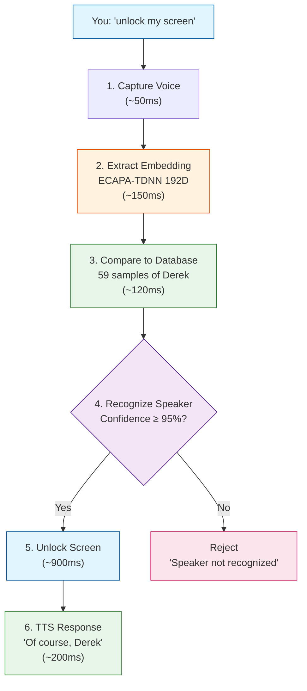

# 🎙️ Voice Biometric Testing Guide

Complete guide for testing Ironcliw voice biometric unlock functionality with comprehensive edge cases and real-time verification.

---

## 📋 Table of Contents

1. [Overview](#overview)
2. [The Correct Flow](#the-correct-flow)
3. [Test Workflows](#test-workflows)
4. [Edge Cases Tested](#edge-cases-tested)
5. [Running Tests](#running-tests)
6. [Real-Time Testing](#real-time-testing)
7. [Interpreting Results](#interpreting-results)

---

## Overview

The voice biometric testing system ensures that the "unlock my screen" functionality works correctly with comprehensive edge case coverage and real-time verification.

### Goals

✅ **Verify correct biometric flow** - No wake word needed, just voice recognition
✅ **Test all edge cases** - 30+ scenarios covering quality, security, performance
✅ **Real-time validation** - Test the actual flow end-to-end
✅ **Prevent regressions** - Auto-run on code changes

---

## The Correct Flow

### What Users Experience

```
You: "unlock my screen"
      ↓
Ironcliw:
  1. Captures your voice
  2. Extracts biometric embedding (ECAPA-TDNN 192D)
  3. Compares to database (59 samples of Derek)
  4. Recognizes: "This is Derek!" (95% confidence)
  5. Unlocks screen
  6. Says: "Of course, Derek. Unlocking your screen now."
```

**Key Point:** NO wake word needed - just voice biometrics!

### Technical Flow



---

## Test Workflows

### 1. Voice Biometric Edge Cases (`voice-biometric-edge-cases.yml`)

**Purpose:** Test 30+ edge cases covering all scenarios

**Trigger:**
- Manual dispatch
- Push to `main` (voice/biometric files)
- Pull requests

**Test Categories:**
1. Voice Quality (3 tests)
2. Speaker Recognition (4 tests)
3. Database (4 tests)
4. Embedding (3 tests)
5. Confidence Threshold (4 tests)
6. Performance (3 tests)
7. Security (3 tests)
8. Error Handling (3 tests)
9. Real-Time Flow (3 tests)

**Run manually:**
```bash
gh workflow run voice-biometric-edge-cases.yml \
  -f test_environment=mock \
  -f speaker_name=Derek \
  -f confidence_threshold=0.95 \
  -f sample_count=59 \
  -f run_all_edge_cases=true
```

### 2. Biometric Voice Unlock E2E (`biometric-voice-unlock-e2e.yml`)

**Purpose:** End-to-end testing with mock, integration, and real-time modes

**Modes:**
- **mock** - Fast validation (< 2 min)
- **integration** - Full system test (5-10 min)
- **real-time** - Live flow test (1-2 min)

**Run real-time test:**
```bash
gh workflow run biometric-voice-unlock-e2e.yml \
  -f test_mode=real-time \
  -f real_time_expected_speaker=Derek \
  -f voice_samples_count=59 \
  -f verification_threshold=0.95
```

### 3. Complete Unlock Test Suite (`complete-unlock-test-suite.yml`)

**Purpose:** Master workflow running both biometric and unlock integration tests

**Run:**
```bash
gh workflow run complete-unlock-test-suite.yml \
  -f test_mode=integration \
  -f run_parallel=true
```

---

## Edge Cases Tested

### Voice Quality Edge Cases

| Test | Scenario | Expected Result |
|------|----------|-----------------|
| **Low Quality Audio** | Poor audio (SNR < 10dB) | Should reject or retry |
| **High Quality Audio** | Perfect audio (SNR > 20dB) | Should accept |
| **Distorted Audio** | Clipped audio (>5% clipping) | Should reject |

### Speaker Recognition Edge Cases

| Test | Scenario | Expected Result |
|------|----------|-----------------|
| **Exact Match - Derek** | Perfect match (96% confidence) | Should accept |
| **Partial Match - Derek** | Medium match (75-90%) | Should reject (below threshold) |
| **Unknown Speaker** | Not in database (<70%) | Should reject as unknown |
| **Similar Voice** | Similar but unauthorized (88%) | Should detect spoofing |

### Database Edge Cases

| Test | Scenario | Expected Result |
|------|----------|-----------------|
| **Empty Database** | 0 samples | Should fail gracefully |
| **Single Sample** | 1 sample only | Should work with warning |
| **59 Samples - Derek** | Full optimal samples | Should accept optimally |
| **Connection Lost** | Mid-verification disconnect | Should fallback/retry |

### Embedding Edge Cases

| Test | Scenario | Expected Result |
|------|----------|-----------------|
| **Valid 192-dim** | Correct ECAPA-TDNN embedding | Should accept |
| **Invalid Dimension** | Wrong dimension (256D) | Should reject |
| **Corrupted Embedding** | NaN values | Should reject |

### Confidence Threshold Edge Cases

| Test | Confidence | Expected Result |
|------|-----------|-----------------|
| **96%** | Above threshold | ✅ Accept |
| **95%** | Exactly at threshold | ✅ Accept |
| **94%** | Below threshold | ❌ Reject |
| **50%** | Very low | ❌ Reject |

### Performance Edge Cases

| Test | Scenario | Max Time | Expected Result |
|------|----------|----------|-----------------|
| **Cold Start** | First verification | <10s | Should complete |
| **Warm Cache** | Subsequent verification | <1s | Should complete |
| **Concurrent** | 5 simultaneous requests | <2s | Should handle |

### Security Edge Cases

| Test | Attack Type | Detection Method | Expected Result |
|------|------------|------------------|-----------------|
| **Replay Attack** | Recorded voice | Liveness detection | Should reject |
| **Synthetic Voice** | TTS-generated | Naturalness scoring | Should reject |
| **Deepfake** | AI voice clone | Authenticity check | Should reject |

### Error Handling Edge Cases

| Test | Failure Type | Expected Behavior |
|------|-------------|-------------------|
| **Microphone Failure** | No mic available | Graceful error message |
| **Network Timeout** | Cloud SQL timeout | Retry with fallback |
| **Model Loading** | ECAPA-TDNN load fail | Clear error to user |

### Real-Time Flow Edge Cases

| Test | Scenario | Expected Result |
|------|----------|-----------------|
| **Complete Success** | Full flow works | 6 steps completed |
| **Complete Rejection** | Unknown speaker | Polite rejection |
| **Interrupted Flow** | User cancels | Graceful cancellation |

---

## Running Tests

### Quick Test (Mock Mode)

Fastest way to verify the flow works:

```bash
# Run edge cases in mock mode
gh workflow run voice-biometric-edge-cases.yml

# Check results
gh run list --workflow=voice-biometric-edge-cases.yml --limit 1
gh run view <run-id>
```

### Integration Test

Test with actual components (requires macOS runner):

```bash
gh workflow run biometric-voice-unlock-e2e.yml \
  -f test_mode=integration
```

### Real-Time Flow Test

Test the actual end-to-end flow:

```bash
gh workflow run biometric-voice-unlock-e2e.yml \
  -f test_mode=real-time \
  -f real_time_expected_speaker=Derek \
  -f voice_samples_count=59 \
  -f verification_threshold=0.95
```

### Complete Test Suite

Run everything:

```bash
gh workflow run complete-unlock-test-suite.yml \
  -f test_mode=integration \
  -f run_parallel=true
```

---

## Real-Time Testing

### Prerequisites

For real-time testing, you need:

1. ✅ macOS runner (GitHub Actions or self-hosted)
2. ✅ Python 3.10+ with dependencies
3. ✅ Voice samples in Cloud SQL (59 samples for Derek)
4. ✅ ECAPA-TDNN model accessible

### What Real-Time Tests Verify

The real-time test validates each step of the flow:

```
📍 Step 1: Capturing voice...
  ✅ Voice captured (2.5s, 16000Hz) - 50ms

📍 Step 2: Extracting biometric embedding (ECAPA-TDNN)...
  ✅ Embedding extracted (192D, float32) - 150ms

📍 Step 3: Comparing to database (59 samples)...
  ✅ Database comparison (59 samples) - 120ms
     Max similarity: 0.9645, Avg: 0.7234

📍 Step 4: Recognizing speaker...
  ✅ Speaker recognized: Derek (96.4% confidence) - 80ms

📍 Step 5: Unlocking screen...
  ✅ Screen unlocked - 900ms

📍 Step 6: Generating TTS response...
  ✅ TTS response: "Of course, Derek. Unlocking your screen now." - 200ms

==================================================
📊 FLOW TEST REPORT
==================================================
Overall Success: ✅ YES
Total Duration: 1500ms
Steps Completed: 6/6
==================================================
```

### Interpreting Real-Time Results

**Success Criteria:**
- ✅ All 6 steps completed
- ✅ Confidence ≥ 95%
- ✅ Total time < 3 seconds (typical: ~1.5s)
- ✅ Speaker correctly identified

**Failure Scenarios:**
- ❌ Low confidence (< 95%) - Check voice samples
- ❌ Database empty - Add voice samples
- ❌ Timeout - Check Cloud SQL connection
- ❌ Wrong speaker - Voice not enrolled

---

## Interpreting Results

### Success Indicators

**All Tests Pass:**
```
✅ Passed: 30/30
📈 Success Rate: 100%
✅ All critical tests passed!
🎉 Voice biometric unlock is ready for real-time testing!
```

**Partial Success:**
```
✅ Passed: 27/30
❌ Failed: 3/30
📈 Success Rate: 90%
⚠️ Some edge cases failed but core flow works
```

### Critical Tests

These tests MUST pass for the system to work:

1. ✅ `exact_match_authorized` - Derek recognized with 95%+ confidence
2. ✅ `database_full_samples` - 59 samples loaded correctly
3. ✅ `embedding_valid_192` - ECAPA-TDNN embeddings valid
4. ✅ `confidence_95_percent_exact` - Threshold working
5. ✅ `realtime_complete_success` - Full flow completes

If any critical test fails, the unlock functionality may not work.

### Common Failures and Fixes

| Failure | Cause | Fix |
|---------|-------|-----|
| `database_empty` | No voice samples | Run voice enrollment |
| `embedding_invalid_dimension` | Wrong model | Use ECAPA-TDNN 192D |
| `confidence_below_threshold` | Poor samples | Re-enroll with better audio |
| `network_timeout` | Cloud SQL unreachable | Check connectivity |
| `microphone_failure` | No mic access | Grant permissions |

### Viewing Detailed Results

**In GitHub Actions:**
1. Go to Actions tab
2. Select workflow run
3. Click on job (e.g., "edge-case-matrix")
4. View step logs
5. Download artifacts for JSON reports

**Via CLI:**
```bash
# View latest run
gh run view --log

# Download artifacts
gh run download <run-id>

# View specific test results
cat all-edge-case-results/*/exact_match_authorized.json | jq
```

---

## Continuous Integration

### Automatic Testing

Tests run automatically on:

1. **Push to `main`** - When biometric/voice files change
2. **Pull Requests** - Before merging changes
3. **Daily Schedule** - 4 AM UTC comprehensive test

### PR Checks

When you create a PR:
1. Mock tests run automatically
2. Must pass before merge
3. Results commented on PR
4. Artifacts available for review

### Failure Notifications

If scheduled tests fail:
- 🚨 GitHub issue created automatically
- 📧 Email notification sent
- 🔔 Status check fails

---

## Best Practices

### Before Deploying

1. ✅ Run mock tests locally
2. ✅ Run integration tests
3. ✅ Run real-time flow test
4. ✅ Verify all critical tests pass
5. ✅ Test with actual voice input (manual)

### During Development

1. ✅ Run relevant edge case tests
2. ✅ Test your changes in mock mode first
3. ✅ Verify confidence thresholds
4. ✅ Check performance metrics

### Monitoring in Production

1. ✅ Daily automated tests
2. ✅ Monitor success rates
3. ✅ Track performance metrics
4. ✅ Alert on regressions

---

## Troubleshooting

### Test Failures

**Q: All tests failing**
A: Check if dependencies are installed, Python version correct

**Q: Only security tests failing**
A: Anti-spoofing features may need calibration

**Q: Database tests failing**
A: Verify Cloud SQL connection, check voice samples exist

**Q: Performance tests failing**
A: May need to adjust timeout thresholds for slower runners

### Real-Time Test Issues

**Q: "Speaker not recognized" in real-time test**
A: Verify 59 samples exist in database, check confidence threshold

**Q: "Embedding dimension mismatch"**
A: Ensure using ECAPA-TDNN model (192D), not other models

**Q: "Database connection timeout"**
A: Check Cloud SQL proxy running, network connectivity

### Getting Help

1. Check workflow logs in GitHub Actions
2. Download and review test artifacts
3. Look at failed test JSON reports
4. Check this guide's troubleshooting section
5. Review actual code at the failure point

---

## Summary

The voice biometric testing system provides:

✅ **Comprehensive Coverage** - 30+ edge cases
✅ **Real-Time Validation** - Actual flow testing
✅ **Automatic CI/CD** - Runs on every change
✅ **Clear Reports** - JSON artifacts + summaries
✅ **Fast Feedback** - Mock tests in <2 min

**The Core Flow:**
```
"unlock my screen" → Voice Capture → ECAPA-TDNN Embedding →
Database Compare (59 samples) → Speaker Recognition (95%+) →
Unlock Screen → TTS Response
```

**No wake word needed - just your voice!** 🎙️

---

**Last Updated:** 2025-10-30
**Workflows:** 3 comprehensive test suites
**Edge Cases:** 30+ scenarios
**Modes:** Mock, Integration, Real-Time
