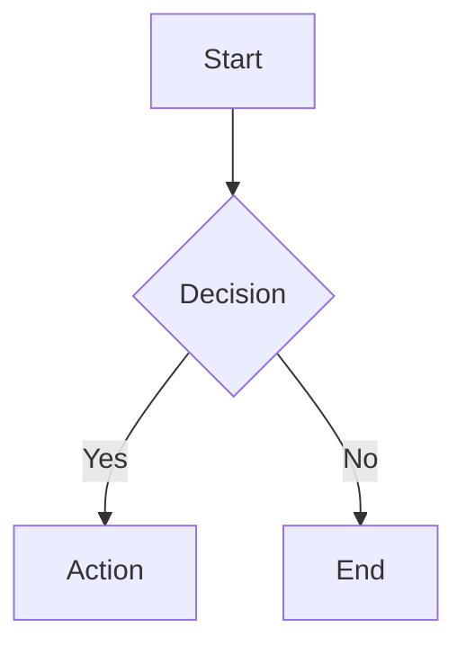
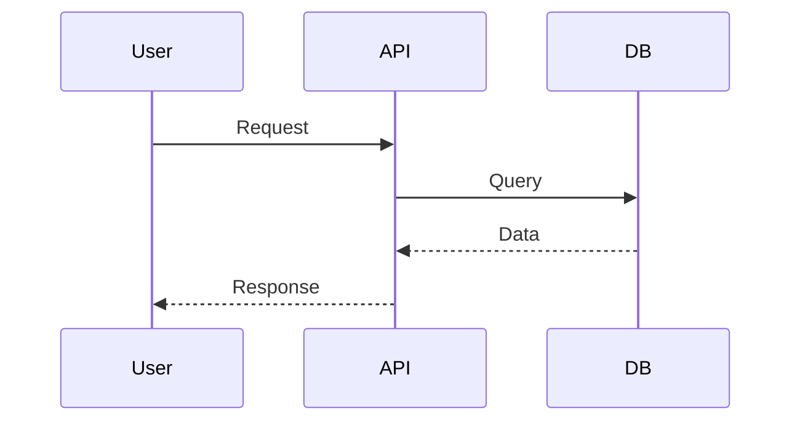
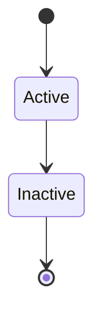
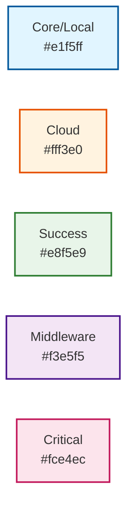
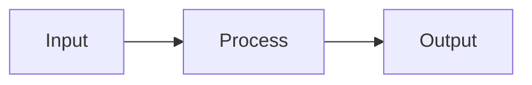
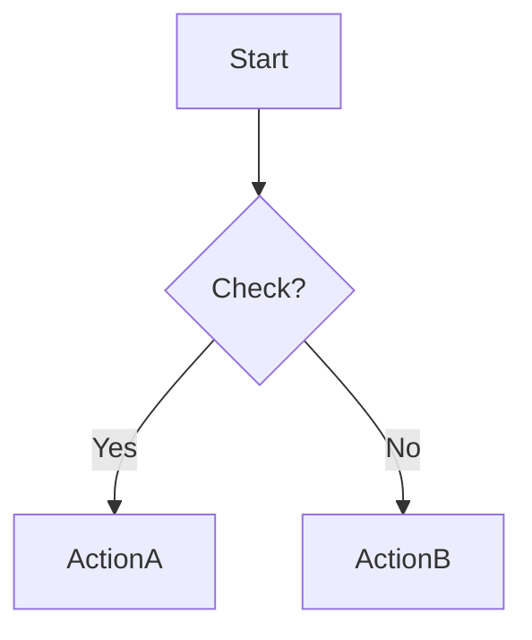
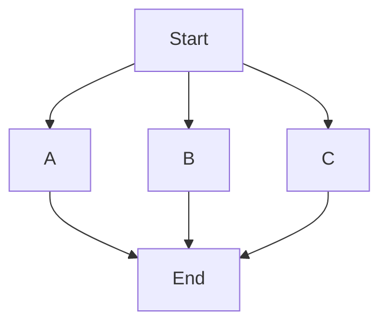
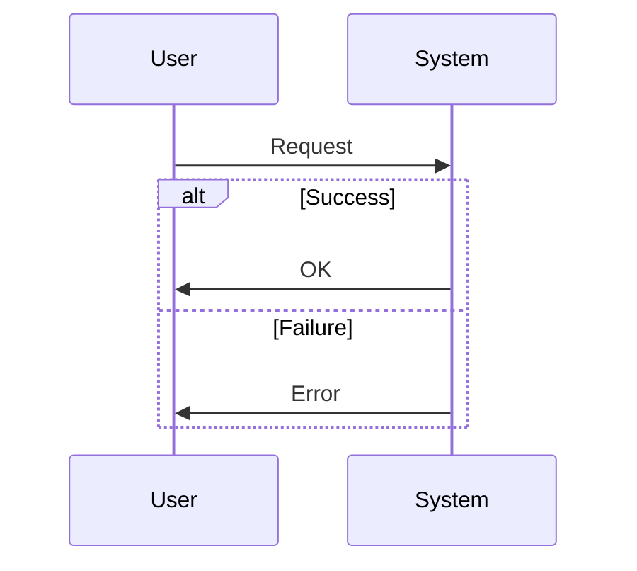

# 🎨 Diagram System Quick Reference

## 🚀 Quick Start

### Add Diagram to Markdown
```markdown
\`\`\`mermaid
flowchart LR
    A[Start] --> B[End]
\`\`\`
```

### Create Standalone Diagram
```bash
cat > diagrams/my-diagram.mmd <<'EOF'
flowchart TD
    A[Node A] --> B[Node B]
EOF
git add . && git commit -m "Add diagram" && git push
```

## 🎨 Common Diagram Types

### Flowchart


### Sequence Diagram


### State Diagram


## 🎨 Ironcliw Color Palette



**Copy-paste template:**
```
style NodeName fill:#e1f5ff,stroke:#01579b,stroke-width:2px
```

## ⚡ Common Patterns

### Process Flow


### Decision Tree


### Parallel Processing


### Sequence with Alt


## 🔧 Workflow Commands

### Manual Trigger
```bash
# Via GitHub UI:
# Actions → Auto-Diagram Generator → Run workflow

# Via CLI:
gh workflow run auto-diagram-generator.yml \
  -f force_regenerate=true \
  -f output_format=all
```

### View Generated Diagrams
```bash
# List all generated
ls -R diagrams/generated/

# View index
cat diagrams/generated/INDEX.md

# Open in browser
open diagrams/generated/my-diagram.svg
```

### Local Testing
```bash
# Install mermaid-cli
npm install -g @mermaid-js/mermaid-cli

# Generate locally
mmdc -i diagram.mmd -o diagram.svg

# Generate all formats
mmdc -i diagram.mmd -o diagram.svg
mmdc -i diagram.mmd -o diagram.png
mmdc -i diagram.mmd -o diagram.pdf
```

## 📋 Syntax Cheatsheet

### Nodes
```
A[Rectangle]
B(Rounded)
C([Stadium])
D[[Subroutine]]
E[(Database)]
F((Circle))
G>Flag]
H{Diamond}
I{{Hexagon}}
J[/Parallelogram/]
K[\Parallelogram\]
L[/Trapezoid\]
M[\Trapezoid/]
```

### Arrows
```
-->   Solid arrow
-.->  Dotted arrow
==>   Thick arrow
--x   Cross
--o   Circle
<-->  Bidirectional
```

### Styling
```
style NodeID fill:#color,stroke:#color,stroke-width:2px
classDef className fill:#color
class NodeID className
```

## 🐛 Troubleshooting

### Diagram Not Rendering
```bash
# Check syntax
# Use Mermaid Live Editor: https://mermaid.live/

# Verify code block
# Must start with ```mermaid (lowercase)
```

### Workflow Not Running
```bash
# Check file paths
git diff --name-only HEAD~1 HEAD

# Verify workflow is enabled
gh workflow list

# Check workflow logs
gh run list --workflow=auto-diagram-generator.yml
```

### Generation Failed
```bash
# View logs
gh run view --log

# Test locally
mmdc -i diagram.mmd -o diagram.svg

# Check mermaid syntax
# Common errors:
# - Missing semicolons
# - Invalid node IDs
# - Unclosed brackets
```

## 📚 Resources

- **Documentation:** [wiki/Diagram-System.md](../wiki/Diagram-System.md)
- **Examples:** [diagrams/examples/](examples/)
- **Mermaid Docs:** https://mermaid.js.org/
- **Live Editor:** https://mermaid.live/
- **Workflow:** [.github/workflows/auto-diagram-generator.yml](../.github/workflows/auto-diagram-generator.yml)

## 💡 Pro Tips

1. **Test locally first** with `mmdc` before committing
2. **Use live editor** to preview complex diagrams
3. **Keep it simple** - 5-20 nodes per diagram
4. **Add comments** with `%% Comment here`
5. **Use subgraphs** for organization
6. **Consistent colors** from Ironcliw palette
7. **Meaningful names** - not "A, B, C"
8. **Check generated files** in `diagrams/generated/`

## ⌨️ VS Code Integration

Install extension:
```bash
code --install-extension bierner.markdown-mermaid
```

Preview shortcut: `Cmd+K V` (Mac) or `Ctrl+K V` (Windows/Linux)

---

**Quick Links:**
- 📖 [Full Documentation](../wiki/Diagram-System.md)
- 🏗️ [Architecture Examples](../wiki/Architecture-&-Design.md)
- 🔧 [Workflow File](../.github/workflows/auto-diagram-generator.yml)
- 📊 [Generated Diagrams](generated/INDEX.md)
