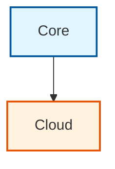

# 🎨 Ironcliw Diagrams

This directory contains Mermaid diagram source files and auto-generated diagram images.

## Directory Structure

```
diagrams/
├── README.md                 # This file
├── architecture/             # System architecture diagrams
├── flows/                    # Process and data flows
├── components/               # Component diagrams
└── generated/                # Auto-generated images (SVG/PNG/PDF)
    └── INDEX.md             # Index of all generated diagrams
```

## Quick Start

### 1. Create a Mermaid Diagram

**Option A: Standalone file**
```bash
# Create a new .mmd file
cat > diagrams/architecture/my-diagram.mmd <<'EOF'
flowchart LR
    A[Start] --> B[Process]
    B --> C[End]
EOF
```

**Option B: In markdown (recommended for wiki)**
```markdown
## My Diagram

\`\`\`mermaid
flowchart LR
    A[Start] --> B[Process]
    B --> C[End]
\`\`\`
```

### 2. Commit and Push

```bash
git add diagrams/
git commit -m "Add new diagram"
git push
```

### 3. Auto-Generation

The [Auto-Diagram Generator workflow](../.github/workflows/auto-diagram-generator.yml) will:
- Detect your new/changed diagrams
- Generate SVG, PNG, and PDF versions
- Commit them to `diagrams/generated/`
- Update the diagram index

### 4. View Generated Diagrams

Check `diagrams/generated/INDEX.md` for a complete list of generated diagrams.

## Features

✨ **Automatic Generation** - Diagrams auto-generate on commit
🚀 **Parallel Processing** - Up to 10 diagrams rendered simultaneously
🎯 **Smart Caching** - Only regenerates changed diagrams
📊 **Multiple Formats** - SVG, PNG, and PDF output
🔍 **Change Detection** - Git-based and hash-based detection
📝 **Metadata Tracking** - Full generation history

## Mermaid Support

Supports all Mermaid diagram types:
- Flowcharts
- Sequence diagrams
- Class diagrams
- State diagrams
- Entity relationship diagrams
- Gantt charts
- Pie charts
- Git graphs

See the [Diagram System documentation](../wiki/Diagram-System.md) for complete examples.

## Color Palette

Use these colors for consistent styling:

| Color | Hex | Use Case |
|-------|-----|----------|
| Blue | `#e1f5ff`, `#01579b` | Core systems, local |
| Orange | `#fff3e0`, `#e65100` | Cloud, processing |
| Green | `#e8f5e9`, `#2e7d32` | Intelligence, success |
| Purple | `#f3e5f5`, `#4a148c` | Coordination, middleware |
| Red | `#fce4ec`, `#c2185b` | Security, critical |

Example:


## Manual Generation

Test diagrams locally before committing:

```bash
# Install mermaid-cli
npm install -g @mermaid-js/mermaid-cli

# Generate diagram
mmdc -i diagram.mmd -o diagram.svg

# With custom config
mmdc -i diagram.mmd -o diagram.svg -c config.json
```

## Resources

- 📖 [Diagram System Documentation](../wiki/Diagram-System.md)
- 🏗️ [Architecture Diagrams](../wiki/Architecture-&-Design.md)
- 🔧 [Mermaid Documentation](https://mermaid.js.org/)
- 🎮 [Mermaid Live Editor](https://mermaid.live/)

## Workflow

The auto-generation workflow runs on:
- Push to `main` or `develop`
- Pull requests modifying diagrams
- Manual workflow dispatch

Trigger manually:
1. Go to Actions → Auto-Diagram Generator
2. Click "Run workflow"
3. Choose options (force regenerate, output format)

## Contributing

When adding new diagrams:

1. ✅ Use descriptive filenames (`voice-command-flow.mmd`)
2. ✅ Add comments for complex flows
3. ✅ Test locally before committing
4. ✅ Use consistent colors from palette
5. ✅ Keep diagrams focused (5-20 nodes)
6. ✅ Document in related wiki pages

---

**Last Updated:** 2025-10-30
**Auto-Generated:** See `generated/INDEX.md` for auto-generated diagrams
