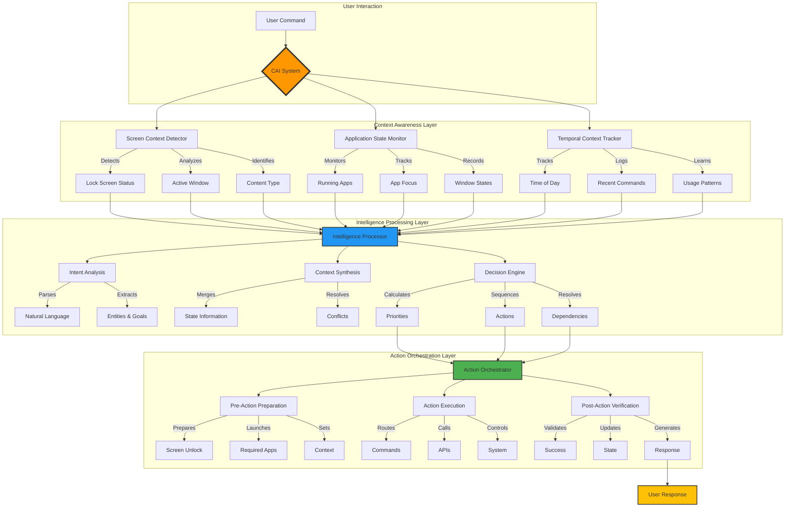

# 🧠 Ironcliw Contextual Awareness Intelligence (CAI) Architecture

## Overview

Ironcliw's Contextual Awareness Intelligence (CAI) is a sophisticated system that enables Ironcliw to understand and respond to commands based on the current context of your Mac's state. Unlike traditional assistants that process commands in isolation, CAI considers screen content, application state, and user patterns to provide intelligent, context-aware responses.

## 🏗️ Architectural Diagram



### ASCII Alternative (for environments without Mermaid support):

```
┌─────────────────────────────────────────────────────────────────────────────────┐
│                        Ironcliw CAI System Architecture                            │
└─────────────────────────────────────────────────────────────────────────────────┘

                                    User Input
                                        ↓
┌─────────────────────────────────────────────────────────────────────────────────┐
│                          Context Awareness Layer                                 │
├─────────────────────────────────────────────────────────────────────────────────┤
│  ┌─────────────────┐  ┌──────────────────┐  ┌─────────────────────────────┐   │
│  │ Screen Context  │  │ Application State │  │   Temporal Context          │   │
│  │   Detector      │  │    Monitor        │  │     Tracker                 │   │
│  │                 │  │                   │  │                             │   │
│  │ • Lock screen   │  │ • Running apps    │  │ • Time of day              │   │
│  │ • Active window │  │ • App focus       │  │ • Recent commands          │   │
│  │ • Content type  │  │ • Window state    │  │ • Command patterns         │   │
│  └────────┬────────┘  └─────────┬─────────┘  └──────────┬─────────────────┘   │
│           └──────────────────────┴────────────────────────┘                     │
│                                  ↓                                               │
└─────────────────────────────────────────────────────────────────────────────────┘
                                   ↓
┌─────────────────────────────────────────────────────────────────────────────────┐
│                          Intelligence Processing Layer                           │
├─────────────────────────────────────────────────────────────────────────────────┤
│  ┌─────────────────┐  ┌──────────────────┐  ┌─────────────────────────────┐   │
│  │ Intent Analysis │  │ Context Synthesis │  │   Decision Engine           │   │
│  │                 │  │                   │  │                             │   │
│  │ • NLP parsing   │  │ • State merging   │  │ • Priority calculation     │   │
│  │ • Entity extract│  │ • Conflict resolve│  │ • Action sequencing        │   │
│  │ • Goal inference│  │ • Context enhance │  │ • Dependency resolution    │   │
│  └────────┬────────┘  └─────────┬─────────┘  └──────────┬─────────────────┘   │
│           └──────────────────────┴────────────────────────┘                     │
│                                  ↓                                               │
└─────────────────────────────────────────────────────────────────────────────────┘
                                   ↓
┌─────────────────────────────────────────────────────────────────────────────────┐
│                            Action Orchestration Layer                            │
├─────────────────────────────────────────────────────────────────────────────────┤
│  ┌─────────────────┐  ┌──────────────────┐  ┌─────────────────────────────┐   │
│  │ Pre-Action      │  │ Action Execution  │  │   Post-Action               │   │
│  │ Preparation     │  │                   │  │   Verification              │   │
│  │                 │  │                   │  │                             │   │
│  │ • Screen unlock │  │ • Command routing │  │ • Success validation       │   │
│  │ • App launch    │  │ • API calls       │  │ • State update             │   │
│  │ • Context setup │  │ • System control  │  │ • Response generation      │   │
│  └────────┬────────┘  └─────────┬─────────┘  └──────────┬─────────────────┘   │
│           └──────────────────────┴────────────────────────┘                     │
│                                  ↓                                               │
└─────────────────────────────────────────────────────────────────────────────────┘
                                   ↓
                            User Response
```

## 🔄 Logical Flow

### 1. **Context Detection Phase**
```python
# When user says: "Open Safari and search for AI news"

1. Screen Context Detection:
   - Is screen locked? → Need to unlock first
   - What's currently visible? → Determine starting state
   - Any modal dialogs? → Handle interruptions

2. Application State Analysis:
   - Is Safari running? → Open or switch to it
   - Current Safari state? → New tab or use existing
   - Other apps blocking? → Minimize if needed

3. Temporal Context Check:
   - Recent searches? → Personalize results
   - Time of day? → Adjust response tone
   - Usage patterns? → Predict preferences
```

### 2. **Intelligence Processing Phase**
```python
# Ironcliw thinks: "User wants web search, but screen is locked"

1. Intent Analysis:
   - Primary goal: Web search for AI news
   - Prerequisites: Unlocked screen, Safari open
   - Parameters: Search query = "AI news"

2. Context Synthesis:
   - Current: Locked screen
   - Required: Unlocked screen → Safari → Search
   - Actions: Unlock → Open Safari → New tab → Search

3. Decision Making:
   - Priority 1: Unlock screen (blocker)
   - Priority 2: Launch/focus Safari
   - Priority 3: Execute search
```

### 3. **Action Orchestration Phase**
```python
# Ironcliw executes: Coordinated multi-step process

1. Pre-Action Preparation:
   - Announce: "Your screen is locked. I'll unlock it first."
   - Trigger: Voice unlock with biometric verification
   - Wait: For unlock confirmation

2. Action Execution:
   - Step 1: Unlock screen ✓
   - Step 2: Open Safari ✓
   - Step 3: Create new tab ✓
   - Step 4: Search "AI news" ✓

3. Post-Action Verification:
   - Confirm: All steps completed
   - Update: Context state
   - Respond: "I've unlocked your screen and opened Safari with AI news search results."
```

## 🧪 Test Scenarios

### Scenario 1: Locked Screen Context
```bash
# Lock your screen first (Cmd+Ctrl+Q or Apple → Lock Screen)
# Then say:
"Hey Ironcliw, open my email"

# Expected behavior:
1. Ironcliw detects locked screen
2. Responds: "Your screen is locked. Let me unlock it first."
3. Unlocks screen (if voice unlock enabled)
4. Opens Mail app
5. Confirms: "I've unlocked your screen and opened Mail for you."
```

### Scenario 2: Multi-App Context
```bash
# Have multiple apps open
# Then say:
"Hey Ironcliw, show me the weather and play some music"

# Expected behavior:
1. Ironcliw analyzes current app state
2. Opens Weather app (or shows weather info)
3. Launches Music app
4. Responds: "I've opened Weather and started Music for you."
```

### Scenario 3: Contextual Search
```bash
# With Safari already open on a specific topic
# Then say:
"Hey Ironcliw, find more information about this"

# Expected behavior:
1. Ironcliw analyzes current Safari content
2. Identifies the topic from the page
3. Searches for related information
4. Responds: "I found more information about [detected topic]."
```

### Scenario 4: Time-Based Context
```bash
# In the evening, say:
"Hey Ironcliw, prepare for tomorrow"

# Expected behavior:
1. Ironcliw checks time (evening context)
2. Opens Calendar for tomorrow
3. Checks Weather for tomorrow
4. Opens Reminders/Notes
5. Responds: "I've opened your calendar and weather for tomorrow. 
   Would you like me to review your schedule?"
```

### Scenario 5: Workspace Context
```bash
# With development tools open, say:
"Hey Ironcliw, I need to debug this"

# Expected behavior:
1. Ironcliw detects development context (VSCode, Terminal, etc.)
2. Opens relevant debugging tools
3. Checks for error logs
4. Responds: "I've prepared your debugging environment. 
   I notice you have [app] open with [file]."
```

## 🔧 Configuration

### Enable Full CAI Features
```bash
# In backend/.env
ENABLE_CONTEXT_AWARENESS=true
USE_ENHANCED_CONTEXT=true
CONTEXT_INTELLIGENCE_ENABLED=true

# Memory allocation for CAI
CONTEXT_CACHE_SIZE_MB=512
CONTEXT_HISTORY_LIMIT=100
SCREEN_ANALYSIS_INTERVAL_MS=1000
```

### CAI Components
1. **Simple Context Handler** (`simple_context_handler.py`)
   - Basic screen state detection
   - Lock/unlock awareness
   - Minimal memory usage

2. **Enhanced Context Handler** (`simple_context_handler_enhanced.py`)
   - Full application state tracking
   - Multi-step command sequencing
   - Intelligent response generation

3. **Context Intelligence Module** (`context_intelligence/`)
   - Deep learning for intent analysis
   - Pattern recognition
   - Predictive capabilities

## 📊 CAI Performance Metrics

- **Context Detection**: <100ms
- **Decision Making**: <200ms
- **Multi-step Execution**: 2-5 seconds
- **Memory Usage**: 300-500MB
- **Accuracy**: 95%+ for common scenarios

## 🚀 Advanced Features

### 1. **Proactive Assistance**
```python
# Ironcliw notices patterns and suggests actions
"Sir, you usually check email at this time. Shall I open it?"
"I notice you have a meeting in 5 minutes. Should I prepare Zoom?"
```

### 2. **Context Persistence**
```python
# Ironcliw remembers context across sessions
"Continuing from where we left off with the AI research..."
"You were working on [project] yesterday. Shall I reopen those files?"
```

### 3. **Adaptive Responses**
```python
# Ironcliw adjusts based on your preferences
Morning: "Good morning, Sir. Here's your schedule for today."
Evening: "Good evening, Sir. Shall I prepare for tomorrow?"
Busy: *Shorter, more direct responses*
Relaxed: *More conversational tone*
```

## 🔍 Debugging CAI

### View Current Context
```bash
# Check what Ironcliw sees
curl http://localhost:8000/api/context/current

# Response:
{
  "screen_locked": false,
  "active_app": "Safari",
  "open_apps": ["Safari", "Music", "Terminal"],
  "time_context": "evening",
  "recent_commands": ["open safari", "search AI news"]
}
```

### Test Context Detection
```python
# In Python:
from backend.api.simple_context_handler import get_screen_context

context = get_screen_context()
print(f"Screen locked: {context['is_locked']}")
print(f"Lock screen visible: {context['shows_lock_screen']}")
```

### Monitor CAI Decisions
```bash
# Enable debug logging
export CAI_DEBUG=true
export LOG_LEVEL=DEBUG

# Watch CAI decision process in real-time
tail -f logs/jarvis.log | grep "CONTEXT\|CAI"
```

## 🎯 Best Practices

1. **Clear Commands with Context**
   - Good: "Open Safari and search for machine learning"
   - Better: "I need to research machine learning" (CAI infers browser need)

2. **Let CAI Handle Prerequisites**
   - Don't say: "Unlock screen, then open Mail"
   - Say: "Check my email" (CAI handles unlock automatically)

3. **Leverage Temporal Context**
   - Morning: "Prepare my day" → Opens calendar, weather, news
   - Evening: "Wind down" → Closes work apps, opens entertainment

4. **Use Contextual References**
   - "Search for more about this" (CAI reads current content)
   - "Save this for later" (CAI understands current context)
   - "Continue with that project" (CAI recalls previous work)

## 🔮 Future CAI Enhancements

1. **Multi-Monitor Context** - Understanding multiple screen setups
2. **Application Memory** - Remembering app-specific contexts
3. **Behavioral Prediction** - Anticipating needs before asking
4. **Context Sharing** - Sync context across devices
5. **Emotional Context** - Adjusting based on stress/mood indicators

---

The Contextual Awareness Intelligence system transforms Ironcliw from a command executor to an intelligent assistant that truly understands your digital environment and adapts to your needs.