# JARVIS Voice Unlock Feature

## Overview
Voice-based biometric authentication system for macOS that enables hands-free unlocking using speaker verification technology.

## 🆕 Neural Parallel Voice Unlock Architecture (v20.5.0)

For the complete technical deep-dive into the advanced voice biometric system, see:
- **[Neural Parallel Architecture Guide](./NEURAL_PARALLEL_ARCHITECTURE.md)** - Comprehensive system design, bottlenecks, edge cases, and cost optimization

### Quick Architecture Overview

```mermaid
flowchart TB
    A["🎤 Audio Input"] --> split["⚡ Parallel Split"]

    split --> B["🤖 ECAPA ML<br/>(Cloud)"]
    split --> C["🔬 Physics PAVA<br/>(Local)"]
    split --> D["📍 Context<br/>Engine"]

    B --> fusion["🧠 Bayesian Fusion"]
    C --> fusion
    D --> fusion

    fusion --> decision["✅ Decision<br/>(~250ms)"]

    style A fill:#e1f5ff,stroke:#01579b,stroke-width:2px
    style B fill:#e8f5e9,stroke:#2e7d32,stroke-width:2px
    style C fill:#fce4ec,stroke:#c2185b,stroke-width:2px
    style D fill:#f3e5f5,stroke:#4a148c,stroke-width:2px
    style fusion fill:#fff8e1,stroke:#ff6f00,stroke-width:2px
    style decision fill:#e8f5e9,stroke:#2e7d32,stroke-width:2px
```



**Key Features:**
- **13.6x faster** than sequential architecture (~250ms vs ~2.8s)
- **7-layer anti-spoofing** including VTL, Doppler, and double-reverb detection
- **Hybrid cloud/local** with automatic failover
- **Scale-to-zero** GCP Cloud Run deployment (~$0.02/month)
- **<5s cold start** with pre-baked JIT models

## Current Status
- ✅ PRD documentation created
- ✅ Project structure initialized
- ✅ **Neural Parallel Architecture v20.5.0** implemented
- ✅ Core modules implemented:
  - Voiceprint management system
  - Feature extraction engine
  - Anti-spoofing detection (7-layer PAVA)
  - Bayesian confidence fusion
  - ECAPA-TDNN cloud service
- ✅ GCP Cloud Run deployment
- ✅ Hybrid cloud/local ML routing
- 🚧 In Progress: Continuous learning optimization
- 📋 Planned: Swift UI implementation

## Architecture

### Core Components
```
voice_unlock/
├── core/
│   ├── voiceprint.py       # Voiceprint creation and matching
│   ├── feature_extraction.py # Voice feature extraction
│   ├── anti_spoofing.py    # Spoofing detection
│   └── enrollment.py       # User enrollment flow
├── services/
│   ├── unlock_service.py   # macOS unlock integration
│   ├── keychain_service.py # Secure storage
│   └── auth_service.py     # Authentication logic
├── models/
│   └── voice_models.py     # ML models for verification
└── utils/
    ├── audio_capture.py    # Audio recording utilities
    └── security.py         # Encryption/security helpers
```

### Key Features Implemented

#### 1. Voiceprint Management
- Multi-sample enrollment (3-5 voice samples)
- Template-based matching with variance adaptation
- Dynamic threshold calculation based on quality
- Support for multiple user profiles

#### 2. Feature Extraction
- MFCC (Mel-frequency cepstral coefficients)
- Pitch contour analysis
- Formant extraction
- Energy profile across frequency bands
- Spectral characteristics

#### 3. Anti-Spoofing Protection
- Replay attack detection
- Synthetic speech detection
- Microphone response analysis
- Environmental consistency checking
- Ultrasonic marker support

## Quick Start

### Installation
```bash
# Install dependencies
pip install -r requirements.txt

# For macOS-specific features
brew install portaudio
```

### Basic Usage
```python
from voice_unlock import VoiceEnrollmentManager, VoiceAuthenticator

# Enroll a new user
enrollment = VoiceEnrollmentManager()
voiceprint = enrollment.enroll_user("user123", num_samples=3)

# Authenticate
authenticator = VoiceAuthenticator()
is_verified, score = authenticator.verify("user123", audio_sample)
```

## Development Roadmap

### Phase 1: MVP (Current)
- [x] Core voice processing pipeline
- [x] Anti-spoofing mechanisms
- [ ] Audio capture interface
- [ ] Basic screensaver integration

### Phase 2: Enhanced Security
- [ ] Challenge-response system
- [ ] Multi-factor scoring
- [ ] Keychain integration
- [ ] Audit logging

### Phase 3: System Integration
- [ ] PAM module development
- [ ] Login screen support
- [ ] Swift UI implementation
- [ ] MDM/enterprise features

### Phase 4: Advanced Features
- [ ] Proximity detection
- [ ] Continuous authentication
- [ ] Workflow automation
- [ ] Multi-language support

## Security Considerations

### Threat Model
1. **Replay Attacks**: Detected via high-frequency analysis and temporal patterns
2. **Voice Synthesis**: Identified through spectral and phase analysis
3. **Environmental Spoofing**: Checked via acoustic consistency
4. **Brute Force**: Rate limiting and lockout policies

### Privacy
- All processing done locally
- Voiceprints encrypted before storage
- No cloud connectivity required
- User data never leaves device

## Testing

### Unit Tests
```bash
python -m pytest backend/voice_unlock/tests/
```

### Integration Tests
```bash
python backend/voice_unlock/tests/test_integration.py
```

### Security Tests
```bash
python backend/voice_unlock/tests/test_anti_spoofing.py
```

## Contributing
1. Create feature branch from `feature/jarvis-voice-unlock`
2. Follow existing code patterns
3. Add tests for new features
4. Update documentation
5. Submit PR with clear description

## Performance Metrics
- Enrollment time: <30 seconds
- Authentication time: <2 seconds
- False Accept Rate: <0.01%
- False Reject Rate: <2%
- CPU usage: <5% during monitoring

## Known Limitations
- Requires quiet environment for enrollment
- Performance degrades with background noise
- Limited to English initially
- macOS 11+ required for full integration

## Future Enhancements
- Apple Watch integration
- iOS companion app
- Multi-device sync
- Emotion detection
- Health monitoring via voice

## Resources
- [AVAudioEngine Documentation](https://developer.apple.com/documentation/avfaudio/avaudioengine)
- [Keychain Services Guide](https://developer.apple.com/documentation/security/keychain_services)
- [PAM Development](https://developer.apple.com/library/archive/documentation/Security/Conceptual/Security_Overview/Architecture/Architecture.html)
- [Voice Biometrics Research](https://www.isca-speech.org/)

## License
Part of JARVIS AI Agent - see main project license