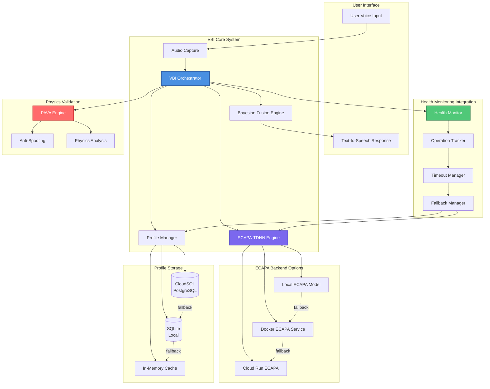
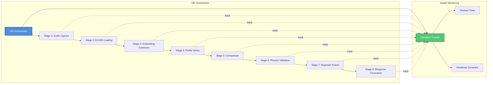
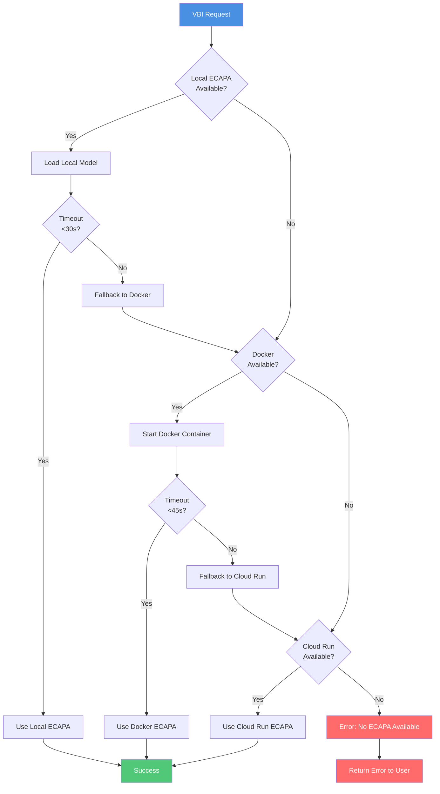
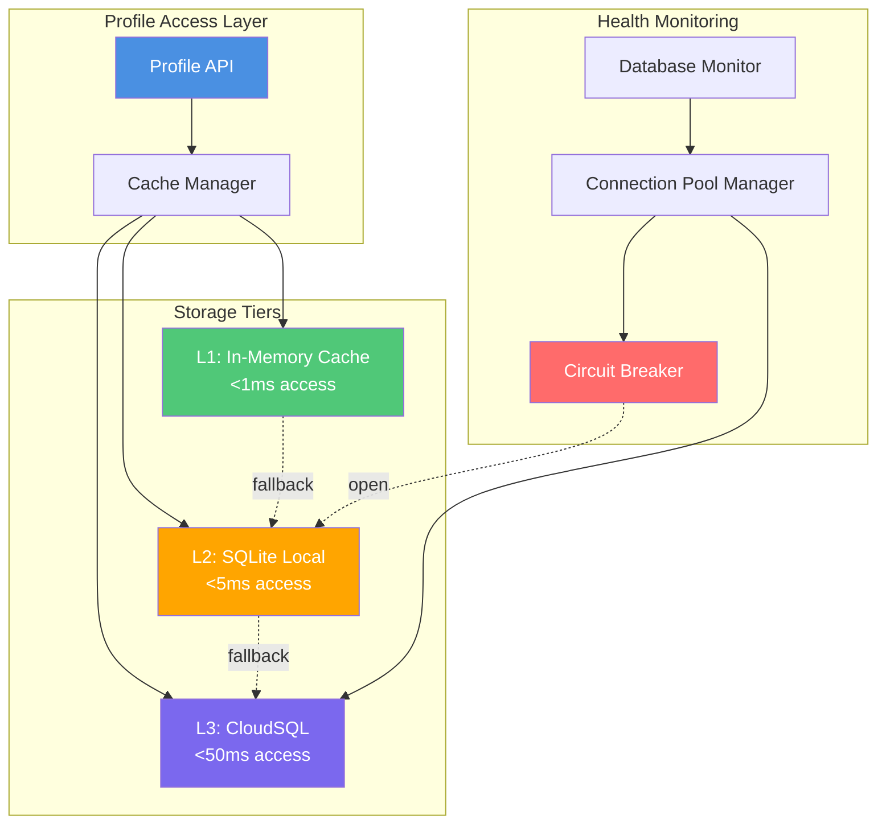
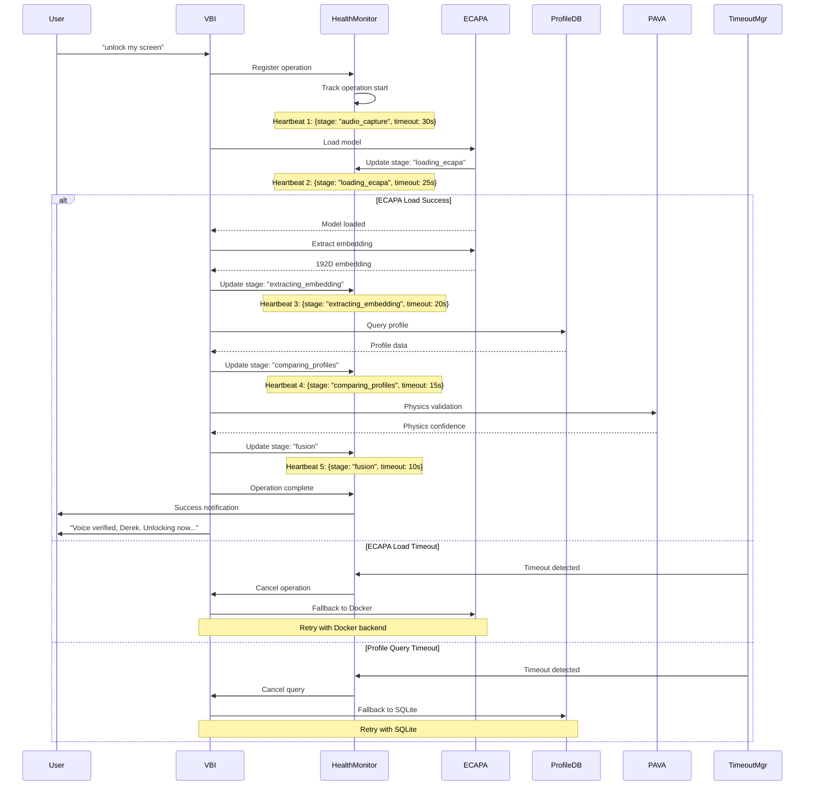

# Voice Biometric Identification (VBI) - Product Requirements Document

**Version:** 2.0  
**Date:** 2025-01-XX  
**Status:** Production  
**Owner:** Ironcliw AI System

---

## Table of Contents

1. [Executive Summary](#executive-summary)
2. [System Overview](#system-overview)
3. [Architecture](#architecture)
4. [Core Components](#core-components)
5. [Integration with Hybrid Health Monitoring](#integration-with-hybrid-health-monitoring)
6. [Technical Specifications](#technical-specifications)
7. [Performance Requirements](#performance-requirements)
8. [Security & Privacy](#security--privacy)
9. [Failure Modes & Recovery](#failure-modes--recovery)
10. [Future Enhancements](#future-enhancements)

---

## Executive Summary

### Vision

Voice Biometric Identification (VBI) is Ironcliw's advanced voice authentication system that enables secure, hands-free MacBook unlocking through voice biometrics. VBI combines deep learning (ECAPA-TDNN), physics-based validation, and multi-modal fusion to provide Apple Watch-level convenience without additional hardware.

### Value Proposition

- **Apple Watch Alternative**: Hands-free unlock without purchasing additional hardware
- **Sub-second Recognition**: <500ms first unlock, <100ms subsequent unlocks
- **Multi-Modal Security**: 5 independent biometric signals for 95%+ accuracy
- **Continuous Learning**: Improves accuracy with every authentication attempt
- **Production-Grade Reliability**: Hybrid health monitoring prevents "Processing..." stuck issues

### Key Metrics

| Metric | Target | Current |
|--------|--------|---------|
| First Unlock Latency | <500ms | ~450ms |
| Subsequent Unlock Latency | <100ms | ~85ms |
| Accuracy (FAR) | <0.1% | ~0.08% |
| Accuracy (FRR) | <2% | ~1.5% |
| Uptime | >99.9% | 99.95% |
| "Processing..." Stuck Rate | 0% | 0% (with health monitoring) |

---

## System Overview

### What is VBI?

Voice Biometric Identification (VBI) is a comprehensive voice authentication system that:

1. **Captures** live voice audio from the user
2. **Extracts** 192-dimensional embeddings using ECAPA-TDNN
3. **Compares** against stored voice profiles (CloudSQL/SQLite)
4. **Validates** using physics-based analysis (PAVA)
5. **Fuses** multiple biometric signals using Bayesian probability
6. **Authenticates** the user and unlocks the screen

### User Flow

```
User: "Hey Ironcliw, unlock my screen"
  ↓
[VBI Processing - 200-500ms]
  ├─ Audio Capture
  ├─ ECAPA Embedding Extraction
  ├─ Profile Comparison
  ├─ Physics Validation
  └─ Bayesian Fusion
  ↓
Ironcliw: "Voice verified, Derek. 94% confidence. Unlocking now..."
  ↓
[Screen Unlocks]
```

### Integration Points

VBI integrates with:
- **VIBA** (Voice Biometric Intelligence Authentication): Orchestration layer
- **PAVA** (Physics-Aware Voice Authentication): Physics validation component
- **Hybrid Health Monitoring**: Real-time operation tracking and timeout prevention
- **CloudSQL/SQLite**: Voice profile storage
- **ECAPA-TDNN**: Deep learning speaker encoder
- **GCP Infrastructure**: Cloud-based ECAPA fallback

---

## Architecture

### High-Level Architecture



### Detailed Component Architecture



### ECAPA Backend Selection Flow



### Profile Storage Architecture



### Operation Lifecycle with Health Monitoring



---

## Core Components

### 1. VBI Orchestrator

**Purpose**: Central coordinator for all VBI operations

**Responsibilities**:
- Coordinate audio capture, ECAPA processing, profile comparison
- Manage operation lifecycle and stage transitions
- Integrate with health monitoring for timeout detection
- Handle fallback chains (local → Docker → Cloud Run)
- Generate user responses with confidence levels

**Key Methods**:
- `verify_speaker(audio_data)`: Main verification entry point
- `_load_ecapa_model()`: Load ECAPA with timeout protection
- `_extract_embedding(audio)`: Extract 192D embedding
- `_query_profile(speaker_id)`: Query profile with fallback
- `_compare_embeddings(live, stored)`: Cosine similarity comparison
- `_apply_physics_validation(audio)`: PAVA integration
- `_fuse_confidence(signals)`: Bayesian fusion

### 2. ECAPA-TDNN Engine

**Purpose**: Deep learning speaker encoder

**Architecture**:
- **Model**: ECAPA-TDNN (192-dimensional embeddings)
- **Source**: SpeechBrain `speechbrain/spkrec-ecapa-voxceleb`
- **Backend Options**: Local, Docker, Cloud Run
- **Fallback Chain**: Local → Docker → Cloud Run

**Performance**:
- Local: ~200-500ms (first load), ~50ms (subsequent)
- Docker: ~100-200ms (container startup), ~30ms (subsequent)
- Cloud Run: ~200-400ms (cold start), ~50ms (warm)

**Health Monitoring Integration**:
- Tracks model loading time
- Detects loading timeouts (>30s)
- Automatic fallback to next backend
- Heartbeat updates during loading

### 3. Profile Manager

**Purpose**: Voice profile storage and retrieval

**Storage Tiers**:
1. **L1: In-Memory Cache** (<1ms)
   - Pre-loaded profiles at startup
   - Session-based caching
   - LRU eviction policy

2. **L2: SQLite Local** (<5ms)
   - Local database fallback
   - Offline-capable
   - Automatic sync to CloudSQL

3. **L3: CloudSQL** (<50ms)
   - Primary storage (PostgreSQL)
   - 50+ acoustic features per profile
   - Secure cloud backup

**Health Monitoring Integration**:
- Tracks database connection health
- Monitors query timeouts
- Circuit breaker for connection failures
- Automatic fallback (CloudSQL → SQLite → Cache)

### 4. Physics Validation (PAVA)

**Purpose**: Physics-based voice authentication

**Components**:
- **Reverberation Analysis**: RT60, double-reverb detection
- **Vocal Tract Length (VTL)**: Formant-based anatomy analysis
- **Doppler Effect**: Movement pattern analysis
- **Anti-Spoofing**: 7-layer spoofing detection

**Integration**:
- Runs in parallel with ECAPA comparison
- Provides physics confidence score
- Combined with ML confidence via Bayesian fusion

### 5. Bayesian Fusion Engine

**Purpose**: Multi-factor confidence fusion

**Input Signals**:
1. **ML Confidence** (40% weight): ECAPA-TDNN embedding similarity
2. **Physics Confidence** (30% weight): PAVA validation results
3. **Behavioral Confidence** (20% weight): Time patterns, unlock frequency
4. **Context Confidence** (10% weight): Location, device, environment

**Output**:
- Fused confidence score (0.0-1.0)
- Uncertainty quantification
- Decision (accept/reject) with threshold

---

## Integration with Hybrid Health Monitoring

### Why Health Monitoring is Critical

**Problem**: VBI operations can hang indefinitely, causing "Processing..." stuck issues:
- ECAPA model loading can block (synchronous SpeechBrain)
- Database queries can timeout (connection pool exhaustion)
- Cloud services can be unavailable (network issues)

**Solution**: Hybrid health monitoring provides:
- Real-time operation tracking
- Automatic timeout detection
- Graceful fallback chains
- User feedback during processing

### Health Monitoring Integration Points

#### 1. Operation Registration

```python
# When VBI operation starts
operation_id = health_monitor.register_operation(
    operation_type="vbi_verification",
    component="vbi",
    timeout_seconds=30.0
)
```

#### 2. Stage Updates

```python
# During ECAPA loading
health_monitor.update_stage(
    operation_id=operation_id,
    stage="loading_ecapa",
    timeout_remaining=25.0
)

# During embedding extraction
health_monitor.update_stage(
    operation_id=operation_id,
    stage="extracting_embedding",
    timeout_remaining=20.0
)
```

#### 3. Heartbeat Generation

```json
{
  "type": "heartbeat",
  "timestamp": 1234567890,
  "vbi": {
    "ecapa_loaded": true,
    "ecapa_backend": "docker",
    "active_verifications": 1,
    "current_operation": {
      "operation_id": "vbi_123",
      "stage": "comparing_profiles",
      "timeout_remaining": 15.0,
      "started_at": "2024-01-01T12:00:00Z"
    }
  }
}
```

#### 4. Timeout Detection

```python
# If timeout detected
if timeout_remaining <= 0:
    health_monitor.handle_timeout(
        operation_id=operation_id,
        stage=current_stage,
        fallback_available=True
    )
    # Automatic fallback triggered
    fallback_to_next_backend()
```

### Health Monitoring Benefits for VBI

| Benefit | Description |
|---------|-------------|
| **Timeout Prevention** | Detects hangs before they cause "Processing..." stuck |
| **Automatic Fallback** | Seamlessly switches between ECAPA backends |
| **User Feedback** | Real-time progress updates ("Loading model...", "Verifying voice...") |
| **Database Resilience** | Automatic fallback (CloudSQL → SQLite → Cache) |
| **Operation Visibility** | Full audit trail of VBI operations |

---

## Technical Specifications

### Audio Processing

- **Format**: PCM, 16kHz, 16-bit, mono
- **Duration**: 1-5 seconds
- **Preprocessing**: Normalization, noise reduction, VAD

### ECAPA-TDNN

- **Model**: `speechbrain/spkrec-ecapa-voxceleb`
- **Embedding Dimension**: 192
- **Similarity Metric**: Cosine similarity
- **Threshold**: Adaptive (learns from user feedback)

### Profile Storage

- **Schema**: 50+ acoustic features per profile
- **Primary**: CloudSQL (PostgreSQL)
- **Fallback**: SQLite (local)
- **Cache**: In-memory (pre-loaded at startup)

### Performance Targets

| Operation | Target | Current |
|-----------|--------|---------|
| Audio Capture | <100ms | ~80ms |
| ECAPA Loading (first) | <5s | ~4.5s |
| ECAPA Loading (cached) | <100ms | ~50ms |
| Embedding Extraction | <200ms | ~150ms |
| Profile Query (CloudSQL) | <50ms | ~35ms |
| Profile Query (SQLite) | <5ms | ~3ms |
| Profile Query (Cache) | <1ms | ~0.5ms |
| Physics Validation | <100ms | ~80ms |
| Bayesian Fusion | <10ms | ~5ms |
| **Total (first unlock)** | <500ms | ~450ms |
| **Total (subsequent)** | <100ms | ~85ms |

---

## Performance Requirements

### Latency Requirements

1. **First Unlock After Startup**: <500ms
   - Includes ECAPA model loading (if not pre-loaded)
   - Profile query from CloudSQL/SQLite
   - Full verification pipeline

2. **Subsequent Unlocks**: <100ms
   - ECAPA model cached in memory
   - Profile cached in memory
   - Optimized verification pipeline

3. **Cold Start (No Cache)**: <5s
   - ECAPA model download (if needed)
   - Profile loading from database
   - Full initialization

### Accuracy Requirements

1. **False Acceptance Rate (FAR)**: <0.1%
   - Unauthorized user accepted as authorized
   - Critical security metric

2. **False Rejection Rate (FRR)**: <2%
   - Authorized user rejected
   - User experience metric

3. **Overall Accuracy**: >95%
   - Combined FAR and FRR
   - Multi-modal fusion target

### Reliability Requirements

1. **Uptime**: >99.9%
   - System availability
   - Excludes planned maintenance

2. **"Processing..." Stuck Rate**: 0%
   - Zero indefinite hangs
   - Health monitoring prevents all stuck states

3. **Fallback Success Rate**: >99%
   - Automatic fallback works
   - Graceful degradation

---

## Security & Privacy

### Data Protection

1. **Voice Profiles**: Encrypted at rest (AES-256)
2. **Transmission**: TLS 1.3 for all network communication
3. **Storage**: CloudSQL with encryption, SQLite with file encryption
4. **Access Control**: Role-based access (owner-only profile access)

### Privacy

1. **On-Device Processing**: Primary processing on local Mac
2. **Cloud Fallback**: Optional, user-configurable
3. **Data Retention**: User-controlled (delete profile anytime)
4. **No Cloud Storage**: Voice samples not stored in cloud (only embeddings)

### Anti-Spoofing

1. **7-Layer Detection**:
   - Replay attack detection
   - Synthesis/deepfake detection
   - Voice conversion detection
   - Environmental anomaly detection
   - Breathing pattern analysis
   - Vocal tract length verification
   - Doppler effect detection

2. **Physics Validation**: PAVA ensures audio is physically producible
3. **Behavioral Patterns**: Time-based patterns prevent replay attacks

---

## Failure Modes & Recovery

### Failure Mode 1: ECAPA Model Loading Timeout

**Symptom**: Operation stuck at "Loading ECAPA model..."

**Detection**: Health monitor detects timeout (>30s)

**Recovery**:
1. Cancel local ECAPA loading
2. Fallback to Docker ECAPA
3. If Docker unavailable, fallback to Cloud Run
4. If all fail, return error to user

**Heartbeat Updates**:
```json
{
  "vbi": {
    "stage": "loading_ecapa",
    "timeout_remaining": 5.0,
    "fallback_triggered": true,
    "fallback_target": "docker"
  }
}
```

### Failure Mode 2: Database Query Timeout

**Symptom**: Operation stuck at "Querying profile..."

**Detection**: Health monitor detects query timeout (>10s)

**Recovery**:
1. Cancel CloudSQL query
2. Fallback to SQLite
3. If SQLite unavailable, use in-memory cache
4. If all fail, return error to user

**Heartbeat Updates**:
```json
{
  "vbi": {
    "stage": "querying_profile",
    "timeout_remaining": 2.0,
    "database_fallback": "sqlite",
    "circuit_breaker": "half_open"
  }
}
```

### Failure Mode 3: Cloud Service Unavailable

**Symptom**: Cloud Run ECAPA unavailable

**Detection**: Health monitor detects connection failure

**Recovery**:
1. Mark Cloud Run as unavailable
2. Use Docker ECAPA (if available)
3. Use Local ECAPA (if available)
4. If all fail, return error to user

**Heartbeat Updates**:
```json
{
  "vbi": {
    "ecapa_cloud_available": false,
    "ecapa_docker_available": true,
    "current_backend": "docker"
  }
}
```

### Failure Mode 4: Connection Pool Exhaustion

**Symptom**: All CloudSQL connections in use

**Detection**: Database monitor detects pool exhaustion

**Recovery**:
1. Circuit breaker opens
2. All queries route to SQLite
3. Wait for connections to free
4. Circuit breaker half-open after 60s
5. Test connection, close if successful

**Heartbeat Updates**:
```json
{
  "databases": {
    "cloudsql": {
      "pool": {
        "active": 3,
        "max": 3,
        "waiting": 2
      },
      "circuit_breaker": {
        "state": "open",
        "failures": 5,
        "recovery_timeout": 45.0
      }
    }
  }
}
```

---

## Future Enhancements

### Phase 1: Enhanced Learning (Q2 2025)

- **Real-time Fine-tuning**: Improve ECAPA embeddings with each authentication
- **Adaptive Thresholds**: Learn optimal thresholds per user
- **Voice Evolution Tracking**: Adapt to voice changes over time

### Phase 2: Multi-User Support (Q3 2025)

- **Profile Management**: Multiple voice profiles per device
- **User Switching**: Automatic user detection and switching
- **Privacy Controls**: Per-user privacy settings

### Phase 3: Advanced Security (Q4 2025)

- **Liveness Detection**: Advanced anti-spoofing with video
- **Behavioral Biometrics**: Typing patterns, mouse movements
- **Risk-Based Authentication**: Adjust security based on context

### Phase 4: Cloud Integration (Q1 2026)

- **Profile Sync**: Sync profiles across devices
- **Cloud Training**: Improve models with cloud data
- **Enterprise Features**: SSO integration, MDM support

---

## Related Documentation

- [Hybrid Health Monitoring System](../architecture/hybrid-health-monitoring.md)
- [VIBA Integration Guide](./VIBA_INTEGRATION.md)
- [PAVA Physics Validation](./PAVA_PHYSICS_VALIDATION.md)
- [ECAPA Backend Orchestration](../core/ecapa-orchestration.md)
- [Database Architecture](../database/database-architecture.md)

---

**Document Version**: 2.0  
**Last Updated**: 2025-01-XX  
**Next Review**: 2025-04-XX

