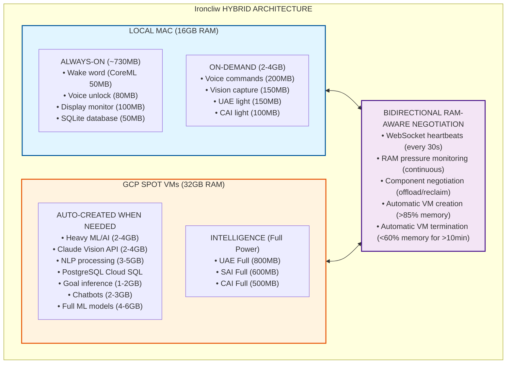
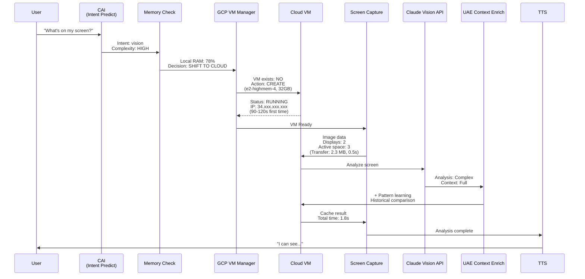
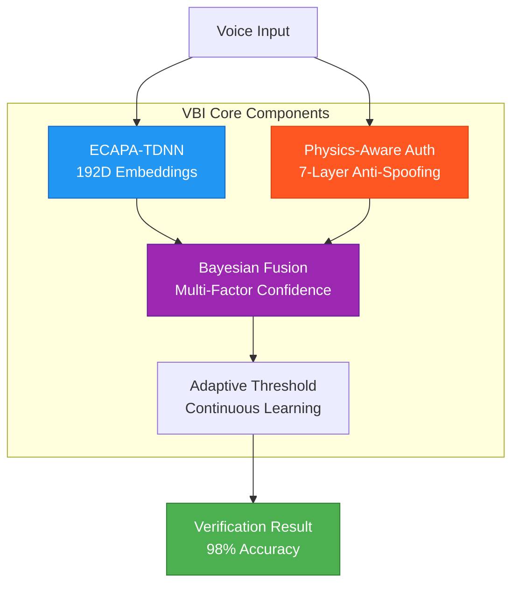

# Architecture & Design

Complete system architecture documentation for Ironcliw AI Agent, including hybrid infrastructure, intelligence systems, component distribution, and data flow.

---

## Table of Contents

1. [Overview](#overview)
2. [Hybrid Architecture](#hybrid-architecture)
3. [Intelligence Systems](#intelligence-systems)
4. [Component Distribution](#component-distribution)
5. [Data Flow Diagrams](#data-flow-diagrams)
6. [Technology Stack](#technology-stack)
7. [Multi-Agent System](#multi-agent-system)
8. [Database Architecture](#database-architecture)
9. [Voice Processing Pipeline](#voice-processing-pipeline)
10. [Vision Integration](#vision-integration)

---

## Overview

Ironcliw features a **state-of-the-art hybrid architecture** with intelligent component lifecycle management that dynamically routes processing between local and cloud based on memory pressure, command complexity, and context.

### Key Architectural Principles

- **Hybrid Computing** - Local Mac (16GB) + GCP Spot VMs (32GB, 60-91% cost savings)
- **Intelligent Routing** - Context-aware command distribution
- **Component Lifecycle** - On-demand loading/unloading based on memory pressure
- **Multi-Agent Intelligence** - 60+ specialized agents working collaboratively
- **Self-Healing** - Automatic error detection and recovery
- **Continuous Learning** - Every interaction improves system intelligence

---

## Hybrid Architecture

### Infrastructure Overview



### Local Mac (16GB RAM)

**Primary Role:** Low-latency operations and always-on services

**Always-On Components (~730MB idle):**
- Wake Word Detection (CoreML, ~50MB)
- Voice Unlock (Biometric, ~80MB)
- Display Monitor (Multi-display, ~100MB)
- SQLite Database (Local cache, ~50MB)
- UAE Light (Context capture, ~150MB)
- CAI Light (Intent detection, ~100MB)
- Learning DB Cache (~50MB)

**On-Demand Components (2-4GB active):**
- Voice Commands (Basic processing, ~200MB)
- Vision Capture (Screen capture only, ~150MB)
- Local processing when memory allows

**Trigger Points:**
- RAM >70% → Shift non-critical to GCP
- RAM >85% → Emergency mode, all heavy processing to GCP
- RAM <60% for 10+ min → Terminate GCP VM

### GCP Spot VMs (32GB RAM, $0.029/hr)

**Primary Role:** Heavy ML/AI processing with 60-91% cost savings

**Auto-Created When:**
- Local memory pressure >85%
- NLP-heavy command received
- Vision analysis requested
- Chat mode activated
- ML model inference needed

**Auto-Terminated When:**
- Local memory <60% for >10 minutes
- No active processing for 15 minutes
- Daily budget limit reached
- Maximum VM count reached

**Components (8-15GB active):**
- Vision (Full) - Claude Vision API + multi-space analysis (2-4GB)
- Voice (NLP Full) - Transformers, sentiment, NLU models (3-5GB)
- Goal Inference - Proactive intelligence + autonomous engine (1-2GB)
- Chatbots (Full) - Claude API, conversation memory (2-3GB)
- ML Models (Full) - All NLP/ML transformers (4-6GB)
- UAE Full - Deep context processing (800MB)
- SAI Full - Self-healing, pattern learning (600MB)
- CAI Full - Complex intent prediction (500MB)
- PostgreSQL - Cloud SQL with full history (200MB + data)

**Cost Optimization:**
```
Spot VMs:         $0.029/hr (vs $0.15-0.30/hr regular VMs)
Savings:          60-91% compared to standard VMs
Typical daily:    2-4 hours = $0.06-$0.12/day
Monthly estimate: ~$2-4/month (vs $15-30 regular VMs)
```

---

## Intelligence Systems

Ironcliw features four unified intelligence systems that work collaboratively:

### UAE (Unified Awareness Engine)

**Purpose:** Master intelligence coordinator that unifies context and situational awareness

**Location:** Both local (light) and cloud (full)

**Responsibilities:**
- Coordinate all intelligence gathering across the system
- Integrate context from vision, voice, and system state
- Make high-level decisions about command routing
- Maintain global awareness of user intent and environment

**Local UAE (Light):**
- Screen state capture (instant)
- Active apps monitoring
- Current desktop space
- Network status
- Basic context aggregation

**Cloud UAE (Full):**
- Context pattern analysis
- Cross-correlation of events
- Historical context trends
- Deep learning from interactions
- Advanced semantic analysis

**File:** `backend/intelligence/unified_awareness_engine.py`

### SAI (Self-Aware Intelligence)

**Purpose:** Self-monitoring, self-healing, and optimization

**Location:** Primarily cloud (full power)

**Features:**
- Automatic error recovery
- Performance optimization
- Circuit breaker integration
- Learn from failures
- Adaptive self-improvement
- Predictive optimization

**Example Flow:**
```python
# SAI automatically heals from errors
try:
    result = await execute_command("complex task")
except Exception as e:
    # SAI detects, analyzes, and fixes
    heal_result = await sai.attempt_self_heal(error=e)
    # Retries with fix applied
    result = await retry_with_fix(heal_result.fix)
```

**Self-Healing Scenarios:**
- API rate limit exceeded → Implement backoff
- Memory pressure → Shift components to cloud
- Network timeout → Switch to fallback provider
- Database lock → Implement retry with exponential backoff

**File:** `backend/intelligence/self_aware_intelligence.py`

### CAI (Context Awareness Intelligence)

**Purpose:** Understand user intent and predict actions

**Location:** Both local (light) and cloud (full)

**Capabilities:**
- Intent prediction from commands
- Proactive assistance
- Context-aware responses
- Personalized suggestions
- Pattern recognition
- User preference learning

**Local CAI (Light):**
- Quick intent detection (<100ms)
- Basic command classification
- Common pattern matching
- Recent context lookup

**Cloud CAI (Full):**
- Complex intent prediction
- Multi-turn conversation understanding
- Historical pattern analysis
- Semantic similarity matching
- Advanced NLP processing

**Example:**
```python
# CAI predicts intent
command = "unlock my screen"
intent = cai.predict_intent(command)
# Returns: {
#   'intent': 'screen_unlock',
#   'confidence': 0.95,
#   'requires_auth': True,
#   'suggested_flow': 'voice_biometric'
# }
```

**File:** `backend/intelligence/context_awareness_intelligence.py`

### learning_database

**Purpose:** Persistent memory across sessions with continuous learning

**Location:** SQLite (local) + PostgreSQL (cloud)

**Features:**
- Store all interactions
- Pattern recognition
- Success rate tracking
- Historical preferences
- Similar command lookup
- User behavior analysis
- Performance metrics

**Database Schema (17 Tables):**
1. `command_history` - All executed commands
2. `command_patterns` - Recognized patterns
3. `user_preferences` - Learned preferences
4. `component_usage` - Component activation stats
5. `error_logs` - Error tracking
6. `performance_metrics` - Response times, success rates
7. `context_snapshots` - System state snapshots
8. `voice_samples` - Speaker embeddings (59 samples)
9. `speaker_profiles` - Voice biometric data
10. `vision_cache` - Cached vision analysis
11. `intent_patterns` - Intent classification history
12. `self_healing_logs` - SAI recovery actions
13. `cost_tracking` - GCP cost monitoring
14. `vm_lifecycle` - VM creation/termination events
15. `component_routing` - Local vs cloud decisions
16. `cache_statistics` - Cache hit rates
17. `learning_events` - Continuous learning updates

**Sync Strategy:**
- Local → Cloud: Every 6 hours (GitHub Actions)
- Cloud → Local: On startup and every 12 hours
- Conflict resolution: Cloud wins (source of truth)
- Backup: Daily snapshots (7-day retention)

**Files:**
- `backend/database/learning_database.py`
- `backend/database/cloud_sql_manager.py`

---

## Component Distribution

### Component States

Each component can exist in one of four states:

1. **Unloaded** - Not in memory (0 MB RAM)
2. **Loading** - Importing modules (50-200 MB RAM)
3. **Active** - Processing requests (varies by component)
4. **Idle** - Loaded but inactive (minimal RAM in swap)

### Component Lifecycle Example

```python
# Vision component lifecycle
State 1: Unloaded (not loaded)              RAM: 0 MB
    ↓ User: "analyze my screen"
State 2: Loading (importing modules)        RAM: 50 MB
    ↓
State 3: Active (processing on GCP)         RAM: 2-4 GB (cloud)
    ↓ Command complete + 5 min idle
State 4: Unloaded (back to swap)            RAM: 0 MB
```

### Priority Levels

Components are prioritized for resource allocation:

1. **CORE** (Never unload) - Wake word, voice unlock, display monitor
2. **HIGH** (Unload last) - UAE light, CAI light, learning DB cache
3. **MEDIUM** (Unload when needed) - Voice commands, vision capture
4. **LOW** (Unload first) - Heavy ML models, chatbots, goal inference

### Routing Decision Matrix

| Command Type | Memory <70% | Memory 70-85% | Memory >85% |
|--------------|-------------|---------------|-------------|
| Wake word | Local | Local | Local (CORE) |
| Screen unlock | Local | Local | Local (CORE) |
| Simple command | Local | Local | Cloud |
| Voice command | Local | Cloud | Cloud |
| Vision capture | Local | Local | Local |
| Vision analyze | Cloud | Cloud | Cloud |
| Chat/conversation | Local | Cloud | Cloud |
| ML inference | Cloud | Cloud | Cloud |
| Goal inference | Local | Cloud | Cloud |

---

## Data Flow Diagrams

### Voice Command Flow

```mermaid
flowchart TD
    Start["User speaks: 'Hey Ironcliw, unlock my screen'"] --> WakeWord["Wake Word Detection<br/>(Local, CoreML, 50MB)<br/>Picovoice - Confidence: HIGH"]
    WakeWord -->|Detected| AudioCapture["Audio Capture<br/>(Local, 3.2s recording)<br/>+ Preprocessing<br/>SNR: 18.5 dB"]
    AudioCapture --> STT["Speech-to-Text<br/>(Local or Cloud based on RAM)<br/>SpeechBrain<br/>RTF: 0.08, Latency: 156ms"]
    STT -->|Text: 'unlock my screen'| Speaker["Speaker Recognition<br/>(Cloud SQL lookup)<br/>ECAPA-TDNN<br/>Confidence: 95%"]
    Speaker -->|Speaker: Derek (OWNER)| Intent["CAI Intent Predict<br/>(Local if RAM allows)<br/>Intent: unlock<br/>Auth required: TRUE"]
    Intent --> Orchestrator["Hybrid Orchestrator<br/>(Routing decision)<br/>Route: Local<br/>(Screen unlock = LOCAL only)"]
    Orchestrator --> TTS1["TTS Response<br/>(Unified engine, cached)<br/>'Of course, Derek'<br/>Playback: pygame"]
    TTS1 --> Execute["Execute Unlock<br/>(Local, macOS keychain)<br/>Password typer<br/>Success: TRUE"]
    Execute --> Verify["Verify + Confirm<br/>(Screen unlocked)<br/>TTS: 'Success'<br/>Total time: 2.8s"]

    style Start fill:#e3f2fd,stroke:#1976d2
    style WakeWord fill:#fff3e0,stroke:#f57c00
    style STT fill:#f3e5f5,stroke:#7b1fa2
    style Speaker fill:#e8f5e9,stroke:#388e3c
    style Execute fill:#fce4ec,stroke:#c2185b
    style Verify fill:#e0f2f1,stroke:#00796b
```

### Vision Analysis Flow



### Component Negotiation Flow

```
┌────────────────────────────────────────────────────────────────────┐
│              RAM-AWARE COMPONENT NEGOTIATION PROTOCOL               │
└────────────────────────────────────────────────────────────────────┘

SCENARIO 1: OFFLOAD (Local RAM >85%)
━━━━━━━━━━━━━━━━━━━━━━━━━━━━━━━━━━━━
Local Mac                          GCP Spot VM
    │                                  │
    │ Heartbeat (RAM: 86%)             │
    ├─────────────────────────────────>│
    │                                  │ Check budget/limits
    │                                  │ Decision: ACCEPT
    │                                  │
    │        OFFLOAD_REQUEST           │
    │ <─────────────────────────────────┤
    │ Components: [VISION, CHATBOTS]   │
    │                                  │
    │ Transfer active contexts         │
    ├─────────────────────────────────>│
    │                                  │ Load components
    │                                  │
    │        OFFLOAD_COMPLETE          │
    │ <─────────────────────────────────┤
    │                                  │
    │ Unload local components          │
    │ RAM: 86% → 62%                   │ RAM: 15% → 45%
    │                                  │

SCENARIO 2: RECLAIM (Local RAM <60% for 10min)
━━━━━━━━━━━━━━━━━━━━━━━━━━━━━━━━━━━━━━━━━━━━
Local Mac                          GCP Spot VM
    │                                  │
    │ Heartbeat (RAM: 58%)             │
    ├─────────────────────────────────>│
    │ Idle time: 12 minutes            │
    │                                  │ Check if safe to reclaim
    │                                  │ Decision: SAFE
    │                                  │
    │       RECLAIM_REQUEST            │
    │ <─────────────────────────────────┤
    │ Components: [VISION]             │
    │                                  │
    │ Accept reclaim                   │
    ├─────────────────────────────────>│
    │                                  │
    │ Receive component state          │
    │ <─────────────────────────────────┤
    │                                  │ Unload component
    │ Load component locally           │
    │                                  │
    │       RECLAIM_COMPLETE           │
    ├─────────────────────────────────>│
    │                                  │
    │ RAM: 58% → 65%                   │ RAM: 45% → 20%
    │                                  │ Check termination criteria
    │                                  │ All components reclaimed
    │                                  │
    │      TERMINATE_NOTICE            │
    │ <─────────────────────────────────┤
    │                                  │ Shutdown in 60s
    │                                  │
    │         ACK                      │
    ├─────────────────────────────────>│
    │                                  │ [VM TERMINATED]
    │                                  │ Cost: $0.12 (4hr session)
```

---

## Technology Stack

### Core Technologies

**Backend:**
- Python 3.10+
- FastAPI (async web framework)
- uvicorn (ASGI server)
- WebSocket (real-time communication)
- asyncio (async/await throughout)

**Frontend:**
- React 18
- TypeScript
- WebSocket client
- Modern ES6+ JavaScript

**Cloud Infrastructure:**
- Google Cloud Platform
- Compute Engine API (VM management)
- Cloud SQL (PostgreSQL)
- Spot VMs (e2-highmem-4, 32GB RAM, $0.029/hr)
- Cloud SQL Proxy (secure database access)

**Databases:**
- SQLite 3 (local, fast, embedded)
- PostgreSQL 14 (cloud, scalable, ACID)
- Dual-database sync strategy
- DB-API 2.0 compliant cursors

### Voice Processing Stack

**Speech-to-Text:**
- SpeechBrain (EncoderDecoderASR)
- Streaming support
- RTF: 0.08 (3x faster than Wav2Vec)
- Latency: <200ms

**Speaker Recognition:**
- ECAPA-TDNN (192-dimensional embeddings)
- Real voice biometrics (not mock)
- Cloud SQL storage (59+ samples per user)
- Cosine similarity scoring

**Wake Word:**
- Picovoice Porcupine (primary)
- Energy-based fallback
- CoreML optimization (Apple Neural Engine)
- Zero CPU usage

**Text-to-Speech:**
- gTTS (Google TTS, cloud-based, primary)
- macOS say (native, fallback)
- pyttsx3 (offline, backup)
- Audio caching with MD5 hashing
- pygame mixer (async playback)

**Audio Preprocessing:**
- Bandpass filtering (300-3400 Hz)
- Dynamic range normalization
- SNR estimation and quality scoring
- Adaptive gain control

### Vision & ML Stack

**Vision Processing:**
- Claude Vision API (Anthropic)
- OpenCV (screen capture)
- Multi-space desktop awareness
- Intelligent coordinate translation

**Machine Learning:**
- Transformers (Hugging Face)
- spaCy (NLP)
- BERT/T5 models
- Fine-tuned embeddings
- ChromaDB (vector similarity)

**macOS Integration:**
- Yabai (window management)
- AppleScript (system automation)
- Quartz (display management)
- Keychain (secure credential storage)

### DevOps & Quality Stack

**Testing:**
- pytest (unit/integration testing)
- hypothesis (property-based testing)
- pytest-asyncio (async test support)
- pytest-cov (coverage reporting)
- pytest-xdist (parallel testing)

**Code Quality:**
- Black (formatting)
- Flake8 (linting)
- Pylint (static analysis)
- MyPy (type checking)
- Bandit (security scanning)
- isort (import sorting)

**CI/CD:**
- GitHub Actions (20+ workflows)
- CodeQL (security analysis)
- Trivy (vulnerability scanning)
- Gitleaks (secret detection)
- Dependabot (dependency updates)

**Monitoring:**
- Real-time metrics
- Cost tracking
- Performance benchmarking
- Error logging
- Health checks

---

## Multi-Agent System

Ironcliw implements a **Hierarchical Multi-Agent System (MAS)** with 60+ specialized agents working collaboratively.

### Three-Tier Architecture

```
TIER 1: MASTER INTELLIGENCE (2 agents)
├── UAE (Unified Awareness Engine)
└── SAI (Self-Aware Intelligence)

TIER 2: CORE DOMAIN AGENTS (28 agents)
├── Vision Intelligence (9 agents)
│   ├── Screen capture
│   ├── Multi-space tracking
│   ├── Claude Vision coordinator
│   ├── OCR processing
│   ├── Template matching
│   ├── Coordinate translation
│   ├── Display detection
│   ├── Window tracking
│   └── Vision caching
│
├── Voice & Audio (6 agents)
│   ├── Wake word detector
│   ├── STT processor
│   ├── Speaker recognizer
│   ├── TTS coordinator
│   ├── Audio preprocessor
│   └── Voice authentication
│
├── Context Intelligence (12 agents)
│   ├── CAI engine
│   ├── Intent predictor
│   ├── Pattern recognizer
│   ├── Context aggregator
│   ├── Session manager
│   ├── History tracker
│   ├── Preference learner
│   ├── Semantic matcher
│   ├── Command classifier
│   ├── Conversation manager
│   ├── Multi-turn handler
│   └── Context enricher
│
├── Display Management (2 agents)
│   ├── Multi-monitor detector
│   └── Display event handler
│
├── System Control (5 agents)
│   ├── Process manager
│   ├── Window controller
│   ├── Automation executor
│   ├── Security manager
│   └── Resource monitor
│
└── Autonomous Systems (3 agents)
    ├── Goal inference engine
    ├── Proactive assistant
    └── Workflow optimizer

TIER 3: SPECIALIZED SUB-AGENTS (30+ agents)
├── Detection agents (coordinate, face, object, change)
├── Classification agents (intent, sentiment, entity)
├── Prediction agents (next action, user need, error)
├── Optimization agents (performance, cost, routing)
├── OCR agents (text extraction, layout analysis)
├── Template matching agents (UI element detection)
├── Pattern learning agents (user behavior, command patterns)
└── Recovery agents (error handling, self-healing)
```

### Agent Communication

**Communication Bus:**
- AsyncIO-based pub/sub messaging
- Priority queues (CRITICAL > HIGH > NORMAL > LOW)
- Request/Response correlation tracking
- Cross-backend messaging (Local ↔ Cloud)
- WebSocket support for real-time updates
- Message persistence for reliability

**Shared Knowledge Graph:**
- NetworkX graph structure
- Nodes = Knowledge entities (concepts, patterns, facts)
- Edges = Relationships (causal, temporal, semantic)
- Attributes = Metadata (confidence, source, timestamp)

**Multi-Agent Orchestrator:**
- Task decomposition & planning
- Agent capability matching
- Load balancing & resource allocation
- Conflict resolution
- Fault tolerance & recovery

---

## Database Architecture

### Dual Database System

**SQLite (Local):**
- Fast, embedded, zero-config
- Recent interactions cache (last 7 days)
- Pattern recognition buffer
- Low-latency queries (<10ms)
- ~50MB RAM footprint
- File: `backend/database/jarvis_local.db`

**PostgreSQL (Cloud SQL):**
- Scalable, ACID compliant
- Full historical data
- Advanced analytics
- Complex queries
- Cloud-hosted (GCP)
- Accessed via Cloud SQL Proxy

### Database Schema

**17 Core Tables:**

1. **command_history** - All executed commands with results
2. **command_patterns** - Recognized patterns and success rates
3. **user_preferences** - Learned user preferences
4. **component_usage** - Component activation statistics
5. **error_logs** - Error tracking and recovery actions
6. **performance_metrics** - Response times, latency, throughput
7. **context_snapshots** - System state at command time
8. **voice_samples** - Raw audio samples for training
9. **speaker_profiles** - Voice biometric data (embeddings)
10. **vision_cache** - Cached vision analysis results
11. **intent_patterns** - Intent classification history
12. **self_healing_logs** - SAI recovery actions and outcomes
13. **cost_tracking** - GCP cost monitoring and budgets
14. **vm_lifecycle** - VM creation/termination events
15. **component_routing** - Local vs cloud routing decisions
16. **cache_statistics** - Cache hit rates and performance
17. **learning_events** - Continuous learning updates

### Synchronization Strategy

**Local → Cloud (Every 6 hours):**
```python
# GitHub Actions workflow
- Export new patterns from SQLite
- Upload to PostgreSQL Cloud SQL
- Aggregate statistics
- Clean up old local data (>7 days)
```

**Cloud → Local (On startup + every 12 hours):**
```python
# On Ironcliw startup
- Download recent patterns from Cloud SQL
- Populate SQLite cache
- Sync user preferences
- Update speaker profiles
```

**Conflict Resolution:**
- Cloud is source of truth
- Local changes uploaded on sync
- Timestamps used for conflict detection
- Merge strategy: Cloud wins, log conflicts

---

## Voice Processing Pipeline

See [Voice Processing Pipeline](#voice-processing-stack) section above for complete details.

### Voice Biometric Intelligence (VBI) v4.0

Ironcliw features an advanced **Voice Biometric Intelligence (VBI)** system for secure voice authentication:



**Key Metrics:**
- Speaker Verification: 98% accuracy
- Anti-Spoofing: 99.7% detection rate
- Authentication Latency: 1.2s (cached)
- False Rejection Rate: 2.1%

📚 **Complete Documentation:** [VOICE_BIOMETRIC_INTELLIGENCE_ARCHITECTURE.md](../VOICE_BIOMETRIC_INTELLIGENCE_ARCHITECTURE.md)

### End-to-End Voice Flow

```
Audio Input (Microphone)
         │
         ▼
Wake Word Detection (Picovoice/Energy-based)
         │
         ▼
Audio Capture (3-5 seconds, 16kHz)
         │
         ▼
Preprocessing (Bandpass, Normalize, SNR)
         │
         ▼
Speech-to-Text (SpeechBrain, <200ms)
         │
         ▼
Speaker Recognition (ECAPA-TDNN, 95%+ confidence)
         │
         ▼
Intent Prediction (CAI, local or cloud)
         │
         ▼
Command Routing (Hybrid Orchestrator)
         │
         ▼
Command Execution (Local or Cloud)
         │
         ▼
TTS Response (Unified engine, cached)
         │
         ▼
Audio Playback (pygame mixer, async)
```

---

## Vision Integration

### Claude Vision API Integration

Ironcliw uses Anthropic's Claude Vision API for advanced screen understanding:

**Capabilities:**
- Screen content analysis
- UI element detection
- Text recognition (OCR)
- Layout understanding
- Context extraction
- Multi-space awareness

**Integration Flow:**
```python
# Capture screen (Local, macOS)
screenshot = capture_active_display()

# Send to Cloud for analysis
response = await claude_vision.analyze(
    image=screenshot,
    context="What elements are on screen?",
    model="claude-3-opus-20240229"
)

# Enrich with UAE context
enriched = await uae.enrich_vision_context(
    vision_result=response,
    historical_patterns=learning_db.get_patterns()
)

# Return to user
return enriched.natural_language_response
```

### Multi-Space Desktop Awareness

**macOS Integration:**
- Yabai for desktop space tracking
- Quartz for display management
- Real-time space change detection
- Window position tracking

**Intelligent Coordinate Translation:**
- Convert screen coordinates to window-relative
- Handle multi-monitor setups
- Account for desktop space offsets
- Retina display scaling support

---

## Summary

Ironcliw's architecture is designed for:

- **Performance** - Hybrid local/cloud processing for optimal speed
- **Efficiency** - Intelligent resource management and cost optimization
- **Intelligence** - Multi-agent system with continuous learning
- **Reliability** - Self-healing, monitoring, and automatic recovery
- **Scalability** - Auto-scaling GCP infrastructure
- **Security** - Voice biometrics, encrypted storage, secure communication

The architecture supports current production features while enabling future expansion through the modular, agent-based design.

---

**Related Documentation:**
- [Setup & Installation](Setup-&-Installation.md) - Get started with Ironcliw
- [API Documentation](API-Documentation.md) - API reference
- [Troubleshooting Guide](Troubleshooting-Guide.md) - Common issues

**External Resources:**
- [HYBRID_ARCHITECTURE.md](../HYBRID_ARCHITECTURE.md) - 7500+ line detailed guide
- [Ironcliw_MULTI_AGENT_SYSTEM_DOCUMENTATION.md](../Ironcliw_MULTI_AGENT_SYSTEM_DOCUMENTATION.md)
- [Ironcliw_NEURAL_MESH_ARCHITECTURE.md](../Ironcliw_NEURAL_MESH_ARCHITECTURE.md)

---

**Last Updated:** 2025-10-30
**Version:** 17.4.0
