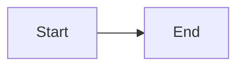

# 🎨 Diagram System Documentation

Complete guide to the Ironcliw Auto-Diagram Generation System, including Mermaid integration, GitHub Actions automation, and best practices.

---

## Table of Contents

1. [Overview](#overview)
2. [Mermaid Integration](#mermaid-integration)
3. [Auto-Generation Workflow](#auto-generation-workflow)
4. [Creating Diagrams](#creating-diagrams)
5. [Advanced Features](#advanced-features)
6. [Best Practices](#best-practices)
7. [Troubleshooting](#troubleshooting)

---

## Overview

The Ironcliw Diagram System provides:

- **Native Mermaid Support** - Diagrams render automatically in GitHub markdown
- **Auto-Generation** - Automatic PNG/SVG/PDF generation via GitHub Actions
- **Intelligent Caching** - Only regenerates changed diagrams
- **Async Processing** - Parallel diagram rendering for speed
- **Change Detection** - Smart detection of modified source files
- **Multiple Formats** - SVG, PNG, and PDF output

### Architecture


---

## Mermaid Integration

### Supported Diagram Types

Mermaid supports many diagram types:

1. **Flowcharts** - Process flows, decision trees
2. **Sequence Diagrams** - Interaction flows, API calls
3. **Class Diagrams** - Object relationships, architecture
4. **State Diagrams** - State machines, workflows
5. **Entity Relationship** - Database schemas
6. **Gantt Charts** - Project timelines
7. **Pie Charts** - Data visualization
8. **Git Graphs** - Branch visualization

### Basic Syntax

#### Flowchart Example


**Code:**
```markdown
\`\`\`mermaid
flowchart LR
    A[Start] --> B{Decision}
    B -->|Yes| C[Action 1]
    B -->|No| D[Action 2]
    C --> E[End]
    D --> E
\`\`\`
```

#### Sequence Diagram Example


**Code:**
```markdown
\`\`\`mermaid
sequenceDiagram
    participant User
    participant API
    participant DB

    User->>API: Request Data
    API->>DB: Query
    DB-->>API: Results
    API-->>User: Response
\`\`\`
```

### Styling Diagrams

You can customize diagram appearance:


**Code:**
```markdown
\`\`\`mermaid
flowchart TD
    A[Node A] --> B[Node B]
    B --> C[Node C]

    style A fill:#e1f5ff,stroke:#01579b,stroke-width:3px
    style B fill:#fff3e0,stroke:#e65100,stroke-width:3px
    style C fill:#e8f5e9,stroke:#2e7d32,stroke-width:3px
\`\`\`
```

---

## Auto-Generation Workflow

### How It Works

The Auto-Diagram Generator workflow (`.github/workflows/auto-diagram-generator.yml`) provides:

1. **Dynamic Discovery** - Finds all `.mmd` files and mermaid blocks in markdown
2. **Change Detection** - Uses git diff and file hashing to detect changes
3. **Parallel Processing** - Generates up to 10 diagrams simultaneously
4. **Multiple Formats** - Creates SVG, PNG, and PDF versions
5. **Metadata Tracking** - Stores source hash, generation time, etc.
6. **Automatic Commit** - Commits generated diagrams back to repo

### Workflow Triggers

The workflow runs automatically on:

- **Push** to `main` or `develop` branches
- **Pull Requests** that modify diagrams
- **Manual Dispatch** with custom options

### Manual Trigger

You can manually trigger diagram generation:

1. Go to Actions → Auto-Diagram Generator
2. Click "Run workflow"
3. Choose options:
   - **Force regenerate:** Regenerate all diagrams (ignores cache)
   - **Output format:** Choose SVG, PNG, PDF, or all

### Workflow Jobs


---

## Creating Diagrams

### Method 1: Inline in Markdown (Recommended for Wiki)

Add mermaid code blocks directly in markdown files:

```markdown
## System Architecture

\`\`\`mermaid
flowchart TB
    A[Component A] --> B[Component B]
    B --> C[Component C]
\`\`\`
```

**Pros:**
- Renders immediately on GitHub
- Works in wiki, docs, README
- No separate file needed

**Cons:**
- Multiple diagrams in one file

### Method 2: Standalone `.mmd` Files

Create dedicated `.mmd` files:

**File: `diagrams/architecture/system-overview.mmd`**


**Pros:**
- Reusable across multiple documents
- Easier to maintain large diagrams
- Can be imported by reference

**Cons:**
- Requires workflow to generate images
- Not visible inline in markdown

### Method 3: Hybrid Approach

Use standalone `.mmd` files and reference in markdown:

**File: `diagrams/flow.mmd`**


**In markdown:**
```markdown
## Process Flow


```

---

## Advanced Features

### 1. Dynamic File Discovery

The workflow automatically discovers:
- All `.mmd` files in the repository
- Mermaid code blocks in `.md` files
- Nested directory structures
- Ignores `node_modules`, `.git`, etc.

No configuration needed - just add diagrams!

### 2. Intelligent Change Detection

Only regenerates diagrams when:
- Source file has been modified
- Output file doesn't exist
- Force regeneration is requested

Uses SHA-256 hashing for accurate detection.

### 3. Async Parallel Rendering

Generates up to 10 diagrams simultaneously using GitHub Actions matrix strategy:

```yaml
strategy:
  matrix: ${{ fromJson(needs.discover-diagrams.outputs.diagram_matrix) }}
  max-parallel: 10
  fail-fast: false
```

### 4. Metadata Tracking

Each generated diagram includes a `.meta.json` file:

```json
{
  "source": "wiki/Architecture-&-Design.md",
  "source_type": "embedded",
  "source_hash": "a1b2c3d4...",
  "format": "svg",
  "generated_at": "2025-10-30T20:00:00Z",
  "generator": "mermaid-cli@10.9.0",
  "file_size": 12345,
  "workflow_run": "1234567890",
  "commit_sha": "abc123..."
}
```

### 5. Caching

Uses multiple cache layers:
- **Node modules cache** - Speeds up mermaid-cli installation
- **Diagram cache** - Skips unchanged diagrams
- **Artifact storage** - 90-day retention

### 6. Output Formats

Generates three formats with different use cases:

| Format | Use Case | Options |
|--------|----------|---------|
| **SVG** | Web, scaling, best quality | Transparent background |
| **PNG** | Documentation, presentations | White background, 2048x1536 |
| **PDF** | Print, reports | PDF fit enabled |

---

## Best Practices

### 1. Diagram Organization

**Recommended structure:**
```
diagrams/
├── architecture/
│   ├── system-overview.mmd
│   └── component-detail.mmd
├── flows/
│   ├── voice-command.mmd
│   └── vision-analysis.mmd
└── generated/
    ├── architecture/
    ├── flows/
    └── INDEX.md
```

### 2. Naming Conventions

Use descriptive, kebab-case names:
- ✅ `voice-command-flow.mmd`
- ✅ `hybrid-architecture-overview.mmd`
- ❌ `diagram1.mmd`
- ❌ `flow.mmd`

### 3. Diagram Complexity

Keep diagrams focused and readable:
- **Simple:** 5-10 nodes
- **Medium:** 10-20 nodes
- **Complex:** 20+ nodes (consider splitting)

### 4. Styling Consistency

Use consistent colors from the Ironcliw palette:


**Color Palette:**
- **Blue** (`#e1f5ff`, `#01579b`) - Core systems, local
- **Orange** (`#fff3e0`, `#e65100`) - Cloud, processing
- **Green** (`#e8f5e9`, `#2e7d32`) - Intelligence, success
- **Purple** (`#f3e5f5`, `#4a148c`) - Coordination, middleware
- **Red** (`#fce4ec`, `#c2185b`) - Security, critical

### 5. Documentation

Add comments in complex diagrams:


### 6. Testing

Test diagrams locally before committing:

```bash
# Install mermaid-cli
npm install -g @mermaid-js/mermaid-cli

# Generate diagram
mmdc -i diagram.mmd -o diagram.svg

# Open in browser
open diagram.svg
```

---

## Troubleshooting

### Common Issues

#### Issue: "Diagram not rendering in GitHub"

**Solution:**
- Ensure code block starts with `\`\`\`mermaid`
- Check for syntax errors in diagram code
- Verify diagram type is supported
- Try clearing browser cache

#### Issue: "Workflow not triggering"

**Solution:**
```bash
# Check workflow file syntax
yamllint .github/workflows/auto-diagram-generator.yml

# Verify path filters in workflow trigger
# Make sure changed files match patterns:
# - '**.mmd'
# - '**.md'
```

#### Issue: "Diagram generation fails"

**Solution:**
1. Check workflow logs in Actions tab
2. Verify mermaid syntax is valid
3. Test locally with mmdc
4. Check for special characters that need escaping

#### Issue: "Large diagrams truncated"

**Solution:**
Adjust diagram size in workflow:
```yaml
# In auto-diagram-generator.yml
extra_args="--width 4096 --height 3072"
```

#### Issue: "Diagrams not in correct location"

**Solution:**
- Generated diagrams go to `diagrams/generated/`
- Check `INDEX.md` for full list
- Source files can be anywhere
- Output follows source directory structure

### Debugging

Enable debug mode:

```yaml
# In workflow file
env:
  DEBUG: true
```

Check logs:
```bash
# View workflow logs
gh run view <run-id> --log

# View specific job
gh run view <run-id> --job=generate-diagrams --log
```

---

## Configuration Reference

### Workflow Configuration

**Location:** `.github/workflows/auto-diagram-generator.yml`

**Key settings:**
```yaml
env:
  CACHE_VERSION: v1          # Increment to bust cache
  NODE_VERSION: '20'         # Node.js version
  MERMAID_CLI_VERSION: '10.9.0'  # mermaid-cli version

strategy:
  max-parallel: 10           # Parallel diagram generation
  fail-fast: false           # Continue on errors
```

### Mermaid Configuration

**Location:** `.github/workflows/config/mermaid-config.json`

**Default config:**
```json
{
  "theme": "default",
  "themeVariables": {
    "primaryColor": "#e1f5ff",
    "primaryTextColor": "#01579b",
    "primaryBorderColor": "#01579b",
    "lineColor": "#0277bd",
    "secondaryColor": "#fff3e0",
    "tertiaryColor": "#f3e5f5"
  },
  "flowchart": {
    "curve": "basis",
    "padding": 20
  },
  "sequence": {
    "actorMargin": 50,
    "boxMargin": 10,
    "messageMargin": 35
  }
}
```

---

## Examples

### Full System Architecture

See [Architecture & Design](Architecture-&-Design.md#infrastructure-overview) for complex multi-component diagrams.

### Voice Processing Flow

See [Architecture & Design](Architecture-&-Design.md#voice-command-flow) for sequence-based flows.

### Data Flow Diagrams

See [Architecture & Design](Architecture-&-Design.md#data-flow-diagrams) for data movement visualization.

---

## Resources

### Official Documentation
- [Mermaid Documentation](https://mermaid.js.org/)
- [Mermaid Live Editor](https://mermaid.live/) - Test diagrams
- [GitHub Mermaid Support](https://github.blog/2022-02-14-include-diagrams-markdown-files-mermaid/)

### Tools
- [mermaid-cli](https://github.com/mermaid-js/mermaid-cli) - Command-line tool
- [Mermaid Chart](https://www.mermaidchart.com/) - Visual editor
- [VS Code Extension](https://marketplace.visualstudio.com/items?itemName=bierner.markdown-mermaid) - Preview in VS Code

### Community
- [Mermaid GitHub](https://github.com/mermaid-js/mermaid)
- [Discussions](https://github.com/mermaid-js/mermaid/discussions)
- [Stack Overflow](https://stackoverflow.com/questions/tagged/mermaid)

---

## Summary

The Ironcliw Diagram System provides:

✅ **Zero-config Mermaid support** in all markdown files
✅ **Auto-generation workflow** for PNG/SVG/PDF
✅ **Intelligent caching** and change detection
✅ **Parallel async processing** for speed
✅ **Multiple output formats** for different use cases
✅ **Comprehensive metadata** tracking
✅ **Automatic commits** and PR comments

**Next Steps:**
1. Add Mermaid diagrams to your documentation
2. Commit changes to trigger auto-generation
3. Check `diagrams/generated/INDEX.md` for outputs
4. View rendered diagrams in GitHub

---

**Related Documentation:**
- [Architecture & Design](Architecture-&-Design.md) - Example diagrams
- [Home](Home.md) - Overview with diagrams
- [Setup & Installation](Setup-&-Installation.md) - Getting started

**Workflow:**
- [Auto-Diagram Generator](../.github/workflows/auto-diagram-generator.yml) - Full workflow code

---

**Last Updated:** 2025-10-30
**Version:** 1.0.0
