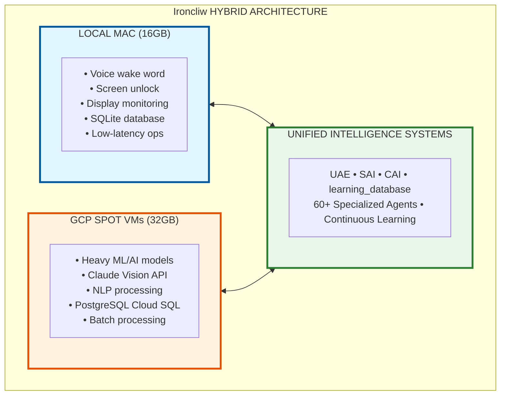

# Ironcliw AI Agent - Wiki Home

Welcome to the official documentation for **Ironcliw AI Agent** - an intelligent, voice-activated AI assistant featuring production-grade voice biometrics, hybrid cloud architecture, and advanced multi-agent intelligence systems.

---

## Quick Navigation

### Getting Started
- [Setup & Installation](Setup-&-Installation.md) - Complete setup guide from zero to running
- [Quick Start Guide](Setup-&-Installation.md#quick-start) - Get Ironcliw running in 10 minutes
- [Architecture Overview](Architecture-&-Design.md) - Understand the system design

### Core Documentation
- [Architecture & Design](Architecture-&-Design.md) - Complete system architecture
- [Diagram System](Diagram-System.md) - Mermaid integration and auto-generation
- [API Documentation](API-Documentation.md) - REST, WebSocket, and Voice APIs
- [CI/CD Workflows](CI-CD-Workflows.md) - GitHub Actions automation
- [Troubleshooting Guide](Troubleshooting-Guide.md) - Common issues and solutions

### Advanced Topics
- [MAS Roadmap](MAS-Roadmap.md) - Multi-Agent System future development
- [Edge Cases & Testing](Edge-Cases-&-Testing.md) - Comprehensive testing scenarios
- [Contributing Guidelines](Contributing-Guidelines.md) - How to contribute

---

## What is Ironcliw?

**Ironcliw** (Just A Rather Very Intelligent System) is a sophisticated AI assistant that combines:

- **Production Voice System** - Real ECAPA-TDNN embeddings, SpeechBrain STT, unified TTS
- **Voice Biometric Authentication** - Secure screen unlock with 95%+ confidence matching
- **Hybrid Cloud Architecture** - Local Mac (16GB) + GCP Spot VMs (32GB, 60-91% cost savings)
- **Multi-Agent Intelligence** - 60+ specialized agents (UAE, SAI, CAI, learning_database)
- **Advanced Vision** - Claude Vision API integration with multi-space desktop awareness
- **Continuous Learning** - Every interaction improves system intelligence
- **Self-Healing** - Automatic error detection and recovery

---

## Key Features at a Glance

### Voice & Audio
- Wake word detection (Picovoice Porcupine)
- Speech-to-Text (SpeechBrain - 3x faster, <200ms latency)
- Speaker recognition (ECAPA-TDNN, 192-dimensional embeddings)
- Unified TTS engine (gTTS, macOS say, pyttsx3)
- Personalized voice responses
- Voice-authenticated screen unlock

### Intelligence Systems
- **UAE** (Unified Awareness Engine) - Master context coordination
- **SAI** (Self-Aware Intelligence) - Self-healing and optimization
- **CAI** (Context Awareness Intelligence) - Intent prediction
- **learning_database** - Persistent memory with Cloud SQL sync

### Hybrid Cloud Infrastructure
- **Local Mac (16GB RAM)** - Always-on components, low-latency ops
- **GCP Spot VMs (32GB RAM, $0.029/hr)** - Heavy ML/AI processing
- **Auto-scaling** - Creates VMs at >85% memory, terminates when <60%
- **Cost Optimization** - 60-91% savings vs regular VMs ($2-4/month vs $15-30)

### Vision & Desktop Control
- Multi-space desktop awareness
- Claude Vision API integration
- Screen capture and analysis
- Intelligent coordinate translation
- Display monitor integration

---

## System Architecture Overview

---

## Technology Stack

### Core Technologies
- **Backend:** Python 3.10+, FastAPI, uvicorn
- **Frontend:** React, TypeScript, WebSocket
- **Cloud:** GCP Spot VMs, Cloud SQL, Compute Engine API
- **Databases:** SQLite (local), PostgreSQL (cloud)
- **Voice:** SpeechBrain, Picovoice, gTTS, pyttsx3
- **Vision:** Claude Vision API, OpenCV
- **ML/AI:** ECAPA-TDNN, transformers, spaCy

### Intelligence & AI
- Unified Awareness Engine (UAE)
- Self-Aware Intelligence (SAI)
- Context Awareness Intelligence (CAI)
- Learning Database with pattern recognition
- Advanced NLP and semantic analysis

### DevOps & CI/CD
- **Testing:** pytest, hypothesis, property-based testing
- **CI/CD:** GitHub Actions (20+ workflows)
- **Quality:** Black, Flake8, Pylint, MyPy, Bandit
- **Security:** CodeQL, Trivy, Gitleaks
- **Monitoring:** Real-time metrics, cost tracking

---

## Quick Links

### Documentation
- [HYBRID_ARCHITECTURE.md](../HYBRID_ARCHITECTURE.md) - 2000+ line architecture guide
- [README.md](../README.md) - Main project README
- [Ironcliw_MULTI_AGENT_SYSTEM_DOCUMENTATION.md](../Ironcliw_MULTI_AGENT_SYSTEM_DOCUMENTATION.md) - MAS details
- [Ironcliw_NEURAL_MESH_ARCHITECTURE.md](../Ironcliw_NEURAL_MESH_ARCHITECTURE.md) - Neural mesh integration

### Setup Guides
- [GCP_VM_AUTO_CREATION_IMPLEMENTATION.md](../GCP_VM_AUTO_CREATION_IMPLEMENTATION.md) - Auto-scaling VMs
- [CLOUD_SQL_PROXY_SETUP.md](../CLOUD_SQL_PROXY_SETUP.md) - Database setup
- [VOICE_UNLOCK_INTEGRATION.md](../VOICE_UNLOCK_INTEGRATION.md) - Voice unlock setup

### GitHub Resources
- [GitHub Actions README](.github/workflows/README.md) - CI/CD workflows
- [Contributing Guidelines](Contributing-Guidelines.md) - How to contribute
- [Issues](https://github.com/derekjrussell/Ironcliw-AI-Agent/issues) - Report bugs

---

## Performance Metrics

### Voice System
- **STT Latency:** <200ms (SpeechBrain)
- **Speaker Recognition:** 95%+ confidence
- **RTF (Real-Time Factor):** 0.08 (3x faster than previous)
- **TTS Cache Hit Rate:** 50% = 50% latency reduction

### Hybrid Cloud
- **Local → Cloud Shift:** 5-15s → 1-3s response time
- **Cost Savings:** 60-91% vs regular VMs
- **Auto-Scale Threshold:** >85% memory creates VM, <60% terminates
- **Typical Usage:** 2-4 hours/day = $2-4/month

### Intelligence Systems
- **Pattern Recognition:** Continuous learning from every interaction
- **Self-Healing:** Automatic error recovery with SAI
- **Context Awareness:** Real-time multi-space desktop tracking
- **Database Sync:** Every 6 hours (local ↔ cloud)

---

## Current Version

**v17.4.0 - Production Voice System Edition**

### Recent Updates
- Production-grade voice system overhaul
- Real ECAPA-TDNN speaker embeddings
- SpeechBrain STT engine (3x faster)
- Unified TTS with multi-provider support
- Advanced voice enrollment system
- Cloud SQL voice biometric storage
- 20+ GitHub Actions workflows
- Comprehensive testing framework

---

## Community & Support

### Getting Help
1. Check the [Troubleshooting Guide](Troubleshooting-Guide.md)
2. Search existing [GitHub Issues](https://github.com/derekjrussell/Ironcliw-AI-Agent/issues)
3. Review relevant documentation pages
4. Create a new issue with detailed information

### Contributing
We welcome contributions! See [Contributing Guidelines](Contributing-Guidelines.md) for:
- Code contribution process
- Development setup
- Testing requirements
- PR guidelines

---

## Project Status

### Production Ready
- Voice biometric authentication
- Hybrid cloud architecture
- Multi-agent intelligence systems
- CI/CD automation
- Comprehensive testing

### In Development
- Neural Mesh integration
- Advanced ML model deployment
- Multi-agent coordination
- Extended automation capabilities

### Planned
- Phase 3: ML Model Deployment & Component Activation
- Phase 4: Multi-Agent Coordination
- Phase 5: Full Autonomous Operation

See [MAS Roadmap](MAS-Roadmap.md) for detailed development plans.

---

## License

This project is proprietary software developed by Derek J. Russell.

---

## Acknowledgments

Special thanks to:
- Anthropic for Claude AI and Vision API
- Google Cloud Platform for infrastructure
- Open source communities for amazing tools

---

**Last Updated:** 2025-10-30
**Version:** 17.4.0
**Status:** Production
